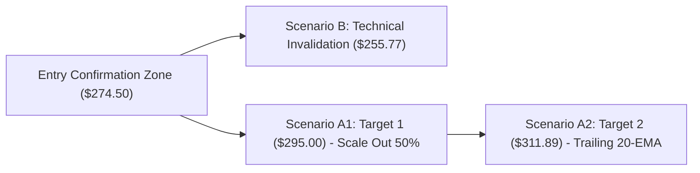

# 🚀 VP TOP OPPORTUNITY RADAR: High-Conviction Setups & Scenario Briefing ประจำวันที่ 8 สิงหาคม 2026

เรดาร์สแกนโอกาสการวิเคราะห์ราคาเชิงสถิติ (Quantitative Scenario Briefing) สรุป 3 หุ้นเด่นความน่าจะเป็นสูงสำหรับสมาชิกระดับ VP & VIP พร้อมสคริปต์คลิปวิดีโอ 3 นาทีสำหรับเข้าถึงข้อมูลก่อนใคร (Early Access)

---

## 👑 1. ตารางคะแนนความเชื่อมั่นและการวางฉากทัศน์ราคา (Top 3 Scenario Radar)

*สัญลักษณ์ความเชื่อมั่น: 🟢 สูง (High Conviction - คะแนน >= 80) | 🟡 ปานกลาง (Moderate Conviction - คะแนน 70-79)*

| Ticker | หุ้น | ราคาปิด ($) | คะแนนความเชื่อมั่น (Conviction Score) | R/R Ratio | จุดยืนยันสัญญาณ (Entry Confirmation Zone) | จุดยกเลิกแผน (Technical Invalidation Level) | ปัจจัยเติบโตหลัก (Key Growth Catalyst) |
| :--- | :--- | :--- | :--- | :--- | :--- | :--- | :--- |
| **NVDA** | NVIDIA Corp | **$223.96** | 🟢 **85 / 100** | **1:2.0** | ปิดแท่ง 15 นาทีเหนือ **$224.00** | **$208.66** | ออเดอร์ชิป Blackwell เร่งตัวขึ้นสูง |
| **AMZN** | Amazon.com Inc | **$274.48** | 🟢 **85 / 100** | **1:2.0** | ปิดแท่ง 15 นาทีเหนือ **$274.50** | **$255.77** | รายได้ AWS เติบโตแข็งแกร่งเกินคาด |
| **PLTR** | Palantir Tech | **$172.01** | 🟡 **70 / 100** | **1:2.2** | ย่อตัวสะสม **$165.00 - $170.00** | **$154.04** | การขยายตัวของระบบ AIP ภาคองค์กร |

---

## 📊 2. ผังการเดินทางของฉากทัศน์ราคา (Visual Scenario Flowchart)

### 📌 NVDA Scenario Flowchart:

### 📌 AMZN Scenario Flowchart:

---

## 🎬 3. สคริปต์คลิปวิดีโอสรุป 3 นาทีสำหรับสมาชิก (3-Min Executive Briefing Video Script)

**[เวลา 0:00 - 0:30] ทักทายสมาชิก & อัปเดตภาพรวม:**
"สวัสดีครับสมาชิกระดับ VP และ VIP ทุกท่าน ขอต้อนรับสู่รายการ 'เสพข่าวก่อนเทรด หุ้นอเมริกา' ช่วง **Top Opportunity Radar** ประจำวันที่ 8 สิงหาคม 2026 วันนี้เราคัด 3 หุ้นเด่นพร้อมกรอบการวางฉากทัศน์ราคาเชิงสถิติ (Scenario Planning) มาอัปเดตให้ฟังก่อนตลาดเปิดครับ"

**[เวลา 0:30 - 2:00] สรุปการวางฉากทัศน์ราคา 3 หุ้นเด่น:**
"ตัวแรก **NVDA** ราคาปิด $223.96 จุดยืนยันสัญญาณอยู่เหนือ $224.00 เป้าหมายฉากทัศน์ A ที่ $254.57 และมีจุดยกเลิกแผน B ที่ $208.66 คุ้มค่าด้วย R/R 1:2.0 ครับ! 
ตัวที่สอง **AMZN** ราคา $274.48 จุดยืนยันสัญญาณ $274.50 เป้าหมาย A ที่ $311.89 จุดยกเลิกแผน B ที่ $255.77 
และตัวที่สาม **PLTR** ราคา $172.01 ย่อสะสมบริเวณ $168.00 ลุ้นทดสอบ $207.94 โดยมีจุดยกเลิกแผนที่ $154.04"

**[เวลา 2:00 - 3:00] วินัยการคุมความเสี่ยง & ปิดท้าย:**
"ย้ำเตือนสมาชิกบริหารความเสี่ยงด้วย Position Sizing ไม่เกิน 1.5% ของพอร์ตเมื่อราคาหลุดจุดยกเลิกแผนครับ ขอบคุณสมาชิกร่วมทางทุกท่านครับ!"

---

## 🌐 แหล่งข้อมูลอ้างอิง (Sources)
- [TradingView Technical Radar](https://www.tradingview.com/)
- [Yahoo Finance Quantitative Screener](https://finance.yahoo.com/)
- [SEC EDGAR Database](https://www.sec.gov/edgar)

---

> [!WARNING]
> **คำเตือนความเสี่ยง (Financial Disclaimer):** รายงานฉบับนี้จัดทำขึ้นเพื่อวัตถุประสงค์ในการให้ข้อมูลและการศึกษาวิเคราะห์ทางสถิติเท่านั้น ไม่ถือเป็นคำแนะนำทางการเงิน การลงทุน หรือคำชี้ชวนในการซื้อขายหลักทรัพย์ การลงทุนมีความเสี่ยง ผู้ลงทุนควรศึกษาข้อมูลก่อนตัดสินใจลงทุน
