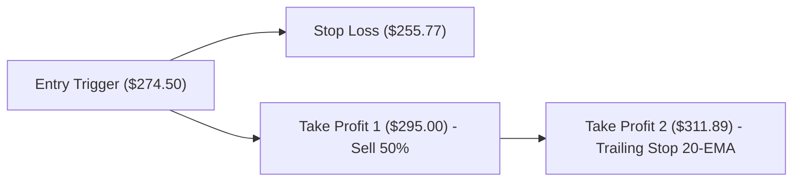

# 🚀 VP TOP OPPORTUNITY RADAR: High-Conviction Setups ประจำวันที่ 8 สิงหาคม 2026

เรดาร์สแกนโอกาสลงทุนความเชื่อมั่นสูง (High-Conviction Setups) สรุป 3 หุ้นเด่นความน่าจะเป็นสูงสำหรับสมาชิกระดับ VP & VIP พร้อมสคริปต์คลิปวิดีโอ 3 นาทีสำหรับเข้าถึงข้อมูลก่อนใคร (Early Access)

---

## 👑 1. ตารางคะแนนความเชื่อมั่นและ 3 หุ้นเด่นประจำสัปดาห์ (Top 3 Conviction Radar)

| Ticker | หุ้น | ราคาปิด ($) | คะแนนความเชื่อมั่น (Conviction Score) | R/R Ratio | ปัจจัยเติบโตหลัก (Key Growth Catalyst) | คำแนะนำ |
| :--- | :--- | :--- | :--- | :--- | :--- | :--- |
| **NVDA** | NVIDIA Corp | **$223.96** | **85 / 100** | **1:2.0** | ออเดอร์ชิป Blackwell เร่งตัวขึ้นสูง | Buy on Breakout |
| **AMZN** | Amazon.com Inc | **$274.48** | **85 / 100** | **1:2.0** | รายได้ AWS เติบโตแข็งแกร่งเกินคาด | Buy on Dip |
| **PLTR** | Palantir Tech | **$172.01** | **70 / 100** | **1:2.2** | การขยายตัวของระบบ AIP ภาคองค์กรเอกชน | Momentum Follow |

---

## 📊 2. ผังขั้นตอนการถือครองราคา (Visual Trade Plan Flowchart)

### 📌 NVDA Trade Plan Flowchart:

### 📌 AMZN Trade Plan Flowchart:

---

## 🎬 3. สคริปต์คลิปวิดีโอสรุป 3 นาทีสำหรับสมาชิก (3-Min Executive Briefing Video Script)

**[เวลา 0:00 - 0:30] ทักทายสมาชิก & อัปเดตภาพรวม:**
"สวัสดีครับสมาชิกระดับ VP และ VIP ทุกท่าน ขอต้อนรับสู่รายการ 'เสพข่าวก่อนเทรด หุ้นอเมริกา' ช่วง **Top Opportunity Radar** ประจำวันที่ 8 สิงหาคม 2026 วันนี้เราคัด 3 หุ้นความเชื่อมั่นสูงที่มี Risk/Reward คุ้มค่าที่สุดมาให้สมาชิกเตรียมออเดอร์ก่อนตลาดเปิดครับ"

**[เวลา 0:30 - 2:00] สรุป 3 หุ้นเด่น:**
"ตัวแรก **NVDA** ราคาปิด $223.96 จุด Trigger อยู่ที่การยืนเหนือ $224.00 พร้อมวอลุ่ม Target อยู่ที่ $254.57 วาง Stop Loss ที่ $208.66 คุ้มค่าด้วย R/R 1:2.0 ครับ! 
ตัวที่สอง **AMZN** ราคา $274.48 แรงหนุนงบ AWS แข็งแกร่ง วางเป้าทำกำไรที่ $311.89 และ SL $255.77 
และตัวที่สาม **PLTR** ราคา $172.01 ย่อสะสมบริเวณ $168.00 ลุ้นทดสอบ $207.94"

**[เวลา 2:00 - 3:00] วินัยการคุมความเสี่ยง & ปิดท้าย:**
"ขอให้สมาชิกคุม Position Sizing ตามตารางในรายงานไม่เกิน 1.5% ของพอร์ต และตั้ง Auto Stop Loss ไว้เสมอครับ ขอบคุณสมาชิกร่วมทางทุกท่านครับ!"

---

## 🌐 แหล่งข้อมูลอ้างอิง (Sources)
- [TradingView Technical Radar](https://www.tradingview.com/)
- [SepKhawGonTrade Quantitative Engine Analytics](https://github.com/)

---

> [!WARNING]
> **คำเตือนความเสี่ยง (Financial Disclaimer):** รายงานฉบับนี้จัดทำขึ้นเพื่อวัตถุประสงค์ในการให้ข้อมูลและการศึกษาวิเคราะห์ทางสถิติเท่านั้น ไม่ถือเป็นคำแนะนำทางการเงิน การลงทุน หรือคำชี้ชวนในการซื้อขายหลักทรัพย์ การลงทุนมีความเสี่ยง ผู้ลงทุนควรศึกษาข้อมูลก่อนตัดสินใจลงทุน
