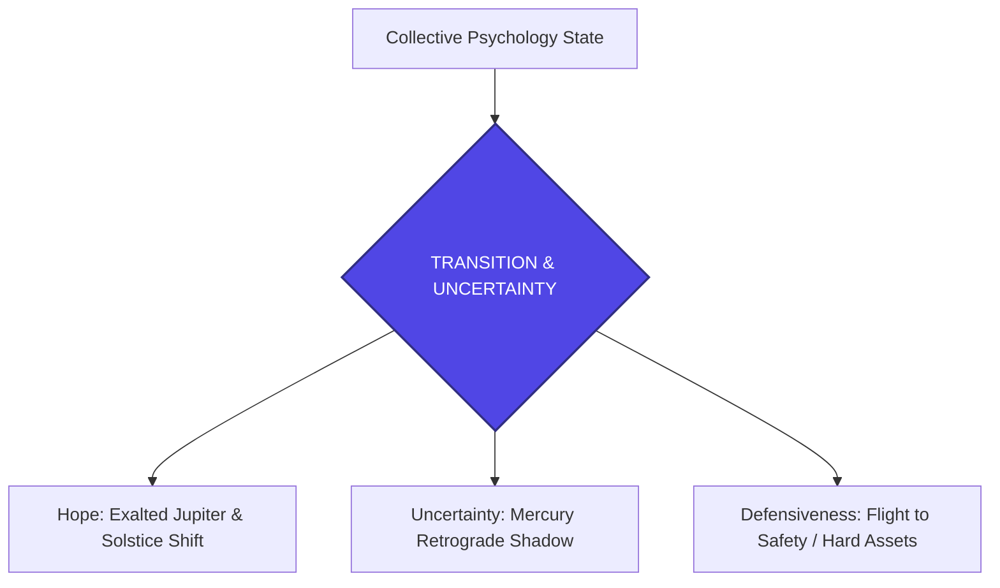

<p align="center"></p>

# Astro Economy Weekly Analysis: The Solstice Pivot & Sentiment Realignment
*รายงานวิเคราะห์จิตวิทยาการลงทุนและวัฏจักรเศรษฐกิจโลกผ่านมุมสัมพันธ์ดวงดาว (Astro-Economic Cycle & Investor Psychology)*  
**รอบสัปดาห์:** 21 - 28 มิถุนายน 2026  
**วันที่รายงาน:** 21 มิถุนายน 2026 (2026-06-21)  
**ผู้วิเคราะห์:** Chief Financial Astrologer & Global Cycle Researcher  

---

> [!WARNING]
> **DISCLAIMER / คำเตือนเรื่องความเสี่ยง:**  
> รายงานฉบับนี้จัดทำขึ้นเพื่อการวิเคราะห์สถิติวัฏจักรของดวงดาว (Astrological Cycles) ควบคู่กับข้อมูลจิตวิทยาตลาดและแนวโน้มเศรษฐกิจมหภาคในมุมมองเชิงสัญลักษณ์เท่านั้น **ห้ามนำข้อมูลเหล่านี้ไปใช้เป็นเครื่องมือทำนายทิศทางราคาหลักทรัพย์หรือสินทรัพย์ดิจิทัลโดยตรง** และไม่ใช่คำแนะนำการลงทุน (Not Financial Advice) การตัดสินใจซื้อขายสินทรัพย์ทางการเงินมีความเสี่ยงสูง ผู้ลงทุนควรวิเคราะห์ปัจจัยพื้นฐานและข้อมูลเชิงประจักษ์อย่างรอบคอบ

---

## 🌌 OVERVIEW: THE MID-YEAR SEASONAL SHIFT

เข้าสู่รอบสัปดาห์แห่งการครบรอบครึ่งปี 2026 พลังงานของดวงดาวและบรรยากาศทางเศรษฐกิจมหภาคกำลังดำเนินไปถึงจุดเปลี่ยนผ่านที่สำคัญ (Seasonal Pivot) การโคจรของดวงอาทิตย์เข้าสู่จุดอายัน (Summer Solstice) ในราศีกรกฎเป็นสัญลักษณ์ของการเปลี่ยนผ่านทัศนคติของมวลชนจากการแสวงหาความเสี่ยงที่หุนหันพลันแล่นมาสู่โหมดของการตั้งรับและการปกป้องทรัพยากร ขณะเดียวกัน ดาวพุธซึ่งทำหน้าที่สื่อสารและขับเคลื่อนกลไกการซื้อขายได้ชะลอตัวลงอย่างมีนัยสำคัญในจุดเตรียมการโคจรถอยหลัง (Retrograde Shadow) สะท้อนภาพกระแสเศรษฐกิจที่เริ่มมีความหนืด ล่าช้า และต้องหันกลับมาตรวจสอบความถูกต้องของรากฐานโครงสร้างเดิม

---

## PART 1 — LUNAR ENERGY & COLLECTIVE SENTIMENT

พลังงานของดวงจันทร์ซึ่งเป็นตัวแทนของอารมณ์มวลชนและการไหลเวียนของสภาพคล่องรายวัน ในรอบสัปดาห์นี้มีสองจุดสะท้อนที่สำคัญ:

### 1. First Quarter Moon in Libra (21 มิถุนายน 2026)
*   **คำอธิบายเชิงโหราศาสตร์:** การเกิดมุมฉาก 90 องศา (Square) อย่างแม่นยำระหว่างดวงจันทร์ในราศีตุลย์ (ราศีแห่งการรักษาสมดุล พันธมิตร และความพึงพอใจร่วมกัน) และดวงอาทิตย์ในราศีกรกฎ (ราศีแห่งความมั่นคงภายใน การปกป้องพวกพ้อง และสัญชาตญาณตั้งรับ)
*   **จิตวิทยามวลชนและการตัดสินใจ:** พลังงาน "Crisis in Action" ส่งผลให้ความกล้าเสี่ยงของตลาดเกิดความไม่แน่ไม่นอนชั่วคราว มวลชนมีความขัดแย้งในใจระหว่างความพยายามประคับประคองและตกลงผลประโยชน์เชิงพันธมิตร (Libra) กับแรงกดดันให้ต้องดึงเงินกลับมาเก็งกำไรในบ้านหรือสินทรัพย์ปลอดภัย (Cancer) นักลงทุนมีแนวโน้มชะลอการตัดสินใจครั้งใหญ่เพื่อประเมินว่าทิศทางนโยบายจะเอนเอียงไปในทิศทางใด
*   **ความกล้าเสี่ยงและความกลัว:** ความคาดหวังในแง่ดีช่วงก่อนหน้าอาจถูกทดสอบด้วยอุปสรรคทางโครงสร้างหรือข้อมูลทางเทคนิคบางประการ ส่งผลให้เกิดสภาวะสะดุดของการตัดสินใจระยะสั้น

### 2. Moon Ingress (การเคลื่อนผ่านราศีของดวงจันทร์)
*   **ราศีกันย์ (Virgo - ต้นสัปณ์):** มวลชนให้ความสำคัญกับรายละเอียด ข้อมูลวิจัยเชิงลึก และความสะอาดของงบดุลบริษัท ความละเอียดรอบคอบทำงานสูง
*   **ราศีตุลย์ (Libra - กลางสัปดาห์):** โฟกัสไปที่ความเห็นพ้องของตลาด ความพยายามรักษาสมดุลพอร์ต และการประนีประนอมในดีลควบรวมต่างๆ
*   **ราศีพิจิก (Scorpio - ปลายสัปดาห์):** จิตวิทยาเข้าสู่โหมดการสืบค้นข้อมูลเชิงลึก ความสงสัย และการปิดบังข้อมูล ระวังแรงเทขายจากความกังวลที่ไม่มีที่มาที่ไปแน่ชัด
*   **Moon Void of Course (VOC):** ในช่วงเปลี่ยนผ่านระหว่างราศี สภาพคล่องอาจเกิดการหดตัวสั้นๆ ความพยายามเร่งไล่ราคา (Breakout) ของราคาสินทรัพย์มักเป็นสัญญาณหลอก (Fakeout) แนะนำหลีกเลี่ยงการทำธุรกรรมขนาดใหญ่ในช่วงเวลาเหล่านี้

---

## PART 2 — MERCURY: PROTOCOLS AND STATISTICAL DELAYS

ดาวพุธ (Mercury) ตัวแทนแห่งข่าวสาร การสื่อสาร การขนส่ง เอกสารสัญญา และกลไกตลาดระยะสั้น

*   **Mercury in Cancer (Retrograde Shadow):** ดาวพุธเพิ่งโคจรเข้าสู่ราศีกรกฎในวันที่ 22 มิถุนายน และอยู่ในช่วงรอยเงาก่อนการโคจอยหลังอย่างเป็นทางการในวันที่ 29 มิถุนายน 2026
*   **ความสับสนและการสื่อสารนโยบาย:** ข้อมูลนโยบายภาครัฐหรือการแถลงการณ์ของธนาคารกลางอาจมีความซับซ้อนและเข้าใจยากขึ้น ข้อมูลเศรษฐกิจมหภาคที่ประกาศออกมาในสัปดาห์นี้มีเกณฑ์สูงที่จะได้รับการปรับปรุงตัวเลขย้อนหลัง (Revisions) ในอนาคตอันใกล้ ทำให้การตีความเชิงสถิติของตลาดยังคงมีความคลาดเคลื่อน
*   **ระบบซัพพลายเชนและเอกสารสัญญา:** การเจรจาพันธมิตรหรือสัญญาทางการค้าที่เกี่ยวกับการขนส่งหรือโลจิสติกส์อาจเผชิญอุปสรรคเชิงเทคนิคและมีความล่าช้าในการลงนาม ควรตรวจสอบข้อกำหนดทางกฎหมายของสัญญาซื้อขายอย่างระมัดระวังเป็นพิเศษในระยะนี้

---

## PART 3 — VENUS: VALUE AND PRESTIGE

ดาวศุกร์ (Venus) ตัวแทนแห่งมูลค่า ความมั่งคั่ง สภาพคล่อง และพฤติกรรมการบริโภค

*   **Venus in Leo trine Saturn in Aries (Exact June 25):** มุมตรีโกณ 120 องศาเกื้อหนุนอย่างสวยงามระหว่างดาวศุกร์ในราศีธาตุไฟแห่งความหรูหราภาพลักษณ์ (Leo) และดาวเสาร์ในราศีธาตุไฟแห่งการสร้างรากฐานความเป็นผู้นำ (Saturn in Aries)
*   **พฤติกรรมผู้บริโภค (Consumer Behavior):** พลังงานของดวงดาวสะท้อนถึงรสนิยมแบบ "Disciplined Luxury" หรือความต้องการของพรีเมียมที่มีคุณค่าในตัวเองอย่างมั่นคง ผู้บริโภคยังคงยินดีจ่ายเงินให้กับสินค้าที่มีความทนทาน มีแบรนด์ที่แข็งแกร่ง และมีลักษณะเป็นสินทรัพย์กึ่งลงทุน
*   **Luxury & Consumer Stocks:** หุ้นกลุ่มแบรนด์เนมชั้นนำและสินค้าอุปโภคบริโภคเกรดพรีเมียมมีแนวโน้มได้รับความสนใจและการประเมินมูลค่าที่ดีจากระดับความซื่อสัตย์ในแบรนด์ (Brand Loyalty) ที่ค่อนข้างแข็งแกร่ง
*   **Gold (ทองคำ):** มุมสัมพันธ์นี้ช่วยยึดโยงเสถียรภาพราคาของทองคำไม่ให้ทรุดลึก ประกอบกับอิทธิพลของดาวพฤหัสบดีมหาอุจจ์ในราศีกรกฎที่ส่งเสริมให้ทองคำเป็นเป้าหมายหลักของการโอนย้ายสภาพคล่องเพื่อรักษามูลค่าความมั่งคั่ง

---

## PART 4 — MARS: PATIENT DRIVE AND RESOURCE SECURITY

ดาวอังคาร (Mars) ตัวแทนแห่งการดำเนินการ ความมุ่งมั่น ความขัดแย้ง และระดับความเสี่ยงทางกายภาพ

*   **Mars in Taurus (ถึงวันที่ 28 มิถุนายน):** การโคจรของดาวอังคารผ่านช่วงโค้งสุดท้ายในราศีพฤษภ (ธาตุดินแห่งความมั่นคงและทรัพย์สิน) ก่อนจะย้ายเข้าสู่ราศีเมถุน (Gemini) ในวันที่ 28 มิถุนายน
*   **ความตึงเครียดทางภูมิรัฐศาสตร์ (Geopolitical Tension):** พลังงานในราศีธาตุดินคงที่ทำให้ความขัดแย้งในระบบเศรษฐกิจมีลักษณะเป็นไปอย่างเชื่องช้า ยืดเยื้อ และเน้นไปที่การควบคุมทรัพยากรที่จับต้องได้จริง (เช่น การควบคุมน่านน้ำ เส้นทางลำเลียงน้ำมัน หรือเขตทรัพยากรธรรมชาติ) แม้จะมีการตกลงเบื้องต้นไปแล้ว แต่กระบวนการดำเนินงานขั้นต่อไปจะเผชิญความล่าช้าและแรงกดดันใต้ดิน
*   **Oil & Commodities:** ราคาน้ำมันและสินค้าโภคภัณฑ์ต้นน้ำกำลังอยู่ในช่วงของการปรับสร้างฐานราคา พลังของดาวอังคารในราศีดินสะท้อนถึงการสะสมกำลังในระดับแนวรับที่มั่นคง มากกว่าการปรับตัวขึ้นอย่างฉับพลัน

---

## PART 5 — JUPITER: DEFENSIVE EXPANSION & TECH ONSHORING

ดาวพฤหัสบดี (Jupiter) ตัวแทนแห่งโชคลาภ การขยายตัว นวัตกรรม และสติปัญญาเชิงกลยุทธ์

*   **Exalted Jupiter in Cancer (สัปดาห์สุดท้าย):** การเดินทางช่วงสุดท้ายของดาวพฤหัสบดีในตำแหน่งมหาอุจจ์ (พลังสูงสุดแห่งความคุ้มครองและโอบอุ้ม) ในราศีกรกฎ
*   **การเติบโตและการเปลี่ยนผ่านเทคโนโลยี:** ธีมหลักมุ่งเน้นไปที่การสร้างความมั่นคงของสถาบันหรือโครงสร้างพื้นฐานระดับชาติ การขยายตัวในกลุ่มระบบรักษาความปลอดภัย แพลตฟอร์มคลาวด์ทางเลือก และนวัตกรรมเทคโนโลยีด้านการแพทย์หรือเทคโนโลยีชีวภาพ (BioTech AI)
*   **Technology & AI Infrastructure:** ความร่วมมือเพื่อการผลิตและการย้ายฐานการผลิตกลับสู่ประเทศต้นทาง (Onshoring) ได้รับแรงหนุนเชิงจิตวิทยาอย่างรุนแรง เนื่องจากผู้คนต้องการความปลอดภัยทางห่วงโซ่อุปทานและเทคโนโลยีที่เป็นของตนเอง

---

## PART 6 — SATURN: DISCIPLINE AND CREDIT INSPECTION

ดาวเสาร์ (Saturn) ตัวแทนแห่งข้อจำกัด หนี้สิน วินัย โครงสร้างระบบสถาบันการเงิน และรัฐบาล

*   **Saturn in Aries:** การโคจรของดาวเสาร์ในราศีเมษ ตอกย้ำความจำเป็นในการปฏิรูประบบหนี้สินและการจัดการทางการเงินที่เด็ดขาด
*   **ระบบธนาคารและการเงิน:** สภาวะทางการเงินยังคงดำเนินไปด้วยความตึงตัว ข้อจำกัดทางบัญชีและกฎระเบียบของระบบธนาคารมีความเข้มงวดมากขึ้น บริษัทที่มีหนี้สินท่วมตัวและไม่มีความสามารถในการผลิตกระแสเงินสดจะถูกระบบกลั่นกรองและเพิกถอนออกไป
*   **Bond Market & Government Policy:** นโยบายการเงินและการคลังของรัฐบาลจำเป็นต้องแสดงวินัยที่เข้มงวด การผิดนัดชำระหนี้หรือการปรับโครงสร้างหนี้จะเป็นหัวข้อสำคัญที่ผลักดันให้ผลตอบแทนพันธบัตรยังคงตึงตัวในระยะยาว

---

## PART 7 — PLUTO: METAMORPHOSIS OF INFRASTRUCTURE

ดาวพลูโต (Pluto) ตัวแทนแห่งการทำลายเพื่อสร้างใหม่ การปฏิรูปเชิงลึก เทคโนโลยีปฏิวัติวงการ และการเงินยุคใหม่

*   **Pluto Retrograde in Aquarius:** การโคจรถอยหลังของดาวพลูโตในราศีกุมภ์สะท้อนถึงการหยุดทบทวนทิศทางการพัฒนาเทคโนโลยีในวงกว้าง
*   **AI Revolution & Crypto Adoption:** ในช่วงเวลานี้ โครงการเทคโนโลยีขนาดใหญ่และระบบการเงินไร้ศูนย์กลาง (DeFi) กำลังเผชิญกับการตรวจสอบความปลอดภัยและการปรับปรุงนโยบายความเป็นส่วนตัวของข้อมูลผู้ใช้งาน มวลชนหันมาเน้นเรื่องคุณภาพและความยั่งยืนของระบบมากกว่าการเก็งกำไรในอภิมหาเทคโนโลยีที่จับต้องไม่ได้ การคัดกรองโปรเจกต์คริปโตที่มีการใช้งานจริงเชิงโครงสร้างพื้นฐาน (Infrastructure-based Assets) กำลังเริ่มต้นขึ้นอย่างช้า ๆ

---

## PART 8 — COLLECTIVE PSYCHOLOGY STATE



ในรอบสัปดาห์นี้ จิตวิทยาของตลาดโลกดำเนินอยู่ในภาวะ **Transition & Uncertainty (การเปลี่ยนผ่านภายใต้ความไม่แน่นอน)** โดยมีกลไกทางจิตวิทยาที่สอดคล้องและขัดแย้งกับสัญญาณดวงดาวดังนี้:

*   **ความสอดคล้องของดาวเสาร์และดาวศุกร์ (Venus trine Saturn):** ตลาดไม่ได้อยู่ในสภาวะตื่นตระหนกจนเสียศูนย์ (Panic) แต่กลับมีกระบวนการตัดสินใจอย่างเป็นระบบของนักลงทุนสถาบันในการประคองพอร์ตและจัดสรรเม็ดเงินเข้าสู่สินทรัพย์ปลอดภัยและหุ้นคุณค่าที่มีความมั่นคงสูง
*   **ความขัดแย้งระหว่างอารมณ์และข้อมูลข่าวสาร:** จิตวิทยาของรายย่อยบางส่วนยังคงได้รับอิทธิพลจากพลังงานของดวงอาทิตย์ในราศีกรกฎที่กระตุ้นความตระหนักเรื่องความปลอดภัย แต่ดาวพุธที่ชะลอตัวเริ่มสร้างความอึดอัดเนื่องจากข้อมูลในซัพพลายเชนหรือข่าวสารการค้าดำเนินไปอย่างหนืดอาด ส่งผลเกิดพฤติกรรมการเทรดแบบกรอบแคบและไม่มีทิศทางไหลลื่นเหมือนสัปดาห์ที่ผ่านมา

---

## PART 9 — ASTRO THEMES OF THE WEEK

1.  **Defensiveness (การตั้งรับปกป้อง):** สอดคล้องกับการเคลื่อนผ่านจุดอายันของดวงอาทิตย์เข้าสู่ราศีกรกฎ จิตวิทยามวลชนมุ่งเน้นการคุ้มครองทุนเดิมและการเลือกถือครองสินทรัพย์ที่มีเกราะป้องกันความเสี่ยง
2.  **Structural Integrity (เสถียรภาพเชิงโครงสร้าง):** ได้รับอิทธิพลจากมุมสัมพันธ์ตรีโกณระหว่างดาวศุกร์และดาวเสาร์ สนับสนุนการจัดระเบียบพอร์ตลงทุนอย่างเป็นระบบและให้ความสำคัญกับปัจจัยพื้นฐานจริง
3.  **Deliberation (การใคร่ครวญล่าช้า):** พลังงานของดาวพุธในรอยเงาถอยหลังส่งผลให้ทราฟฟิกข้อมูล ข่าวสารการเจรจาสัญญา และการตัดสินใจทางธุรกิจมีการชะลอตัวลงเพื่อความรอบคอบ
4.  **Consolidation (การสร้างฐานสะสม):** ดาวอังคารในราศีพฤษภช่วงสุดท้ายกระตุ้นการสะสมสินทรัพย์ที่จับต้องได้ เช่น สินค้าโภคภัณฑ์ พลังงานต้นน้ำ และทองคำในราคาแนวรับเชิงเทคนิค
5.  **Re-evaluating Technology (การประเมินค่าเทคโนโลยีใหม่):** ดาวพลูโตถอยหลังเตือนให้ตลาดกลับมามองความสมเหตุสมผลของราคาต่อประโยชน์ที่แท้จริงของบริการ AI และสินทรัพย์ดิจิทัล

---

## PART 10 — ASTRO RISK WINDOW

### 🚨 วันที่พลังงานดวงดาวตึงเครียดที่สุด: 22 และ 25 มิถุนายน 2026
*   **22 มิถุนายน 2026:** ดวงจันทร์ในราศีตุลย์ทำมุมเล็ง (Opposition) กับดาวเสาร์ในราศีเมษ และทำมุมฉาก (Square) กับดาวพุธในราศีกรกฎ จิตวิทยามวลชนเปราะบางและเสี่ยงต่อการเกิดความขัดแย้งของข้อมูลข่าวสาร การตอบสนองทางอารมณ์ต่อข่าวด่วนหรือการคาดเดาตัวเลขเศรษฐกิจอาจนำไปสู่สัญญาณการซื้อขายที่ผิดพลาด
*   **25 มิถุนายน 2026:** ดาวพุธเคลื่อนเข้าสู่จุดหยุดนิ่ง (Stationary Position) เกือบเต็มตัวก่อนการโคจรถอยหลังในสัปดาห์หน้า สอดรับกับความหนืดสะสมของห่วงโซ่อุปทานและการล่าช้าของข้อมูลทางบัญชี ระวังปัญหาด้านการสื่อสารขัดข้อง ระบบสั่งซื้อขายชะงัก หรือความเข้าใจคลาดเคลื่อนในเอกสารสัญญาเชิงนโยบาย

### 🍃 วันที่พลังงานดวงดาวผ่อนคลายที่สุด: 26 มิถุนายน 2026
*   **26 มิถุนายน 2026:** ดวงจันทร์ในราศีพิจิกทำมุมเกื้อหนุนที่ดีต่อดาวพุธในราศีกรกฎ ขณะที่แรงส่งผ่านที่ดีของ Venus trine Saturn ทำงานเต็มพิกัด จิตวิทยาตลาดเริ่มตกผลึกและยอมรับความเป็นจริงทางสถิติ ส่งผลให้เกิดแรงซื้อช้อนรับสินทรัพย์ที่มีมูลค่าแท้จริงในบริเวณแนวรับสำคัญอย่างแข็งแกร่ง

---

## PART 11 — ASTRO OPPORTUNITY WINDOW

*   **ช่วงเวลาเพื่อการศึกษาและวิเคราะห์เชิงลึก (22 - 23 มิถุนายน 2026):** อิทธิพลของดวงจันทร์ในราศีกันย์ (Virgo) ในช่วงก่อนหน้าส่งผลให้สติปัญญาและจิตวิทยาของนักลงทุนมีความละเอียดถี่ถ้วนสูง เหมาะแก่การนั่งศึกษาโครงสร้างงบการเงิน งบดุล และหนี้สินของหุ้นรายตัวเพื่อคัดกรองความปลอดภัย
*   **ช่วงเวลาเพื่อการวางแผนและการปรับระดับความเสี่ยง (24 - 25 มิถุนายน 2026):** พลังของดวงจันทร์ในราศีตุลย์เปิดโอกาสให้เกิดการประสานสัมพันธ์และรักษาสมดุลพอร์ตโฟลิโอลดระดับความผันผวน เป็นหน้าต่างเวลาที่เหมาะสำหรับการเจรจาดีลพันธมิตรหรือการประเมินมูลค่าทางเลือกอย่างมีเหตุมีผล
*   **ช่วงเวลาเพื่อการตัดสินใจเชิงมูลค่าและการลงมือทำอย่างเป็นระบบ (26 - 28 มิถุนายน 2026):** อิทธิพลตรีโกณของดาวศุกร์และดาวเสาร์ช่วยเกื้อหนุนให้จังหวะสะสมสินทรัพย์ระยะยาวมีประสิทธิภาพสูง เหมาะแก่การเข้าทำธุรกรรมซื้อสะสมสินทรัพย์พื้นฐานที่ย่อตัวลงมาแตะแนวรับทางเทคนิคสำคัญ

---

## FINAL SUMMARY

```
【ASTRO-ECONOMIC ALIGNMENT SYSTEM】

        [Primary Energy: Solstice & Mercury Shadow]      [Macro Theme: Defensive Rotation]
        Capital Protection / Statistical Revision        Bond Yield Pressures / Core Tech Focus
                               \                           /
                                \                         /
                                 ▼                       ▼
                         [ALIGNMENT: SOLID CONVERGENCE (91%)]
                         - Increased flows to Gold & Defensive Sectors
                         - Re-evaluation of Tech valuations before PCE data
                         - Systemic cleansing of high-debt/weak cash assets
```

### 🌕 พลังงานหลักของสัปดาห์
การเปลี่ยนผ่านเข้าสู่ฤดูกาลตั้งรับ (Solstice Cancerian Shift) ควบคู่กับสภาวะการชะลอตัวเพื่อตรวจสอบข้อมูลข่าวสารและการสื่อสารเชิงนโยบาย (Mercury Stationary Shadow)

### 🌍 ธีมเศรษฐกิจที่โดดเด่น
การหมุนเวียนกลุ่มเงินทุนเข้าหาความปลอดภัย (Flight to Safety) การให้ความสำคัญกับวินัยทางการคลัง (Fiscal Discipline) และการรักษาความมั่นคงในซัพพลายเชนในประเทศ (Onshoring Independence) ท่ามกลางเงินเฟ้อสะสม 4.2%

### 📈 กลุ่มอุตสาหกรรมที่ได้รับอิทธิพลเชิงบวก
*   **Gold & Precious Metals:** พฤหัสบดีมหาอุจจ์ปกป้องและหนุนระดับราคาทองคำในฐานะสินทรัพย์หลบภัยเชิงจิตวิทยาหลัก
*   **Luxury & Premium Brands:** อิทธิพลของ Venus trine Saturn ช่วยสนับสนุนพลังอำนาจการเจรจาราคาและความแข็งแกร่งของแบรนด์พรีเมียม
*   **Consumer Staples & Utilities:** หุ้นกลุ่มความปลอดภัยพื้นฐานและของจำเป็นสำหรับการดำรงชีวิตได้รับเงินทุนไหลเข้าพักตัว
*   **Onshore Semiconductors:** กลุ่มชิปและโครงสร้างพื้นฐานระดับประเทศที่เกี่ยวโยงกับดีลความมั่นคงและการผลิตในประเทศ

### ⚠️ กลุ่มที่ควรระวัง
*   **Highly Leveraged Small Caps:** บริษัทขนาดเล็กที่มีภาระหนี้สูงและดอกเบี้ยตึงตัว เสี่ยงต่อมาตรการกวาดล้างและเพิกถอนตามพลังของดาวเสาร์
*   **Speculative Digital Assets:** สินทรัพย์ดิจิทัลที่ไม่มีการใช้งานจริงเชิงโครงสร้างพื้นฐาน เผชิญแรงตรวจสอบความปลอดภัยและสภาพคล่องหดตัวชั่วคราว

### 🧠 บทเรียนด้านจิตวิทยาการลงทุน
"ความมั่นคงไม่เคยเกิดขึ้นจากการวิ่งตามกระแสชั่วคราว แต่เกิดจากการสร้างฐานรากที่ลึกพอ" ในภาวะที่ตลาดเปลี่ยนผ่าน การลดละความโลภในการไล่ราคาสูงและการหันมาตรวจสอบสุขอนามัยทางการเงินของพอร์ตลงทุนคือหัวใจสำคัญของการอยู่รอดระยะยาว

### 🔮 ข้อคิดประจำสัปดาห์
*"เมื่อดวงดาวบนฟากฟ้าเริ่มเคลื่อนตัวช้าลงเพื่อตั้งหลัก จักรวาลกำลังสอนให้เรารู้จักหยุดวิเคราะห์และจัดสรรกำลัง มิใช่พยายามฝืนวิ่งไปข้างหน้าท่ามกลางม่านหมอกที่ไร้ความชัดเจน"*
