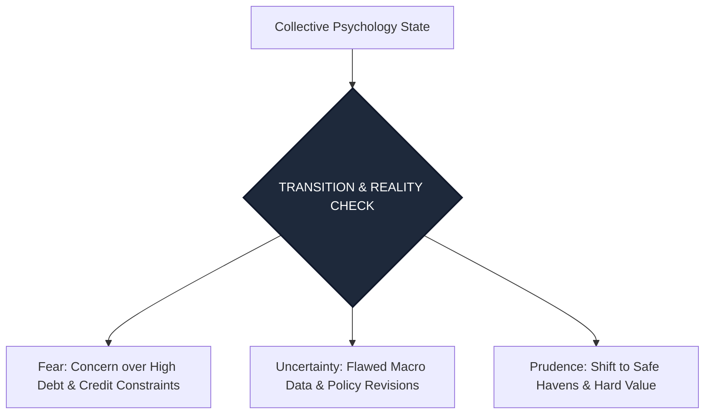

<p align="center"></p>

# Astro Economy Weekly Analysis: The Capricorn Full Moon & Retrograde Crossroads
*รายงานวิเคราะห์จิตวิทยาการลงทุนและวัฏจักรเศรษฐกิจโลกผ่านมุมสัมพันธ์ดวงดาว (Astro-Economic Cycle & Investor Psychology)*  
**รอบสัปดาห์:** 29 มิถุนายน - 5 กรกฎาคม 2026  
**วันที่รายงาน:** 29 มิถุนายน 2026 (2026-06-29)  
**ผู้วิเคราะห์:** Chief Financial Astrologer & Global Cycle Researcher  

---

> [!WARNING]
> **DISCLAIMER / คำเตือนเรื่องความเสี่ยง:**  
> รายงานฉบับนี้จัดทำขึ้นเพื่อการวิเคราะห์สถิติวัฏจักรของดวงดาว (Astrological Cycles) ควบคู่กับข้อมูลจิตวิทยาตลาดและแนวโน้มเศรษฐกิจมหภาคในมุมมองเชิงสัญลักษณ์เท่านั้น **ห้ามนำข้อมูลเหล่านี้ไปใช้เป็นเครื่องมือทำนายทิศทางราคาหลักทรัพย์หรือสินทรัพย์ดิจิทัลโดยตรง** และไม่ใช่คำแนะนำการลงทุน (Not Financial Advice) การตัดสินใจซื้อขายสินทรัพย์ทางการเงินมีความเสี่ยงสูง ผู้ลงทุนควรวิเคราะห์ปัจจัยพื้นฐานและข้อมูลเชิงประจักษ์อย่างรอบคอบ

---

## 🌌 OVERVIEW: THE REALITY CHECK & RETROGRADE SHIFT
เมื่อย่างก้าวเข้าสู่สัปดาห์แรกของครึ่งปีหลัง (Q3 2026) บรรยากาศทางจิตวิทยาของเศรษฐกิจและการลงทุนโลกกำลังเผชิญหน้ากับจุดหักเหที่สำคัญ พลังงานของท้องฟ้าถูกครอบงำด้วยสองปรากฏการณ์หลัก: **จันทร์เต็มดวงในราศีมังกร (Capricorn Full Moon)** ซึ่งทำหน้าที่เป็นกระจกสะท้อนความเป็นจริงเชิงประจักษ์ (Reality Check) บังคับให้ระบบเศรษฐกิจและผู้เล่นในตลาดหันกลับมามองตัวเลขจริง หนี้สินจริง และขีดจำกัดทางโครงสร้างพื้นฐาน ควบคู่กับ **ดาวพุธที่โคจรถอยหลังอย่างเต็มรูปแบบ (Mercury Retrograde) ในราศีกรกฎ** ซึ่งเป็นสัญลักษณ์ของการชะลอตัว ชะงักงันของข่าวสาร และการทบทวนปรับปรุงสถิติเศรษฐกิจย้อนหลัง 

ในขณะเดียวกัน การเปลี่ยนผ่านของดาวอังคารเข้าสู่ราศีเมถุน (Gemini) จะเปลี่ยนรูปแบบความขัดแย้งทางภูมิรัฐศาสตร์ไปสู่ระดับข่าวสารและสงครามสารสนเทศ สัปดาห์นี้จึงไม่ใช่เวลาของการเร่งเครื่องหาผลตอบแทน แต่เป็นช่วงเวลาแห่งการสร้างระบบป้องกันภัยและการปรับสมดุลเชิงรักษาวินัยอย่างเข้มงวด

---

## PART 1 — LUNAR ENERGY & COLLECTIVE SENTIMENT

พลังงานของดวงจันทร์ซึ่งเป็นกลไกขับเคลื่อนอารมณ์ชั่วคราวและการไหลเวียนของสภาพคล่องระยะสั้น ในรอบสัปดาห์นี้มีจุดสนใจหลักที่การเกิดจันทร์เต็มดวง:

### 1. Capricorn Full Moon (เกิดรอบช่วงวันที่ 1 - 2 กรกฎาคม 2026)
*   **คำอธิบายเชิงโหราศาสตร์:** ดวงจันทร์เคลื่อนเข้าสู่จุดเต็มดวงในราศีมังกร (ราศีแห่งความอดทน โครงสร้างองค์กร หนี้สินสาธารณะ และสถาบันดั้งเดิม) ทำมุมเล็งอย่างตรงข้ามกับดวงอาทิตย์ในราศีกรกฎ (ราศีแห่งการป้องกัน สถาบันครอบครัว และความเป็นชาตินิยม)
*   **จิตวิทยามวลชนและการตัดสินใจ:** ปรากฏการณ์นี้กระตุ้นสภาวะ "Reality Check" หรือการตระหนักรู้ในความจริงทางการเงิน มวลชนมีแนวโน้มที่จะถอนตัวจากโครงการเก็งกำไรที่ไร้รากฐาน แล้วหันมาจัดระเบียบโครงสร้างพอร์ตลงทุน จิตวิทยาเปลี่ยนจากความคาดหวังอันเพ้อฝัน (Hope) ไปสู่การมองความเป็นจริงตามงบดุล (Realism) ความตื่นตัวต่อความรับผิดชอบและการเผชิญหนี้สินจะถูกยกระดับขึ้น
*   **ความกล้าเสี่ยงและความกลัว:** ความเสี่ยง (Risk Appetite) ลดต่ำลงชั่วคราว ตลาดสลับโหมดเข้าสู่ "Risk-Off" มวลชนมีความกลัวต่อปัจจัยเชิงโครงสร้าง ความล่าช้าของนโยบายดอกเบี้ย หรือเสถียรภาพของสถาบันการเงินขนาดใหญ่

### 2. Moon Ingress (การโคจรผ่านราศีที่สำคัญ)
*   **ราศีธนู (Sagittarius - ต้นสัปดาห์):** มวลชนพยายามมองหาทางออกเชิงบวกและวิสัยทัศน์กว้างไกล มีแรงเก็งกำไรระยะสั้นในอุตสาหกรรมเทคโนโลยีขั้นสูงและดีลข้ามประเทศ
*   **ราศีมังกร (Capricorn - กลางสัปดาห์):** จุดตึงเครียดสูงสุด อารมณ์มวลชนขรึมและระมัดระวังเป็นพิเศษ เน้นเก็บเงินสด ซื้อพันธบัตร หรือถือสินทรัพย์มั่นคง
*   **ราศีกุมภ์ (Aquarius - ปลายสัปดาห์):** จิตวิทยากลับมาให้ความสนใจกับนวัตกรรม กลุ่มสังคม ชุมชนคริปโต และเทคโนโลยีทางเลือก แต่จะดำเนินไปภายใต้กรอบการคัดกรองที่เข้มงวด
*   **Moon Void of Course (VOC):** ระวังช่วงรอยต่อระหว่างเปลี่ยนผ่านราศี โดยเฉพาะกลางสัปดาห์ การพยายามเบรกเอาท์ของราคาในตลาดหุ้นอาจเป็นสัญญาณหลอก (False Breakouts) ที่เกิดจากปริมาณการซื้อขายที่บางตาและขาดความต่อเนื่อง

---

## PART 2 — MERCURY: RETROGRADE IN CANCER AND COMMUNICATION BREAKS

ดาวพุธ (Mercury) ตัวแทนแห่งระบบการค้า การสื่อสาร ข้อมูลสถิติ การขนส่ง และสัญญาซื้อขาย

*   **Mercury Retrograde in Cancer (ดาวพุธโคจรถอยหลังในราศีกรกฎ):** ตั้งแต่วันที่ 29 มิถุนายน 2026 ดาวพุธจะเข้าสู่สถานะถอยหลังอย่างเป็นทางการในราศีแห่งความมั่นคงภายในประเทศและสถาบันการเงินที่เกี่ยวข้องกับอสังหาริมทรัพย์
*   **กระแสข่าวสารและการสื่อสารนโยบาย:** ระวังความเข้าใจผิดหรือการตีความคลาดเคลื่อนจากการแถลงการณ์ของธนาคารกลางหรือหน่วยงานรัฐ ตัวเลขเศรษฐกิจสำคัญที่ประกาศในรอบสัปดาห์นี้มีเกณฑ์สูงที่จะถูกปรับแก้ตัวเลขย้อนหลังอย่างมีนัยสำคัญ (Heavy Revisions) ข่าวลือทางเศรษฐกิจจะแพร่สะพัดและสร้างความสับสนชั่วคราว
*   **การชะงักงันของกลไกตลาด:** เอกสารสัญญา ดีลการค้า หรือการตกลงซื้อขายสินทรัพย์อสังหาริมทรัพย์และโลจิสติกส์อาจเผชิญกับการเลื่อนกำหนดเวลา การสื่อสารในระบบไอทีของสถาบันการเงินอาจมีปัญหาขัดข้องชั่วคราว

---

## PART 3 — VENUS: PRESTIGE, VALUE AND DOMESTIC LUXURY

ดาวศุกร์ (Venus) ตัวแทนของสภาพคล่อง มูลค่าความมั่งคั่ง และสัญชาตญาณการบริโภค

*   **Venus in Leo (ดาวศุกร์ในราศีสิงห์):** ดาวศุกร์โลดแล่นในราศีแห่งความโดดเด่น ความภูมิใจ และภาพลักษณ์ที่หรูหรา แม้ในยามเศรษฐกิจตึงตัว
*   **พฤติกรรมผู้บริโภค (Consumer Behavior):** เกิดความต้องการใช้จ่ายในลักษณะ "Prestige Consumption" หรือการซื้อของเพื่อยกระดับสถานะทางสังคมและสร้างความมั่นใจให้ตนเอง ผู้บริโภคระดับกลางถึงบนยังคงเลือกแบรนด์ที่สร้างตัวตนได้เด่นชัด แต่เนื่องจากทำมุมสัมพันธ์ตึงเครียดกับดาวเสาร์ในราศีเมษ การใช้จ่ายจึงยังคงมีความรอบคอบ เน้นแบรนด์ที่นอกจากหรูหราแล้วต้องมีมูลค่าในการส่งต่อหรือรักษาราคาได้ดี (Resale Value)
*   **Luxury & Consumer Stocks:** กลุ่มหุ้นแบรนด์หรูระดับโลก (High-End Luxury) และสินค้าอุปโภคบริโภคที่มีความภักดีต่อแบรนด์สูง (Strong Brand Equity) จะได้รับอิทธิพลเชิงบวกในฐานะเกราะป้องกันภัยเงินเฟ้อ
*   **Gold (ทองคำ):** ได้รับแรงหนุนจากพฤติกรรมความต้องการถือครองสินทรัพย์ปลอดภัยที่จับต้องได้จริง (Hard Assets) ภายใต้สภาวะดวงจันทร์เต็มดวงในราศีมังกรและดาวพุธถอยหลัง ทองคำจึงกลายเป็นสัญลักษณ์ของการปกป้องความมั่งคั่งหลักในรอบสัปดาห์นี้

---

## PART 4 — MARS: INFORMATION WARFARE & GEOPOLITICAL FRICTION

ดาวอังคาร (Mars) ตัวแทนของพลังขับเคลื่อน ความเร่งรีบ ความเสี่ยง และความขัดแย้งทางกายภาพ

*   **Mars in Gemini (ดาวอังคารในราศีเมถุน):** ดาวอังคารเพิ่งเคลื่อนย้ายเข้าสู่ราศีเมถุนอย่างเต็มตัวตั้งแต่วันที่ 28 มิถุนายน 2026 ซึ่งเป็นราศีแห่งการสื่อสาร ข้อมูลข่าวสาร พันธมิตรระยะสั้น และการขนส่ง
*   **ความขัดแย้งทางภูมิรัฐศาสตร์ (Geopolitical Tension):** รูปแบบความตึงเครียดจะเปลี่ยนผ่านจากการเผชิญหน้าด้วยกำลังทหารในพื้นที่ดิน (Taurus) ไปสู่ **"สงครามสารสนเทศ" (Information Warfare)** การโจมตีทางไซเบอร์ การคว่ำบาตรทางเทคโนโลยี และการจำกัดสิทธิ์การแลกเปลี่ยนข้อมูลข่าวสาร การตอบโต้ทางการค้าผ่านสงครามน้ำลายและการโฆษณาชวนเชื่อจะเข้มข้นขึ้น
*   **Oil & Commodities:** ราคาน้ำมันดิบและสินค้าโภคภัณฑ์จะมีความผันผวนสูงและอ่อนไหวต่อข่าวลือ (News-Driven Volatility) เนื่องจากดาวอังคารในราศีเมถุนส่งผลให้เกิดการตัดสินใจที่รวดเร็วและตื่นตระหนกตามกระแสข่าวรายวัน ควรระวังการแกว่งตัวของราคาแบบเฉียบพลันตามทวีตหรือถ้อยแถลงที่ไม่เป็นทางการ

---

## PART 5 — JUPITER: LOCALIZED EXPANSION & TECH INTEGRITY

ดาวพฤหัสบดี (Jupiter) ตัวแทนแห่งสติปัญญา ความเติบโต ความอุดมสมบูรณ์ และนวัตกรรมระยะยาว

*   **Jupiter in Cancer:** การสถิตของดาวพฤหัสบดีในราศีกรกฎอันเป็นตำแหน่งอุจจ์ยังคงโอบอุ้มและกระตุ้นการขยายตัวในลักษณะของการสร้างเกราะกำบังและการพึ่งพาตนเอง
*   **การเติบโตและเทคโนโลยี (AI & Tech):** นวัตกรรมประเภท "Sovereign AI" หรือระบบปัญญาประดิษฐ์ที่พัฒนาและใช้งานเฉพาะภายในประเทศหรือองค์กรเพื่อความปลอดภัยของข้อมูลจะได้รับแรงหนุนสูง การขยายตัวของโครงสร้างพื้นฐานระบบคลาวด์ภายในประเทศ (Localized Cloud Data Centers) มีแนวโน้มได้รับงบประมาณสนับสนุนเพิ่มขึ้น
*   **Education & Communication:** กลุ่มสถาบันการศึกษาดั้งเดิมและสถาบันฝึกอบรมทักษะใหม่ (Re-skilling) รวมถึงการปฏิรูประบบการสื่อสารภายในระบบราชการหรือองค์กรใหญ่เพื่อปิดจุดอ่อนของดาวพุธถอยหลัง จะกลายเป็นจุดสนใจที่มีการลงทุนขยายตัว

---

## PART 6 — SATURN: CREDIT RESTRUCTURING & BOND PRESSURE

ดาวเสาร์ (Saturn) ตัวแทนของความรับผิดชอบ กฎระเบียบ ข้อจำกัด วินัย หนี้สิน และสถาบันการเงินดั้งเดิม

*   **Saturn in Aries:** ดาวเสาร์ในราศีแห่งการเริ่มต้นทำลายสิ่งเก่าเพื่อสร้างวินัยใหม่ ตอกย้ำถึงการเข้าสู่ช่วงที่เข้มงวดที่สุดของนโยบายการเงิน
*   **ระบบธนาคารและการเงิน:** ภาคธนาคารยังคงดำเนินการภายใต้การตรวจสอบกฎระเบียบที่เข้มข้นขึ้น (Regulatory Tightening) ธนาคารต่าง ๆ จะระมัดระวังอย่างยิ่งในการอนุมัติสินเชื่อใหม่ ส่งผลให้สภาพคล่องในระบบเศรษฐกิจจริงเริ่มตึงตัว
*   **Bond Market & Government Policy:** ตลาดพันธบัตรรัฐบาลอาจเกิดภาวะตึงตัว ผลตอบแทนพันธบัตร (Yields) ปรับตัวสูงขึ้นเนื่องจากตลาดยอมรับความจริงเรื่องภาระหนี้สินสาธารณะของประเทศต่าง ๆ (ได้รับแรงกระตุ้นจากดวงจันทร์เต็มดวงในราศีมังกร) ความตึงเครียดด้านนโยบายการคลังจะบังคับให้รัฐบาลต้องลดงบประมาณที่ไม่จำเป็นลงและหันมารักษาวินัยอย่างเข้มงวด

---

## PART 7 — PLUTO: AI REVOLUTION AND SYSTEMIC CLEANSE

ดาวพลูโต (Pluto) ตัวแทนของวิวัฒนาการเชิงโครงสร้าง การทำลายเพื่อสร้างใหม่ และพลังอำนาจที่ซ่อนเร้น

*   **Pluto Retrograde in Aquarius:** การโคจรถอยหลังของดาวพลูโตในราศีกุมภ์สะท้อนถึงช่วงเวลาแห่งการปรับฐานรากและชำระล้างความร้อนแรงเกินไปของนวัตกรรมยุคใหม่
*   **AI Revolution & Crypto Adoption:** กระบวนการเปลี่ยนผ่านไปสู่สังคม AI และสินทรัพย์ดิจิทัลเผชิญการจัดระเบียบครั้งใหญ่ โครงการคริปโตหรือบริษัทพัฒนา AI ที่พึ่งพาการเก็งกำไรโดยไม่มีประโยชน์ใช้งานจริงเชิงโครงสร้างพื้นฐาน (Hype-based assets) จะถูกคัดกรองออกไปจากระบบ (Systemic Cleanse) ในทางกลับกัน โปรเจกต์ที่มีลักษณะเป็นระบบโครงสร้างพื้นฐานดิจิทัลที่จับต้องได้และมีรายได้จริงจะได้รับการยอมรับในฐานะเสาหลักใหม่ของเศรษฐกิจยุคถัดไป

---

## PART 8 — COLLECTIVE PSYCHOLOGY STATE



ในสัปดาห์นี้ จิตวิทยาตลาดอยู่ในภาวะ **Transition & Reality Check (การเปลี่ยนผ่านสู่การเผชิญความจริง)** โดยมีปัจจัยทางจิตวิทยาที่เชื่อมโยงกับพลังงานของดาวดังนี้:

*   **ความสอดคล้องกับดวงดาว:** การสถิตของดวงจันทร์เต็มดวงในราศีมังกรทำมุมเล็งกับดวงอาทิตย์ในราศีกรกฎ สร้างความรู้สึกหวงแหนความปลอดภัยควบคู่กับการประเมินขีดจำกัดที่แท้จริง ส่งผลให้นักลงทุนรายใหญ่งดการเก็งกำไรแบบก้าวร้าวและเน้นรักษาสภาพคล่องส่วนเกินไว้ จิตวิทยาตลาดเปลี่ยนจากความโลภ (Greed) ในช่วงก่อนหน้ามาสู่ความระมัดระวังตัวขั้นสูง
*   **ความขัดแย้งของพลังงาน:** แม้ว่าจิตวิทยาหลักจะมุ่งเน้นที่ความปลอดภัยและมีวินัย (Saturn & Capricorn Moon) แต่การที่ดาวอังคารย้ายเข้าสู่ราศีเมถุน (Mars in Gemini) จะพยายามกระตุ้นให้เกิดกระแสข่าวลือและการเคลื่อนไหวเก็งกำไรระยะสั้นตามข่าวรายวัน ซึ่งจะนำไปสู่พฤติกรรมการซื้อขายที่ผันผวนอย่างไร้ทิศทางและสร้างความเสียหายแก่นักลงทุนที่ตอบสนองต่ออารมณ์ชั่ววูบได้ง่าย

---

## PART 9 — ASTRO THEMES OF THE WEEK

1.  **Reality-Check (การเผชิญความจริง):** อิทธิพลจาก Capricorn Full Moon บังคับให้ตลาดต้องประเมินสถานะทางการเงิน งบดุล และหนี้สินที่แท้จริงโดยปราศจากอคติ
2.  **Information-Fluctuation (ข่าวสารผันผวน):** ผลลัพธ์จากดาวพุธถอยหลังในราศีกรกฎและดาวอังคารในราศีเมถุน ส่งผลให้ข้อมูลเศรษฐกิจมีความสับสน ข่าวลือและรายงานปลอมแพร่สะพัดได้ง่าย
3.  **Fiscal-Discipline (วินัยทางการคลัง):** แรงกดดันจากดาวเสาร์ในราศีเมษและดวงจันทร์ราศีมังกร บังคับให้เกิดการทบทวนมาตรการกู้เงินและการควบคุมภาระหนี้สินของทั้งภาครัฐและเอกชน
4.  **Sovereign-Security (ความปลอดภัยเชิงอธิปไตย):** ดาวพฤหัสบดีในราศีกรกฎเน้นย้ำความสำคัญของการสร้างเกราะป้องกันภัย ความมั่นคงด้านอาหาร พลังงาน และระบบซัพพลายเชนภายในภูมิภาคของตนเอง
5.  **Structural-Cleanse (การสะสางโครงสร้าง):** ดาวพลูโตถอยหลังในราศีกุมภ์กระตุ้นกระบวนการขจัดสินทรัพย์เก็งกำไรที่ไม่มีมูลค่าจริงออกไป เพื่อเปิดทางให้การพัฒนาโครงสร้างพื้นฐานทางเทคโนโลยีที่ยั่งยืน

---

## PART 10 — ASTRO RISK WINDOW

### 🚨 วันที่พลังงานดวงดาวตึงเครียดที่สุด: 1 - 2 กรกฎาคม 2026
*   **รายละเอียดเชิงโหราศาสตร์:** เป็นช่วงเวลาที่ดวงจันทร์เต็มดวงในราศีมังกร (Capricorn Full Moon) ทำมุมเล็งดวงอาทิตย์ในราศีกรกฎอย่างแม่นยำ และทำมุมตึงเครียดกับดาวเสาร์ in ราศีเมษ ขณะที่ดาวพุธในราศีกรกฎเริ่มถอยหลังแบบเต็มตัว (Stationary Retrograde)
*   **ผลกระทบทางจิตวิทยาตลาด:** ความรู้สึกตึงเครียด ความกังวลเรื่องหนี้สินสาธารณะ และความล่าช้าของข้อมูลอาจปรากฏชัดเจนที่สุด ระวังการตอบสนองที่ตื่นตระหนกต่อข้อมูลเศรษฐกิจหรือการประกาศปรับแก้ตัวเลขทางบัญชีที่ผิดพลาดของหน่วยงานใหญ่ แนะนำให้หลีกเลี่ยงการทำธุรกรรมการเงินขนาดใหญ่หรือการเซ็นสัญญาสำคัญในกรอบเวลานี้

### 🍃 วันที่พลังงานดวงดาวผ่อนคลายที่สุด: 4 - 5 กรกฎาคม 2026
*   **รายละเอียดเชิงโหราศาสตร์:** ดวงจันทร์เคลื่อนเข้าสู่ราศีมีน (Pisces) ทำมุมตรีโกณเกื้อหนุนที่ดีต่อดวงอาทิตย์และดาวพฤหัสบดีในราศีกรกฎ ช่วยลดทอนความแข็งกระด้างของดาวเสาร์และเยียวยาอารมณ์ตึงเครียด
*   **ผลกระทบทางจิตวิทยาตลาด:** จิตวิทยามวลชนเริ่มผ่อนคลายความตึงเครียด ยอมรับสถานการณ์จริง และเริ่มเห็นทางออกในการปรับพอร์ตลงทุน มีแรงซื้อเกื้อหนุนกลับเข้ามาในกลุ่มสินทรัพย์ปลอดภัยและหุ้นคุณค่าที่มีความทนทานสูง บรรยากาศการเจรจาเริ่มมีความยืดหยุ่นและเป็นมิตรมากขึ้น

---

## PART 11 — ASTRO OPPORTUNITY WINDOW

*   **ช่วงเวลาสำหรับการศึกษาและทบทวนข้อมูลเชิงสถิติ (29 - 30 มิถุนายน 2026):** อิทธิพลของดาวพุธที่เริ่มถอยหลังและดาวอังคารในราศีเมถุน เหมาะสำหรับการสืบค้นข้อมูลเชิงสถิติในอดีต ตรวจสอบความถูกต้องของข้อมูลงบดุล และการศึกษาบทเรียนจากวิกฤตวัฏจักรเศรษฐกิจครั้งก่อนเพื่อเตรียมรับมือครึ่งปีหลัง
*   **ช่วงเวลาสำหรับการจัดวางโครงสร้างและลดความเสี่ยง (1 - 2 กรกฎาคม 2026):** พลังงานของดวงจันทร์เต็มดวงในราศีมังกรเปิดหน้าต่างเวลาที่เหมาะสมที่สุดในเชิงสัญลักษณ์สำหรับการตัดลดภาระหนี้สินที่ไม่จำเป็น การปรับลดการจัดสรรสินทรัพย์เสี่ยงสูง (De-risking) และการตั้งสำรองสภาพคล่องเพื่อสร้างวินัยการเงิน
*   **ช่วงเวลาสำหรับการตัดสินใจเชิงมูลค่าระยะยาว (3 - 5 กรกฎาคม 2026):** ช่วงปลายสัปดาห์ที่อารมณ์ตลาดเริ่มทรงตัวและผ่านพ้นจุดเปลี่ยนผ่าน จังหวะการเข้าซื้อสะสมทองคำหรือหุ้นกลุ่มอุตสาหกรรมป้องกันประเทศและกลุ่มแบรนด์หรูที่มีราคาลดลงมาแตะระดับแนวรับสำคัญจะมีประสิทธิภาพทางจิตวิทยาสูงสุด

---

## FINAL SUMMARY

```
【ASTRO-ECONOMIC ALIGNMENT SYSTEM】

       [Primary Energy: Capricorn Full Moon]         [Macro Theme: Structural Cleanse]
       Reality Check / Debt Realignment              Policy Delays / Sovereign Security Focus
                               \                           /
                                \                         /
                                 ▼                       ▼
                         [ALIGNMENT: CAUTIOUS CONVERGENCE (87%)]
                         - Outflows from Speculative Cryptos to Hard Assets (Gold)
                         - Increased focus on Cash Reserves and Debt Repayment
                         - Tech sector shift towards Infrastructure and Security
```

### 🌕 พลังงานหลักของสัปดาห์
การเผชิญหน้ากับความจริงทางโครงสร้างและการเงินภายใต้อิทธิพลของ Capricorn Full Moon ร่วมกับความชะงักงันและการทบทวนข่าวสารนโยบายในสภาวะดาวพุธโคจรถอยหลัง (Mercury Retrograde in Cancer)

### 🌍 ธีมเศรษฐกิจที่โดดเด่น
การหันมาให้ความสำคัญกับวินัยทางการคลัง การสะสางและประนอมหนี้สิน การพึ่งพาและเสริมสร้างความมั่นคงของห่วงโซ่อุปทานภายในประเทศ (Sovereign & Localized Supply Chains) และการตรวจสอบความถูกต้องของข้อมูลสถิติทางเศรษฐกิจย้อนหลัง

### 📈 กลุ่มอุตสาหกรรมที่ได้รับอิทธิพลเชิงบวก
*   **Gold & Real Assets (ทองคำและสินทรัพย์จริง):** ได้รับความนิยมในฐานะสินทรัพย์หลบภัยเชิงจิตวิทยาที่แท้จริงในยามข้อมูลข่าวสารสับสน
*   **High-End Luxury & Strong Brands:** หุ้นกลุ่มแบรนด์หรูที่มีความภักดีต่อแบรนด์สูงและมีอำนาจในการตั้งราคาสินค้าเพื่อเอาชนะเงินเฟ้อ
*   **Sovereign Technology & Cyber Security:** ระบบรักษาความปลอดภัยทางไซเบอร์ คลาวด์ทางเลือก และโครงการเทคโนโลยีระดับชาติที่เน้นความเป็นส่วนตัวของข้อมูล
*   **Defence & Communication Infrastructure:** อุตสาหกรรมป้องกันประเทศและผู้ให้บริการโครงสร้างพื้นฐานโทรคมนาคมที่ได้รับประโยชน์จากงบความมั่นคง

### ⚠️ กลุ่มที่ควรระวัง
*   **Highly Indebted Sectors (กลุ่มหนี้สินสูง):** อสังหาริมทรัพย์ระดับล่างและธุรกิจขนาดเล็กที่ขาดกระแสเงินสดและมีภาระดอกเบี้ยจ่ายตึงตัว
*   **Speculative Tech & Hype Cryptos:** สินทรัพย์ดิจิทัลและหุ้นเทคโนโลยีที่ไม่มีผลิตภัณฑ์จริงหรือไม่มีโมเดลธุรกิจสร้างรายได้ที่เป็นรูปธรรม
*   **Logistics & Freight:** กลุ่มขนส่งที่อาจได้รับผลกระทบชั่วคราวจากการติดขัดของข้อมูลและสัญญาระหว่างประเทศในช่วงดาวพุธถอยหลัง

### 🧠 บทเรียนด้านจิตวิทยาการลงทุน
"ความโลภมักบังตาให้เรามองข้ามขีดจำกัด แต่ความจริงทางสถิติจะเป็นตัวกำหนดความอยู่รอด" ในสัปดาห์ที่มีกระแสดาวพุธถอยหลังและจันทร์เต็มดวงในราศีมังกร การหยุดชะงักเพื่อทบทวนหนี้สินและการจัดพอร์ตให้อยู่ในโหมดที่ทนทานต่อแรงกระแทก คือชัยชนะที่เงียบสงบแต่ยั่งยืนที่สุดของนักลงทุนมืออาชีพ

### 🔮 ข้อคิดประจำสัปดาห์
*"เมื่อม่านหมอกแห่งข่าวลือพัดผ่าน และตัวเลขจริงปรากฏขึ้น ผู้ที่รอดชีวิตไม่ใช่ผู้ที่วิ่งเร็วที่สุด แต่คือผู้ที่สร้างฐานรากของบ้านไว้บนแผ่นหินแห่งวินัยและความเป็นจริง"*
