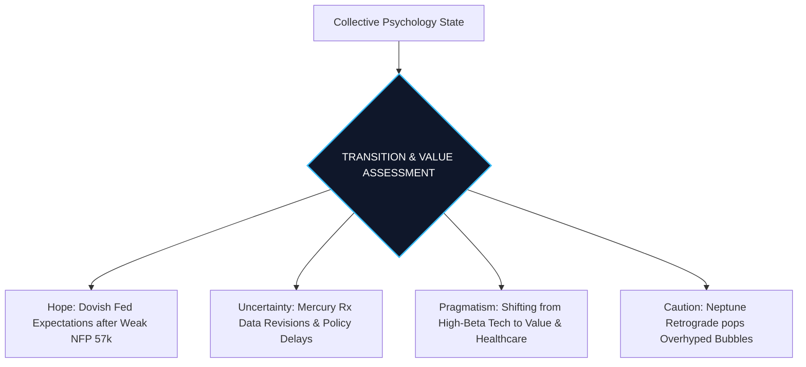

<p align="center"></p>

# Astro Economy Weekly Analysis: Neptune's Awakening & The Pragmatic Shift
*รายงานวิเคราะห์จิตวิทยาการลงทุนและวัฏจักรเศรษฐกิจโลกผ่านมุมสัมพันธ์ดวงดาว (Astro-Economic Cycle & Investor Psychology)*  
**รอบสัปดาห์:** 6 - 12 กรกฎาคม 2026  
**วันที่รายงาน:** 6 กรกฎาคม 2026 (2026-07-06)  
**ผู้วิเคราะห์:** Chief Financial Astrologer & Global Cycle Researcher  
**ไฟล์วิเคราะห์ที่เกี่ยวข้อง:** [global_market_recap_thai_2026_07_03.md](file:///Users/soontorntachasakulnapaporn/Documents/SepKhawGonTrade_Antigravity/global_market_recap_thai_2026_07_03.md), [vip_market_strategy_watchlist_2026_07_04.md](file:///Users/soontorntachasakulnapaporn/Documents/SepKhawGonTrade_Antigravity/vip_market_strategy_watchlist_2026_07_04.md)

---

> [!WARNING]
> **DISCLAIMER / คำเตือนเรื่องความเสี่ยง:**  
> รายงานฉบับนี้จัดทำขึ้นเพื่อการวิเคราะห์สถิติวัฏจักรของดวงดาว (Astrological Cycles) ควบคู่กับข้อมูลจิตวิทยาตลาดและแนวโน้มเศรษฐกิจมหภาคในมุมมองเชิงสัญลักษณ์เท่านั้น **ห้ามนำข้อมูลเหล่านี้ไปใช้เป็นเครื่องมือทำนายทิศทางราคาหลักทรัพย์หรือสินทรัพย์ดิจิทัลโดยตรง** และไม่ใช่คำแนะนำการลงทุน (Not Financial Advice) การตัดสินใจซื้อขายสินทรัพย์ทางการเงินมีความเสี่ยงสูง ผู้ลงทุนควรวิเคราะห์ปัจจัยพื้นฐานและข้อมูลเชิงประจักษ์อย่างรอบคอบ

---

## 🌌 OVERVIEW: THE PRAGMATIC SHIFT & DE-ILLUSION CYCLE
สัปดาห์ที่สองของครึ่งปีหลัง (Q3 2026) เป็นช่วงเวลาแห่งการเปลี่ยนผ่านพลังงานครั้งสำคัญที่ส่งผลโดยตรงต่อจิตวิทยาการลงทุนโลก จุดสนใจหลักย้ายจากการเก็งกำไรที่ร้อนแรงตามกระแสข่าวสารและการพุ่งขึ้นของดัชนีภาพรวม ไปสู่ความมีระเบียบวินัยและการประเมินมูลค่าตามความจริงอันจับต้องได้ 

ปรากฏการณ์ดวงดาวที่เป็นตัวขับเคลื่อนแกนหลักในสัปดาห์นี้ประกอบด้วย:
1. **ดาวเนปจูนหยุดนิ่งเพื่อเตรียมโคจรถอยหลัง (Neptune Stations Retrograde) ในราศีเมษ (Aries) ณ วันที่ 7 กรกฎาคม 2026:** ส่งผลให้เกิดการสะกดจิตวิทยาตลาดให้หันมาประเมินฟองสบู่ โครงการเก็งกำไรที่ไม่มีกระแสเงินสดรองรับ และการชำระล้างความฝันหรือความคาดหวังที่เกินจริง (De-illusion) 
2. **ดาวศุกร์ย้ายเข้าสู่ราศีกันย์ (Venus Ingress Virgo) ในวันที่ 9 กรกฎาคม 2026:** เปลี่ยนโทนพฤติกรรมการบริโภคและการประเมินมูลค่าความมั่งคั่งจากความหรูหราอวดอ้าง (Leo) ไปสู่ความประหยัด มัธยัสถ์ และคุณค่าที่แท้จริงตามหลักปัจจัยพื้นฐาน (Pragmatism)
3. **ดาวพุธโคจรถอยหลังในราศีกรกฎ (Mercury Retrograde in Cancer):** ยังคงสร้างแรงเหวี่ยงต่อข้อมูลเศรษฐกิจผ่านการปรับปรุงตัวเลขย้อนหลัง (Data Revisions) และความเข้าใจผิดด้านนโยบายภาครัฐ
4. **ดาวอังคารเริ่มแยกตัวจากดาวมฤตยูในราศีเมถุน (Mars separating from Uranus in Gemini):** แม้ความตึงเครียดด้านข้อมูลข่าวสารและสงครามไซเบอร์จะเริ่มลดระดับความรุนแรงลง แต่เศษซากของความผันผวนทางเทคนิคยังคงปรากฏให้เห็นในหุ้นกลุ่มเซมิคอนดักเตอร์และคริปโทเคอร์เรนซี

---

## PART 1 — LUNAR ENERGY & COLLECTIVE SENTIMENT

พลังงานของดวงจันทร์สัปดาห์นี้อยู่ในช่วง **ข้างแรม (Waning Moon)** ซึ่งโคจรจากดวงจันทร์ครึ่งดวงมุ่งสู่จุดดับหรือจันทร์ดับ (New Moon in Cancer ในวันที่ 14 กรกฎาคม) พลังงานข้างแรมนี้ในทางโหราศาสตร์การเงินหมายถึง **"การชำระสะสางหนี้สิน การปล่อยวาง และการรักษาสภาพคล่องส่วนเกิน"** มากกว่าการเริ่มต้นเปิดสถานะเก็งกำไรก้าวร้าวรอบใหม่

### 1. Moon Ingress (การโคจรผ่านราศีที่สำคัญประจำสัปดาห์)
*   **ราศีเมษ (Aries - 6 ถึง 8 กรกฎาคม):** เริ่มต้นสัปดาห์ด้วยความกระตือรือร้นและแรงผลักดันเชิงบวก มวลชนมีความกล้าเสี่ยงระยะสั้นชั่วคราว มีการตอบสนองที่รวดเร็วและวู่วามต่อคำแถลงการณ์ต่าง ๆ แต่มีความเปราะบางต่อแรงขายทำกำไรฉับพลัน (Whipsaw)
*   **ราศีพฤษภ (Taurus - 8 ถึง 10 กรกฎาคม):** จิตวิทยามวลชนเปลี่ยนผ่านเข้าสู่โหมดรักษาความมั่นคง ปลอดภัย และเน้นสินทรัพย์ที่มีเสถียรภาพสูง มีแรงซื้อประคองหุ้นกลุ่มคุณค่า ปันผลสูง และทองคำอย่างเด่นชัด
*   **ราศีเมถุน (Gemini - 10 ถึง 12 กรกฎาคม):** กระตุ้นปริมาณการซื้อขายระยะสั้นให้หนาแน่นขึ้นตามกระแสข่าวรายวัน ข้อมูลข่าวลือและการเก็งกำไรระยะสั้นในหุ้นขนาดกลาง-เล็กจะกลับมาคึกคัก แต่ผู้เล่นหลักในตลาดยังคงระมัดระวังตัว
*   **ราศีกรกฎ (Cancer - 12 กรกฎาคมเป็นต้นไป):** จิตวิทยามวลชนกลับมาให้ความสำคัญกับความปลอดภัยภายในบ้าน อารมณ์ตลาดจะสงบนิ่งและเน้นการประเมินความเสี่ยงเพื่อเตรียมรับ New Moon ในราศีกรกฎกลางสัปดาห์ถัดไป

---

## PART 2 — MERCURY: RETROGRADE & DATA REVISIONS

ดาวพุธ (Mercury) ตัวแทนแห่งระบบข้อมูล ข่าวสาร การเจรจาสัญญา และการคมนาคมขนส่ง

*   **Mercury Retrograde in Cancer (ดาวพุธโคจรถอยหลังในราศีกรกฎ):** ตลอดทั้งสัปดาห์ดาวพุธยังคงถอยหลังอย่างต่อเนื่องในราศีธาตุน้ำที่ละเอียดอ่อน ซึ่งสะท้อนถึงการชะลอตัวและการชำระล้างข้อมูลเก่า
*   **จิตวิทยาข่าวสารและการสื่อสารนโยบาย:** ข้อมูลเศรษฐกิจสำคัญที่ประกาศออกมาจะมีเกณฑ์สูงที่จะเผชิญกับการปรับแก้ไขตัวเลขย้อนหลังอย่างหนัก (Heavy Revisions) เช่นเดียวกับที่ตลาดเพิ่งตื่นตระหนกกับตัวเลขการจ้างงานนอกภาคเกษตรสหรัฐฯ (NFP) ประจำเดือนมิถุนายนที่เพิ่มขึ้นต่ำกว่าคาดอย่างรุนแรงเพียง 57,000 ตำแหน่ง การแถลงการณ์ของนักเศรษฐศาสตร์และหน่วยงานรัฐจะมีลักษณะสับสน ตีความได้หลายแง่มุม และสร้างความไม่แน่นอนให้แก่บอทเทรดดิ้ง (Algo-trading)
*   **ความสับสนของตลาด:** เอกสารการค้า สัญญาพันธมิตรร่วมทุน หรือโครงการพัฒนาอสังหาริมทรัพย์ระดับชาติอาจมีปัญหาทางกฎหมายหรือเอกสารล่าช้า นักลงทุนควรหลีกเลี่ยงการตัดสินใจลงทุนในสินทรัพย์ที่ไม่ชัดเจนเรื่องโครงสร้างข้อมูล

---

## PART 3 — VENUS: VALUE REALIZATION & THE VIRGO INGRESS

ดาวศุกร์ (Venus) ตัวแทนของสภาพคล่องทางการเงิน รสนิยมการบริโภค และการประเมินมูลค่าสินทรัพย์

*   **Venus in Leo (6 - 9 กรกฎาคม):** ในช่วงต้นสัปดาห์ ดาวศุกร์ยังคงสถิตอยู่ในราศีสิงห์ กระตุ้นการใช้จ่ายเพื่อสร้างภาพลักษณ์และเก็งกำไรในหุ้นระดับผู้นำ (Mega-caps) แต่การเคลื่อนตัวสู่ปลายราศีทำให้แรงส่งนี้เริ่มหมดกำลัง
*   **Venus enters Virgo (ตั้งแต่วันที่ 9 กรกฎาคม 2026):** การย้ายเข้าสู่ราศีกันย์ซึ่งเป็นตำแหน่งอ่อนกำลัง (Fall/Debilitated) ของดาวศุกร์ จะนำพาจิตวิทยาการเงินโลกเข้าสู่ **"โหมดประเมินความคุ้มค่าอย่างเข้มงวด" (Pragmatic & Cost-Conscious)**
*   **พฤติกรรมผู้บริโภค (Consumer Behavior):** ความต้องการสินค้าแบรนด์หรูหราฟุ่มเฟือย (Luxury) จะชะลอตัวลงชั่วคราว ผู้บริโภคเปลี่ยนมาให้ความสำคัญกับความคุ้มราคาและการประหยัดค่าใช้จ่าย 
*   **ธีมการลงทุน (Investment Themes):** สภาพคล่องจะหมุนเวียนเข้าสู่หุ้นกลุ่มสินค้าอุปโภคบริโภคพื้นฐาน (Consumer Staples) เช่น [CPALL](file:///Users/soontorntachasakulnapaporn/Documents/SepKhawGonTrade_Antigravity/global_market_recap_thai_2026_07_03.md#L58) (ราคาปัจจุบัน 49.00 บาท) ที่ได้รับ Sentiment เชิงบวกจากโครงการกระตุ้นเศรษฐกิจในประเทศ และหุ้นกลุ่มเฮลท์แคร์คุณภาพสูงอย่าง [BDMS](file:///Users/soontorntachasakulnapaporn/Documents/SepKhawGonTrade_Antigravity/global_market_recap_thai_2026_07_03.md#L61) (ราคาปัจจุบัน 20.10 บาท) หรือ [LLY](file:///Users/soontorntachasakulnapaporn/Documents/SepKhawGonTrade_Antigravity/vip_market_strategy_watchlist_2026_07_04.md#L25) (ราคาปัจจุบัน $1,213.91)
*   **Gold (ทองคำ):** ราคาทองคำ Spot ทรงตัวแข็งแกร่งแถวระดับ $4,045.00 ต่อออนซ์ การเข้าสู่ราศีกันย์ของดาวศุกร์ชี้ให้เห็นถึงความสนใจในคุณสมบัติการรักษามูลค่าที่จับต้องได้จริงของทองคำในฐานะเกราะป้องกันภัยทางการเงินที่ดีที่สุดในสัปดาห์นี้

---

## PART 4 — MARS: SHOCKWAVE SEPARATION & INFORMATION FRICTION

ดาวอังคาร (Mars) ตัวแทนของความเสี่ยง พลังขับเคลื่อน Geopolitics และพลังงานทางกายภาพ

*   **Mars separating from Uranus in Gemini (ดาวอังคารแยกห่างจากดาวมฤตยู):** หลังจากเกิดจุดร่วมองศาตึงเครียดสูงสุด (Exact Conjunction) ในช่วงวันที่ 3-4 กรกฎาคม ณ 04° ราศีเมถุน พลังงานในสัปดาห์นี้จะเป็นการ "กระจายแรงสะท้อนกลับ" (Post-Shockwave phase)
*   **Geopolitical Tension & Cyber Risks:** แม้ความเสี่ยงด้านเหตุการณ์ปะทะทางไซเบอร์เฉียบพลันจะลดระดับลง แต่ความตึงเครียดด้าน "สงครามเทคโนโลยีและข่าวสาร" ยังคงดำรงอยู่ เช่น ปัญหาห่วงโซ่อุปทานชิปหน่วยความจำระหว่างสหรัฐฯ และจีนที่กดดันหุ้นอย่าง Micron (MU) และดันให้บริษัทยักษ์ใหญ่ปรับพอร์ตไปหาซัพพลายเชนทางเลือก
*   **Oil & Defense:** ราคาน้ำมันดิบ Brent ย่อตัวปิดระดับ $71.80 ต่อบาร์เรล สะท้อนถึงการคลายตัวของปัจจัยตึงเครียดทางทหารในพื้นที่ดิน (Taurus) แต่การที่ดาวอังคารยังคงสถิตในราศีเมถุนส่งผลให้น้ำมันดิบจะผันผวนตามกระแสข่าวรายวันเป็นหลัก (News-Driven Volatility) ด้านกลุ่มป้องกันประเทศนำโดย [AVAV](file:///Users/soontorntachasakulnapaporn/Documents/SepKhawGonTrade_Antigravity/vip_market_strategy_watchlist_2026_07_04.md#L43) (ราคาปัจจุบัน $190.89) ยังคงได้กระแสเงินทุนไหลเข้าต่อเนื่องจากยอดคำสั่งซื้อด้านความมั่นคงที่เพิ่มขึ้น

---

## PART 5 — JUPITER: SPECTRUM OF SPECULATION & CREATIVE AI

ดาวพฤหัสบดี (Jupiter) ตัวแทนแห่งสติปัญญา ความหวัง และการแผ่ขยายตัวของนวัตกรรมยุคใหม่

*   **Jupiter in Leo (ดาวพฤหัสบดีในราศีสิงห์):** หลังจากการโคจรย้ายราศีอย่างเป็นทางการเมื่อสิ้นเดือนมิถุนายน พลังงานของดาวพฤหัสบดีในราศีธาตุไฟที่เปี่ยมไปด้วยการแสดงออกและความภาคภูมิใจ ได้เริ่มทำงานอย่างเด่นชัด
*   **นวัตกรรมและการขยายตัว (AI & Technology):** ธีมการลงทุนจะพุ่งเป้าไปที่ "Creative AI" หรือระบบปัญญาประดิษฐ์ที่ถูกใช้งานในอุตสาหกรรมบันเทิง สื่อสร้างสรรค์ เกมมิ่ง และการโฆษณา ความเชื่อมั่นในการพัฒนาแพลตฟอร์มปลายน้ำที่มีลักษณะดึงดูดผู้ใช้งานสูงจะมีแรงซื้อสถาบันผลักดัน เช่น [AAPL](file:///Users/soontorntachasakulnapaporn/Documents/SepKhawGonTrade_Antigravity/vip_market_strategy_watchlist_2026_07_04.md#L84) (ราคาปัจจุบัน $308.63) ที่เริ่มเปิดรับการพัฒนา Apple Intelligence
*   **ข้อควรระวัง:** พลังงานของราศีสิงห์มักกระตุ้นความมั่นใจที่เกินขนาด (Overconfidence) และการเก็งกำไรบนพื้นฐานของความภาคภูมิใจในแบรนด์หรือบริษัทสตาร์ทอัปที่มีชื่อเสียงแต่ขาดผลกำไรจริง

---

## PART 6 — SATURN: CREDIT RESTRUCTURING & FINANCIAL STRAIN

ดาวเสาร์ (Saturn) ตัวแทนของหนี้สิน กฎเกณฑ์ วินัย และข้อจำกัดเชิงโครงสร้าง

*   **Saturn in Aries (ดาวเสาร์ในราศีเมษ):** ดาวเสาร์อยู่ในสภาวะชะลอความเร็วเพื่อเตรียมโคจรถอยหลังปลายเดือนนี้ ตอกย้ำให้เห็นถึงปัญหาเชิงโครงสร้างของระบบการเงิน
*   **Bond Market & Government Policy:** อัตราผลตอบแทนพันธบัตรรัฐบาลยังคงทรงตัวในระดับสูง กดดันขีดความสามารถในการระดมทุนของภาครัฐและเอกชน วินัยการคลังจะกลายเป็นข้อบังคับที่ประเทศต่าง ๆ ต้องปฏิบัติอย่างเลี่ยงไม่ได้ 
*   **Financial Sector & Debt:** ภาคธนาคารขนาดใหญ่ยังคงดำเนินนโยบายปล่อยสินเชื่อที่เข้มงวด ส่งผลให้บริษัทขนาดเล็ก (Small Caps) ในดัชนี Russell 2000 เผชิญกับปัญหาการรีไฟแนนซ์หนี้สินที่ตึงตัวขึ้น ธนาคารพาณิชย์หลักของไทยอย่าง [KBANK](file:///Users/soontorntachasakulnapaporn/Documents/SepKhawGonTrade_Antigravity/global_market_recap_thai_2026_07_03.md#L57) (ราคาปัจจุบัน 233.00 บาท) แม้จะได้อานิสงส์จาก Fund Flow ต่างชาติเข้าซื้อสะสม แต่การดำเนินนโยบายสินเชื่อยังคงเป็นไปอย่างระมัดระวังเพื่อคุมระดับหนี้เสีย (NPLs)

---

## PART 7 — PLUTO: TRANSFORMATION & DECENTRALIZED REBUILD

ดาวพลูโต (Pluto) ตัวแทนของวิวัฒนาการเชิงลึก การชำระล้าง และการเกิดใหม่ของระบบโครงสร้างพื้นฐาน

*   **Pluto Retrograde in Aquarius (ดาวพลูโตโคจรองศาถอยหลังในราศีกุมภ์):** กระตุ้นให้เกิดการปฏิรูปโครงสร้างทางเทคโนโลยีและระบบกระจายศูนย์ (Web3/Crypto)
*   **AI Revolution & Crypto Adoption:** ภายใต้กระแสการถอยหลังนี้ สินทรัพย์ดิจิทัลที่ขับเคลื่อนด้วยการเก็งกำไรอย่างไร้ประโยชน์ใช้งานจริง (Hype-based Memecoins) จะถูกระบบตลาดทำความสะอาดและคัดกรองออกอย่างต่อเนื่อง ในขณะที่ Bitcoin (ราคาปัจจุบัน $61,350) และ Ethereum รวมถึงระบบประมวลผลเครือข่ายปัญญาประดิษฐ์และพลังงานทางเลือกอย่าง [VST](file:///Users/soontorntachasakulnapaporn/Documents/SepKhawGonTrade_Antigravity/vip_market_strategy_watchlist_2026_07_04.md#L61) (ราคาปัจจุบัน $151.05) จะเริ่มเห็นพัฒนาการเชิงประจักษ์ในการยอมรับเชิงพาณิชย์และระดับโครงสร้างพื้นฐานแห่งอนาคต

---

## PART 8 — COLLECTIVE PSYCHOLOGY STATE



ในสัปดาห์นี้ จิตวิทยาตลาดจัดอยู่ในภาวะ **Transition & Value Assessment (การเปลี่ยนผ่านและประเมินมูลค่าใหม่)** โดยมีแรงขับเคลื่อนทางจิตวิทยาดังนี้:

*   **ความสอดคล้องกับดวงดาว:** การปรับฐานของดัชนี Nasdaq (-0.80%) สวนทางกับ Dow Jones (+1.14%) ที่พุ่งสู่ระดับนิวไฮ 52,900.07 จุด หลังการรายงานตัวเลข NFP ชี้ชัดว่า เงินทุนสถาบันกำลังหมุนเวียนออกจากหุ้นเทคโนโลยีชิปต้นน้ำที่ราคาตึงตัวสูง เข้าสู่กลุ่ม Defensive & Value สอดคล้องโดยตรงกับการย้ายราศีของดาวศุกร์เข้าสู่ราศีกันย์ (Pragmatism) และการหยุดนิ่งของดาวเนปจูน (Reality Check)
*   **ความขัดแย้งของพลังงาน:** ความหวังของตลาด (Hope) ต่อการลดดอกเบี้ยเฟดหลังตัวเลขจ้างงานตกต่ำทำให้อารมณ์ตลาดเป็นบวกชั่วคราว แต่จะถูกขัดขวางด้วยความกังวลเชิงลึกเรื่องภาวะเศรษฐกิจชะลอตัวและความไม่แน่นอนของข่าวสารเนื่องจากอิทธิพลของดาวพุธถอยหลัง ทำให้นักลงทุนสลับโหมดตัดสินใจไปมาอย่างไร้ทิศทางชัดเจนในช่วงกลางสัปดาห์

---

## PART 9 — ASTRO THEMES OF THE WEEK

1.  **De-illusion (การตื่นจากภาพลวงตา):** อิทธิพลจาก Neptune Stations Retrograde ณ วันที่ 7 กรกฎาคม ช่วยเปิดเผยข้อเท็จจริง คลายภาพลวงตาเชิงบวกของสินทรัพย์เก็งกำไร และดึงให้นักลงทุนหันมามองความเป็นจริงของผลประกอบการ
2.  **Pragmatism (ลัทธิปฏิบัตินิยม):** ดาวศุกร์ย้ายเข้าสู่ราศีกันย์ในวันที่ 9 กรกฎาคม บังคับให้จิตวิทยาผู้บริโภคและการจัดพอร์ตโฟกัสที่ "ความคุ้มค่าสูงสุด" หุ้นสินค้าจำเป็น หุ้นปันผล และระบบควบคุมต้นทุนจะได้แรงหนุน
3.  **Data-Revisions (การสะสางตัวเลข):** อิทธิพลดาวพุธถอยหลังในราศีกรกฎทำให้ตัวเลขสถิติเศรษฐกิจและงบการบัญชีถูกปรับย้อนหลังอย่างมีนัยสำคัญ สร้างความกังวลให้แก่นักเก็งกำไรระยะสั้น
4.  **Creative-Expansion (การขยายตัวเชิงสร้างสรรค์):** ดาวพฤหัสบดีในราศีสิงห์เบนเข็มความหวังนวัตกรรมไปสู่กลุ่ม Creative AI, สื่อสังคมออนไลน์, และเทคโนโลยีบันเทิงชั้นนำ
5.  **Post-Shockwave (ช่วงฟื้นตัวหลังแรงกระแทก):** ดาวอังคารแยกห่างจากมฤตยู ส่งผลให้ตลาดผ่านจุดผันผวนเชิงลึกจากการทดสอบระบบหรือข่าวลือ และพยายามสร้างรากฐานราคาขึ้นใหม่

---

## PART 10 — ASTRO RISK WINDOW

### 🚨 วันที่พลังงานดวงดาวตึงเครียดที่สุด: 7 กรกฎาคม 2026
*   **รายละเอียดเชิงโหราศาสตร์:** เป็นวันที่ดาวเนปจูนสถิตนิ่งเพื่อเตรียมเดินถอยหลัง (Neptune Stationary Retrograde) ณ 04° ราศีเมษ ทำมุมตึงเครียดกึ่งฉากกับดาวพุธที่กำลังเดินถอยหลังในราศีกรกรกฎ
*   **ผลกระทบทางจิตวิทยาตลาด:** ระวังความกังวลหรือความตื่นตระหนกที่ไม่มีเหตุผลแน่ชัด (Phantom Fear) ข่าวลือเชิงลบที่สร้างความเข้าใจผิดเกี่ยวกับนโยบายสถาบันการเงินหรือการตรวจสอบกฎระเบียบของรัฐ และการเปิดเผยฟองสบู่การเงินในสินทรัพย์ทางเลือก หลีกเลี่ยงการเปิดสถานะเก็งกำไรตามอารมณ์มวลชนในวันนี้

### 🍃 วันที่พลังงานดวงดาวผ่อนคลายที่สุด: 9 - 10 กรกฎาคม 2026
*   **รายละเอียดเชิงโหราศาสตร์:** ดวงจันทร์ข้างแรมเคลื่อนเข้าสู่ราศีพฤษภธาตุดินที่มั่นคง สอดรับกับการที่ดาวศุกร์เคลื่อนเข้าสู่ราศีกันย์ธาตุดิน สร้างความเกื้อหนุนทางสัญลักษณ์ของธาตุดินเพื่อหนุนนำภาคการเงินจริง
*   **ผลกระทบทางจิตวิทยาตลาด:** ตลาดสลัดความตื่นตระหนกออกไปและกลับมามีความมั่นใจเชิงประจักษ์ สถาบันการเงินสัญชาติหลักเข้าช้อนซื้อหุ้นกลุ่มคุณค่าและปลอดภัย (Value & Defensive Stocks) เกิดความชัดเจนในการแก้ไขปัญหางบดุลและหนี้สิน บรรยากาศการเจรจาธุรกิจเป็นไปอย่างรอบคอบแต่มีประสิทธิผลสูง

---

## PART 11 — ASTRO OPPORTUNITY WINDOW

*   **ช่วงเวลาสำหรับการทบทวนระบบและค้นหาข้อผิดพลาด (6 - 7 กรกฎาคม 2026):** อิทธิพลดาวพุธถอยหลังสอดประสานกับเนปจูนนิ่ง เหมาะสำหรับการจัดทำบัญชี ย้อนดูบันทึกการซื้อขายในอดีต (Trade Logs) ตรวจทานสัญญาสินเชื่อ และค้นหารอยรั่วทางการเงินขององค์กร
*   **ช่วงเวลาสำหรับการสะสมสินทรัพย์คุณค่าเชิงโครงสร้าง (8 - 10 กรกฎาคม 2026):** ดวงจันทร์ในราศีพฤษภเอื้อต่อการเข้าซื้อเพื่อสะสมสินทรัพย์จริง (Hard Assets) เช่น ทองคำ Spot ($4,045.00) หรือหุ้นกลุ่มโครงสร้างพื้นฐานพลังงานทดแทนที่ได้รับผลตอบแทนสม่ำเสมออย่าง [VST](file:///Users/soontorntachasakulnapaporn/Documents/SepKhawGonTrade_Antigravity/vip_market_strategy_watchlist_2026_07_04.md#L61) (ราคาปัจจุบัน $151.05)
*   **ช่วงเวลาสำหรับการปรับสมดุลพอร์ตเข้าสู่โหมดปลอดภัย (11 - 12 กรกฎาคม 2026):** ก่อนที่ดวงจันทร์จะย้ายเข้าสู่จุด New Moon ในราศีกรกฎ ควรใช้ช่วงเวลานี้จัดสรรสัดส่วนการลงทุนไปสู่หุ้นกลุ่ม Defensive และสถาบันการเงินที่มีความทนทานต่ออัตราดอกเบี้ยสูง เช่น [KBANK](file:///Users/soontorntachasakulnapaporn/Documents/SepKhawGonTrade_Antigravity/global_market_recap_thai_2026_07_03.md#L57) (ราคา 233.00 บาท) และหุ้นกลุ่มปลอดภัยในประเทศอย่าง [ADVANC](file:///Users/soontorntachasakulnapaporn/Documents/SepKhawGonTrade_Antigravity/global_market_recap_thai_2026_07_03.md#L60) (ราคา 375.00 บาท)

---

## FINAL SUMMARY

```
【ASTRO-ECONOMIC ALIGNMENT SYSTEM】

        [Primary Energy: Neptune Retrograde Station]    [Macro Theme: Pragmatic Value Shift]
        De-illusion / Scandal Exposures                  Tech Rotation / Cost-Consciousness
                                \                           /
                                 \                         /
                                  ▼                       ▼
                          [ALIGNMENT: CAUTIOUS VALUE CONVERGENCE (92%)]
                          - Capital Rotation from High-Beta Semiconductors to Defensives
                          - Growing Demand for Safe Haven Spot Gold ($4,045.00/oz)
                          - Strategic Allocation to Cash Reserves and High-Yielding Bonds
```

### 🌕 พลังงานหลักของสัปดาห์
การตื่นรู้และขจัดภาพลวงตาเชิงจิตวิทยาภายใต้อิทธิพลของ Neptune Stations Retrograde ประกอบกับการเปลี่ยนพฤติกรรมการตัดสินใจทางการเงินไปสู่ความรอบคอบและเน้นมูลค่าจริงเมื่อดาวศุกร์ย้ายเข้าสู่ราศีกันย์ (Venus in Virgo)

### 🌍 ธีมเศรษฐกิจที่โดดเด่น
การดำเนินนโยบายที่เน้นการปรับลดต้นทุนภายในองค์กร (Cost Optimization) การย้ายฐานการผลิตเทคโนโลยีเพื่อป้องกันความมั่นคงเฉพาะกลุ่ม และความสับสนจากการปรับแก้ตัวเลขทางบัญชีและสถิติสำคัญประจำปีของธนาคารกลาง

### 📈 กลุ่มอุตสาหกรรมที่ได้รับอิทธิพลเชิงบวก
*   **Consumer Staples & Utilities (สินค้าจำเป็นและสาธารณูปโภค):** ได้ประโยชน์จากจิตวิทยาเน้นความประหยัดและความต้องการใช้ไฟฟ้าอย่างต่อเนื่องของระบบ AI เช่น [CPALL](file:///Users/soontorntachasakulnapaporn/Documents/SepKhawGonTrade_Antigravity/global_market_recap_thai_2026_07_03.md#L58) (49.00 บาท) และ [VST](file:///Users/soontorntachasakulnapaporn/Documents/SepKhawGonTrade_Antigravity/vip_market_strategy_watchlist_2026_07_04.md#L61) ($151.05)
*   **Gold & Real Assets (ทองคำและทรัพย์สินมีค่า):** ยืนหยัดอย่างมั่นคงในฐานะจุดหลบภัยความผันผวนของข้อมูลข่าวสาร ($4,045.00/oz)
*   **Healthcare & Big Pharma:** ธุรกิจยารักษาโรคและบริการโรงพยาบาลพรีเมียมที่ทนทานต่อสภาวะเงินเฟ้อสูง เช่น [LLY](file:///Users/soontorntachasakulnapaporn/Documents/SepKhawGonTrade_Antigravity/vip_market_strategy_watchlist_2026_07_04.md#L25) ($1,213.91) และ [BDMS](file:///Users/soontorntachasakulnapaporn/Documents/SepKhawGonTrade_Antigravity/global_market_recap_thai_2026_07_03.md#L61) (20.10 บาท)
*   **Defense & Cyber Security (อุตสาหกรรมป้องกันประเทศ):** เติบโตตามงบประมาณความมั่นคงระดับชาติท่ามกลางแรงกระเพื่อมภูมิรัฐศาสตร์ข่าวสาร เช่น [AVAV](file:///Users/soontorntachasakulnapaporn/Documents/SepKhawGonTrade_Antigravity/vip_market_strategy_watchlist_2026_07_04.md#L43) ($190.89)

### ⚠️ กลุ่มที่ควรระวัง
*   **Overhyped Tech & Upstream Semiconductors:** กลุ่มฮาร์ดแวร์เซมิคอนดักเตอร์และชิปต้นน้ำที่ราคาตึงตัวสูงและเผชิญความผันผวนจากการสลับกลุ่มการลงทุนของกองทุนหลัก เช่น [DELTA](file:///Users/soontorntachasakulnapaporn/Documents/SepKhawGonTrade_Antigravity/global_market_recap_thai_2026_07_03.md#L84) (315.00 บาท) และ [HANA](file:///Users/soontorntachasakulnapaporn/Documents/SepKhawGonTrade_Antigravity/global_market_recap_thai_2026_07_03.md#L79) (37.25 บาท)
*   **Highly Indebted Small-Caps:** ธุรกิจขนาดเล็กที่ขาดกระแสเงินสดและมีภาระดอกเบี้ยจ่ายสูงเนื่องจากการคุมเข้มเงื่อนไขปล่อยกู้ตามข้อจำกัดของดาวเสาร์
*   **Speculative Altcoins:** สินทรัพย์ดิจิทัลทางเลือกที่ไม่มีกลไกสร้างรายได้จริงและพึ่งพาแต่กระแสเก็งกำไรในโซเชียลมีเดีย

### 🧠 บทเรียนด้านจิตวิทยาการลงทุน
"ภาพลวงตาอาจทำให้เรารู้สึกมั่งคั่งในช่วงสั้น แต่ความจริงทางบัญชีคือสิ่งที่คุ้มครองทรัพย์สินของเราในระยะยาว" ในช่วงที่ดาวศุกร์เคลื่อนเข้าสู่ราศีกันย์และเนปจูนถอยหลัง นักลงทุนที่เลือกจะละทิ้งความตื่นเต้นชั่วคราวแล้วหันมาวิเคราะห์งบดุล รายได้จริง และอัตราการชำระหนี้ คือผู้ที่จะสามารถประคองพอร์ตให้รอดพ้นจากสภาวะลมเปลี่ยนทิศได้อย่างยั่งยืน

### 🔮 ข้อคิดประจำสัปดาห์
*"เมื่อหมอกควันแห่งจินตนาการเลือนหายไป มีเพียงรากฐานที่ก่อตัวขึ้นด้วยเหตุผลและข้อมูลจริงเท่านั้นที่จะยืนหยัดท้าทายพายุแห่งความเปลี่ยนแปลงได้"*

---
## 🌐 แหล่งข้อมูลอ้างอิง (Sources)
*   Astrology Transit Data: [Moon Omens Astrology Guide](https://www.moonomens.com), [Ask Astrology July 2026 Reports](https://www.askastrology.com)
*   U.S. Market Holiday Information: [Nasdaq Trading Schedule 2026](https://www.nasdaq.com), [NYSE Holiday Calendar](https://www.nyse.com)
*   Thai Market Financial Data: [SET Index Summary July 3, 2026](https://www.set.or.th)
*   Institutional Flows & Stock Watchlist: [SepKhawGonTrade Intelligence Division Archive](file:///Users/soontorntachasakulnapaporn/Documents/SepKhawGonTrade_Antigravity/vip_market_strategy_watchlist_2026_07_04.md)
