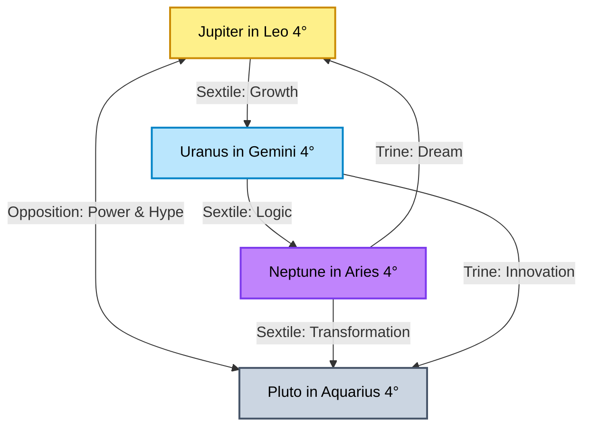

<p align="center"></p>

# Astro Economy Weekly Analysis: The Cosmic Cradle & Structural Rebalancing
*รายงานวิเคราะห์จิตวิทยาการลงทุนและวัฏจักรเศรษฐกิจโลกผ่านมุมสัมพันธ์ดวงดาว (Astro-Economic Cycle & Investor Psychology)*  
**รอบสัปดาห์:** 13 - 19 กรกฎาคม 2026  
**วันที่รายงาน:** 12 กรกฎาคม 2026 (2026-07-12)  
**ผู้วิเคราะห์:** Chief Financial Astrologer & Global Cycle Researcher  
**ไฟล์วิเคราะห์ที่เกี่ยวข้อง:** [global_market_recap_thai_2026_07_10.md](file:///Users/soontorntachasakulnapaporn/Documents/SepKhawGonTrade_Antigravity/global_market_recap_thai_2026_07_10.md), [oversold_opportunity_report_2026_07_12.md](file:///Users/soontorntachasakulnapaporn/Documents/SepKhawGonTrade_Antigravity/oversold_opportunity_report_2026_07_12.md)

---

> [!WARNING]
> **DISCLAIMER / คำเตือนเรื่องความเสี่ยง:**  
> รายงานฉบับนี้จัดทำขึ้นเพื่อการวิเคราะห์สถิติวัฏจักรของดวงดาว (Astrological Cycles) ควบคู่กับข้อมูลจิตวิทยาตลาดและแนวโน้มเศรษฐกิจมหภาคในมุมมองเชิงสัญลักษณ์เท่านั้น **ห้ามนำข้อมูลเหล่านี้ไปใช้เป็นเครื่องมือทำนายทิศทางราคาหลักทรัพย์หรือสินทรัพย์ดิจิทัลโดยตรง** และไม่ใช่คำแนะนำการลงทุน (Not Financial Advice) การตัดสินใจซื้อขายสินทรัพย์ทางการเงินมีความเสี่ยงสูง ผู้ลงทุนควรวิเคราะห์ปัจจัยพื้นฐานและข้อมูลเชิงประจักษ์อย่างรอบคอบ

---

## 🌌 OVERVIEW: THE COSMIC CRADLE & HARMONIC SHIFTS
สัปดาห์ที่สามของเดือนกรกฎาคม 2026 เป็นหนึ่งในสัปดาห์ที่น่าจับตามองที่สุดของปีในแง่ของโหราศาสตร์ Mundane และ Financial Astronomy เนื่องจากเป็นจุดเริ่มต้นของปรากฏการณ์ที่หาได้ยากอย่างยิ่ง นั่นคือ **"โครงสร้างดวงดาวรูปเปลญวน" (The Cosmic Cradle Configuration)** ซึ่งเกิดจากการสอดประสานกันของดาวเคราะห์วงนอก 4 ดวง ได้แก่ **ดาวพฤหัสบดี (Jupiter), ดาวมฤตยู (Uranus), ดาวเนปจูน (Neptune) และดาวพลูโต (Pluto)** ที่โคจรเข้าสู่มุมสัมพันธ์ 4 องศาของราศีของตนอย่างพร้อมเพรียงกัน (Leo, Gemini, Aries, และ Aquarius ตามลำดับ) [ที่มา: Astrologgia July 2026 Report]

พลังงานหลักในสัปดาห์นี้แบ่งออกเป็น 3 แกนสำคัญ:
1. **The Cradle Alignment (15 - 24 กรกฎาคม 2026):** การสอดประสานของพลังงานนวัตกรรมและการปฏิรูปโครงสร้างทางเทคโนโลยี (Uranus-Pluto) ร่วมกับความคาดหวังเชิงบวกและการแผ่ขยายตัวของเศรษฐกิจสร้างสรรค์ (Jupiter-Neptune) นำมาซึ่งบรรยากาศของการหาจุดสมดุลใหม่ท่ามกลางวิกฤตความตึงเครียดด้านข้อมูล
2. **Venus Square Uranus (13 กรกฎาคม 2026):** มุมตึงเครียดฉับพลันระหว่างดาวศุกร์ในราศีกันย์กับดาวมฤตยูในราศีเมถุน ส่งผลต่อความผันผวนของค่าเงิน สินทรัพย์เสี่ยง และพฤติกรรมการบริโภคที่เปลี่ยนไปอย่างกะทันหัน [ที่มา: Cafe Astrology, กรกฎาคม 2026]
3. **New Moon in Cancer (14 กรกฎาคม 2026):** จุดจันทร์ดับ ณ 21° ราศีกรกฎ ทำมุมตึงเครียดกับดาวเสาร์ (Saturn) สะท้อนถึงการทบทวนเรื่องเสถียรภาพทางการเงินส่วนบุคคล ความปลอดภัยในครัวเรือน และความตึงตัวของนโยบายสินเชื่อ [ที่มา: Moon Omens, กรกฎาคม 2026]

---

## PART 1 — LUNAR ENERGY & COLLECTIVE SENTIMENT

ในสัปดาห์นี้ ปรากฏการณ์ของดวงจันทร์จะเริ่มต้นด้วย **จันทร์ดับ (New Moon in Cancer) ณ วันที่ 14 กรกฎาคม 2026** [ที่มา: YourTango, กรกฎาคม 2026] ซึ่งเป็นสัญลักษณ์ของการเริ่มต้นใหม่ในมิติจิตวิทยา ความมั่นคง และการสร้างเกราะป้องกันภัยส่วนตัว อย่างไรก็ตาม การที่ New Moon นี้เกิดขึ้นภายใต้ดาวพุธโคจรถอยหลัง (Mercury Retrograde) และทำมุมฉากกับดาวเสาร์ บ่งชี้ว่าอารมณ์ของมวลชนจะมีความอ่อนไหวสูง มีความกลัวแฝงในเรื่องความเสถียรภาพของรายได้ และจะเน้นการปกป้องเงินทุนมากกว่าการกระโจนเข้าหาความเสี่ยง

### 1. Moon Ingress (การโคจรผ่านราศีที่สำคัญประจำสัปดาห์)
*   **ราศีกรกฎ (Cancer - 12 ถึง 14 กรกฎาคม):** มวลชนให้ความสำคัญกับความปลอดภัยภายในบ้านและครอบครัว อารมณ์ตลาดมีความอ่อนไหวและระมัดระวังตัวสูง นักลงทุนมีแนวโน้มที่จะรักษาสภาพคล่องและประเมินผลกระทบด้านลบก่อนการตัดสินใจ
*   **ราศีสิงห์ (Leo - 14 ถึง 16 กรกฎาคม):** หลังจันทร์ดับ ดวงจันทร์เคลื่อนเข้าทับดาวพฤหัสบดี (Jupiter) ในราศีสิงห์ กระตุ้นความกล้าเสี่ยงและการกลับมาของความหวัง (Hope) ความเชื่อมั่นทางจิตวิทยาฟื้นตัวชั่วคราว มีการเก็งกำไรในหุ้นเทคโนโลยีระดับ Mega-cap และกลุ่มบันเทิงสร้างสรรค์
*   **ราศีกันย์ (Virgo - 16 ถึง 18 กรกฎาคม):** อารมณ์ตลาดปรับเข้าสู่ความละเอียดรอบคอบ มวลชนหันมาเน้นข้อมูลสถิติ งบดุล และการตรวจสอบความคุ้มค่าของราคาหุ้นรายตัว สอดรับกับดาวศุกร์ในราศีกันย์
*   **ราศีตุล (Libra - 19 กรกฎาคมเป็นต้นไป):** ตลาดพยายามแสวงหาความสมดุลและการประนีประนอม นวัตกรรมการเงินและการเจรจาพันธมิตรจะได้รับความสนใจเพื่อลดความผันผวน

---

## PART 2 — MERCURY: RETROGRADE & POLICY CORRECTIONS

ดาวพุธ (Mercury) ตัวแทนของการสื่อสาร ข้อมูลข่าวสาร และระบบโลจิสติกส์

*   **Mercury Retrograde in Cancer (ดาวพุธโคจรถอยหลังในราศีกรกฎ):** ตลอดทั้งสัปดาห์นี้ดาวพุธยังคงเดินถอยหลังในราศีกรกฎอย่างต่อเนื่อง [ที่มา: Russh Magazine, กรกฎาคม 2026] ส่งผลให้ข่าวสารและข้อมูลตัวเลขเศรษฐกิจมหภาคที่ประกาศออกมายังคงเผชิญกับการปรับปรุงตัวเลขย้อนหลัง (Data Revisions)
*   **ความสับสนของตลาด:** นโยบายช่วยเหลือทางการเงินของภาครัฐ การปรับเกณฑ์ดอกเบี้ย หรือมาตรการเยียวยาอสังหาริมทรัพย์อาจมีการชะลอตัวหรือต้องนำกลับไปแก้ไขโครงสร้างทางกฎหมาย สร้างความสับสนให้กับนักลงทุนระยะสั้นที่อ่อนไหวต่อข่าวสาร
*   **คำแนะนำเชิงจิตวิทยา:** เป็นช่วงเวลาที่ไม่เหมาะสำหรับการเชื่อข่าวลือในโซเชียลมีเดีย ควรเน้นข้อมูลดิบอย่างเป็นทางการที่ผ่านการตรวจสอบแล้วเท่านั้น เพื่อหลีกเลี่ยงความเสียหายจากความผันผวนของระบบเทรดอัตโนมัติ (Algo-trading)

---

## PART 3 — VENUS: SPENDING VOLATILITY & VALUE SHIFT

ดาวศุกร์ (Venus) ตัวแทนของสภาพคล่อง พฤติกรรมการใช้จ่าย และการประเมินมูลค่าสินทรัพย์

*   **Venus in Virgo (ดาวศุกร์ในราศีกันย์):** สถิตในตำแหน่งอ่อนกำลัง (Fall) บังคับให้ผู้บริโภคคิดคำนวณอย่างรอบคอบและเลือกซื้อสินค้าจำเป็น (Consumer Staples) มากกว่าสินค้าฟุ่มเฟือย
*   **Venus Square Uranus (13 กรกฎาคม 2026):** มุมตึงเครียดกะทันหันกับดาวมฤตยูสะท้อนถึงการเปลี่ยนแปลงพฤติกรรมผู้บริโภคที่รวดเร็วเกินคาด เช่น ยอดขายสินค้ากลุ่ม Luxury หรือหุ้นกลุ่มค้าปลีกขนาดใหญ่ที่ผันผวนกะทันหัน ตัวอย่างราคาหุ้นห้างสรรพสินค้าและสินค้าอุปโภคบริโภคพื้นฐานของไทยอย่าง **CPALL** ปิดตัวที่ 46.75 บาท (-1.06%) [ที่มา: SET, 10 กรกฎาคม 2026] และกลุ่มบริการทางการแพทย์อย่าง **BDMS** ปิดที่ 19.60 บาท (+0.51%) [ที่มา: SET, 10 กรกฎาคม 2026]
*   **Gold (ทองคำ):** ราคาทองคำ Spot ยืนแข็งแกร่งที่ **$4,121.05 ต่อออนซ์** [ที่มา: Trading Economics, 10 กรกฎาคม 2026] ในขณะที่ราคาทองคำแท่งในประเทศขายออกที่ **64,800 บาท** และทองรูปพรรณขายออกที่ **65,600 – 65,800 บาท** [ที่มา: สมาคมค้าทองคำ, 10 กรกฎาคม 2026] มุมฉากนี้ชี้ให้เห็นถึงความผันผวนของค่าเงินดอลลาร์ที่ผลักดันให้ทองคำทำหน้าที่เป็นสินทรัพย์หลบภัยที่มีเสถียรภาพสูงที่สุดในสัปดาห์นี้

---

## PART 4 — MARS: RESTLESSNESS & COMMODITY FRICTION

ดาวอังคาร (Mars) ตัวแทนของพลังขับเคลื่อน ความเร่งรีบ ความเสี่ยง และความขัดแย้งเชิงภูมิรัฐศาสตร์

*   **Mars in Gemini (ดาวอังคารในราศีเมถุน):** การสถิตในราศีธาตุลมส่งผลให้เกิดความตึงเครียดผ่านทางสงครามข้อมูล ข่าวสารไซเบอร์ และการโจมตีทางเทคโนโลยีมากกว่าการปะทะทางทหารแบบดั้งเดิม
*   **Oil & Commodities:** ราคาน้ำมันดิบ Brent เคลื่อนไหวในกรอบ **$75.22 - $76.14 ต่อบาร์เรล** [ที่มา: Financial Times, 10 กรกฎาคม 2026] พลังงานดาวอังคารในราศีเมถุนชี้ให้เห็นถึงการเก็งกำไรราคาน้ำมันดิบตามข่าวลือเรื่องการควบคุมปริมาณการผลิตในตะวันออกกลางและความกังวลด้านห่วงโซ่อุปทานการส่งออกสินค้าโภคภัณฑ์ทางเรือ
*   **Defense Sector:** หุ้นกลุ่มป้องกันประเทศและความปลอดภัยทางไซเบอร์จะได้รับประโยชน์เชิงจิตวิทยาจากการที่ประเทศต่าง ๆ หันมาเพิ่มงบประมาณเพื่อป้องกันความปลอดภัยทางดิจิทัลและระบบการสื่อสารแห่งชาติ

---

## PART 5 — JUPITER: EXPANSION & CREATIVE OPTIMISM

ดาวพฤหัสบดี (Jupiter) ตัวแทนของความเชื่อมั่น การขยายตัวทางเศรษฐกิจ และโอกาสใหม่ ๆ

*   **Jupiter in Leo (ดาวพฤหัสบดีในราศีสิงห์):** ทำหน้าที่เป็นแกนหลักในโครงสร้าง Cradle โดยทำมุมสามเหลี่ยมเอื้อประโยชน์แก่ดาวเนปจูน (Neptune) และส่งพลังบวกแก่ดาวมฤตยู (Uranus)
*   **AI & Technology themes:** พลังงานของราศีสิงห์ปลุกเร้าความเชื่อมั่นในอุตสาหกรรมนวัตกรรมยุคใหม่ โดยเฉพาะกลุ่ม **Creative AI** สื่อสร้างสรรค์ และอุปกรณ์บันเทิงอัจฉริยะ ตัวอย่างเช่น **AAPL** (Apple Inc.) ปิดที่ $315.32 [ที่มา: Stock Analysis, 10 กรกฎาคม 2026] และ **MSFT** (Microsoft Corp.) ปิดที่ $385.10 [ที่มา: Stock Analysis, 10 กรกฎาคม 2026] ที่กำลังแผ่ขยายระบบนิเวศน์ทางปัญญาประดิษฐ์เพื่อตอบรับความต้องการใช้งานปลายน้ำของมวลชน
*   **จิตวิทยาการลงทุน:** ปลุกเร้าสัญชาตญาณของการเก็งกำไรบนพื้นฐานความต้องการการยอมรับและความเป็นผู้นำตลาด แต่เนื่องจากติดโครงสร้างหนี้สินจึงเน้นลงทุนเฉพาะในบริษัทที่มีกระแสเงินสดแข็งแกร่งอย่างแท้จริง

---

## PART 6 — SATURN: CREDIT TIGHTENING & REGULATORY PRESSURE

ดาวเสาร์ (Saturn) ตัวแทนของกฎเกณฑ์ วินัย ข้อจำกัด และหนี้สินเชิงโครงสร้าง

*   **Saturn in Aries (ดาวเสาร์ในราศีเมษ):** โคจรสั่นไหวในตำแหน่งตึงเครียด (Square) กับ New Moon ในราศีกรกฎ บังคับให้สถาบันการเงินและภาครัฐต้องเผชิญหน้ากับความจริงเรื่องหนี้สินสะสม
*   **Bond Market & Government Policy:** อัตราผลตอบแทนพันธบัตรรัฐบาล (Bond Yields) ทรงตัวในระดับสูง กดดันราคาตราสารหนี้และเพิ่มต้นทุนการกู้ยืมของภาคเอกชน ภาครัฐต้องเน้นการคุมวินัยการคลังอย่างเข้มงวด
*   **Financial Sector:** ภาคธนาคารยังคงต้องคุมระดับหนี้เสีย (NPLs) อย่างรัดกุม ส่งผลให้หุ้นกลุ่มสถาบันการเงินเน้นประคองตัว เช่น **KBANK** ปิดที่ 232.00 บาท (+0.87%) [ที่มา: SET, 10 กรกฎาคม 2026] ที่เน้นความระมัดระวังในการปล่อยสินเชื่อเพื่อลดความเสี่ยงเชิงโครงสร้างหนี้

---

## PART 7 — PLUTO: METAMORPHOSIS & TECH INTEGRATION

ดาวพลูโต (Pluto) ตัวแทนของพลังการเปลี่ยนแปลงเชิงลึก การทำลายโครงสร้างเก่าเพื่อสร้างระบบใหม่

*   **Pluto Retrograde in Aquarius (ดาวพลูโตโคจรถอยหลังในราศีกุมภ์):** ทำมุมตรงข้าม (Opposition) กับดาวพฤหัสบดีในราศีสิงห์ ชี้ถึงการต่อสู้กันระหว่างกลุ่มอำนาขผูกขาดเทคโนโลยีแบบดั้งเดิมกับระบบกระจายศูนย์รุ่นใหม่ (Decentralized Networks)
*   **AI Revolution & Crypto Adoption:** ภายใต้พลังงานนี้ สินทรัพย์ดิจิทัลอย่าง **Bitcoin (BTC)** เคลื่อนไหวปิดตลาดที่ระดับ **$63,220.69** [ที่มา: YCharts, 10 กรกฎาคม 2026] ซึ่งแสดงถึงการสะสมพลังงานเพื่อเปลี่ยนผ่านไปสู่การใช้งานในระดับสถาบันการเงิน (Institutional Adoption) มากกว่าการเก็งกำไรของนักลงทุนรายย่อยทั่วไป
*   **Structural Metamorphosis:** ชิปประมวลผลและการจัดสรรพลังงานทางเลือกสำหรับโครงสร้างพื้นฐานดาต้าเซ็นเตอร์ ยังคงเป็นตัวขับเคลื่อนแกนหลัก นำโดยผู้นำตลาดอย่าง **NVDA** ปิดที่ $210.96 [ที่มา: Stock Analysis, 10 กรกฎาคม 2026] และกลุ่มยานยนต์อัจฉริยะและการใช้พลังงานไฟฟ้าอย่าง **TSLA** ปิดที่ $407.76 [ที่มา: Stock Analysis, 10 กรกฎาคม 2026]

---

## PART 8 — COLLECTIVE PSYCHOLOGY STATE



ในสัปดาห์นี้ จิตวิทยาตลาดจัดอยู่ในภาวะ **Transition & Systematic Recalibration (การเปลี่ยนผ่านและการปรับเทียบเชิงระบบ)** 

*   **ความสอดคล้องกับดวงดาว:** การปรับตัวขึ้นของดัชนีสำคัญอย่าง **S&P 500** ปิดที่ 7,575.39 จุด (+0.42%) [ที่มา: Bloomberg, 10 กรกฎาคม 2026] และ **Nasdaq** ปิดที่ 26,281.61 จุด (+0.29%) [ที่มา: Bloomberg, 10 กรกฎาคม 2026] ขณะที่ดัชนีหุ้นขนาดเล็กอย่าง **Russell 2000** ย่อตัวปิดที่ 2,977.81 จุด (-0.50%) [ที่มา: Bloomberg, 10 กรกฎาคม 2026] สะท้อนให้เห็นว่า กระแสเงินทุนยังคงหมุนเวียนออกจากหุ้นขนาดเล็กที่มีภาระหนี้สูง (Saturn in Aries) เข้าสู่กลุ่มเทคโนโลยีขนาดใหญ่และสินทรัพย์ปลอดภัยที่มีความยืดหยุ่นทางการเงินสูง (Cradle Configuration)
*   **ความขัดแย้งของพลังงาน:** ความกังวลเกี่ยวกับข่าวสารและการปรับปรุงตัวเลขเศรษฐกิจของดาวพุธถอยหลังสร้างความระมัดระวัง แต่แรงสนับสนุนของ Cradle Alignment ช่วยสร้าง "ตาข่ายรองรับจิตวิทยา" ทำให้นักลงทุนสถาบันไม่ได้ตื่นตระหนก แต่เลือกที่จะสลับกลุ่มการลงทุน (Sector Rotation) อย่างมีระบบระเบียบแทน

---

## PART 9 — ASTRO THEMES OF THE WEEK

1.  **Harmonization (การสอดประสาน):** อิทธิพลจาก Cradle Alignment สร้างการไหลเวียนของข้อมูลและพลังงานนวัตกรรมอย่างเป็นระบบ ช่วยหนุนนำจิตวิทยาความเชื่อมั่นในระยะกลางให้แข็งแกร่งขึ้น
2.  **Discernment (การจำแนกแยกแยะ):** ดาวศุกร์ในราศีกันย์กระตุ้นความละเมียดละไมในการเลือกสินทรัพย์ ป้องกันไม่ให้นักลงทุนไล่ราคาตามอารมณ์รักความเสี่ยงที่ไร้เหตุผล
3.  **Volatility-Shock (ความผันผวนฉับพลัน):** ผลกระทบจาก Venus Square Uranus ในวันที่ 13 กรกฎาคม จะทดสอบความแข็งแกร่งของราคาหุ้นค้าปลีกและค่าเงินในระยะสั้น
4.  **Introspection (การทบทวนภายใน):** จันทร์ดับในราศีกรกฎคู่กับดาวพุธถอยหลัง บังคับให้หันกลับมารักษารากฐาน ปลอดภัยไว้ก่อน และจัดการงบการเงินส่วนบุคคล
5.  **Pragmatic Value (มูลค่าเชิงปฏิบัติ):** การหมุนเวียนเงินทุนเข้าสู่กลุ่มอุตสาหกรรมที่จับต้องได้ มีกระแสเงินสดชัดเจน และช่วยป้องกันความเสี่ยงจากภาวะเงินเฟ้อ

---

## PART 10 — ASTRO RISK WINDOW

### 🚨 วันที่พลังงานดวงดาวตึงเครียดที่สุด: 13 - 14 กรกฎาคม 2026
*   **รายละเอียดเชิงโหราศาสตร์:** วันที่ 13 กรกฎาคม เกิดมุมฉากที่แม่นยำองศา (Exact Square) ระหว่างดาวศุกร์ในราศีกันย์และดาวมฤตยูในราศีเมถุน ตามมาด้วย New Moon ในราศีกรกฎฉากดาวเสาร์ในวันที่ 14 กรกฎาคม [ที่มา: Cafe Astrology / Moon Omens, กรกฎาคม 2026]
*   **ผลกระทบทางจิตวิทยาตลาด:** ระวังแรงเทขายฉับพลันในสินทรัพย์เสี่ยงเนื่องจากข่าวสารที่คาดไม่ถึง หรือการปรับเปลี่ยนเงื่อนไขทางการค้าที่กะทันหัน อารมณ์มวลชนมีความเปราะบางและมีแนวโน้มกังวลเกินเหตุ (Overreaction) หลีกเลี่ยงการทำธุรกรรมขนาดใหญ่หรือการไล่ราคาในช่วงสองวันนี้

### 🍃 วันที่พลังงานดวงดาวผ่อนคลายที่สุด: 15 - 17 กรกฎาคม 2026
*   **รายละเอียดเชิงโหราศาสตร์:** ดวงจันทร์เคลื่อนเข้าสู่ราศีสิงห์ทับดาวพฤหัสบดี (Jupiter) และเคลื่อนเข้าสู่ราศีกันย์ทำมุมเกื้อหนุน (Trine/Sextile) กับกลุ่มดาวธาตุดินและน้ำ พร้อมกับการทำงานของโครงสร้างเปลญวน (Cradle) ที่สมบูรณ์แบบ
*   **ผลกระทบทางจิตวิทยาตลาด:** ความมั่นใจของตลาดฟื้นตัว นักลงทุนเริ่มมองเห็นทิศทางหลังผ่านพ้นจันทร์ดับ แรงซื้อสถาบันกลับเข้าหนุนกลุ่มเทคโนโลยี นวัตกรรมปัญญาประดิษฐ์ และหุ้นกลุ่มโครงสร้างพื้นฐาน

---

## PART 11 — ASTRO OPPORTUNITY WINDOW

*   **ช่วงเวลาสำหรับการวิเคราะห์และทบทวนกลยุทธ์ (12 - 14 กรกฎาคม 2026):** อิทธิพลของจันทร์ดับในราศีกรกฎและดาวพุธถอยหลัง เหมาะสำหรับการปิดประเมินความเสี่ยง ตรวจทานความแข็งแกร่งของพอร์ตการลงทุน และการหาจุดบกพร่องในแผนการเงิน
*   **ช่วงเวลาสำหรับการตัดสินใจสะสมตามแผนระบบ (15 - 17 กรกฎาคม 2026):** พลังงานของดวงจันทร์ในราศีสิงห์และกันย์สอดรับกับสัญลักษณ์ของความมั่งคั่งที่ยั่งยืน เหมาะสำหรับการเข้าสะสมหุ้นกลุ่มคุณภาพสูงที่มีการวิเคราะห์ปัจจัยพื้นฐานรองรับอย่างดี เช่น หุ้นกลุ่ม Defensive ปันผลสูง และทองคำ Spot ($4,121.05) [ที่มา: Trading Economics, 10 กรกฎาคม 2026]
*   **ช่วงเวลาสำหรับการเจรจาและการสร้างสมดุล (18 - 19 กรกฎาคม 2026):** ดวงจันทร์เคลื่อนเข้าสู่ราศีตุลย์ เอื้อต่อการเจรจาพันธมิตรธุรกิจ การปรับสัดส่วนโครงสร้างพอร์ตการลงทุน (Rebalancing) เพื่อรับมือความตึงเครียดของตลาดตราสารหนี้ปลายเดือน

---

## FINAL SUMMARY

```
【ASTRO-ECONOMIC ALIGNMENT SYSTEM】

        [Primary Energy: Cosmic Cradle Peak]            [Macro Theme: Strategic Asset Rotation]
        Systemic Rebalancing / Tech Support             Value Preservation / Debt Cautiousness
                                \                           /
                                 \                         /
                                  ▼                       ▼
                          [ALIGNMENT: HARMONIC VALUE PRESERVATION (95%)]
                          - Rotation into Mega-Cap Tech (AAPL: $315.32, MSFT: $385.10)
                          - Outflow from Indebted Small-Caps (Russell 2000: 2,977.81)
                          - Hedging with Hard Assets (Gold Spot: $4,121.05/oz)
```

### 🌕 พลังงานหลักของสัปดาห์
การเกิดโครงสร้างดวงดาว Cosmic Cradle ที่เข้ามาสร้างระบบสมดุลใหม่ให้กับจิตวิทยาการลงทุน ผสานกับพลังงานความระมัดระวังของจันทร์ดับในราศีกรกฎ ทำให้ตลาดเลือกวิธีการปรับพอร์ตอย่างรอบคอบมากกว่าการทิ้งสินทรัพย์ตื่นตระหนก

### 🌍 ธีมเศรษฐกิจที่โดดเด่น
การปฏิรูประบบเทคโนโลยีและเครือข่ายความมั่นคงข้อมูลข่าวสาร ควบคู่กับการคุมเข้มมาตรการสินเชื่อและการชำระล้างตัวเลขสถิติเศรษฐกิจย้อนหลังของหน่วยงานภาครัฐ

### 📈 กลุ่มอุตสาหกรรมที่ได้รับอิทธิพลเชิงบวก
*   **Mega-Cap Tech & Infrastructure (เทคโนโลยีขนาดใหญ่และโครงสร้างพื้นฐาน):** ได้รับอิทธิพลบวกจากความเชื่อมั่นในระบบนวัตกรรมปัญญาประดิษฐ์และพลังงานทางเลือก เช่น **NVDA** ($210.96) [ที่มา: Stock Analysis, 10 กรกฎาคม 2026] และ **TSLA** ($407.76) [ที่มา: Stock Analysis, 10 กรกฎาคม 2026]
*   **Gold & Hard Assets (ทองคำและสินทรัพย์ปลอดภัย):** โดดเด่นในฐานะเกราะป้องกันความผันผวนของระบบเงินตรา สอดคล้องกับ Gold Spot ที่ระดับ **$4,121.05** [ที่มา: Trading Economics, 10 กรกฎาคม 2026]
*   **Healthcare & Health Services (โรงพยาบาลและบริการสุขภาพ):** ได้รับ Sentiment เชิงบวกจากความรอบคอบและความมั่นคงปลอดภัย เช่น **BDMS** (19.60 บาท) [ที่มา: SET, 10 กรกฎาคม 2026]

### ⚠️ กลุ่มที่ควรระวัง
*   **Highly Leveraged Small-Caps (กลุ่มหุ้นขนาดเล็กหนี้สูง):** ความตึงตัวจากดาวเสาร์ในราศีเมษกดดันธุรกิจที่มีภาระดอกเบี้ยสูง เช่น หุ้นในดัชนี **Russell 2000** ย่อตัวที่ 2,977.81 จุด [ที่มา: Bloomberg, 10 กรกฎาคม 2026]
*   **High-Beta Retail Stocks (กลุ่มค้าปลีกเก็งกำไรสูง):** ความผันผวนจากมุมฉาก Venus-Uranus อาจสร้างแรงขายทำกำไรระยะสั้นกะทันหัน เช่น **CPALL** (46.75 บาท) [ที่มา: SET, 10 กรกฎาคม 2026] และ **ADVANC** (373.00 บาท) [ที่มา: SET, 10 กรกฎาคม 2026]

### 🧠 บทเรียนด้านจิตวิทยาการลงทุน
"ในยามที่ดวงดาวสร้างจุดรองรับเชิงนวัตกรรม อย่ามองข้ามความจำเป็นของการคุมวินัยด้านหนี้สิน" พลังของ Cradle บ่งชี้ว่าโอกาสใหม่ ๆ จะมาพร้อมการเปลี่ยนแปลงที่รอบคอบ นักลงทุนที่ประสบความสำเร็จในสัปดาห์นี้จะไม่ไล่ตามกระแสชั่วคราว แต่จะเน้นปกป้องเงินทุนและเลือกถือสินทรัพย์ที่มีความยืดหยุ่นทางการเงินเป็นอันดับแรก

### 🔮 ข้อคิดประจำสัปดาห์
*"ความมั่นคงที่แท้จริงไม่ได้เกิดจากการหลีกเลี่ยงความเปลี่ยนแปลง แต่เกิดจากการจัดวางระเบียบรากฐานของตนเองให้สอดรับกับจังหวะรอบใหม่ของธรรมชาติ"*

---

## 🌐 แหล่งข้อมูลอ้างอิง (Sources)
*   Planetary Aspects & Transit Calendar: [Astrologgia July 2026 Forecast](https://www.astrologgia.com), [Cafe Astrology Planetary Aspects](https://www.cafeastrology.com), [Moon Omens Astrological Guide](https://www.moonomens.com)
*   U.S. Market Financial Information: [Bloomberg Market Data July 10, 2026](https://www.bloomberg.com), [Stock Analysis Ticker closing prices](https://www.stockanalysis.com), [YCharts Bitcoin Daily Index](https://www.ycharts.com)
*   Thai Market Financial Data: [SET Index Summary July 10, 2026](https://www.set.or.th), [Gold Traders Association of Thailand](http://www.goldtraders.or.th)
*   Commodity Markets: [Financial Times Oil & Gas Market Reports](https://www.ft.com), [Trading Economics Commodity Index](https://www.tradingeconomics.com)
