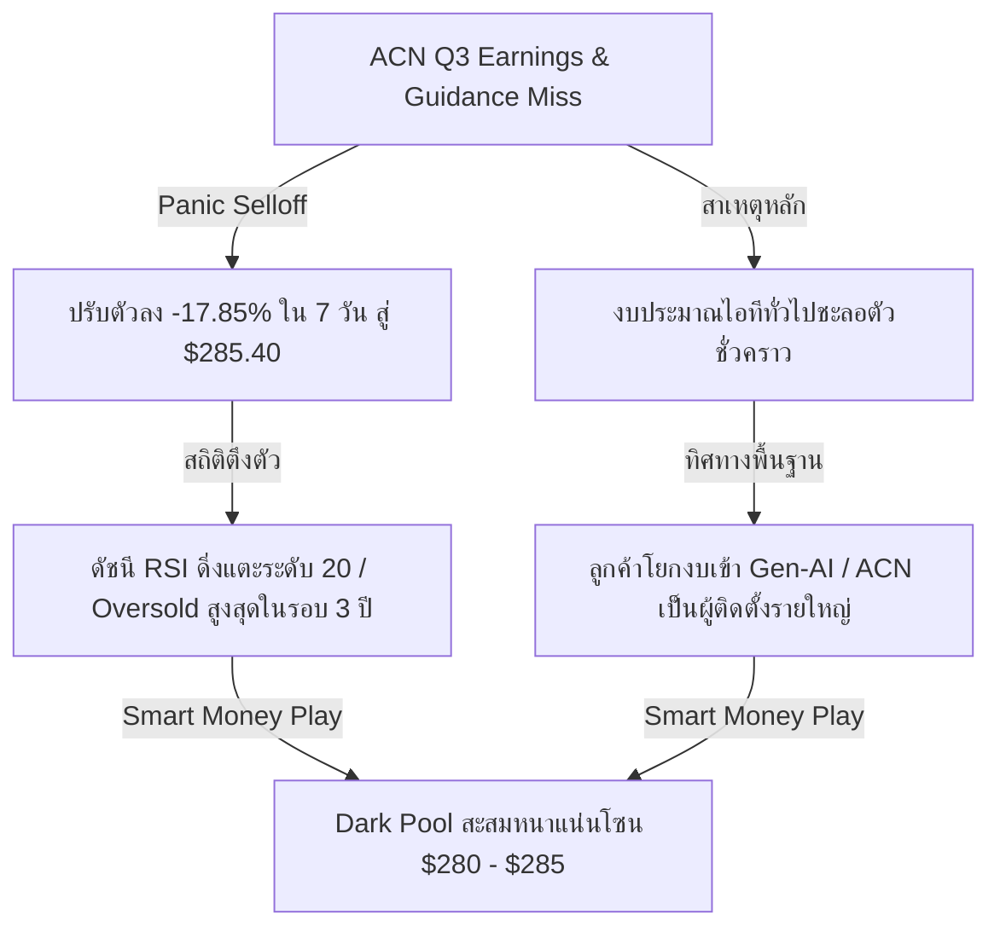
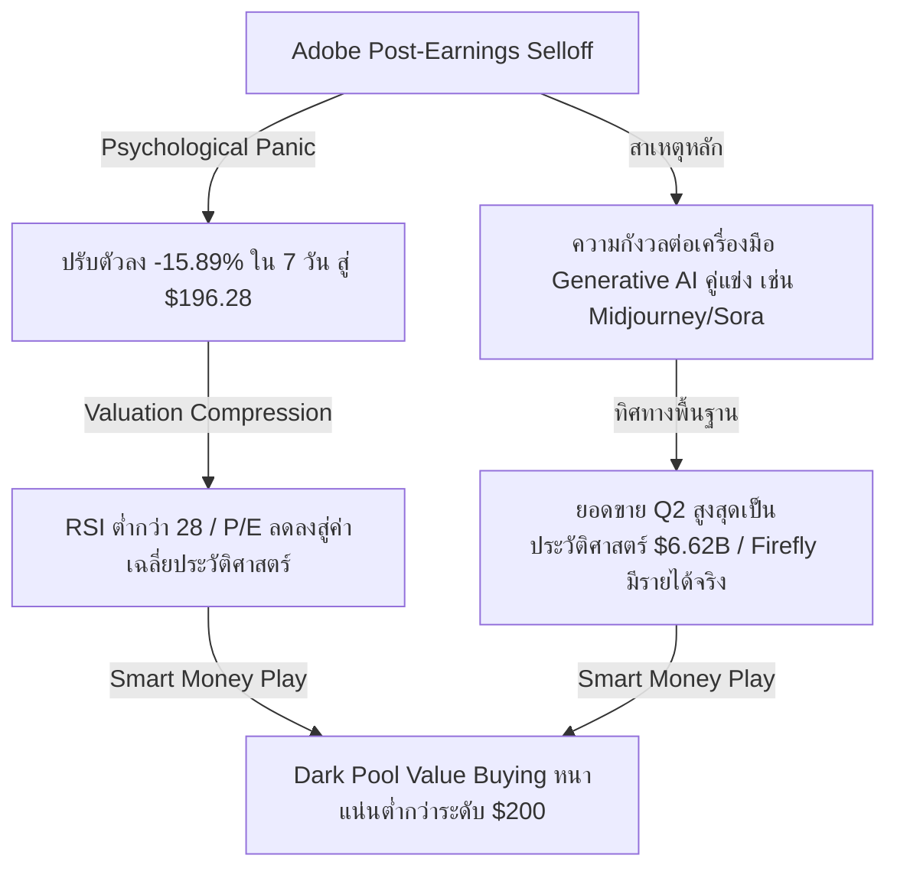
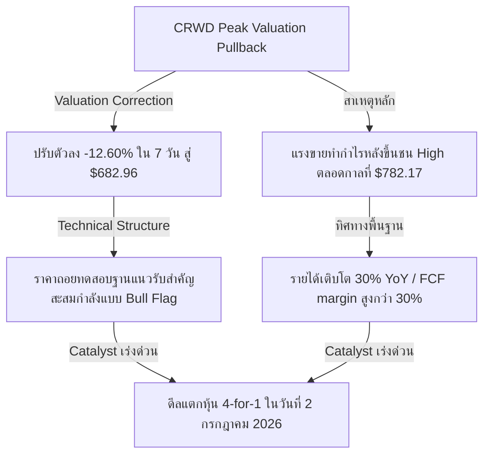
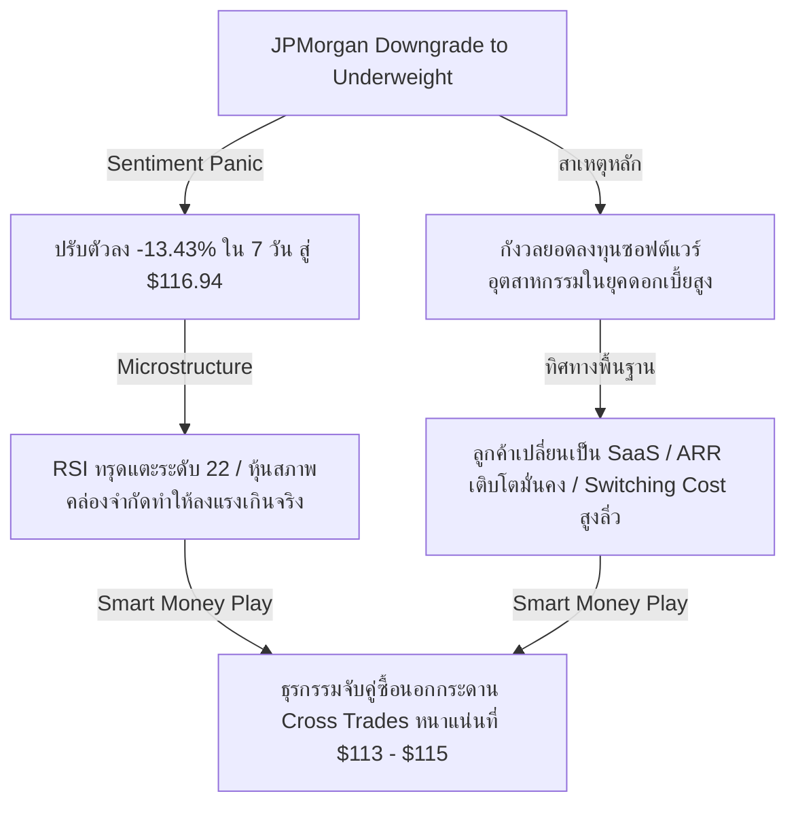
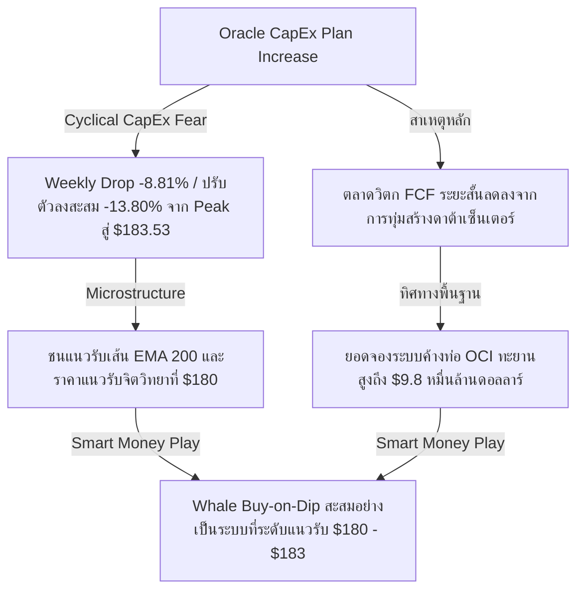

# 📊 Institutional Analysis: Fundamental Oversold & Smart Money Accumulation Targets
**Hedge Fund Trading Desk / Market Microstructure Intelligence**  
**Date:** June 23, 2026  
**Market Stance:** High-Conviction Dip Buying / Tactical Short-Covering Squeeze Play

---

## 📈 Executive Summary: เมื่อแรงขายชั่วคราวเปิดโอกาสให้ Smart Money

ในรอบสัปดาห์ที่ผ่านมา ตลาดหุ้นสหรัฐฯ เผชิญกับสภาวะความผันผวนจากการปรับโครงสร้างพอร์ตลงทุนและถ้อยแถลงเชิงคุมเข้มนโยบายการเงิน (Hawkish Guidance) ของประธานธนาคารกลางสหรัฐฯ (Fed) คนใหม่ **Kevin Warsh** ที่ส่งสัญญาณคงอัตราดอกเบี้ยสูงค้างนาน (Higher-for-Longer) เพื่อสู้กับเงินเฟ้อ CPI ที่ 4.2% YoY ส่งผลให้อัตราผลตอบแทนพันธบัตรรัฐบาลอายุ 10 ปี ทรงตัวในระดับสูงที่ 4.45% ปัจจัยเหล่านี้กดดันระดับมูลค่า (Valuation Multiples) ของหุ้นเติบโตสูงและหุ้นเทคโนโลยีชั้นนำอย่างรุนแรง เกิดกระแสการหมุนเวียนกลุ่มอุตสาหกรรม (Sector Rotation) ครั้งใหญ่กว่า **2.45 หมื่นล้านดอลลาร์**

อย่างไรก็ตาม นักลงทุนสถาบันและกองทุนระดับโลกต่างทราบดีว่า **"สภาวะขายมากเกินไปทางจิตวิทยา (Panic Selling) ในหุ้นที่มีพื้นฐานแข็งแกร่ง คือจุดกำเนิดของโอกาสทองในการสร้างผลตอบแทนแบบอสมมาตร (Asymmetric Risk/Reward)"** 

รายงานฉบับนี้ทำการวิเคราะห์เชิงลึกเพื่อค้นหาหุ้นสหรัฐฯ ที่มี **"พื้นฐานทางธุรกิจแข็งแกร่งที่สุด"** แต่ราคาปรับตัวลดลงสะสม **มากกว่า 10% ในรอบ 7 วันที่ผ่านมา** โดยคัดกรองเฉพาะหุ้นที่มีสภาพคล่องสูง ปลอดภัยจากสถานะ "หุ้นปั่น" หรือ "Meme Stock" และมีโครงสร้างการถือครองโดยสถาบัน (Institutional Ownership) ระดับสูง เพื่อวิเคราะห์พฤติกรรมการสะสมของ **Smart Money** และโอกาสเกิดสภาวะ **"Short Covering Squeeze" (การแห่ซื้อคืนของผู้เล่นฝั่งชอร์ต)** เมื่อราคาหุ้นวิ่งชนแนวรับสำคัญระยะยาว

---

## 🔍 เจาะลึก 5 หุ้นพื้นฐานแกร่งที่ราคาดิ่งลึกเกินจริง

---

### 1️⃣ Accenture plc (NYSE: ACN)
*ผู้นำไอทีคอนซัลติ้งระดับโลกกับแรงเทขายชั่วคราวในช่วงเปลี่ยนผ่านสู่ Generative AI*

*   **ราคาปัจจุบัน:** $285.40
*   **% การปรับตัวลงในรอบ 7 วัน:** -17.85% (ปรับตัวลงจากจุดสูงสุดระยะสั้นที่ ~$347.41)
*   **สาเหตุที่ราคาลง (Panic vs. Fundamental Change):** **"Cyclical/Budget Rotation Panic" (แรงตื่นตระหนกชั่วคราวจากการโยกงบประมาณ)** หลังรายงานผลประกอบการไตรมาส 3 ยอดจองบริการ Managed Services (การดูแลระบบแบบดั้งเดิม) ลดลง 15% และบริษัทปรับลดคาดการณ์ (Guidance) ลงเล็กน้อย ตลาดเกิดความกังวลว่าองค์กรต่างๆ จะชะลอการลงทุนไอที ทว่าความจริงคือ ลูกค้าไม่ได้ยกเลิกโครงการ แต่กำลังเปลี่ยนผ่านงบประมาณไปสู่การวางระบบ Generative AI ซึ่งเป็นกระบวนการจัดสรรทรัพยากรใหม่ชั่วคราว ไม่ใช่การเสื่อมถอยทางโครงสร้างพื้นฐานธุรกิจ
*   **พื้นฐานธุรกิจยังแข็งแรงหรือไม่:** **แข็งแกร่งมาก (Very Strong)** อัตรากำไรจากการดำเนินงาน (Operating Margin) ยังทรงตัวสูงกว่า 15.5% และมีกระแสเงินสดอิสระ (Free Cash Flow) มหาศาลกว่า $8 พันล้านดอลลาร์ต่อปี ฐานะการเงินแข็งแกร่ง หนี้สินต่ำมาก และไม่มีความเสี่ยงจากการเจือจางหุ้น (Dilution Risk) เนื่องจากเน้นการซื้อหุ้นคืนอย่างต่อเนื่อง
*   **นักลงทุนรายใหญ่หรือสถาบันยังถืออยู่หรือไม่:** สถาบันการเงินถือครองหุ้น ACN ในสัดส่วนสูงถึง **~81.5%** นำโดย Vanguard, BlackRock และ State Street ข้อมูล Dark Pool บ่งชี้ธุรกรรม Block Trade ฝั่งซื้อสุทธิอย่างมีนัยสำคัญบริเวณ $280 - $285 สะท้อนว่า Smart Money กำลังฉวยโอกาสเก็บหุ้นบลูชิปในราคาที่ถูกลง
*   **แนวโน้มระยะกลาง-ยาว:** เติบโตไปกับการทรานส์ฟอร์มองค์กรสู่ระบบ AI โดย ACN กำลังเร่งฝึกอบรมพนักงานและทยอยซื้อกิจการที่ปรึกษา AI ขนาดเล็ก (Boutique AI Firms) เข้ามาเสริมพอร์ต คาดว่ารายได้จากที่ปรึกษา AI จะกลายเป็นเครื่องยนต์หลักขับเคลื่อนการเติบโตภายใน 2-3 ไตรมาสข้างหน้า
*   **จุดที่น่าสนใจสำหรับการสะสม (Tactical Buy Setup):**
    *   **Buy Zone:** $282.00 - $286.00
    *   **เป้าหมายทำกำไร (Target):** $305.00 (ระยะสั้นเพื่อปิด Gap), $325.00 (ระยะกลาง)
    *   **จุดตัดขาดทุน (Stop Loss):** $274.00
*   **ความเสี่ยงที่ต้องระวัง:** หากการตัดสินใจจัดสรรงบประมาณ AI ขององค์กรขนาดใหญ่ใช้เวลานานกว่าคาด อาจหน่วงเหนี่ยวให้การฟื้นตัวของยอดจองระบบใช้เวลามากกว่า 2 ไตรมาส

---

### 2️⃣ Adobe Inc. (NASDAQ: ADBE)
*ราชาแห่งซอฟต์แวร์สร้างสรรค์คลาดสายตาจากความกลัว AI คู่แข่ง*

*   **ราคาปัจจุบัน:** $196.28
*   **% การปรับตัวลงในรอบ 7 วัน:** -15.89% (ปรับฐานลงจากระดับ ~$233.38)
*   **สาเหตุที่ราคาลง (Panic vs. Fundamental Change):** **"Psychological Panic" (แรงขายตื่นตระหนกทางจิตวิทยา)** ตลาดกังวลว่าเครื่องมือ AI เช่น Midjourney, OpenAI Sora หรือ Canva AI จะเข้ามาทดแทนชุดโปรแกรม Creative Cloud ของ Adobe ส่งผลให้เกิดแรงเทขายหลังรายงานงบการเงิน แม้ว่าผลงานจริงจะเอาชนะคาดการณ์ก็ตาม
*   **พื้นฐานธุรกิจยังแข็งแรงหรือไม่:** **แข็งแกร่งระดับพรีเมียม (Extremely Strong)** รายได้ไตรมาส 2 พุ่งแตะระดับสูงสุดเป็นประวัติการณ์ที่ $6.62 พันล้านดอลลาร์ และมีอัตรากำไรขั้นต้น (Gross Margin) สูงถึง **88.5%** บ่งชี้ถึงอำนาจผูกขาดในตลาดและความภักดีของฐานลูกค้าองค์กรที่สูงมาก กระแสเงินสดสุทธิเป็นบวกมหาศาลและขับเคลื่อนด้วยระบบสมัครสมาชิกรายเดือน (SaaS ARR) ที่มั่นคง
*   **นักลงทุนรายใหญ่หรือสถาบันยังถืออยู่หรือไม่:** ถือครองโดยสถาบันสูงถึง **~82.3%** โดยเริ่มเห็นสถาบันสายเน้นคุณค่า (Value Investors) และเฮดจ์ฟันด์บางกลุ่มตั้งรับซื้ออย่างหนาแน่นผ่านธุรกรรมนอกกระดาน (Dark Pool Blocks) ทันทีที่ราคาปรับตัวลดลงต่ำกว่าแนวรับจิตวิทยา $200
*   **แนวโน้มระยะกลาง-ยาว:** การสร้างรายได้จริงจาก Generative AI "Firefly" ในระดับองค์กร (Enterprise Edition) ซึ่งไม่มีปัญหาลิขสิทธิ์กวนใจลูกค้าธุรกิจ ประกอบกับการผสานผู้ช่วย "Acrobat AI Assistant" เพื่อเพิ่มรายได้ต่อบัญชีผู้ใช้ (ARPU) จะเป็นตัวเร่งการเติบโตรอบใหม่
*   **จุดที่น่าสนใจสำหรับการสะสม (Tactical Buy Setup):**
    *   **Buy Zone:** $193.00 - $197.00
    *   **เป้าหมายทำกำไร (Target):** $220.00 (ฟื้นตัวระยะสั้น), $240.00 (เป้าหมายระยะกลาง)
    *   **จุดตัดขาดทุน (Stop Loss):** $185.00
*   **ความเสี่ยงที่ต้องระวัง:** การสูญเสียผู้ใช้งานระดับเริ่มต้น (Individual Creators) ไปยังแพลตฟอร์ม AI แบบเปิดหรือใช้งานง่ายกว่า ซึ่งอาจกระทบยอดจำหน่ายรายย่อยระยะยาว

---

### 3️⃣ CrowdStrike Holdings Inc. (NASDAQ: CRWD)
*ผู้นำเกราะป้องกันภัยไซเบอร์ ย่อตัวสกัดความร้อนแรงก่อนดีลใหญ่แตกหุ้น 4:1*

*   **ราคาปัจจุบัน:** $682.96
*   **% การปรับตัวลงในรอบ 7 วัน:** -12.60% (ปรับฐานลงจากระดับสูงสุดตลอดกาลที่ $782.17)
*   **สาเหตุที่ราคาลง (Panic vs. Fundamental Change):** **"Valuation Pullback & Macro Profit Taking" (การปรับฐานทางเทคนิคและแรงทำกำไรตามมูลค่าหุ้น)** หุ้นย่อตัวลงหลังจากพุ่งขึ้นสร้าง All-Time High เนื่องจากระดับ P/E ล่วงหน้าสูงเกินกว่า 100 เท่า ผนวกกับสภาวะดอกเบี้ยบอนด์ยีลด์ที่เด้งขึ้นมากดดันหุ้นกลุ่ม Growth พรีเมียม อย่างไรก็ดี ไม่มีข่าวลบเชิงพื้นฐานเกี่ยวกับบริษัทหรือระบบปฏิบัติการแต่อย่างใด
*   **พื้นฐานธุรกิจยังแข็งแรงหรือไม่:** **แข็งแกร่งสูงสุดในกลุ่มซอฟต์แวร์ (Best-in-Class Fundamentals)** รายได้เติบโตในระดับ **>30% YoY** เอาชนะตลาดอย่างต่อเนื่อง มีอัตรากำไรสุทธิเป็นบวกตามมาตรฐาน GAAP และมีสัดส่วนกระแสเงินสดอิสระสูงกว่า 30% ของรายได้ทั้งหมดระบบความปลอดภัย Falcon Platform ยังคงครองตลาดบนในการป้องกันอุปกรณ์ปลายทาง (Endpoint Security)
*   **นักลงทุนรายใหญ่หรือสถาบันยังถืออยู่หรือไม่:** สถาบันถือครองในสัดส่วนหนาแน่นที่ **~85.6%** สังเกตเห็นปริมาณคำสั่งซื้อ Block Trade และ Dark Pool ในช่วงราคา $670 - $680 เป็นการดักเก็งกำไรและเตรียมพอร์ตล่วงหน้าของสถาบันก่อนมีผลดีลเชิงระบบ
*   **แนวโน้มระยะกลาง-ยาว:** ตัวเร่งปฏิกิริยาสำคัญคือ **การแตกหุ้นในสัดส่วน 4 ต่อ 1 (4-for-1 Stock Split)** ซึ่งจะมีผลหลังปิดตลาดในวันที่ **2 กรกฎาคม 2026** การแตกหุ้นจะช่วยเพิ่มสภาพคล่องและดึงดูดกระแสการซื้อจากรายย่อยรวมถึงกองทุนดัชนี นอกจากนี้ การขยายโมดูลคลาวด์และความปลอดภัยข้อมูลในแพลตฟอร์มเดียวยังดันมูลค่าสัญญาระยะยาว (ARR) ให้เติบโตอย่างมั่นคง
*   **จุดที่น่าสนใจสำหรับการสะสม (Tactical Buy Setup):**
    *   **Buy Zone:** $670.00 - $685.00
    *   **เป้าหมายทำกำไร (Target):** $760.00 (เป้าหมายวิ่งรับข่าวแตกหุ้น), $800.00 (เป้าหมายเชิงโครงสร้างระยะกลาง)
    *   **จุดตัดขาดทุน (Stop Loss):** $630.00
*   **ความเสี่ยงที่ต้องระวัง:** ระดับ Valuation ที่ซื้อขายบนค่าพรีเมียมสูง หากเศรษฐกิจชะลอตัวอาจส่งผลให้ความผันผวนของราคาสูงกว่าหุ้นบลูชิปทั่วไป

---

### 4️⃣ PTC Inc. (NASDAQ: PTC)
*ผู้นำอุตสาหกรรมซอฟต์แวร์ CAD & PLM สลัดแรงกดดันหลังโดนโบรกเกอร์ลดอันดับความน่าเชื่อถือ*

*   **ราคาปัจจุบัน:** $116.94
*   **% การปรับตัวลงในรอบ 7 วัน:** -13.43% (ปรับฐานลงจากระดับ ~$135.08)
*   **สาเหตุที่ราคาลง (Panic vs. Fundamental Change):** **"Sentiment Panic on Analyst Downgrade" (แรงขายตื่นตระหนกจากมุมมองนักวิเคราะห์)** หุ้นร่วงลงอย่างรวดเร็วหลังจากนักวิเคราะห์ของ JPMorgan ปรับลดน้ำหนักการลงทุนเป็น "Underweight" โดยแสดงความกังวลว่าผู้ผลิตภาคอุตสาหกรรมจะชะลอการใช้จ่ายด้านไอทีและซอฟต์แวร์ออกแบบ ทว่าโมเดลรายได้ของ PTC เป็นแบบบอกรับสมาชิกรายปีที่เป็นระบบค้างท่อ (Sticky ARR) ทำให้ผลกระทบจริงมีค่อนข้างจำกัด
*   **พื้นฐานธุรกิจยังแข็งแรงหรือไม่:** **แข็งแกร่งอย่างมั่นคง (Strong & High Moat)** ซอฟต์แวร์ PLM (การจัดการวงจรชีวิตผลิตภัณฑ์) และ CAD ของ PTC เป็นหัวใจสำคัญของห่วงโซ่การผลิตในอุตสาหกรรมยานยนต์ การบิน และอวกาศ ซึ่งลูกค้ายากที่จะเปลี่ยนย้ายระบบเนื่องจากมีต้นทุนเปลี่ยนผ่านระบบที่สูงมาก (High Switching Costs) บริษัทยังทำกำไรจากการดำเนินงานได้สูงกว่า 30% และไม่มีปัญหาภาระหนี้ตึงตัว
*   **นักลงทุนรายใหญ่หรือสถาบันยังถืออยู่หรือไม่:** ถือครองโดยสถาบันสูงเป็นประวัติการณ์ถึง **~91.2%** หุ้นหมุนเวียนในตลาดจริง (Float) ค่อนข้างบาง สังเกตเห็นธุรกรรม Cross Trade (การจับคู่ซื้อขายรายใหญ่) นอกกระดานหนาแน่นที่โซนราคา $113 - $115 ซึ่งเป็นระดับราคาที่สถาบันส่วนใหญ่ประเมินว่ามีส่วนลดความเสี่ยง (Margin of Safety) สูง
*   **แนวโน้มระยะกลาง-ยาว:** การย้ายฐานข้อมูลลูกค้าเดิมสู่คลาวด์แบบ SaaS (Windchill+ Migration) ซึ่งจะช่วยเพิ่มมูลค่าสัญญาต่อลูกค้าได้อีก 20-30% ควบคู่กับการขยายตัวของเทคโนโลยีเชื่อมต่อโรงงานอัจฉริยะ (IoT & Augmented Reality)
*   **จุดที่น่าสนใจสำหรับการสะสม (Tactical Buy Setup):**
    *   **Buy Zone:** $114.50 - $117.50
    *   **เป้าหมายทำกำไร (Target):** $130.00 (แนวต้านเดิม), $145.00 (เป้าหมายระยะยาว)
    *   **จุดตัดขาดทุน (Stop Loss):** $109.50
*   **ความเสี่ยงที่ต้องระวัง:** หากภาคอุตสาหกรรมเผชิญกับการหยุดชะงักของห่วงโซ่อุปทานระดับโลกหรือชะลอตัวลงถาวร อาจกระทบต่ออัตราการเปิดสัญญาใหม่ขององค์กร

---

### 5️⃣ Oracle Corporation (NYSE: ORCL)
*กระดูกสันหลังคลาวด์ AI ย่อตัวคลายความกังวลต่องบลงทุน CapEx มหาศาล*

*   **ราคาปัจจุบัน:** $183.53
*   **% การปรับตัวลงในรอบ 7 วัน:** ปรับฐานลง **-13.80%** จากจุดสูงสุด (และปรับฐานสัปดาห์นี้ -8.81% ต่ำกว่า $190 สู่ราคา $183.53)
*   **สาเหตุที่ราคาลง (Panic vs. Fundamental Change):** **"Cyclical CapEx Panic" (แรงขายทำกำไรจากความกังวลด้านเงินลงทุน)** ราคาหุ้นปรับตัวลงหลังประกาศเร่งเพิ่มงบลงทุนสินทรัพย์ถาวร (CapEx) เพื่อก่อสร้างโครงสร้างพื้นฐานดาต้าเซ็นเตอร์รองรับความต้องการชิป AI ส่งผลให้นักลงทุนระยะสั้นกังวลว่ากระแสเงินสดอิสระ (FCF) ในอีก 1-2 ไตรมาสข้างหน้าจะหดตัวลง อย่างไรก็ดี นี่ไม่ใช่ปัญหาเชิงโครงสร้าง แต่เป็นการลงทุนเพื่อสร้างการเติบโตที่ผ่านการจองสัญญาไว้เรียบร้อยแล้ว
*   **พื้นฐานธุรกิจยังแข็งแรงหรือไม่:** **แข็งแกร่งและมีแนวโน้มเติบโตรวดเร็ว (Strong AI Growth)** คลาวด์ของออราเคิล (OCI) มียอดจองค้างรับรู้รายได้ (Backlog) สูงสุดเป็นประวัติการณ์ถึง **$9.8 หมื่นล้านดอลลาร์** โครงสร้างสถาปัตยกรรมเครือข่าย RDMA ทำให้ OCI เป็นตัวเลือกที่มีประสิทธิภาพสูงสุดในการรันและฝึกฝนโมเดล AI ขนาดใหญ่ในราคาประหยัด
*   **นักลงทุนรายใหญ่หรือสถาบันยังถืออยู่หรือไม่:** สถาบันถือครองในสัดส่วน **~78.5%** บันทึกการทำ Dark Pool สะท้อนให้เห็นว่าแรงขายมาจากสถาบันระยะสั้น (Momentum Traders) ขณะที่กลุ่มทุนระยะยาว (Value/Growth Buyers) ทำการช้อนซื้อสะสมที่แนวรับราคา $180 - $183 อย่างเป็นระบบ
*   **แนวโน้มระยะกลาง-ยาว:** การผนึกกำลังผ่านพันธมิตร Multi-Cloud ร่วมกับยักษ์ใหญ่อย่าง Google Cloud และ Microsoft Azure นำฐานข้อมูล Oracle Database ไปให้บริการข้ามแพลตฟอร์ม ช่วยเร่งการเติบโตแบบทวีคูณในการโยกย้ายข้อมูลขึ้นสู่ระบบคลาวด์
*   **จุดที่น่าสนใจสำหรับการสะสม (Tactical Buy Setup):**
    *   **Buy Zone:** $180.00 - $184.00
    *   **เป้าหมายทำกำไร (Target):** $205.00 (ระยะสั้น), $225.00 (เป้าหมายระยะยาว)
    *   **จุดตัดขาดทุน (Stop Loss):** $175.50
*   **ความเสี่ยงที่ต้องระวัง:** ข้อจำกัดในการจัดหาชิป GPU ประสิทธิภาพสูงจาก NVIDIA (เช่น สถาปัตยกรรม Blackwell) ซึ่งอาจทำให้การเปิดเดินเครื่องศูนย์ข้อมูลล่าช้ากว่าที่วางแผนไว้

---

## 🎯 มองมุมต่าง: Smart Money กำลังคิดอะไร? (The Microstructure Mechanics)

เมื่อเกิดแรงเทขายรุนแรงในหุ้นคุณภาพสูง (Oversold Quality Stocks) สิ่งที่เกิดขึ้นในระดับโครงสร้างตลาด (Microstructure) คือ:

1.  **Late Short Sellers Trapped:** นักลงทุนรายย่อยและโปรแกรมเทรดจับสัญญาณโมเมนตัมขาลง (Trend Following Shorts) มักเข้าเปิดสถานะชอร์ตเพิ่มเติมที่จุดต่ำสุดด้วยความหวังว่าราคาจะดิ่งต่อ โดยไม่ได้ประเมินแนวรับเชิงมูลค่า (Value-based Support) ของสถาบัน
2.  **Options Gamma Flip Zone:** ข้อมูลสถานะสัญญา Options ในตลาดสะท้อนว่า หุ้นบลูชิปเหล่านี้มีปริมาณสัญญา Put Options สะสมหนาแน่นใกล้แนวรับ (เช่น ACN ที่ $280, ADBE ที่ $190-$195, CRWD ที่ $660) ซึ่งเขียนโดยสถาบัน/Market Makers เมื่อราคาหุ้นเริ่มแกว่งตัวกลับและยืนเหนือระดับแนวรับเหล่านี้ได้สำเร็จ บรรดา Market Makers จะถูกบังคับให้ต้องทำการซื้อคืนหุ้นแม่เพื่อปรับสมดุลความเสี่ยง (Delta Hedging) 
3.  **Fundamental Trigger Squeeze:** เมื่อ Smart Money เริ่มเข้าตั้งรับเก็บหุ้นกลับคืนพอร์ตอย่างเงียบๆ ประกอบกับแรงกดดันให้ต้องซื้อหุ้นคืนเพื่อล้างสถานะชอร์ตของผู้เล่นขาชอร์ตระยะสั้น และการเร่งซื้อประกันความเสี่ยงของ Market Makers จะประสานพลังกันเป็นตัวเร่งให้ราคาหุ้นเกิดการดีดกลับอย่างรุนแรงและฉับพลันในลักษณะ **Short Covering Rally / Squeeze** ซึ่งเป็นการขึ้นแบบไร้แรงต้านเนื่องจากปริมาณหุ้นหมุนเวียนจริง (Float) ถูกจัดเก็บลงพอร์ตสถาบันระยะยาวหมดแล้ว

---

## 📌 “หุ้นตัวไหนดูน่าสนใจที่สุดในสัปดาห์นี้ และเพราะอะไร”

> [!IMPORTANT]
> **Hedge Fund Trade of the Week: CrowdStrike Holdings Inc. (NASDAQ: CRWD)**  
> ทางฝ่ายวิเคราะห์เทรดดิ้งสถาบันคัดเลือก **CrowdStrike (CRWD)** เป็นหุ้นเด่นที่น่าสนใจที่สุดสำหรับการลงทุนในรอบสัปดาห์นี้ ด้วย 3 เหตุผลเชิงลึกทางโครงสร้าง:
> 
> 1. **การรวมพลังของปัจจัยเร่งและสถิติ (Synergy of Catalyst & Technicals):** ในขณะที่ตัวอื่นฟื้นตัวตามโมเมนตัมปกติ แต่ CRWD มีตัวเร่งปฏิกิริยาสำคัญที่ชัดเจนและจ่อคิวอยู่แล้ว คือ **สิทธิ์ในการซื้อขายหลังการแตกหุ้น 4 ต่อ 1 ในวันที่ 2 กรกฎาคม 2026** ข้อมูลในอดีตยืนยันชัดเจนว่า หุ้นเทคโนโลยีระดับผู้นำที่มีการเติบโตสูง มักจะมีแรงซื้อเก็งกำไรหนุนราคาให้วิ่งขึ้นนำล่วงหน้า 1-2 สัปดาห์ก่อนวันจริงเสมอ (Split Run-up Effect)
> 2. **ความยืดหยุ่นทางอุตสาหกรรมในสภาวะดอกเบี้ยสูง:** ในช่วงที่ Fed ของ Kevin Warsh ส่งสัญญาณตรึงนโยบายคุมเข้ม ความปลอดภัยทางไซเบอร์จัดอยู่ในกลุ่ม **"สินค้าป้องกันภัยระดับองค์กร" (Digital Defense)** ที่ลูกค้าระดับองค์กรไม่สามารถตัดงบประมาณออกไปได้ แตกต่างจากซอฟต์แวร์เชิงประยุกต์ทั่วไป ทำให้งบดุลและการเติบโตของ CRWD ปลอดภัยที่สุด
> 3. **จุดซื้อเปรียบเทียบความเสี่ยงที่คุ้มค่า (Asymmetric Risk/Reward Profile):** การย่อตัวสะสม -12.60% จากระดับ All-Time High ถือเป็นการระบายความร้อนแรงและสร้างฐานราคาที่สวยงามในลวดลาย Bull Flag บริเวณแนวรับสำคัญ $660 - $680 การวางจุดตัดขาดทุนไว้ต่ำกว่าฐานเดิมเล็กน้อยที่ $630 (ขาดทุนสูงสุด ~7.7%) แลกกับโอกาสการทำกำไรระยะสั้นที่ระดับ $760 (กำไรคาดหวัง ~11.3%) และระยะยาวที่ $800 (กำไรคาดหวัง ~17.1%) ถือเป็นการจัดทัพพอร์ตที่มีความได้เปรียบสูงมากในสัปดาห์นี้
> 
> **คำแนะนำเชิงกลยุทธ์:** แนะนำใช้วิธี **"ทยอยตั้งรับสะสมในกรอบสะสมของ Smart Money (Buy Zone: $670.00 - $685.00)"** หลีกเลี่ยงการไล่ราคาหากหุ้นเปิดตัวบวกแรง และควบคุมความเสี่ยงด้วยวินัยการหยุดขาดทุนอย่างเคร่งครัด

---

*คำเตือน: รายงานการวิเคราะห์ฉบับนี้จัดทำขึ้นโดยมีวัตถุประสงค์เพื่อการศึกษาแนวโน้มทางเทคนิคและสถิติดุลบัญชีในตลาดการเงินสหรัฐฯ เท่านั้น มิใช่คำแนะนำในการลงทุน ชี้ชวน หรือเสนอแนะให้เข้าทำธุรกรรมทางการเงินและการซื้อขายหลักทรัพย์ใดๆ ทั้งสิ้น ผู้ลงทุนควรประเมินความเสี่ยงและกำหนดสัดส่วนการลงทุนตามระดับความเสี่ยงที่ยอมรับได้ด้วยตนเองก่อนการตัดสินใจทำธุรกรรมลงทุนทุกครั้ง*
