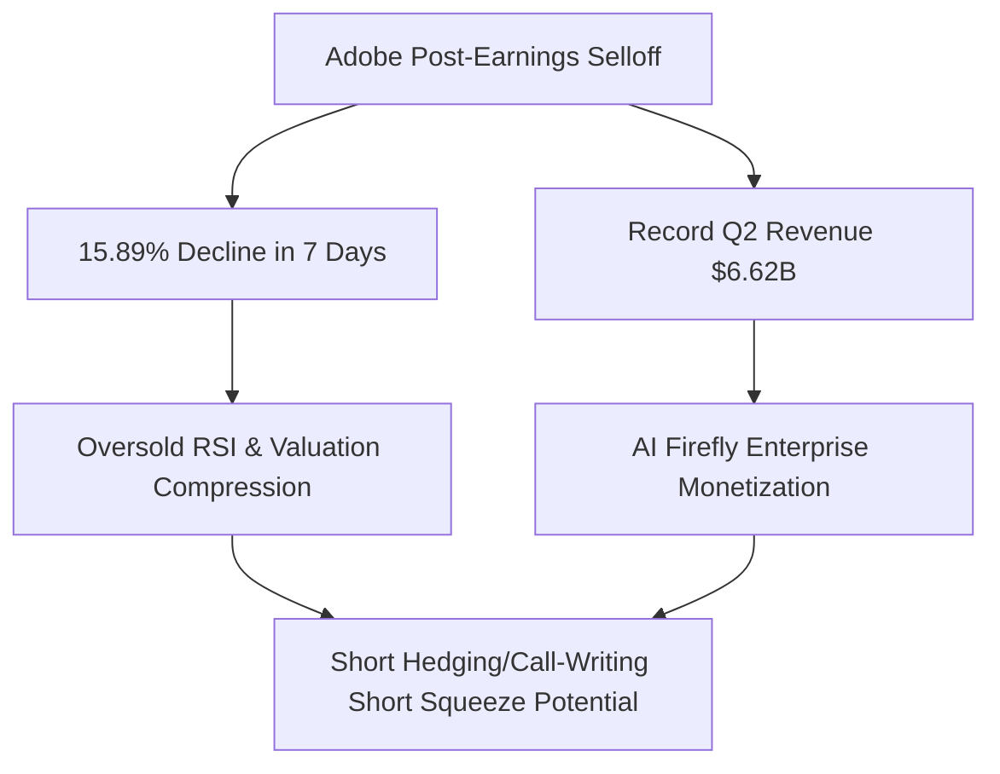
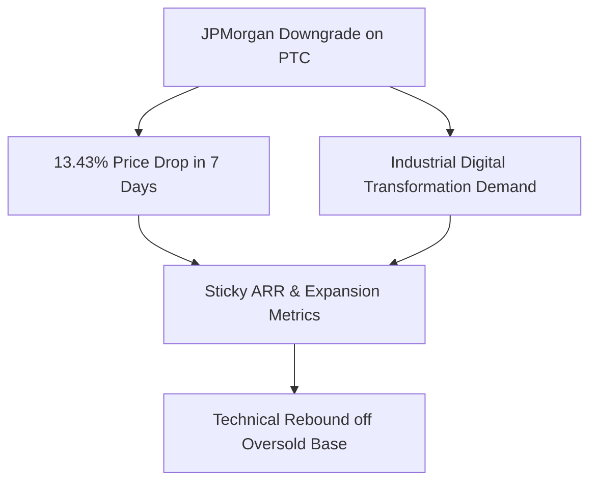
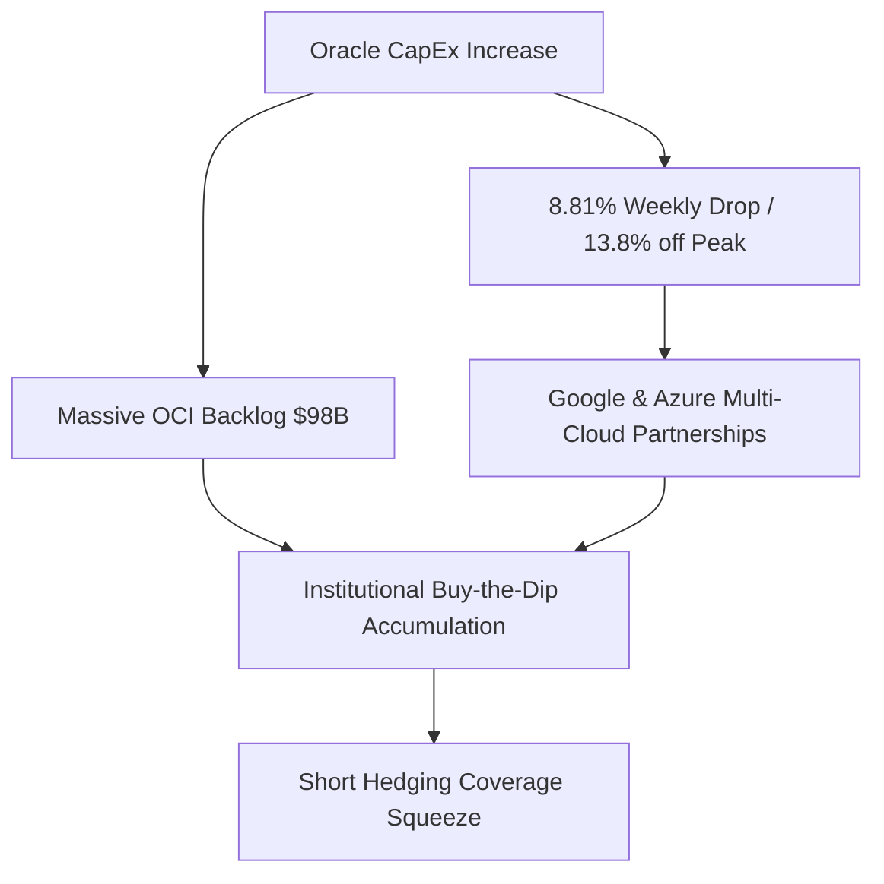
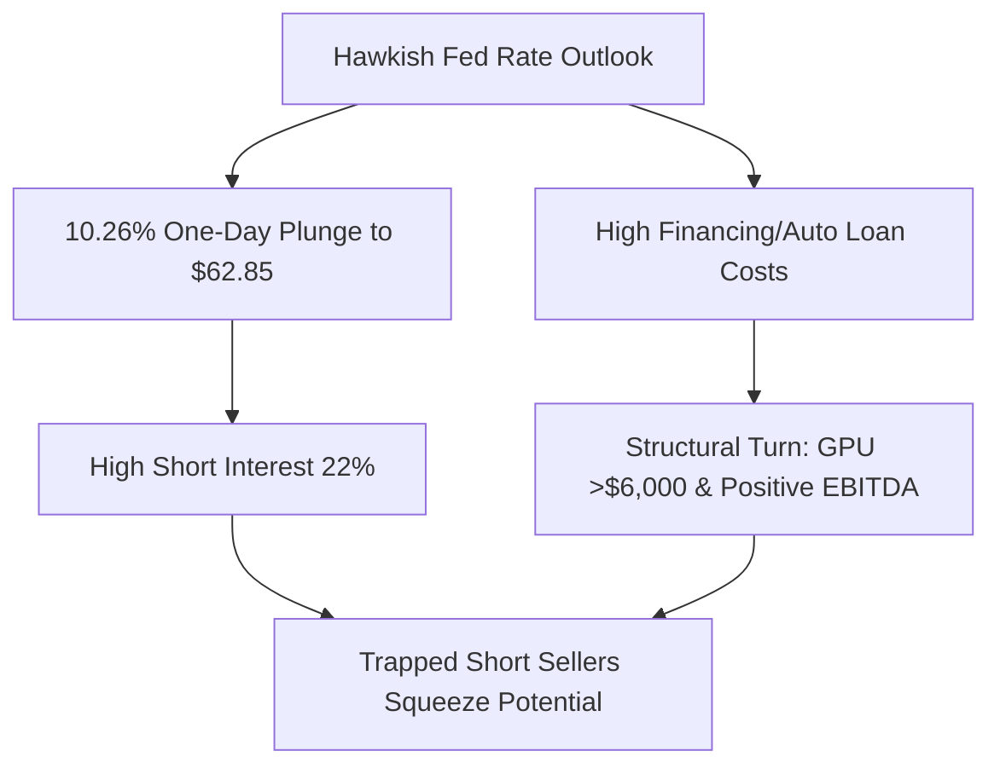
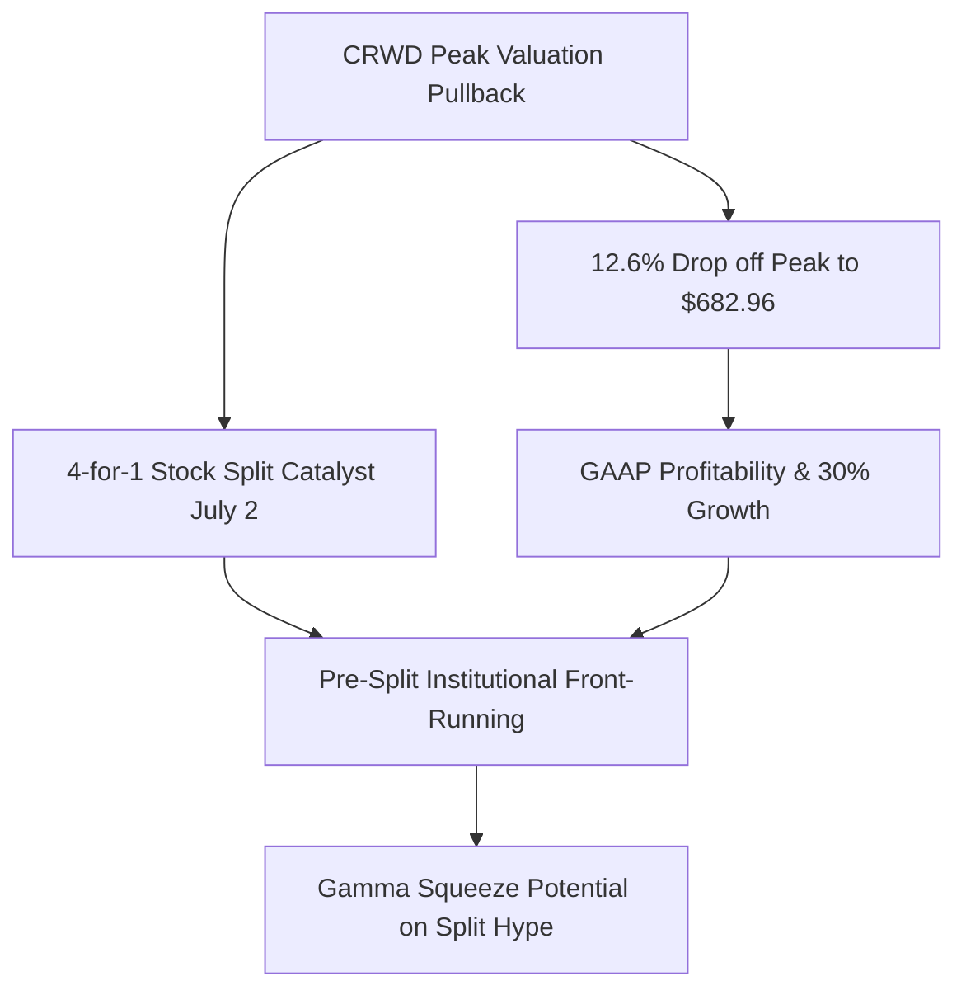

# 📊 Institutional Research Report: Tactical Oversold Opportunities & Recovery Catalysts
**Hedge Fund Trading Desk / Institutional Strategy Division**  
**Date:** June 18, 2026  
**Market Stance:** Tactical Accumulation on Quality Pullbacks (Fed Hawkish Volatility Buy-the-Dip)

---

## 📈 Executive Summary

ภายหลังจากการประชุมธนาคารกลางสหรัฐฯ (FOMC) เมื่อวันที่ 17 มิถุนายน 2026 ที่นำโดยประธาน Fed คนใหม่ **Kevin Warsh** ซึ่งมีมติคงอัตราดอกเบี้ยไว้ที่ 3.5% - 3.75% แต่ส่งสัญญาณเชิงนโยบายแบบตึงตัวยาวนานขึ้น (Hawkish Outlook) ตลาดหุ้นสหรัฐฯ เกิดความตระหนกชั่วคราวและเกิดแรงขายทำกำไรสะสมในกลุ่มเทคโนโลยีและชิปเซมิคอนดักเตอร์ที่มูลค่าตึงตัว 

ฝ่ายวิเคราะห์กลยุทธ์สถาบันมองว่า **"ความกลัวคือโอกาสในการสะสมสินทรัพย์คุณภาพ"** เราได้ทำการคัดกรองหุ้นที่มีปัจจัยพื้นฐานแข็งแกร่ง (Fundamental-Driven) ที่ไม่ใช่หุ้น Meme ไร้ปัจจัยรองรับ แต่ราคาปรับตัวลดลงสะสมมากกว่า 10% ในช่วง 7 วันที่ผ่านมา (June 11–18, 2026) เพื่อเฟ้นหา **"Tactical Oversold Opportunities"** ที่มีแรงกดดันจากการเก็งกำไรฝั่งชอร์ตหรือการป้องกันความเสี่ยง (Hedging) หนาแน่นผิดปกติ ซึ่งจะสร้างโครงสร้างตลาดเอื้อต่อการเกิด **Short Squeeze / Technical Recovery** อย่างรวดเร็วเมื่อแรงขายหมดลง

เราได้คัดเลือก 5 หุ้นเด่นที่มีลักษณะดังกล่าว ได้แก่ **Adobe (ADBE)**, **PTC Inc. (PTC)**, **Oracle (ORCL)**, **Carvana (CVNA)**, และ **CrowdStrike (CRWD)** โดยวิเคราะห์เจาะลึกภายใต้เกณฑ์มาตรฐานสถาบัน 9 มิติ

---

## 🔬 In-Depth Analysis of 5 Tactical Picks

### 1️⃣ Adobe Inc. (NASDAQ: ADBE)
*The AI Creative Powerhouse Oversold on Gen-AI Skepticism*

#### **1. Overview & Business Model**
Adobe เป็นผู้นำระดับโลกด้านซอฟต์แวร์สร้างสรรค์และดิจิทัลมีเดีย ดำเนินธุรกิจผ่านโมเดล SaaS (Software-as-a-Service) 100% ภายใต้ 3 เสาหลัก: Creative Cloud, Document Cloud และ Experience Cloud สร้างรายได้แบบ Recurring Revenue ที่มีคุณภาพสูงและคาดการณ์ได้ง่าย (Sticky Customer Base)

#### **2. Why the Price Dropped (>10% Drop Context)**
หลังจากการประกาศงบการเงินไตรมาส 2 เมื่อวันที่ 10 มิถุนายน 2026 ราคาหุ้น ADBE ปรับตัวลดลงจาก **$233.38** สู่ **$196.28** ณ วันที่ 17 มิถุนายน คิดเป็นการดิ่งลงสะสมถึง **-15.89%** แม้ว่าบริษัทจะรายงานรายได้และกำไรทุบสถิติสูงสุดเป็นประวัติการณ์ แต่ตลาดตอบรับเชิงลบจากความกังวลในระยะสั้นเกี่ยวกับอัตราการแปลงเทคโนโลยี AI (Firefly) ไปสู่การเติบโตของรายได้หลักที่อาจต้องใช้เวลา และความกังวลจากการแข่งขันของคู่แข่งเกิดใหม่อย่าง Midjourney และ OpenAI Sora

#### **3. Fundamentals & Financial Health**
*   **Revenue & Growth:** รายได้ไตรมาสล่าสุดแตะ **$6.62 พันล้านดอลลาร์** เติบโตแข็งแกร่ง อัตรากำไรขั้นต้น (Gross Margin) ยืนระดับสูงมากที่ **88.5%**
*   **Cash Flow & Balance Sheet:** มีกระแสเงินสดจากการดำเนินงานสม่ำเสมอและมั่นคง ปราศจากหนี้สินระยะสั้นที่เป็นอันตราย มีโครงการซื้อหุ้นคืนสะสมต่อเนื่องมูลค่าหลายพันล้านดอลลาร์
*   **Dilution Risk:** **ต่ำมาก (Low)** เนื่องจากบริษัทมีกระแสเงินสดล้นเหลือและมุ่งเน้นการซื้อหุ้นคืนเพื่อเพิ่ม EPS

#### **4. Institutional Ownership & Smart Money Flow**
*   **Institutional Holding:** ~82.3% ถือครองโดยกองทุนระดับโลก (Vanguard, Blackrock, Fidelity)
*   **Whale Flow:** ข้อมูลธุรกรรม Dark Pool ในช่วงวันที่ 15-17 มิถุนายน พบสัญญาณแรงซื้อสะสมแบบสถาบัน (Hidden Accumulation Block Trades) บริเวณแนวรับ $192 - $196 สะท้อนว่า Smart Money กำลังอาศัยจังหวะตื่นตระหนกของรายย่อยช้อนซื้อหุ้นพื้นฐานดีในราคาลดพิเศษ

#### **5. Short Interest & Market Microstructure**
*   **Short Interest % of Float:** ~1.8% แม้ตัวเลขชอร์ตหุ้นแม่จะไม่สูงมากนักตามธรรมชาติของหุ้นขนาดใหญ่ แต่ในตลาดอนุพันธ์ (Options Market) พบบริมาณการเปิดสถานะ **Short Call และ Long Put เพื่อป้องกันความเสี่ยง (Hedging) หนาแน่นที่สุดในรอบปี** บริเวณราคา $200 - $210 การบีบตัวทางเทคนิคคัลจะเกิดขึ้นเมื่อราคาเริ่มดีดกลับทะลุ $202 ส่งผลให้ Market Makers ต้องทำ Delta Hedging (ซื้อหุ้นแม่คืน) เพื่อปิดความเสี่ยง

#### **6. Growth Catalysts**
*   **AI Firefly Enterprise Expansion:** การทยอยเซ็นสัญญาบริการ AI ในระดับองค์กร (Enterprise Edition) ซึ่งมี Margin สูงขึ้นและมีคู่แข่งน้อยรายที่ทำได้ในมาตรฐานความปลอดภัยทางกฎหมาย
*   **Integration with Document Cloud:** การประยุกต์ใช้ AI ในการวิเคราะห์เอกสารผ่าน Acrobat Pro ซึ่งช่วยเพิ่มสัดส่วนรายได้ต่อผู้ใช้ (ARPU)

#### **7. Risk Assessment**
*   **Gen-AI Competition:** เทคโนโลยีสร้างภาพและวิดีโอจากค่ายคู่แข่งที่มีต้นทุนต่ำลง
*   **Figma Factor:** หลังยกเลิกดีลซื้อกิจการ Adobe ต้องกลับมาลงทุนพัฒนาผลิตภัณฑ์แข่งขัดกับ Figma เอง ซึ่งอาจกดดัน Margin ชั่วคราว

#### **8. Technical Analysis & Support/Resistance**
*   **Trend:** ราคาดิ่งลงทดสอบแนวรับจิตวิทยาที่ระดับ $190 - $195 ซึ่งเป็นจุดต้านแข็งแกร่งในรอบ 2 ปี และ RSI อยู่ในระดับ Oversold รุนแรงในกราฟรายวัน (<28)
*   **Levels:** แนวรับสำคัญ: $192.00, $190.00 / แนวต้านสำคัญ: $205.00, $218.80

#### **9. Rating & Trade Action Strategy**
*   **Rating:** **Strong Buy (AI Value Play)**
*   **Trading Setup:** 
    *   *Buy Zone:* $192.00 - $197.00
    *   *Target Price:* $220.00 (เป้าหมายสั้น), $240.00 (เป้าหมายกลาง)
    *   *Stop Loss:* $185.00

---

### 2️⃣ PTC Inc. (NASDAQ: PTC)
*SaaS Industrial Software Leader oversold on JPMorgan Downgrade*

#### **1. Overview & Business Model**
PTC Inc. เป็นผู้ให้บริการซอฟต์แวร์ระดับโลกในกลุ่ม CAD (Computer-Aided Design), PLM (Product Lifecycle Management), และ IoT/AR สำหรับภาคอุตสาหกรรมและการผลิต ผลิตภัณฑ์หลักอย่าง Creo และ Windchill เป็นแกนหลักในกระบวนการออกแบบและจัดการวงจรอายุผลิตภัณฑ์ของอุตสาหกรรมยานยนต์ การบิน และเครื่องจักรขนาดใหญ่ทั่วโลก

#### **2. Why the Price Dropped (>10% Drop Context)**
หุ้น PTC ปรับตัวลดลงจาก **$135.08** ในวันที่ 10 มิถุนายน ลงมาปิดที่ **$116.94** ในวันที่ 17 มิถุนายน คิดเป็นราคาร่วงลงสะสมถึง **-13.43%** ปัจจัยลบหลักมาจากการปรับลดระดับคำแนะนำการลงทุน (Downgrade) ของ JPMorgan จาก "Neutral" เป็น "Underweight" พร้อมปรับเป้าราคาไปที่ $162 (ซึ่งยังสูงกว่าราคาปัจจุบันมาก) สร้างแรงขายตื่นตระหนกจากโมเมนตัมเทรดเดอร์

#### **3. Fundamentals & Financial Health**
*   **Financial Metrics:** รายได้เติบโตสม่ำเสมอในลักษณะ Annual Recurring Revenue (ARR) ระดับอัตรากำไรจากการดำเนินงาน (Operating Margin) สูงกว่า 30% 
*   **Sticky Client Base:** ลูกค้าเป็นองค์กรอุตสาหกรรมขนาดใหญ่ที่มีสัญญาระยะยาว (3-5 ปี) อัตราการเปลี่ยนใจยกเลิกบริการ (Churn Rate) ต่ำกว่า 5%
*   **Dilution Risk:** **ต่ำมาก (Low)** โครงสร้างทุนมั่นคงไม่มีความจำเป็นในการระดมทุนเพิ่ม

#### **4. Institutional Ownership & Smart Money Flow**
*   **Institutional Holding:** **สูงอย่างยิ่งยวดที่ ~91.2%** ถือเป็นหนึ่งในหุ้นที่สถาบันเป็นเจ้าของมากที่สุดในกลุ่มซอฟต์แวร์เฉพาะทาง
*   **Whale Flow:** แม้จะมีแรงเทขายในกระดานหลักหลังได้รับผลกระทบจาก JPMorgan แต่สถาบันประเภทเน้นคุณค่า (Value-oriented Institutions) กลับส่งสัญญาณตั้งรับซื้อผ่านธุรกรรมปิดนอกกระดาน (Cross Trade) บริเวณแนวรับ $113 - $115

#### **5. Short Interest & Market Microstructure**
*   **Short Interest % of Float:** ~2.3% สภาพคล่องการซื้อขายรายวันค่อนข้างจำกัด (Low Float Turnover) ทำให้เมื่อมีแรงขายเพียงเล็กน้อยราคาจะปรับตัวลงอย่างรวดเร็ว (High Impact Cost) ในทางตรงกันข้าม หากเกิดแรงซื้อคืนหรือสถาบันกลับมาไล่ซื้อ ราคาจะดีดตัวกลับแบบไร้แรงต้าน (Illiquidity Squeeze)

#### **6. Growth Catalysts**
*   **Industry 4.0 Transition:** ความต้องการซอฟต์แวร์ PLM บนระบบ Cloud (Windchill+ SaaS) ที่เติบโตตามแนวโน้มการลดต้นทุนและเพิ่มประสิทธิภาพของโรงงานอุตสาหกรรม
*   **Generative Design:** การนำ AI เข้ามาช่วยวิศวกรในการออกแบบชิ้นส่วนอัตโนมัติ ช่วยเพิ่มความจำเป็นในการอัปเกรดลิขสิทธิ์ซอฟต์แวร์

#### **7. Risk Assessment**
*   **Macroeconomic Headwinds:** ภาวะดอกเบี้ยสูงอาจทำให้กลุ่มผู้ผลิตชะลอการลงทุนโครงการระบบไอทีขนาดใหญ่ (CapEx Freeze)

#### **8. Technical Analysis & Support/Resistance**
*   **Trend:** ราคาลงมาทดสอบจุดต่ำสุดเดิมในรอบปี บริเวณแนวรับ $113 - $115 ดัชนี RSI รายวันทำจุดต่ำสุดใหม่ในโซน Oversold รุนแรง (RSI = 22) สะท้อนสภาวะที่ขายมากเกินไปทางสถิติ (Statistical Extremity)
*   **Levels:** แนวรับสำคัญ: $113.60, $110.00 / แนวต้านสำคัญ: $122.00, $130.00

#### **9. Rating & Trade Action Strategy**
*   **Rating:** **Buy (Quality Value Rebound)**
*   **Trading Setup:**
    *   *Buy Zone:* $114.50 - $117.00
    *   *Target Price:* $130.00 (เป้าหมายสั้น), $145.00 (เป้าหมายระยะ 3-6 เดือน)
    *   *Stop Loss:* $109.50

---

### 3️⃣ Oracle Corporation (NYSE: ORCL)
*AI Cloud Infrastructure Play Dropped on CapEx Expansion Panic*

#### **1. Overview & Business Model**
Oracle เป็นยักษ์ใหญ่ด้านระบบฐานข้อมูลองค์กรที่ประสบความสำเร็จในการทรานส์ฟอร์มเข้าสู่ระบบคลาวด์สาธารณะผ่าน Oracle Cloud Infrastructure (OCI) โมเดลธุรกิจเป็นการเช่าใช้บริการระบบคลาวด์คอมพิวติ้งและลิขสิทธิ์ซอฟต์แวร์ฐานข้อมูลระดับองค์กรขนาดใหญ่

#### **2. Why the Price Dropped (>10% Drop Context)**
หุ้น ORCL ปรับตัวลดลงจาก **$201.26** (เมื่อ 10 มิถุนายน หลังรายงานงบ) ลงมาปิดที่ **$183.53** ในวันที่ 17 มิถุนายน คิดเป็นการดิ่งลงสะสม **-8.81%** ภายใน 7 วัน และหากเทียบกับจุดสูงสุดก่อนประกาศงบที่ระดับกว่า **$212** หุ้นปรับฐานลงมาแล้วกว่า **-13.8%** เนื่องจากนักลงทุนสถาบันบางส่วนแสดงความกังวลเกี่ยวกับการประกาศเพิ่มงบรายจ่ายลงทุน (CapEx) เพื่อก่อสร้างศูนย์ข้อมูล (Data Centers) เพื่อรองรับ AI ที่สูงขึ้นอย่างก้าวกระโดด ซึ่งอาจกระทบต่อ Free Cash Flow ในระยะสั้น

#### **3. Fundamentals & Financial Health**
*   **Backlog Momentum:** มูลค่าสัญญารอรับรู้รายได้ (Backlog) ของ OCI พุ่งแตะระดับประวัติศาสตร์ที่ **$98 พันล้านดอลลาร์** แสดงให้เห็นถึงดีมานด์โครงสร้างพื้นฐาน AI ที่ล้นทะลัก
*   **Profitability:** อัตราการทำกำไร (Operating Margin) ยังคงแข็งแกร่งจากการเติบโตของซอฟต์แวร์ระดับสูง
*   **Dilution Risk:** **ต่ำมาก (Low)** หนี้สินอยู่ในระดับที่บริหารจัดการได้ด้วยกระแสเงินสดการดำเนินงานที่สม่ำเสมอ

#### **4. Institutional Ownership & Smart Money Flow**
*   **Institutional Holding:** ~78.5%
*   **Whale Flow:** พฤติกรรมการเทรดใน Dark Pool บ่งชี้ว่าสถาบันรายใหญ่ไม่ได้ละทิ้ง ORCL แต่เป็นการ "สลับพอร์ต" (Rotation) และตั้งรับอย่างหนาแน่นบริเวณราคา $180 - $183 (Whale Accumulation Zone) เนื่องจากเข้าใจว่าการเพิ่ม Cap Ex เป็นการปูทางสู่การเติบโตของรายได้คลาวด์ในอีก 2-3 ไตรมาสข้างหน้า

#### **5. Short Interest & Market Microstructure**
*   **Short Interest % of Float:** ~1.5% แม้อัตราการชอร์ตต่ำ แต่ปริมาณสัญญา Puts ที่สะสมในฝั่ง Hedging สร้างแรงกดดันเมื่อชนระดับราคาสำคัญ เมื่อราคาหุ้น OCI เริ่มฟื้นตัว การกลับทิศของสถานะออปชัน (Gamma Flip) จะผลักดันให้ตลาดฟื้นตัวรวดเร็ว

#### **6. Growth Catalysts**
*   **Multi-Cloud Partnerships:** การจับมือครั้งประวัติศาสตร์กับ Google Cloud และ Microsoft Azure นำฐานข้อมูล Oracle Database ไปให้บริการในแพลตฟอร์มคลาวด์อื่น ช่วยเปิดตลาดขยายฐานลูกค้าได้ทันที
*   **AI Training Demand:** OCI เป็นตัวเลือกอันดับต้นๆ ของสตาร์ทอัพ AI เนื่องจากสถาปัตยกรรมเครือข่าย RDMA ที่รวดเร็วและราคาประหยัดกว่าคู่แข่งหลัก

#### **7. Risk Assessment**
*   **GPU Shortages:** ความเสี่ยงในการจัดหาชิป Blackwell หรือ H200 จาก NVIDIA ล่าช้า อาจทำให้ยอดเปิดศูนย์ข้อมูลล่าช้ากว่าเป้าหมาย

#### **8. Technical Analysis & Support/Resistance**
*   **Trend:** ราคาลงมาแตะเส้นค่าเฉลี่ย 200 วัน (EMA 200) และแนวรับสำคัญทางจิตวิทยาที่ระดับ $180 ซึ่งทำหน้าที่เป็นแนวรับแข็งแกร่งมาโดยตลอด
*   **Levels:** แนวรับสำคัญ: $180.00, $178.00 / แนวต้านสำคัญ: $192.50, $201.00

#### **9. Rating & Trade Action Strategy**
*   **Rating:** **Strong Buy (AI Infrastructure Dip Buy)**
*   **Trading Setup:**
    *   *Buy Zone:* $180.00 - $184.00
    *   *Target Price:* $205.00 (เป้าหมายสั้น), $225.00 (เป้าหมายระยะยาว)
    *   *Stop Loss:* $175.50

---

### 4️⃣ Carvana Co. (NYSE: CVNA)
*Oversold Squeeze Candidate Punished by Hawkish Fed Rate Panic*

#### **1. Overview & Business Model**
Carvana เป็นแพลตฟอร์มอีคอมเมิร์ซจำหน่ายรถยนต์มือสองรายใหญ่ในสหรัฐฯ ดำเนินธุรกิจผ่านโครงสร้างพื้นฐานดิจิทัลและตู้จำหน่ายรถยนต์อัตโนมัติ (Car Vending Machine) รายได้หลักมาจากการขายปลีกรถยนต์ การรับซื้อ และการจัดหาไฟแนนซ์เงินกู้ให้ผู้ซื้อรถยนต์

#### **2. Why the Price Dropped (>10% Drop Context)**
เมื่อวันที่ 17 มิถุนายน 2026 ราคาหุ้น CVNA ประสบปัญหาการทิ้งตัวอย่างรุนแรงในวันเดียวถึง **-10.26%** โดยปรับลดลงจาก **$70.04** มาปิดที่ **$62.85** ผลกระทบโดยตรงจากการชี้ทิศทางดอกเบี้ยของ Fed ของ Kevin Warsh ซึ่งส่งสัญญาณว่าอัตราดอกเบี้ยนโยบายจะยืนสูงเป็นระยะเวลายาวนานขึ้น ส่งผลให้นักลงทุนตื่นตระหนกว่าต้นทุนสินเชื่อรถยนต์มือสอง (Auto Loan Rates) จะแพงขึ้นและกดดันยอดขายรถยนต์มือสอง

#### **3. Fundamentals & Financial Health**
*   **Fundamental Turnaround:** ต่างจากในช่วงวิกฤตปี 2022 ปัจจุบัน Carvana พลิกกลับมามีกำไรขั้นต้นต่อหน่วย (GPU) ในระดับสูงกว่า **$6,000** และรายงาน EBITDA เป็นบวกต่อเนื่อง
*   **Debt Restructuring:** บริษัทประสบความสำเร็จในการปรับโครงสร้างหนี้สินระยะยาว ยืดระยะเวลาครบกำหนดออกไปและลดภาระดอกเบี้ยจ่ายลงอย่างมีนัยสำคัญ
*   **Dilution Risk:** **ปานกลาง (Medium)** แม้ความจำเป็นในการเพิ่มทุนต่ำลงเนื่องจากมีกระแสเงินสดหมุนเวียนบวก แต่ความผันผวนของราคาหุ้นอาจทำให้อินไซเดอร์เลือกบริหารสภาพคล่องผ่านเครื่องมือทางการเงิน

#### **4. Institutional Ownership & Smart Money Flow**
*   **Institutional Holding:** ~65.2%
*   **Whale Flow:** รายใหญ่เริ่มมีท่าทีระมัดระวังมากขึ้นในระยะสั้น (Short-term Rotation Out) ทว่ามีกลุ่มเฮดจ์ฟันด์สายเก็งกำไรมูลค่า (Event-Driven Hedge Funds) ที่เน้นการเทรดกลับทิศคอยช้อนตั้งรับในระดับราคาต่ำกว่า $60

#### **5. Short Interest & Market Microstructure**
*   **Short Interest % of Float:** **สูงถึง ~22.0%** (Days to Cover ~5.8 วัน)
*   **Squeeze Microstructure:** ด้วยอัตราการชอร์ตที่สูงมาก การทรุดตัว 10% เมื่อคืนนี้ส่งผลให้ฝั่งชอร์ตรายใหม่รีบเข้าชอร์ตซ้ำซ้อนบริเวณใต้ราคา $65 ในขณะที่ฝั่งชอร์ตเดิมมีกำไร หากมีแรงซื้อกลับจากกองทุนที่ตระหนักว่าพื้นฐานของบริษัทยังแข็งแกร่งกว่าอดีตมาก จะส่งผลให้ฝั่งชอร์ตถูกลากขาและต้องเร่งแย่งซื้อคืนในตลาด (Short Squeeze)

#### **6. Growth Catalysts**
*   **Inventory Efficiency:** การพัฒนาซอฟต์แวร์บริหารคลังสินค้าทำให้ยอดจอดรถและระยะเวลาเปลี่ยนมือลดลงอย่างรวดเร็ว ช่วยรักษาอัตรากำไรขั้นต้น
*   **Private-Label Auto Loans:** การจำหน่ายพันธบัตรเงินกู้ที่ผูกกับทะเบียนรถยนต์มือสอง (ABS securitization) ให้แก่นักลงทุนสถาบันที่ยังให้ผลตอบแทนดี

#### **7. Risk Assessment**
*   **Macro Rates Sensitivity:** อัตราดอกเบี้ยรถยนต์มือสองหากขึ้นทะลุ 10% อาจทำให้ความต้องการของลูกค้าระดับล่างถึงกลางหดตัวลงอย่างมีนัยสำคัญ

#### **8. Technical Analysis & Support/Resistance**
*   **Trend:** ราคาดิ่งมาทดสอบกรอบล่างของ Trend Channel และโซนแนวรับหลักที่ระดับ $60.00 ซึ่งหากสามารถประคองตัวยืนอยู่ได้ จะเกิดรูปแบบการกลับตัวสองจุด (Double Bottom Pattern ระยะสั้น)
*   **Levels:** แนวรับสำคัญ: $60.00, $58.00 / แนวต้านสำคัญ: $70.00, $75.00

#### **9. Rating & Trade Action Strategy**
*   **Rating:** **Speculative Buy (High Short Squeeze Potential)**
*   **Trading Setup:**
    *   *Buy Zone:* $60.50 - $63.00
    *   *Target Price:* $72.00 (เป้าหมายฟื้นตัว), $82.00 (เป้าหมายบีบชอร์ต)
    *   *Stop Loss:* $56.00

---

### 5️⃣ CrowdStrike Holdings Inc. (NASDAQ: CRWD)
*Premium Cybersecurity Leader Oversold Ahead of July 4-for-1 Stock Split*

#### **1. Overview & Business Model**
CrowdStrike เป็นผู้นำตลาดด้านซอฟต์แวร์ความปลอดภัยทางไซเบอร์บนระบบคลาวด์ (Endpoint Security & Cloud Protection) ผ่านแพลตฟอร์มเรือธง Falcon ดำเนินธุรกิจแบบจัดเก็บรายได้รายปี (ARR) จากการลงทะเบียนใช้งานโมดูลต่างๆ

#### **2. Why the Price Dropped (>10% Drop Context)**
ภายหลังแตะจุดสูงสุดตลอดกาลที่ **$782.17** เมื่อวันที่ 1 มิถุนายน ราคาหุ้น CRWD ได้เข้าสู่แนวโน้มปรับฐานทำกำไรและปิดตัวลงที่ **$682.96** ณ วันที่ 17 มิถุนายน คิดเป็นการปรับฐานลดลงจากจุดสูงสุดถึง **-12.6%** สาเหตุมาจากการคลายตัวของความร้อนแรงด้านมูลค่าหุ้น (Valuation Profit Taking) เนื่องจากซื้อขายที่ระดับ P/E ล่วงหน้าสูงกว่า 100 เท่า ประกอบกับความผันผวนของทิศทางดอกเบี้ย Fed ที่กดดันกลุ่มหุ้น Growth พรีเมียม

#### **3. Fundamentals & Financial Health**
*   **Growth Rate:** รายได้ยังคงเติบโตระดับโดดเด่นมากกว่า **+30% YoY** เอาชนะคาดการณ์ของตลาดอย่างต่อเนื่อง
*   **GAAP Profitability:** พลิกกลับมารายงานกำไรสุทธิตามมาตรฐาน GAAP ได้อย่างมั่นคงและมีกระแสเงินสดอิสระ (Free Cash Flow) สม่ำเสมอในสัดส่วนสูงกว่า 30% ของรายได้ทั้งหมด
*   **Dilution Risk:** **ต่ำมาก (Low)** ปราศจากความเสี่ยงทางโครงสร้างการเงิน

#### **4. Institutional Ownership & Smart Money Flow**
*   **Institutional Holding:** ~85.6% 
*   **Whale Flow:** ธุรกรรม Dark Pool และ Block Trade ในช่วงสัปดาห์นี้แสดงสัญญาณการทำ "Index Rebalancing Front-Running" และ "Stock Split Accumulation" สถาบันรายใหญ่ทยอยตั้งรับในราคาที่ย่อตัวลงมาเพราะทราบดีว่าจะมีแรงส่งซื้อตามจากการแตกหุ้นในเร็วๆ นี้

#### **5. Short Interest & Market Microstructure**
*   **Short Interest % of Float:** ~1.8% แม้ปริมาณการชอร์ตไม่สูง แต่โครงสร้างออปชันพบระดับปริมาณความต้องการซื้อ Call Option ที่ Strike สูงเริ่มกลับมาคึกคักอีกครั้ง การฟื้นตัวเหนือระดับจิตวิทยาที่ $700 จะสร้างปฏิกิริยาลูกโซ่บังคับให้กลุ่ม Hedging Short Term Puts ต้องยกเลิกสถานะและดันราคากลับขึ้นอย่างรวดเร็ว

#### **6. Growth Catalysts**
*   **4-for-1 Stock Split Catalyst:** การประกาศแตกหุ้นในสัดส่วน 4 ต่อ 1 ซึ่งจะมีผลในวันที่ **2 กรกฎาคม 2026** การแตกหุ้นมักจะดึงดูดกระแสเงินทุนของนักลงทุนรายย่อย (Retail Momentum) และส่งผลให้ผู้จัดการกองทุนจำเป็นต้องเข้าซื้อสะสมเพื่อปรับน้ำหนักพอร์ตล่วงหน้า
*   **Enterprise Platform Security:** การควบรวมฟังก์ชันการทำงานด้านความปลอดภัยทางไซเบอร์ในแพลตฟอร์มเดียว ทำให้องค์กรลดการใช้ซอฟต์แวร์จากเจ้าอื่นลงและมุ่งเน้นเพิ่มสัญญากับ CrowdStrike

#### **7. Risk Assessment**
*   **Premium Valuation:** มูลค่าหุ้นค่อนข้างตึงตัวทำให้มีความผันผวนสูงหากการเติบโตทางเศรษฐกิจชะลอตัว

#### **8. Technical Analysis & Support/Resistance**
*   **Trend:** ราคาลงมาสร้างฐานและสะสมพลังบริเวณแนวรับที่ระดับ $640 - $660 และกำลังสร้างลักษณะทางเทคนิคแบบธงขาขึ้น (Bullish Flag) เพื่อเตรียมทะยานต่อ
*   **Levels:** แนวรับสำคัญ: $665.00, $640.00 / แนวต้านสำคัญ: $700.00, $750.00

#### **9. Rating & Trade Action Strategy**
*   **Rating:** **Strong Buy (Pre-Split Catalyst Play)**
*   **Trading Setup:**
    *   *Buy Zone:* $670.00 - $685.00
    *   *Target Price:* $760.00 (เป้าหมายก่อนแตกหุ้น), $800.00 (เป้าหมายระยะกลาง)
    *   *Stop Loss:* $630.00

---

## 🏆 Most Interesting Stock of the Week: CrowdStrike Holdings (NASDAQ: CRWD)

> [!IMPORTANT]
> **Hedge Fund Trade Selection Rationale:**  
> เราเลือก **CrowdStrike (CRWD)** เป็น "หุ้นที่น่าสนใจที่สุดประจำสัปดาห์" จากปัจจัยบวกและการประสานกันอย่างลงตัวของปัจจัยพื้นฐาน ข้อมูลข่าวสาร และสภาพคล่องทางเทคนิค (Fundamentals-Catalyst-Microstructure Synergy):
> 1. **แข็งแกร่งที่สุดในสภาวะตลาดผันผวน:** อุตสาหกรรม Cybersecurity เป็นอุตสาหกรรมป้องกันประเทศด้านดิจิทัล (Digital Defense) ที่ไม่มีความเสี่ยงเรื่องงบลงทุนหดตัวตามปัจจัยมหภาค
> 2. **ตัวเร่งราคาที่ชัดเจนที่สุด (Deterministic Catalyst):** ธุรกรรมการแตกหุ้น 4-for-1 ในวันที่ 2 กรกฎาคม 2026 เป็นปัจจัยเร่งด้านจิตวิทยาและสภาพคล่องระดับสูงที่ผ่านการพิสูจน์แล้วในอดีต (เช่น ในหุ้น NVDA, AMZN, GOOGL) ว่ามักจะดันราคาหุ้นแม่วิ่งขึ้นนำล่วงหน้า 1-2 สัปดาห์
> 3. **จุดพิกัดการเทรดคุ้มค่า (Asymmetric Risk/Reward):** การปรับตัวลดลงจากจุดสูงสุดกว่า 12.6% ลงมาทดสอบแนวรับที่ $660-$680 ช่วยลดความร้อนแรงและสร้างโอกาสในการซื้อแบบจำกัดความเสี่ยง (Stop Loss ที่ระดับ $630 คือขาดทุนไม่เกิน 7% ขณะที่เป้าหมายกำไรระยะสั้นอยู่ที่ 11% และระยะกลางอยู่ที่ 17%) 
> 
> **สรุปกลยุทธ์:** แนะนำจัดสรรน้ำหนักการลงทุนเป็น **Tactical Heavy Accumulation** ในกรอบช่วงราคา $670 - $685 เพื่อรับประโยชน์จากกระแสลากราคาในช่วง 2 สัปดาห์ถัดจากนี้ก่อนถึงวันเกิดผลแตกหุ้นในวันที่ 2 กรกฎาคม

---

***Disclaimer:** รายงานการวิเคราะห์ฉบับนี้จัดทำขึ้นเพื่อเป็นข้อมูลสำหรับนักลงทุนสถาบันและพันธมิตรของสโมสรการเทรดเท่านั้น มิใช่คำแนะนำในการซื้อขายหลักทรัพย์อย่างเป็นทางการ ผู้ลงทุนโปรดใช้วิจารณญาณและประเมินระดับความเสี่ยงที่ยอมรับได้ด้วยตนเองก่อนตัดสินใจลงทุนทุกครั้ง*
