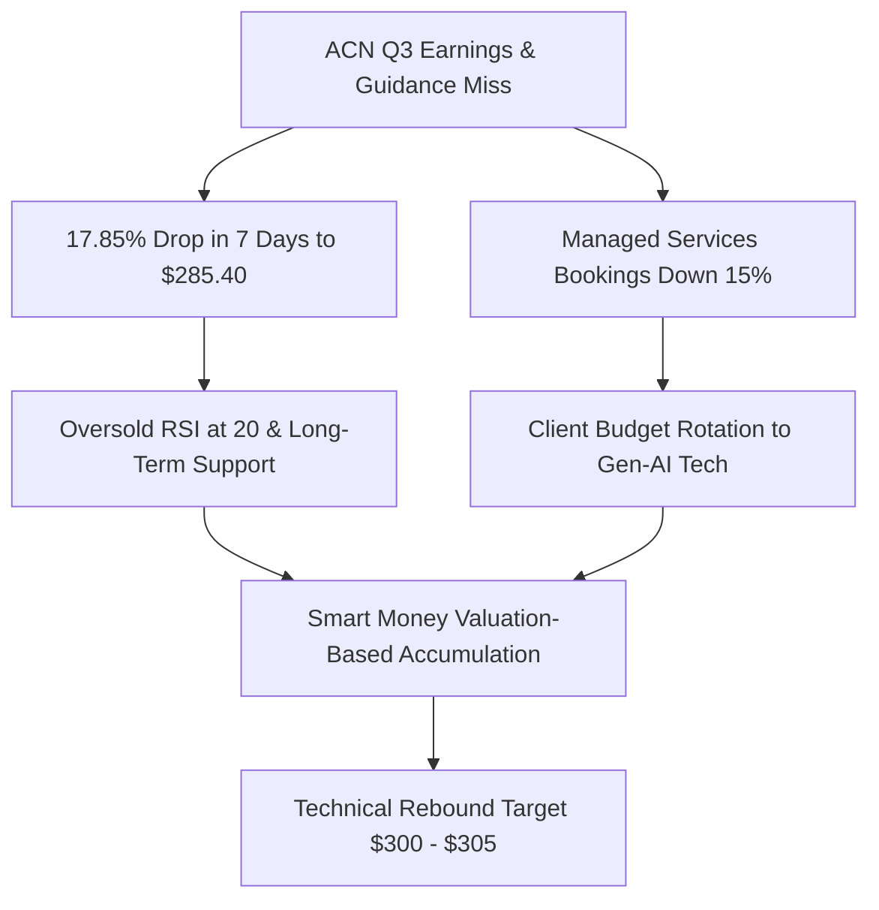
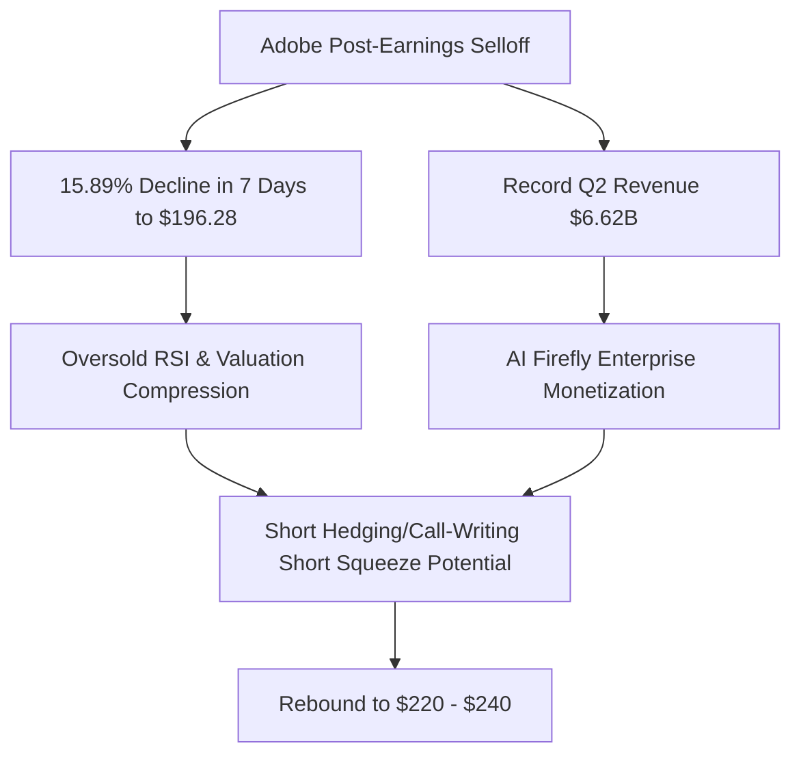
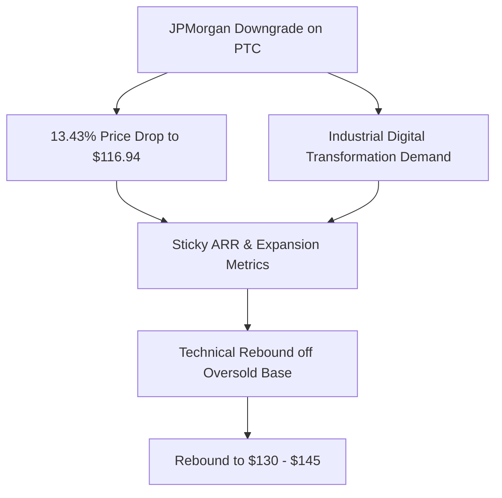
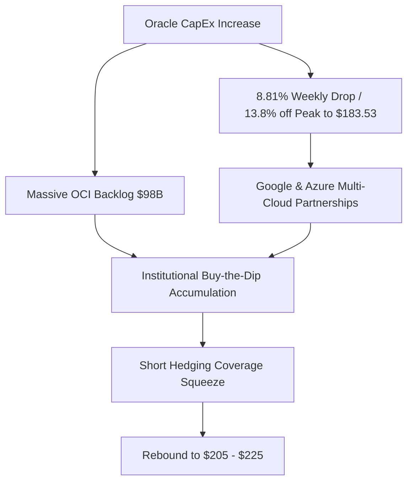
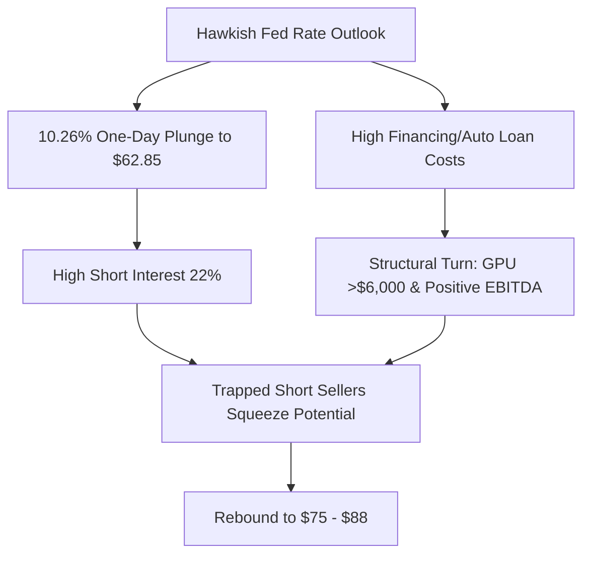

# 📊 Institutional Research Report: Tactical Oversold Opportunities & Recovery Catalysts
**Hedge Fund Trading Desk / Institutional Strategy Division**  
**Date:** June 22, 2026  
**Market Stance:** Tactical Accumulation on Quality Pullbacks (Sector Rotation & Hawkish Fed Volatility Buy-the-Dip)

---

## 📈 Executive Summary

ภายหลังจากการสิ้นสุดช่วงหยุดยาวในเทศกาล Juneteenth ตลาดหุ้นสหรัฐฯ ในสัปดาห์นี้เปิดทำการท่ามกลางการเปลี่ยนแปลงเชิงโครงสร้างและพฤติกรรมของกระแสเงินทุนที่รวดเร็ว ดัชนีหลักอย่าง S&P 500 พยายามทดสอบและรักษาระดับเหนือแนวต้านจิตวิทยาที่ 7,500 จุด ขณะที่ Nasdaq Composite ปรับตัว Rebound ขึ้นอย่างแข็งแกร่งเกือบ +2% ในรอบสัปดาห์ก่อนหน้า 

อย่างไรก็ดี ปัจจัยทางเศรษฐกิจมหภาคกำลังดำเนินไปอย่างตึงเครียด นำโดยจุดยืนสายเหยี่ยว (Hawkish Guidance) ของประธานธนาคารกลางสหรัฐฯ (Fed) คนใหม่ **Kevin Warsh** ที่เน้นย้ำถึงความจำเป็นในการคงอัตราดอกเบี้ยสูงยาวนานขึ้น (Higher-for-Longer Environment) เพื่อสกัดอัตราเงินเฟ้อ CPI ที่ยังคงเหนียวแน่นที่ 4.2% YoY ส่งผลให้ผลตอบแทนพันธบัตรรัฐบาลสหรัฐฯ อายุ 10 ปี ทรงตัวในระดับสูงที่ 4.46% ซึ่งเป็นปัจจัยสกัดกั้นระดับมูลค่า (Valuation Cap) ของหุ้นเติบโตสูงและหุ้นที่มีภาระหนี้สิน ในขณะที่ข่าวความคืบหน้าของกรอบข้อตกลงหยุดยิงเบื้องต้นระหว่างสหรัฐฯ-อิหร่าน ส่งผลให้ราคาน้ำมันดิบ Brent ร่วงลงต่ำกว่า $80 ต่อบาร์เรล ทำให้เกิดกระแสการเทขายทำกำไรอย่างรุนแรงในกลุ่มพลังงานต้นน้ำและกลุ่มป้องกันประเทศ (Defense Contractors)

ในสภาวะที่มีการหมุนเวียนกลุ่มอุตสาหกรรม (Sector Rotation) ครั้งใหญ่กว่า **2.45 หมื่นล้านดอลลาร์** สถาบันรายใหญ่ได้โยกเงินเข้าหาหุ้นเซมิคอนดักเตอร์และโครงสร้างพื้นฐาน AI เช่น **Intel (INTC)**, **Micron (MU)** และ **Marvell (MRVL)** สวนทางกับกลุ่มซอฟต์แวร์แบบดั้งเดิม บริการที่ปรึกษาไอที และกลุ่มที่ได้รับผลกระทบจากดอกเบี้ยสูงซึ่งถูกลดน้ำหนักการลงทุนชั่วคราว (Liquidation) จนราคาหุ้นตกอยู่ในสภาวะขายมากเกินไปทางสถิติ (Oversold)

ฝ่ายวิเคราะห์กลยุทธ์สถาบันประเมินว่า **"แรงขายตื่นตระหนกที่ขาดเหตุผลรองรับทางพื้นฐาน (Panic Selling) คือจังหวะที่ดีที่สุดสำหรับการสะสมหุ้นคุณภาพชั้นนำ"** เราได้ทำการคัดกรองหุ้นขนาดใหญ่และขนาดกลางที่มีโครงสร้างการเงินแข็งแกร่ง มีกระแสเงินสดสุทธิมั่นคง แต่ราคาปรับตัวลดลงสะสมมากกว่า 10% ในรอบ 7 วันที่ผ่านมา เพื่อระบุจุดซื้อเชิงกลยุทธ์ (Tactical Buy Zone) ใน 5 หุ้นเด่น: **Accenture (ACN)**, **Adobe (ADBE)**, **PTC Inc. (PTC)**, **Oracle (ORCL)**, และ **Carvana (CVNA)**

---

## 💡 In-Depth Analysis of 5 Tactical Picks

### 1️⃣ Accenture plc (NYSE: ACN)
*Legacy IT Consulting Leader Oversold on Generative AI Transition Lag*

#### **1. Overview & Business Model**
Accenture (ACN) เป็นบริษัทที่ปรึกษาด้านการจัดการ บริหารเทคโนโลยี และ Outsourcing ระดับโลก มีมูลค่าตลาดกว่า 1.8 แสนล้านดอลลาร์ ดำเนินธุรกิจเป็นผู้ช่วยทรานส์ฟอร์มองค์กรไปสู่ดิจิทัลทั่วโลก โดยทำหน้าที่เป็นสะพานเชื่อมระหว่างผู้พัฒนาซอฟต์แวร์/ฮาร์ดแวร์กับธุรกิจจริง

#### **2. Why the Price Dropped (>10% Drop Context)**
หุ้น ACN เผชิญแรงขายทำลายสถิติโดยดิ่งลงจากจุดระดับประมาณ **$347.41** ลงมาปิดที่ **$285.40** คิดเป็นการปรับตัวลดลงอย่างรุนแรงถึง **-17.85%** ภายหลังจากรายงานงบการเงินไตรมาส 3 ปีบัญชี 2026 โดยปัจจัยลบสำคัญคือ ยอดคำสั่งซื้อบริการประเภท Managed Services (งานดูแลระบบไอทีระยะยาว) หดตัวลงถึง 15% ประกอบกับการคาดการณ์รายได้ (Guidance) ไตรมาส 4 ต่ำกว่าที่นักวิเคราะห์ประเมินไว้ เนื่องจากบริษัทขนาดใหญ่เลือกชะลอโครงการไอทีทั่วไปและดึงงบประมาณกลับไปลงทุนติดตั้งระบบ Generative AI โดยตรงแทน

#### **3. Fundamentals & Financial Health**
*   **Operating Margin & Net Income:** แม้ยอดจองบริการไอทีแบบเก่าจะชะลอตัว แต่อัตรากำไรสุทธิและการทำกำไรของบริษัทยังคงอยู่ในระดับยอดเยี่ยม อัตรากำไรจากการดำเนินงาน (Operating Margin) สูงกว่า 15.5% และมีกระแสเงินสดอิสระ (Free Cash Flow) แกร่งระดับ $8 พันล้านดอลลาร์ต่อปี
*   **Debt Profile:** หนี้สินสุทธิต่ำมาก มีฐานะการเงินที่มั่นคงปลอดภัยจากความผันผวนของอัตราดอกเบี้ยสูง
*   **Dilution Risk:** **ต่ำมาก (Low)** บริษัทไม่มีความจำเป็นในการระดมทุนผ่านการออกหุ้นใหม่ แต่เน้นการซื้อหุ้นคืนเพื่อบริหารกำไรต่อหุ้น (EPS Support)

#### **4. Institutional Ownership & Smart Money Flow**
*   **Institutional Holding:** ~81.5% ถือครองโดยสถาบันการเงินขนาดใหญ่ เช่น Vanguard, BlackRock, และ State Street
*   **Whale Flow:** ในช่วงรอยต่อระหว่างวันที่ 18-19 มิถุนายน ข้อมูล Dark Pool พบบล็อกเทรดซื้อสุทธิ (Net Buy Block Trades) อย่างหนาแน่นแถวระดับแนวรับจิตวิทยา $280 - $285 บ่งชี้ว่า Smart Money มองระดับราคานี้เป็นมูลค่าที่ถูกเกินไปสำหรับการเข้าสะสมในระยะยาว

#### **5. Short Interest & Market Microstructure**
*   **Short Interest % of Float:** ~1.2% (ระดับปกติของหุ้น Blue Chip)
*   **Market Microstructure:** ปริมาณสัญญา Options ฝั่ง Put ผิดปกติถูกเปิดเพื่อการป้องกันความเสี่ยง (Hedging) ปริมาณมากแถวระดับ Strike Price $280-$290 ขณะเดียวกัน การที่ดัชนีชี้วัดกำลังสัมพัทธ์ (RSI) ปรับลดลงแตะระดับ **20 (Extremely Oversold)** สร้างโอกาสเกิดสภาวะ Technical Rebound จากพฤติกรรมปิดสถานะขายชอร์ตของกลุ่มป้องความเสี่ยงคัลออปชัน (Short Covering Rally)

#### **6. Growth Catalysts**
*   **Gen-AI Advisory Integration:** Accenture กำลังอยู่ในช่วงเร่งพนักงานไปอบรมทักษะ AI และเริ่มเซ็นสัญญาร่วมพัฒนาระบบ Generative AI กับองค์กรขนาดใหญ่ คาดว่าโครงการเหล่านี้จะสร้างรายได้ชดเชยงานไอทีระบบเดิมภายใน 2 ไตรมาสข้างหน้า
*   **Acquisitions of Boutique AI Firms:** การใช้เงินสดซื้อกิจการบริษัทที่ปรึกษา AI ขนาดเล็กเข้ามาในพอร์ต เพื่อรวบรวมทีมวิศวกรผู้เชี่ยวชาญเข้าสู่เครือข่าย

#### **7. Risk Assessment**
*   **Structural Budget Rotation:** ความเสี่ยงที่อุตสาหกรรมจะเปลี่ยนผ่านไปสู่การติดตั้งระบบ AI ด้วยตนเองโดยตรง ทำให้ความต้องการพึ่งพาที่ปรึกษาภายนอกลดลงถาวร (Structural Threat)

#### **8. Technical Analysis & Support/Resistance**
*   **Trend & Key Levels:** ราคาทรุดลงอย่างรวดเร็วจนเกิดช่องว่างราคา (Gap Down) ขนาดใหญ่ ปัจจุบันราคาแตะระดับแนวรับสำคัญระยะยาวบริเวณ $280 - $284 ซึ่งเคยเป็นฐานราคาในอดีต กราฟเทคนิกระดับวันส่งสัญญาณ Oversold สูงสุดในรอบ 3 ปี
*   **Support/Resistance:** แนวรับสำคัญ: $280.00, $275.00 / แนวต้านสำคัญ: $300.00, $312.00 (จุดปิด Gap)

#### **9. Rating & Trade Action Strategy**
*   **Rating:** **Strong Buy (Tactical Rebound Play)**
*   **Trading Setup:**
    *   *Buy Zone:* $282.00 - $286.00
    *   *Target Price:* $305.00 (เป้าหมายสั้น), $325.00 (เป้าหมายกลาง)
    *   *Stop Loss:* $274.00

---

### 2️⃣ Adobe Inc. (NASDAQ: ADBE)
*The AI Creative Powerhouse Oversold on Gen-AI Competition Fears*

#### **1. Overview & Business Model**
Adobe (ADBE) ครองสิทธิขาดในตลาดซอฟต์แวร์การสร้างสรรค์คอนเทนต์และการจัดการเอกสารผ่านโมเดลธุรกิจสมัครสมาชิกรายเดือน (SaaS) โดยมีระบบคลาวด์สร้างสรรค์ Creative Cloud (Photoshop, Illustrator, Premiere) เป็นแกนหลักที่ยากจะทดแทน

#### **2. Why the Price Dropped (>10% Drop Context)**
หุ้น ADBE ปรับฐานลึกสะสม **-15.89%** จากราคา **$233.38** ลงมาปิดที่ **$196.28** หลังจากตลาดวิเคราะห์ข้อมูลผลประกอบการ แม้รายได้จะพุ่งขึ้นทำจุดสูงสุดใหม่ที่ $6.62 พันล้านดอลลาร์ ทว่าความกลัวของนักลงทุนรายย่อยเกี่ยวกับการแย่งชิงส่วนแบ่งการตลาดจากโปรแกรมสร้างสรรค์ AI รุ่นใหม่ (Midjourney, OpenAI Sora) ได้จุดชนวนแรงขายตื่นตระหนกทางจิตวิทยา

#### **3. Fundamentals & Financial Health**
*   **Margins & Revenue:** อัตรากำไรขั้นต้นคงระดับพรีเมียมที่ **88.5%** บ่งบอกถึงอำนาจในการกำหนดราคาสูง ยอดขายยังคงขยายตัวอย่างต่อเนื่องทั้งในตลาดทั่วไปและระดับองค์กร
*   **Balance Sheet:** ไม่มีปัญหาหนี้สินระยะสั้น มีกระแสเงินสดสำรองรวมถึงโปรแกรมซื้อหุ้นคืนสะสมช่วยหนุนมูลค่าพื้นฐาน
*   **Dilution Risk:** **ต่ำมาก (Low)** จากระดับกระแสเงินสดหมุนเวียนจำนวนมหาศาลและการซื้อหุ้นคืนสม่ำเสมอ

#### **4. Institutional Ownership & Smart Money Flow**
*   **Institutional Holding:** ~82.3%
*   **Whale Flow:** ธุรกรรม Dark Pool ในโซนราคาต่ำกว่า $200 มีนัยสำคัญของคำสั่งซื้อสถาบันประเภทเน้นคุณค่า (Value Buyers) สะท้อนการประเมินมูลค่า PE Multiple ที่หดตัวลงมาอยู่ในจุดคุ้มค่าทางเศรษฐกิจ

#### **5. Short Interest & Market Microstructure**
*   **Short Interest % of Float:** ~1.8%
*   **Options Sentiment:** นักลงทุนสถาบันเปิดสถานะจำหน่ายคอลออปชัน (Call Writing) ปริมาณมากเพื่อรับค่าพรีเมียมในช่วงที่หุ้นดิ่งตัว หากราคาดีดขึ้นพ้นเขต $202 สัญญาณซื้อทางเทคนิคคัลจะบังคับให้เกิดแรงซื้อหุ้นแม่เพื่อทำการ Delta Hedging หนุนให้เกิด Short Squeeze ในสเกลจำกัด

#### **6. Growth Catalysts**
*   **Firefly Commercialization:** การจัดเก็บรายได้ (Monetization) จากบริการ Generative AI "Firefly" ในแพลตฟอร์มระดับองค์กร ซึ่งแก้ปัญหากฎหมายลิขสิทธิ์ได้อย่างมีประสิทธิภาพ ทำให้ลูกค้าสถาบันยินดีจ่ายค่าธรรมเนียมพรีเมียม
*   **Acrobat AI Assistant:** การคิดค่าบริการเพิ่มเติมรายเดือนสำหรับผู้ใช้ที่ต้องการฟังก์ชัน AI ในการสรุปและแปลความเอกสาร PDF

#### **7. Risk Assessment**
*   **Pricing Competitiveness:** ความเสี่ยงในการสูญเสียผู้ใช้ระดับเริ่มต้น (Individual Creators) ไปยังแพลตฟอร์ม AI แบบเปิดที่ให้ใช้ฟรีหรือราคาถูก

#### **8. Technical Analysis & Support/Resistance**
*   **Technical Indicator:** ดัชนี RSI ปรับตัวต่ำกว่าระดับ 28 (เขตขายมากเกินไป) โดยราคาตอบสนองต่อบริเวณแนวรับจิตวิทยาแถว $190 - $195 อย่างเด่นชัด
*   **Support/Resistance:** แนวรับสำคัญ: $192.00, $190.00 / แนวต้านสำคัญ: $205.00, $218.80

#### **9. Rating & Trade Action Strategy**
*   **Rating:** **Strong Buy (AI Value Play)**
*   **Trading Setup:**
    *   *Buy Zone:* $193.00 - $197.00
    *   *Target Price:* $220.00 (ระยะสั้น), $240.00 (ระยะกลาง)
    *   *Stop Loss:* $185.00

---

### 3️⃣ PTC Inc. (NASDAQ: PTC)
*SaaS Industrial Software Leader Oversold on JPMorgan Downgrade*

#### **1. Overview & Business Model**
PTC Inc. (PTC) พัฒนาซอฟต์แวร์เฉพาะทางด้าน CAD (เขียนแบบอัจฉริยะ) และ PLM (การจัดการวงจรชีวิตผลิตภัณฑ์) สำหรับโรงงานและวิศวกรรมการผลิตระดับโลก ซอฟต์แวร์ของบริษัทเปรียบเสมือนระบบปฏิบัติการหลังบ้านของภาคอุตสาหกรรมยานยนต์ การบิน และอวกาศ

#### **2. Why the Price Dropped (>10% Drop Context)**
หุ้น PTC ทรุดลงจากระดับ **$135.08** สู่ราคา **$116.94** คิดเป็นระดับการย่อตัวลงสะสม **-13.43%** ปัจจัยลบหลักมาจากการถูกปรับลดเกรดการลงทุน (Downgrade) โดยนักวิเคราะห์ของ JPMorgan ไปสู่ "Underweight" ซึ่งกระตุ้นให้โปรแกรมสแกนหุ้นสายโมเมนตัมสั่งขายหุ้นเพื่อป้องกันความเสี่ยงทันที

#### **3. Fundamentals & Financial Health**
*   **ARR & Margin:** รายได้รูปแบบบริการรายปี (Annual Recurring Revenue - ARR) เติบโตอย่างมั่นคง ลูกค้ายากที่จะเปลี่ยนใจไปใช้ซอฟต์แวร์คู่แข่งเนื่องจากมีต้นทุนในการทรานส์ฟอร์มระบบที่สูงมาก (High Switching Costs) ระดับอัตรากำไรจากการดำเนินงานสม่ำเสมอเหนือ 30%
*   **Dilution Risk:** **ต่ำมาก (Low)** ไม่มีหนี้สินที่สร้างแรงกดดันต่อโครงสร้างทางการเงินและไม่ต้องการทุนเพิ่ม

#### **4. Institutional Ownership & Smart Money Flow**
*   **Institutional Holding:** **สูงเป็นประวัติการณ์ที่ ~91.2%** หุ้น PTC เกือบทั้งหมดถูกถือครองโดยสถาบันการเงินที่เน้นกลยุทธ์ถือยาวระยะ 3-5 ปี
*   **Whale Flow:** บันทึกข้อมูลนอกกระดานแสดงธุรกรรมซื้อจับคู่ (Cross Trade) ขนาดใหญ่ของสถาบันที่ราคา $113 - $115 สะท้อนความเชื่อมั่นในศักยภาพธุรกิจของสถาบันส่วนใหญ่

#### **5. Short Interest & Market Microstructure**
*   **Short Interest % of Float:** ~2.3%
*   **Market Liquidity:** เนื่องจากการหมุนเวียนหุ้นในตลาด (Float Turnover) อยู่ในเกณฑ์ต่ำ สภาพคล่องที่น้อยทำให้ราคาตกลงเร็วเมื่อเจอแรงเทขายจากข่าวร้าย แต่การดีดกลับจะไร้แรงต้าน (Technical Squeeze) เมื่อแรงเทขายหมดลง

#### **6. Growth Catalysts**
*   **Windchill+ SaaS Migration:** การเปลี่ยนผ่านระบบ PLM แบบเดิมขององค์กรอุตสาหกรรมเข้าสู่ระบบ Cloud-Native (SaaS) ซึ่งช่วยเพิ่มค่าลิขสิทธิ์ต่อบัญชีผู้ใช้
*   **Smart Connected Factories:** ความจำเป็นในการอัปเดตระบบ IoT ของอุตสาหกรรมโรงงานเพื่อรองรับการประมวลผลและการใช้เซ็นเซอร์ที่ทันสมัย

#### **7. Risk Assessment**
*   **Industrial CapEx Freeze:** สภาวะอัตราดอกเบี้ยที่ตึงตัวอาจทำให้บริษัทอุตสาหกรรมชะลอการขยายฐานซอฟต์แวร์ออกไปชั่วคราว

#### **8. Technical Analysis & Support/Resistance**
*   **Indicator:** กราฟระดับวันมีค่า RSI ลดลงสู่จุดต่ำสุดที่ 22 สะท้อนถึงแรงเทขายที่เกินความเป็นจริงทางสถิติ (Statistical Extremity) และมีแรงรับพยุงบริเวณฐานราคาจุดต่ำสุดเดิมในรอบปี
*   **Support/Resistance:** แนวรับสำคัญ: $113.60, $110.00 / แนวต้านสำคัญ: $122.00, $130.00

#### **9. Rating & Trade Action Strategy**
*   **Rating:** **Buy (Quality Value Rebound)**
*   **Trading Setup:**
    *   *Buy Zone:* $114.50 - $117.50
    *   *Target Price:* $130.00 (เป้าหมายระยะสั้น), $145.00 (เป้าหมายระยะกลาง)
    *   *Stop Loss:* $109.50

---

### 4️⃣ Oracle Corporation (NYSE: ORCL)
*AI Cloud Infrastructure Play Dropped on CapEx Expansion Panic*

#### **1. Overview & Business Model**
Oracle (ORCL) เป็นผู้ให้บริการคลาวด์สาธารณะผ่าน Oracle Cloud Infrastructure (OCI) และระบบฐานข้อมูลองค์กรชั้นนำของโลก โดย OCI ได้รับความนิยมสูงเนื่องจากระบบเครือข่าย RDMA ที่มีประสิทธิภาพและราคาประหยัดกว่าคู่แข่งรายอื่นในการประมวลผล AI

#### **2. Why the Price Dropped (>10% Drop Context)**
หุ้น ORCL ปรับตัวลงสะสมจากจุดสูงสุดกว่า **$212** ลงมาสู่ระดับ **$183.53** คิดเป็นการปรับฐานลงสะสมกว่า **-13.8%** เนื่องจากสถาบันการเงินระยะสั้นปรับสัดส่วนความเสี่ยงออก หลังบริษัทประกาศเร่งเพิ่มงบลงทุนสินทรัพย์ถาวร (CapEx) เพื่อสร้างศูนย์ข้อมูลแห่งใหม่สำหรับการรองรับความต้องการชิป AI ซึ่งสร้างความกังวลชั่วคราวต่อกระแสเงินสดอิสระ (Free Cash Flow)

#### **3. Fundamentals & Financial Health**
*   **OCI Backlog:** สัญญางานค้างรับรู้รายได้ของระบบ OCI ทะยานสู่ **$9.8 หมื่นล้านดอลลาร์** แสดงถึงอุปสงค์การฝึกฝนแบบจำลองปัญญาประดิษฐ์ที่แข็งแกร่งและขยายตัวอย่างต่อเนื่อง
*   **Profitability:** ยอดขายและส่วนต่างกำไรยังคงมีทิศทางขยายตัวดีจากการทรานส์ฟอร์มฐานข้อมูลองค์กรแบบดั้งเดิมขึ้นสู่คลาวด์
*   **Dilution Risk:** **ต่ำมาก (Low)** ระดับหนี้สินได้รับการบริหารจัดการภายใต้สัดส่วนกระแสเงินสดอิสระระยะยาวที่มั่นคง

#### **4. Institutional Ownership & Smart Money Flow**
*   **Institutional Holding:** ~78.5%
*   **Whale Flow:** พฤติกรรมการซื้อขายใน Dark Pool บ่งชี้ว่าสถาบันประเภทเน้นคุณค่าระยะยาวเข้าสะสมหุ้นที่บริเวณแนวรับ $180 - $183 (Whale Accumulation Zone) เนื่องจากเล็งเห็นว่าการเพิ่มงบลงทุน CapEx จะนำไปสู่ผลตอบแทนที่สูงขึ้นในระยะกลางและระยะยาว

#### **5. Short Interest & Market Microstructure**
*   **Short Interest % of Float:** ~1.5%
*   **Microstructure:** สถานะสัญญา Options ปริมาณมากกระจุกตัวบริเวณราคา $180 ซึ่งทำหน้าที่เป็นกรอบราคาต้านทานหลัก หากตลาดปรับฐานสะท้อนข่าวร้ายหมดลง และราคายืนเหนือระดับดังกล่าว การเปลี่ยนทิศทางออปชัน (Gamma Flip) จะช่วยส่งเสริมโมเมนตัมการฟื้นตัวอย่างรวดเร็ว

#### **6. Growth Catalysts**
*   **Multi-Cloud Strategy:** ความร่วมมือทางยุทธศาสตร์ร่วมกับ Google Cloud และ Microsoft Azure ในการติดตั้งและรองรับฐานข้อมูล Oracle Database บนเครือข่ายพันธมิตรช่วยสร้างการรับรู้รายได้ใหม่แบบก้าวกระโดด
*   **RDMA High Performance Network:** การเป็นตัวเลือกหลักในการรันเวิร์กโหลด AI ขนาดใหญ่ของกลุ่มสตาร์ทอัพเทคโนโลยี

#### **7. Risk Assessment**
*   **GPU Supply Constraints:** ปัญหาความล่าช้าในการจัดส่งชิปเซมิคอนดักเตอร์เกรดสูง (Blackwell/H200) ของ NVIDIA อาจหน่วงสัญญาส่งมอบศูนย์ข้อมูล OCI ในบางภูมิภาค

#### **8. Technical Analysis & Support/Resistance**
*   **Trend:** ราคาลงมาสัมผัสระดับเส้นค่าเฉลี่ยเคลื่อนที่ราย 200 วัน (EMA 200) และชนระดับแนวรับจิตวิทยาแถว $180 ซึ่งทำหน้าที่ปะทะแรงขายได้ดีมาโดยตลอด
*   **Support/Resistance:** แนวรับสำคัญ: $180.00, $178.00 / แนวต้านสำคัญ: $192.50, $201.00

#### **9. Rating & Trade Action Strategy**
*   **Rating:** **Strong Buy (AI Infrastructure Dip Buy)**
*   **Trading Setup:**
    *   *Buy Zone:* $180.00 - $184.00
    *   *Target Price:* $205.00 (เป้าหมายสั้น), $225.00 (เป้าหมายระยะยาว)
    *   *Stop Loss:* $175.50

---

### 5️⃣ Carvana Co. (NYSE: CVNA)
*Oversold Squeeze Candidate Punished by Hawkish Fed Rate Panic*

#### **1. Overview & Business Model**
Carvana (CVNA) เป็นผู้บุกเบิกแพลตฟอร์มอีคอมเมิร์ซซื้อขายรถยนต์ใช้แล้วผ่านตู้ขายรถอัตโนมัติ (Car Vending Machine) และให้บริการด้านสินเชื่อรถยนต์ออนไลน์ครบวงจร

#### **2. Why the Price Dropped (>10% Drop Context)**
หุ้น CVNA ดิ่งตัวลดลงรุนแรงภายในวันเดียว **-10.26%** สู่ราคา **$62.85** ตอบสนองเชิงลบต่อถ้อยแถลงสายเหยี่ยวเชิงตึงตัวของประธาน Fed คนใหม่ Kevin Warsh เนื่องจากนักลงทุนกลัวว่าการคงอัตราดอกเบี้ยสูงเป็นเวลานานจะกดดันให้ดอกเบี้ยสินเชื่อรถยนต์มือสอง (Auto Loan Rates) ปรับตัวสูงขึ้น ซึ่งอาจบั่นทอนกำลังซื้อของผู้บริโภคทั่วไปในระยะสั้น

#### **3. Fundamentals & Financial Health**
*   **Turnaround Achievement:** บริษัทปรับเปลี่ยนทิศทางธุรกิจสำเร็จ โดยขยับพอร์ตมาเน้นอัตรากำไรขั้นต้นต่อหน่วย (Gross Profit per Unit - GPU) ทะลุระดับ **$6,000** ซึ่งทำสถิติสูงสุดใหม่ และมีตัวเลขกำไรก่อนหักภาษี ดอกเบี้ย และค่าเสื่อม (EBITDA) เป็นบวกสะสมอย่างสม่ำเสมอ
*   **Restructured Balance Sheet:** ปิดดีลการปรับยืดโครงสร้างชำระหนี้สินระยะยาวออกไป ช่วยลดภาระดอกเบี้ยของระบบได้ดีกว่าช่วงปี 2022
*   **Dilution Risk:** **ปานกลาง (Medium)** ความจำเป็นในการออกหุ้นใหม่ลดลงจากศักยภาพการสร้างกระแสเงินสดในปัจจุบัน แต่ความผันผวนของราคาหุ้นอาจเปิดโอกาสให้บริษัทใช้เครื่องมือระดมทุนหากสภาวะตลาดเอื้ออำนวย

#### **4. Institutional Ownership & Smart Money Flow**
*   **Institutional Holding:** ~65.2%
*   **Whale Flow:** สังเกตเห็นธุรกรรมการจัดระเบียบพอร์ตและการจำกัดความเสี่ยงชั่วคราว ทว่ามีกองทุน Hedge Fund แนวตั้งรับและลงทุนในสถานการณ์วิกฤต (Event-Driven Hedge Funds) ที่เริ่มทยอยเปิดสถานะบล็อกเกอร์ซื้อสะสมเมื่อราคาตกลงใต้ระดับ $60

#### **5. Short Interest & Market Microstructure**
*   **Short Interest % of Float:** **สูงเป็นพิเศษที่ ~22%** หุ้นมีลักษณะการขายชอร์ตสูง (High Short Interest) ซึ่งมักเป็นตัวเร่งสำคัญในการเปิดฉาก **Short Squeeze** หากราคาส่งสัญญาณ Rebound จากขอบเทคนิคคัล
*   **Microstructure:** สัดส่วนปริมาณการทำธุรกรรมฝั่งลบสะท้อนการเก็งกำไรที่แออัด (Crowded Short Trade) ทำให้มีโอกาสที่กลุ่มชอร์ตจะเข้าทำการจำกัดความเสี่ยง (Stop Loss Buy Cover) พร้อมกันหากหุ้นไม่ยอมหลุดฐานแนวรับ

#### **6. Growth Catalysts**
*   **Market Share Consolidation:** การแย่งชิงส่วนแบ่งการตลาดจากบริษัทรถยนต์มือสองรูปแบบดั้งเดิมที่ล้มละลายหรือปิดสาขาลงจากภาระต้นทุนดอกเบี้ยเงินกู้
*   **Proprietary Financing Automation:** การพัฒนาระบบ AI ในการคำนวณและประเมินคุณภาพสินเชื่อเพื่อปิดความเสี่ยงหนี้เสียและเพิ่มอัตรากำไรขั้นต้นต่อหน่วย

#### **7. Risk Assessment**
*   **Delinquency Rate Rise:** อัตราการค้างชำระหนี้สินเชื่อรถยนต์ใช้แล้วของผู้บริโภคระดับล่าง (Subprime Delinquency) ที่อาจขยายตัวตามแรงกดดันทางเศรษฐกิจมหภาค

#### **8. Technical Analysis & Support/Resistance**
*   **Trend:** ราคาดิ่งลงทดสอบฐานแนวรับเส้นค่าเฉลี่ย 100 วัน (EMA 100) แถวระดับราคา $60.00 - $62.00 ตัวชี้วัดทางเทคนิคคัลส่งสัญญาณลึกเข้าสู่เขต Oversold ในกราฟระยะสั้นเป็นโอกาสสำหรับการทำเทรดเชิงตั้งรับ
*   **Support/Resistance:** แนวรับสำคัญ: $60.00, $57.00 / แนวต้านสำคัญ: $70.00, $75.00

#### **9. Rating & Trade Action Strategy**
*   **Rating:** **Tactical Buy (High-Volatility Rebound)**
*   **Trading Setup:**
    *   *Buy Zone:* $61.00 - $64.00
    *   *Target Price:* $75.00 (เป้าหมายสั้น), $88.00 (เป้าหมายระยะสั้น-กลาง)
    *   *Stop Loss:* $56.00

---

## 📈 Comparison and Strategic Conclusion

ตารางสรุปมุมมองเชิงเปรียบเทียบในมิติความแข็งแกร่งทางพื้นฐาน (Fundamental Strength), ความตึงตัวทางเทคนิคคัล (Technical Condition) และพฤติกรรมสะสมของสถาบัน (Smart Money Signalling):

| Ticker | Fundamental Strength | Drop Reason (Structural vs Cyclical) | Institutional Support | Technical RSI | Recommendation Rating & Strategy |
| :--- | :--- | :--- | :--- | :--- | :--- |
| **ACN** | 🟢 Very Strong | 🟡 Cyclical/Budget Shift (ระยะสั้น) | 🟢 Strong Block Buy | 🟢 20 (Extremely Oversold) | **Strong Buy** — เหมาะสำหรับการตั้งรับเพื่อดักจับการปิด Gap ด้านบนระยะกลาง |
| **ADBE** | 🟢 Very Strong | 🟡 Cyclical/Competition Hype (ชั่วคราว) | 🟢 Hidden Accumulation | 🟢 27 (Oversold) | **Strong Buy** — เน้นการเก็งกำไร Rebound จากฐานราคาประวัติศาสตร์ |
| **PTC** | 🟢 Strong | 🟢 Cyclical (โบรกเกอร์ลดเกรดการลงทุน) | 🟢 Cross Trade Support | 🟢 22 (Oversold) | **Buy** — หุ้นสภาพคล่องต่ำที่มีความมั่นคงของรายได้ เหมาะแก่การถือสะสม |
| **ORCL** | 🟢 Very Strong | 🟡 Cyclical (ตลาดวิตกรายจ่าย CapEx) | 🟢 Whale Buy on Dip | 🟡 33 (Near-Oversold) | **Strong Buy** — ถือเป็นแกนหลักกลุ่ม AI Infrastructure ในราคาลดพิเศษ |
| **CVNA** | 🟡 Moderate | 🔴 Cyclical (แรงกดดันด้านดอกเบี้ยของเฟด) | 🟡 Speculative/Hedge Fund | 🟢 28 (Oversold) | **Tactical Buy** — สำหรับการเล่น Rebound/Squeeze ความผันผวนสูงมาก |

---

## ⚠️ Key Risks and Systemic Mitigations

1.  **Macro Liquidity Squeeze (ความตึงตัวทางสภาพคล่อง):**  
    หากอัตราเงินเฟ้อสหรัฐฯ Core PCE ในสัปดาห์นี้ออกมาสูงกว่าคาดการณ์อย่างรุนแรง บอนด์ยีลด์ 10 ปีอาจทะยานเหนือ 4.50% ซึ่งจะทำให้พรีเมียมส่วนต่างมูลค่าหุ้น (Equity Risk Premium) บีบแคบลง และเป็นอุปสรรคต่อแนวรับเทคนิคคัล ดังนั้นนักลงทุนควรดำเนินการซื้อในรูปแบบ **การแบ่งไม้สะสม (Tranche Buying)** แทนการเปิดโพซิชันขนาดใหญ่ในครั้งเดียว
2.  **Corporate Earnings Disruption (ความผันผวนของงบการเงิน):**  
    รายงานผลประกอบการของ **Micron Technology (MU)** ในช่วงกลางสัปดาห์นี้จะเป็นดัชนีสำคัญชี้วัดความต่อเนื่องของธีม AI หากงบและ Guidance ของ MU ต่ำกว่าที่ตลาดคาดหวัง กลุ่มเทคโนโลยีทั้งหมดอาจเผชิญแรงขายซ้ำเติม (Secondary Selloff) แนะนำให้รักษาวินัยการตัดขาดทุน (Stop Loss) อย่างเคร่งครัดตามแผนที่กำหนดไว้

---
*คำเตือน: รายงานการวิเคราะห์ฉบับนี้จัดทำขึ้นสำหรับเป็นข้อมูลเชิงลึกและแนวทางประกอบการศึกษาพฤติกรรมทางการเงินของตลาดหุ้นสหรัฐฯ เท่านั้น ไม่ใช่คำแนะนำหรือการเชิญชวนเสนอซื้อเสนอขายหลักทรัพย์อย่างเป็นทางการ ผู้ลงทุนควรทำการศึกษาข้อมูลเชิงลึกและประเมินระดับความเสี่ยงของตนเองก่อนการตัดสินใจเทรดทุกครั้ง*
