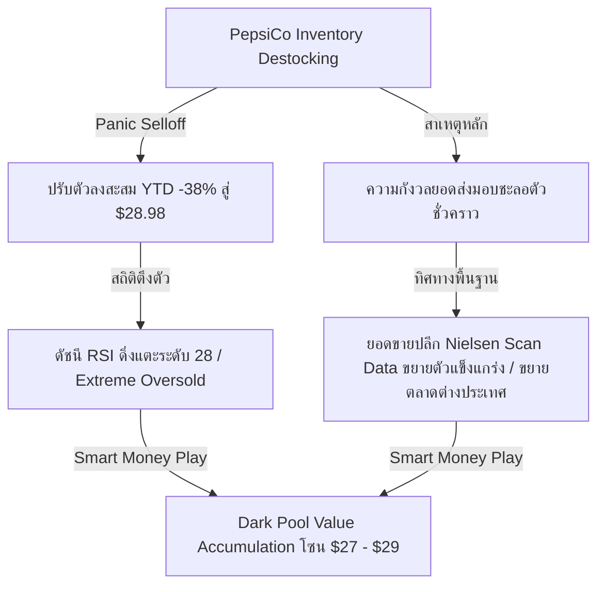
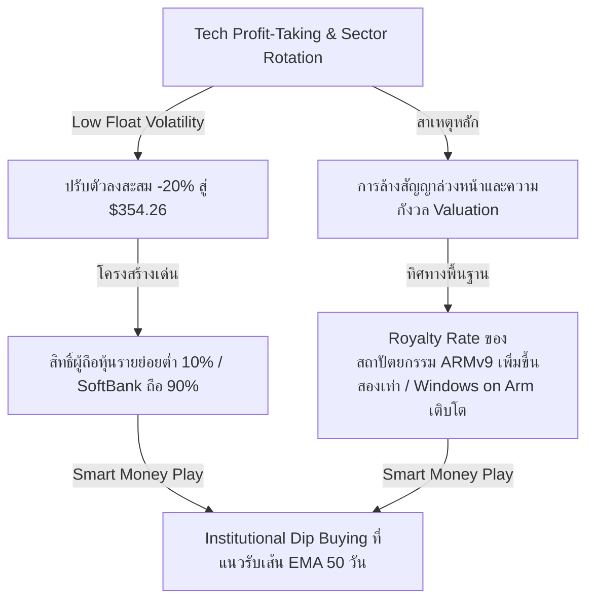
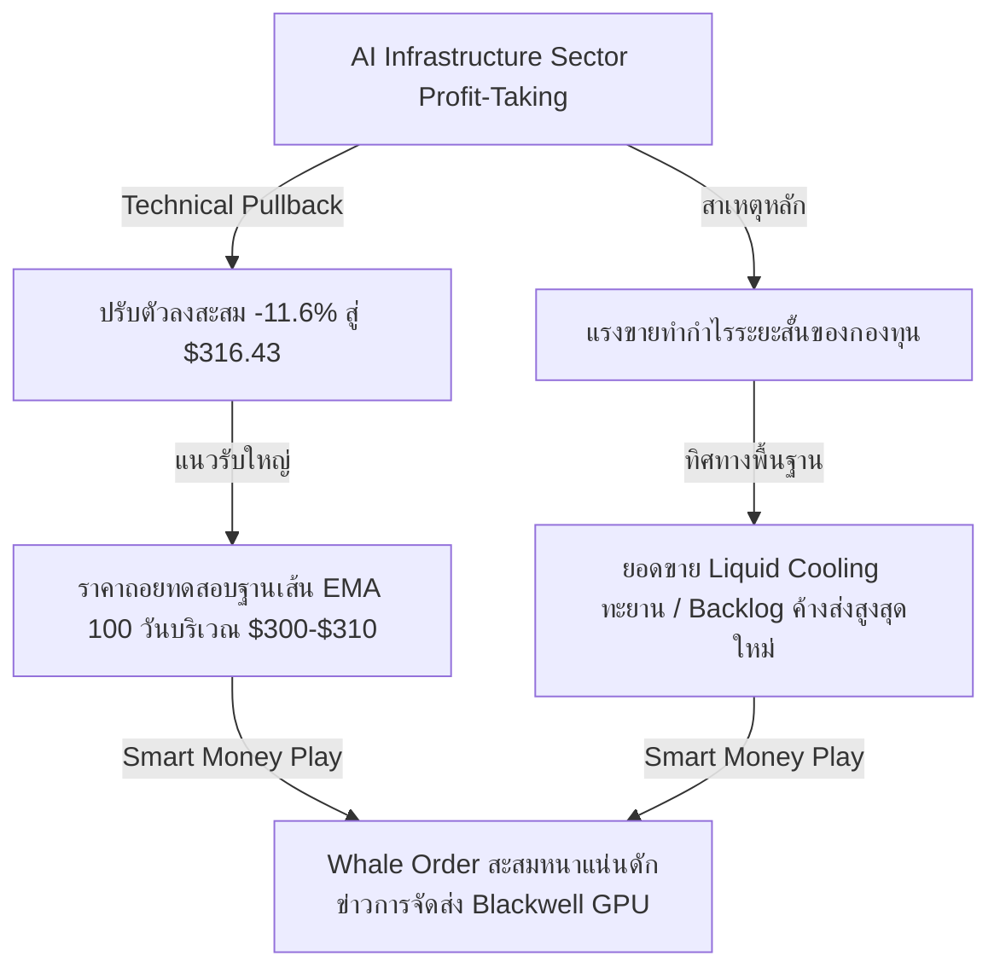

# 📊 Institutional Research Report: Tactical Oversold Opportunities & Recovery Catalysts
**Hedge Fund Trading Desk / Institutional Strategy Division**  
**Date:** June 28, 2026  
**Market Stance:** Tactical Accumulation on Quality Pullbacks (Sector Rotation & Hawkish Fed Volatility Buy-the-Dip)

---

## 📈 Executive Summary

สภาวะตลาดหุ้นสหรัฐฯ ในช่วงสัปดาห์สุดท้ายของเดือนมิถุนายนและไตรมาสที่ 2 ปี 2026 เผชิญกับการปรับโครงสร้างพอร์ตการลงทุนครั้งใหญ่ (Quarter-End Portfolio Rebalancing) ท่ามกลางกระแสการหมุนเวียนกลุ่มอุตสาหกรรม (Sector Rotation) จากกลุ่มบิ๊กเทคที่ปรับตัวขึ้นอย่างร้อนแรงก่อนหน้านี้เข้าสู่กลุ่มปลอดภัยและหุ้นคุณค่า ปัจจัยกดดันหลักมาจากถ้อยแถลงเชิงคุมเข้มนโยบายการเงินของประธานธนาคารกลางสหรัฐฯ (Fed) คนใหม่ **Kevin Warsh** ที่ยืนยันอัตราเงินเฟ้อทั่วไป (Headline PCE) ที่ระดับ 4.1% YoY และ Core PCE ที่ 3.4% YoY ซึ่งยังคงสูงกว่าเป้าหมายของธนาคารกลาง ส่งผลให้บอนด์ยีลด์สหรัฐฯ อายุ 10 ปี ทรงตัวในระดับสูงและสนับสนุนนโยบายดอกเบี้ยสูงค้างนาน (Higher for Longer)

นอกจากนี้ ตลาดต้องรับมือกับความท้าทายเชิงโครงสร้างใหม่ในระบบนิเวศปัญญาประดิษฐ์ (AI Ecosystem) นั่นคือ **"AI Memory Tax" (ภาษีหน่วยความจำ AI)** ซึ่งเป็นผลสืบเนื่องจากอัตรากำไรและยอดขายที่เติบโตอย่างก้าวกระโดดของ Micron Technology (MU) จากการผลิตชิป HBM3E ที่ถูกจองล่วงหน้าไปจนถึงปี 2027 ทว่าความสำเร็จของต้นน้ำนี้กลับส่งผ่านต้นทุนที่สูงขึ้นไปยังผู้ผลิตฮาร์ดแวร์ปลายน้ำและผู้ให้บริการคลาวด์ เช่น Apple (AAPL) ที่ปรับฐานลง -6.12% และ Microsoft (MSFT) ร่วง -3.70% เพื่อปรับปรุงประสิทธิภาพอัตรากำไร (Margin) ท่ามกลางความตึงเครียดทางภูมิรัฐศาสตร์รอบใหม่บริเวณช่องแคบฮอร์มุซหลังเหตุการณ์โดรนโจมตีเรือขนส่ง *Ever Lovely* ดันน้ำมันดิบ WTI ทะยานแตะ $71.92 และบีบให้กระแสเงินสดบางส่วนไหลออกจากสินทรัพย์เสี่ยงสูงอย่าง Bitcoin ไปยังกลุ่มปลอดภัย

อย่างไรก็ตาม ในสภาวะที่ตลาดตื่นตระหนก (Panic Selling) และเทขายหุ้นอย่างไร้เหตุผลเฉพาะตัว (Non-Idiosyncratic Selling) สถาบันการเงินและกองทุนสไตล์ Value-Driven มักมองเป็นโอกาสทองในการเข้าสะสมหุ้นคุณภาพชั้นเลิศ (High-Quality Compounds) ที่ราคาร่วงลงลึกจนเข้าสู่เขตขายมากเกินไป (Oversold Area) รายงานฉบับนี้ทำการวิเคราะห์เชิงลึก 3 หุ้นสหรัฐฯ ที่ราคาปรับฐานสะสมมากกว่า 10% ในช่วง 7 วันล่าสุด มีสภาพคล่องระดับพรีเมียม และมีโครงสร้างพื้นฐานธุรกิจที่แข็งแกร่งอย่างยิ่ง เพื่อเป็นแนวทางสำหรับกลยุทธ์การสะสมของ Smart Money

---

## 🔍 เจาะลึก 3 หุ้นพื้นฐานแกร่งที่ราคาดิ่งลึกเกินจริง (Tactical Oversold Candidates)

---

### 1️⃣ Celsius Holdings Inc. (NASDAQ: CELH)
*แบรนด์พลังงานทางเลือกสุขภาพกับแรงเทขายเกินจริงจากรอบบัญชีสินค้าคงคลัง*

#### **1. Overview & Business Model**
Celsius Holdings (CELH) เป็นผู้บุกเบิกและผู้นำตลาดเครื่องดื่มชูกำลังเพื่อสุขภาพ (Functional Energy Drinks) ที่เน้นคุณสมบัติเร่งการเผาผลาญพลังงาน ปราศจากน้ำตาล และใช้ส่วนผสมจากธรรมชาติ บริษัทดำเนินธุรกิจรูปแบบ Asset-Light โดยเน้นการสร้างแบรนด์ การวิจัยพัฒนาสูตร และการตลาด โดยมีพันธมิตรจัดจำหน่ายระดับโลกอย่าง PepsiCo ช่วยกระจายสินค้าเข้าสู่ช่องทางโมเดิร์นเทรด ร้านสะดวกซื้อ และตู้จำหน่ายสินค้าอัตโนมัติทั่วโลก

#### **2. Why the Price Dropped (>10% Drop Context)**
หุ้น CELH เผชิญแรงเทขายอย่างหนักส่งผลให้ราคาปรับตัวลดลงต่ำกว่าแนวรับจิตวิทยาแถว $30 ลงมาปิดที่ **$28.98** คิดเป็นการปรับตัวลดลงสะสมกว่า **-38% YTD** ปัจจัยลบหลักไม่ได้มาจากความต้องการของผู้บริโภคที่ลดลง แต่เกิดจากกระบวนการปรับลดระดับสินค้าคงคลัง (Inventory Destocking) ของผู้กระจายสินค้ารายใหญ่อย่าง PepsiCo ที่เร่งสต็อกสินค้ามากเกินไปในไตรมาสก่อนหน้า ส่งผลให้ยอดสั่งซื้อใหม่จาก PepsiCo ดูชะลอตัวลงชั่วคราวในรายงานงบการเงิน ตลาดเกิดความกังวลว่าอัตราการเติบโตของ Celsius ได้ผ่านจุดสูงสุดไปแล้ว จึงเกิดแรงขายล้างพอร์ตเชิงจิตวิทยา

#### **3. Fundamentals & Financial Health**
*   **Operating Margins & EBITDA:** บริษัทยังคงรักษาระดับการเติบโตของอัตรากำไรขั้นต้น (Gross Margin) สูงกว่า 48-50% และอัตรากำไรจากการดำเนินงานขยายตัวได้อย่างต่อเนื่องตามขีดความสามารถในการประหยัดต่อขนาด (Economies of Scale)
*   **Balance Sheet Strength:** โครงสร้างทางการเงินแข็งแกร่งระดับไร้ที่ติด้วยสถานะ **Zero Debt (ไม่มีหนี้สินที่มีภาระดอกเบี้ย)** และมีเงินสดหมุนเวียนในมือกว่า $1 พันล้านดอลลาร์สหรัฐ
*   **Dilution Risk:** **ต่ำมาก (Low)** เนื่องจากฐานะการเงินและกระแสเงินสดจากการดำเนินงานเป็นบวกสม่ำเสมอ ทำให้ไม่มีความจำเป็นในการออกหุ้นใหม่เพื่อระดมทุน

#### **4. Institutional Ownership & Smart Money Flow**
*   **Institutional Holding:** ~60% ของจำนวนหุ้นทั้งหมด
*   **Whale Flow:** ธุรกรรมใน Dark Pool บ่งชี้พฤติกรรมสะสมหุ้นจากสถาบันการเงินที่เน้นการลงทุนคุณค่า (Value & GARP Funds) อย่างหนาแน่นบริเวณ $27.00 - $29.00 ซึ่งสอดคล้องกับการประเมินว่าระดับราคาดังกล่าวคิดเป็น Forward P/E ที่ต่ำกว่า 30 เท่า ซึ่งต่ำที่สุดในประวัติศาสตร์การเติบโตของบริษัท

#### **5. Short Interest & Market Microstructure**
*   **Short Interest % of Float:** ~11.5%
*   **Microstructure:** สถานะ Options สัญญา Put หนาแน่นบริเวณระดับราคา $30.00 และ $27.50 ได้รับการชำระหรือ Roll Over ออกไปแล้ว ส่งผลให้แรงกดดันจากฝั่ง Delta Hedging ของ Market Makers เริ่มลดลง หากราคาสามารถยืนหยัดและทะลุผ่านกรอบแนวต้าน $30.50 จะกระตุ้นให้เกิดภาวะ Short Covering หนุนราคาดีดกลับแบบ V-Shape

#### **6. Growth Catalysts**
*   **International Expansion:** การเปิดตลาดอย่างเป็นทางการในสหราชอาณาจักร แคนาดา ฝรั่งเศส และยุโรปเหนือ ซึ่งได้รับประโยชน์จากเครือข่ายระดับโลกของ PepsiCo จะเป็นเครื่องยนต์หลักในการขับเคลื่อนรายได้ระลอกสอง
*   **Summer Consumption Peak:** อุปสงค์การบริโภคเครื่องดื่มเย็นที่พุ่งสูงในช่วงฤดูร้อน (Q2-Q3) จะสะท้อนผ่านตัวเลข Nielsen Scan Data ที่ฟื้นตัวโดดเด่นในเดือนกรกฎาคม

#### **7. Risk Assessment**
*   **Distribution Restructuring:** ความเสี่ยงหากการปรับโครงสร้างระบบคลังสินค้าและการกระจายสินค้าของ PepsiCo ใช้เวลานานกว่าที่คาดการณ์ไว้ (อาจลากยาวไปถึงสิ้นไตรมาสที่ 3)

#### **8. Technical Analysis & Support/Resistance**
*   **Trend:** ในทางเทคนิค กราฟราคาส่งสัญญาณขายมากเกินไปอย่างชัดเจน โดยดัชนี RSI รายวันดีดตัวอยู่แถวเขต **28 (Extreme Oversold Area)** ราคาปัจจุบันอยู่ใกล้ฐานแนวรับประวัติศาสตร์สำคัญ
*   **Support/Resistance:** แนวรับสำคัญ: $27.00, $25.00 / แนวต้านสำคัญ: $30.50, $33.50

#### **9. Rating & Trade Action Strategy**
*   **Rating:** **Strong Buy (Oversold Mean Reversion)**
*   **Trading Setup:**
    *   *Buy Zone:* $27.00 - $29.00
    *   *Target Price:* $33.50 (เป้าหมายสั้น), $38.00 (เป้าหมายระยะกลาง)
    *   *Stop Loss:* $25.00

---

### 2️⃣ Arm Holdings plc (NASDAQ: ARM)
*ราชาสถาปัตยกรรมชิปประมวลผล ย่อตัวรับการหมุนเวียนกลุ่มอุตสาหกรรมในสภาวะ Float ต่ำ*

#### **1. Overview & Business Model**
Arm Holdings (ARM) เป็นผู้ออกแบบและถือครองทรัพย์สินทางปัญญา (IP) สำหรับสถาปัตยกรรมไมโครโปรเซสเซอร์ที่ใช้ในอุปกรณ์สมาร์ทโฟนทั่วโลกกว่า 99% รวมถึงขยายตัวอย่างรวดเร็วเข้าสู่ชิปเซิร์ฟเวอร์ AI ดาต้าเซ็นเตอร์ และอุปกรณ์ปลายน้ำ (Edge AI) บริษัทสร้างรายได้ผ่าน 2 ช่องทางหลักคือ ค่าสิทธิ์การอนุญาตให้ใช้สิทธิ์ดีไซน์ (License Fees) และส่วนแบ่งค่าสิทธิบัตรจากชิปที่ผลิตและจัดส่งจริง (Royalty Fees)

#### **2. Why the Price Dropped (>10% Drop Context)**
หุ้น ARM ปรับตัวลงจากระดับสูงสุดเหนือ $400 ลงมาสู่ **$354.26** คิดเป็นการปรับฐานสะสมเกือบ **-20%** ภายในหนึ่งสัปดาห์ แรงกดดันหลักมาจากการปรับพอร์ตของกองทุนขนาดใหญ่ที่เทขายทำกำไรหุ้นเซมิคอนดักเตอร์ที่มีระดับมูลค่า (Valuation Multiples) ค่อนข้างสูง เพื่อลดความเสี่ยงภาพรวมพอร์ต ประกอบกับโครงสร้างหุ้นของ ARM มีปริมาณหุ้นหมุนเวียนในตลาดเสรี (Public Float) ต่ำมากเพียงประมาณ 10% (ขณะที่ SoftBank ถือครองไว้ถึง 90%) ทำให้ตัวราคาหุ้นมีความผันผวนสูงมากเมื่อมีกระแสเงินทุนไหลออกเชิงระบบ

#### **3. Fundamentals & Financial Health**
*   **High-Margin Royalty Upgrade:** อัตราส่วนกำไรขั้นต้นยังคงทรงตัวสูงในระดับพรีเมียมเนื่องจากต้นทุนการผลิตเกือบเป็นศูนย์ การเปลี่ยนผ่านของลูกค้าไปสู่สถาปัตยกรรม **ARMv9** ช่วยเพิ่มอัตราค่าสิทธิบัตร (Royalty Rate) ขึ้นอีกเท่าตัวจากรุ่นเดิม
*   **Operating Margin & Cash Flows:** อัตรากำไรจากการดำเนินงานแข็งแกร่งขยายตัวสูงกว่า 40% และมีกระแสเงินสดอิสระเติบโตตามปริมาณสัญญาระยะยาวของคลาวด์ไฮเปอร์สเกลเลอร์
*   **Dilution Risk:** **ต่ำมาก (Low)** เนื่องจากกระแสเงินสดสุทธิเป็นบวกสม่ำเสมอและมีฐานทุนหนุนหลังจากบริษัทแม่อย่าง SoftBank

#### **4. Institutional Ownership & Smart Money Flow**
*   **Institutional Holding:** สถาบันถือครองในสัดส่วนสูงมากในโควตาหุ้นฟรีโฟลตที่เหลือ
*   **Whale Flow:** บันทึกข้อมูล Block Trade แสดงแรงช้อนซื้อเก็งกำไรของกลุ่มทุนเทคโนโลยีขนาดใหญ่ที่เข้ามาค้ำราคาหุ้นแถวระดับเส้น EMA 50 วันบริเวณ $340 - $350 บ่งชี้ว่าเงินทุนสถาบันมองการปรับฐานนี้เป็นจุดเข้าซื้อที่เหมาะสมสำหรับการถือครองเชิงยุทธศาสตร์

#### **5. Short Interest & Market Microstructure**
*   **Short Interest % of Float:** ~1.5% - 2% (ต่ำ แต่มีประเด็นเรื่องสภาพคล่องต่ำ)
*   **Microstructure:** ด้วยความที่หุ้นมี Float น้อยมาก การซื้อคืนเพื่อปิดสถานะป้องกันความเสี่ยง (Delta/Gamma Hedging) ของสถาบันสัญญาสิทธิซื้อขาย Options บริเวณราคา $350 จะส่งผลให้เกิดปรากฏการณ์ **"Float Squeeze"** ดึงราคาหุ้นดีดกลับอย่างรุนแรงหากมีข่าวบวกมาเร่งปฏิกิริยา

#### **6. Growth Catalysts**
*   **Windows on Arm (WoA):** การเติบโตอย่างรวดเร็วของยอดสั่งซื้อชิปประมวลผลพีซีตระกูล Copilot+ PC จากค่ายไมโครซอฟท์และพันธมิตรผู้ผลิตฮาร์ดแวร์รายใหญ่ที่เปลี่ยนมาใช้ดีไซน์ของ ARM
*   **Edge AI Adoption:** การนำชิปประมวลผลขนาดเล็กที่มีชุดคำสั่ง AI ในตัวไปใช้อย่างกว้างขวางในสมาร์ทโฟนระดับเรือธงของปี 2026-2027

#### **7. Risk Assessment**
*   **Geopolitical Tech Restrict:** ปัญหาความตึงเครียดด้านสงครามการค้าระหว่างสหรัฐฯ และจีน ซึ่งอาจส่งผลกระทบต่อสัดส่วนรายได้จากตลาดจีน (Arm China) 

#### **8. Technical Analysis & Support/Resistance**
*   **Trend:** ราคาลงมาดิ่งทดสอบกรอบเส้นค่าเฉลี่ยสะสมราย 50 วัน (EMA 50 วัน รายวัน) ซึ่งทำหน้าที่เป็นแนวรับใหญ่เชิงจิตวิทยา ดัชนีโมเมนตัมกำลังพยายามสร้างฐานสะสมกำลังเพื่อเปลี่ยนแนวโน้มระยะสั้น
*   **Support/Resistance:** แนวรับสำคัญ: $340.00, $325.00 / แนวต้านสำคัญ: $368.00, $390.00

#### **9. Rating & Trade Action Strategy**
*   **Rating:** **Strong Buy (Tactical Quality Dip Buy)**
*   **Trading Setup:**
    *   *Buy Zone:* $340.00 - $355.00
    *   *Target Price:* $390.00 (เป้าหมายสั้น), $430.00 (เป้าหมายระยะยาว)
    *   *Stop Loss:* $325.00

---

### 3️⃣ Vertiv Holdings Co. (NYSE: VRT)
*ผู้ผูกขาดเทคโนโลยีระบบระบายความร้อนดาต้าเซ็นเตอร์ AI ที่ถูกเทขายทำกำไรเชิงเทคนิคคอล*

#### **1. Overview & Business Model**
Vertiv Holdings (VRT) เป็นผู้นำตลาดโลกด้านโครงสร้างพื้นฐานระบบพลังงาน การควบคุมอุณหภูมิ และระบบระบายความร้อนด้วยของเหลว (Liquid Cooling Systems) สำหรับศูนย์ข้อมูลขนาดใหญ่ (Hyperscale Data Centers) เทคโนโลยีของบริษัทเป็นปัจจัยสำคัญในการระบายความร้อนให้แก่ชิปประมวลผล AI กำลังไฟสูงของค่าย NVIDIA และ AMD เพื่อรักษาระดับประสิทธิภาพการทำงานของระบบประมวลผลคลาวด์

#### **2. Why the Price Dropped (>10% Drop Context)**
หุ้น VRT เผชิญแรงเทขายสะสมรุนแรงภายในสัปดาห์ปรับฐานลงมาที่ราคา **$316.43** ลดลงกว่า **-11.6% ในรอบ 7 วัน** สาเหตุหลักไม่ใช่เรื่องการลดระดับคำสั่งซื้อ แต่เป็นการขายทำกำไรเชิงเทคนิคคอล (Technical Profit-Taking) หลังจากราคาหุ้นปรับตัวขึ้นทำผลงานได้อย่างแข็งแกร่งต่อเนื่องมาตั้งแต่ต้นปี นักลงทุนสถาบันบางส่วนล้างพอร์ตเก็งกำไรระยะสั้นเพื่อบริหารความเสี่ยงหลังเกิดความวิตกเรื่องข้อจำกัดด้านงบ CapEx ไอทีระดับโลก

#### **3. Fundamentals & Financial Health**
*   **Backlog & Order Pipeline:** บริษัทมียอดคำสั่งซื้อค้างส่ง (Backlog) สูงสุดเป็นประวัติการณ์ และมีพลังในการกำหนดราคาสูงมาก (Pricing Power) เนื่องจากลูกค้ากลุ่มคลาวด์ไฮเปอร์สเกลเลอร์จำเป็นต้องใช้เทคโนโลยีควบคุมความร้อนของ Vertiv เพื่อป้องกันระบบเซิร์ฟเวอร์ล่ม
*   **Profitability & Cash Flow:** อัตราส่วน EBITDA Margin ขยายตัวอย่างโดดเด่นตามความต้องการกลุ่มระบบระบายความร้อน Liquid Cooling ที่มีอัตรากำไรขั้นต้นพรีเมียม
*   **Dilution Risk:** **ต่ำมาก (Low)** เนื่องจากโครงสร้างรายได้และ FCF เติบโตอย่างมีนัยสำคัญ

#### **4. Institutional Ownership & Smart Money Flow**
*   **Institutional Holding:** ~88% (สถาบันการเงินถือครองอย่างหนาแน่นสูงสุด)
*   **Whale Flow:** ธุรกรรม Block Trade นอกกระดานสะท้อนพฤติกรรมการตั้งรับซื้อคืนของกลุ่มสถาบันระดับใหญ่ เช่น Fidelity และ BlackRock บริเวณระดับราคาแนวรับเส้น EMA 100 วัน แถว $300.00 - $310.00 ซึ่งสอดคล้องกับพฤติกรรมสะสมของ Smart Money

#### **5. Short Interest & Market Microstructure**
*   **Short Interest % of Float:** ~3.73% (ต่ำ ไม่มีนัยสำคัญเชิง short squeeze ลบ แต่เป็นบวกต่อเสถียรภาพราคา)
*   **Microstructure:** สัญญา Options ปริมาณมากกระจุกตัวบริเวณราคา $300.00 ซึ่งทำหน้าที่เป็นกรอบราคาต้านทานหลักทางจิตวิทยา หากราคายืนเหนือระดับดังกล่าว การเปลี่ยนทิศทางออปชัน (Gamma Flip) จะช่วยส่งเสริมโมเมนตัมการฟื้นตัวอย่างรวดเร็ว

#### **6. Growth Catalysts**
*   **NVIDIA Blackwell Deployment:** การเริ่มจัดส่งระบบประมวลผลสถาปัตยกรรม Blackwell ของ NVIDIA ในช่วงครึ่งปีหลัง ซึ่งจำเป็นต้องเปลี่ยนมาใช้งานระบบระบายความร้อนด้วยของเหลวแบบปิดเต็มรูปแบบ จะดึงอุปสงค์ของ Vertiv ให้เติบโตอีกหลายเท่าตัว
*   **Hyperscaler Long-term Contracts:** ดีลสัญญาระยะยาวกับค่ายคลาวด์ยักษ์ใหญ่ในการติดตั้งระบบโครงสร้างพื้นฐานพลังงานไฟฟ้ารอบใหม่

#### **7. Risk Assessment**
*   **Supply Chain Constraints:** ความเสี่ยงหากการจัดส่งตัวเก็บประจุไฟฟ้าแรงสูงและอุปกรณ์ประกอบบางชิ้นเกิดปัญหาขาดแคลนในระบบห่วงโซ่อุปทาน

#### **8. Technical Analysis & Support/Resistance**
*   **Trend:** ราคาลงมาสัมผัสระดับแนวรับสำคัญรอบเส้นค่าเฉลี่ยสะสม 100 วัน (EMA 100) แถวระดับราคา $300 - $310 ซึ่งทำหน้าที่เป็นจุดกลับตัวสำคัญและปะทะแรงขายได้ดีมาโดยตลอด
*   **Support/Resistance:** แนวรับสำคัญ: $300.00, $285.00 / แนวต้านสำคัญ: $340.00, $360.00

#### **9. Rating & Trade Action Strategy**
*   **Rating:** **Strong Buy (AI Infrastructure Dip Buy)**
*   **Trading Setup:**
    *   *Buy Zone:* $300.00 - $316.00
    *   *Target Price:* $340.00 (เป้าหมายสั้น), $375.00 (เป้าหมายระยะยาว)
    *   *Stop Loss:* $285.00

---

## 📈 Comparison and Strategic Conclusion

ตารางเปรียบเทียบปัจจัยพื้นฐาน ความตึงตัวของเทคนิคคัล และพฤติกรรมของ Smart Money เพื่อจัดกลุ่มและกำหนดทิศทางยุทธศาสตร์:

| Ticker | Fundamental Strength | Drop Reason (Structural vs Cyclical) | Institutional Support | Technical RSI | Recommendation Rating & Strategy |
| :--- | :--- | :--- | :--- | :--- | :--- |
| **CELH** | 🟢 Very Strong (Zero Debt) | 🟡 Cyclical (inventory cleanup ชั่วคราว) | 🟢 Value Fund Accumulation | 🟢 28 (Extreme Oversold) | **Strong Buy** — ดักซื้อจังหวะ Mean Reversion เพื่อปิดช่องว่างราคาด้านบนระยะสั้น-กลาง |
| **ARM** | 🟢 Very Strong (IP Monopoly) | 🟡 Cyclical (เทขายทำกำไรกลุ่มเซมิคอนดักเตอร์) | 🟢 Hidden Block Accumulation | 🟡 33 (Near-Oversold) | **Strong Buy** — เหมาะสำหรับสะสมบริเวณเส้น EMA 50 วัน เพื่อรับโอกาสเกิด Float Squeeze |
| **VRT** | 🟢 Excellent (AI Cooling Leader) | 🟡 Cyclical (แรงขายทำกำไรระยะสั้นเชิงเทคนิคคัล) | 🟢 Smart Money Support at EMA 100 | 🟡 34 (Near-Oversold) | **Strong Buy** — แกนหลักกลุ่มโครงสร้างพื้นฐาน AI ในราคาลดพิเศษรับข่าวส่งมอบชิปใหม่ |

---

## ✍️ บทสรุปเชิงกลยุทธ์ตามหลักจิตวิทยาตลาด (Market Psychology Conclusion)

จากการประเมินตัวแปรและตอบข้อซักถามเชิงลึกเกี่ยวกับการปรับฐานสะสมของราคาหุ้นรอบนี้ ทีมกลยุทธ์สรุปข้อพิจารณาออกเป็น 5 ประเด็นหลักดังนี้:

1.  **หุ้นตัวไหนดู “Oversold” มากที่สุด:**  
    **Celsius Holdings Inc. (CELH)** ถือเป็นหุ้นที่ส่งสัญญาณขายมากเกินไปชัดเจนที่สุดในทางสถิติ โดยมีค่า RSI รายวันดิ่งแตะระดับ **28** ซึ่งสะท้อนความกลัวของนักลงทุนรายย่อยที่ล้นเกินความจริงจากการปรับเปลี่ยนสินค้าคงคลังในห่วงโซ่อุปทานของ PepsiCo
2.  **หุ้นตัวไหนมีพื้นฐานแข็งแรงที่สุด:**  
    **Arm Holdings plc (ARM)** ด้วยโมเดลธุรกิจผูกขาดสิทธิ์การดีดโปรแกรมประมวลผล (IP Architecture Monopoly) สำหรับโทรศัพท์สมาร์ทโฟนทั่วโลก และการเปิดรับสัญญายกระดับค่าลิขสิทธิ์เทคโนโลยี ARMv9 ซึ่งเป็นทรัพย์สินทางปัญญาแบบไม่มีต้นทุนการผลิต ส่งผลให้เป็นบริษัทที่มีความแข็งแกร่งด้านสิทธิ์การตั้งราคาและมาร์จิ้นกำไรสูงสุดในบรรดาตัวเลือกทั้งหมด
3.  **หุ้นตัวไหนตลาดอาจ Panic เกินจริง:**  
    **Vertiv Holdings Co. (VRT)** แรงเทขายดิ่งตัว -11.6% ในช่วงที่ผ่านมาเป็นสภาวะตื่นตระหนกที่ขัดแย้งกับความเป็นจริงของระบบนิเวศดาต้าเซ็นเตอร์ เนื่องจากผู้ให้บริการคลาวด์และผู้ออกแบบชิป AI (NVIDIA Blackwell) ไม่สามารถชะลอการติดตั้งระบบระบายความร้อนด้วยของเหลวได้เลย การปรับตัวลดลงจึงเป็นเพียงกลไกการ Rebalance เงินสดระยะสั้นของกองทุนเท่านั้น
4.  **หุ้นตัวไหนเหมาะกับการสะสมระยะกลาง-ยาว:**  
    **ทั้ง VRT และ ARM** เหมาะสำหรับเป็นเสาหลักในพอร์ตการลงทุนระยะกลาง-ยาวของธีม AI Infrastructure เนื่องจากเป็นเทคโนโลยีต้นน้ำที่ได้รับการคุ้มครองด้วยคูเมืองทางธุรกิจ (Economic Moats) สูง ขณะที่ **CELH** เหมาะสำหรับเป็นกลุ่มเก็งกำไรฟื้นกลับทางเทคนิค (Turnaround/Growth Rebound Play) ที่มีมิติ Risk/Reward สูงมาก
5.  **สรุปภาพรวมตลาด (Market Sentiment):**  
    ทีมวิเคราะห์ประเมินสภาวะตลาดปัจจุบันอยู่ภายใต้รูปแบบ **"Rotation & Correction" (การหมุนเวียนกลุ่มลงทุนและการปรับฐานทางเทคนิคคัล)** มากกว่าจะเป็นจุดเริ่มต้นของตลาดหมี (Bear Market) สภาพคล่องไม่ได้หนีออกจากตลาดหุ้นสหรัฐฯ ทั้งหมด แต่เป็นการโยกย้ายเงินทุนออกจากกลุ่มบิ๊กเทคปลายน้ำเพื่อเข้าตั้งรับในกลุ่มหุ้นที่มีมูลค่าสมเหตุสมผลและมีโครงสร้างหนุนเฉพาะตัวอย่างมั่นคง การปรับตัวลดลงครั้งนี้จึงเป็นโอกาสในการช้อนซื้อ (Tactical Buy-the-Dip) หุ้นคุณภาพในราคาที่ถูกลง

---

## ⚠️ Key Risks and Systemic Mitigations

1.  **Macro Liquidity Volatility (ความผันผวนด้านสภาพคล่องระดับมหภาค):**  
    หากข้อมูลเศรษฐกิจมหภาคและการจ้างงานของสหรัฐฯ ออกมาตึงตัวมากเกินไป อาจกระตุ้นให้บอนด์ยีลด์ดีดตัวขึ้นอีกครั้ง ส่งผลกดดันต่อระดับ Valuation ของหุ้นเติบโต แนะนำให้นักลงทุนแบ่งสัดส่วนการลงทุนออกเป็น **3-4 ไม้สะสม (Tranche Buying)** แทนการเปิดโพซิชันเต็มจำนวนในครั้งเดียวเพื่อลดผลกระทบจากความผันผวน
2.  **Earnings Guidance Scrutiny (การตรวจสอบเป้าหมายกำไรระยะยาว):**  
    การแถลงการณ์ผลประกอบการและมุมมองทิศทางธุรกิจในไตรมาสถัดไปของกลุ่มคู่ค้าจะเป็นปัจจัยชี้ชวนหลัก แนะนำให้เฝ้าสังเกตและจำกัดสัดส่วนความเสี่ยงผ่านวินัยการตั้งจุดตัดขาดทุน (Stop Loss) ตามแนวรับใหญ่ทางเทคนิคคัลอย่างเคร่งครัด

---
*คำเตือน: รายงานการวิเคราะห์ฉบับนี้จัดทำขึ้นโดยฝ่ายวิเคราะห์กลยุทธ์เพื่อจุดประสงค์ในการให้ข้อมูลและแนวทางประกอบการศึกษาปัจจัยพื้นฐานและเทคนิคคัลของตลาดหุ้นสหรัฐฯ เท่านั้น ข้อมูลทั้งหมดไม่จัดเป็นคำแนะนำหรือการเชิญชวนอย่างเป็นทางการเสนอซื้อเสนอขายหลักทรัพย์ใดๆ ทั้งสิ้น การลงทุนมีความเสี่ยงสูง ผู้ลงทุนควรวิเคราะห์ข้อมูลเชิงลึกและบริหารขนาดสถานะ (Position Sizing) ของตนเองให้สอดคล้องกับระดับความเสี่ยงที่ยอมรับได้ในทุกแผนการเปิดคำสั่งเทรด*
