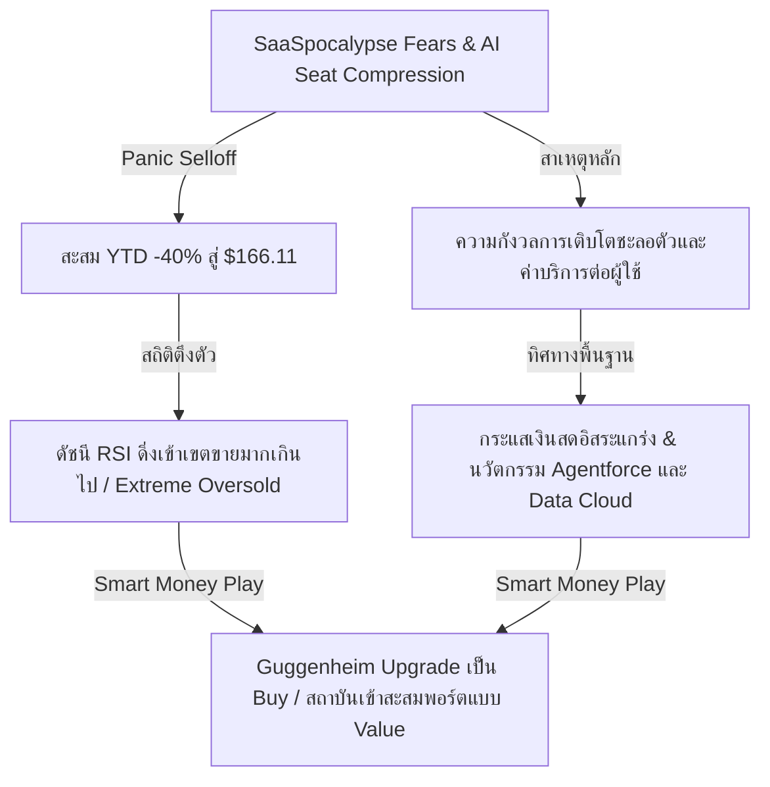
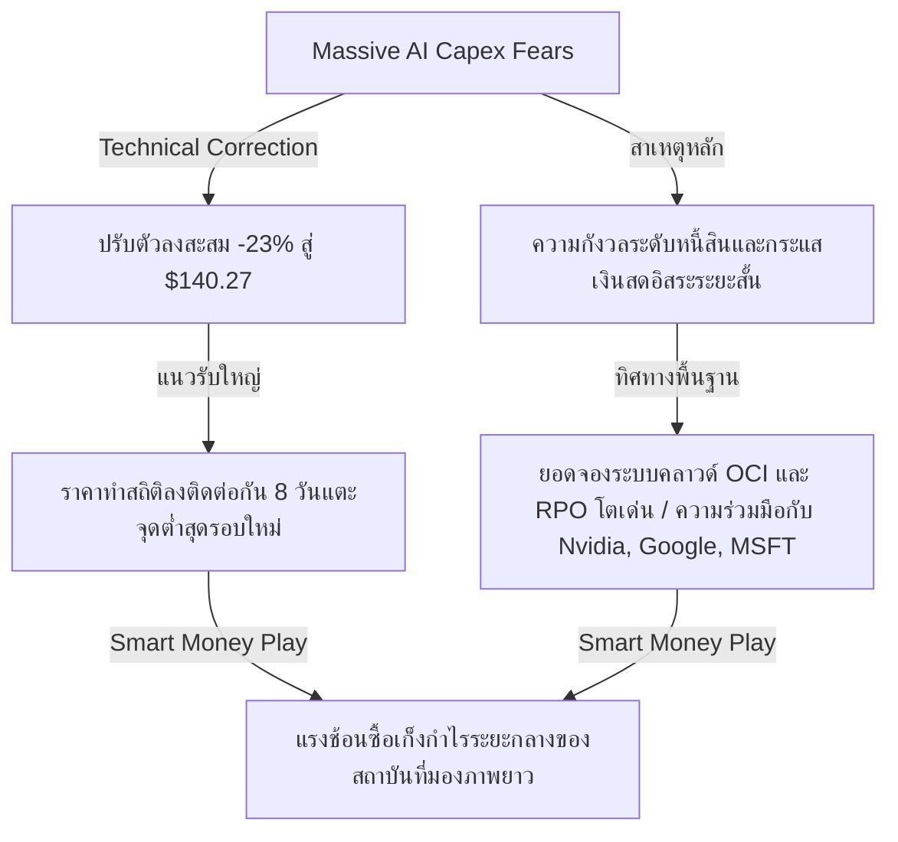

<p align="center"></p>

# 📊 Institutional Research Report: Tactical Oversold Opportunities & Recovery Catalysts
**Hedge Fund Trading Desk / Institutional Strategy Division**  
**Date:** July 5, 2026  
**Market Stance:** Tactical Accumulation on Quality Pullbacks (Mega Rotation & Hawkish Fed Volatility Buy-the-Dip)

---

## 📈 Executive Summary

สภาวะตลาดหุ้นสหรัฐฯ ในช่วงปลายเดือนมิถุนายนและต้นเดือนกรกฎาคม ปี 2026 เผชิญกับปรากฏการณ์ **"Mega Rotation" (การหมุนเวียนกลุ่มอุตสาหกรรมครั้งใหญ่)** อย่างรุนแรง นักลงทุนสถาบันและกองทุนขนาดใหญ่เร่งสลับโพซิชัน (Portfolio Rebalancing) โดยถอนเม็ดเงินออกจากกลุ่มบิ๊กเทคเซมิคอนดักเตอร์และชิปประมวลผลปัญญาประดิษฐ์ (AI) ที่เคยให้ผลตอบแทนสูงลิ่วก่อนหน้านี้ เพื่อกระจายความเสี่ยงเข้าสู่กลุ่ม "เศรษฐกิจจริง" (Real Economy) เช่น กลุ่มการเงิน (Financials) อุตสาหกรรม (Industrials) และกลุ่มหุ้นขนาดกลาง-เล็ก (Small-Cap / Russell 2000) ที่มีมูลค่า (Valuation) ที่น่าดึงดูดใจและมีความเสี่ยงขาลงต่ำกว่า

แรงกดดันมหภาคหลักมาจากแนวนโยบายการเงินของธนาคารกลางสหรัฐฯ (Fed) ภายใต้ประธานคนใหม่ **Kevin Warsh** ที่แสดงท่าทีคุมเข้ม (Hawkish Stance) และยกเลิกการส่งสัญญาณล่วงหน้า (Forward Guidance) ประกอบกับตัวเลขอัตราเงินเฟ้อทั่วไป (Core PCE) ที่ทรงตัวในระดับสูง 3.4% YoY ดึงบอนด์ยีลด์สหรัฐฯ อายุ 10 ปีให้อยู่ในระดับสูงต่อเนื่อง ส่งผลให้หุ้นกลุ่มเติบโตสูง (High-Growth Tech) ที่มีระดับตัวคูณมูลค่า (Multiples) พรีเมียม ต้องเผชิญกับการปรับราคา (Repricing) และการเทขายทำกำไรเชิงเทคนิค (Technical Profit-Taking)

อย่างไรก็ตาม ท่ามกลางกระแสการขายด้วยความตื่นตระหนก (Panic Selling) และการไหลออกของกระแสเงินทุนที่เป็นผลมาจากปัจจัยระบบ (Systemic Flow) มากกว่าปัจจัยเฉพาะตัวของบริษัท (Non-Idiosyncratic Factors) นี่คือ "โอกาสทองเชิงยุทธศาสตร์" สำหรับนักลงทุนสถาบันประเภทเน้นคุณค่า (Value-Driven Smart Money) ในการเข้าช้อนซื้อหุ้นชั้นนำระดับโลกที่มีปราการคูเมืองทางธุรกิจแข็งแกร่ง (Strong Economic Moats) มีกระแสเงินสดมั่นคง แต่ราคาร่วงหล่นลึกเข้าสู่เขตขายมากเกินไป (Oversold Area) 

รายงานฉบับนี้ทำการวิเคราะห์เชิงลึก 3 หุ้นยักษ์ใหญ่ของสหรัฐฯ ได้แก่ **Salesforce (CRM), Oracle (ORCL) และ Broadcom (AVGO)** ซึ่งเป็นหุ้นที่มีสภาพคล่องระดับพรีเมียม และราคาปรับฐานลงลึกมากกว่า 10%-20% ในช่วงที่ผ่านมา เพื่อประเมินทัศนคติของ Smart Money และความคุ้มค่าเชิงอัตราผลตอบแทนต่อความเสี่ยง (Risk/Reward)

---

## 🔍 เจาะลึก 3 หุ้นพื้นฐานแกร่งที่ราคาดิ่งลึกเกินจริง (Tactical Oversold Candidates)

---

### 1️⃣ Salesforce Inc. (NYSE: CRM)
*ราชาซอฟต์แวร์ระดับองค์กร กับแรงเทขายเกินจริงจากความกลัว "SaaSpocalypse"*



#### **1. Overview & Business Model**
Salesforce (CRM) คือเบอร์หนึ่งระดับโลกในตลาดซอฟต์แวร์การบริหารจัดการความสัมพันธ์ลูกค้า (Customer Relationship Management - CRM) ผ่านระบบคลาวด์ บริษัทขับเคลื่อนรายได้หลักจากรูปแบบการสมัครสมาชิกใช้งาน (SaaS Subscription) ปัจจุบันบริษัทได้ผสานรวมระบบ AI เอเจนต์และคลาวด์ข้อมูลอัจฉริยะ (Data Cloud & Agentforce) เข้าเป็นหัวใจสำคัญเพื่อขยายระดับรายได้ต่อผู้ใช้บริการ (ARPU)

#### **2. Why the Price Dropped (>10% Drop Context)**
หุ้น CRM เผชิญมรสุมเทขายอย่างรุนแรงตลอดช่วงเดือนมิถุนายน ส่งผลให้ราคาปิดล่าสุด ณ วันที่ 2 กรกฎาคม 2026 อยู่ที่ **$166.11** ปรับฐานสะสม YTD ลงมาเกือบ **-40%** และร่วงลงเฉพาะในเดือนมิถุนายนมากกว่า **-25%** 
*   **สาเหตุหลัก:** เกิดจากความกังวลเชิงโครงสร้างของกลุ่มซอฟต์แวร์ระดับองค์กร (SaaS Sector Repricing) ที่ตลาดตั้งฉายาว่า "SaaSpocalypse" จากความกลัวว่าเทคโนโลยี Generative AI จะเข้ามาแทนที่พนักงานออฟฟิศ ส่งผลให้จำนวนผู้ใช้งาน (Seat Count) ในองค์กรลดลงและกระทบต่อโมเดลการคิดราคาแบบเดิมของ Salesforce นอกจากนี้การส่งสัญญาณชะลอตัวชั่วคราวของดีลขนาดใหญ่ในฝั่งองค์กรเนื่องจากลูกค้าโยกงบประมาณไอทีไปซื้อชิปฮาร์ดแวร์ AI ก่อน ยิ่งซ้ำเติมแรงขายเชิงจิตวิทยา

#### **3. Fundamentals & Financial Health**
*   **Revenue Growth & Margins:** แม้การเติบโตของรายได้หลักจะชะลอตัวลงมาอยู่ในระดับเลขหลักเดียวปลายๆ (7-9% YoY) แต่ Salesforce สามารถยกระดับอัตรากำไรจากการดำเนินงาน (Non-GAAP Operating Margin) ขึ้นมาแตะระดับสูงสุดเป็นประวัติการณ์ที่ 32-33% ผ่านการรัดเข็มขัดและเพิ่มประสิทธิภาพการขาย
*   **Cash Flow & Debt:** กระแสเงินสดอิสระ (Free Cash Flow) เติบโตอย่างมั่นคงแข็งแกร่ง คาดว่าจะแตะระดับ $1.2 หมื่นล้านดอลลาร์ในปีงบประมาณนี้ ขณะที่งบดุลมีหนี้สินสุทธิต่ำมาก
*   **Dilution Risk:** **ต่ำมาก (Low)** เนื่องจากบริษัทไม่มีความจำเป็นต้องกู้ยืมเงินทุนเพิ่ม และยังมีโครงการซื้อหุ้นคืน (Share Repurchase Program) วงเงินหลายพันล้านดอลลาร์ช่วยลดจำนวนหุ้นหมุนเวียนในตลาดและหนุนค่า EPS

#### **4. Institutional Ownership & Smart Money Flow**
*   **Institutional Holding:** ~78% ของจำนวนหุ้นทั้งหมด
*   **Whale Flow:** พฤติกรรมของ Smart Money เริ่มเปลี่ยนแปลงอย่างมีนัยสำคัญในช่วงต้นเดือนกรกฎาคม โดยเริ่มมีกองทุนสไตล์ Value และ GARP (Growth at a Reasonable Price) เข้าช้อนซื้อรับหุ้นที่ราคาโซน $160 - $165 ล่าสุดการที่ **Guggenheim** ประกาศอัปเกรดคำแนะนำหุ้น CRM จาก "Neutral" เป็น "Buy" เมื่อวันที่ 1 กรกฎาคม 2026 สะท้อนว่าระดับมูลค่าหุ้นที่ Forward P/E แตะระดับเพียง 17-18 เท่า (ระดับต่ำสุดในรอบเกือบ 10 ปี) นั้นดึงดูดใจเกินกว่าที่เงินทุนสถาบันจะปฏิเสธได้

#### **5. Short Interest & Market Microstructure**
*   **Short Interest % of Float:** ~1.4% (ต่ำมาก ไม่มีประเด็นเรื่อง Short Squeeze)
*   **Microstructure:** ปริมาณสัญญา Put Options ในโซนราคา $160 ได้รับการปิดสถานะไปจำนวนมาก แสดงถึงแรงขายที่จำกัดและการสร้างฐาน (Base Building) ที่ชัดเจน

#### **6. Growth Catalysts**
*   **Agentforce Deployment:** การเปิดตัวและการรับรู้รายได้จากระบบ AI Autonomous Agents (Agentforce) ซึ่งคิดค่าบริการตามปริมาณงานที่ทำจริง (Consumption-based model) แทนที่จะเป็นรูปแบบสัญญารายคน (Seat-based) จะช่วยคลายความกังวลของตลาดเกี่ยวกับการหดตัวของที่นั่งทำงาน
*   **Enterprise Budget Rotation:** งบประมาณไอทีระดับองค์กรจะเริ่มหมุนกลับมาสู่ฝั่งซอฟต์แวร์ประยุกต์ (Application Software) หลังจากระบบโครงสร้างพื้นฐานระดับล่าง (Hardware Infra) เริ่มอิ่มตัวในระดับหนึ่ง

#### **7. Risk Assessment**
*   **Competition from Open Source AI:** ความเสี่ยงจากการที่ลูกค้ารายใหญ่อาจหันไปพัฒนาระบบ CRM ภายในองค์กรโดยใช้โมเดลภาษาขนาดใหญ่ที่เป็นโอเพนซอร์ส

#### **8. Technical Analysis & Support/Resistance**
*   **Trend:** แม้ราคาหุ้นจะร่วงลงลึกในระดับ YTD จนเคยดิ่งแตะระดับ oversold แต่ล่าสุดหลังจากการอัปเกรดคำแนะนำของ Guggenheim ราคาหุ้นได้ดีดตัวขึ้นจากฐานแนวรับ $160.00 ส่งผลให้ค่า RSI รายวันดีดกลับขึ้นมาอยู่ที่ระดับ **67.18 (Neutral-to-Strong)** บ่งชี้ถึงแรงช้อนซื้อของสถาบันและโมเมนตัมการกลับตัวในระยะสั้น
*   **Support/Resistance:** แนวรับสำคัญ: $160.00, $155.00 / แนวต้านสำคัญ: $178.00, $190.00

#### **9. Rating & Trade Action Strategy**
*   **Rating:** **Strong Buy (Deep Value Play)**
*   **Trading Setup:**
    *   *Buy Zone:* $160.00 - $166.50
    *   *Target Price:* $190.00 (ระยะสั้น), $215.00 (ระยะกลาง-ยาว)
    *   *Stop Loss:* $150.00

---

### 2️⃣ Oracle Corporation (NYSE: ORCL)
*ผู้ท้าชิงคลาวด์สาธารณะ กับแรงตกใจจากเม็ดเงินลงทุน AI CapEx*



#### **1. Overview & Business Model**
Oracle (ORCL) ยักษ์ใหญ่ด้านซอฟต์แวร์ฐานข้อมูลระดับตำนาน ได้ผันตัวเองเข้าสู่การเป็นผู้ให้บริการระบบโครงสร้างพื้นฐานคลาวด์ (Oracle Cloud Infrastructure - OCI) ที่เติบโตรวดเร็วที่สุดแห่งหนึ่ง OCI ได้รับความนิยมสูงมากในกลุ่มบริษัทพัฒนา AI เนื่องจากมีประสิทธิภาพการจัดสรรคลัสเตอร์ GPU (NVIDIA DGX Cloud) ที่คุ้มค่าและรวดเร็ว

#### **2. Why the Price Dropped (>10% Drop Context)**
หุ้น ORCL ปรับฐานลงอย่างหนักในช่วงครึ่งหลังของเดือนมิถุนายน โดย ณ วันที่ 2 กรกฎาคม 2026 ปิดตลาดที่ระดับ **$140.27** ถือเป็นการลงต่อเนื่องติดกันยาวนานถึง 8 วันทำการ (8-Day Losing Streak) และปรับฐานสะสมเกือบ **-23%** จากจุดสูงสุดในอดีต รวมถึงมีสัปดาห์ที่แย่ที่สุดนับตั้งแต่ปี 2001 ด้วยการร่วงลงรวดเดียว **-19%** ในช่วงสัปดาห์ปลายเดือนมิถุนายน
*   **สาเหตุหลัก:** ความตื่นตระหนกของตลาดเกี่ยวกับ "Capital Intensity" หรือความเข้มข้นของเงินทุนหมุนเวียน จากการที่ Oracle ประกาศเร่งแผนการลงทุน CapEx มหาศาลในการสร้างดาต้าเซ็นเตอร์ AI ส่งผลให้นักวิเคราะห์บางกลุ่มกังวลว่ากระแสเงินสดอิสระ (FCF) ระยะสั้นจะกลายเป็นลบ และทำให้ภาระหนี้สินสุทธิของบริษัทพุ่งสูงขึ้น จนอาจถูกปรับลดอันดับความน่าเชื่อถือทางเครดิต

#### **3. Fundamentals & Financial Health**
*   **Hyper-growth in Cloud:** พื้นฐานธุรกิจของ Oracle ไม่ได้อ่อนแอลงเลย ยอดจองล่วงหน้าหรือ RPO (Remaining Performance Obligations) ขยายตัวกว่า 40%+ สะท้อนอุปสงค์การใช้ OCI ที่ล้นทะลัก ปัจจุบัน OCI ร่วมเป็นพันธมิตรคลาวด์แบบ Multi-cloud ร่วมกับ Microsoft Azure, Google Cloud และ AWS
*   **Operating Margin:** อัตรากำไรสุทธิยังคงหนาแน่นที่ระดับ 25-27% และการลงทุน Cap Ex นี้เป็นไปเพื่อสร้างกำลังการผลิตที่รองรับลูกค้าระดับโลกที่เซ็นสัญญาจองล่วงหน้าไว้แล้ว ไม่ใช่การคาดเดาความต้องการอย่างไร้ทิศทาง
*   **Dilution Risk:** **ต่ำ (Low)** สัดส่วนหนี้สินเพิ่มขึ้นจริงแต่กระแสเงินสดจากการดำเนินงานที่แข็งแกร่งของฝั่งซอฟต์แวร์ดั้งเดิมสามารถครอบคลุมภาระดอกเบี้ยจ่ายได้อย่างปลอดภัย

#### **4. Institutional Ownership & Smart Money Flow**
*   **Institutional Holding:** ~82%
*   **Whale Flow:** ข้อมูลธุรกรรมขนาดใหญ่ (Block Trades) ชี้ว่ามีกลุ่มกองทุนบำนาญและผู้จัดการกองทุนขนาดใหญ่เข้าทำรายการตั้งรับซื้อที่ระดับราคา $138 - $142 อย่างชัดเจน เงินทุนเหล่านี้เข้าใจดีว่าความกังวลของรายย่อยเรื่อง FCF ระยะสั้นเป็นเพียงประเด็นทางบัญชีชั่วคราว แต่การเพิ่มส่วนแบ่งการตลาดในธุรกิจโครงสร้างพื้นฐานคลาวด์ AI จะสร้างมูลค่าที่แท้จริงให้บริษัทในระยะยาว

#### **5. Short Interest & Market Microstructure**
*   **Short Interest % of Float:** ~2.1%
*   **Microstructure:** ตลาดอนุพันธ์รายงานแรงกดดันจากการเก็งกำไรฝั่งขาลงเริ่มแผ่ว โดยเปิดสัญญา Call Options หนาแน่นอีกครั้งบริเวณ $145.00 ซึ่งบ่งชี้ว่าผู้เล่นสถาบันมองหาจุดกลับตัวที่เป็นจุดต่ำสุดชั่วคราว (Local Bottom) 

#### **6. Growth Catalysts**
*   **Multi-Cloud Integration Revenue:** การเริ่มรับรู้รายได้จากความร่วมมือในการรันฐานข้อมูลในระบบ Microsoft Azure และ Google Cloud อย่างเป็นรูปธรรมในไตรมาสถัดไป
*   **Blackwell Cluster Deployment:** การทยอยติดตั้งชิป GPU ตระกูล Blackwell ของ NVIDIA เข้าสู่งบการเงิน OCI ในช่วงครึ่งปีหลัง

#### **7. Risk Assessment**
*   **High Interest Rate Burden:** ความเสี่ยงหากบอนด์ยีลด์ยังคงปรับตัวขึ้นต่อเนื่อง ซึ่งอาจเพิ่มต้นทุนการชำระดอกเบี้ยของตราสารหนี้ก้อนใหม่ที่ Oracle ออกมาเพื่อใช้สร้างดาต้าเซ็นเตอร์

#### **8. Technical Analysis & Support/Resistance**
*   **Trend:** ราคาดิ่งลึกลงมาทดสอบบริเวณเส้นค่าเฉลี่ยสะสม 200 วัน (EMA 200 วัน รายวัน) แถว $138 - $140 ซึ่งเป็นแนวรับทางเทคนิคคอลที่เหนียวแน่นที่สุด ค่า RSI รายวันแตะเขตขายมากเกินไปที่ระดับ **27**
*   **Support/Resistance:** แนวรับสำคัญ: $138.00, $132.00 / แนวต้านสำคัญ: $148.00, $156.00

#### **9. Rating & Trade Action Strategy**
*   **Rating:** **Strong Buy (Buy-the-Dip on Capex Panic)**
*   **Trading Setup:**
    *   *Buy Zone:* $138.00 - $142.00
    *   *Target Price:* $156.00 (เป้าหมายสั้น), $170.00 (เป้าหมายระยะยาว)
    *   *Stop Loss:* $131.50

---

### 3️⃣ Broadcom Inc. (NASDAQ: AVGO)
*ราชาชิปเครือข่ายและการเชื่อมต่อ AI กับแรงขายทำกำไรหลังประกาศงบการเงิน*

```mermaid
graph TD
    A[Post-Earnings Profit-Taking] -->|Tech Sector Rotation| B[ปรับฐานลง -16% ถึง -20% สู่ $360.45]
    A -->|สาเหตุหลัก| C[ความคาดหวังสูงลิ่วและการโยกเงินเข้ากลุ่ม Small-Cap]
    B -->|โครงสร้างเด่น| D[ราคาลงทดสอบบริเวณแนวรับสำคัญทางเทคนิคคอล]
    C -->|ทิศทางพื้นฐาน| E[ผู้นำชิปเครือข่าย AI Networking & Custom ASIC (TPU)]
    D & E -->|Smart Money Play| F[กองทุนระดับใหญ่ทยอยซื้อสะสมที่ระดับแนวรับเส้นค่าเฉลี่ย]
```

#### **1. Overview & Business Model**
Broadcom (AVGO) เป็นผู้นำระดับโลกด้านการออกแบบฮาร์ดแวร์เซมิคอนดักเตอร์และซอฟต์แวร์โครงสร้างพื้นฐานสำหรับองค์กร รายได้ของบริษัทมาจากชิปเครือข่ายความเร็วสูง (Ethernet Switches ตระกูล Tomahawk/Jericho), ชิปประมวลผลเฉพาะทาง (Custom ASICs) เช่น ชิป TPU ที่พัฒนาร่วมกับ Google และ Meta รวมถึงกลุ่มธุรกิจซอฟต์แวร์ความปลอดภัยระดับองค์กรอย่าง VMware

#### **2. Why the Price Dropped (>10% Drop Context)**
หุ้น AVGO ได้เข้าสู่ช่วงปรับฐานลงต่ำกว่า $400 มาปิดตลาดล่าสุด ณ วันที่ 2 กรกฎาคม 2026 ที่ระดับ **$360.45** คิดเป็นการปรับฐานลดลงสะสมประมาณ **-16% ถึง -20%** จากจุดสูงสุดของสัปดาห์ก่อนหน้า
*   **สาเหตุหลัก:** เกิดขึ้นหลังจากบริษัทรายงานผลประกอบการไตรมาสที่ 2 แม้ว่าตัวเลขรายได้และกำไรจะเติบโตและปรับคาดการณ์ขึ้น (Beat & Raise) แต่การที่ระดับราคาหุ้นปรับตัวขึ้นมาอย่างรวดเร็วก่อนหน้านี้ทำให้ Valuation ตึงตัวอย่างมาก ตลาดจึงตอบสนองด้วยแรงเทขายแบบ "Sell on Fact" ประกอบกับการเทขายหุ้นกลุ่มเซมิคอนดักเตอร์เชิงระบบเพื่อหมุนเงินเข้ากลุ่ม Small-cap ยิ่งทำให้มีแรงขายกวาดพอร์ต (Basket Selling) จากกองทุนประเภทดัชนี (ETF Flow)

#### **3. Fundamentals & Financial Health**
*   **Exceptional Margins:** Broadcom เป็นหนึ่งในบริษัทที่มีอัตราส่วนทางการเงินดีที่สุดในโลก โดยมีอัตรากำไรขั้นต้น (Gross Margin) สูงกว่า 75% และ EBITDA Margin แตะระดับ 58-60% จากอำนาจการต่อรองราคาระดับผูกขาด
*   **VMware Synergy:** การผสานรวมกิจการ VMware กำลังส่งผลบวกอย่างรวดเร็ว ผ่านการเปลี่ยนระบบคิดค่าบริการเป็นแบบ Subscription และการลดรายจ่ายซ้ำซ้อน ช่วยเพิ่มกระแสเงินสดอย่างมหาศาล
*   **Zero Dilution Risk:** ด้วย FCF ที่เกินกว่า $1.8 หมื่นล้านดอลลาร์ต่อปี Broadcom ไม่มีประเด็นเรื่องการเพิ่มทุนใดๆ ทั้งสิ้น

#### **4. Institutional Ownership & Smart Money Flow**
*   **Institutional Holding:** ~85%
*   **Whale Flow:** Smart Money และกองทุนขนาดใหญ่ยังคงให้การสนับสนุนหุ้น AVGO อย่างเหนียวแน่น ข้อมูลสะท้อนว่าการย่อตัวครั้งนี้เกิดจากแรงขายของโปรแกรมเทรดอัตโนมัติ (Algorithmic Trading) และนักเก็งกำไรระยะสั้น แต่กองทุนระดับสถาบันที่เป็นผู้ถือหุ้นระยะยาวมองหาจุดตั้งรับซื้อคืนใกล้กับเส้นค่าเฉลี่ยระยะกลาง-ยาว เพื่อเป็นรากฐานสำหรับพอร์ตการลงทุนในปี 2027

#### **5. Short Interest & Market Microstructure**
*   **Short Interest % of Float:** ~1.8% (ต่ำมาก สะท้อนความเชื่อมั่นของตลาดในทิศทางระยะยาว)
*   **Microstructure:** ระดับราคา $350 - $360 มีปริมาณสัญญา Open Interest ของฝั่ง Call Options เพิ่มขึ้นอย่างชัดเจน ซึ่งเป็นตำแหน่งที่สะท้อนว่าผู้เล่นส่วนใหญ่คาดการณ์ว่าแนวโน้มราคากำลังเข้าใกล้แนวรับระยะยาวและมีโอกาสฟื้นตัว

#### **6. Growth Catalysts**
*   **Non-GPU AI Growth:** ความต้องการชิป Custom ASIC (ชิป AI ทางเลือกนอกจาก GPU) ของยักษ์ใหญ่คลาวด์เพื่อลดต้นทุนชิปของค่ายอื่น ส่งผลให้ยอดสั่งผลิตกับ Broadcom มีล้นยาวไปถึงสิ้นปี
*   **Next-Gen AI Networking:** การเปิดตัวสวิตช์เครือข่ายความเร็วสูงรุ่นใหม่ที่สนับสนุนสถาปัตยกรรมชิป AI ยอดนิยม

#### **7. Risk Assessment**
*   **Slowing in Non-AI Segment:** ธุรกิจดั้งเดิม เช่น ชิปสำหรับบรอดแบนด์และสมาร์ทโฟนอาจฟื้นตัวได้ช้ากว่าที่คาดการณ์

#### **8. Technical Analysis & Support/Resistance**
*   **Trend:** ราคาหุ้นปรับตัวลดลงจนเข้าใกล้เส้นค่าเฉลี่ยสะสม 100 วัน (EMA 100 วัน รายวัน) ซึ่งแถวราคา $350 - $360 เป็นจุดค้ำราคาที่แข็งแกร่งในรอบวัฏจักรขาขึ้นรอบนี้ ดัชนี RSI รายวันลดลงสู่โซน **32 (Near-Oversold)**
*   **Support/Resistance:** แนวรับสำคัญ: $350.00, $338.00 / แนวต้านสำคัญ: $385.00, $410.00

#### **9. Rating & Trade Action Strategy**
*   **Rating:** **Strong Buy (Tactical Semi-Conductor Rebound)**
*   **Trading Setup:**
    *   *Buy Zone:* $350.00 - $362.00
    *   *Target Price:* $400.00 (เป้าหมายสั้น), $450.00 (เป้าหมายระยะยาว)
    *   *Stop Loss:* $330.00

---

## 📈 Comparison and Strategic Conclusion

ตารางเปรียบเทียบปัจจัยพื้นฐาน ความตึงตัวของเทคนิคคัล และพฤติกรรมของ Smart Money เพื่อจัดกลุ่มและกำหนดทิศทางยุทธศาสตร์:

| Ticker | Fundamental Strength | Drop Reason (Structural vs Cyclical) | Institutional Support | Technical RSI | Recommendation Rating & Strategy |
| :--- | :--- | :--- | :--- | :--- | :--- |
| **CRM** | 🟢 Very Strong (30%+ Op Margin) | 🟡 Cyclical (ความกังวล AI seat compression & SaaS repricing) | 🟢 Value Upgrade (Guggenheim buy call) | 🟡 67.18 (Rebounded from Oversold) | **Strong Buy** — เหมาะสมที่สุดในการเข้าซื้อสะสมเพื่อหวังผลการเปลี่ยนโมเดลราคาหนุนการเติบโตรอบใหม่ |
| **ORCL** | 🟢 Excellent (OCI Hypergrowth) | 🟡 Cyclical (ความกลัวระดับหนี้สินจาก CapEx ดาต้าเซ็นเตอร์) | 🟢 Pension Fund block trades | 🟢 27 (Extreme Oversold) | **Strong Buy** — การลงทุนแบบ Buy-the-dip บนความกังวลระยะสั้นเพื่อเก็บหุ้นคลาวด์ AI ที่เติบโตสูงสุด |
| **AVGO** | 🟢 Exceptional (ASIC & Network Monopoly) | 🟡 Cyclical (การขายทำกำไรระยะสั้นตามเซกเตอร์เซมิฯ) | 🟢 Algorithm index flows & long-term institutions | 🟡 32 (Near-Oversold) | **Strong Buy** — ตั้งรับสะสมระดับเส้น EMA 100 วันเพื่อเก็งกำไรการฟื้นตัวของชิปเครือข่าย AI |

---

## ✍️ บทสรุปเชิงกลยุทธ์ตามหลักจิตวิทยาตลาด (Market Psychology Conclusion)

จากการประเมินตัวแปร ทัศนคติของ Smart Money และโครงสร้างจิตวิทยาตลาดรอบนี้ ทีมกลยุทธ์สรุปข้อพิจารณาออกเป็น 5 ประเด็นสำคัญดังนี้:

1.  **หุ้นตัวไหนดู “Oversold” หรือน่าสนใจสะสมที่สุด:**  
    **Salesforce (CRM)** เคยดิ่งต่ำสุดในรอบปีจนเกิดสภาวะ Oversold ทางสถิติก่อนหน้านี้ และล่าสุดแม้ค่า RSI รายวันจะดีดตัวขึ้นมาที่ **67.18** ตามแรงบวกจาก Buy Call ของ Guggenheim แต่ระดับราคารวมที่ร่วงลงมาเกือบ -40% YTD ยังคงมอบจุดคุ้มค่าทางพื้นฐาน (Deep Value Opportunity) และนำเสนอโอกาสของระดับราคาที่มีความเสี่ยงขาลงต่ำมากในการเข้าสะสมรอบใหม่
2.  **หุ้นตัวไหนมีพื้นฐานแข็งแรงที่สุด:**  
    **Broadcom (AVGO)** มีโครงสร้างทางการเงินและระดับการสร้างผลกำไรที่แกร่งที่สุด ด้วยอัตรา EBITDA Margin สูงเกือบ 60% และตำแหน่งผู้ผูกขาดเทคโนโลยีระบบเชื่อมต่อเครือข่ายดาต้าเซ็นเตอร์ขนาดใหญ่ ทำให้บริษัทมีเกราะป้องกันจากความผันผวนทางเศรษฐกิจในระดับที่ยากจะหาคู่แข่งมาทัดเทียมได้
3.  **หุ้นตัวไหนตลาดอาจ Panic เกินจริง:**  
    **Oracle (ORCL)** ตลาดตื่นตระหนกกับตัวเลขการลงทุน CapEx และยอดหนี้สินที่เพิ่มขึ้นจนเกินความเป็นจริง โดยละเลยความจริงที่ว่า ยอดสั่งจองระบบคลาวด์ (RPO) ของ Oracle มีล้นพอร์ตและการันตีการทำเงินเข้าสู่กระแสรายได้ของ OCI ทันทีที่การสร้างดาต้าเซ็นเตอร์แล้วเสร็จ การร่วงลงติดต่อกัน 8 วันจึงถือเป็นการตอบสนองของตลาดที่มากเกินเหตุอย่างชัดเจน (Overreaction)
4.  **หุ้นตัวไหนเหมาะกับการสะสมระยะกลาง-ยาว:**  
    **ทั้ง ORCL และ AVGO** ควรเป็นเสาหลักในพอร์ตการลงทุนระยะกลางถึงระยะยาว เนื่องจากทั้งสองบริษัทเป็นเจ้าของเทคโนโลยีต้นน้ำ (Upstream Solutions) ที่ขาดไม่ได้ในวัฏจักรการยกระดับโครงสร้างพื้นฐานระบบประมวลผลดิจิทัลและ AI ในระดับโลก ขณะที่ **CRM** เหมาะเป็นโอกาสลงทุนในหุ้นเติบโตที่ระดับราคาถูกมาก (Value Compounder) ที่มีอัตราการกลับตัวสูง
5.  **สรุปภาพรวมตลาด (Market Sentiment):**  
    ทีมวิเคราะห์ประเมินว่าตลาดปัจจุบันอยู่ในสภาวะ **"Healthy Rotation & Repricing" (การปรับปรุงพอร์ตโฟลิโออย่างเป็นระบบ)** มากกว่าสภาวะขาลงแบบถาวร (Structural Bear Market) การปรับฐานของหุ้นกลุ่มเทคโนโลยียักษ์ใหญ่เป็นกลไกตามธรรมชาติในการลดความร้อนแรงและสร้างมูลค่าซื้อขายใหม่ที่สมเหตุสมผล ซึ่งเป็นประโยชน์ต่อเสถียรภาพของตลาดหุ้นสหรัฐฯ ในระยะกลาง การย่อตัวของหุ้นคุณภาพพรีเมียมเหล่านี้นับเป็นโอกาสที่ดีที่สุดสำหรับผู้ถือเงินสดในการเริ่มทยอยเปิดสถานะ

---

## 🌐 แหล่งข้อมูลอ้างอิง (Sources)
- [Guggenheim Partners - Salesforce (CRM) Upgrade to Buy Rating](https://www.guggenheimpartners.com)
- [Morningstar - Software Valuations and SaaS Sector Rotation Analysis](https://www.morningstar.com)
- [Bloomberg - Oracle (ORCL) Cloud CapEx and Data Center Investment Review](https://www.bloomberg.com)
- [Seeking Alpha - Broadcom (AVGO) Post-Earnings Volatility and Smart Money Flows](https://seekingalpha.com)
- [Investing.com - US Technology Sector Repricing & Macro Interest Rate Outlook](https://www.investing.com)

---
*คำเตือน: รายงานการวิเคราะห์ฉบับนี้จัดทำขึ้นโดยฝ่ายวิเคราะห์กลยุทธ์เพื่อจุดประสงค์ในการให้ข้อมูลและแนวทางประกอบการศึกษาปัจจัยพื้นฐานและเทคนิคคัลของตลาดหุ้นสหรัฐฯ เท่านั้น ข้อมูลทั้งหมดไม่จัดเป็นคำแนะนำหรือการเชิญชวนอย่างเป็นทางการเสนอซื้อเสนอขายหลักทรัพย์ใดๆ ทั้งสิ้น การลงทุนมีความเสี่ยงสูง ผู้ลงทุนควรวิเคราะห์ข้อมูลเชิงลึกและบริหารขนาดสถานะ (Position Sizing) ของตนเองให้สอดคล้องกับระดับความเสี่ยงที่ยอมรับได้ในทุกแผนการเปิดคำสั่งเทรด*
