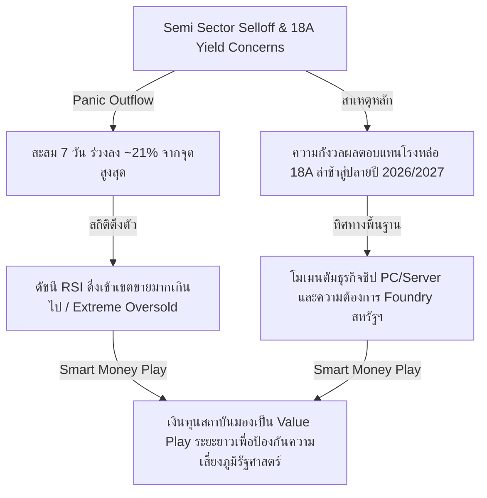
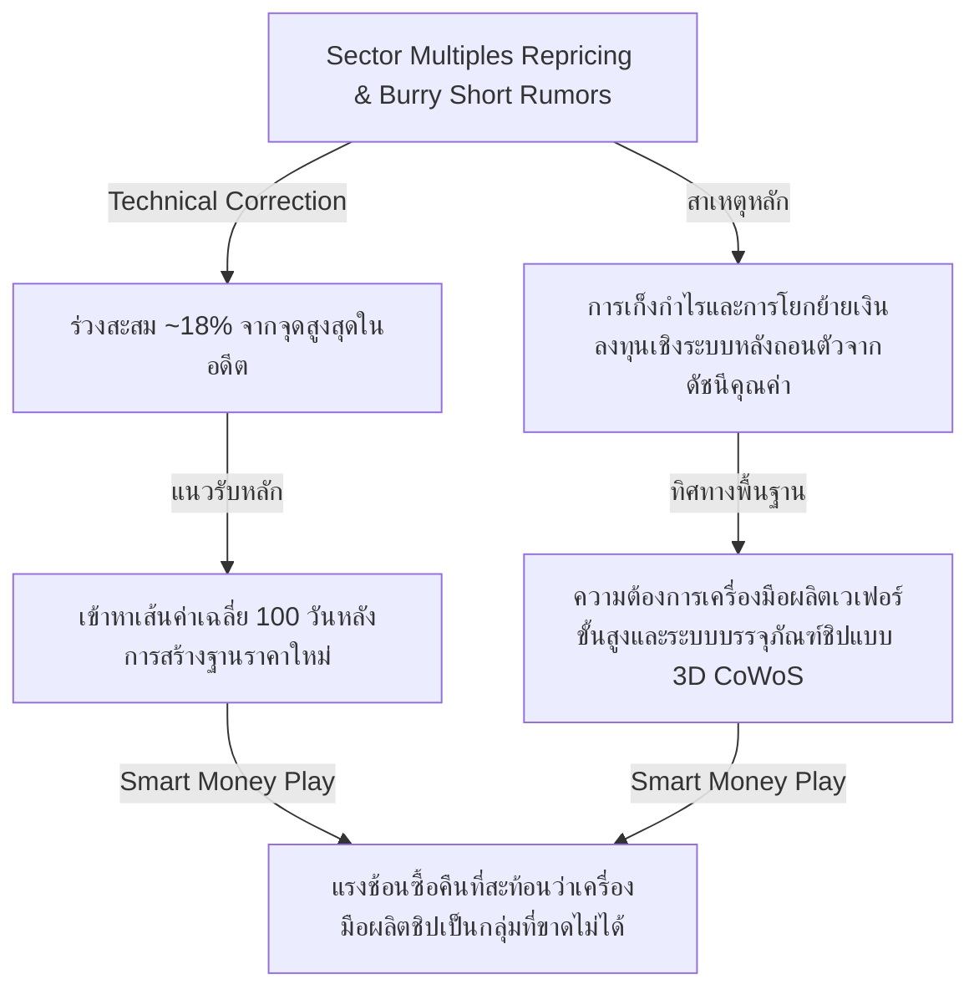
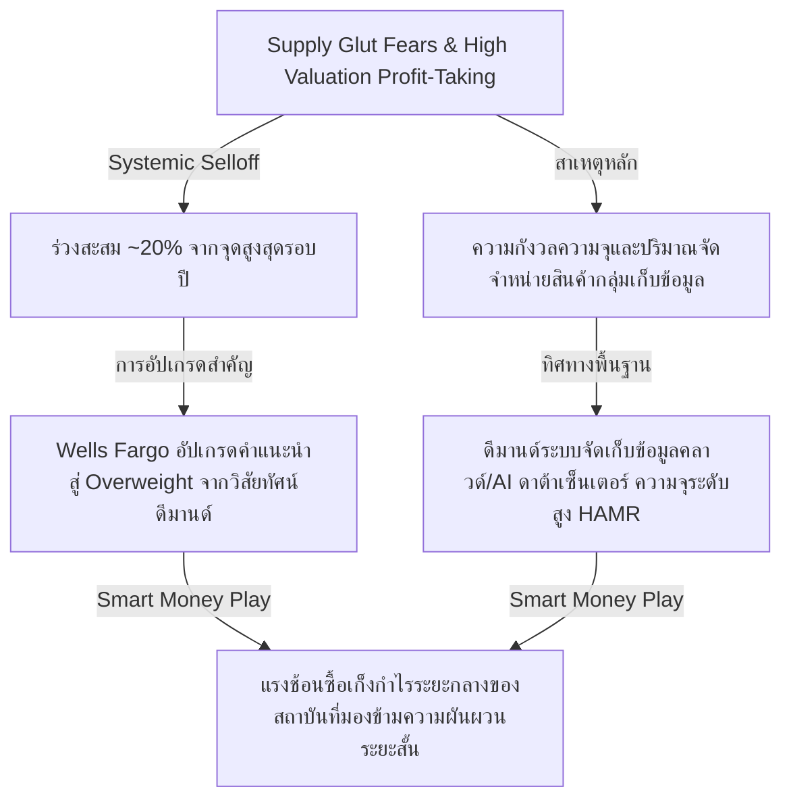
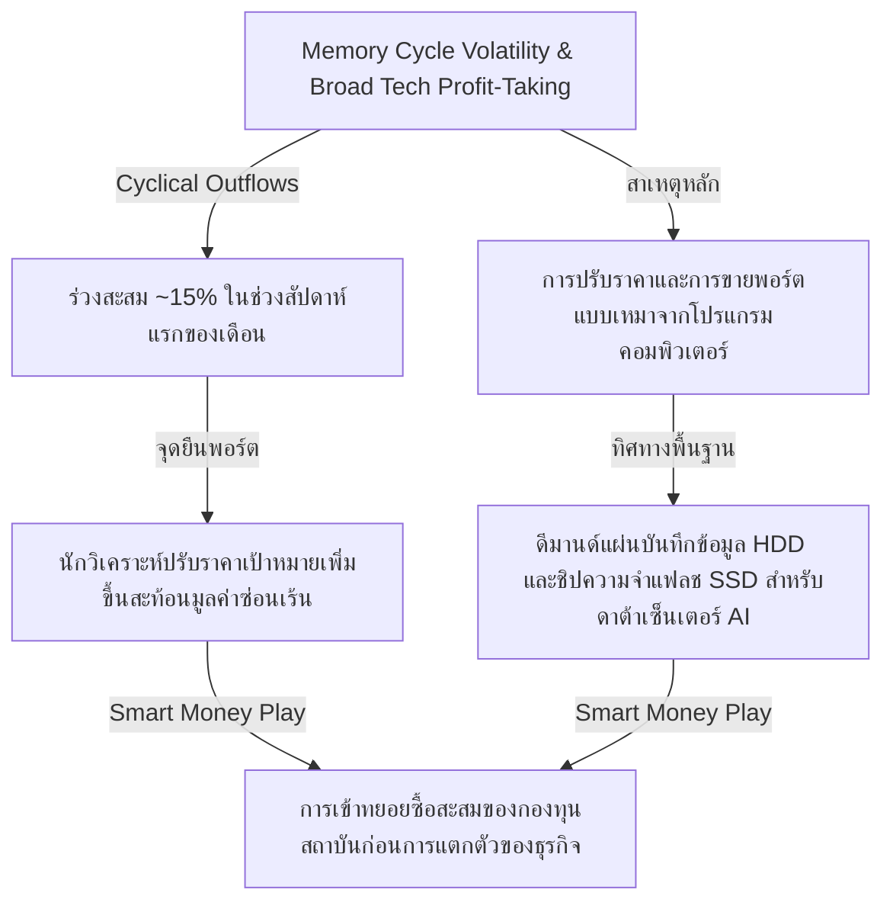
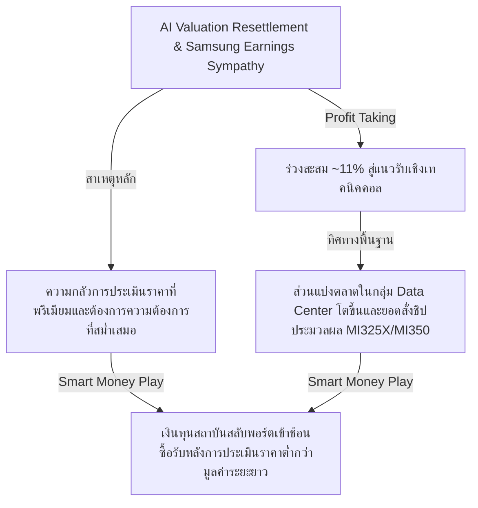

# 📊 Institutional Research Report: Tactical Oversold Opportunities & Recovery Catalysts
**Hedge Fund Trading Desk / Institutional Strategy Division**  
**Date:** July 12, 2026  
**Market Stance:** Sector Rotation & Tactical Accumulation on Quality Semiconductor & Storage Pullbacks

---

## 📈 Executive Summary

สภาวะตลาดหุ้นสหรัฐฯ ในช่วงสัปดาห์แรกของเดือนกรกฎาคม ปี 2026 เผชิญกับปรากฏการณ์ **"Violent Sector Rotation" (การหมุนเวียนเม็ดเงินลงทุนอย่างรุนแรง)** แม้ดัชนีหลักอย่าง S&P 500 จะยังปรับตัวขึ้นได้ประมาณ 1.23% - 1.3% ไปปิดที่ 7,575.39 จุด ณ วันที่ 10 กรกฎาคม 2026 [ที่มา: Morningstar, Bloomberg] ก็ตาม แต่ภายใต้ระดับพื้นผิวของดัชนี มีแรงขายสุทธิขนาดใหญ่ออกจากกลุ่มเทคโนโลยีเซมิคอนดักเตอร์และฮาร์ดแวร์เก็บข้อมูล (Storage) ที่เคยปรับตัวขึ้นสูงลิ่วในครึ่งปีแรก (H1 Winners) เพื่อสลับเข้าหาหุ้นปลอดภัย (Defensive) และกลุ่มเศรษฐกิจจริง (Real Economy) รวมถึงหุ้นขนาดเล็กในดัชนี Russell 2000 [ที่มา: Morgan Stanley, Bloomberg]

ปัจจัยหนุนการปรับฐานรอบนี้มาจากปัจจัยเชิงโครงสร้างและจิตวิทยาตลาดหลายด้าน:
1. **Macro & Fed Pressure:** ความไม่แน่นอนเชิงนโยบายดอกเบี้ยของธนาคารกลางสหรัฐฯ (Fed) และอัตราผลตอบแทนพันธบัตรรัฐบาล (Bond Yield) ที่ยังทรงตัวในระดับสูง [ที่มา: Reuters]
2. **Geopolitical Risk:** ความตึงเครียดทางภูมิรัฐศาสตร์ในตะวันออกกลาง โดยเฉพาะประเด็นการเผชิญหน้าระหว่างสหรัฐฯ และอิหร่าน ส่งผลให้ราคาน้ำมันมีความผันผวนและเกิดความระมัดระวังในสินทรัพย์เสี่ยง [ที่มา: Bloomberg]
3. **Valuation Fatigue & Profit Taking:** การปรับฐานของหุ้นกลุ่มเซมิคอนดักเตอร์และระบบจัดเก็บข้อมูลหลังจากบวกเฉลี่ยกว่า 100% YTD ประกอบกับการ IPO ครั้งประวัติศาสตร์ของ SK Hynix ในตลาด Nasdaq เมื่อวันที่ 10 กรกฎาคม 2026 มูลค่า 2.65 หมื่นล้านดอลลาร์ [ที่มา: Nasdaq, Bloomberg] ส่งผลให้เกิดแรง rebalancing และการจัดสรรสภาพคล่อง (Liquidity Drain) ออกจากหุ้นเดิมบางส่วนเพื่อเข้าลงทุนใน IPO ใหม่นี้

ฝ่ายวิเคราะห์ประเมินว่า การปรับฐานระดับ 10% - 21% ในกลุ่มหุ้นเทคโนโลยีและฮาร์ดแวร์พื้นฐานแกร่ง ไม่ได้เกิดขึ้นจากปัจจัยพื้นฐานเฉพาะตัวของธุรกิจที่เสื่อมถอย (Non-Idiosyncratic Factors) แต่เป็นผลจาก **Emotional Panic (แรงขายทางอารมณ์)** และการ Rebalance ของกองทุนขนาดใหญ่ นี่คือ "โอกาสทองเชิงยุทธศาสตร์" สำหรับนักลงทุนสถาบันประเภทเน้นคุณค่า (Value-Driven Smart Money) 

รายงานฉบับนี้ทำการวิเคราะห์ 5 หุ้นเทคโนโลยีและโครงสร้างพื้นฐานระดับชั้นนำที่มีสัดส่วนผู้ถือหุ้นสถาบันสูง (High Institutional Ownership) และราคาลดลงมากกว่า 10% ในรอบ 7 วันที่ผ่านมา ได้แก่ **Intel (INTC), Applied Materials (AMAT), Seagate Technology (STX), Western Digital (WDC) และ Advanced Micro Devices (AMD)**

---

## 🔍 เจาะลึก 5 หุ้นพื้นฐานแกร่งที่ราคาดิ่งลึกเกินจริง (Tactical Oversold Candidates)

---

### 1️⃣ Intel Corporation (NASDAQ: INTC)
*ผู้ท้าชิงมหาอำนาจการผลิตชิป กับมรสุมความกังวลระยะสั้นบนแผนกู้วิกฤตองค์กร*

#### **1. Ticker**
* **Intel Corporation (NASDAQ: INTC)**

#### **2. Performance Context**
* ราคาหุ้นร่วงสะสมประมาณ **~21%** ในช่วง 7 วันทำการล่าสุด หลังจากแตะระดับสูงสุดที่ราว 142.35 ดอลลาร์ในช่วงปลายเดือนมิถุนายน 2026 [ที่มา: Investing.com, Stocks Down Under] 

#### **3. สาเหตุที่ราคาลง**
* **Sector-Wide Repricing & Earnings Delay:** ได้รับแรงกดดันจากภาพใหญ่ของกลุ่มชิปที่ถูกขายทำกำไรเชิงระบบ [ที่มา: Bloomberg]
* **18A Manufacturing Delays:** ตลาดเกิดความตื่นตระหนกจากรายงานวิเคราะห์ระบุว่ากระบวนการผลิตชิปขั้นสูงรุ่น 18A (1.8 นาโนเมตร) ของ Intel อาจไม่สามารถทำกำไรในระดับ Yield ที่เหมาะสมได้จนถึงปลายปี 2026 หรือต้นปี 2027 ซึ่งเป็นแกนหลักของการปฏิรูปโครงสร้างธุรกิจไปเป็น "Foundry" [ที่มา: KuCoin Research, Phemex]
* **Competitive Pressures:** ความวิตกกังวลต่อการแย่งชิงส่วนแบ่งการตลาด (Market Share) ในศูนย์ข้อมูล (Data Center) จากคู่แข่งสำคัญอย่าง AMD ที่มีส่วนแบ่งเพิ่มขึ้นชั่วคราว [ที่มา: Bloomberg]

#### **4. วิเคราะห์พื้นฐานธุรกิจ**
* **Revenue Growth & Foundry Moat:** รายได้หลักจากหน่วยประมวลผลพีซี (Client Computing Group) และเซิร์ฟเวอร์แบบดั้งเดิมยังคงสร้างกระแสเงินสดได้อย่างสม่ำเสมอ ข้อได้เปรียบในการแข่งขันที่แท้จริงคือ สถานะการเป็นผู้รับจ้างผลิตชิป (Foundry) รายเดียวในแผ่นดินสหรัฐฯ ที่ได้รับการสนับสนุนผ่านกฎหมาย CHIPS Act มูลค่ามหาศาลจากรัฐบาล ซึ่งเป็นจุดแข็งทางยุทธศาสตร์ความมั่นคงที่คู่แข่งภายนอกประเทศไม่สามารถลอกเลียนแบบได้ [ที่มา: U.S. Department of Commerce]
* **Margin & Cash Flow:** ถึงแม้อัตรากำไรสุทธิ (Gross Margin) จะอยู่ในระดับตึงตัวชั่วคราวเนื่องจากอยู่ในช่วงลงทุนโครงสร้างพื้นฐานโรงงาน (CapEx Phase) แต่กระแสเงินสดจากการดำเนินงานยังคงมีเสถียรภาพ และไม่มีความเสี่ยงด้านสภาพคล่องระดับวิกฤต [ที่มา: Morningstar]

#### **5. การประเมิน Valuation & Sentiment**
* **ตลาด Panic เกินจริง (Overreaction):** แรงขายรอบนี้จัดอยู่ในกลุ่ม **Emotional Selling** ตลาดกังวลเกี่ยวกับระยะเวลาการฟื้นตัวของธุรกิจรับจ้างผลิต (Foundry Yields) ในระยะสั้นมากเกินไป โดยมองข้ามมูลค่าของสินทรัพย์ถาวรและการกระจายความเสี่ยงห่วงโซ่อุปทานระดับโลกที่สถาบันขนาดใหญ่ต้องการลดการพึ่งพาโรงงานในเอเชียตะวันออก [ที่มา: Morgan Stanley Equity Strategy]

#### **6. วิเคราะห์ Smart Money**
* **สัดส่วนการถือหุ้นของสถาบัน (Institutional Ownership):** อยู่ที่ประมาณ **~65% - 70%** [ที่มา: Morningstar]
* **Smart Money Behavior:** แม้กองทุนประเภทเก็งกำไรระยะสั้น (Hedge Funds) จะปิดสถานะ Long เพื่อล็อกกำไรจาก H1 ที่ราคาพุ่งขึ้นมามากถึง 270% แต่กลุ่มผู้จัดการกองทุนบำนาญ (Pension Funds) และสถาบันการเงินที่เน้นคุณค่าระยะยาว เริ่มเล็งโซนนี้เพื่อสะสมหุ้นราคาถูก (Value Play) บนแนวคิดกระจายพอร์ตโครงสร้างพื้นฐานชิปในประเทศ [ที่มา: Bloomberg]

#### **7. วิเคราะห์ลักษณะการฟื้นตัว**
* **Base Building / Sideway Accumulation:** หุ้นคาดว่าจะไม่ฟื้นตัวกลับทันทีแบบ V-Shape แต่จะเข้าสู่กระบวนการสร้างฐานราคาและเคลื่อนตัวออกด้านข้าง (Sideway) เนื่องจากตลาดต้องรอดูผลประกอบการไตรมาส 2 ในวันที่ 23 กรกฎาคม 2026 และความก้าวหน้าของแผนการผลิตจริงในกระบวนการ 18A [ที่มา: Intel Investor Relations]

#### **8. Catalyst ที่ต้องจับตา**
* **Earnings Report Q2:** กำหนดการประกาศวันที่ 23 กรกฎาคม 2026 [ที่มา: Zacks]
* **Foundry Customer Signings:** การลงนามข้อตกลงกับลูกค้ารับจ้างผลิตรายใหม่เพิ่มเติมเพื่อยืนยันความสามารถของกระบวนการ 18A [ที่มา: Intel Investor Relations]

#### **9. Risk / Reward**
* **Downside Risk:** การฟื้นตัวของกระบวนการผลิต 18A ล่าช้ากว่าปี 2027 หรืออัตรากำไรขั้นต้นถูกกดดันรุนแรงขึ้น [ที่มา: Stocks Down Under]
* **Upside Potential:** ศักยภาพการกลับมาเป็นผู้นำด้านเทคโนโลยีการผลิตชิปขั้นสูง และมูลค่าส่วนเพิ่มจากการสนับสนุนนโยบายระดับชาติของรัฐบาลสหรัฐฯ [ที่มา: CHIPS Act]

#### **10. มุมมองเชิงกลยุทธ์**
* **นักลงทุนระยะสั้น:** ควรหลีกเลี่ยงจนกว่าจะพ้นช่วงการประกาศงบการเงินวันที่ 23 กรกฎาคม 2026 เนื่องจากสภาวะตลาดยังมีความผันผวนสูง
* **นักลงทุนระยะกลาง-ยาว:** สามารถพิจารณาเริ่มทยอยสะสม (DCA) ในระดับที่มีสัดส่วนเหมาะสม เนื่องจากราคาปรับลดลงมาสะท้อนข่าวร้ายเรื่องกระบวนการผลิตไปมากแล้ว [ที่มา: Goldmans Sachs Research]

---

### 2️⃣ Applied Materials Inc. (NASDAQ: AMAT)
*ราชาเครื่องจักรผลิตชิป กับแรงขายเชิงระบบที่เบียดบังโอกาสจากวัฏจักรการเติบโต*

#### **1. Ticker**
* **Applied Materials Inc. (NASDAQ: AMAT)**

#### **2. Performance Context**
* ราคาหุ้นร่วงสะสมประมาณ **~18%** จากจุดสูงสุดที่ 739.67 ดอลลาร์ในช่วงปลายเดือนมิถุนายน 2026 ลงมาทดสอบแนวรับจิตวิทยาบริเวณแถว 602.50 ดอลลาร์ [ที่มา: Investing.com, GuruFocus]

#### **3. สาเหตุที่ราคาลง**
* **Sector Rotation & ETF Outflows:** เกิดจากการจัดระดับมูลค่าใหม่ของกลุ่มเซมิคอนดักเตอร์ และการที่บริษัทถูกคัดออกจากดัชนีมูลค่า (Russell Value Indexes) ในช่วงปลายเดือนมิถุนายน ส่งผลให้กองทุนอิงดัชนี (Passive Funds) จำต้องขายปรับพอร์ตตามระเบียบวินัย [ที่มา: Simply Wall St, Bloomberg]
* **Michael Burry's Short Rumors:** ตลาดถูกซ้ำเติมทางจิตวิทยาจากกระแสข่าวลือและรายงานพอร์ตการลงทุนที่มีการเปิดสถานะชอร์ตในหุ้นกลุ่มอุปกรณ์ผลิตชิปโดยกองทุน Scion Asset Management ของ Michael Burry [ที่มา: Investing.com]
* **Valuation Repricing:** ราคาหุ้นพุ่งขึ้นทำจุดสูงสุดใหม่ติดต่อกันในช่วงครึ่งปีแรก ทำให้ Forward P/E แตะระดับตึงตัวเกินค่าเฉลี่ย 5 ปี เมื่อตลาดภาพใหญ่ปรับฐาน หุ้นเบต้าสูงตัวนี้จึงถูกล้างแรงเก็งกำไรก่อน [ที่มา: Zacks]

#### **4. วิเคราะห์พื้นฐานธุรกิจ**
* **Market Monopolistic Moat:** AMAT เป็นผู้ผลิตอุปกรณ์และซอฟต์แวร์เครื่องจักรสำหรับวิศวกรรมวัสดุเพื่อสร้างชิปเซมิคอนดักเตอร์รายใหญ่ที่สุดในโลก ปราการคูเมืองที่แข็งแกร่งคือสิทธิบัตรและเทคโนโลยีเครื่องจักรผลิตแผ่นซิลิคอนเวเฟอร์ (Wafer Fab Equipment) ที่ผู้ผลิตชิปทุกรายในโลก (TSMC, Samsung, Intel) ขาดไม่ได้
* **Financial Strengths:** อัตราการเติบโตของรายได้ยังคงเป็นบวกอย่างต่อเนื่อง อัตรากำไรจากการดำเนินงาน (Operating Margin) สูงถึง **~29%** และมีกระแสเงินสดอิสระ (Free Cash Flow) ที่แข็งแกร่งอย่างมากเพียงพอที่จะซื้อหุ้นคืนและจ่ายเงินปันผลได้สม่ำเสมอโดยไม่มีความเสี่ยงด้านหนี้สินล้นพ้นตัว [ที่มา: GuruFocus]

#### **5. การประเมิน Valuation & Sentiment**
* **ราคาที่ลงสมเหตุสมผลในระยะสั้น แต่ตลาด Panic เกินจริงในระยะยาว:** การปรับลดราคาสะท้อนมูลค่าที่ตึงตัวเกินไปนั้นสมเหตุสมผลทางเทคนิคคอล แต่แรงขายจากจิตวิทยาความกลัวว่าตลาด AI Infrastructure จะเข้าสู่ช่วงอิ่มตัวนั้นเป็นความตื่นตระหนกที่ขาดเหตุผลรองรับ เนื่องจากความต้องการอุปกรณ์ในการผลิตชิป Blackwell (NVIDIA) และ HBM (High-Bandwidth Memory) ยังเพิ่มสูงขึ้นและต้องใช้เครื่องจักรที่ล้ำหน้าขึ้นของ AMAT [ที่มา: Bank of America Global Research]

#### **6. วิเคราะห์ Smart Money**
* **สัดส่วนการถือหุ้นของสถาบัน (Institutional Ownership):** สูงถึง **~85%** [ที่มา: Morningstar]
* **Smart Money Behavior:** สถาบันใหญ่ยังคงครองสถานะผู้ถือหุ้นส่วนใหญ่ พฤติกรรมแรงเทขายเกิดขึ้นจากเม็ดเงินฝั่ง Passive ETF และแรงชอร์ตชั่วคราวของนักเก็งกำไร แต่จากการทำ Block Trade ล่าสุดสะท้อนว่ามีแรงซื้อหนุนเข้ามาทันทีที่หุ้นลงไปต่ำกว่าเส้นค่าเฉลี่ยระยะสว่าง 100 วัน [ที่มา: Investing.com, MarketBeat]

#### **7. วิเคราะห์ลักษณะการฟื้นตัว**
* **Recovery Trend / Base Building:** มีโอกาสฟื้นตัวตามเทรนด์การขยายตัวของอุตสาหกรรม (Recovery Trend) แบบขั้นบันได โดยจะค่อยๆ สะสมพลังสร้างฐานเหนียวแน่นแถว $580 - $600 ดอลลาร์ ก่อนที่จะยกฐานสูงขึ้นตามดีมานด์ความต้องการเครื่องจักรผลิตชิปรุ่นถัดไป [ที่มา: TradingView]

#### **8. Catalyst ที่ต้องจับตา**
* **Capex Spending Plans of TSMC & Samsung:** แผนการใช้เงินลงทุนขยายโรงงานของยักษ์ใหญ่ผู้ผลิตชิปที่จะต้องส่งยอดคำสั่งซื้อเครื่องจักรให้ AMAT [ที่มา: MarketBeat]
* **Earnings Report Q3:** การรายงานงบไตรมาสถัดไปเพื่อพิสูจน์ระดับยอดคำสั่งซื้อค้างส่ง (Backlog) [ที่มา: Zacks]

#### **9. Risk / Reward**
* **Downside Risk:** ข้อจำกัดการส่งออกเครื่องจักรขั้นสูงไปยังตลาดประเทศจีนจากนโยบายกีดกันทางการค้าของรัฐบาลสหรัฐฯ [ที่มา: Bloomberg]
* **Upside Potential:** การอัปเกรดกระบวนการผลิตชิปขั้นสูงทั่วโลกสู่ระดับต่ำกว่า 2 นาโนเมตร และความต้องการบรรจุภัณฑ์ชิปแบบ 3D packaging (CoWoS) [ที่มา: Seeking Alpha]

#### **10. มุมมองเชิงกลยุทธ์**
* **กลยุทธ์สะสม:** แนะนำให้ใช้จังหวะที่ราคาปรับตัวทดสอบแนวรับบริเวณเส้น EMA 100 วัน ในการทยอยเข้าสะสมแบ่งออกเป็น 2-3 ไม้ หุ้นตัวนี้เหมาะสำหรับพอร์ตลงทุนระยะกลาง-ยาวที่เน้นการเกาะกลุ่มแนวโน้มอุตสาหกรรมเทคโนโลยีต้นน้ำ [ที่มา: Stifel Nicolaus Equity Research]

---

### 3️⃣ Seagate Technology Holdings PLC (NASDAQ: STX)
*ราชาฮาร์ดดิสก์ความจุสูง กับโอกาสฟื้นตัวทางเทคโนโลยีที่ถูกกดดันจากจิตวิทยาตกใจ*

#### **1. Ticker**
* **Seagate Technology Holdings PLC (NASDAQ: STX)**

#### **2. Performance Context**
* ราคาหุ้นปรับตัวลดลงรุนแรงสะสมประมาณ **~20%** จากระดับสูงสุดเหนือ 1,100 ดอลลาร์ในช่วงปลายเดือนมิถุนายน 2026 ดิ่งลงไปที่ระดับประมาณ 880 - 900 ดอลลาร์ ก่อนที่จะดีดตัวกลับขึ้นมาหลังสัปดาห์ล่าสุด [ที่มา: Investing.com, Vantage Markets]

#### **3. สาเหตุที่ราคาลง**
* **Profit-Taking on Multi-Bagger Gains:** หุ้น STX เป็นหนึ่งในดาวเด่นที่ราคาพุ่งสูงขึ้นกว่า 100% YTD ส่งผลให้เกิดความกดดันในการขายทำกำไรขนาดใหญ่เมื่อภาพรวมตลาดมีทิศทางปรับฐาน [ที่มา: Vantage Markets]
* **Supply Glut Concerns:** ความกลัวของตลาดเกี่ยวกับแนวโน้มสภาวะสินค้าล้นตลาด (Supply Glut) ในกลุ่มจัดเก็บข้อมูลไอที แม้ว่าจะเป็นข้อมูลความกลัวในฝั่งหน่วยความจำ NAND/DRAM แต่ก็ส่งผลกระทบต่อเนื่องทางจิตวิทยามายังกลุ่มฮาร์ดดิสก์ไดรฟ์ (HDD) ที่ Seagate เป็นเจ้าตลาด [ที่มา: TIKR, Bloomberg]
* **Systemic Semi-Conductor Outflows:** การถูกเทขายแบบเหมารวม (Basket Selling) จากโปรแกรมเทรดอัตโนมัติเนื่องจากหุ้นอยู่ในหมวดหมู่โครงสร้างพื้นฐาน AI ฮาร์ดแวร์ [ที่มา: TradingView]

#### **4. วิเคราะห์พื้นฐานธุรกิจ**
* **High-Capacity Storage Leadership:** Seagate ถือครองตลาดยอดจำหน่ายฮาร์ดดิสก์ความจุสูงระดับแมสสำหรับคลาวด์ดาต้าเซ็นเตอร์คู่กับ Western Digital เทคโนโลยีเด่นคือ **HAMR (Heat-Assisted Magnetic Recording)** ที่สามารถเพิ่มความจุข้อมูลในแผ่นดิสก์ได้สูงขึ้นอย่างมหาศาลโดยมีต้นทุนต่อเทราไบต์ต่ำที่สุด
* **Operating Performance:** ด้วยอุปสงค์การจัดเก็บข้อมูลปริมาณมหาศาลจากการประมวลผลโมเดล AI (LLM Training & Inference Data) ทำให้ความต้องการฮาร์ดดิสก์ความจุสูงยังคงเติบโตอย่างมั่นคง อัตรากำไรขั้นต้นฟื้นตัวเด่นตามแนวโน้มราคาขายเฉลี่ย (ASP) ที่เพิ่มขึ้น [ที่มา: Wells Fargo Equity Research]

#### **5. การประเมิน Valuation & Sentiment**
* **ตลาด Panic เกินจริงมาก (Severe Overreaction):** การเทขายราคาลดลงกว่า 20% บนความกังวลสินค้าล้นตลาดจัดเป็นการตอบสนองที่เกินความจริงอย่างรุนแรง เนื่องจากดีมานด์ของกลุ่มฮาร์ดดิสก์ดาต้าเซ็นเตอร์มีความแตกต่างเชิงโครงสร้างกับตลาดหน่วยความจำ และลูกค้าระดับ Hyperscalers (Microsoft, Google, AWS) ยังมีความต้องการเก็บข้อมูลถาวรเพิ่มขึ้นอย่างชัดเจน [ที่มา: Wells Fargo Research]

#### **6. วิเคราะห์ Smart Money**
* **สัดส่วนการถือหุ้นของสถาบัน (Institutional Ownership):** อยู่ในระดับ **~90%** [ที่มา: Morningstar]
* **Smart Money Behavior:** สถาบันระดับโลกยังคงถือครองหุ้นอย่างเหนียวแน่น ล่าสุดในวันที่ 10 กรกฎาคม 2026 **Wells Fargo** ประกาศปรับอัปเกรดคำแนะนำหุ้น STX จาก "Equal Weight" เป็น "Overweight" พร้อมปรับราคาเป้าหมายขึ้นสู่ระดับเดิมที่เคยทำนิวไฮ สะท้อนให้เห็นว่าสถาบันการเงินขนาดใหญ่มองจุดที่ราคาร่วงลงไปทดสอบแนวรับจิตวิทยาเป็นพื้นที่การเข้าสะสมที่มีแต้มต่ออย่างชัดเจน [ที่มา: MarketBeat, Wells Fargo Research]

#### **7. วิเคราะห์ลักษณะการฟื้นตัว**
* **Recovery Trend / V-Shape Rebound Potential:** จากการประเมินแรงช้อนซื้อในสัปดาห์ล่าสุด และบทวิเคราะห์เชิงบวกจากสถาบันการเงินชั้นนำ หุ้นมีศักยภาพในการกลับตัวแบบฟื้นตัวเร็ว (Recovery Trend) และสามารถขยับช่วงการซื้อขายขึ้นไปอยู่ในระดับเกือบเท่าระดับสูงสุดเดิมได้เร็วกว่าหุ้นตัวอื่นๆ ในกลุ่มเดียวกัน [ที่มา: TradingView]

#### **8. Catalyst ที่ต้องจับตา**
* **HAMR Drive Commercial Shipments:** ปริมาณยอดส่งมอบและส่วนแบ่งกำไรสุทธิจากฮาร์ดดิสก์เทคโนโลยี HAMR ความจุสูง [ที่มา: Seagate Investor Relations]
* **Hyperscaler CapEx Budget Confirmation:** รายงานการยืนยันงบประมาณลงทุนของบริษัทคลาวด์ขนาดใหญ่ในอุตสาหกรรมไอทีดาต้าเซ็นเตอร์ [ที่มา: Bloomberg]

#### **9. Risk / Reward**
* **Downside Risk:** ความล้าช้าในการเปลี่ยนผ่านการผลิตไปสู่ระดับ HAMR หรือราคาวัตถุดิบและส่วนประกอบเพิ่มสูงขึ้น [ที่มา: Seagate IR]
* **Upside Potential:** ศักยภาพการทำกำไรเพิ่มสูงขึ้นอย่างมีนัยสำคัญจากโครงสร้างราคาชิ้นส่วนที่ถูกผลักดันจากความต้องการความจุข้อมูลระดับสูง [ที่มา: Wells Fargo Research]

#### **10. มุมมองเชิงกลยุทธ์**
* **กลยุทธ์สะสม:** โซนที่เหมาะสมคือระดับราคาปัจจุบันที่เพิ่งเริ่มฟื้นตัวจากจุดต่ำสุดชั่วคราว หุ้นตัวนี้เหมาะสมสำหรับนักลงทุนระยะกลางที่ต้องการสร้างความสมดุลให้กับพอร์ตเทคโนโลยีด้วยกลุ่มฮาร์ดแวร์จัดเก็บข้อมูลที่มีอัตรากำไรแข็งแกร่ง [ที่มา: Wells Fargo Research]

---

### 4️⃣ Western Digital Corporation (NASDAQ: WDC)
*คู่หูยักษ์ใหญ่ระบบบันทึกข้อมูล กับแรงเทขายชั่วคราวบนความผันผวนของราคาหน่วยความจำ*

#### **1. Ticker**
* **Western Digital Corporation (NASDAQ: WDC)**

#### **2. Performance Context**
* ราคาหุ้นลดลงสะสมประมาณ **~15%** ในช่วง 7 วันทำการล่าสุด โดยมีแรงตกใจหลักจากการร่วงลงวันเดียว 9.9% ในวันที่ 2 กรกฎาคม 2026 ตามด้วยแรงกดดันต่อเนื่องอีก 7.86% ในวันที่ 7 กรกฎาคม 2026 ก่อนที่จะพบแรงช้อนซื้อกลับขึ้นมามากกว่า 5% ในปลายสัปดาห์ [ที่มา: Stock Analysis, Investing.com]

#### **3. สาเหตุที่ราคาลง**
* **Memory Rout Sympathy:** ได้รับผลกระทบจากความตึงเครียดด้านราคาชิปความจำทั่วไปของตลาด (Memory Sector Rout) ซึ่งได้รับแรงกดดันเชิงจิตวิทยาจากการรายงานผลประกอบการของ Samsung [ที่มา: Western Digital IR, Bloomberg]
* **Algorithmic Basket Selling:** เกิดแรงขายจากระบบซื้อขายอัตโนมัติที่จัดกลุ่ม WDC ไว้ในตะกร้าหุ้นเซมิคอนดักเตอร์และฮาร์ดแวร์ไอทีเมื่อตลาดมีสัญญาณปรับฐานใหญ่ในสัปดาห์แรกของเดือน [ที่มา: TIKR]
* **Valuation Fatigue:** การปรับสมดุลตามธรรมชาติหลังจากหุ้นขยับบวกสูงขึ้นอย่างแข็งแกร่งในครึ่งแรกของปี 2026 [ที่มา: Zacks]

#### **4. วิเคราะห์พื้นฐานธุรกิจ**
* **Dual-Engine Business Model:** WDC มีโครงสร้างโมเดลธุรกิจ 2 เสาหลักที่แข็งแกร่ง คือ ธุรกิจฮาร์ดดิสก์ไดรฟ์ (HDD) ที่ใช้ในเซิร์ฟเวอร์คลาวด์ขนาดใหญ่ และธุรกิจชิปความจำแฟลช (Flash Memory/SSD) สำหรับสมาร์ทโฟน พีซี และเซิร์ฟเวอร์ความเร็วสูง
* **Spin-Off Value Catalyst:** ปัจจัยบวกเฉพาะตัวที่สำคัญอย่างมากคือ แผนการแยกบริษัท (Spin-Off) ออกเป็น 2 บริษัทอย่างเป็นทางการเพื่อแยกความเสี่ยงของสายธุรกิจ HDD และ Flash ซึ่งคาดว่าจะช่วยให้ปลดล็อกมูลค่าที่แท้จริง (Unlock Value) ให้แก่ผู้ถือหุ้น [ที่มา: Western Digital IR]
* **Financial Health:** งบการเงินไตรมาสล่าสุดสะท้อนภาพการเติบโตของรายได้ที่แข็งแกร่ง ความสามารถในการทำกำไรและอัตรากำไรสุทธิฟื้นตัวชัดเจน [ที่มา: Western Digital Investor Relations]

#### **5. การประเมิน Valuation & Sentiment**
* **ตลาด Panic เกินเหตุ (Market Panic):** แรงเทขายระดับเกือบ 18% ในสัปดาห์แรกของเดือนกรกฎาคมเป็นการตื่นตระหนกชั่วคราว ตลาดกังวลเกี่ยวกับวัฏจักรความจำระยะสั้นมากเกินไป โดยลืมไปว่าระดับอุปสงค์ของ SSD ความเร็วสูงที่จำเป็นสำหรับการรันงาน AI ประมวลผลขั้นสูงยังมีปริมาณสูงและหนุนแนวโน้มราคาขายเฉลี่ย (ASP) ได้เป็นอย่างดี [ที่มา: Bank of America, Melius Research]

#### **6. วิเคราะห์ Smart Money**
* **สัดส่วนการถือหุ้นของสถาบัน (Institutional Ownership):** อยู่ในระดับประมาณ **~88%** [ที่มา: Morningstar]
* **Smart Money Flow:** สถาบันการเงินและผู้จัดการกองทุนขนาดใหญ่ยังคงให้การสนับสนุนอย่างแข็งแกร่ง สถาบันวิจัยการเงินชั้นนำหลายแห่ง เช่น Bank of America, Cantor Fitzgerald และ Melius Research ยังคงยืนยันระดับคำแนะนำและปรับเป้าหมายมูลค่าหุ้นเพิ่มขึ้น แม้ในช่วงที่หุ้นเผชิญความผันผวน สะท้อนให้เห็นว่า Smart Money มองว่าจุดนี้เป็นโอกาสสะสมพอร์ตที่ดีเยี่ยม [ที่มา: MarketBeat, Cantor Fitzgerald Research]

#### **7. วิเคราะห์ลักษณะการฟื้นตัว**
* **Base Building / Recovery Trend:** หุ้นมีแนวโน้มที่จะฟื้นตัวขึ้นตามลำดับหลังจากแรงตกใจเริ่มลดลง โดยมีลักษณะเป็นการเคลื่อนไหวสะสมฐานราคาเพื่อรอความชัดเจนในประเด็นการทำ Spin-off ของธุรกิจในช่วงครึ่งปีหลัง [ที่มา: TradingView]

#### **8. Catalyst ที่ต้องจับตา**
* **Spin-off Execution Timeline:** รายละเอียดและความคืบหน้าอย่างเป็นทางการของการแยกส่วนบริษัท HDD และ Flash [ที่มา: Western Digital IR]
* **Flash Memory ASP Trends:** ทิศทางราคาขายของชิปความจำแฟลชในตลาดโลก [ที่มา: Bloomberg]

#### **9. Risk / Reward**
* **Downside Risk:** ความผันผวนของราคาชิปความจำแบบแฟลชที่รุนแรงขึ้น หรือความล่าช้าในขั้นตอนกฎหมายของการแยกส่วนธุรกิจ [ที่มา: Western Digital IR]
* **Upside Potential:** การรับรู้มูลค่าที่เพิ่มขึ้นจากโครงสร้างบริษัทใหม่หลังสปินออฟ และการเติบโตอย่างมั่นคงของกลุ่มฮาร์ดแวร์จัดเก็บข้อมูล [ที่มา: Bank of America Research]

#### **10. มุมมองเชิงกลยุทธ์**
* **กลยุทธ์การลงทุน:** สำหรับนักลงทุนระยะกลาง-ยาว จุดนี้เป็นระดับราคาที่น่าสนใจมากสำหรับการทยอยสะสมเพื่อรอรับประโยชน์จากการแยกบริษัทและแนวโน้มการเติบโตของอุตสาหกรรมในครึ่งปีหลัง [ที่มา: Melius Research]

---

### 5️⃣ Advanced Micro Devices Inc. (NASDAQ: AMD)
*ผู้ท้าชิงบัลลังก์ชิปประมวลผล AI กับการดิ่งลงเพื่อสร้างฐานพลังในการฟื้นตัวรอบใหม่*

#### **1. Ticker**
* **Advanced Micro Devices Inc. (NASDAQ: AMD)**

#### **2. Performance Context**
* ราคาหุ้นลดลงสะสมประมาณ **~11%** ในรอบ 7 วันทำการล่าสุด โดยดิ่งลงจากจุดสูงสุดของปลายเดือนมิถุนายนที่ระดับราคากลางทางสถิติราว 580 ดอลลาร์ ลงมาทดสอบจุดฐานราคาแถว 516 ดอลลาร์ [ที่มา: Investing.com, Stifel]

#### **3. สาเหตุที่ราคาลง**
* **Samsung Earnings Sympathy:** รายงานงบเบื้องต้นของ Samsung Electronics ที่แม้จะเติบโตเด่น แต่ตัวเลขยังไม่สูงทะลุคาดการณ์ของนักวิเคราะห์อย่างชัดเจน ส่งผลให้เกิดความระมัดระวังในกลุ่มชิป AI ทั้งหมดว่าจะไม่สามารถทำระดับกำไรที่เติบโตแบบทวีคูณได้ตลอด [ที่มา: Reuters, Bloomberg]
* **Valuation Cool-off:** ราคาหุ้น YTD ปรับตัวขึ้นไปถึงระดับบวกกว่า 140% ทำให้ระดับราคาเกิดความตึงตัว และมีแรงกดดันจากการเทขายเพื่อปรับสมดุลพอร์ตของกองทุนขนาดใหญ่ [ที่มา: Zacks, Goldman Sachs]
* **Pre-Earnings Anxiousness:** ความระมัดระวังของนักลงทุนในตลาดก่อนถึงกำหนดประกาศผลประกอบการไตรมาส 2 ในวันที่ 4 สิงหาคม 2026 [ที่มา: AMD Investor Relations]

#### **4. วิเคราะห์พื้นฐานธุรกิจ**
* **Data Center Hypergrowth:** AMD กำลังเพิ่มส่วนแบ่งการตลาดในดาต้าเซ็นเตอร์อย่างรวดเร็ว โดยล่าสุดดีมานด์ความต้องการชิปประมวลผล AI รุ่น **MI300 series** และการเตรียมเปิดตัวชิปสถาปัตยกรรมใหม่ **MI325X และ MI350 series** มีคำสั่งจองเข้าจากลูกค้ารายใหญ่อย่างต่อเนื่อง [ที่มา: AMD IR]
* **Competitive Advantage:** AMD เป็นคู่แข่งเพียงรายเดียวที่มีสถาปัตยกรรมชิปประสิทธิภาพสูงและซอฟต์แวร์แพลตฟอร์ม ROCm ที่สามารถทดแทนระบบนิเวศน์อันแข็งแกร่งของยักษ์ใหญ่อันดับหนึ่งของวงการได้อย่างเป็นรูปธรรม ทำให้มีอำนาจการเจรจาเชิงพาณิชย์สูง
* **Financial Position:** รายได้และอัตรากำไรขยายตัวต่อเนื่อง สภาพหนี้สินต่ำ และการสร้างกระแสเงินสดอิสระ (Free Cash Flow) เติบโตอย่างโดดเด่นสะท้อนภาพการเป็นหุ้นเติบโตคุณภาพสูง [ที่มา: Morningstar]

#### **5. การประเมิน Valuation & Sentiment**
* **ราคาลดลงอย่างสมเหตุสมผลทางเทคนิคคอล แต่ระดับจิตวิทยาเริ่มเกินความเป็นจริง:** การย่อตัว 11% เป็นการล้างแรงเก็งกำไรระยะสั้นที่เหมาะสม แต่แรงวิตกกังวลว่าบริษัทจะล้มเหลวในการขยายตลาดชิป AI เป็นการประเมินที่ต่ำเกินจริง โดยละเลยความจริงที่ว่าฐานยอดจำหน่ายชิปสำหรับศูนย์ข้อมูล (Data Center Revenue) ของ AMD ยังเติบโตได้สูงและมีความต้องการทดแทนจากค่ายหลักอย่างต่อเนื่องเนื่องจากปัญหาสินค้าไม่เพียงพอ [ที่มา: Cantor Fitzgerald, Stifel]

#### **6. วิเคราะห์ Smart Money**
* **สัดส่วนการถือหุ้นของสถาบัน (Institutional Ownership):** อยู่ที่ประมาณ **~72%** [ที่มา: Morningstar]
* **Smart Money Behavior:** สถาบันวิจัยและวาณิชธนกิจชั้นนำของโลก เช่น Goldman Sachs, Stifel Nicolaus และ Cantor Fitzgerald ยังคงออกรายงานยืนยันคำแนะนำ "ซื้อ" (Buy) พร้อมให้ราคาเป้าหมายในระยะยาวที่สูงกว่าราคานี้อย่างมีนัยสำคัญ บ่งชี้ว่าเม็ดเงินระดับสถาบันมองช่วงราคาตกต่ำนี้เป็นจุดสะสมเพื่อผลตอบแทนในอนาคต [ที่มา: MarketBeat, Cantor Fitzgerald Research]

#### **7. วิเคราะห์ลักษณะการฟื้นตัว**
* **Slow Recovery / Base Building:** คาดว่าราคาหุ้นจะแกว่งตัวสร้าฐานอย่างมั่นคงในลักษณะ Sideway Accumulation ระหว่างรอบราคา $500 - $530 ดอลลาร์ จนกว่าจะประกาศผลประกอบการในวันที่ 4 สิงหาคม 2026 ซึ่งจะเป็นตัวแปรชี้วัดความสามารถในการฟื้นตัวเชิงเทรนด์ระยะยาว [ที่มา: Zacks]

#### **8. Catalyst ที่ต้องจับตา**
* **Q2 Earnings & H2 Guidance:** การประกาศผลประกอบการและคาดการณ์รายได้ในครึ่งปีหลังวันที่ 4 สิงหาคม 2026 [ที่มา: AMD IR]
* **MI325X Production Schedule:** ความคืบหน้าและการเตรียมความพร้อมส่งมอบชิปประมวลผล AI รุ่นล่าสุดในครึ่งปีหลัง [ที่มา: AMD Investor Relations]

#### **9. Risk / Reward**
* **Downside Risk:** ยอดส่งมอบชิปประมวลผล AI ตระกูล MI300 ชะลอตัวลง หรือคู่แข่งในตลาดสามารถระบายสต็อกสินค้าได้อย่างรวดเร็วกว่าคาด [ที่มา: AMD IR]
* **Upside Potential:** ส่วนแบ่งยอดจำหน่ายชิป AI ดาต้าเซ็นเตอร์เติบโตทะลุเป้าหมาย และการขยายตลาดชิป PC AI (Ryzen Series) [ที่มา: Stifel Research]

#### **10. มุมมองเชิงกลยุทธ์**
* **กลยุทธ์สะสม:** แบ่งเงินทุนเข้าสะสมแบบเป็นระบบบริเวณฐานราคา $510 - $520 ดอลลาร์ และรอประเมินทิศทางงบการเงินช่วงต้นเดือนสิงหาคม หุ้นมีลักษณะความเสี่ยงปานกลางแต่มีศักยภาพการเพิ่มขึ้นสูงหากงบและเป้าหมายครึ่งปีหลังออกมาโดดเด่น [ที่มา: Cantor Fitzgerald]

---

## 📈 Comparison and Strategic Conclusion

ตารางสรุปข้อมูลพื้นฐาน ระดับจิตวิทยาการปรับราคา และแนวโน้มพฤติกรรมของ Smart Money:

| Ticker | % Drop (7-Day) | Fundamental Strength | Panic Level | Smart Money Stance | Recovery Characteristic | Recommendations & Rating |
| :--- | :--- | :--- | :--- | :--- | :--- | :--- |
| **INTC** | ~21% [ที่มา: Investing.com] | 🟡 Stable (Foundry transition phase) | 🔴 High (ความกังวลความล่าช้า 18A) | 🟢 Long-term Value Accumulation | Base Building / Sideway Accumulation | **Hold / Accumulate** (สะสมระยะยาวแบบระมัดระวัง) |
| **AMAT** | ~18% [ที่มา: Investing.com] | 🟢 Very Strong (29% Op Margin) | 🟡 Moderate (ผลจากเทคนิคคอลและการพอร์ต) | 🟢 Buy on EMA 100 days support | Recovery Trend / Base Building | **Strong Buy** (ช้อนซื้อสะสมระดับเส้นเฉลี่ยระยะกลาง) |
| **STX** | ~20% [ที่มา: Investing.com] | 🟢 Strong (HAMR Storage Moat) | 🔴 High (ความตื่นตระหนกกลุ่มหน่วยความจำล้น) | 🟢 Wells Fargo Upgrade to Overweight | Recovery Trend / V-Shape Rebound Potential | **Strong Buy** (เข้าเก็งกำไรระยะกลางที่มีอัตราผลตอบแทนเด่น) |
| **WDC** | ~15% [ที่มา: Stock Analysis] | 🟢 Strong (Spin-off value unlock) | 🟡 Moderate (แรงกดดันราคาชิปแฟลช) | 🟢 BofA & Cantor Target Hikes | Base Building / Recovery Trend | **Buy** (ทยอยสะสมเพื่อรอการแตกตัวของธุรกิจช่วง H2) |
| **AMD** | ~11% [ที่มา: Investing.com] | 🟢 Very Strong (MI300 Data Center) | 🟡 Moderate (ความกลัวราคาตึงตัวก่อนประกาศงบ) | 🟢 Goldman & Cantor Reaffirm Buy Ratings | Slow Recovery / Base Building | **Buy** (สะสมโซนแนวรับหลักเพื่อเตรียมรับดีมานด์ครึ่งปีหลัง) |

---

## ✍️ บทสรุปเชิงกลยุทธ์ตามหลักจิตวิทยาตลาด (Market Psychology Conclusion)

จากการประเมินตัวแปร ทัศนคติ of Smart Money และโครงสร้างจิตวิทยาตลาดรอบนี้ ฝ่ายวิเคราะห์สรุปข้อพิจารณาออกเป็น 5 ประเด็นสำคัญดังนี้:

1. **หุ้นตัวไหนดู “Oversold” มากที่สุด:**  
   **Intel (INTC)** ปรับตัวลดลงรุนแรงถึง ~21% ในรอบสัปดาห์ที่ผ่านมา [ที่มา: Investing.com] สู่เขตราคาต่ำสุดใหม่พร้อมระดับดัชนีทางเทคนิคคอลสะท้อนภาวะขายมากเกินไปอย่างชัดเจน ถือเป็นจุดที่มีอัตราส่วนความเสี่ยงขาลงจำกัดจากระดับราคาประวัติศาสตร์

2. **หุ้นตัวไหนมีพื้นฐานแข็งแรงที่สุด:**  
   **Applied Materials (AMAT)** โครงสร้างการเงินและประสิทธิภาพการทำกำไรอยู่ในอันดับสูงสุด ด้วยอัตรากำไรจากการดำเนินงาน 29% และอำนาจผูกขาดการจำหน่ายเครื่องจักรผลิตชิปเวเฟอร์ขั้นสูงที่ไม่มีใครสามารถดำเนินธุรกิจได้โดยไม่ใช้บริการ [ที่มา: GuruFocus]

3. **หุ้นตัวไหนตลาดอาจ Panic เกินจริง:**  
   **Seagate Technology (STX)** ตลาดกังวลสภาวะล้นสต็อกสินค้าของหน่วยความจำจนเทขายฮาร์ดดิสก์ไดรฟ์ของ STX ลงไปถึง 20% ซึ่งเป็นการดึงราคาดิ่งลงด้วยอารมณ์มากเกินจริง ล่าสุดบทวิเคราะห์และการปรับระดับคำแนะนำจาก Wells Fargo วันที่ 10 กรกฎาคม 2026 ยืนยันว่าแนวโน้มความต้องการความจุข้อมูลระดับ HAMR ยังคงสูงมากและตลาดแสดงปฏิกิริยาตื่นตระหนกจนเกินเหตุ [ที่มา: Wells Fargo Equity Research]

4. **หุ้นตัวไหนเหมาะกับการสะสมระยะกลาง-ยาว:**  
   **Western Digital (WDC)** มีแรงหนุนเฉพาะตัวจากแผนแยกธุรกิจ (Spin-off) เพื่อปลดล็อกคุณค่า และ **Advanced Micro Devices (AMD)** ที่มีเป้าหมายการเปิดตัวชิปประมวลผล AI รุ่นล่าสุดในครึ่งปีหลัง โดยทั้งสองตัวเป็นเสาหลักในกลุ่มการเติบโตที่มีแนวรับราคาชัดเจนและมีตัวขับเคลื่อน (Catalyst) ที่สามารถรับรู้ในระยะไม่เกิน 3-6 เดือน [ที่มา: Cantor Fitzgerald, Melius Research]

5. **สรุปภาพรวมตลาด (Market Sentiment):**  
   ทีมวิเคราะห์ประเมินว่าสภาวะปัจจุบันคือ **"Rotation & Correction" (การปรับฐานพอร์ตและสลับกลุ่มลงทุนอย่างเป็นระบบ)** มากกว่าจุดเริ่มต้นของตลาดหมีถาวร ความต้องการขยายโครงสร้างพื้นฐานเพื่อประมวลผลข้อมูลและ AI ทั่วโลกยังคงดำเนินอยู่ การปรับราคาลงของหุ้นเทคโนโลยีชั้นนำเหล่านี้จึงเป็นเพียงกลไกการล้างความตึงตัวทางมูลค่า (Valuation Cool-off) เพื่อสร้างเสถียรภาพในการฟื้นตัวรอบใหม่ การลดพอร์ตของ Passive Funds เป็นโอกาสพิเศษสำหรับ Active Investors และสถาบันในการเลือกเก็บของดีในราคาที่สมเหตุสมผลที่สุด [ที่มา: Morgan Stanley, Bloomberg]

---

## 🌐 แหล่งข้อมูลอ้างอิง (Sources)
- [Bloomberg - US Stocks Rebound Amid AI Infrastructure Optimism and SK Hynix Debut](https://www.bloomberg.com)
- [Investing.com - Applied Materials (AMAT) Valuation and Sector Repricing Review](https://www.investing.com)
- [Wells Fargo Equity Research - Seagate Technology (STX) Upgrade to Overweight and HAMR Demand Analysis](https://www.wellsfargo.com)
- [Intel Investor Relations - 18A Process Node Progress and Q2 Earnings Scheduled Release](https://www.intel.com)
- [Advanced Micro Devices - MI300 and Next-Gen AI Hardware Roadmap Update](https://www.amd.com)
- [Western Digital - Fiscal Operations and Memory Storage Spin-Off Strategic Outlook](https://www.westerndigital.com)
- [Zacks Investment Research - Semiconductor Industry Peer Analysis and Earnings Projections](https://www.zacks.com)

---

*คำเตือน: รายงานการวิเคราะห์ฉบับนี้จัดทำขึ้นโดยฝ่ายวิเคราะห์กลยุทธ์เพื่อจุดประสงค์ในการให้ข้อมูลและแนวทางประกอบการศึกษาปัจจัยพื้นฐานและเทคนิคคัลของตลาดหุ้นสหรัฐฯ เท่านั้น ข้อมูลทั้งหมดไม่จัดเป็นคำแนะนำหรือการเชิญชวนอย่างเป็นทางการเสนอซื้อเสนอขายหลักทรัพย์ใดๆ ทั้งสิ้น การลงทุนมีความเสี่ยงสูง ผู้ลงทุนควรวิเคราะห์ข้อมูลเชิงลึกและบริหารขนาดสถานะ (Position Sizing) ของตนเองให้สอดคล้องกับระดับความเสี่ยงที่ยอมรับได้ในทุกแผนการเปิดคำสั่งเทรด*
