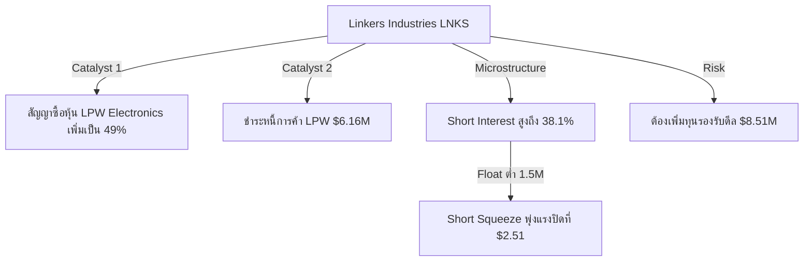
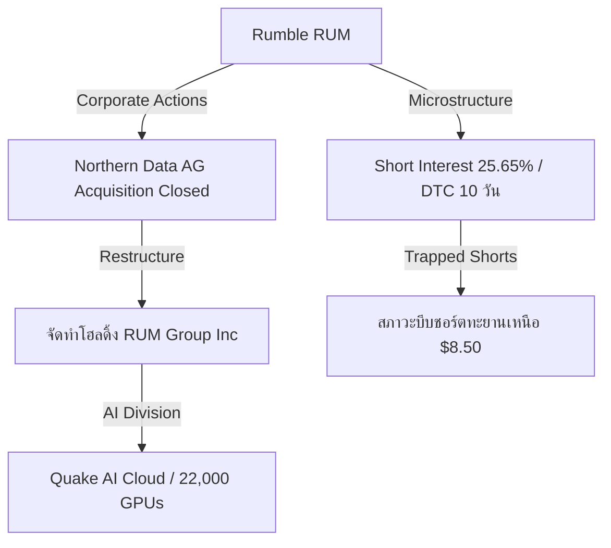
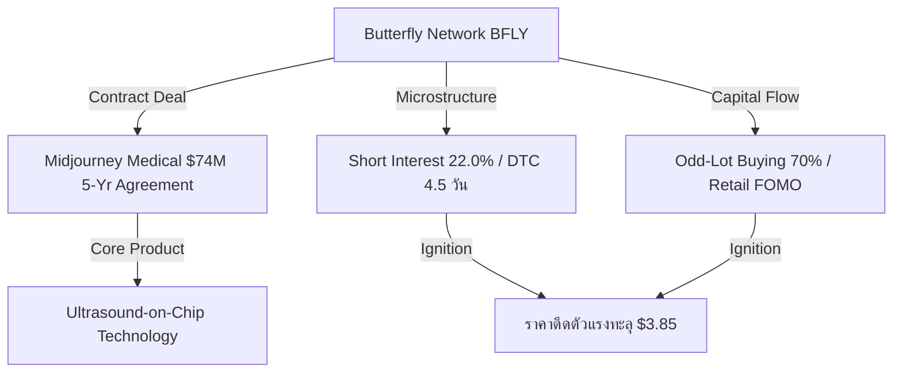

# 📊 Institutional Research Report: Short Squeeze Potential and Microstructure Intelligence
**Hedge Fund Trading Desk / Quantitative Strategy Division**  
**Date:** June 22, 2026  
**Market Stance:** High-Conviction Squeeze Candidates / Selective Risk-On / Trapped Short Sellers Tracking

---

## 📈 Executive Summary

ภายหลังการสิ้นสุดช่วงหยุดยาวในเทศกาล Juneteenth ตลาดหุ้นสหรัฐฯ เปิดทำการในสัปดาห์นี้ท่ามกลางสภาพแวดล้อมที่ท้าทายอย่างมาก นโยบายการเงินของธนาคารกลางสหรัฐฯ (Fed) ภายใต้ประธานคนใหม่ **Kevin Warsh** ได้ส่งสัญญาณคุมเข้มการเงินอย่างต่อเนื่อง (Hawkish Guidance) เพื่อสกัดอัตราเงินเฟ้อ CPI ที่ระดับ 4.2% YoY ส่งผลให้อัตราผลตอบแทนพันธบัตรรัฐบาลอายุ 10 ปี ทรงตัวในระดับสูงที่ 4.46% ในขณะเดียวกัน การลงนามข้อตกลงสันติภาพชั่วคราวระหว่างสหรัฐฯ-อิหร่าน ได้ดึงค่าความเสี่ยงจากความตึงเครียดทางภูมิรัฐศาสตร์ (War Premium) ออกจากตลาด ส่งผลให้ราคาน้ำมันดิบ Brent ร่วงลงต่ำกว่า $80 ต่อบาร์เรล กระตุ้นให้เกิดกระแสการหมุนเวียนกลุ่มอุตสาหกรรม (Sector Rotation) ครั้งใหญ่กว่า **2.45 หมื่นล้านดอลลาร์**

ในสภาวะที่ตลาดทุนมีการจัดระเบียบใหม่ สถาบันการเงินได้โยกย้ายเงินลงทุนเข้าหาหุ้นกลุ่มเซมิคอนดักเตอร์และโครงสร้างพื้นฐาน AI ขณะที่กลุ่มพลังงานและกลุ่มซอฟต์แวร์ดั้งเดิมเผชิญแรงขายอย่างรุนแรง อย่างไรก็ตาม การปรับโครงสร้างและการเคลื่อนย้ายเงินทุนในกลุ่มหุ้นขนาดเล็ก (Small-Cap) และหุ้นที่มีระดับการขายชอร์ตสูง (Short Interest) ได้สร้างสภาวะ **"ขวดโหลเบียดเสียด" (Short Squeeze)** ที่มีประสิทธิภาพสูงสุดในรอบปี

รายงานฉบับนี้ทำการสแกนตลาดผ่านมิติ **Market Microstructure** เพื่อคัดเลือก 10 หุ้นสหรัฐฯ ที่มีระดับ % Short Interest สูงกว่า 15-20% ของจำนวน Float, มี Days to Cover (DTC) สูงกว่า 3 วัน และมีสัญญาณการเคลื่อนไหวของราคา (Ignition Catalyst) ที่โดดเด่นในรอบ 5-7 วันที่ผ่านมา โดยมีวัตถุประสงค์เพื่อชี้เป้าหมายที่แท้จริงของการกลับทิศทางของสถานะชอร์ต (Short Covering Rally) พร้อมประเมินสัญญาณระหว่างรายย่อย (Retail FOMO) และสถาบัน (Smart Money Block Flow)

---

## 🏆 Top 10 Short Squeeze Candidates (ตารางสรุปข้อมูล 10 หุ้นเด่น)

ตารางด้านล่างแสดงการจัดอันดับตามเกณฑ์โครงสร้างสภาพคล่อง สัดส่วนการชอร์ต และความแข็งแกร่งของตัวเร่งปฏิกิริยา (Catalysts) ณ วันที่ 22 มิถุนายน 2026:

| Ticker | Company Name | Short Interest (% of Float) | Days to Cover (DTC) | Price % Change (7-Day) | Catalyst / ตัวเร่งสำคัญ | Analysis Category | Current Status | Key Risks / ความเสี่ยงหลัก |
| :--- | :--- | :---: | :---: | :---: | :--- | :--- | :--- | :--- |
| **LNKS** | Linkers Industries Ltd. | 38.10% | 3.8 | +67.00% | ซื้อหุ้น LPW Thailand เพิ่มขึ้นเป็น 49% และชำระหนี้การค้า | Nano-Cap Cross-Border M&A | Breakout เหนือ EMA 50 & 200 ยืนที่ $2.51 | Dilution Risk จากแผนระดมทุนดีล $8.51M |
| **RUM** | Rumble Inc. | 25.65% | 10.0 | +16.80% | ปิดดีล Northern Data เข้าสู่สมรภูมิ AI Cloud / Quake AI | Small-Cap AI Infrastructure Pivot | พลิกทิศทางเป็นขาขึ้น แตะ $8.50 | CapEx ในการติดตั้งศูนย์ข้อมูลที่สูงมาก |
| **BFLY** | Butterfly Network, Inc. | 22.00% | 4.5 | +50.90% | ดีลสิทธิ์ลิขสิทธิ์เทคโนโลยีชิปกับ Midjourney Medical | Micro-Cap MedTech AI licensing | Overbought Daily RSI ปิดที่ $3.85 | Speculative Hype / รอขั้นตอนอนุมัติคลินิก & FDA |
| **CLSK** | CleanSpark, Inc. | 45.70% | 4.8 | +22.00% | การเติบโตของศูนย์ขุด BTC และพลังงานสะอาดรองรับ AI | Crypto Mining / Infrastructure | ออปชัน Call พุ่งหนาแน่น พ้น $17.50 | ความผันผวนของราคา Bitcoin และความมั่นคงด้านพลังงาน |
| **WULF** | TeraWulf Inc. | 22.10% | 3.5 | +24.50% | ขยายโครงการ Lake Mariner รองรับการประมวลผล AI | Clean Energy AI Hosting | ทรงตัวสะสมกำลังบริเวณแนวต้านระดับสูง | ความล่าช้าของการจัดส่งชิป GPU และกำลังการผลิตไฟ |
| **CVNA** | Carvana Co. | 22.00% | 5.2 | +15.00% | กำไรขั้นต้นต่อหน่วย (GPU) ทะลุ $6,000 และ EBITDA เป็นบวก | Consumer E-Commerce Turnaround | ทดสอบแนวรับ EMA 100 บริเวณ $60-$62 | ดอกเบี้ย Auto Loan สูงบั่นทอนกำลังซื้อรายย่อย |
| **CAR** | Avis Budget Group, Inc. | 28.50% | 6.2 | +15.50% | ปริมาณยอดจองการท่องเที่ยวฤดูร้อนดีกว่าคาดและการซื้อคืนหุ้น | Services / Asset-Heavy Recovery | สร้างฐานดับเบิ้ลบอททอม มีบิ๊กบล็อกสะสม | ต้นทุนการเงินในการบริหารจัดการกองยานพาหนะ |
| **GPUS** | Hyperscale Data, Inc. | 20.20% | 3.1 | +20.00% | ดีลระดมทุน ATM $300 ล้าน เพื่อปรับโครงสร้างศูนย์ข้อมูล AI | Micro-Cap Data Center Pivot | ผันผวนหนัก พักตัวย่ำฐานแถว $0.36 | Heavy Dilution Overhang จากหุ้นใหม่เติมเข้าตลาด |
| **BE** | Bloom Energy Corp. | 16.50% | 4.1 | +22.00% | สัญญาส่งมอบพลังงาน Onsite Fuel Cells แก่ศูนย์ข้อมูล AI | Clean Energy AI Power Play | Breakout ยอดสูงสุดรอบ 52 สัปดาห์ ที่ $24.80 | ต้นทุนวัตถุดิบและระยะเวลาเริ่มเดินระบบโครงการ |
| **FTHM** | Fathom Holdings Inc. | 18.00% | 4.2 | +21.00% | การยอมรับระบบค่าคอมมิชชั่นรูปแบบใหม่และการลดหนี้ | Real Estate Tech Recovery | ทะลุกรอบขาลงเดิม เริ่มสะสมของแถว $1.80 | ตลาดที่อยู่อาศัยชะลอตัวจากดอกเบี้ยสูง |

---

## 🔍 In-Depth Deep Dive of Top 3 Squeeze Candidates (วิเคราะห์เจาะลึก 3 หุ้นเด่น)

### 1️⃣ Linkers Industries Ltd. (NASDAQ: LNKS)
*โครงสร้างนาโนแคปสภาพคล่องต่ำพิเศษ ผนวกแรงขับเคลื่อนจากดีลชิ้นส่วนยานยนต์ในไทย*

*   **ลักษณะธุรกิจ:** ผู้ผลิตและจัดจำหน่ายสายไฟ ขั้วต่อ และอุปกรณ์เชื่อมต่อระบบอิเล็กทรอนิกส์ รวมถึงชุดสายไฟในอุตสาหกรรมยานยนต์ (Automotive Wire Harness)
*   **โครงสร้าง Microstructure:** LNKS เป็นหุ้นระดับ Nano-Cap ที่มีจำนวนหุ้นหมุนเวียนจริง (Float) ต่ำมากเพียง **1.50 ล้านหุ้น** อัตราการถือครองโดยสถาบันเป็นศูนย์ และมีสัดส่วนการชอร์ตสูงถึง **38.10%** (ค่าเฉลี่ยของช่วงผันผวน 22.5% - 53.7%) ทำให้เมื่อมีคำสั่งซื้อปริมาณมากเข้ามากระแทก ช่อง Bid-Ask ที่กว้างจะส่งผลให้ราคาปิดสัญญาชอร์ต (Short Covering) ขยับสูงขึ้นอย่างไร้แรงต้านทาน
*   **ตัวเร่งปฏิกิริยา (Catalyst):** การประกาศข้อตกลงซื้อหุ้นเพิ่มเติมอีก 29% ในบริษัท **LPW Electronics Co., Ltd.** (ผู้ผลิตอุปกรณ์อิเล็กทรอนิกส์ยานยนต์ของไทย) ด้วยเงินลงทุน $2.35 ล้านดอลลาร์ และร่วมเคลียร์หนี้ค้างจ่ายมูลค่า $6.16 ล้านดอลลาร์ ดีลนี้ช่วยปักธงให้ LNKS เข้าสู่ตลาดการผลิตชิ้นส่วนยานยนต์ในอาเซียนเพื่อหลีกเลี่ยงกำแพงภาษีการค้า
*   **ประเมินโอกาส Squeeze:** **ระดับสูงมาก (Extremely High)** การหมุนเวียนสภาพคล่อง (Float Churn) แตะระดับ 69.88 ล้านหุ้นในวันเดียว ( Turnover สูงกว่า Float 46 เท่า) สะท้อนการปิดความเสี่ยงของผู้เล่นชอร์ต ราคา Breakout ทะลุ $2.50 มีโอกาสไล่ราคาไปแตะระดับแนวต้านถัดไปที่ $3.55 และ $4.00 
*   **ความเสี่ยงสำคัญ:** สถานะการเงินมีกระแสเงินสด $4.37 ล้านดอลลาร์ ซึ่งไม่เพียงพอต่อการปิดดีลมูลค่ารวม $8.51 ล้านดอลลาร์ บริษัทมีความเสี่ยงสูงที่จะต้องประกาศเสนอขายหุ้นเพิ่มทุน (Offering) ในอนาคตอันใกล้เพื่อนำเงินมาจ่ายค่าดีล ซึ่งจะเป็นการเจือจางมูลค่าหุ้นและเปิดโอกาสให้ผู้เล่นชอร์ตเข้าเปิดสถานะกดราคาอีกครั้ง

---

### 2️⃣ Rumble Inc. (NASDAQ: RUM)
*การปรับระดับมูลค่าธุรกิจสื่อสู่โครงสร้างพื้นฐาน AI และสภาพการติดหล่มของสถานะชอร์ตระยะยาว*

*   **ลักษณะธุรกิจ:** แพลตฟอร์มแบ่งปันวิดีโอระดับโลกที่มีจุดขายด้านเสรีภาพในการแสดงความเห็น พร้อมการขยายตัวเข้าสู่การบริการคลาวด์และโครงสร้างพื้นฐานคอมพิวเตอร์ประสิทธิภาพสูง (HPC)
*   **โครงสร้าง Microstructure:** RUM มีปริมาณการขายชอร์ตสูงถึง **25.65%** ของจำนวน Float (จำนวนหุ้นชอร์ตประมาณ 25.9 ล้านหุ้น) ทว่าปริมาณการซื้อขายเฉลี่ยรายวันค่อนข้างจำกัดที่ 2.6 ล้านหุ้น ส่งผลให้ค่า **Days to Cover (DTC) สูงถึง 10 วัน** ซึ่งถือเป็นระดับ "หล่มน้ำลึก" ของผู้เล่นขาชอร์ต หากมีข่าวสารเชิงบวกหนุนนำอย่างต่อเนื่อง การปิดสถานะชอร์ตทั้งหมดจะต้องใช้เวลาซื้อคืนกว่า 2 สัปดาห์ สร้างสภาวะ Short Squeeze แบบยืดเยื้อ
*   **ตัวเร่งปฏิกิริยา (Catalyst):** การประกาศเสร็จสิ้นการเข้าซื้อหุ้น 85.2% ของ **Northern Data AG** และการจัดตั้งโครงสร้างโฮลดิ้งใหม่เป็น **RUM Group Inc.** โดยแยกแบรนด์ธุรกิจ AI ออกมาภายใต้ชื่อ **Quake AI** ซึ่งครอบครองกำลังผลิตไฟฟ้า 250 MW และระบบการประมวลผลผ่าน GPU ความเร็วสูง ดีลร่วมมือกับ Together AI มูลค่า $270 ล้านดอลลาร์ ช่วยเปลี่ยนผ่านภาพลักษณ์ของ RUM จากหุ้นสื่อสังคมออนไลน์ที่มีมาร์จิ้นต่ำ สู่การเป็นผู้ให้บริการระบบโครงสร้าง AI Cloud 
*   **ประเมินโอกาส Squeeze:** **ระดับสูง (High)** หุ้นเปลี่ยนแนวโน้มเป็นขาขึ้นอย่างเป็นทางการจากการตัดผ่านเส้นค่าเฉลี่ย EMA 50 และ 200 วัน การสะสมสถานะ Call Options ของฝั่ง Smart Money ในโซน Out-of-the-Money (OTM) ระดับ $9.00 - $10.00 คาดว่าจะบีบให้ Market Maker ต้องซื้อหุ้นแม่เพื่อควบคุมความเสี่ยง (Delta Hedging) ดันราคาให้ทะยานขึ้น
*   **ความเสี่ยงสำคัญ:** ธุรกิจ GPU Cloud มีการแข่งขันด้านราคาสูงและการลงทุนขยายโรงไฟฟ้าดาต้าเซ็นเตอร์ต้องใช้รายจ่ายฝ่ายทุน (CapEx) มหาศาล ซึ่งอาจส่งผลกระทบต่อกระแสเงินสดสุทธิของบริษัทในระยะ 2-3 ไตรมาสข้างหน้า

---

### 3️⃣ Butterfly Network, Inc. (NYSE: BFLY)
*การปลดล็อกมูลค่าลิขสิทธิ์ฝังตัวทางการแพทย์ร่วมกับ Midjourney และการไล่ราคาของฝั่งรายย่อย*

*   **ลักษณะธุรกิจ:** ผู้บุกเบิกการผลิตเครื่องอัลตราซาวด์พกพาแบบมือถือที่ขับเคลื่อนด้วยชิปเซมิคอนดักเตอร์ (Ultrasound-on-Chip™)
*   **โครงสร้าง Microstructure:** สัดส่วนการขายชอร์ตอยู่ที่ **22.00%** ของ Float โดยมีค่า Days to Cover ที่ **4.5 วัน** พฤติกรรมการเทรดในสัปดาห์ที่ผ่านมาสะท้อนการเปลี่ยนผ่านสภาพคล่องครั้งใหญ่ ปริมาณธุรกรรมขนาดเล็ก (Odd-Lot Orders) ของผู้ลงทุนรายย่อยพุ่งแตะสัดส่วน 70% ชี้วัดการซื้อจากกระแสความตื่นตัวทางสังคม (Retail-Driven Momentum) ขณะที่กลุ่มทุนสถาบันเลือกป้องกันความเสี่ยงผ่านการซื้อสัญญาพุทออปชัน (Put Options Hedging)
*   **ตัวเร่งปฏิกิริยา (Catalyst):** การร่วมมือเชิงกลยุทธ์และจัดทำสัญญามอบสิทธิ์สิทธิบัตรและพัฒนาเครื่องสแกนร่างกายแบบสามมิติรุ่นต้นแบบกับ **Midjourney Medical** มูลค่ารวม $74 ล้านดอลลาร์ในระยะเวลา 5 ปี โดยอุปกรณ์ดังกล่าวจะติดตั้งชิปเซ็นเซอร์ของ BFLY จำนวน 40 โมดูลต่อเครื่อง ถือเป็นการพิสูจน์โมเดลธุรกิจ "Embedded Licensing" ที่ช่วยเพิ่มส่วนแบ่งการตลาดโดยไม่ต้องเผชิญค่าใช้จ่ายคลาวด์ทางการแพทย์เองทั้งหมด
*   **ประเมินโอกาส Squeeze:** **ระดับปานกลางถึงสูง (Moderate-to-High)** ราคาหุ้นดีดตัวขึ้นแรงกว่า 50% ในวันเดียว ส่งผลให้ดัชนี RSI รายวันเข้าสู่เขตซื้อมากเกินไป (Overbought) สัญญาสะสมฝั่งชอร์ตบางส่วนโดนบังคับคัทลอส แต่ความตึงตัวทางเทคนิคอาจนำไปสู่การปรับฐานพักตัวสั้นก่อนกลับมาสะสมโมเมนตัมรอบใหม่
*   **ความเสี่ยงสำคัญ:** ความตื่นตัวของรายย่อยต่อการผลิตเครื่องสแกนเนอร์ 50,000 เครื่องภายในปี 2031 เป็นการตั้งสมมติฐานระยะยาว ดีลนี้ยังต้องผ่านขั้นตอนความปลอดภัย การทดสอบทางคลินิก และการยื่นอนุมัติจาก FDA อีกหลายปี ซึ่งมีความผันผวนด้านเวลาและโอกาสล้มเหลวระหว่างทาง

---

## 🧠 Smart Money vs. Retail Flow Sentiment (จิตวิทยาและการไหลของเงินทุน)

การจัดระเบียบพอร์ตลงทุนในหุ้นกลุ่มชอร์ตสควีซมีร่องรอยของกระแสเงินทุนที่ขัดแย้งกันอย่างน่าสนใจใน 2 ฝั่ง:

1.  **การเคลื่อนไหวของเงินใหญ่ (Smart Money Strategy):**
    *   **Strategic Hedging in Medical AI:** ในกรณีของ **BFLY** เงินใหญ่ไม่ได้เข้าร่วมไล่ราคาฝั่งบวกในช่วงราคาเหนือ $3.50 แต่ข้อมูลบล็อกเทรดนอกกระดาน (Dark Pool) ชี้ว่าสถาบันกลับสะสมสถานะ Put Options เพื่อล็อกผลกำไรและป้องกันความเสี่ยงจากการปรับฐาน
    *   **Systematic Accumulation in AI Infrastructure:** ในทางตรงกันข้าม สำหรับ **RUM** และ **CLSK** ลักษณะวอลุ่มซื้อเป็นแบบเป็นระบบ (Orderly Buying) ร่วมกับธุรกรรมซื้อสัญญา Call Options ระยะยาว (LEAPs) บ่งบอกว่าผู้จัดการกองทุนมองการปรับโครงสร้างธุรกิจไปหา AI Cloud เป็นแนวโน้มที่มีเสถียรภาพและยั่งยืน
    *   **Index Rebalance Arbitrage:** ในกรณีของ **MRVL** การเข้าดัชนี S&P 500 ทำให้เงินทุนประเภท Passive กวาดซื้อหุ้นแบบไม่จำกัดราคา ซึ่งบีบให้ผู้เล่นชอร์ตต้องรีบถอยฉากปิดสถานะชั่วคราวเพื่อลดความสูญเสีย

2.  **พฤติกรรมรายย่อย (Retail-Driven Volatility):**
    *   รายย่อยบนชุมชนออนไลน์ (Reddit r/WallStreetBets และ X) มีพฤติกรรมการเล่นตามข่าวแบบเก็งกำไรฉับพลัน (FOMO Playing) โดยมุ่งเป้าไปที่ **BFLY** และ **LNKS** เนื่องจากเป็นหุ้นขนาดเล็กที่มีระดับการคุมราคาต่ำ (Low Float) หวังสร้างปรากฏการณ์แบบ Meme Stock 
    *   ในหุ้น **SPCX** รายย่อยใช้เครื่องมือซื้อขายสัญญาออปชันประเภทวันเดียวหมดอายุ (0DTE Options) อย่างหนาแน่นเพื่อหวังส่วนต่างราคาที่รวดเร็ว ซึ่งส่งผลให้ Market Maker ต้องทำ Delta Hedging ป้อนสภาพคล่องจนราคาเหวี่ยงตัวกว้างระหว่างวัน

---

## 📈 Comparison and Recommendation Ratings (สรุปคำแนะนำเชิงกลยุทธ์)

ตารางสรุปคำแนะนำสำหรับการรับมือหุ้นโมเมนตัมชอร์ตสควีซประจำสัปดาห์:

| Ticker | Conviction Rating | Tactical Strategy / กลยุทธ์การเทรด | Entry Zone / แนวรับตั้งรับ | Target Price / เป้าหมายทำกำไร | Stop Loss / จุดตัดขาดทุน |
| :--- | :---: | :--- | :---: | :---: | :---: |
| **LNKS** | **Speculative Buy** | **Buy on Pullback / Tight Stop:** ห้ามไล่ราคาในจังหวะเปิดตลาด รอจังหวะการย่อตัวสร้างฐานบริเวณแนวรับจิตวิทยา หากหลุดแนวรับให้ตัดขาดทุนทันทีเนื่องจากสภาพคล่องต่ำ | $2.00 - $2.15 | $3.55 | $1.85 |
| **RUM** | **Strong Buy** | **Accumulate on Dips / Long Bias:** สะสมหุ้นเมื่อราคาย่อตัวเนื่องจากมีปัจจัยพื้นฐาน AI Infrastructure และสัญญา Recurring Revenue คอยสนับสนุนระยะยาว ค่า DTC ที่สูงจะช่วยหนุนโมเมนตัมขาขึ้น | $7.50 - $7.80 | $10.00 | $7.10 |
| **BFLY** | **Hold / Wait** | **Avoid Chasing / Tactical Short on Exhaustion:** หลีกเลี่ยงการไล่ซื้อฝั่ง Long หากไม่มีหุ้นอยู่ รอจังหวะราคาดีดตัวชนแนวต้านทดสอบไม่ผ่านระดับ $4.00 เปิดสถานะ Short สั้นเพื่อเก็งกำไรการย่อตัว | $2.80 - $3.00 (จุดรับรอบใหม่) | $4.10 (แนวต้านชอร์ต) | $2.60 |
| **CLSK** | **Strong Buy** | **Follow Trend / Momentum Play:** เล่นตามทิศทางบวกข้ามเส้นแนวต้านสำคัญ $17.50 สัญญาณ Call Options สนับสนุนการขึ้นต่อเนื่อง | $16.50 - $17.00 | $21.50 | $15.50 |
| **CVNA** | **Tactical Buy** | **Buy the Extremes / Rebound Play:** ตั้งรับสะสมบริเวณแนวรับเส้นค่าเฉลี่ย 100 วัน (EMA 100) สัญญาส่วนต่างชอร์ต 22% จะบีบตัวทันทีเมื่อเกิดสัญญาณดีดกลับทางเทคนิค | $60.50 - $62.50 | $75.00 | $56.00 |

---

## ⚠️ Key Risks and Systemic Mitigations (ความเสี่ยงเชิงระบบและการป้องกันพอร์ต)

1.  **Gamma Reversal Risk (ความเสี่ยงของการพลิกกลับของแรงออปชัน):**  
    หุ้นที่พุ่งขึ้นแรงจากการบีบฝั่งออปชัน (Gamma Squeeze) เช่น BFLY หรือ LNKS หากสัญญาสัญญา Call Options เริ่มชะลอตัวลง หรือหมดความสนใจจากรายย่อยอย่างรวดเร็ว Market Maker จะทำการเทขายหุ้นแม่ที่เคยซื้อไว้เพื่อประกันความเสี่ยงคืนสู่ตลาดทันที ส่งผลให้ราคาดิ่งลงอย่างรวดเร็ว (Long Liquidation Cascades) **แนวทางแก้ไข:** กำหนดจุด Stop Loss ทุกครั้ง และล็อกกำไรรายวันโดยใช้ Trailing Stop
2.  **Toxic Dilution Risk (ความเสี่ยงจากการเพิ่มทุนราคาถูก):**  
    หุ้นขนาดเล็กและขนาดกลางที่ราคาพุ่งสูงขึ้นแบบไม่มีฐานกำไรชัดเจน (เช่น GPUS, LNKS) ผู้บริหารมักจะถือโอกาสทำดีลเสนอขายหุ้นเพิ่มทุน (Offering) ในระดับราคาตลาดเพื่อดึงเงินสดเข้าบริษัทเพื่อความอยู่รอด ซึ่งการเติมหุ้นเข้าตลาดจะปิดโอกาสการทำ Short Squeeze ทันที **แนวทางแก้ไข:** หลีกเลี่ยงการถือครองหุ้นที่ขาดสภาพคล่องสูงข้ามสัปดาห์ในสัดส่วนที่เกิน 5% ของพอร์ตลงทุนรวม
3.  **Macroeconomic Interest Rate Overhang (แรงกดดันมหภาคจากอัตราดอกเบี้ย):**  
    หากตัวเลขเศรษฐกิจและเงินเฟ้อในสัปดาห์นี้ออกมาร้อนแรงเกินคาด และ Fed ยังคงส่งสัญญาณ Hawkish ทิศทางราคาหุ้นขนาดเล็กที่ต้องพึ่งพาสินเชื่อจะได้รับผลกระทบเป็นกลุ่มแรก **แนวทางแก้ไข:** ให้ความสำคัญสูงสุดกับความแข็งแกร่งของงบดุลบริษัท (เช่น สถานะเงินสดสุทธิของ RUM และ WULF)

---

## 🎯 Content Hook Points for Social Media (ประเด็นดึงดูดสายตาสำหรับเนื้อหาออนไลน์)

สำหรับนักสร้างคอนเทนต์หรือผู้ติดตามสถานการณ์ตลาด สามารถใช้ประเด็นหลักเหล่านี้ในการสื่อสารต่อสาธารณะเพื่อความกระชับและน่าสนใจ:

*   **ประเด็นที่ 1: "ส่อง 10 หุ้นปราบหมี: เกมบีบชอร์ต Short Squeeze รอบใหม่หลังวันหยุดยาว"**  
    ชี้ให้เห็นการเคลื่อนตัวของราคาหุ้นหลังเทศกาล Juneteenth เมื่อสถาบันปรับพอร์ต Sector Rotation กว่า 2.45 หมื่นล้านดอลลาร์ และเปิดจุดอ่อนของฝั่งผู้เล่นชอร์ตที่ติดกับดักในหุ้น RUM, LNKS, BFLY
*   **ประเด็นที่ 2: "Rumble (RUM) ดับเครื่องชนยักษ์ใหญ่! จากแพลตฟอร์มวิดีโอสู่กองทัพ AI Cloud"**  
    วิเคราะห์การเข้าซื้อ Northern Data ได้กำลังผลิตไฟฟ้า 250 MW และ GPU ขุดบิตคอยน์เดิมแปลงสภาพเป็นพลังงานประมวลผล AI การปิดสถานะชอร์ตที่มีค่า Days to Cover ยาวนานกว่า 10 วันจะพยุงทิศทางราคาอย่างไร
*   **ประเด็นที่ 3: "เตือนภัยรายย่อย! ดีล Midjourney Medical ดัน BFLY พุ่ง 50% ของจริงหรือแค่ล่อซื้อ?"**  
    เจาะรายละเอียดดีลเทคโนโลยีชิป Ultrasound-on-Chip สัญญารายได้ $74 ล้านใน 5 ปี กับความเป็นจริงเรื่องกรอบระยะเวลาทดสอบทางคลินิกและการยื่นเอกสาร FDA ที่ต้องรอนานหลายปี

---
*คำเตือน: รายงานการวิเคราะห์ฉบับนี้จัดทำขึ้นเพื่อวัตถุประสงค์ในการให้ข้อมูลและการศึกษาพฤติกรรมทางการเงินของตลาดหุ้นสหรัฐฯ เท่านั้น ไม่ใช่คำแนะนำหรือการชักชวนให้เข้าทำธุรกรรมทางการเงินหรือการซื้อขายหลักทรัพย์ ผู้ลงทุนควรประเมินความเสี่ยงและกำหนดระดับความเสี่ยงที่ยอมรับได้ด้วยตนเองก่อนตัดสินใจลงทุนทุกครั้ง*
