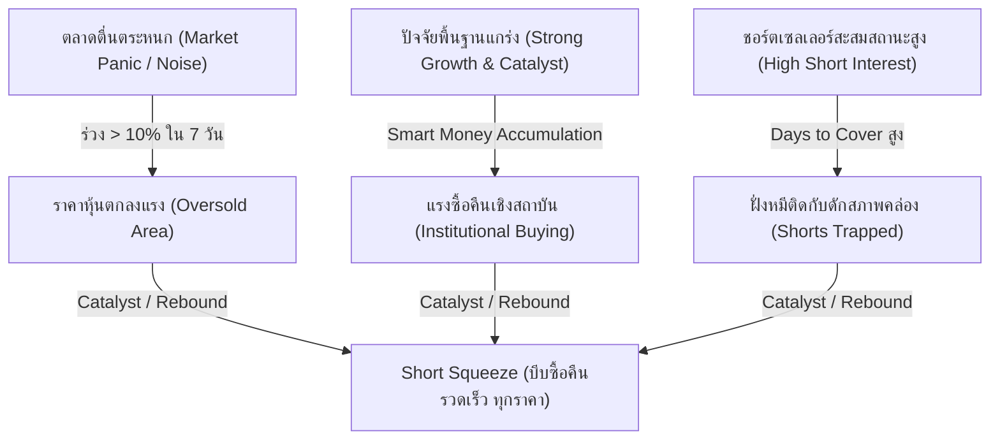

# 📊 Institutional Research Report: Short Squeeze Potential & Market Microstructure Intelligence
**Hedge Fund Strategy & Quantitative Division**  
**ประจำวันที่:** 2 กรกฎาคม 2026  
**สถานะตลาด:** การปรับฐานชั่วคราวจากความกังวลเรื่องนโยบายดอกเบี้ยและห่วงโซ่อุปทาน / โอกาสดักซื้อของกลุ่ม Smart Money จากแรงขาย Panic Sell

---

## 📈 Executive Summary: ถอดรหัสลับ Smart Money ในช่วงตลาดปรับฐาน
ในรอบ 7 วันที่ผ่านมา ตลาดหุ้นสหรัฐฯ เผชิญกับแรงกดดันระยะสั้นจากการปรับพอร์ตไตรมาส 2 (Quarterly Rebalancing) และการเปลี่ยนกลุ่มอุตสาหกรรม (Sector Rotation) เม็ดเงินไหลออกจากกลุ่มเทคโนโลยีและเซมิคอนดักเตอร์บางส่วน จากความกังวลเรื่องระดับมูลค่า (Valuation) ที่ขยับสูง รวมถึงนโยบายการเงินแบบ Hawkish ของธนาคารกลางสหรัฐฯ (Fed) ที่นำโดยประธานคนใหม่ Kevin Warsh ซึ่งส่งผลให้อัตราผลตอบแทนพันธบัตรรัฐบาลอายุ 10 ปี ทรงตัวในระดับสูงที่ 4.40% 

อย่างไรก็ตาม จากการเก็บข้อมูลทางโครงสร้างตลาด (Market Microstructure) ของเรา พบว่า **นี่ไม่ใช่การเปลี่ยนแปลงเชิงพื้นฐาน (Fundamental Change) แต่เป็นความตื่นตระหนกชั่วคราว (Market Noise/Panic)** ที่เกิดจากการเทขายเพื่อล็อกกำไรและการบังคับขายตามทางเทคนิค (Programmatic Selling)

สภาวะเช่นนี้ทำให้หุ้นที่มีพื้นฐานธุรกิจเติบโตระดับ Double-Digit หลายตัวปรับฐานลงสะสมมากกว่า 10% ภายในเวลาเพียง 7 วัน ในขณะที่ฝั่งผู้เล่นชอร์ต (Short Sellers) ได้ฉวยโอกาสเข้ามาเปิดสถานะขายชอร์ตเพิ่มขึ้นอย่างมีนัยสำคัญ ส่งผลให้เกิดโครงสร้างราคาแบบ **"สปริงอัดแน่น" (Spring-Loaded Structure)** ที่มีแรงกดทับสูง หากมีปัจจัยบวกที่เป็นตัวเร่งปฏิกิริยา (Catalysts) เกิดขึ้นในระยะสั้น หรือมีแรงซื้อสะสมจากกองทุนขนาดใหญ่ (Smart Money Accumulation) จะส่งผลให้เกิดสภาวะ **Short Squeeze** ขนาดใหญ่ บีบให้ฝั่งชอร์ตต้องรีบซื้อหุ้นคืนทุกราคา (Short Covering Rally) เพื่อจำกัดผลขาดทุน ดันราคาหุ้นให้พุ่งทะยานกลับตัวอย่างรวดเร็ว

---

## 🏆 Top 5 Fundamental Squeeze Candidates (ตารางสรุปข้อมูลเชิงโครงสร้าง)

ตารางด้านล่างประเมินระดับความหนาแน่นของการชอร์ต สภาพคล่องหมุนเวียน และศักยภาพการบีบกลับของราคา (Squeeze Potential) ณ วันที่ 2 กรกฎาคม 2026:

| Ticker | ชื่อบริษัท | ราคาปัจจุบัน (USD) | % การร่วง (7 วัน) | Short Interest (% of Float) | Days to Cover (DTC) | โครงสร้างเด่น / ตัวเร่งสำคัญ (Catalyst) | ประเมินประเภทการลง |
| :--- | :--- | :---: | :---: | :---: | :---: | :--- | :--- |
| **SMCI** | Super Micro Computer, Inc. | $27.65 | -12.72% | ~19.40% | 3.1 | ดีมานด์ AI Server & Liquid Cooling, ยอด Backlog ทุบสถิติ | **Panic** (ข่าวการสอบสวนตัวแทนไต้หวัน) |
| **APLD** | Applied Digital Corp. | $37.21 | -11.36% | ~28.80% | 3.3 | สัญญาโฮสติ้งดาต้าเซ็นเตอร์ AI กับลูกค้าระดับ Tier-1 | **Panic** (ความกังวลงบ CapEx ระยะสั้น) |
| **CLSK** | CleanSpark, Inc. | $14.55 | -10.35% | ~45.70% | 4.8 | การฟื้นตัวของ BTC, ประสิทธิภาพการขุดระดับท็อปและการขยายกำลังไฟฟ้า | **Panic** (ความผันผวนของราคาบิตคอยน์) |
| **WULF** | TeraWulf Inc. | $22.24 | -14.13% | ~22.00% | 3.5 | การปรับเปลี่ยนศูนย์ข้อมูล Lake Mariner รองรับ AI HPC Hosting | **Panic** (การปรับพอร์ตกลุ่มพลังงานและคริปโต) |
| **ARM** | Arm Holdings plc | $336.68 | -4.96% (ร่วง -23.3% จาก High) | ~11.30% | 1.5 | สัดส่วนการถือครองสิทธิบัตรสถาปัตยกรรมชิป ARMv9, ดีมานด์ AI Edge | **Panic** (Sector Rotation ในกลุ่มชิป) |

---

## 🔍 In-Depth Deep Dive: วิเคราะห์เจาะลึก 5 หุ้นแกร่งหนีบหมี

### 1️⃣ Super Micro Computer, Inc. (NASDAQ: SMCI)
*ผู้นำโครงสร้างพื้นฐานเซิร์ฟเวอร์ AI กับมรสุมข่าวสอบสวนทางเทคนิคคอลที่เปิดช่องว่างให้ Smart Money เข้าช้อน*

*   **ราคาปัจจุบัน:** $27.65
*   **% การปรับตัวลงในรอบ 7 วัน:** -12.72% (จาก $31.68 ณ วันที่ 25 มิถุนายน 2026)
*   **สาเหตุที่ราคาลง:** ราคาปรับตัวลดลงจากข่าวลือและการรายงานเกี่ยวกับประเด็นการเข้าตรวจสอบสำนักงานในไต้หวัน และการควบคุมตัวพนักงานบางส่วนเพื่อสืบสวนคดีละเมิดมาตรการควบคุมการส่งออกชิป Nvidia ไปยังต่างประเทศ ซึ่งกระตุ้นแรงขายตกใจ (Panic Sell) ทันที
*   **พื้นฐานธุรกิจยังแข็งแรงหรือไม่:** **แข็งแกร่งอย่างยิ่ง (Extremely Strong)** SMCI เป็นพันธมิตรที่ใกล้ชิดที่สุดของ Nvidia ในการออกแบบและจัดจำหน่ายตู้เซิร์ฟเวอร์สำหรับชิปตระกูล Blackwell ความต้องการระบบระบายความร้อนด้วยของเหลว (Liquid Cooling) ยังคงล้นตลาด ยอดคำสั่งซื้อสะสม (Backlog) ยังคงเติบโตอย่างมั่นคง
*   **นักลงทุนรายใหญ่หรือสถาบันยังถืออยู่หรือไม่:** สถาบันการเงินยักษ์ใหญ่รวมถึง BlackRock, Vanguard และ Fidelity ถือครองหุ้นรวมกันสูงถึง **62.31%** (Filings ณ สิ้นเดือนมิถุนายน 2026) สะท้อนความเชื่อมั่นของเงินทุนระยะยาว
*   **แนวโน้มระยะกลาง-ยาว:** การเปลี่ยนผ่านระบบ Data Center ทั่วโลกไปสู่ระดับ Hyperscale AI จำเป็นต้องใช้ความเชี่ยวชาญด้านสถาปัตยกรรมระบบระบายความร้อนของ SMCI ทำให้ยอดขายมีแนวโน้มเติบโตต่อเนื่องในระยะ 1-3 ปีข้างหน้า
*   **จุดที่น่าสนใจสำหรับการสะสม:** บริเวณแนวรับสำคัญทางจิตวิทยาที่ **$25.00 - $28.00** ซึ่งเป็นช่วงสะสมราคาที่ปลอดภัยและมีแรงซื้อกลับหนาแน่น
*   **ความเสี่ยงที่ต้องระวัง:** ความยืดเยื้อของคดีความและการตรวจสอบเกี่ยวกับการส่งออก และการแข่งขันที่สูงขึ้นจากคู่แข่งอย่าง Dell และ HP Enterprise
*   **มุมมองของ Smart Money:** เงินใหญ่ประเมินว่านี่คือ **"เทคนิคอลพาณิก" (Technical Panic)** ข่าวการตรวจสอบนี้ส่งผลต่อจิตวิทยาการลงทุนชั่วคราวแต่ไม่ได้ทำลายความสามารถในการแข่งขันและการส่งมอบสินค้าจริง สัดส่วนชอร์ตเซลที่สูงเกือบ 20% บนกระแสข่าวร้ายนี้ ถือเป็นเป้าหมายชั้นดีสำหรับการทำ Short Squeeze เมื่อข่าวร้ายเริ่มจางลง

---

### 2️⃣ Applied Digital Corporation (NASDAQ: APLD)
*จุดเชื่อมต่อโครงข่ายคอมพิวเตอร์ประสิทธิภาพสูง (HPC) ที่ร่วงแรงเกินมูลค่าสินทรัพย์จริง*

*   **ราคาปัจจุบัน:** $37.21
*   **% การปรับตัวลงในรอบ 7 วัน:** -11.36% (จาก $41.98 ณ วันที่ 24 มิถุนายน 2026)
*   **สาเหตุที่ราคาลง:** ความกังวลของตลาดเกี่ยวกับการกู้ยืมและอัตราดอกเบี้ยที่สูงขึ้นในการลงทุนก่อสร้างศูนย์ข้อมูลคอมพิวเตอร์ขนาดใหญ่ (CapEx Spend) ผนวกกับสภาวะแรงขายทำกำไรในกลุ่มโครงสร้างพื้นฐาน AI ขนาดเล็ก
*   **พื้นฐานธุรกิจยังแข็งแรงหรือไม่:** **แข็งแกร่ง (Strong)** APLD มีรายได้ที่เติบโตอย่างรวดเร็วจากการให้บริการเช่าพื้นที่และพลังงานไฟฟ้าแก่ระบบประมวลผล AI การร่วมมือกับพันธมิตรระดับ Tier-1 และการขยายดาต้าเซ็นเตอร์ที่ Ellendale เป็นเครื่องยืนยันความต้องการของตลาด นอกจากนี้ Wes Cummins (CEO) ยังมีการส่งสัญญาณซื้อหุ้นส่วนตัวเพื่อสร้างความเชื่อมั่นแก่ผู้ถือหุ้น
*   **นักลงทุนรายใหญ่หรือสถาบันยังถืออยู่หรือไม่:** สถาบันถือครองรวมกันสูงถึง **~79.7%** (โดยเป็นกองทุนอื่นๆ 50.63% และ Mutual Funds/ETFs อีก 29.08%) นำโดยสถาบันชั้นนำ เช่น Hood River Capital Management และ BlackRock
*   **แนวโน้มระยะกลาง-ยาว:** ความต้องการพลังงานไฟฟ้าและระบบคลาวด์เฉพาะทางสำหรับ AI Generative จะผลักดันอัตราการเช่าพื้นที่ศูนย์ข้อมูลของ APLD ให้เต็มความสามารถในการรองรับไปอีกหลายปี
*   **จุดที่น่าสนใจสำหรับการสะสม:** บริเวณราคา **$34.00 - $37.00** ซึ่งทำหน้าที่เป็นฐานราคาที่แข็งแกร่งมาโดยตลอด
*   **ความเสี่ยงที่ต้องระวัง:** ภาระหนี้สินในงบดุลและโอกาสการออกหุ้นเพิ่มทุน (Dilution Risk) หากต้องการระดมทุนก่อสร้างเพิ่มเติมอย่างรวดเร็ว
*   **มุมมองของ Smart Money:** กองทุนสถาบันมองว่าราคาที่ปรับตัวลงมากว่า 11% เป็นผลมาจากความกลัวต่อต้นทุนทางการเงินที่เกินจริง สัญญาโฮสติ้งระยะยาวกับยักษ์ใหญ่คลาวด์คือหลักประกันกระแสเงินสดที่ชัดเจน สัดส่วน Short Interest ที่ **28.80%** ของ Float ถือเป็นแรงผลักดันชั้นยอดที่จะดันราคากลับขึ้นไปอย่างรวดเร็วหากมีการประกาศปิดดีลสัญญาลูกค้ารายใหญ่รายใหม่

---

### 3️⃣ CleanSpark, Inc. (NASDAQ: CLSK)
*เหมืองบิตคอยน์สีเขียวที่มีประสิทธิภาพการดำเนินงานระดับท็อป พร้อมตัวเลขชอร์ตที่ถูกบีบอัดจนขีดสุด*

*   **ราคาปัจจุบัน:** $14.55
*   **% การปรับตัวลงในรอบ 7 วัน:** -10.35% (จาก $16.23 ณ วันที่ 24 มิถุนายน 2026)
*   **สาเหตุที่ราคาลง:** ปรับฐานตามการร่วงลงของราคา Bitcoin ระยะสั้น และความกังวลว่าค่าความยากในการขุด (Mining Difficulty) จะลดอัตรากำไรของผู้ประกอบการเหมืองขุด
*   **พื้นฐานธุรกิจยังแข็งแรงหรือไม่:** **แข็งแกร่งมาก (Very Strong)** CLSK เป็นหนึ่งในเหมืองขุดบิตคอยน์ที่มีต้นทุนการผลิตต่อเหรียญต่ำที่สุดในสหรัฐฯ โครงสร้างงบดุลสะอาดมาก แทบไม่มีหนี้สินระยะยาว และมีสภาพคล่องเป็นเงินสดและบิตคอยน์สะสมจำนวนมาก พร้อมทั้งกำลังขยายกำลังการขุดเป็น 30 EH/s ในครึ่งปีหลัง
*   **นักลงทุนรายใหญ่หรือสถาบันยังถืออยู่หรือไม่:** สถาบันระดับโลกอย่าง Vanguard, BlackRock และ Fidelity ยังคงเป็นผู้ถือหุ้นหลักรายใหญ่ และทยอยสะสมหุ้นเพิ่มผ่านกองทุนดัชนีและพอร์ตเชิงรุก
*   **แนวโน้มระยะกลาง-ยาว:** ผูกติดอยู่กับการยอมรับและการเติบโตระยะยาวของ Bitcoin ควบคู่ไปกับการเข้าควบรวมกิจการเหมืองขนาดเล็กที่มีต้นทุนการจัดการสูงกว่า
*   **จุดที่น่าสนใจสำหรับการสะสม:** ช่วงราคา **$13.50 - $14.50** เป็นโซนแนวรับสำคัญทางจิตวิทยาและแนวรับทางเทคนิคย้อนหลัง
*   **ความเสี่ยงที่ต้องระวัง:** ความผันผวนรุนแรงของราคาสินทรัพย์ดิจิทัล และความเสี่ยงด้านกฎเกณฑ์สิ่งแวดล้อมเกี่ยวกับการใช้พลังงานขุดเหมือง
*   **มุมมองของ Smart Money:** การชอร์ตเซลสูงถึง **45.70%** เกิดจากนักเก็งกำไรที่ใช้กลยุทธ์ชอร์ตหุ้นเหมืองขุดบิตคอยน์เพื่อป้องกันความเสี่ยง (Hedge) หรือเก็งกำไรทิศทางตรงกันข้ามกับตัวเหรียญ อย่างไรก็ตาม ด้วยฐานการดำเนินงานที่มั่นคงและกระแสเงินสดที่เป็นบวก เมื่อราคา Bitcoin สปริงตัวกลับ แรงซื้อคืนของผู้เล่นฝั่งชอร์ตในหุ้น CLSK จะทวีความรุนแรงและเกิด Short Squeeze ในอัตราเร่งที่เร็วกว่าเหรียญแม่หลายเท่าตัว

---

### 4️⃣ TeraWulf Inc. (NASDAQ: WULF)
*หุ้นพลังงานสะอาดขุดคริปโตรุ่นใหม่ ที่กำลังแปลงสภาพสู่ AI Infrastructure Play*

*   **ราคาปัจจุบัน:** $22.24
*   **% การปรับตัวลงในรอบ 7 วัน:** -14.13% (จาก $25.90 ณ วันที่ 24 มิถุนายน 2026)
*   **สาเหตุที่ราคาลง:** แรงเทขายเพื่อล็อกกำไรหลังจากราคาปรับตัวขึ้นสูงก่อนหน้านี้ ผนวกกับสภาวะการปรับพอร์ตในกลุ่มหุ้นพลังงานคริปโต
*   **พื้นฐานธุรกิจยังแข็งแรงหรือไม่:** **แข็งแกร่ง (Strong)** TeraWulf ดำเนินการขุดบิตคอยน์ด้วยพลังงานสะอาด 95% (นิวเคลียร์และพลังน้ำ) ทำให้อัตรากำไรขั้นต้นมั่นคง บริษัทอยู่ระหว่างการขยายเฟสศูนย์ข้อมูล Lake Mariner เพื่อให้บริการโฮสติ้งโครงข่ายคอมพิวเตอร์ระดับสูง (HPC) สำหรับประมวลผลปัญญาประดิษฐ์ (AI Hosting) ซึ่งเป็นตลาดมาร์จิ้นสูง
*   **นักลงทุนรายใหญ่หรือสถาบันยังถืออยู่หรือไม่:** นักลงทุนสถาบันและกองทุนที่มุ่งเน้นความยั่งยืนด้านสิ่งแวดล้อม (ESG) รวมถึง BlackRock และ Vanguard ยังคงเพิ่มการถือครองอย่างต่อเนื่อง
*   **แนวโน้มระยะกลาง-ยาว:** การเปลี่ยนผ่านไปสู่การให้บริการ AI Hosting จะช่วยลดผลกระทบจากวัฏจักรความผันผวนของ Bitcoin และเพิ่มสัดส่วนรายได้ประจำ (Recurring Revenue) ที่มีมูลค่าสัญญาระยะยาว
*   **จุดที่น่าสนใจสำหรับการสะสม:** บริเวณราคา **$20.00 - $22.00** ซึ่งเป็นช่วงสอดคล้องกับแนวรับเส้นค่าเฉลี่ย EMA 50 วัน
*   **ความเสี่ยงที่ต้องระวัง:** ความล่าช้าในการส่งมอบชิปประมวลผลระดับสูง (GPUs) จากพันธมิตรดาต้าเซ็นเตอร์ และการใช้เงินลงทุนที่สูงในการปรับปรุงโครงข่ายไฟฟ้า
*   **มุมมองของ Smart Money:** เงินใหญ่ประเมินว่ามูลค่าของสิทธิ์ในการใช้พลังงานไฟฟ้าระดับเมกะวัตต์ (Power Capacity) ของ WULF ยังต่ำกว่ามูลค่าที่แท้จริงมาก ในยุคที่ดาต้าเซ็นเตอร์แย่งชิงพลังงานไฟฟ้า การมีแหล่งพลังงานนิวเคลียร์ที่สะอาดและราคาคงที่เป็นสินทรัพย์ที่ล้ำค่า การปรับฐานลง 14% จึงเป็นจุดเข้าซื้อเชิงกลยุทธ์เพื่อถือครองสินทรัพย์ระยะยาวควบคู่ไปกับการกดดันฝั่งชอร์ตที่มีสัดส่วนถึง 22.00% ให้ต้องยอมแพ้

---

### 5️⃣ Arm Holdings plc (NASDAQ: ARM)
*โครงสร้างผู้กุมอำนาจการออกแบบชิปของโลก กับระดับ Float ที่ต่ำจนหมีหลีกเลี่ยงไม่ได้*

*   **ราคาปัจจุบัน:** $336.68
*   **% การปรับตัวลงในรอบ 7 วัน:** -4.96% (แม้ปรับลดลงเพียง 5% ในรอบสัปดาห์ แต่หากวัดจากจุดสูงสุดเดิมที่ $439 ณ วันที่ 18 มิถุนายน 2026 ถือว่าปรับฐานลงมาสะสมแล้วถึง **-23.3%**)
*   **สาเหตุที่ราคาลง:** การปรับฐานของดัชนีเซมิคอนดักเตอร์โลก (SOX) แรงขายทำกำไรกลุ่มหุ้น AI ขนาดใหญ่หลังทะยานพุ่งขึ้นทำ All-Time High และการหมุนเวียนเงินเข้าสู่กลุ่ม Defensive Value
*   **พื้นฐานธุรกิจยังแข็งแรงหรือไม่:** **แข็งแกร่งที่สุดในโลกชิป (World-Class Monopoly)** สถาปัตยกรรมชิป ARMv9 กำลังได้รับการยอมรับในชิปประมวลผลของสมาร์ทโฟนระดับสูง และระบบประมวลผลเซิร์ฟเวอร์ระดับองค์กร (เช่น สัญญาร่วมพัฒนากับ AWS และชิป Grace CPU ของ Nvidia) ซึ่งสร้างกระแสรายได้จากค่ารอยัลตี้ (Royalty) ที่มีอัตรากำไรขั้นต้นสูงกว่า 95%
*   **นักลงทุนรายใหญ่หรือสถาบันยังถืออยู่หรือไม่:** **SoftBank Group** ยังคงถือหุ้นใหญ่สูงถึง **~87% - 88%** ส่งผลให้จำนวนหุ้นที่หมุนเวียนในตลาดจริง (Public Float) มีจำกัดมากเพียง ~12% และในส่วนของ Float ดังกล่าวส่วนใหญ่ก็ถูกครอบครองโดยกองทุนยักษ์ใหญ่อย่าง BlackRock, Vanguard และ Fidelity
*   **แนวโน้มระยะกลาง-ยาว:** การขยายตัวของเทคโนโลยี AI บนสมาร์ทโฟนและคอมพิวเตอร์พีซีส่วนบุคคล (AI on Device / Edge AI) จะบังคับให้แบรนด์เทคโนโลยีทั่วโลกต้องซื้อลิขสิทธิ์สถาปัตยกรรมชิปที่ก้าวหน้าขึ้น ดันให้ส่วนแบ่งรายได้ของ ARM เติบโตทวีคูณ
*   **จุดที่น่าสนใจสำหรับการสะสม:** ช่วงระดับราคา **$310.00 - $335.00** ซึ่งเป็นโซนแนวรับเทคนิคคอลสำคัญของเส้นค่าเฉลี่ย EMA 50 และ 100 วัน
*   **ความเสี่ยงที่ต้องระวัง:** อัตราส่วนมูลค่า P/E ที่อยู่ในเกณฑ์พรีเมียม และความเป็นไปได้ที่ SoftBank จะทำการขายหุ้นเพื่อลดสัดส่วนในอนาคต
*   **มุมมองของ Smart Money:** หุ้น ARM คือกรณีตัวอย่างของ **"โครงสร้างบีบสภาพคล่อง" (Float Squeeze Setup)** ที่สมบูรณ์แบบ เนื่องจาก SoftBank ล็อกหุ้นไว้เกือบทั้งหมด การสะสมสถานะชอร์ต 11.30% ของผู้เล่นฝั่งหมีบนหุ้นที่ราคาย่อตัวลงมาเกือบ 24% จากยอดเขาเป็นการประเมินความเสี่ยงต่ำเกินไป หากตลาดเซมิคอนดักเตอร์เริ่มส่งสัญญาณฟื้นตัวเพียงเล็กน้อย แรงซื้อกลับของสถาบันร่วมกับธุรกรรมจำกัดผลขาดทุนของฝั่งชอร์ตจะผลักดันให้ราคาดีดกลับตัวขึ้นไปทำจุดสูงสุดใหม่ได้อย่างง่ายดาย

---

## 📌 หุ้นตัวไหนดูน่าสนใจที่สุดในสัปดาห์นี้ และเพราะอะไร?

จากการประเมินและเปรียบเทียบในมิติ **"สัดส่วนการชอร์ตต่อสภาพคล่องหมุนเวียนจริง (Short/Float Ratio)"**, **"ความแข็งแกร่งของตัวเร่งปฏิกิริยาในอนาคต (Catalysts)"** และ **"ความสมบูรณ์ของจุดเข้าซื้อ (Entry Point setup)"** ทางฝ่ายวิเคราะห์เชิงปริมาณประเมินว่า:

🏆 **CleanSpark, Inc. (NASDAQ: CLSK) เป็นหุ้นที่น่าสนใจที่สุดสำหรับสัปดาห์นี้**

**เหตุผลสนับสนุนเชิงลึก:**
1.  **Extreme Squeeze Coiling:** CLSK มีสัดส่วน Short Interest สูงถึง **45.70%** ซึ่งสูงที่สุดในบรรดาผู้สมัครทั้งหมด และมีค่า Days to Cover ที่สูงถึง 4.8 วัน ทำให้ผู้ชอร์ตตกอยู่ในฐานะที่เสียเปรียบอย่างหนักด้านสภาพคล่องหากทิศทางตลาดเปลี่ยน
2.  **Valuation & Operation Outperformance:** ในระดับราคา $14.55 หุ้น CLSK ได้สะท้อนความกลัวเรื่องความผันผวนของ Bitcoin ไปเรียบร้อยแล้ว ในขณะที่พื้นฐานการดำเนินงานจริง (Hash Rate เติบโตอย่างมีประสิทธิภาพ งบการเงินไม่มีหนี้) ยังคงดีที่สุดในกลุ่มผู้ผลิตคริปโต
3.  **Hedge Fund Hedging Loophole:** ฝั่งชอร์ตส่วนใหญ่ใน CLSK ไม่ได้ชอร์ตเพราะมองว่าบริษัทจะล้มละลาย แต่เป็นการชอร์ตเพื่อเปิดสถานะ Hedging คู่กับสถานะซื้อ Bitcoin หรือสินทรัพย์เทคโนโลยีอื่น หากราคา Bitcoin เริ่มมีเสถียรภาพและเกิดการฟื้นตัวเหนือระดับแนวรับหลัก การปิดสถานะชอร์ตของกองทุนเหล่านี้ (Short Covering) จะเกิดขึ้นพร้อมกันอย่างพร้อมเพรียง ส่งผลให้เกิดการกระชากของราคาที่เป็นเอกภาพและรุนแรงที่สุด

---

## 🌐 แหล่งข้อมูลอ้างอิง (Sources)

1.  **Fintel.io:** *Short Squeeze Leaderboard & Institutional Ownership Data for SMCI, APLD, and CLSK*  
    URL: [https://fintel.io](https://fintel.io)
2.  **MarketBeat.com:** *High Short Interest Stocks Tracker and Exchange reporting (Settlement date June 15, 2026)*  
    URL: [https://www.marketbeat.com](https://www.marketbeat.com)
3.  **StockAnalysis.com:** *Historical Daily Price Action and Closing Metrics for NASDAQ: ARM, SMCI, and APLD on July 1, 2026*  
    URL: [https://stockanalysis.com](https://stockanalysis.com)
4.  **Barchart.com:** *Short Interest Stocks screener & Days to Cover Rankings*  
    URL: [https://www.barchart.com](https://www.barchart.com)
5.  **Investing.com:** *US Equity Daily closing quotes and corporate transaction databases*  
    URL: [https://www.investing.com](https://www.investing.com)

---

*คำเตือน: รายงานการวิเคราะห์ฉบับนี้จัดทำขึ้นโดยอ้างอิงข้อมูลสถิติและการเคลื่อนไหวทางโครงสร้างตลาดล่าสุดเพื่อการวิเคราะห์ทางวิชาการและการจัดการพอร์ตการลงทุนเท่านั้น ไม่ถือเป็นการชี้ชวนทางกฎหมายในการเสนอขายหลักทรัพย์หรือการแนะนำการลงทุนอย่างเป็นทางการ ผู้ลงทุนต้องประเมินความเสี่ยงและศึกษาข้อมูลอย่างรอบคอบก่อนตัดสินใจลงทุนทุกครั้ง*
