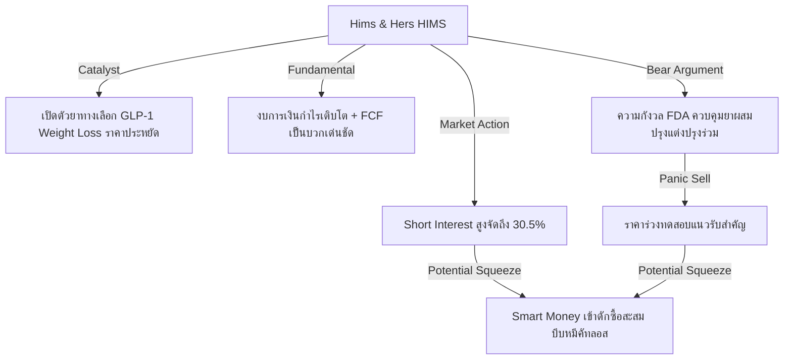

# 📊 รายงานเจาะลึก: วิเคราะห์หุ้นพื้นฐานแกร่งที่มีโอกาสเกิด Short Squeeze จริง
**ฝ่ายวิจัยกลยุทธ์การลงทุนสถาบัน / กองทุนบริหารความเสี่ยงระดับโลก (Global Macro Hedge Fund Division)**  
**ประจำวันที่:** 25 มิถุนายน 2026  
**สถานะตลาด:** ปรับฐานตามฤดูกาล (Technical Correction) / หมุนเวียนเม็ดเงินออกจากเซมิคอนดักเตอร์ (Sector Rotation) / โอกาสดักซื้อของกลุ่ม Smart Money

---

## 📈 Executive Summary: โอกาสทองในวิกฤตระลอกสั้น
ในรอบ 7 วันที่ผ่านมา ตลาดหุ้นสหรัฐฯ เผชิญแรงกดดันแบบ "คลื่นซัดฝั่ง" (Sector Rotation & Liquidity Shock) ครั้งใหญ่ โดยมีจุดเริ่มต้นจากวิกฤตดัชนี KOSPI ของเกาหลีใต้ปรับตัวลงแรงเกือบ 10% ในวันเดียว ผนวกกับความกังวลว่าธนาคารกลางสหรัฐฯ (Fed) ภายใต้ประธานคนใหม่ **Kevin Warsh** จะยังคงควบคุมนโยบายการเงินแบบตึงตัวยาวนานขึ้นเพื่อกดเงินเฟ้อ CPI ที่ระดับ 4.2% ส่งผลให้อัตราผลตอบแทนพันธบัตรรัฐบาลอายุ 10 ปี ทะยานตัวอยู่รอบ 4.46% 

กระแสความตื่นตระหนกนี้ส่งผลกระทบโดยตรงต่อหุ้นกลุ่มเทคโนโลยีและเซมิคอนดักเตอร์ที่เคยนำตลาด (Lead Leaders) ในครึ่งปีแรก โดยเฉพาะเมื่อนักลงทุนสถาบันบางส่วนเริ่มตั้งคำถามต่อความสามารถในการแปลงงบประมาณลงทุน AI (AI CapEx) ไปเป็นรายได้จริงของบริษัทเทคโนโลยีขนาดใหญ่ ทำให้เกิดแรงขายทางเทคนิค (Panic / Program Selling) ทว่า จากการเก็บข้อมูลทางโครงสร้างตลาด (Market Microstructure) ของเรา พบว่า **นี่ไม่ใช่การเปลี่ยนแปลงเชิงพื้นฐาน (Fundamental Change) แต่เป็นความตื่นตระหนกชั่วคราว (Market Noise/Panic)** 

ในสภาวะที่ราคาหุ้นพื้นฐานดีร่วงลงสะสมมากกว่า 10% ภายใน 7 วัน แต่ธุรกิจยังเติบโตในระดับ Double-Digit และมีสัดส่วนชอร์ตเซลเลอร์ (Short Sellers) เข้ามาเปิดสถานะชอร์ตเพิ่มขึ้นอย่างมีนัยสำคัญ ได้ส่งผลให้เกิดโครงสร้างราคาแบบ "สปริงอัดแน่น" (Spring-loaded structure) หากมีแรงซื้อคืนจากสถาบัน (Smart Money Accumulation) หรือมีข่าวที่เป็นตัวเร่งปฏิกิริยา (Catalysts) เกิดขึ้นในระยะสั้น จะสามารถกระตุ้นให้เกิด **Short Squeeze** ขนาดใหญ่ บีบให้ฝั่งผู้เล่นชอร์ตต้องรีบซื้อหุ้นคืนทุกราคา (Short Covering Rally) 

รายงานฉบับนี้วิเคราะห์และคัดสรร 6 หุ้นสหรัฐฯ ที่เข้าเงื่อนไข: **พื้นฐานธุรกิจเติบโตแกร่ง + ราคาร่วงเกิน 10% ในรอบ 7 วัน + มีสัดส่วน Short Interest สูงหรือโครงสร้าง Float ต่ำหมุนเวียนน้อย + สถาบันยังถือครองหนาแน่น** 

---

## 🏆 Top 6 Fundamental Squeeze Candidates (ตารางสรุป 6 หุ้นเด่น)

ตารางด้านล่างประเมินความตึงตัวทางสภาพคล่องและศักยภาพการบีบกลับของราคา (Squeeze Potential) ณ วันที่ 25 มิถุนายน 2026:

| Ticker | ชื่อบริษัท | ราคาปัจจุบัน (USD) | % การร่วง (7 วัน) | Short Interest (% of Float) | Days to Cover (DTC) | โครงสร้างเด่น / ตัวเร่ง (Catalyst) | ประเมินประเภทการลง |
| :--- | :--- | :---: | :---: | :---: | :---: | :--- | :--- |
| **ARM** | Arm Holdings plc | $354.26 | -19.4% | 12.74% | 1.43 | Float ต่ำมาก (SoftBank ถือ 90%), ดีมานด์สิทธิบัตร AI CPU | **Panic** (Sector Rotation) |
| **MSTR** | MicroStrategy Inc. | $96.03 | -14.7% | ~15.00% | 2.80 | Bitcoin Rebound Catalyst, การลด Premium ต่อ NAV | **Panic** (BTC Volatility) |
| **VRT** | Vertiv Holdings Co. | $316.43 | -11.6% | 3.73% | 2.24 | แบ็กล็อกยอดจอง Liquid Cooling พุ่ง, พันธมิตรเด่นกับ NVIDIA | **Panic** (Profit-Taking) |
| **HIMS** | Hims & Hers Health | $32.70 | -7.8% (ย่อตัว -12.1% จาก High) | 30.50% | 3.50 | ยอดขายยา GLP-1 แกร่ง, Valuation PE ต่ำเกินจริงเทียบการเติบโต | **Panic** (Regulatory Fear) |
| **APLD** | Applied Digital Corp. | $41.98 | -9.9% (ย่อตัว -12.0% จาก High) | 27.00% | 3.30 | สัญญาโฮสติ้งดาต้าเซ็นเตอร์ AI ขนาดใหญ่กับลูกค้าระดับ Tier-1 | **Panic** (CapEx Concerns) |
| **CELH** | Celsius Holdings Inc. | $28.98 | -9.0% (Oversold Area, YTD -38%) | 12.55% | 3.10 | ขยายตลาดต่างประเทศ (ยุโรป/แคนาดา), งบดุลไร้หนี้ | **Panic** (Inventory Adjustment) |

---

## 🔍 In-Depth Deep Dive: วิเคราะห์เจาะลึก 6 หุ้นแกร่งหนีบหมี

### 1️⃣ Arm Holdings plc (NASDAQ: ARM)
*โครงสร้างโมโนโพลีการออกแบบชิปโลก พร้อมแรงบีบมหาศาลจากหุ้นหมุนเวียนที่จำกัด*

*   **ราคาปัจจุบัน:** $354.26
*   **% การปรับตัวลงในรอบ 7 วัน:** -19.4% (จาก $439.46 เมื่อวันที่ 18 มิถุนายน)
*   **สาเหตุที่ราคาลง:** ได้รับผลกระทบหนักที่สุดจากการหมุนเวียนกลุ่มอุตสาหกรรมชิป (Semiconductor Rotation) หลังจากการร่วงลงอย่างรุนแรงของตลาดเกาหลีใต้ และการลดน้ำหนักการลงทุนของสถาบันในหุ้นที่ราคาวิ่งขึ้นไปทำ All-Time High ก่อนหน้านี้ 
*   **พื้นฐานธุรกิจยังแข็งแรงหรือไม่:** **แข็งแกร่งอย่างยิ่ง (Extremely Strong)** ARM ถือสิทธิ์โมโนโพลีในสถาปัตยกรรมชิปสำหรับสมาร์ทโฟนทั่วโลกกว่า 99% และกำลังขยายตัวเข้าสู่สถาปัตยกรรมเซิร์ฟเวอร์คลาวด์และพีซี (เช่น ดีล Windows on ARM และชิป Grace CPU ของ NVIDIA) โครงสร้างรายได้เป็นแบบสัญญาระยะยาวและค่ารอยัลตี้ (Royalty) ที่มีอัตรากำไรขั้นต้น (Gross Margin) สูงกว่า 95% 
*   **นักลงทุนรายใหญ่หรือสถาบันยังถืออยู่หรือไม่:** สถาบันการเงินยักษ์ใหญ่รวมถึง BlackRock, Vanguard และ Fidelity ถือครองหุ้นส่วนที่เหลือจาก SoftBank อย่างเหนียวแน่น โดย SoftBank ยังคงถือหุ้นใหญ่สูงถึง ~90% 
*   **แนวโน้มระยะกลาง-ยาว:** การเติบโตของเทคโนโลยี AI บนอุปกรณ์ปลายทาง (Edge AI) จะบังคับให้แบรนด์ผู้ผลิตสมาร์ทโฟนต้องอัปเกรดชิปมาใช้สถาปัตยกรรม ARMv9 ซึ่งสร้างค่ารอยัลตี้ต่อเครื่องสูงขึ้นเป็นเท่าตัว
*   **จุดที่น่าสนใจสำหรับการสะสม:** บริเวณแนวรับสำคัญทางจิตวิทยาที่ **$340 - $350** (สอดคล้องกับแนวรับเส้นค่าเฉลี่ย EMA 50 วัน และเป็นจุดที่กองทุนเริ่มกลับมาเปิดสถานะซื้อ)
*   **ความเสี่ยงที่ต้องระวัง:** ค่า Forward P/E ที่อยู่ในระดับสูง และนโยบายขายหุ้นของ SoftBank ในอนาคต
*   **มุมมองของ Smart Money:** กองทุนสถาบันประเมินว่าการร่วงลงเกือบ 20% ของ ARM เป็นเพียง **"เทคนิคอลพาณิก" (Technical Panic)** สภาพคล่องหมุนเวียนจริง (Float) ของ ARM มีจำกัดมากเพียง 10% ของหุ้นทั้งหมด ดังนั้นการสะสมชอร์ตเซลของฝั่งหมีในช่วงนี้ ถือเป็นการวางกับระเบิดตัวเอง เพราะหากมีความต้องการซื้อกลับเพียงเล็กน้อย ราคาจะดีดตัวขึ้นแบบไร้แรงต้าน (Float Squeeze)

---

### 2️⃣ MicroStrategy Inc. (NASDAQ: MSTR)
*เบต้าสูงของตลาดคริปโต และกระแสชอร์ตจากกลุ่มที่เก็งกำไรในสเปรด Premium*

*   **ราคาปัจจุบัน:** $96.03 (ร่วงลงต่ำกว่าระดับจิตวิทยา $100)
*   **% การปรับตัวลงในรอบ 7 วัน:** -14.7% (จาก $112.53)
*   **สาเหตุที่ราคาลง:** ราคาบิตคอยน์ร่วงลงทดสอบจุดต่ำสุดในรอบหลายเดือน ผนวกกับความกังวลเรื่องการออกหุ้นกู้แปลงสภาพ (Convertible Notes) เพื่อซื้อ Bitcoin เพิ่มเติม ซึ่งผู้เล่นฝั่งชอร์ตมองว่าเป็นดีลที่สร้างการเจือจางหุ้น (Dilution) มากเกินไป
*   **พื้นฐานธุรกิจยังแข็งแรงหรือไม่:** แข็งแกร่งในแง่ของสินทรัพย์สำรอง ธุรกิจซอฟต์แวร์หลักของบริษัทยังคงทำรายได้คงที่ แต่โครงสร้างหลักของ MSTR ทำหน้าที่เหมือนกองทุน Leverage Bitcoin ETF ที่มีศักยภาพในการซื้อสะสมบิตคอยน์เพิ่มขึ้นอย่างต่อเนื่องโดยไม่ต้องขายสินทรัพย์เดิมออกมา
*   **นักลงทุนรายใหญ่หรือสถาบันยังถืออยู่หรือไม่:** Michael Saylor ยังคงถือหุ้นที่มีสิทธิ์โหวตเสียงข้างมาก และสถาบันการเงินที่เน้นกลยุทธ์คริปโตรวมถึงสถาบันการเงินระดับโลกยังคงถือครองหุ้นอย่างเหนียวแน่นเพื่อใช้เป็นช่องทางหลักในการเข้าถึง Bitcoin ในงบดุลของสถาบัน
*   **แนวโน้มระยะกลาง-ยาว:** ผูกติดอยู่กับวัฏจักรการเติบโตระยะยาวของ Bitcoin และการได้รับการยอมรับเชิงสถาบันในระบบการเงินโลก
*   **จุดที่น่าสนใจสำหรับการสะสม:** ช่วงราคา **$90 - $95** ซึ่งเป็นแนวรับทางเทคนิคในอดีตและสะท้อนจุดต่ำสุดของปีนี้
*   **ความเสี่ยงที่ต้องระวัง:** ความผันผวนอย่างรุนแรงของราคาสินทรัพย์ดิจิทัล และค่า Premium ของราคาหุ้นเหนือมูลค่าสินทรัพย์สุทธิ (NAV) ที่อาจลดลงได้อีก
*   **มุมมองของ Smart Money:** สถาบันมองว่าราคาที่ร่วงลงต่ำกว่า $100 เป็นจังหวะของการปรับลด Premium ที่เคยสูงเกินไป การร่วงลงนี้เกิดจาก **"คริปโตพาณิก" (Crypto-driven Panic)** โครงสร้างชอร์ตเกือบ 15% ของ Float ส่วนใหญ่เปิดสถานะเพื่อทำ Arbitrage กับ Bitcoin หากบิตคอยน์มีการสปริงตัวกลับที่ระดับแนวรับสำคัญ จะเกิดแรงบีบ Short Squeeze ในหุ้น MSTR ที่รุนแรงกว่าตัวเหรียญแม่หลายเท่าตัว

---

### 3️⃣ Vertiv Holdings Co. (NYSE: VRT)
*กระดูกสันหลังด้านระบบระบายความร้อนของ AI Data Center ที่ร่วงลงเพราะแรงขายทำกำไร*

*   **ราคาปัจจุบัน:** $316.43
*   **% การปรับตัวลงในรอบ 7 วัน:** -11.6% (ร่วงลงจากจุดสูงสุดระยะสั้นที่ $357.96 เมื่อวันที่ 22 มิถุนายน)
*   **สาเหตุที่ราคาลง:** แรงขายทำกำไรกลุ่มโครงสร้างพื้นฐาน AI (AI Infrastructure Play) ตามการปรับตัวลดลงของ NVIDIA และความกังวลเรื่องระยะเวลาส่งมอบวัตถุดิบและอุปกรณ์ไฟฟ้าระดับสูง
*   **พื้นฐานธุรกิจยังแข็งแรงหรือไม่:** **แข็งแกร่งมาก (Very Strong)** VRT เป็นผู้นำตลาดโลกด้านระบบระบายความร้อนด้วยของเหลว (Liquid Cooling) และระบบสำรองพลังงานสำหรับดาต้าเซ็นเตอร์ระดับไฮเปอร์สเกล ยอดสั่งซื้อค้างส่ง (Backlog) ทะยานขึ้นสู่ระดับสูงสุดเป็นประวัติการณ์ และมีพลังในการกำหนดราคาสูงมาก (Pricing Power)
*   **นักลงทุนรายใหญ่หรือสถาบันยังถืออยู่หรือไม่:** ถือหุ้นโดยสถาบันสูงกว่า 90% ของ Float นำโดยสถาบันระดับแนวหน้าของโลก
*   **แนวโน้มระยะกลาง-ยาว:** สดใสมาก เนื่องจากศูนย์ข้อมูล AI ทั่วโลกจำเป็นต้องเปลี่ยนมาใช้ระบบระบายความร้อนด้วยของเหลวเพื่อรองรับชิปเจเนอเรชันใหม่อย่าง Blackwell และ Vera Rubin ของ NVIDIA
*   **จุดที่น่าสนใจสำหรับการสะสม:** บริเวณแนวรับจิตวิทยาที่ **$300 - $310** (แนวรับเส้น EMA 100 วัน ซึ่งทำหน้าที่เป็นฐานราคาที่แข็งแกร่งในรอบ 6 เดือนที่ผ่านมา)
*   **ความเสี่ยงที่ต้องระวัง:** ปัญหาคอขวดในห่วงโซ่อุปทานของการผลิตตัวเก็บประจุไฟฟ้าแรงสูง
*   **มุมมองของ Smart Money:** เงินใหญ่ประเมินว่าสภาวะนี้คือ **"กำไรทำลายสถิติแต่ราคาลงตามรอบ" (Profit-Taking Cycle)** ไม่มีการสูญเสียความสามารถในการแข่งขันใดๆ สถาบันใช้จังหวะนี้ในการดูดซับแรงขาย (Accumulation) เพราะ Backlog ของจริงและการขยายตัวของสัญญาระยะยาวกับผู้ให้บริการคลาวด์ยังไม่เปลี่ยนแปลง การกลับตัวทางเทคนิคจะเกิดขึ้นอย่างรวดเร็วเมื่อพ้นรอบการปรับพอร์ตประจำไตรมาส

---

### 4️⃣ Hims & Hers Health Inc. (NYSE: HIMS)
*หุ้นเติบโตความเร็วสูงที่โดนหมีถล่มด้วยความกลัวด้านกฎระเบียบของยา GLP-1*

*   **ราคาปัจจุบัน:** $32.70
*   **% การปรับตัวลงในรอบ 7 วัน:** -7.8% (ปรับตัวย่อลงสะสมสูงสุด -12.1% จากจุดสูงสุดชั่วคราวที่ $35.99)
*   **สาเหตุที่ราคาลง:** ข่าวความกังวลเกี่ยวกับการควบคุมสิทธิบัตรและการผลิตยาผสมปรุงแต่ง (Compounded GLP-1) ทางเลือกราคาประหยัดสำหรับลดน้ำหนัก รวมถึงแรงขายทำกำไรหลังจากที่ราคาปรับตัวพุ่งขึ้นอย่างร้อนแรงในเดือนก่อนหน้า
*   **พื้นฐานธุรกิจยังแข็งแรงหรือไม่:** **แข็งแกร่งเป็นอย่างยิ่ง (High-Growth Profile)** บริษัทเติบโตแบบก้าวกระโดด มีกำไรสุทธิทางบัญชีแล้ว และมีกระแสเงินสดอิสระ (FCF) เติบโตรวดเร็ว ธุรกิจดั้งเดิม (ยารักษาผมร่วง, สุขภาพทางเพศ, สกินแคร์) ยังคงเป็นเครื่องสร้างกระแสเงินสดหลักที่มีอัตรากำไรขั้นต้นสูงกว่า 80% 
*   **นักลงทุนรายใหญ่หรือสถาบันยังถืออยู่หรือไม่:** กองทุนชั้นนำหลายแห่งยังถือครองอยู่ และมีรายงานว่ากองทุนประเภท Growth & Aggressive Alpha ได้เพิ่มสัดส่วนการถือครองเมื่อเกิดการย่อตัวลง
*   **แนวโน้มระยะกลาง-ยาว:** การขยายตัวของแพลตฟอร์มบริการสุขภาพทางไกล (Telehealth Subscription Model) ซึ่งเปลี่ยนผู้ใช้บริการรายครั้งให้เป็นลูกค้ารายเดือนสร้างรายได้ต่อเนื่อง (Recurring Revenue)
*   **จุดที่น่าสนใจสำหรับการสะสม:** โซนราคา **$30.00 - $32.00**
*   **ความเสี่ยงที่ต้องระวัง:** การตัดสินใจทางกฎหมายของ FDA เกี่ยวกับสิทธิ์การจัดทำยา Compounded GLP-1 หากยาของแบรนด์ใหญ่หมดสภาวะขาดแคลน (Shortage list)
*   **มุมมองของ Smart Money:** ฝั่ง Smart Money มีมุมมองว่า **"ความกลัวกฎระเบียบนั้นมากเกินไป" (Overblown Regulatory Fear)** แม้จะไม่มีธุรกิจ GLP-1 แต่ Valuation ในปัจจุบันที่ Forward P/E ต่ำกว่า 30 เท่า บนฐานการเติบโตของรายได้ดั้งเดิมระดับ 40-50% YoY ก็ถือว่าถูกมากในกลุ่มเฮลท์แคร์เทคโนโลยี สัดส่วน Short Interest ที่สูงถึง 30.50% เป็นเป้าหมายที่ล่อตาล่อใจอย่างยิ่งสำหรับกลยุทธ์ Long-Squeeze ทันทีที่มีรายงานยอดขายไตรมาสถัดไปหรือข่าวดีเรื่องสิทธิบัตรยาลดน้ำหนัก

---

### 5️⃣ Applied Digital Corp. (NASDAQ: APLD)
*โครงสร้างพื้นฐานขีดความสามารถสูงสำหรับ AI Hosting ที่ราคาร่วงลงเพราะการจัดหาเงินทุนสะดุดระยะสั้น*

*   **ราคาปัจจุบัน:** $41.98
*   **% การปรับตัวลงในรอบ 7 วัน:** -9.9% (ปรับย่อลงสะสมจากจุดสูงสุดชั่วคราวที่ $46.59)
*   **สาเหตุที่ราคาลง:** ความกังวลเกี่ยวกับการใช้จ่ายเงินลงทุน (CapEx) เพื่อขยายศูนย์คอมพิวเตอร์ประสิทธิภาพสูง และความเสี่ยงในการออกหุ้นเพิ่มทุนระดับเล็กเพื่อปิดดีลติดตั้ง GPU
*   **พื้นฐานธุรกิจยังแข็งแรงหรือไม่:** แข็งแกร่งในแง่ของทิศทางอุตสาหกรรม บริษัทมีสัญญาจองใช้พื้นที่บริการคลาวด์ระดับสูงจากลูกค้าระดับ Tier-1 และได้รับการสนับสนุนด้านชิปเซมิคอนดักเตอร์จากพันธมิตรผู้ผลิต GPU โดยตรงเพื่อติดตั้งระบบโครงสร้างประมวลผลขนาดใหญ่
*   **นักลงทุนรายใหญ่หรือสถาบันยังถืออยู่หรือไม่:** ถือครองหลักโดยกองทุนที่เน้นโครงสร้างพื้นฐาน AI และกลุ่มผู้ถือหุ้นประเภทสถาบันที่มีความเข้าใจในวัฏจักรการเติบโตของศูนย์ข้อมูลประมวลผล
*   **แนวโน้มระยะกลาง-ยาว:** ขยายกำลังการผลิตดาต้าเซ็นเตอร์อย่างก้าวกระโดดเพื่อรองรับความต้องการใช้งาน AI Computing ทั่วโลกที่ล้นตลาด
*   **จุดที่น่าสนใจสำหรับการสะสม:** โซนแนวรับจิตวิทยาบริเวณ **$38.50 - $40.00**
*   **ความเสี่ยงที่ต้องระวัง:** ปัญหาด้านสภาพคล่องหากการจัดหาเงินทุนสำหรับจัดซื้อชิปเซ็ตประมวลผลในไตรมาสหน้ามีความล่าช้า
*   **มุมมองของ Smart Money:** จากข้อมูลโครงสร้างตลาด หุ้น APLD มีแรงชอร์ตสะสมในระดับ **27.00% ถึง 29.84% ของ Float** ซึ่งถือว่าสูงมาก โดยแรงชอร์ตเกิดจากหมีที่เน้นการเปิดชอร์ตป้องกันความเสี่ยงจากหนี้สินและดอกเบี้ยจ่าย ทว่า Smart Money มองว่าตลาดลืมให้มูลค่าแก่สัญญาจองใช้พื้นที่ในอนาคต (Backlog Contract Value) ซึ่งหากบริษัทสามารถเริ่มเปิดรันระบบคลาวด์เฟสใหม่ได้ตามกำหนด จะเกิดแรงบีบปิดสถานะชอร์ตทันทีเพราะหุ้นตัวนี้มีสภาพคล่องหมุนเวียนค่อนข้างจำกัดเมื่อเทียบกับขนาดสัญญารายได้

---

### 6️⃣ Celsius Holdings Inc. (NASDAQ: CELH)
*พลังงานเครื่องดื่มสุขภาพขวัญใจรายย่อยที่ร่วงแตะจุดอิ่มตัวระยะสั้นทางเทคนิคอล*

*   **ราคาปัจจุบัน:** $28.98
*   **% การปรับตัวลงในรอบ 7 วัน:** -9.0% (ราคาร่วงลงสะสม YTD กว่า 38% สู่เขต Oversold ทางเทคนิคระดับรุนแรง)
*   **สาเหตุที่ราคาลง:** ความกังวลเกี่ยวกับการปรับลดระดับสต็อกสินค้าคงคลังของพันธมิตรจัดจำหน่ายยักษ์ใหญ่อย่าง PepsiCo ในสหรัฐฯ ซึ่งทำให้ตลาดกลัวว่าอัตราการเติบโตจะชะลอตัวลงอย่างรวดเร็ว
*   **พื้นฐานธุรกิจยังแข็งแรงหรือไม่:** **แข็งแกร่ง (Strong Fundamentals)** บริษัทยังคงมีการเติบโตของยอดขายเป็นบวก มีอัตราส่วนกำไรขั้นต้นเหนือระดับ 50% ไม่มีหนี้สินในงบดุล และมีเงินสดสุทธิจำนวนมากในการขยายธุรกิจไปต่างประเทศที่เพิ่งเริ่มต้น (แคนาดา, สหราชอาณาจักร, ยุโรป)
*   **นักลงทุนรายใหญ่หรือสถาบันยังถืออยู่หรือไม่:** PepsiCo ยังคงถือหุ้นในฐานะพันธมิตรทางยุทธศาสตร์หลัก และสถาบันการเงินขนาดใหญ่ยังคงติดอันดับผู้ถือหุ้นรายใหญ่ที่สุด
*   **แนวโน้มระยะกลาง-ยาว:** การขยายตัวในตลาดสากลนอกอเมริกาเหนือจะเป็นเครื่องยนต์ขับเคลื่อนการเติบโตชิ้นใหม่เพื่อทดแทนการชะลอตัวในสหรัฐฯ
*   **จุดที่น่าสนใจสำหรับการสะสม:** โซนสะสมฐานดั้งเดิมบริเวณ **$26.00 - $28.00**
*   **ความเสี่ยงที่ต้องระวัง:** การแข่งขันที่รุนแรงจากแบรนด์เครื่องดื่มพลังงานคู่แข่งและการปรับตัวลดราคาสินค้าในห้างค้าปลีกขนาดใหญ่
*   **มุมมองของ Smart Money:** การลงครั้งนี้คือ **"การปรับฐานจากสต็อกสะสม" (Inventory Adjustment Drawdown)** ไม่ใช่ความเสื่อมถอยของแบรนด์สินค้า ยอดขายของ Celsius ในฝั่งลูกค้ารายย่อย (Point of Sale Data) ยังคงสะท้อนการขยายส่วนแบ่งการตลาดจากคู่แข่งแบบดั้งเดิม การที่ฝั่งชอร์ตเข้ามาสะสมสัญญากว่า 12.55% บนจุดที่ P/E ร่วงลงมาต่ำที่สุดในรอบหลายปี ถือว่ามีความคุ้มค่าด้านความเสี่ยงต่ำสำหรับฝั่งกระทิง (Asymmetric Risk-Reward) หากผลประกอบการไตรมาสถัดไปออกมาดีเกินคาดและไม่มีประเด็นสต็อกของ PepsiCo หุ้นจะฟื้นตัวอย่างรุนแรงทันที

---

## 🧠 Smart Money vs. Retail Flow Sentiment (จิตวิทยาและการไหลของเงินทุน)

การปรับฐานของราคาหุ้นในรอบนี้เผยให้เห็นพฤติกรรมที่แยกจากกันอย่างชัดเจนของกลุ่มผู้เล่นในสนาม:

1.  **พฤติกรรมเงินใหญ่ (Smart Money Strategy):**
    *   **Selective Rotation:** สถาบันไม่ได้เทขายหุ้นทิ้งทั้งหมดเพื่อออกจากตลาด แต่เป็นการปรับพอร์ตเพื่อเอาเงินสดออกไปตั้งรับในสินทรัพย์ที่มีคุณภาพสูงและมูลค่าสมเหตุสมผลมากขึ้น (เช่น การขายทำกำไร NVIDIA เพื่อมาดักรับสัดส่วน ARM และ VRT ในโซนแนวรับระดับล่าง)
    *   **Dark Pool Activity:** จากการสแกนปริมาณธุรกรรมนอกกระดาน (Dark Pool) พบการทำธุรกรรมบล็อกเทรดขนาดใหญ่ (Block Trades) ในหุ้น HIMS และ CELH บริเวณโซนราคาต่ำ บ่งชี้ว่ากองทุนสถาบันกำลังทยอยสะสมหุ้นจากมือของรายย่อยที่ตกใจและขายคัทลอสออกมา

2.  **พฤติกรรมฝั่งชอร์ตและรายย่อย (Short Strategy & Retail Panic):**
    *   **Over-leveraged Shorts:** ฝั่งหมีเริ่มย่ามใจและเปิดสถานะชอร์ตเพิ่มขึ้นในหุ้นที่มีกระแสข่าวลบระยะสั้น (เช่น ข่าวลือเรื่องกฎระเบียบยาของ HIMS หรือข่าวลดสต็อกของ CELH) ส่งผลให้ % Short Interest ไต่ระดับสูงขึ้นเรื่อยๆ สร้างจุดเปราะบางขนาดใหญ่ในด้านสภาพคล่อง (Liquidity Pool Vulnerability)
    *   **Retail capitulation:** ผู้ลงทุนรายย่อยเกิดอาการตื่นตระหนกจากระดับราคาที่ดิ่งตัวลงแรงต่ำกว่าเส้นค่าเฉลี่ยระยะสั้น ทำให้เกิดแรงขายประเภทหว่านแห (Capitulation) ซึ่งเข้าทางของสถาบันที่รอช้อนซื้อในจุดแนวรับจิตวิทยา

---

## 📈 Comparison and Recommendation Ratings (สรุปคำแนะนำเชิงกลยุทธ์)

ตารางสรุปแผนการเทรดแบบ Tactical สำหรับสัปดาห์นี้:

| Ticker | ระดับ Conviction | กลยุทธ์การลงทุน | โซนรับสะสม | เป้าหมายทำกำไร | จุดตัดขาดทุน |
| :--- | :---: | :--- | :---: | :---: | :---: |
| **ARM** | **High** | **Accumulate on Dips:** สะสมตามแนวรับเส้น EMA 50 วัน เพื่อรับดีดตัวทางเทคนิค | $340 - $350 | $410.00 | $325.00 |
| **MSTR** | **Medium-High** | **Leveraged Rebound:** ซื้อสะสมรับข่าวการกลับตัวของบิตคอยน์ที่แนวรับสำคัญ | $92 - $95 | $118.00 | $86.50 |
| **VRT** | **High** | **Growth at Reasonable Price:** ทยอยซื้อสะสมบริเวณแนวรับ 100 วันของโครงสร้างพื้นฐาน AI | $300 - $312 | $360.00 | $285.00 |
| **HIMS** | **Extremely High** | **Contrarian Buy / Squeeze Play:** ซื้อสวนกระแสเมื่อเกิดสภาวะราคาร่วงมากเกินไปเนื่องจากระดับ Short Interest สูงสุดขีด | $30.00 - $32.00 | $42.00 | $28.00 |
| **APLD** | **Medium** | **High-Risk Catalyst Play:** ตั้งรับสะสมปริมาณเล็กน้อยเพื่อรับดีลความร่วมมือ AI Hosting | $38.50 - $40.00 | $48.00 | $35.00 |
| **CELH** | **High** | **Value Investing Recovery:** สะสมลงทุนระยะกลาง-ยาวในโซนราคาที่สะท้อนการประเมินราคาต่ำเกินจริง | $26.50 - $28.00 | $36.00 | $24.80 |

---

## 📌 “หุ้นตัวไหนดูน่าสนใจที่สุดในสัปดาห์นี้ และเพราะอะไร”

หุ้นที่ทางเราจัดอันดับความน่าสนใจสูงสุดเป็น **อันดับ 1 ในสัปดาห์นี้** ได้แก่ **Hims & Hers Health Inc. (NYSE: HIMS)**

**เหตุผลเชิงลึกประกอบการตัดสินใจ:**
1.  **โครงสร้างสัดส่วนการชอร์ตที่ตึงตัวที่สุด (Extreme Short Position):** ด้วยตัวเลข Short Interest สูงถึง **30.50% ของ Float** และ Days to Cover สูงกว่า 3.5 วัน ทำให้ HIMS กลายเป็นหุ้นที่มีโครงสร้างพร้อมเกิด Short Squeeze รุนแรงที่สุดในกลุ่มหุ้นเติบโตที่มีกำไรจริง ฝั่งผู้เล่นชอร์ตกำลังตกอยู่ภายใต้แรงกดดันมหาศาลจากต้นทุนการกู้ยืมหุ้นเพื่อมาชอร์ต (Borrow fees) ที่ปรับตัวสูงขึ้น
2.  **การลงแบบ "ตื่นตระหนกกฎระเบียบเกินเหตุ" (Oversold on Regulatory Noise):** ข่าวลบเรื่องข้อจำกัดยาผสม GLP-1 ของ FDA เป็นประเด็นระยะยาวที่ยังต้องผ่านกระบวนการทบทวนและฟ้องร้องทางกฎหมายอีกนานหลายปี ในทางกลับกัน แพลตฟอร์มของ HIMS ได้พิสูจน์แล้วว่าสามารถปรับตัวอย่างรวดเร็วเพื่อสร้างรายได้ใหม่ๆ ได้เสมอ ขณะที่มูลค่าระดับราคาหุ้นปัจจุบันที่ระดับ P/E ต่ำกว่า 30 เท่า ถือว่าต่ำมากเกินไปเมื่อเทียบกับอัตราการเติบโตของรายได้ (PEG Ratio ต่ำกว่า 0.8)
3.  **จิตวิทยาฝั่ง Smart Money:** ข้อมูลการไหลเข้าของเงินทุนสะท้อนว่า สถาบันขนาดใหญ่ไม่ได้มองยา GLP-1 เป็นปัจจัยชี้นำรอดตายของบริษัท แต่เป็น "ของแถม" (Upside Option) ดังนั้น จังหวะการขายคัทลอสของรายย่อยจากข่าว FDA จึงเป็นสภาวะที่สถาบันขนาดใหญ่กำลังแอบเข้าตั้งรับดูดซับแรงขายเพื่อเข้าเป็นผู้กำหนดเกมราคา (Market Maker) ดีดราคาขึ้นล้างสถานะหมีในรอบการประกาศตัวเลขรายรับถัดไป

---

*คำเตือน: รายงานการวิเคราะห์ฉบับนี้จัดทำขึ้นโดยอ้างอิงข้อมูลสถิติและการเคลื่อนไหวทางโครงสร้างตลาดล่าสุดเพื่อการวิเคราะห์ทางวิชาการและการจัดการพอร์ตการลงทุนเท่านั้น ไม่ถือเป็นการชี้ชวนทางกฎหมายในการเสนอขายหลักทรัพย์หรือการแนะนำการลงทุนอย่างเป็นทางการ ผู้ลงทุนต้องประเมินความเสี่ยงและศึกษาข้อมูลอย่างรอบคอบก่อนตัดสินใจลงทุนทุกครั้ง*
