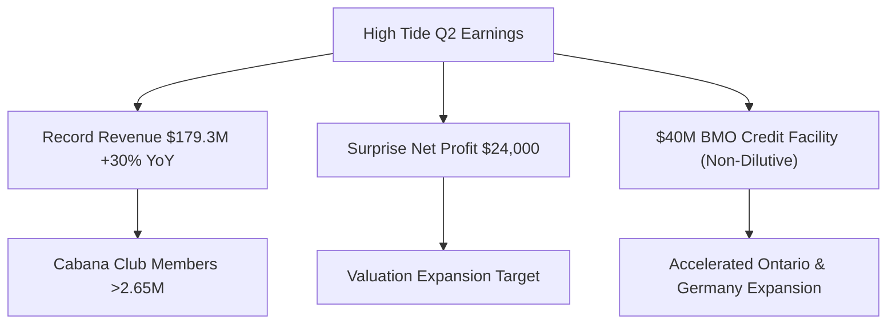

# 📊 Small-Cap & Penny Stock Intelligence Report
**Hedge Fund Trading Desk / Market Intelligence Division**  
**Date:** June 16, 2026  
**Market Stance:** Tactical Risk-On (Supported by U.S.-Iran Peace Agreement & Oil Price Retracement)

---

## 📈 Executive Summary

รายงานฉบับนี้จัดทำขึ้นโดยฝ่ายวิเคราะห์กลยุทธ์สถาบัน (Institutional Strategy Division) เพื่อวิเคราะห์ความเคลื่อนไหวทางโครงสร้างตลาด (Market Microstructure) ของหุ้นสหรัฐฯ ขนาดเล็ก (Small-Cap) และหุ้นที่มีราคาต่ำกว่า $5 (Penny Stocks) จำนวน 5 ตัวที่มีความเด่นชัดด้านปริมาณการซื้อขาย (Volume Spike), ข้อมูลข่าวสารเร่งด่วน (Catalyst Focus) และพฤติกรรมการไล่ราคาในตลาดช่วง Pre-Market ประจำวันที่ 16 มิถุนายน 2026 

ภายใต้ปัจจัยหนุนระดับมหภาค (Macro Catalyst) จากความคืบหน้าของข้อตกลงสันติภาพระหว่างสหรัฐฯ และอิหร่าน ส่งผลให้ราคาน้ำมันดิบ Brent ทรุดตัวลงมาอยู่ที่บริเวณ $78.66 ต่อบาร์เรล และดันดัชนีฟิวเจอร์สขึ้นอย่างพร้อมเพรียง ตลาดทุนเริ่มเปิดรับความเสี่ยง (Risk-On) และเกิดการเคลื่อนย้ายของเม็ดเงินลงทุน (Sector Rotation) มาสู่หุ้นเก็งกำไรและหุ้นขนาดเล็กที่มีปัจจัยบวกเฉพาะตัว อย่างไรก็ตาม ในกลุ่ม Micro-Cap ความเสี่ยงจากการเพิ่มทุน (Dilution Risk) และความเปราะบางของโครงสร้างเงินทุนยังคงเป็นประเด็นหลักที่ต้องเฝ้าระวังอย่างใกล้ชิด

---

## 🔬 In-Depth Stock Analysis

### 1️⃣ High Tide Inc. (NASDAQ: HITI)
*Surprise Q2 Net Profit & BMO Non-Dilutive Credit Line Catalyst*

#### **1. Company Overview**
*   **Sector / Industry:** Consumer Cyclical / Specialty Retail (Cannabis)
*   **Market Cap:** ~$205 Million USD
*   **Current Price:** ~$3.10 (ดีดขึ้น **+25%** ในช่วง Pre-Market วันที่ 16 มิ.ย. จากราคาปิดก่อนหน้า $2.48)
*   **Average Volume (30D):** ~350,000 shares (ปริมาณซื้อขายหนาแน่นขึ้นอย่างมาก)
*   **Float:** ~76.7 Million shares (Shares Outstanding: ~88M)
*   **Short Float %:** ~0.58% (Short Interest ต่ำมาก ปราศจากความกดดันฝั่งชอร์ต)
*   **Institutional Ownership:** ~10.61% (มีส่วนร่วมจากสถาบันและกองทุน ETF ระดับปานกลาง)
*   **Insider Ownership:** ~9.10% (ผู้บริหารร่วมถือครองหุ้นเพื่อผลประโยชน์ร่วมกับรายย่อย)

#### **2. Price Action Analysis**
*   **Movement:** HITI สร้างปรากฏการณ์ความมั่นใจในตลาด Pre-Market เช้านี้ โดยการกระโดดเปิด Gap Up ขึ้นทดสอบโซนแนวต้านจิตวิทยาที่ $3.00 - $3.20 หลังจากรายงานงบการเงินไตรมาส 2 ที่สร้างความประหลาดใจเชิงบวกให้กับตลาด (Surprise Earnings)
*   **Microstructure:** สเปรด Bid-Ask แคบลงสะท้อนสภาพคล่อง (Liquidity) ที่มีคุณภาพสูงในกลุ่มกัญชาค้าปลีก การไล่ราคาเป็นไปอย่างมีระบบ ไร้สัญญาณปั่นราคาแบบไร้ทิศทาง
*   **Accumulation/Distribution:** เกิดสัญญาณการสะสม (Accumulation) จากกลุ่มนักลงทุนสถาบันและนักลงทุนเน้นคุณค่า (Value Investors) ที่เห็นสัญญาณการเข้าสู่ช่วงทำกำไร (Profitable Phase)

#### **3. Volume Analysis**
*   **Relative Volume (RVOL):** **>15x** เทียบกับค่าเฉลี่ยปกติ
*   **Volume Spike:** การซื้อขายคึกคักอย่างรุนแรง บ่งชี้ถึงแรงซื้อที่สมเหตุสมผล (Reasoned Buying) ทั้งจากสถาบันการเงินที่ปรับพอร์ตและรายย่อยที่ตื่นเต้นกับตัวเลขงบการเงิน
*   **Flow Type:** ผสมผสานระหว่างสถาบันและรายย่อย เป็นเม็ดเงินลงทุนระยะกลางถึงยาวมากกว่า Hot Money ระยะสั้น

#### **4. News & Catalyst Analysis**
*   **Catalyst 1 (Earnings):** ประกาศผลประกอบการไตรมาส 2/2026 (สิ้นสุด 30 เม.ย.) รายได้แตะระดับสูงสุดเป็นประวัติการณ์ที่ **$179.3 ล้าน** (+30% YoY) และ Adjusted EBITDA สูงสุดประวัติศาสตร์ที่ **$13.9 ล้าน**
*   **Catalyst 2 (Profitability):** พลิกกลับมารายงานกำไรสุทธิ (Net Income) เป็นบวกครั้งแรกที่ **$24,000** ซึ่งเป็นหลักหมุดสำคัญในอุตสาหกรรมกัญชาที่ส่วนใหญ่ยังประสบปัญหาขาดทุนสะสม
*   **Catalyst 3 (Capital):** ได้รับอนุมัติวงเงินสินเชื่อมูลค่า **$40 ล้าน** จาก Bank of Montreal (BMO) ซึ่งเป็นเงินทุนแบบไม่มีการเจือจางมูลค่าหุ้น (Non-dilutive Debt) เพื่อใช้ขยายสาขาในรัฐออนแทรีโอและเยอรมนี
*   **Bull vs Bear Case:**
    *   *Bull Case:* ขยายสาขาเชิงรุกผ่านร้าน Northern Helm 4 แห่งที่เพิ่งซื้อกิจการ และยอดขายจาก Remexian Pharma ในเยอรมนีเติบโตต่อเนื่องตามกฎหมายกัญชาใหม่ เสริมความแข็งแกร่งของกระแสเงินสด
    *   *Bear Case:* การแข่งขันด้านราคาในแคนาดาที่ยังคงรุนแรงอาจกดดันอัตรากำไรขั้นต้น และความเสี่ยงจากนโยบายควบคุมร้านค้าปลีกกัญชาในท้องถิ่น

#### **5. Financial Health**
*   **Revenue Growth:** เติบโตอย่างโดดเด่นถึง **+30% YoY** สะท้อนถึงการเติบเตของระบบสมาชิก Cabana Club ที่มีฐานผู้ใช้ทะลุ 2.65 ล้านราย
*   **Cash Position / Runway:** แข็งแกร่งขึ้นอย่างมาก วงเงินเครดิต $40M จาก BMO ช่วยปลดล็อคข้อจำกัดด้านทุนหมุนเวียนโดยไม่จำเป็นต้องออกหุ้นเพิ่มทุนเพิ่มภาระแก่ผู้ถือหุ้นเดิม
*   **Dilution Risk:** **ต่ำมาก (Low)** เนื่องจากบริษัทเข้าใกล้จุดคุ้มทุนเชิงบัญชีและใช้ตราสารหนี้ต้นทุนต่ำจากสถาบันการเงินชั้นนำเป็นหลัก

#### **6. Market Sentiment**
*   **Retail Sentiment:** บอร์ด Reddit และสื่อสังคมออนไลน์ชื่นชม HITI ในฐานะ "ผู้รอดชีวิตเพียงไม่กี่ราย" ของกลุ่มกัญชาที่มีกำไรจริง ความกลัว (Fear) เปลี่ยนเป็นความโลภเชิงบวก (Healthy Greed)
*   **FOMO Level:** **ปานกลางค่อนข้างสูง** แต่สมเหตุสมผลจากงบการเงินที่เป็นของจริง

#### **7. Technical Analysis**
*   **Trend Structure:** พลิกตัวจากแนวโน้มการพักฐานสะสมกำลังกว้างๆ เข้าสู่แนวโน้มขาขึ้นรอบใหม่ (Breakout Pattern)
*   **Indicators:** RSI ขยับขึ้นแตะระดับ 68 ในรายวัน ชี้วัดความแข็งแกร่งของโมเมนตัม แต่ยังไม่เข้าสู่โซน Overbought รุนแรง ราคายืนเหนือเส้น EMA 50 และ EMA 200 ได้อย่างมั่นคง
*   **Support/Resistance:** แนวรับ: $2.60, $2.40 / แนวต้าน: $3.20, $3.50

#### **8. Risk Analysis & Rating**
*   **Risk Level:** **ความเสี่ยงปานกลาง (Medium Risk)**
*   **Threats:** ความผันผวนของราคาหุ้นกลุ่มกัญชาโดยรวม และความไม่แน่นอนของการออกกฎหมายกัญชาในระดับรัฐบาลกลางสหรัฐฯ (Federal Regulation)

---

### 2️⃣ CervoMed Inc. (NASDAQ: CRVO)
*Insider Confidence Buy & $10.5M Private Placement Catalyst*

#### **1. Company Overview**
*   **Sector / Industry:** Healthcare / Biotechnology
*   **Market Cap:** ~$23 Million USD
*   **Current Price:** ~$3.70 (พุ่งทะยาน **+49%** ใน Pre-Market วันที่ 16 มิ.ย. เทียบกับราคาปิด $2.48)
*   **Average Volume (30D):** ~90,000 shares (สภาพคล่องปกติค่อนข้างต่ำ)
*   **Float:** ~6.2 Million shares (Shares Outstanding: ~9.4M)
*   **Short Float %:** ~3.50% (Days to Cover ~6 วัน เนื่องจากสภาพคล่องต่ำ)
*   **Institutional Ownership:** ~35.00% (ถือครองโดยสถาบันเฉพาะทางไบโอเทคบางส่วน)
*   **Insider Ownership:** ~25.00% (เพิ่มขึ้นอย่างมีนัยสำคัญหลังธุรกรรมล่าสุด)

#### **2. Price Action Analysis**
*   **Movement:** CRVO พุ่งขึ้นชนแนวต้านด่านแรกที่ $3.70 - $3.80 ในช่วงเช้าวันนี้ การปรับตัวขึ้นแบบก้าวกระโดดเป็นการตอบรับสัญญาณความมั่นใจของผู้บริหารคนสำคัญที่เข้าซื้อหุ้นล็อตใหญ่ดักหน้าความคืบหน้าของผลิตภัณฑ์ยา
*   **Microstructure:** เนื่องจากเป็นหุ้นสภาพคล่องต่ำ (Low Liquidity) แรงซื้อที่เข้ามาอย่างรวดเร็วทำให้ Bid-Ask Spread ถ่างออกชั่วคราว การจับคู่คำสั่งซื้อขายผ่านระบบส่งผลให้ราคาขยับตัวขึ้นแรงแบบก้าวข้ามราคา (High Impact Cost)
*   **Accumulation/Distribution:** มีสัญญาณการซื้อคืนและดักสะสมโดยผู้ใช้ข้อมูลภายใน (Insider Accumulation) และนักลงทุนสถาบันรายย่อยเฉพาะกลุ่ม

#### **3. Volume Analysis**
*   **Relative Volume (RVOL):** **>18x** 
*   **Volume Spike:** โวลุ่มในตลาดก่อนเปิดทำการพุ่งขึ้นอย่างเด่นชัดจากการสแกนของนักลงทุนสายโมเมนตัม คาดว่ามีทั้งรายย่อยฝั่งโมเมนตัมและกองทุนขนาดเล็กเข้าแจม
*   **Flow Type:** คาดว่าเป็น Smart Money ร่วมกับนักลงทุนที่ชื่นชอบปัจจัยบวกภายใน (Insider-following Trade)

#### **4. News & Catalyst Analysis**
*   **Catalyst 1 (Funding):** ประกาศความตกลงเสนอขายหลักทรัพย์แบบเฉพาะเจาะจง (Private Placement) มูลค่า **$10.5 ล้าน** เพื่อรองรับการขยายขอบเขตการทดลองทางคลินิก
*   **Catalyst 2 (Insider Buying):** การยื่นเอกสาร Form 4 ต่อ SEC ยืนยันว่า **Joshua S. Boger** (ประธานบอร์ดบริหาร) ซื้อหุ้นล็อตใหญ่ในวงเงินถึง **$2,999,999** (955,414 หุ้นที่ราคาเฉลี่ย $3.14) สะท้อนความมั่นใจในระดับสูงสุดว่ายา neflamapimod มีโอกาสประสบความสำเร็จสูง
*   **Catalyst 3 (Clinical Progress):** ตัวยา neflamapimod กำลังเตรียมเข้าสู่กระบวนการทดลองระยะที่ 3 (Phase 3 Trials) ในกลุ่มผู้ป่วยโรคสมองเสื่อม Lewy bodies (DLB) ร่วมกับพันธมิตรยักษ์ใหญ่
*   **Bull vs Bear Case:**
    *   *Bull Case:* ผลการทดลอง Phase 3 ออกมาเป็นบวก และบริษัทสามารถปิดดีลพันธมิตรจัดจำหน่าย (Licensing Deal) กับบริษัทยายักษ์ใหญ่ได้สำเร็จ ส่งผลให้มูลค่าบริษัทโตทวีคูณ
    *   *Bear Case:* ความล่าช้าในการรับสมัครผู้ป่วยเข้าร่วมโครงการทดลอง Phase 3 หรือรายงานผลลัพธ์ยามีผลข้างเคียง ซึ่งในอุตสาหกรรมไบโอเทคถือเป็นเหตุการณ์แบบ Binary (ได้กับเสียร้อยเปอร์เซ็นต์)

#### **5. Financial Health**
*   **Revenue Growth:** บริษัทอยู่ในขั้นพัฒนาผลิตภัณฑ์ยา จึงยังไม่มีรายได้จากการขายสินค้าหลัก (Pre-revenue)
*   **Cash Runway:** การได้เงินสด $10.5M ล่าสุดช่วยยืดระยะเวลาประคองตัว (Cash Runway) ไปจนถึงไตรมาส 2 ปี 2027 ช่วยคลายความตึงเครียดด้านงบดุลในระยะสั้น
*   **Dilution Risk:** **ปานกลาง (Medium)** ในระยะสั้นเนื่องจากเพิ่งได้เงินทุนก้อนใหม่ แต่ในระยะยาว 12 เดือนข้างหน้า บริษัทยังจำเป็นต้องระดมทุนเพิ่มหากแผนหาพันธมิตรร่วมทดลองไม่บรรลุข้อตกลง

#### **6. Market Sentiment**
*   **Retail Sentiment:** รายย่อยให้ความสนใจสูงเนื่องจากกระแส "การซื้อของอินไซเดอร์ระดับ $3 ล้าน" ซึ่งไม่ค่อยเกิดขึ้นบ่อยในหุ้นระดับ Micro-Cap ถือเป็นสัญญาณบวกที่น่าเชื่อถือ
*   **FOMO Level:** **ปานกลาง** นักลงทุนส่วนใหญ่ยังคงระมัดระวังเนื่องจากธรรมชาติของหุ้นไบโอเทคมีความเสี่ยงเชิงผลลัพธ์วิจัย

#### **7. Technical Analysis**
*   **Trend Structure:** พยายามสร้างจุดกลับตัวรูปตัว U (U-Shaped Reversal) เหนือเส้นค่าเฉลี่ยระยะสั้น EMA 20
*   **Indicators:** RSI พุ่งขึ้นแตะระดับ 62 บ่งชี้โมเมนตัมเชิงบวก มีการเกิดสัญญาณสีทองชั่วคราว (Golden Cross) ในกรอบเวลารายชั่วโมง
*   **Support/Resistance:** แนวรับ: $3.14 (ราคาซื้อของอินไซเดอร์), $2.50 / แนวต้าน: $4.00, $4.50

#### **8. Risk Analysis & Rating**
*   **Risk Level:** **ความเสี่ยงสูง (High Risk)**
*   **Threats:** ความเสี่ยงเชิงคลินิก (Clinical Trial Failure) และความผันผวนจากการที่สเปรดราคากว้างทำให้การขายตัดขาดทุนทำได้ยากหากกระแสตอบรับชะลอตัว

---

### 3️⃣ Park Ha Biological Technology Co., Ltd. (NASDAQ: BYAH)
*Direct Offering Close & High-Volume Speculative Play*

#### **1. Company Overview**
*   **Sector / Industry:** Consumer Defensive / Personal Care (Skincare)
*   **Market Cap:** ~$3.58 Million USD (Nano-Cap / Micro-Cap)
*   **Current Price:** ~$1.98 (พุ่งขึ้น **+32%** ในวันที่ 16 มิ.ย. ตอบรับข่าวปิดดีลการเสนอขายหุ้นเพิ่มทุน)
*   **Average Volume (30D):** ~2 Million shares
*   **Float:** ~1.8 Million shares (ก่อนเพิ่มทุน / โครงสร้าง Low Float เดิม)
*   **Short Float %:** ไม่ระบุแน่ชัดเนื่องจากมีการเปลี่ยนแปลงโครงสร้างทุนรวดเร็ว แต่คาดว่าอยู่ในระดับต่ำ
*   **Institutional Ownership:** <1.00% (ไม่มีนักลงทุนสถาบันหลักร่วมถือครอง)
*   **Insider Ownership:** >60.00% (ควบคุมโดยครอบครัวผู้ก่อตั้งจากอู๋ซี ประเทศจีน)

#### **2. Price Action Analysis**
*   **Movement:** BYAH แสดงความผันผวนระดับสุดยอด โดยมีปริมาณซื้อขายวิ่งทะลุ 105 ล้านหุ้นในตลาดช่วงเช้า ราคาปรับขึ้นไปยืนแถว $1.98 หลังจากทรุดลงไปแตะแถวแนวรับจิตวิทยา $1.50
*   **Microstructure:** โครงสร้างตลาดเกิดสภาวะปั่นป่วนจากการเข้ามาจับคู่ชิงไหวชิงพริบของกลุ่ม Day Traders และโปรแกรมเทรดความถี่สูง (HFT) ราคาขยับขึ้นลงแบบไร้ทิศทางและผันผวนรุนแรงเป็นวินาที
*   **Accumulation/Distribution:** มีลักษณะการระบายหุ้นออก (Distribution) ของผู้ถือหุ้นเดิมหรือสถาบันที่เข้ารับหุ้นเพิ่มทุนราคาถูก มากกว่าการเก็บสะสมระยะยาว

#### **3. Volume Analysis**
*   **Relative Volume (RVOL):** **>50x** 
*   **Volume Spike:** การเปลี่ยนมือทะลุ 105 ล้านหุ้น บ่งชี้ถึงพฤติกรรมการเก็งกำไรหมุนรอบ (Churning Volume) ยอดการเปลี่ยนมือสูงกว่า Float จริงสะท้อนถึงการซื้อและขายในวันเดียวกันของกลุ่มนักเทรด (Intraday Flipping)
*   **Flow Type:** เม็ดเงินเก็งกำไรรายย่อย 100% (Retail Hot Money)

#### **4. News & Catalyst Analysis**
*   **Catalyst (Direct Offering Close):** ประกาศความสำเร็จในการปิดยอดเสนอขายหุ้นตรงแบบจดทะเบียน (Registered Direct Offering) มูลค่า **$2.0 ล้าน** โดยขายหุ้นพร้อมใบสำคัญแสดงสิทธิที่ราคา **$1.50 ต่อหน่วย** เมื่อวันที่ 15 มิถุนายน 2026
*   **Market Response:** ตลาดตีความการปิดการเสนอขายนี้เป็นจุดปลดล็อคความกังวลชั่วคราว (Overhang Relief) ทำให้เกิดแรงซื้อกลับคืนแบบเก็งกำไรระยะสั้น (Short-term Relief Rally)
*   **Bull vs Bear Case:**
    *   *Bull Case:* บริษัทนำเงินสด $2M ไปต่อยอดการพัฒนาตลาดเครื่องสำอางสมุนไพรในเอเชียและประคองตัวได้ชั่วคราว
    *   *Bear Case:* หุ้นใหม่และใบสำคัญแสดงสิทธิ (Warrants) ที่ราคา $1.50 จะถูกเทขายเข้าสู่ตลาดกระดานหลักอย่างต่อเนื่อง ดึงราคาลงสู่ราคาฐานเพิ่มทุนในที่สุด

#### **5. Financial Health**
*   **Revenue Growth:** รายได้หลักทรงตัวและยังคงมีอัตราส่วนกำไรสุทธิติดลบ (Unprofitable)
*   **Cash Position:** สภาพคล่องอ่อนแอ การระดมทุนได้เพียง $2M สะท้อนว่าบริษัทสามารถเข้าถึงตลาดทุนได้จำกัดและมีอำนาจต่อรองต่ำ
*   **Dilution Risk:** **สูงมากที่สุด (Extreme Dilution Risk)** การออกหุ้นราคา $1.50 ในสัดส่วนที่ใหญ่เมื่อเทียบกับ Market Cap เดิมส่งผลให้อำนาจออกเสียงของรายย่อยเดิมลดลงทันที

#### **6. Market Sentiment**
*   **Retail Sentiment:** พฤติกรรมการเก็งกำไรตื่นตระหนกฝั่งซื้อ (FOMO Buying) ตามกลุ่มแชท Discord และ X (Twitter) โดยเน้นสถิติโวลุ่ม 100M+
*   **Speculative Level:** **สูงมากที่สุด (Casino Play)**

#### **7. Technical Analysis**
*   **Trend Structure:** สภาพทางเทคนิคค่อนข้างยับเยินจากขาลงระยะยาว การรีบาวด์รอบนี้เป็นสัญญาณเทคนิคอล Dead Cat Bounce หลังเสร็จสิ้นการเพิ่มทุน
*   **Indicators:** RSI พุ่งจากโซน Oversold ขึ้นมาที่ระดับ 55 อย่างรวดเร็ว มีความตึงตัวระยะสั้นและใกล้จุดหมดแรงซื้อ (Exhaustion Zone) ในระยะสั้น
*   **Support/Resistance:** แนวรับ: $1.50 (ราคาเพิ่มทุน), $1.30 / แนวต้าน: $2.10, $2.40

#### **8. Risk Analysis & Rating**
*   **Risk Level:** **ความเสี่ยงสูงมากที่สุด (Extreme Risk)**
*   **Threats:** ความเสี่ยงจากการถูกทุบขายทำกำไรของเจ้ามือและกลุ่มลากราคา (Pump & Dump) และแรงกดดันจากการแปลง Warrant ที่ราคาต่ำกว่ากระดาน

---

### 4️⃣ FreeCast, Inc. (NASDAQ: CAST)
*Post-Catalyst Profit Taking & Pullback Support Test*

#### **1. Company Overview**
*   **Sector / Industry:** Communication Services / Broadcasting & Streaming
*   **Market Cap:** ~$154 Million USD (จากการคำนวณฐานราคาพุ่งล่าสุด)
*   **Current Price:** ~$3.30 (ปรับตัวลดลง **-12%** ใน Pre-Market วันที่ 16 มิ.ย. จากราคาวันก่อนหน้าที่ $3.75)
*   **Average Volume (30D):** ~1.2 Million shares
*   **Float:** ~16.3 Million shares (Shares Outstanding: ~41.3M)
*   **Short Float %:** ~0.68% (ระดับต่ำมาก)
*   **Institutional Ownership:** ~55.82% (ส่วนใหญ่เป็นหุ้นสัญญากลุ่ม Direct Listing)
*   **Insider Ownership:** ~43.50%

#### **2. Price Action Analysis**
*   **Movement:** หลังจากสร้างประวัติศาสตร์พุ่งขึ้นกว่า +141.9% ในวันจันทร์ที่ 15 มิ.ย. จากราคา $1.44 สู่ $3.75 วันนี้ราคา CAST เกิดการปรับตัวลดลง (Pullback) -12% มาทดสอบแนวรับจิตวิทยาแถว $3.30 ในกรอบ Pre-Market
*   **Microstructure:** ปริมาณโวลุ่มฝั่งเสนอขายในหน้าจอแอลทู (L2 Bid-Ask Depth) เริ่มหนาแน่น บ่งบอกถึงแรงขายทำกำไรจากกลุ่มผู้ซื้อที่ดักรอข่าวล่วงหน้า (Sell the News)
*   **Accumulation/Distribution:** มีสัญญาณการแจกจ่ายหุ้นทำกำไร (Distribution) ระยะสั้นของรายย่อยและโปรแกรมโมเมนตัมที่พึงพอใจเป้าหมายหลักร้อยเปอร์เซ็นต์

#### **3. Volume Analysis**
*   **Relative Volume (RVOL):** **>8x** เทียบกับค่าเฉลี่ยของช่วงเช้าปกติ
*   **Volume Spike:** การปรับตัวลงด้วยโวลุ่มที่ยังคงหนาแน่นสะท้อนว่ามีกลุ่มเก็งกำไรไหลออก และกลุ่มนักเทรดตามน้ำพยายามเข้ามารับที่แนวรับ (Dip Buying)
*   **Flow Type:** รายย่อยหมุนเวียนและเปลี่ยนมือของกลุ่มพอร์ตขนาดเล็กเป็นหลัก

#### **4. News & Catalyst Analysis**
*   **Catalyst 1 (DIRECTV Expansion):** การประกาศขยายขอบเขตสัญญากลุ่มผลิตภัณฑ์ร่วมกับ **DIRECTV** เพื่อนำช่องรายการชั้นนำมาบรรจุในระบบ SelectTV / SmartGuide เป็นตัวขับเคลื่อนรอบวันก่อนหน้า
*   **Going-Concern Warning (Risk):** นักลงทุนสถาบันเน้นย้ำถึงรายงานการตรวจสอบงบการเงินล่าสุดที่ระบุเรื่องความไม่แน่นอนในการดำเนินกิจการต่อ (Going Concern) เนื่องจากยังมีประเด็นยอดขาดทุนสะสมและกระแสเงินสดติดลบต่อเนื่อง
*   **Bull vs Bear Case:**
    *   *Bull Case:* การร่วมมือกับ DIRECTV สามารถนำไปสู่สัดส่วนการแบ่งปันรายได้ตามจริงและเพิ่มจำนวนผู้ใช้งานแบบชำระเงินรายเดือนได้รวดเร็วกว่าแผนงานเดิม
    *   *Bear Case:* ค่าใช้จ่ายในการตลาดและการเช่าโครงข่ายช่องสัญญาณสูงเกินกว่ารายได้ที่หักแบ่ง ทำให้ความจำเป็นต้องเพิ่มทุนยังคงอยู่

#### **5. Financial Health**
*   **Revenue Growth:** รายได้มีการเติบโตแต่ช้าเมื่อเทียบกับต้นทุนบริหาร
*   **Cash Position:** เงินสดคงเหลือจำกัด มีความเสี่ยงที่บริษัทจะทำการเพิ่มทุนผ่านเครื่องมือการขายหุ้นแบบ ATM (At-The-Market Offering) ในอนาคตอันใกล้เพื่อตุนเงินสด
*   **Dilution Risk:** **สูง (High)** เนื่องจากมีประวัติความอ่อนแอในงบดุลและต้องการเงินทุนในการรักษาขีดความสามารถการแข่งขันกับแพลตฟอร์มอื่น

#### **6. Market Sentiment**
*   **Retail Sentiment:** บอร์ดสนทนาเริ่มเสียงแตก ฝ่ายหนึ่งเชื่อในสตอรี่การควบรวมหรือเป็นพันธมิตรกับสื่อใหญ่ แต่อีกฝ่ายเริ่มชี้เป้าถึงความอ่อนแอของโครงสร้างการเงิน
*   **FOMO Level:** **ลดลงอย่างรวดเร็ว** หลังจากราคาระเบิดไปไกลและกำลังพักตัว

#### **7. Technical Analysis**
*   **Trend Structure:** โครงสร้างหลักเปลี่ยนเป็นขาขึ้นระยะสั้น แต่มีความเสี่ยงสูงที่จะทำรูปแบบแกว่งตัวกว้าง (High Volatility Range-Bound)
*   **Indicators:** RSI ย่อตัวจากระดับ 84 ลงมาแตะ 71 แต่ยังคงอยู่ในเขตการปรับฐานระยะสั้น (Cooling Off Phase)
*   **Support/Resistance:** แนวรับ: $3.00, $2.60 / แนวต้าน: $3.80, $4.20

#### **8. Risk Analysis & Rating**
*   **Risk Level:** **ความเสี่ยงสูง (High Risk)**
*   **Threats:** ความเสี่ยงจากการถูกกดราคาลงลึกเพื่อสลัดกลุ่มเก็งกำไรระยะสั้น (Shakeout) และความจำเป็นในการเพิ่มทุนเชิงโครงสร้าง

---

### 5️⃣ Dreamland Limited (NASDAQ: TDIC)
*1-for-25 Reverse Split & Ultra-Low Float Momentum Squeeze*

#### **1. Company Overview**
*   **Sector / Industry:** Consumer Cyclical / Event Management (Hong Kong based)
*   **Market Cap:** ~$5.8 Million USD (ปรับตัวเพิ่มขึ้นชั่วคราวหลังการแตกพาร์/รวมหุ้น)
*   **Current Price:** ~$5.80 (ทะยานขึ้น **+140%** ในช่วง Pre-Market วันที่ 16 มิ.ย. จากราคารวมหลัง split ทางทฤษฎี)
*   **Average Volume (30D):** ~120,000 shares (เบาบางมากก่อนการจัดโครงสร้างทุนใหม่)
*   **Float:** ~1.51 Million shares (Ultra-Low Float หลังการทำ Reverse Split)
*   **Short Float %:** ระบุได้ยากในระบบล่าช้า แต่คาดว่ามีแรงบีบซื้อคืนจากสถานะค้างชอร์ตระดับเทคนิคัล
*   **Institutional Ownership:** <0.50% (ใกล้เคียงศูนย์)
*   **Insider Ownership:** >50.00% (ส่วนใหญ่อยู่ในการถือครองของกลุ่มผู้ก่อตั้ง)

#### **2. Price Action Analysis**
*   **Movement:** TDIC พุ่งขึ้นอย่างก้าวกระโดดจากระดับราคาก้นอ่าวสู่กรอบ $5.30 - $6.50 ในช่วงเช้านี้ เป็นการปรับขึ้นตอบรับเชิงเทคนิคหลังจากการควบรวมหุ้นในอัตราส่วน 1-for-25 เพื่อรักษามาตรฐานราคาจดทะเบียนในตลาด Nasdaq
*   **Microstructure:** โครงสร้างปริมาณเสนอซื้อเสนอขาย (Order Book) มีความเบาบางอย่างยิ่ง การมีหุ้นหมุนเวียนจริงเพียง 1.5 ล้านหุ้นทำให้ราคาขยับตัวตามแรงซื้อได้อย่างง่ายดาย สเปรดมีความกว้างมากทำให้เสี่ยงต่อปัญหาจังหวะออกของนักเทรดพอร์ตใหญ่
*   **Accumulation/Distribution:** มีสัญญาณการบีบเค้นทำราคาในกลุ่มจำกัด (Low Float Squeeze) มากกว่าการสะสมตามปัจจัยพื้นฐาน

#### **3. Volume Analysis**
*   **Relative Volume (RVOL):** **>30x** 
*   **Volume Spike:** โวลุ่มขยับขึ้นหนาแน่นผิดปกติ เทียบกับสภาพคล่องปกติที่เป็นหุ้นร้าง บ่งชี้ว่าระบบสแกนของ Momentum Traders ทั่วโลกเตือนสัญญารุ่นนี้เนื่องจากมีลวดลายแบบ Low-Float Squeeze
*   **Flow Type:** รายย่อยและโปรแกรมเก็งกำไรแบบชั่วคราว (Speculative Swing Traders)

#### **4. News & Catalyst Analysis**
*   **Catalyst (1-for-25 Reverse Split):** การทำดีลรวมหุ้น 1-for-25 มีผลบังคับใช้เมื่อวันที่ 15 มิถุนายน 2026 เพื่อสลายความเสี่ยงในการถูกเพิกถอนหลักทรัพย์ออกจาก Nasdaq (Nasdaq Minimum Bid Price Compliance)
*   **Micro-Cap Event:** การทำ Reverse Split ไม่ได้เพิ่มมูลค่าทางธุรกิจ แต่ช่วยดึงราคาพาร์ทางบัญชีให้สูงเกิน $1.00 และทำให้จำนวนหุ้นหมุนเวียน (Float) หดตัวลงอย่างมาก จนจุดชนวนให้ราคาเกิดการเคลื่อนไหวแบบ Parabolic จากแรงเก็งกำไรในตลาด Pre-market
*   **Bull vs Bear Case:**
    *   *Bull Case:* โครงสร้างหุ้นที่บางทำให้ราคาปรับขึ้นได้รวดเร็วตามแรงโมเมนตัม เอื้อให้บริษัทขยายงานแสดงนิทรรศการหรืองานดนตรีได้สำเร็จ
    *   *Bear Case:* ตามสถิติในอดีต หุ้นที่ผ่านกระบวนการรวมหุ้นหนีการ Delisting มักจะเผชิญการเพิ่มทุนใหม่ตามหลังเพื่อประคองตัว ทำให้ราคากลับทิศร่วงลงสู่ทิศทางเดิมอย่างรวดเร็ว

#### **5. Financial Health**
*   **Revenue Growth:** รายได้ลดถอยและติดขัดจากความผันผวนของธุรกิจบริหารจัดการงานนิทรรศการ
*   **Cash Position / Burn:** อัตราการเผาเงินสด (Cash Burn) สูงกว่าอัตรากระแสเงินสดรับจากการดำเนินงาน งบดุลมีความเประบางสูงมาก
*   **Dilution Risk:** **สูงมากที่สุด (Extreme Dilution Risk)** หลังจากผ่านกระบวนการปรับราคารวมหุ้นให้เกิน $1.00 สำเร็จ บริษัทมักใช้โอกาสนี้ในการประกาศขายหุ้นเพิ่มทุนใหม่ทันทีเพื่อกู้คืนทุนหมุนเวียน

#### **6. Market Sentiment**
*   **Retail Sentiment:** รายย่อยมีปฏิกิริยาตื่นตัวต่อจำนวนหุ้น Float ที่น้อยมาก โดยเชื่อว่าจะมีรอบลากราคาเหมือนกรณีศึกษาก่อนหน้า
*   **FOMO Level:** **สูงมาก (Extreme FOMO)** เหมาะสมสำหรับกลุ่มนักเก็งกำไรที่มีทักษะควบคุมความเสี่ยงระดับสูง

#### **7. Technical Analysis**
*   **Trend Structure:** สภาพขาลงระยะยาวที่ถูกบิดเบือนด้วยการปรับพารามิเตอร์ของราคารวมหุ้น (Split Adjusted) กราฟแสดงสภาวะตั้งชันและมีความไม่แน่นอนของทิศทางหลังตลาดจริงเปิดทำการ
*   **Indicators:** RSI ในกรอบเวลารายวันไม่สะท้อนผลแท้จริงเนื่องจากผลของการรวมหุ้น แต่ในรายชั่วโมงแตะระดับ 82 แสดงภาวะหมดแรงซื้อชั่วคราว
*   **Support/Resistance:** แนวรับ: $5.00, $4.20 / แนวต้าน: $6.80, $8.00

#### **8. Risk Analysis & Rating**
*   **Risk Level:** **ความเสี่ยงสูงมากที่สุด (Extreme Risk)**
*   **Threats:** ความเสี่ยงสูงสุดจากการปิดประตูตีแมว (Liquidity Trap) เนื่องจากสเปรดกว้างและการทรุดตัวของราคาอย่างรุนแรงทันทีหลังเปิดตลาดจริง (Opening Bell Fade) รวมถึงความเสี่ยงที่จะมีประกาศเพิ่มทุนฉบับใหม่ตามหลังใน 24-48 ชั่วโมงข้างหน้า

---

## 🧠 Strategic Key Insights

1. **Top Momentum & Strongest Fundamentals:** **High Tide Inc. (NASDAQ: HITI)** เป็นหุ้นที่โมเมนตัมแข็งแกร่งที่สุดและมีปัจจัยพื้นฐานที่ดีที่สุดของกลุ่ม รายงานผลการดำเนินงานมีกำไรสะท้อนว่าธุรกิจค้าปลีกของบริษัทมีโครงสร้างการเติบโตของจริง มีความเสี่ยงต่ำที่สุดในกลุ่ม
2. **Top Insider Confidence Play:** **CervoMed Inc. (NASDAQ: CRVO)** ปรากฏเม็ดเงิน Smart Money ของจริงนำเข้าสะสมโดยประธานบอร์ด Josh Boger ถึง $3 ล้าน ถือเป็นแต้มต่อสำคัญทางสตอรี่ไบโอเทค เหมาะกับการสแกนหาจังหวะรับตามแนวย่อตัวสะสม
3. **Top Retail Speculative Frenzy:** **Park Ha Biological (NASDAQ: BYAH)** เป็นเพียงเกมการเก็งกำไรระยะสั้นของรายย่อย ด้วยปริมาณโวลุ่มเปลี่ยนมือกว่า 105 ล้านหุ้นแต่พื้นฐานยังอ่อนแอและมีแรงกดดันจากการเพิ่มทุน
4. **Top Technical Pullback Setup:** **FreeCast, Inc. (NASDAQ: CAST)** กำลังถูกจับตากลยุทธ์ซื้อจังหวะย่อตัว (Buy the Dip) บนแนวรับ $3.00 หลังจากราคาถูกขายลดความร้อนแรงลงมา 12%
5. **Top Extreme Volatility & Dilution Trap:** **Dreamland Limited (NASDAQ: TDIC)** จัดเป็นหุ้นเก็งกำไรที่มีความเสี่ยงสูงที่สุดเนื่องจากการกระตุ้นเชิงโครงสร้างหุ้นผ่าน Reverse Split มีโอกาสโดนทุบราคาและเสี่ยงเพิ่มทุนตามหลังสูงมาก

---

## 📌 Daily Trading Watchlist (June 16, 2026)

| Ticker | Bias | Tactical Action (กลยุทธ์ตามพฤทีพฤติกรรมราคา) | Risk Rating |
| :--- | :--- | :--- | :--- |
| **HITI** | **BULLISH** | **Buy the Dip / Follow Breakout:** หาจังหวะเข้าเมื่อราคาย่อตัวไม่หลุดแนวรับ $2.80 หรือจังหวะ Breakout ทะลุผ่านแนวต้าน $3.20 อย่างมั่นคงเป้าหมายระยะสั้น $3.80 | **Medium** |
| **CRVO** | **BULLISH** | **Buy on Pullback:** ทยอยแบ่งไม้สะสมเมื่อราคาย่อตัวลงมาใกล้ฐานซื้อของอินไซเดอร์ที่กรอบ $3.10 - $3.30 เป้าหมายระยะกลาง $4.50 | **High** |
| **CAST** | **NEUTRAL** | **Support Watch:** ชะลอการไล่ราคา รอประเมินแรงรับบริเวณเส้น EMA สำคัญแถว $3.00 หากสามารถสร้างฐานได้มั่นคง ค่อยพิจารณาเก็งกำไรเล่นเด้ง | **High** |
| **BYAH** | **BEARISH** | **Opening Bell Fade Play:** หลีกเลี่ยงการไล่ราคาหลังตลาดเปิด มีโอกาสถูกปล่อยของทำกำไรอย่างหนักหลังเสร็จสิ้น Registered Direct Offering | **Extreme** |
| **TDIC** | **BEARISH** | **Extreme Speculation / Wait & See:** เฝ้าระวังความเสี่ยง Liquidity Trap ห้ามถือครองข้ามคืนเนื่องจากเสี่ยงโดนประกาศเพิ่มทุนกระทันหัน | **Extreme** |

### **📊 Institutional Desk Rankings**
*   🥇 **Top Pick of the Day (หุ้นเด่นที่สุด):** **HITI** (ความสมดุลด้านงบการเงินที่เป็นบวกครั้งแรก และการเข้าถึงเครดิตสินเชื่อระดับสถาบัน)
*   ⚠️ **Top Risk of the Day (หุ้นเสี่ยงที่สุด):** **TDIC** (ความเสี่ยงหลังการทำ 1-for-25 Reverse Split และประวัติศาสตร์การเผาเงินสด)
*   👀 **Top Social / Market Catalyst Watch (หุ้นที่ตลาดจับตาที่สุด):** **CRVO** (การยืนยันประเมินผลบวกของยา neflamapimod และการดักเก็บของ Smart Money ของกลุ่มผู้ใช้ข้อมูลวงใน)

---
*คำเตือนความเสี่ยง: การลงทุนในหุ้นขนาดเล็ก (Small-Cap) และหุ้นที่มีราคาต่ำกว่า $5 (Penny Stocks) มีความผันผวนของราคาสูงมากและสภาพคล่องจำกัด นักลงทุนสถาบันเน้นย้ำความเสี่ยงด้านการลดสัดส่วนความเป็นเจ้าของ (Dilution Risk) และการถูกปั่นราคา (Market Manipulation) บทวิเคราะห์นี้ใช้เพื่อจุดประสงค์ในการนำเสนอข้อมูลตลาดและประกอบการศึกษากลไกตลาดเท่านั้น ไม่ใช่การแนะนำ ชี้ชวน หรือส่งเสริมการตัดสินใจซื้อหรือขายหลักทรัพย์ทุกชนิด*
