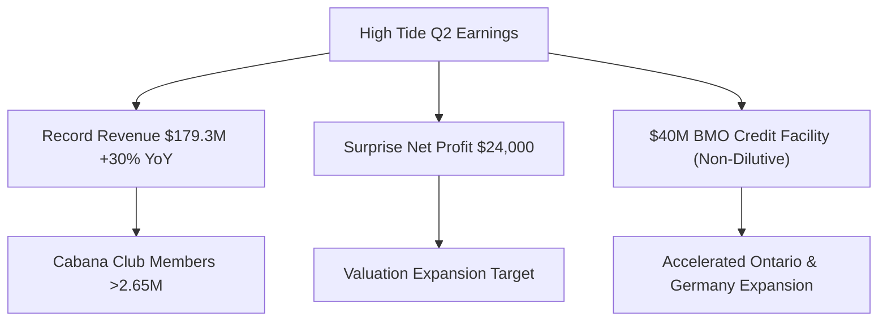

# 📊 Small-Cap & Penny Stock Intelligence Report
**Hedge Fund Trading Desk / Market Intelligence Division**  
**Date:** June 17, 2026  
**Market Stance:** Tactical Cautious Risk-Off (Pending FOMC Interest Rate Decision & Kevin Warsh's Fed Debut)

---

## 📈 Executive Summary

รายงานฉบับนี้จัดทำขึ้นเพื่อวิเคราะห์เจาะลึกโครงสร้างตลาด (Market Microstructure) ของหุ้นขนาดเล็ก (Small-Cap), Micro-Cap และหุ้นที่มีราคาต่ำกว่า $5 (Penny Stocks) จำนวน 5 ตัวที่มีความเคลื่อนไหวโดดเด่นในรอบ 24-72 ชั่วโมงที่ผ่านมา (ข้อมูลอ้างอิง ณ วันที่ 16-17 มิถุนายน 2026) โดยเน้นไปที่ปริมาณการซื้อขายที่สูงผิดปกติ (Volume Spike), ข้อมูลข่าวสารที่เป็นตัวเร่งปฏิกิริยาสำคัญ (Catalyst Analysis) และการไหลเข้าออกของเม็ดเงิน (Capital Flow)

สภาวะตลาดสหรัฐฯ ก่อนเปิดทำการปกติในวันที่ 17 มิถุนายน 2026 อยู่ในโหมด "ระมัดระวังสูงสุด" (Wait-and-See) เพื่อรอผลการประชุมนโยบายการเงิน (FOMC) ของ Fed ภายใต้การนำของประธานคนใหม่ **Kevin Warsh** แม้ว่าดัชนี Dow Jones จะเพิ่งทำสถิติสูงสุดเป็นประวัติศาสตร์ (All-Time High ปิดที่ 51,999.67) จากอานิสงส์ข้อตกลงสันติภาพสหรัฐฯ-อิหร่านที่ช่วยกดราคาน้ำมันดิบ Brent ร่วงลงต่ำกว่า $80 แต่ตลาด Nasdaq กลับแสดงสัญญาณการปรับฐาน (Sector Rotation) จากแรงเทขายทำกำไรกลุ่มบิ๊กเทคและเซมิคอนดักเตอร์ ทำให้เงินทุนบางส่วนเริ่มหมุนเวียนเข้าสู่หุ้นขนาดเล็กและหุ้นมูลค่า (Value/Cyclical Stocks) ที่มีปัจจัยบวกเฉพาะตัว อย่างไรก็ตาม ในกลุ่ม Micro-Cap นักลงทุนต้องเผชิญกับความผันผวนสูงจากกลไกทางเทคนิค และความเสี่ยงจากการเพิ่มทุน (Dilution Risk) ที่ยังคงเป็นประเด็นหลักในกลุ่มนี้

---

## 🔬 In-Depth Stock Analysis

### 1️⃣ High Tide Inc. (NASDAQ: HITI)
*Surprise Q2 Net Profit & BMO Non-Dilutive Credit Line Catalyst*

#### **1. Company Overview**
*   **Sector / Industry:** Consumer Cyclical / Specialty Retail (Cannabis)
*   **Market Cap:** ~$205 Million USD
*   **Current Price:** ~$3.10 (ราคาดีดขึ้น **+25%** ตอบรับงบการเงินไตรมาส 2)
*   **Average Volume (30D):** ~350,000 shares
*   **Float:** ~76.7 Million shares (Shares Outstanding: ~88M)
*   **Short Float %:** ~0.58% (ระดับต่ำมาก ปราศจากความกดดันจากแรงขายชอร์ต)
*   **Institutional Ownership:** ~10.61%
*   **Insider Ownership:** ~9.10%

#### **2. Price Action Analysis**
*   **Movement:** HITI กระโดดเปิด Gap Up ทะลุแนวต้านจิตวิทยาที่ระดับ $3.00 ขึ้นไปเคลื่อนไหวทดสอบช่วง $3.10 - $3.20 โครงสร้างราคาเปลี่ยนจากกรอบสะสมกำลังด้านล่างเป็นการเบรกเอาต์ทำจุดสูงใหม่ (Breakout Pattern)
*   **Microstructure:** สเปรด Bid-Ask แคบและมีสภาพคล่อง (Liquidity Quality) ที่หนาแน่นขึ้นอย่างมีนัยสำคัญ บ่งชี้ว่าไม่ใช่การปั่นราคาชั่วคราวแต่เป็นการจัดระเบียบราคาโดยผู้เล่นจริง
*   **Accumulation/Distribution:** สัญญาณการสะสม (Accumulation) ชัดเจน โดยเฉพาะจากสถาบันที่เน้นคุณค่า (Value-oriented Institutions) ที่มองเห็นสัญญาณการเปลี่ยนผ่านทางธุรกิจ

#### **3. Volume Analysis**
*   **Relative Volume (RVOL):** **>15x** เทียบกับค่าเฉลี่ยปกติ
*   **Volume Spike:** การซื้อขายคึกคักอย่างเป็นระบบสะท้อนความต้องการที่แท้จริง (Reasoned Buying)
*   **Smart Money Signal:** วอลุ่มส่วนใหญ่มาจากแรงซื้อสะสมของสถาบันและกองทุน ETF กลุ่มกัญชาที่ปรับเพิ่มสัดส่วนตามข่าวผลประกอบการที่เป็นบวก

#### **4. News & Catalyst Analysis**
*   **Catalyst (Earnings & Capital):** 
    1. รายงานรายได้ไตรมาส 2 สูงสุดเป็นประวัติการณ์ที่ **$179.3 ล้าน** (+30% YoY) และ Adjusted EBITDA แตะ **$13.9 ล้าน**
    2. พลิกกลับมารายงานกำไรสุทธิเป็นบวกที่ **$24,000** ซึ่งเป็นตัวเลขที่หาได้ยากยิ่งในอุตสาหกรรมกัญชาปัจจุบัน
    3. ได้รับอนุมัติวงเงินสินเชื่อใหม่มูลค่า **$40 ล้าน** จาก Bank of Montreal (BMO) ซึ่งเป็นเงินทุนแบบไม่มีการเจือจางมูลค่าหุ้น (Non-dilutive Debt)
*   **Bull vs Bear Case:**
    *   *Bull Case:* การเปิดร้าน Northern Helm 4 แห่งในแคนาดา และการเติบโตของ Remexian Pharma ในเยอรมนีจะช่วยเร่งรายได้และกำไรสุทธิให้โตอย่างก้าวกระโดดโดยไม่เจือจางหุ้น
    *   *Bear Case:* อัตรากำไรขั้นต้นอาจโดนกดดันหากคู่แข่งทำสงครามราคาในตลาดค้าปลีกแคนาดา

#### **5. Financial Health**
*   **Revenue Growth:** เติบโตแข็งแกร่งอย่างต่อเนื่อง (+30% YoY) หนุนด้วยยอดสมาชิก Cabana Club ที่มากกว่า 2.65 ล้านราย
*   **Runway & Dilution Risk:** **ต่ำมาก (Low)** วงเงินสินเชื่อ $40M จากสถาบันการเงินชั้นนำอย่าง BMO ยืนยันว่าบริษัทสามารถเข้าถึงแหล่งทุนต้นทุนต่ำได้โดยตรง ไม่จำเป็นต้องออกหุ้นใหม่เพิ่มทุนให้เจือจางสิทธิ์ผู้ถือหุ้นเดิม

#### **6. Market Sentiment**
*   **Retail Sentiment:** ชุมชนรายย่อย (Reddit / X) มีมุมมองเชิงบวกอย่างมาก ชื่นชมในฐานะ "หุ้นกัญชาตัวเดียวที่มีกำไรจริง" ระดับ FOMO อยู่ในเกณฑ์ปานกลางค่อนข้างสูงแต่มีรากฐานจากปัจจัยพื้นฐานรองรับ

#### **7. Technical Analysis**
*   **Trend Structure:** พลิกเป็นแนวโน้มขาขึ้นรอบใหม่ ราคายืนเหนือเส้น EMA 50 และ EMA 200 ได้อย่างเหนียวแน่น 
*   **Indicators:** RSI อยู่ที่ระดับ 68 ในรายวัน ชี้วัดความแข็งแกร่งของโมเมนตัม แต่ยังไม่เข้าสู่สภาวะ Overbought ที่อันตราย
*   **Support/Resistance:** แนวรับ: $2.80, $2.60 / แนวต้าน: $3.20, $3.50

#### **8. Risk Analysis & Rating**
*   **Risk Level:** **ความเสี่ยงปานกลาง (Medium Risk)**
*   **Threats:** ความล่าช้าในระดับนโยบายควบคุมกัญชาของรัฐบาลกลางสหรัฐฯ และความผันผวนเชิงระบบของกลุ่มสินค้าโภคภัณฑ์

---

### 2️⃣ CervoMed Inc. (NASDAQ: CRVO)
*Insider Confidence Buy & $10.5M Private Placement Catalyst*

#### **1. Company Overview**
*   **Sector / Industry:** Healthcare / Biotechnology
*   **Market Cap:** ~$23 Million USD
*   **Current Price:** ~$3.70 (พุ่งทะยาน **+49%** ตอบรับธุรกรรมผู้บริหารซื้อหุ้น)
*   **Average Volume (30D):** ~90,000 shares (ปกติสภาพคล่องค่อนข้างต่ำ)
*   **Float:** ~6.2 Million shares (Shares Outstanding: ~9.4M)
*   **Short Float %:** ~3.50% (Days to Cover ~6 วัน)
*   **Institutional Ownership:** ~35.00%
*   **Insider Ownership:** ~25.00% (เพิ่มขึ้นอย่างเด่นชัดหลังธุรกรรมล่าสุด)

#### **2. Price Action Analysis**
*   **Movement:** ดีดตัวเปิด Gap Up ชนแนวต้านแรกแถว $3.70 - $3.80 ในช่วงการเก็งกำไรรับข่าวผู้บริหารคนสำคัญเข้าสะสมหุ้น
*   **Microstructure:** โครงสร้าง Bid-Ask Spread ถ่างออกชั่วคราวเนื่องจากสภาพคล่องปกติค่อนข้างต่ำ ส่งผลให้เกิดแรงซื้อไล่ราคาได้ง่ายและมีความผันผวนของราคาระหว่างวินาทีสูง (High Volatility Level)
*   **Accumulation/Distribution:** เกิดสัญญาณการสะสมโดยข้อมูลภายใน (Insider Accumulation) ของผู้บริหารระดับประธานบริษัท

#### **3. Volume Analysis**
*   **Relative Volume (RVOL):** **>18x**
*   **Volume Spike:** การเข้าซื้อขายที่หนาแน่นช่วง Pre-Market สะท้อนว่าเครื่องสแกนราคาของ Momentum Traders พบความผิดปกติ
*   **Smart Money Signal:** สัญญาณวาฬชัดเจนจากการทำธุรกรรมของคนวงใน (Insider Buying) ล็อตใหญ่

#### **4. News & Catalyst Analysis**
*   **Catalyst (Insider & Funding):**
    1. การรายงานแบบฟอร์ม Form 4 ต่อ SEC ยืนยันว่า **Joshua S. Boger** (ประธานบอร์ดบริหาร) เข้าซื้อหุ้นเพิ่มในบัญชีส่วนตัวมูลค่ารวมถึง **$2,999,999** (955,414 หุ้น ที่ราคาเฉลี่ย $3.14)
    2. ประกาศข้อตกลงการระดมทุนแบบเฉพาะเจาะจง (Private Placement) ได้รับเงินสดเพิ่มอีก **$10.5 ล้าน**
    3. ตัวยาสำคัญ **neflamapimod** กำลังเตรียมเข้าสู่การทดลองทางคลินิก Phase 3 ในกลุ่มผู้ป่วยโรคสมองเสื่อม Lewy bodies (DLB)
*   **Bull vs Bear Case:**
    *   *Bull Case:* ยาผ่าน Phase 3 และสามารถปิดสัญญาจำหน่ายลิขสิทธิ์ (Licensing Deal) กับค่ายยาขนาดใหญ่ได้สำเร็จ
    *   *Bear Case:* ผลลัพธ์ทางคลินิกมีผลข้างเคียงหรือไม่มีประสิทธิภาพในการรักษาสูงพอ ซึ่งในธุรกิจไบโอเทคถือเป็นความเสี่ยงระดับ 0 หรือ 100 เท่านั้น (Binary Risk)

#### **5. Financial Health**
*   **Revenue Growth:** ไม่มีรายได้หลัก (Pre-revenue) เนื่องจากอยู่ในเฟสพัฒนาวิจัย
*   **Runway & Dilution Risk:** **ปานกลาง (Medium)** การได้เงินสด $10.5M ร่วมกับการซื้อหุ้นของผู้บริหารช่วยขยาย Cash Runway ให้ดำเนินงานต่อไปได้ถึงไตรมาส 2 ปี 2027 ช่วยคลายความตึงเครียดด้านงบการเงินชั่วคราว

#### **6. Market Sentiment**
*   **Retail Sentiment:** รายย่อยแสดงความตื่นตัวสูงมากต่อสตอรี่ "อินไซเดอร์ทุ่มเงิน $3 ล้านซื้อหุ้นตัวเอง" ในระดับราคา $3.14 ซึ่งถือเป็นหลักประกันความมั่นใจ (Margin of Safety) สำหรับรายย่อยระดับหนึ่ง

#### **7. Technical Analysis**
*   **Trend Structure:** พยายามสร้างโครงสร้างกลับตัวแบบก้นกระทะ (U-Shaped Reversal) เหนือเส้นค่าเฉลี่ย EMA 20
*   **Indicators:** RSI ขยับขึ้นสู่ 62 ในกรอบเวลารายวัน เกิดจุดตัดสีทอง (Golden Cross) ระยะสั้นในกราฟ 1 ชั่วโมง
*   **Support/Resistance:** แนวรับ: $3.14 (ทุนผู้บริหาร), $2.50 / แนวต้าน: $4.00, $4.50

#### **8. Risk Analysis & Rating**
*   **Risk Level:** **ความเสี่ยงสูง (High Risk)**
*   **Threats:** ความล้มเหลวในการทดลอง Phase 3 (Clinical Risk) และปัญหาการติดกับดักสภาพคล่อง (Liquidity Trap) เนื่องจากจำนวน Float หมุนเวียนที่จำกัด

---

### 3️⃣ NewGenIvf Group Limited (NASDAQ: NIVF)
*Settlement of Convertible Notes & Dilution Risk Elimination*

#### **1. Company Overview**
*   **Sector / Industry:** Healthcare / Medical Care Facilities (IVF Services)
*   **Market Cap:** ~$1.5 Million USD (Nano-Cap)
*   **Current Price:** ~$0.85 (พุ่งแรงกว่า **+141%** ในช่วง Pre-Market จากราคาปิดวันก่อนหน้าที่ ~$0.35)
*   **Average Volume (30D):** ~5.6 Million shares (หุ้นเก็งกำไรยอดนิยม)
*   **Float:** ~1.8 Million shares
*   **Short Float %:** ~2.1%
*   **Shares Outstanding:** ~2.78 Million shares
*   **Institutional Ownership:** <1.00%
*   **Insider Ownership:** ~60.00%

#### **2. Price Action Analysis**
*   **Movement:** ราคาพุ่งขึ้นแบบเกือบตั้งฉาก (Parabolic Spike) ข้ามจากกรอบตารางราคาเดิมขึ้นมาทดสอบแนวต้าน $0.80 - $0.90
*   **Microstructure:** โครงสร้างตลาดของ NIVF เผชิญกับสภาวะไล่ซื้อราคาอย่างรุนแรงจากรายย่อยและการทำงานของระบบเทรดอัตโนมัติ (HFT) สเปรดราคาเกิดการขยายตัวและผันผวนวินาทีต่อวินาที
*   **Accumulation/Distribution:** มีความเสี่ยงที่จะเป็นสัญญาณของการเทขายทำกำไรระยะสั้น (Opening Bell Fade) ของกลุ่มที่ซื้อสะสมมาก่อนหน้านี้ เนื่องจากเป็นการเก็งกำไรในเชิงโครงสร้างทางการเงินไม่ใช่รายได้จากการขยายงาน

#### **3. Volume Analysis**
*   **Relative Volume (RVOL):** **>50x**
*   **Volume Spike:** โวลุ่มพุ่งทะลุ 18.5 ล้านหุ้นใน Pre-Market สะท้อนว่าสภาพคล่องหมุนเวียน (Float) ถูกเปลี่ยนมือไปหลายรอบ (Float Churning)
*   **Smart Money Signal:** ไม่มีสัญญาณการสะสมของสถาบัน เป็นกระแสเงินเก็งกำไรระยะสั้นของรายย่อย (Retail Hot Money) เป็นหลัก

#### **4. News & Catalyst Analysis**
*   **Catalyst (Settlement Agreement):** บริษัทสามารถปิดข้อตกลงประนีประนอมยอมความ (Settlement Agreement) เพื่อซื้อคืนหุ้นกู้แปลงสภาพ (Convertible Notes) และใบสำคัญแสดงสิทธิ (Warrants) ทั้งหมดที่ค้างอยู่จากการออกเสนอขายในปี 2024-2025 โดยผู้ถือยอมความไม่ใช้สิทธิ์แปลงสภาพตราบเท่าที่ไม่ผิดสัญญา
*   **Market Response:** ตลาดมองว่าข่าวนี้เป็นตัวช่วยขจัดความเสี่ยงจากการถูกเจือจางมูลค่าหุ้น (Equity Overhang & Dilution Risk) ทำให้เกิดแรงซื้อปิดสถานะชอร์ตและเก็งกำไรเชิงเทคนิคัล
*   **Bull vs Bear Case:**
    *   *Bull Case:* การไม่มีตราสารแปลงสภาพค้างอยู่ช่วยให้โครงสร้างทุนสะอาด และพร้อมเข้าหาพันธมิตรใหม่
    *   *Bear Case:* ตัวธุรกิจหลักยังคงประสบปัญหาขาดทุนจากการดำเนินงาน และยังต้องการกระแสเงินสดหมุนเวียนในอนาคต

#### **5. Financial Health**
*   **Revenue Growth & Profitability:** รายได้ไม่เติบโตและยังมีสถานะขาดทุนสะสมต่อเนื่อง
*   **Cash runway:** อ่อนแอมาก เงินสดในมือมีจำกัด
*   **Dilution Risk:** **สูง (High)** แม้ว่าจะเคลียร์หุ้นกู้ชุดเดิมสำเร็จ แต่เพื่อความอยู่รอดของธุรกิจ บริษัทยังจำเป็นต้องประกาศระดมทุนรอบใหม่ (Offering Risk) ในระยะ 6-12 เดือนข้างหน้า

#### **6. Market Sentiment**
*   **Retail Sentiment:** เกิดความโลภและ FOMO ในกลุ่มเทรดเดอร์รายย่อยสูงมาก บอร์ดสนทนาคึกคักไปด้วยการโพสต์ภาพสถิติราคาบวก 100%+ โดยส่วนใหญ่เป็นการเก็งกำไรระยะสั้นรอบวัน (Day Trading) ไม่ได้เชื่อในปัจจัยพื้นฐาน

#### **7. Technical Analysis**
*   **Trend Structure:** ขาลงระยะยาวได้รับการกระตุ้นกลับตัวชั่วคราวในลักษณะ Dead Cat Bounce 
*   **Indicators:** RSI ในกราฟรายชั่วโมงทะลุ 80 เข้าเขต Overbought ขั้นรุนแรง ราคาเคลื่อนไหวอยู่เหนือกรอบ Bollinger Bands ด้านบนมาก บ่งชี้ความตึงตัวสูง
*   **Support/Resistance:** แนวรับ: $0.50, $0.35 / แนวต้าน: $1.00, $1.20

#### **8. Risk Analysis & Rating**
*   **Risk Level:** **ความเสี่ยงสูงมากที่สุด (Extreme Risk)**
*   **Threats:** ความเสี่ยงสูงมากที่จะถูกแรงเทขายขนาดใหญ่หลังตลาดเปิดทำการปกติ (Fade/Dump) และประวัติความเปราะบางของงบดุลของหุ้นระดับ Nano-Cap

---

### 4️⃣ Lunai Bioworks Inc. (NASDAQ: LNAI)
*Nasdaq Minimum Bid Price Compliance & Delisting Risk Mitigation*

#### **1. Company Overview**
*   **Sector / Industry:** Healthcare / Biotechnology
*   **Market Cap:** ~$11.3 Million USD
*   **Current Price:** ~$2.33 (ราคาดีดขึ้น **+133%** ในช่วง Pre-Market ตอบรับข่าวรอดจากการ delist)
*   **Average Volume (30D):** ~200,000 shares
*   **Float:** ~3.8 Million shares (Shares Outstanding: ~4.53M)
*   **Short Float %:** ~4.50%
*   **Institutional Ownership:** ~5.00%
*   **Insider Ownership:** ~12.00%

#### **2. Price Action Analysis**
*   **Movement:** ราคาพุ่งออกจากโซน $1.00 ขึ้นไปเคลื่อนไหวแถว $2.30 - $2.40 ปลดล็อกความอึดอัดหลังการรวมหุ้นทำดีลแตกพาร์ในช่วงปลายเดือนพฤษภาคม
*   **Microstructure:** ออร์เดอร์บุ๊กในฝั่งเสนอขายเริ่มมีความเบาบางเนื่องจากความมั่นใจของรายย่อย ทำให้เกิดการกระโดดของราคาได้เร็ว
*   **Accumulation/Distribution:** มีสัญญาณการปิดสถานะชอร์ต (Short Covering) ของกลุ่มที่ชอร์ตหุ้นเพื่อดัก delist ก่อนหน้านี้

#### **3. Volume Analysis**
*   **Relative Volume (RVOL):** **>20x**
*   **Volume Spike:** ปริมาณเทรดแตะระดับ 2.1 ล้านหุ้นในช่วง Pre-Market สูงกว่าค่าเฉลี่ยปกติอย่างมีนัยสำคัญ
*   **Flow Type:** ขับเคลื่อนโดยแรงซื้อเก็งกำไรของรายย่อยและโปรแกรมเทรดตามโมเมนตัมที่เข้ามาจับสัญญาณ Breakout

#### **4. News & Catalyst Analysis**
*   **Catalyst (Nasdaq Compliance):** ได้รับจดหมายแจ้งอย่างเป็นทางการจาก Nasdaq ว่าบริษัทได้ปฏิบัติตามเกณฑ์ราคาเสนอซื้อขั้นต่ำ $1.00 ต่อหุ้น (Minimum Bid Price Requirement) สำเร็จแล้ว โดยราคาสามารถปิดเหนือระดับ $1.00 ติดต่อกัน 10 วันทำการ หลังทำ Reverse Split 1-for-8 เมื่อเดือนพฤษภาคม 2569
*   **Bull vs Bear Case:**
    *   *Bull Case:* การคงสถานะใน Nasdaq ช่วยรักษาภาพลักษณ์และความเชื่อมั่นในการพัฒนาแพลตฟอร์ม AI Biodefense ของบริษัท
    *   *Bear Case:* บริษัทยังต้องอยู่ภายใต้การติดตามผลงานของ Nasdaq เป็นเวลา 1 ปี และผลการวิจัยทางคลินิกยังห่างไกลความสำเร็จเชิงพาณิชย์

#### **5. Financial Health**
*   **Revenue Growth & Cash Position:** บริษัทมี Cash Burn สูงตามปกติของกลุ่ม Biotech ระยะเริ่มต้น รายได้หลักยังไม่มีความแน่นอน
*   **Dilution Risk:** **สูงมาก (Very High)** หลังผ่านวิกฤต delisting และราคาหุ้นพุ่งขึ้น มักจะตามมาด้วยการประกาศขายหุ้นเพิ่มทุนแบบ ATM (At-The-Market offering) เพื่อเสริมสภาพคล่องเงินสดในคลัง

#### **6. Market Sentiment**
*   **Retail Sentiment:** ได้รับความสนใจจากกลุ่มเก็งกำไรไบโอเทคในประเด็นการหมดห่วงเรื่องข่าวร้ายระยะสั้น FOMO Level อยู่ในระดับสูง

#### **7. Technical Analysis**
*   **Trend Structure:** สร้างจุดกลับตัวระยะสั้น กราฟพยายามยืนยันแนวรับใหม่เหนือโซน $1.50
*   **Indicators:** RSI รายวันปรับขึ้นแตะ 64 ส่วนในรายชั่วโมงแตะ 78 แสดงระดับความตึงตัวสูง
*   **Support/Resistance:** แนวรับ: $1.50, $1.00 / แนวต้าน: $2.50, $3.00

#### **8. Risk Analysis & Rating**
*   **Risk Level:** **ความเสี่ยงสูงมาก (Very High Risk)**
*   **Threats:** ความเสี่ยงในการประกาศเพิ่มทุนตุนเงินสดหลังพ้น delisting (Offering Risk) และความผันผวนจากการขายทำกำไรของกลุ่มลากราคา

---

### 5️⃣ Sadot Group Inc. (NASDAQ: SDOT)
*Exclusive $125.5M California Property Acquisition Option & Low Float Squeeze*

#### **1. Company Overview**
*   **Sector / Industry:** Consumer Defensive / Farm Products (Agri-commodity Trading)
*   **Market Cap:** ~$21.61 Million USD
*   **Current Price:** ~$23.51 (ปิดตลาดวันก่อนหน้า ก่อนดีดขึ้น **+76.59%** ใน Pre-Market วันที่ 17 มิ.ย. สู่ระดับราคา ~$41.50)
*   **Average Volume (30D):** ~916,860 shares
*   **Float:** ~800,000 shares (หลังปรับสัดส่วนรวมหุ้น 1-for-20)
*   **Short Float %:** ~8.20%
*   **Shares Outstanding:** ~879,000 shares
*   **Institutional Ownership:** <1.00%
*   **Insider Ownership:** >50.00%

#### **2. Price Action Analysis**
*   **Movement:** โครงสร้างราคามีความตึงตัวและแกว่งตัวกว้างรุนแรง (ความผันผวนสูงมาก) โดยในวันที่ 16 มิ.ย. ราคาวิ่งในช่วงกว้างถึง $8.09 - $24.20 ก่อนจะพุ่งต่อใน Pre-Market วันที่ 17 มิ.ย. ขึ้นทดสอบโซน $40 - $42
*   **Microstructure:** โครงสร้างราคาแบบ Ultra-Low Float (หุ้นลอยตัวในตลาดน้อยกว่า 8 แสนหุ้นหลังทำ Reverse Split 1-for-20 ในปลายเดือนพฤษภาคม) ทำให้ราคาตอบสนองต่อปริมาณการสั่งซื้อได้อย่างรุนแรงและเกิดการจับคู่ซื้อขายที่สเปรดกว้างมาก
*   **Accumulation/Distribution:** เกิดสัญญาณการไล่บีบซื้อคืนของผู้เล่นฝั่งชอร์ต (Short Squeeze) ร่วมกับการทำราคากลุ่มจำกัด

#### **3. Volume Analysis**
*   **Relative Volume (RVOL):** **>30x**
*   **Volume Spike:** ปริมาณการซื้อขายในตลาดพรีมาร์เก็ตพุ่งขึ้นถึง 5.4 ล้านหุ้น ซึ่งคิดเป็นกว่า **6 เท่า (600%+) ของปริมาณจำนวนหุ้นหมุนเวียน (Float) ทั้งหมดของบริษัท** สะท้อนพฤติกรรมการเปลี่ยนมือแบบหมุนรอบอย่างหนักหน่วง (Extreme Churning)
*   **Smart Money Signal:** สัญญาณเก็งกำไรระยะสั้นขั้นรุนแรงโดยกลุ่ม Day Traders และโปรแกรม HFT

#### **4. News & Catalyst Analysis**
*   **Catalyst (Property Acquisition Option):** ประกาศรับสิทธิ์เลือกซื้อทรัพย์สินแต่เพียงผู้เดียวเป็นเวลา 6 เดือน (6-Month Exclusive Option) เพื่อเข้าซื้อพอร์ตอสังหาริมทรัพย์ประเภทที่อยู่อาศัย (Residential Properties) 7 แห่งในรัฐแคลิฟอร์เนีย รวม 147 ยูนิต มูลค่าดีลรวมประมาณ **$125.5 ล้านดอลลาร์**
*   **Market Response:** ตลาดตีความข่าวนี้เป็นการปรับเปลี่ยนกลยุทธ์ทางธุรกิจ (Strategic Pivot) จากการค้าสินค้าเกษตรที่มีความผันผวนสูงไปสู่กลุ่มธุรกิจอสังหาฯ ที่มีรายได้ค่าเช่าแน่นอน (Recurring Income)
*   **Bull vs Bear Case:**
    *   *Bull Case:* บริษัทสามารถปิดดีลและใช้แหล่งทุนเงินกู้ดอกเบี้ยต่ำในการบริหารพอร์ตสินทรัพย์ สร้างกระแสเงินสดมั่นคงระยะยาว
    *   *Bear Case:* ขนาดของดีลมูลค่า $125.5M นั้นมีขนาดใหญ่โตเกินกว่าฐานงบการเงินและขนาด Market Cap ของบริษัทในปัจจุบันอย่างมหาศาล ($21M Market Cap) ซึ่งอาจสร้างภาระหนี้สินและการค้ำประกันทางการเงินระดับสูงจนเป็นอันตรายต่อกิจการ

#### **5. Financial Health**
*   **Revenue Growth & Cash Burn:** ยอดขายธุรกิจเดิมค่อนข้างผันผวน และอยู่ระหว่างการปรับลดสัดส่วนธุรกิจร้านอาหารที่ไม่ทำกำไร (เช่น Muscle Maker Grill, Pokemoto)
*   **Dilution Risk:** **สูงมากที่สุด (Extreme Dilution Risk)** ดีลใหญ่ขนาดนี้มีความจำเป็นอย่างยิ่งที่จะต้องระดมทุนผ่านการออกตราสารหนี้แปลงสภาพหรือออกหุ้นเพิ่มทุนใหม่ เพื่อนำมาใช้เป็นเงินดาวน์หรือชำระค่าธรรมเนียมในการเข้าซื้อสินทรัพย์

#### **6. Market Sentiment**
*   **Retail Sentiment:** ได้รับการจัดหมวดหมู่เป็น "สุดยอดหุ้นซิ่งประจำวัน" รายย่อยเข้ามาเก็งกำไรเนื่องจากจำนวน Float ที่น้อยมาก ทำให้คาดเดาจุดสูงสุดของราคาได้ยาก ความโลภพุ่งกระฉูดในโซเชียลมีเดีย

#### **7. Technical Analysis**
*   **Trend Structure:** โครงสร้างราคาเกิดภาวะเก็งกำไรหลุดกรอบสถิติเดิม (Parabolic Breakout) 
*   **Indicators:** RSI ในกรอบ 1 ชั่วโมงพุ่งเกิน 85 สะท้อนความตึงตัวและความเสี่ยงในการเผชิญแรงขายทำกำไรฉับพลัน (Mean Reversion Risk)
*   **Support/Resistance:** แนวรับ: $23.50, $18.00 / แนวต้าน: $45.00, $50.00

#### **8. Risk Analysis & Rating**
*   **Risk Level:** **ความเสี่ยงสูงมากที่สุด (Extreme Risk)**
*   **Threats:** ความเสี่ยงสูงสุดจากกับดักสภาพคล่อง (Liquidity Trap) เนื่องจากสเปรดราคากว้างมาก ราคาอาจปรับฐานลดลงอย่างรวดเร็ว (Opening Bell Fade) และความกังวลเชิงลึกเกี่ยวกับขีดความสามารถทางการเงินในการปิดดีล $125.5M

---

## 🧠 Strategic Key Insights & Comparison

จากการวิเคราะห์เปรียบเทียบข้อมูลเชิงสถิติ โครงสร้างตลาด และตัวเร่งปฏิกิริยาของหุ้นทั้ง 5 ตัว สามารถจำแนกความโดดเด่นเพื่อให้นักเทรดนำไปประกอบการตัดสินใจดังนี้:

*   **หุ้นที่มีปัจจัยพื้นฐานดีที่สุดและ Momentum แข็งแกร่งที่สุด:** **High Tide Inc. (NASDAQ: HITI)** 
    *   *เหตุผล:* มีกำไรสุทธิเป็นบวกจริง รายได้โตต่อเนื่อง สมาชิกแข็งแกร่ง และได้วงเงินสินเชื่อ $40M จาก BMO โดยไม่เจือจางหุ้น ถือเป็นหุ้นเกรดสถาบัน (Institutional Grade) ในกลุ่ม Penny/Small-Cap
*   **หุ้นที่มีความมั่นใจจาก Smart Money สูงที่สุด:** **CervoMed Inc. (NASDAQ: CRVO)**
    *   *เหตุผล:* มีธุรกรรมจริงจากประธานบอร์ดซื้อหุ้นเก็บส่วนตัวถึง $3 ล้าน ซึ่งเป็นการแสดงความรับผิดชอบและเชื่อมั่นสูงมากในระดับราคา $3.14 เหมาะสำหรับนักลงทุนสายรอช้อนซื้อสะสมตามแนวย่อ
*   **หุ้นที่เป็นเพียงการเก็งกำไรทางวิศวกรรมการเงินและพร้อมโดนทุบ:** **NewGenIvf Group (NASDAQ: NIVF)** และ **Lunai Bioworks (NASDAQ: LNAI)**
    *   *เหตุผล:* การปิดหุ้นกู้ลดสิทธิ์เจือจางของ NIVF และการพ้น Delisting ของ LNAI ไม่ได้ส่งผลต่อความสามารถในการทำกำไรของธุรกิจหลัก เป็นเพียงความโล่งอกเชิงเทคนิคัลระยะสั้น มีความเสี่ยงที่จะเป็นเครื่องมือในการเทขายของกลุ่มผู้ถือหุ้นเดิม (Exit Liquidity)
*   **หุ้นที่มีความเสี่ยงสูงที่สุด แต่ผันผวนซิ่งแรงที่สุด:** **Sadot Group Inc. (NASDAQ: SDOT)**
    *   *เหตุผล:* ด้วย Float ที่มีเพียง 800,000 หุ้น แต่มีโวลุ่มพรีมาร์เก็ตสูงถึง 5.4 ล้านหุ้น (Turnover 600%+) ทำให้ราคาตอบสนองต่อแรงเก็งกำไรได้ไวมาก แต่ความเสี่ยงเพิ่มทุนและขนาดดีล $125.5M ที่ใหญ่เกินฐานะเป็นภัยคุกคามระยะยาว

---

## 📌 Daily Trading Watchlist & Ranking (June 17, 2026)

### **Daily Watchlist Categorization:**
*   **Top Momentum:** **Sadot Group Inc. (SDOT)** - วิ่งแรงตอบรับสตอรี่เปลี่ยนผ่านและโครงสร้างหุ้นบาง
*   **Top Risk:** **NewGenIvf Group (NIVF)** - ราคาพุ่งเกิน 140% จากเรื่องเชิงเทคนิคอล งบการเงินภายในยังอ่อนแอ
*   **Top Volume:** **NewGenIvf Group (NIVF)** - ปริมาณการซื้อขาย Pre-Market ทะลุ 18.5 ล้านหุ้น
*   **Top Catalyst:** **High Tide Inc. (HITI)** - ผลประกอบการมีกำไรสะท้อนผลงานจริงและได้วงเงิน BMO 
*   **Top Speculative Play:** **Lunai Bioworks (LNAI)** - การหลุดพ้นวิกฤต Delisting ช่วยดึงดูดกระแสความหวังระยะสั้น

---

### **🏆 Tactical Performance Ranking of the Day:**

#### 🥇 **หุ้นเด่นที่สุดของวัน (Top Focus of the Day):** **High Tide Inc. (NASDAQ: HITI)**
*   **Bias:** **BULLISH**
*   **กลยุทธ์การเทรด:** รอราคาย่อตัวไม่หลุดแนวรับสำคัญบริเวณ **$2.80 - $2.90** หรือรอจังหวะสะสมเมื่อราคาผ่านพ้น **$3.20** พร้อมปริมาณซื้อขายสะสมเพิ่มเป้าหมายระยะสั้นที่ **$3.50** และเป้าหมายถัดไปที่ **$3.80**

#### ⚠️ **หุ้นเสี่ยงที่สุดของวัน (Top Speculative Dilution Risk):** **NewGenIvf Group (NASDAQ: NIVF)**
*   **Bias:** **BEARISH / WAIT**
*   **กลยุทธ์การเทรด:** หลีกเลี่ยงการไล่ราคาในช่วงเปิดตลาดเด็ดขาด คาดว่าจะเผชิญแรงเทขายทำกำไรแบบฉับพลัน (Opening Bell Fade) ลงไปทดสอบแนวรับจิตวิทยาแถว **$0.50** ควรจับตาดูความเสถียรของราคาหากลงมาสร้างฐานบริเวณแนวรับก่อนพิจารณาเล่นเด้งระยะสั้น

#### 👀 **หุ้นที่ตลาดจับตาการเคลื่อนไหวมากที่สุด (Most Watched Volatility Squeeze):** **Sadot Group Inc. (NASDAQ: SDOT)**
*   **Bias:** **NEUTRAL (Extreme Volatility)**
*   **กลยุทธ์การเทรด:** ห้ามเล่นด้วยสัดส่วนพอร์ตที่ใหญ่ เนื่องจาก Float ที่บางจัดอาจทำให้เกิดจังหวะหลุดแนวรับร่วงดิ่งได้แรง แนะนำรอดูทิศทางความสามารถในการยืนฐานของราคาเหนือระดับ **$35.00** ในช่วงชั่วโมงซื้อขายปกติ หากราคายืนได้แข็งแกร่งและวอลุ่มยังไหลเข้าต่อเนื่อง อาจเล่นตามโมเมนตัมแบบปิดสถานะในวัน (Day Trade Only) เพื่อดักลุ้นแนวต้าน **$45.00 - $50.00**

---
*คำเตือนความเสี่ยง: การลงทุนในหุ้นขนาดเล็ก (Small-Cap) หุ้นราคาต่ำกว่า $5 (Penny Stocks) และหุ้นที่มีปริมาณซื้อขายเปลี่ยนมือรวดเร็ว มีความเสี่ยงในการสูญเสียเงินต้นในระดับสูงมาก นักลงทุนและเทรดเดอร์ควรทำความเข้าใจโครงสร้างราคา สภาพคล่อง และประวัติความต้องการเงินทุนของบริษัทอย่างถ่องแท้ พร้อมทั้งกำหนดจุดตัดขาดทุน (Stop Loss) อย่างเคร่งครัดในทุกคำสั่งซื้อขาย รายงานฉบับนี้จัดทำขึ้นเพื่อการวิเคราะห์พฤติกรรมข้อมูลตลาดเท่านั้น ไม่ใช่คำแนะนำหรือการชักชวนเพื่อการซื้อขายหลักทรัพย์ใด ๆ ทั้งสิ้น*
