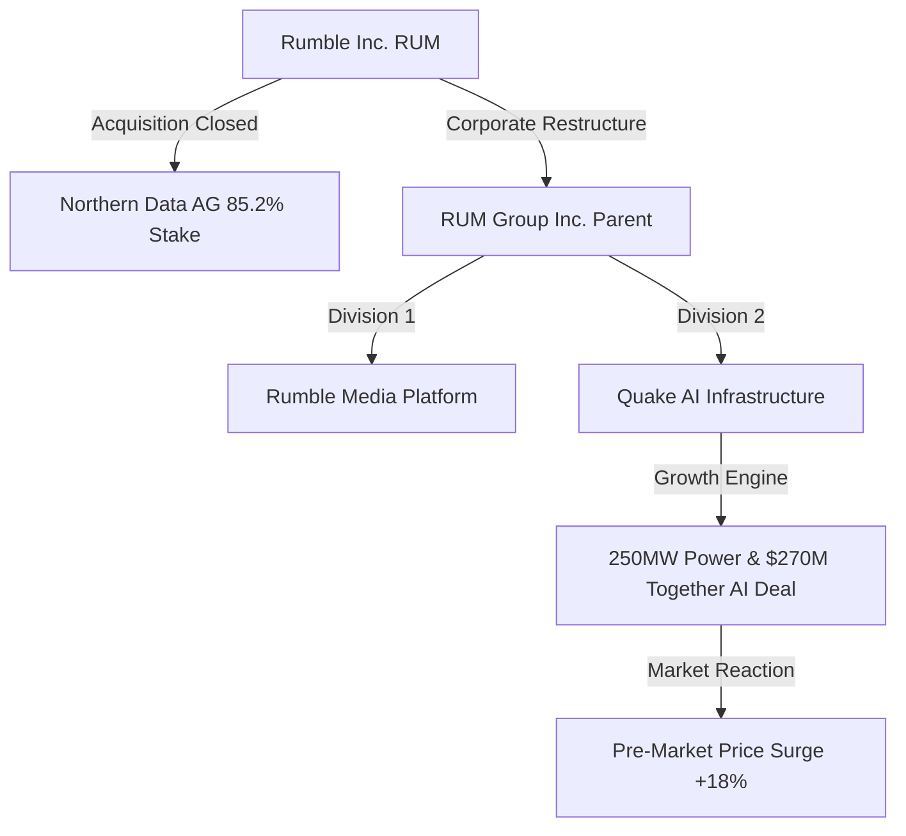
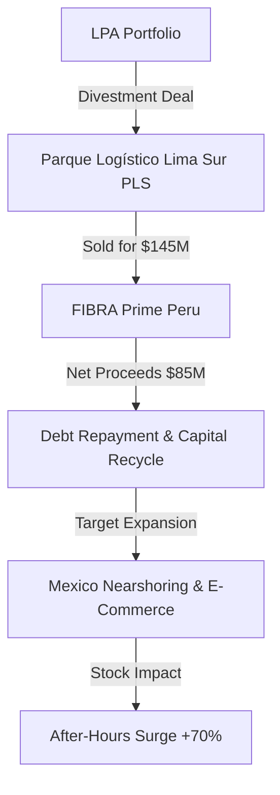
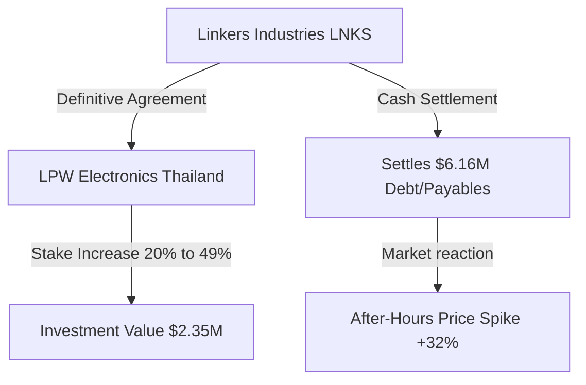
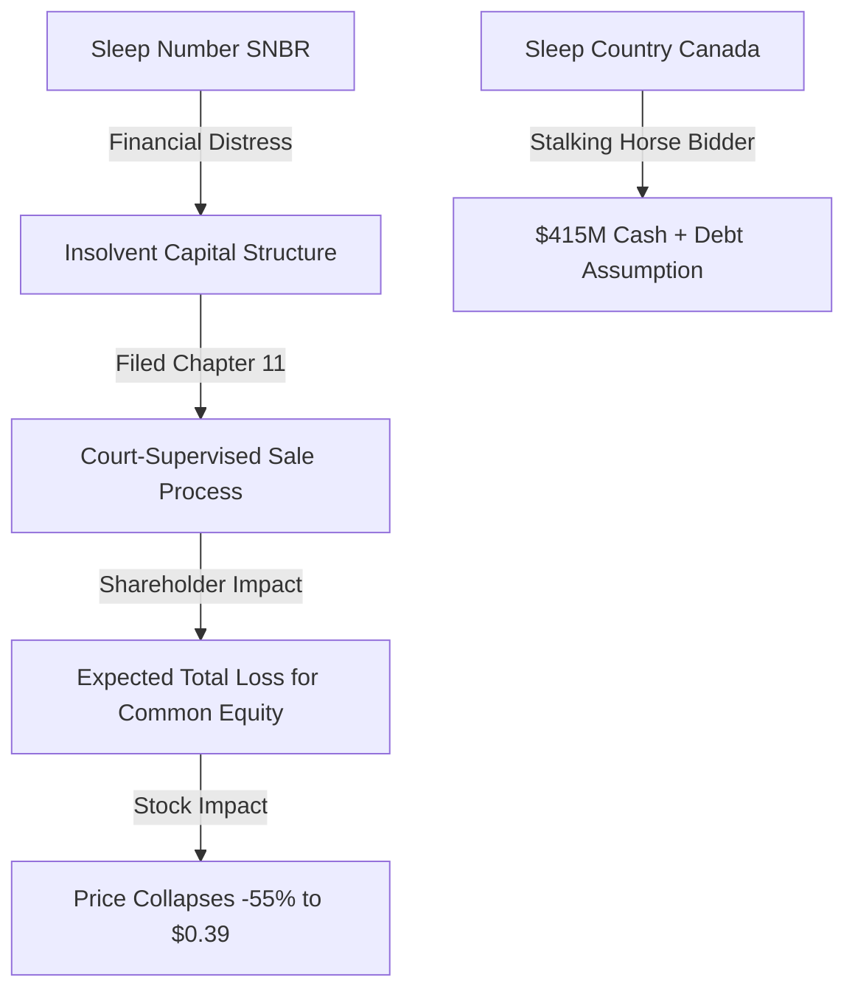
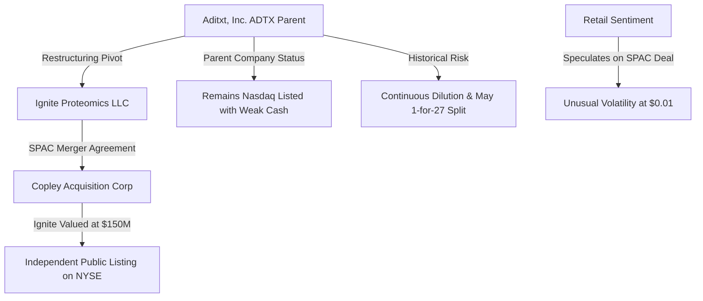

# 📊 Small-Cap & Penny Stock Intelligence Report
**Hedge Fund Trading Desk / Market Intelligence Division**  
**Date:** June 18, 2026  
**Market Stance:** Tactical Risk-On in Selective Catalysts / Extreme Caution on Distressed Assets (Amid AI Re-rating & Restructuring Waves)

---

## 📈 Executive Summary

รายงานฉบับนี้จัดทำขึ้นเพื่อวิเคราะห์เจาะลึกโครงสร้างตลาด (Market Microstructure) ของหุ้นขนาดเล็ก (Small-Cap), Micro-Cap และ Penny Stocks จำนวน 5 ตัวที่มีความเคลื่อนไหวโดดเด่นและมีปริมาณการซื้อขายหนาแน่นผิดปกติ (Volume Spike) ในรอบ 24-72 ชั่วโมงที่ผ่านมา (ข้อมูลอ้างอิง ณ วันที่ 17-18 มิถุนายน 2026) โดยเน้นไปที่ข่าวสารที่เป็นตัวเร่งปฏิกิริยาสำคัญ (Catalyst Analysis) และการไหลเข้าออกของเม็ดเงิน (Smart Money Flow)

ในสัปดาห์นี้ สภาวะตลาดเผชิญกับคลื่นลมสำคัญหลายด้าน โดยเฉพาะกระแสการปรับโครงสร้างธุรกิจของบริษัทขนาดเล็กเพื่อความอยู่รอด มีทั้งกลุ่มที่ประสบความสำเร็จในการยกระดับธุรกิจไปสู่ AI Narrative เช่น **Rumble (RUM)** ที่เสร็จสิ้นการควบรวมกิจการกับ Northern Data AG และกลุ่มบริษัทอสังหาริมทรัพย์และอุตสาหกรรมที่ปรับปรุงโครงสร้างการเงิน เช่น **Logistic Properties of the Americas (LPA)** และ **Linkers Industries (LNKS)** ในขณะเดียวกัน ภาวะการเงินตึงตัวได้บีบให้บริษัทที่งบการเงินเปราะบางต้องเข้าสู่กระบวนการล้มละลายหรือเผชิญการเจือจางมูลค่าหุ้นอย่างรุนแรง เช่น **Sleep Number (SNBR)** ที่ยื่น Chapter 11 และ **Aditxt (ADTX)** ที่พยายามเอาตัวรอดด้วยการ Spin-off กิจการ

การวิเคราะห์ในรายงานนี้มุ่งเน้นข้อมูลเชิงประจักษ์ (Data-Driven) เพื่อแยกแยะระหว่าง "หุ้นที่มีการซื้อขายแบบมีเหตุผลรองรับ (Reasoned Accumulation)" และ "หุ้นที่ขับเคลื่อนด้วยการเก็งกำไรไร้ทิศทาง (Speculative Hype)" เพื่อเป็นแนวทางในการเฝ้าระวังความเสี่ยงและการทำ Watchlist ก่อนตลาดเปิดทำการ

---

## 🔬 In-Depth Stock Analysis

### 1️⃣ Rumble Inc. (NASDAQ: RUM)
*Strategic AI Infrastructure Pivot & Northern Data AG Acquisition Closing*



#### **1. Company Overview**
*   **Sector / Industry:** Communication Services / Interactive Media & Services
*   **Market Cap:** ~$2.58 - $3.00 Billion USD (Small-to-Mid Cap)
*   **Current Price:** ~$8.50 (ปรับตัวขึ้น **+17% - +18%** ในช่วง Pre-Market / After-Hours)
*   **Average Volume (30D):** ~2.6 Million shares
*   **Float:** ~101 Million shares (Shares Outstanding: ~340M - 436M)
*   **Short Float %:** ~25.65% (ระดับสูงมาก มีศักยภาพในการเกิด Short Squeeze รุนแรง)
*   **Institutional Ownership:** ~9.40%
*   **Insider Ownership:** ~35.00% (ผู้บริหารกลุ่มผู้ก่อตั้งยังมีสิทธิ์โหวตเสียงข้างมาก)

#### **2. Price Action Analysis**
*   **Movement:** ราคาพุ่งกระโดดเปิด Gap Up ทะลุกรอบสะสมตัวเดิมที่ระดับ $7.20 ขึ้นมาทดสอบแนวต้านจิตวิทยาที่ $8.50 - $9.00 ถือเป็นการทำ Breakout Pattern ที่มีนัยสำคัญที่สุดในรอบเดือน
*   **Microstructure:** ออร์เดอร์บุ๊กมีสภาพคล่อง (Liquidity Quality) หนาแน่นขึ้นอย่างเห็นได้ชัด การเคลื่อนไหวของราคาเป็นระเบียบ มีการตั้งรับที่มั่นคงฝั่ง Bid บ่งชี้ว่ามีแรงซื้อสถาบันร่วมไล่ราคา (Institutional Chasing)
*   **Accumulation/Distribution:** พบสัญญาณการสะสมตัวชัดเจน (Accumulation) จากกลุ่มนักลงทุนระยะยาวที่มองเห็นโอกาสการปรับระดับมูลค่าหุ้น (Valuation Multiples) ไปเป็นหุ้นโครงสร้างพื้นฐาน AI

#### **3. Volume Analysis**
*   **Relative Volume (RVOL):** **>5.5x** เทียบกับค่าเฉลี่ยปกติ
*   **Volume Spike:** การซื้อขายคึกคักตั้งแต่ Pre-Market โดยปริมาณหุ้นเปลี่ยนมือทะลุหลายล้านหุ้น สะท้อนถึงการเข้ามาทำราคาของผู้เล่นรายใหญ่
*   **Smart Money Signal:** สัญญาณกระแสเงินไหลเข้าชัดเจน (Whale Accumulation) เป็นผลมาจากการปิดดีลใหญ่ที่เป็นรูปธรรม ไม่ใช่ข่าวลือเก็งกำไรทั่วไป

#### **4. News & Catalyst Analysis**
*   **Catalyst (M&A & Restructure):**
    1. ปิดดีลเข้าซื้อหุ้น **85.2%** ของ **Northern Data AG** อย่างเป็นทางการในวันที่ 17 มิถุนายน 2026
    2. ปรับโครงสร้างองค์กรจัดตั้งโฮลดิ้งใหม่ในชื่อ **RUM Group Inc.** (มีผล 18 มิถุนายน 2026) โดยแบ่งธุรกิจเป็น 2 ขา: **Rumble** (แพลตฟอร์มสื่อ) และ **Quake AI** (ธุรกิจคลาวด์และโครงสร้างพื้นฐาน AI)
    3. Northern Data ประกาศปรับเพิ่มประมาณการรายได้ปี 2026 ขึ้นสู่ระดับ 170–190 ล้านยูโร หนุนด้วยสัญญาคลาวด์มูลค่า **$270 ล้าน** ร่วมกับ Together AI
*   **Bull vs Bear Case:**
    *   *Bull Case:* ธุรกิจใหม่ Quake AI มีสินทรัพย์โรงไฟฟ้า 250 MW และระบบประมวลผล GPU ที่พร้อมสร้างรายได้ประจำ (Recurring AI Revenue) หนุนมูลค่าบริษัทโตระยาว
    *   *Bear Case:* อัตรากำไรขั้นต้นอาจได้รับผลกระทบในช่วงแรกเนื่องจากรายจ่ายฝ่ายทุน (CapEx) ในการสร้าง AI Datacenter อยู่ในระดับสูงมาก

#### **5. Financial Health**
*   **Revenue Growth:** รายได้รวม Q1 2026 อยู่ที่ $25.5 ล้าน (ลดลงเล็กน้อยจาก Q4 2025 ที่ $27.1M) บ่งชี้ว่าธุรกิจแพลตฟอร์มเดิมเริ่มชะลอตัว การได้ธุรกิจ AI เข้ามาจึงเป็นตัวเร่งการเติบโตที่จำเป็น
*   **Cash & Debt Position:** มีเงินสด $219.0 ล้าน ไม่มีหนี้สินระยะยาว (Zero Long-term Debt) ถือว่าสถานะทางการเงินแข็งแกร่งมาก
*   **Runway & Dilution Risk:** **ต่ำ (Low)** เงินสดในมือร่วมกับการซื้อสินทรัพย์ที่เริ่มทำรายได้ ช่วยลดความจำเป็นในการเพิ่มทุนแบบฉับพลันในระยะ 12 เดือนข้างหน้า

#### **6. Market Sentiment**
*   **Retail Sentiment:** รายย่อยใน Reddit และ X แสดงความกระตือรือร้นสูงมากในธีม "AI Pivot" ระดับ FOMO ขยับขึ้นสู่เกณฑ์สูง แต่เป็นความโลภที่มีปัจจัยบวกรองรับ (Fundamental-Driven Greed) มีแรงหนุนเพิ่มเติมจากเป้าหมายที่จะเกิด Short Squeeze ในฝั่งผู้เล่นขาชอร์ตที่ติดหล่ม 25.65%

#### **7. Technical Analysis**
*   **Trend Structure:** พลิกแนวโน้มในระยะสั้นเป็นขาขึ้นทันที ราคาทะลุเส้นค่าเฉลี่ย EMA 50 และ EMA 200 ยืนยันสัญญาณกลับตัว
*   **Indicators:** RSI ในกราฟ 1 วันขยับตัวขึ้นมาที่ระดับ 58 ชี้วัดความแข็งแกร่งของทิศทาง แต่ยังไม่อยู่ในจุด Overbought ที่มีความเสี่ยงสูง
*   **Support/Resistance:** แนวรับ: $7.20, $7.50 / แนวต้าน: $9.00, $10.00

#### **8. Risk Analysis & Rating**
*   **Risk Level:** **ความเสี่ยงปานกลาง (Medium Risk)**
*   **Threats:** ความเสี่ยงในการรวมระบบเทคโนโลยีและวัฒนธรรมองค์กรของ Northern Data (Execution Risk) และภาวะการแข่งขันที่รุนแรงในตลาด AI Cloud

---

### 2️⃣ Logistic Properties of the Americas (NYSE American: LPA)
*Asset-Light Strategy Pivot: $145M Peru Logistics Park Divestment*



#### **1. Company Overview**
*   **Sector / Industry:** Real Estate / Real Estate Services
*   **Market Cap:** ~$90 - $114 Million USD (Micro-Cap)
*   **Current Price:** ~$4.50 (พุ่งทะยานแรงกว่า **+70%** ในช่วง After-Hours ตอบรับข่าวดีลขายทรัพย์สิน)
*   **Average Volume (30D):** ~16,000 shares (สภาวะปกติสภาพคล่องต่ำมากเข้าขั้นขาดสภาพคล่อง)
*   **Float:** ~708,000 shares (สถาบันถือครองส่วนใหญ่ หุ้นหมุนเวียนในตลาดจริงน้อยมาก)
*   **Short Float %:** ~4.19%
*   **Shares Outstanding:** ~31.6 Million shares
*   **Institutional Ownership:** ~5.00%
*   **Insider Ownership:** ~60.00%

#### **2. Price Action Analysis**
*   **Movement:** ราคากระโดด Gap Up รุนแรงใน After-Hours ทะยานผ่านแนวต้านเดิมบริเวณ $3.00 ขึ้นมาเคลื่อนไหวเหนือ $4.50 โครงสร้างราคาแบบนี้มีลักษณะเป็น News-Driven Breakout
*   **Microstructure:** เนื่องจากหุ้นตัวนี้ปกติมีปริมาณหมุนเวียน (Float) ต่ำมาก แรงซื้อที่หลั่งไหลเข้ามาจึงดันราคาสูงขึ้นอย่างรวดเร็ว (Volatility Spike) โดยมีส่วนต่าง Bid-Ask Spread ที่กว้างและผันผวนสูง
*   **Accumulation/Distribution:** ตลาดมองเห็นคุณค่าแฝง (Book Value Support) ที่ราคา $8.00 ต่อหุ้นจากการประเมินราคาสินทรัพย์ ส่งผลให้เกิดการกว้านซื้อสะสมของนักลงทุนที่คาดหวังส่วนลดราคาตลาด (Discount to NAV)

#### **3. Volume Analysis**
*   **Relative Volume (RVOL):** **>50x** เทียบกับค่าเฉลี่ยปกติ 16K
*   **Volume Spike:** ปริมาณซื้อขายใน After-Hours ขยับตัวขึ้นมาหนาแน่นผิดปกติจนสร้างสัญญาณบนเครื่องสแกนของระบบ Day Trading อัตโนมัติ
*   **Smart Money Signal:** เป็นการหมุนเวียนเม็ดเงินที่ชาญฉลาด (Capital Recycling) แต่สภาพคล่องในตลาดรองส่วนใหญ่ยังเป็นกลุ่มเก็งกำไรระยะสั้นไล่ซื้อข่าว

#### **4. News & Catalyst Analysis**
*   **Catalyst (Asset Sale):**
    1. ประกาศเป็นพันธมิตรเชิงกลยุทธ์กับ FIBRA Prime เพื่อขายคลังสินค้าที่เป็นเรือธงในเปรู *Parque Logístico Lima Sur (PLS)* มูลค่า **$145 ล้านดอลลาร์**
    2. คาดว่าจะได้รับเงินสดสุทธิ (Net Proceeds) ประมาณ **$85 ล้านดอลลาร์** หลังหักภาระหนี้เดิมแล้ว
    3. ปรับเปลี่ยนโมเดลธุรกิจเป็น Asset-Light โดยจะยังทำหน้าที่บริหารโครงการ PLS ต่อ และจะนำเงิน $85 ล้านไปลงทุนขยายธุรกิจในประเทศ **เม็กซิโก** เพื่อรับโอกาสจากกระแส Nearshoring และ E-commerce ในสหรัฐฯ
*   **Bull vs Bear Case:**
    *   *Bull Case:* การปลดล็อกมูลค่าเงินสด $85 ล้านช่วยล้างหนี้และเพิ่มความยืดหยุ่นในการหาโครงการผลตอบแทนสูงในเม็กซิโก
    *   *Bear Case:* การสูญเสียรายได้ค่าเช่าหลักในเปรูอาจทำให้รายได้ช่วงเปลี่ยนผ่านเติบโตลดลงชั่วคราว

#### **5. Financial Health**
*   **Revenue Growth & EPS:** ผลประกอบการล่าสุดขาดทุนสุทธิ $0.25 ต่อหุ้น มีภาระดอกเบี้ยจ่ายสูงจากเงินกู้อัตราดอกเบี้ยลอยตัว
*   **Runway & Dilution Risk:** **ต่ำ (Low)** เงินสด $85 ล้านจากการขายทรัพย์สินทำให้อัตราส่วนหนี้สินต่อทุนลดลงอย่างมีนัยสำคัญ ขจัดความเสี่ยงในการออกหุ้นเพิ่มทุน (No Dilution Risk) ในช่วง 1-2 ปีข้างหน้า

#### **6. Market Sentiment**
*   **Retail Sentiment:** ชุมชนรายย่อยเข้ามาเก็งกำไรระยะสั้นตามข่าวการปลดล็อกมูลค่าทางบัญชี (Book Value Play) ความกังวลด้านสภาพคล่องทำให้ระดับความกลัวลดลงชั่วคราว ดึงดูดนักเก็งกำไรประเภทเสี่ยงสูง

#### **7. Technical Analysis**
*   **Trend Structure:** ดีดตัวตัดเส้นค่าเฉลี่ย EMA 50 ขึ้นมาทำแนวโน้มฟื้นตัว กราฟระยะ 1 ชั่วโมงเปลี่ยนทิศทางเป็นขาขึ้นชัดเจน
*   **Indicators:** RSI รายชั่วโมงทะยานเข้าเขต Overbought ที่ 75 แต่ RSI รายวันขยับจาก 38 ขึ้นมาแถว 52 สะท้อนว่ายังมีช่องว่างให้ปรับฐานก่อนตึงตัว
*   **Support/Resistance:** แนวรับ: $3.00 (อดีตแนวต้านสำคัญ), $2.65 / แนวต้าน: $5.00, $5.50

#### **8. Risk Analysis & Rating**
*   **Risk Level:** **ความเสี่ยงสูง (High Risk)**
*   **Threats:** สภาพคล่องการซื้อขายปกติในวันทำงานทั่วไปที่เบาบาง (Liquidity Trap Risk) อาจทำให้ผู้เล่นรายย่อยซื้อแล้วขายออกยากหากกระแสข่าวนี้เงียบหายไป รวมถึงความไม่แน่นอนในการดำเนินการสร้างสินทรัพย์ใหม่ในเม็กซิโก

---

### 3️⃣ Linkers Industries Ltd (NASDAQ: LNKS)
*Stake Increase Catalyst: Thailand LPW Electronics Deal & High Float Churn*



#### **1. Company Overview**
*   **Sector / Industry:** Industrials / Electrical Equipment (Wire Harness Manufacturing)
*   **Market Cap:** ~$2.60 - $2.83 Million USD (Nano-Cap)
*   **Current Price:** ~$1.65 (ปรับตัวขึ้น **+32%** ใน After-Hours)
*   **Average Volume (30D):** ~913,000 shares
*   **Float:** ~1.50 Million shares (Shares Outstanding: ~1.61M)
*   **Short Float %:** ~22.50% (จำนวนหุ้นชอร์ตถือว่าสูงมากเมื่อเทียบกับขนาด Float)
*   **Institutional Ownership:** <1.00%
*   **Insider Ownership:** ~50.00%

#### **2. Price Action Analysis**
*   **Movement:** ราคาเบรกกรอบสะสมโซนล่างที่ $1.20 - $1.30 พุ่งขึ้นทดสอบแนวต้านจิตวิทยาที่ $1.65 - $1.80 ในช่วงการเก็งกำไรนอกเวลาทำการปกติ
*   **Microstructure:** ด้วยความที่เป็นหุ้นระดับ Nano-Cap ที่มี Float หมุนเวียนค่อนข้างน้อย ส่งผลให้ออร์เดอร์ฝั่ง Ask มีความเบาบาง แรงซื้อที่กระแทกเข้ามาเพียงเล็กน้อยก็สามารถขยับช่วงราคา (Tick Size) ขึ้นได้เร็วแบบ Parabolic 
*   **Accumulation/Distribution:** มีสัญญาณการปิดสถานะฝั่งชอร์ต (Short Covering) ของกลุ่มที่ทำชอร์ตไว้เพื่อรอความล้มเหลวของกิจการ ช่วยสร้างแรงส่งในการซื้อเก็งกำไรระยะสั้น

#### **3. Volume Analysis**
*   **Relative Volume (RVOL):** **>10x**
*   **Volume Spike:** โวลุ่มพุ่งกระโดดในจังหวะข่าวออก สะท้อนการทำงานของ HFT และกลุ่ม Momentum Traders ที่เข้ามาตั้งรับหุ้นตามระบบแจ้งเตือน
*   **Smart Money Signal:** วาฬยังไม่มีสัญญาณเข้ามาสะสมระยะยาว ส่วนใหญ่เป็นกระแสเงินหมุนรอบสั้นของรายย่อย (Retail Hot Money Flow)

#### **4. News & Catalyst Analysis**
*   **Catalyst (Acquisition & Debt Restructuring):**
    1. ประกาศข้อตกลงอย่างเป็นทางการเมื่อวันที่ 17 มิถุนายน 2026 ในการเข้าซื้อหุ้นเพิ่มของบริษัท **LPW Electronics Co., Ltd.** (ผู้ผลิตชุดสายไฟในประเทศไทย) อีก 29% มูลค่าลงทุน **$2.35 ล้านดอลลาร์**
    2. ธุรกรรมนี้จะทำให้อัตราถือครองหุ้นเพิ่มขึ้นจาก 20% เป็น **49%**
    3. นอกเหนือจากการถือหุ้นเพิ่ม บริษัทยังดำเนินการชำระคืนหนี้การค้าค้างจ่ายของ LPW มูลค่า **$6.16 ล้านดอลลาร์** เป็นเงินสด ณ วันปิดดีล
*   **Bull vs Bear Case:**
    *   *Bull Case:* การเพิ่มสัดส่วนในโรงงานผลิตประเทศไทยช่วยย้ายฐานอุตสาหกรรมหลบเลี่ยงกำแพงภาษีการค้าและเพิ่มอัตรากำไรขั้นต้น
    *   *Bear Case:* เงินที่ต้องใช้จ่ายรวมกว่า $8.5 ล้าน (ค่าหุ้น + ปิดหนี้) เป็นจำนวนเงินที่สูงเกินฐานะทางการเงินปัจจุบันของบริษัทอย่างมาก

#### **5. Financial Health**
*   **Balance Sheet:** ข้อมูลการเงินล่าสุดมีเงินสด $4.37 ล้าน มีหนี้รวม $1.46 ล้าน (สถานะเงินสดสุทธิ $2.91M) ซึ่งไม่เพียงพอต่อการจ่ายปิดดีล $8.5 ล้านโดยไม่พึ่งพาแหล่งเงินทุนภายนอก
*   **Dilution Risk:** **สูงมาก (Very High)** จากข้อจำกัดด้านสภาพคล่อง คาดว่าบริษัทจำเป็นจะต้องออกเสนอขายหุ้นเพิ่มทุนแบบเร่งด่วน (Convertible Debt หรือ Placement Offering) เพื่อมาจ่ายค่าปิดธุรกรรมดังกล่าว ซึ่งจะทำให้เกิด Equity Overhang และเสี่ยงโดนเททับหลังดีลเสร็จสิ้น

#### **6. Market Sentiment**
*   **Retail Sentiment:** เกิดความตื่นตัวในระดับสูง (FOMO) ในหมู่ Day Traders จากทิศทางราคาบวกมากกว่า 30% ชุมชนอินเทอร์เน็ตมองดีลนี้ในแง่บวกเกี่ยวกับตลาดต่างประเทศ แต่ขาดการคำนึงถึงงบดุลที่ตึงตัว

#### **7. Technical Analysis**
*   **Trend Structure:** โครงสร้างราคาอยู่ในทิศทางฟื้นตัวขึ้นจากจุดต่ำสุดเดิม แต่ยังมีข้อจำกัดจากเส้นค่าเฉลี่ยระยะยาวรายสัปดาห์
*   **Indicators:** RSI ขยับตัวขึ้นมาที่ระดับ 45 ในกรอบเวลารายวัน พยายามสร้างจุดตัด Golden Cross ในกรอบเวลา 15 นาที
*   **Support/Resistance:** แนวรับ: $1.56, $1.30 / แนวต้าน: $1.85, $2.00

#### **8. Risk Analysis & Rating**
*   **Risk Level:** **ความเสี่ยงสูงมาก (Very High Risk)**
*   **Threats:** ความเสี่ยงสูงมากจากการเจือจางหุ้นเนื่องจากการออกเสนอขายหุ้นใหม่ (Offering/Dilution Risk) และความผันผวนสูงเนื่องจากมูลค่าตลาดระดับ Nano-Cap ที่เอื้อต่อการทำราคาแบบปั่นระยะสั้น (Pump & Dump Behavior)

---

### 4️⃣ Sleep Number Corporation (NASDAQ: SNBR)
*Distressed Asset: Chapter 11 Bankruptcy Filing & Sleep Country Canada Stalking Horse Bid*



#### **1. Company Overview**
*   **Sector / Industry:** Consumer Cyclical / Home Furnishings
*   **Market Cap:** ~$5 - $17 Million USD (Micro-Cap หลังเกิดเหตุการณ์วิกฤตราคา)
*   **Current Price:** ~$0.39 (ร่วงดิ่งลงอย่างรุนแรงกว่า **-55%** หลังประกาศข่าว)
*   **Average Volume (30D):** ~2.6 Million shares (วอลุ่มเฉลี่ยเดิมก่อนเกิดวิกฤต)
*   **Float:** ~18.6 Million shares
*   **Short Float %:** ~28.50% - 33.00% (ผู้เล่นฝั่งชอร์ตทำกำไรก้อนโตจากเหตุการณ์ล้มละลาย)
*   **Shares Outstanding:** ~23.05 Million shares
*   **Institutional Ownership:** ~74.98% (ส่วนใหญ่อยู่ระหว่างการทิ้งขายแบบถอนย้ายทุน)
*   **Insider Ownership:** ~6.54%

#### **2. Price Action Analysis**
*   **Movement:** ราคาเบรกพังแนวรับทุกระดับ (Breakdown Pattern) ร่วงลงเปิด Gap Down ขนาดใหญ่เกือบตั้งฉาก สู่ระดับต่ำสุดประวัติศาสตร์ที่บริเวณ ~$0.39
*   **Microstructure:** ฝั่งเสนอซื้อ (Bid) มีความแห้งและเบาบางมาก เนื่องจากทุกคนตระหนักถึงมูลค่าหุ้นที่อาจกลายเป็นศูนย์ ออร์เดอร์ส่วนใหญ่เป็นแรงขายหนีตายของกองทุนสถาบันที่ถูกบังคับขายตามเกณฑ์พอร์ตลงทุน (Mandatory Liquidation)
*   **Accumulation/Distribution:** สัญญาณการกระจายสินค้าของจริงและรุนแรง (Institutional Distribution) ไม่แนะนำให้นักลงทุนเข้าไปช้อนซื้อตามแนวรับทางเทคนิค

#### **3. Volume Analysis**
*   **Relative Volume (RVOL):** **>10x** (และแตะระดับ 21.5 ล้านหุ้นในบางช่วงของการซื้อขาย)
*   **Volume Spike:** การเปลี่ยนมือของปริมาณหุ้นสูงอย่างน่าตกใจ สะท้อนถึงการเปลี่ยนถ่ายสินทรัพย์จากสถาบันไปสู่กลุ่มรายย่อยที่ขาดข้อมูลเชิงลึก
*   **Smart Money Signal:** สถาบันสละเรือ (Smart Money Exit) ส่วนแรงซื้อมาจากกลุ่มรายย่อยที่เล่นพนันกับเศษราคาหุ้นเน่า (Bankruptcy Speculators)

#### **4. News & Catalyst Analysis**
*   **Catalyst (Bankruptcy & Restructuring):**
    1. ยื่นคำร้องขอฟื้นฟูกิจการภายใต้ **Chapter 11 Bankruptcy** เมื่อวันที่ 12 มิถุนายน 2026 เพื่อเตรียมขายกิจการทั้งหมด
    2. มี **Sleep Country Canada** เป็นผู้เสนอซื้อนำเป็นคนแรก (Stalking Horse Bidder) ด้วยวงเงินเงินสด **$415 ล้านดอลลาร์** ควบรวมกับการรับภาระหนี้สินบางส่วน
    3. *ผลกระทบต่อผู้ถือหุ้นเดิม:* คำเตือนอย่างเป็นทางการจากบอร์ดบริหารชี้ชัดว่า โครงสร้างทุนและภาระหนี้สินระดับสูงเกินกว่ามูลค่าเสนอซื้อ ส่งผลให้ผู้ถือหุ้นสามัญเดิม (Common Shareholders) มีโอกาสสูงมากที่จะเผชิญกับ **การสูญเสียมูลค่าหุ้นทั้งหมด (Total Loss/Wipeout)**
*   **Bull vs Bear Case:**
    *   *Bull Case:* แทบไม่มีในเชิงพื้นฐานสำหรับหุ้นสามัญ (Common Equity) นอกจากความหวังลมๆ แล้งๆ ว่าจะมีผู้บิดแข่งให้ราคาที่ครอบคลุมหนี้สินทั้งหมด ซึ่งยากจะเกิดขึ้น
    *   *Bear Case:* หุ้นจะถูกเพิกถอน (Delisting) จากกระดานหลัก Nasdaq ในเร็วๆ นี้ และเข้าสู่ตลาดสีชมพู (OTC Pink Sheets) ในสถานะไร้มูลค่า

#### **5. Financial Health**
*   **Solvency Profile:** บริษัทสิ้นเนื้อประดาตัว มีเงินสดเพียง **$1.48 ล้านดอลลาร์** แต่มีหนี้สินท่วมตัวสูงถึง **$953.76 ล้านดอลลาร์** 
*   **Revenue Growth:** รายได้ Q1 2026 หดตัวแรง **-18.9% YoY** ยอดขายร่วงลงต่ำกว่าจุดคุ้มทุน ส่งผลให้ไม่มีความสามารถในการชำระหนี้สิน

#### **6. Market Sentiment**
*   **Retail Sentiment:** อารมณ์ตลาดฝั่งรายย่อยเต็มไปด้วยความสับสนและการเก็งกำไรแนวพนัน (Dead Cat Bounce speculation) บางบอร์ดเริ่มมีการเชิญชวนเข้าซื้อเพื่อหวังหักหลังชอร์ตเซกเตอร์ (Short Squeeze Hope) ซึ่งถือเป็นการวิเคราะห์ที่เข้าใจผิดเนื่องจากปัจจัยล้มละลายผูกมัดไว้ชัดเจน

#### **7. Technical Analysis**
*   **Trend Structure:** ทิศทางราคาพังทลายเป็นแนวโน้มขาลงถาวร (Structural Downward Trend)
*   **Indicators:** RSI รายวันจมลึกในระดับตึงตัวรุนแรงที่ **27.0** เข้าเขต Oversold ขั้นสุด แต่สัญญาณนี้ไม่มีความหมายในบริบทของหุ้นที่จะถูกล้างสถานะ
*   **Support/Resistance:** แนวรับ: ไม่มี (ประเมินว่ามีมูลค่าทางทฤษฎีใกล้ $0.00) / แนวต้าน: $0.80, $1.00

#### **8. Risk Analysis & Rating**
*   **Risk Level:** **ความเสี่ยงสูงมากที่สุด (Extreme Risk)**
*   **Threats:** ความเสี่ยงสูงสุดในการถูก delisted ออกจากตลาด และเงินลงทุนทั้งหมดของผู้ถือหุ้นสามัญมีโอกาสกลายเป็นศูนย์ (Bankruptcy/Wipeout Risk)

---

### 5️⃣ Aditxt, Inc. (NASDAQ: ADTX)
*Ignite Proteomics $150M SPAC Merger Spin-off & Extreme Dilution Play*



#### **1. Company Overview**
*   **Sector / Industry:** Healthcare / Biotechnology
*   **Market Cap:** ~$4,000 - $11,000 USD (ระดับ Micro-Cap ขั้นรุนแรงมาก หรือ Shell Company Value)
*   **Current Price:** ~$0.01 (ซื้อขายแถวราคาเศษสตางค์ต่ำสุดตามข้อกำหนด)
*   **Average Volume (30D):** ~279.58 Million shares (ยอดเทรดเปลี่ยนมือรอบจัด)
*   **Float:** ~605,921 shares (จำนวนหุ้นหมุนเวียนจำกัดสะท้อนถึงการปรับสัดส่วนรวมหุ้นบ่อยครั้ง)
*   **Short Float %:** ~11.40% - 15.40%
*   **Shares Outstanding:** ~815,921 shares
*   **Institutional Ownership:** ~3.11%
*   **Insider Ownership:** ~25.74%

#### **2. Price Action Analysis**
*   **Movement:** ราคาแกว่งตัวกว้างรุนแรงในช่วง $0.009 - $0.015 มีสภาวะการไล่ราคาสลับแรงเทขายชนแนวรับเป็นรอบๆ ในลักษณะเก็งกำไรข่าวลือ
*   **Microstructure:** โครงสร้าง Bid-Ask ของ ADTX เกือบจะกลายสภาพเป็นสลัวเนื่องจากราคาสินค้าอยู่ใกล้ $0.01 การจับคู่สั่งซื้อมีความหนืดและผันผวนสูง ทุกๆ 0.001 ดอลลาร์ที่เปลี่ยนแปลงคิดเป็นเปอร์เซ็นต์ที่สูงมาก
*   **Accumulation/Distribution:** ข้อมูลในอดีตยืนยันพฤติกรรมกระจายหุ้นเพื่อหาทางรอด (Exit Liquidity Distribution) การดึงราคาขึ้นระยะสั้นมักจะตามมาด้วยการเพิ่มยอดแชร์ในพอร์ต

#### **3. Volume Analysis**
*   **Relative Volume (RVOL):** **>15x** เทียบกับยอดฐานหมุนเวียนหมวดปกติ
*   **Volume Spike:** ปริมาณโวลุ่มสะสมเฉียดร้อยล้านหุ้น สะท้อนพฤติกรรมการปั่นเปลี่ยนมือของ Day Traders กลุ่มจำกัดและการเข้าออกของบอทเทรด HFT
*   **Smart Money Signal:** สัญญาณเตือนความเสี่ยงด้านลบจากกลุ่มวาฬสถาบันที่หลีกเลี่ยงการสะสม มีเพียงนักลงทุนอินไซเดอร์ที่ขยับยอดเพื่อการปรับเปลี่ยนสิทธิ์บริหาร

#### **4. News & Catalyst Analysis**
*   **Catalyst (SPAC Spin-off):**
    1. รายงานดีลข้อตกลงควบรวมกิจการของบริษัทลูก **Ignite Proteomics** กับบริษัท SPAC **Copley Acquisition Corp** เพื่อดันเข้าจดทะเบียนในตลาดหลักทรัพย์นิวยอร์ก (NYSE) แบบอิสระ
    2. ดีลนี้ประเมินมูลค่า Ignite Proteomics ไว้ที่ **$150 ล้านดอลลาร์** โดย Aditxt จะยังคงรักษาสถานะความเป็นบริษัทจดทะเบียนบนกระดาน Nasdaq แยกต่างหาก
    3. แต่งตั้ง **Jeffrey M. Busch** ขึ้นดำรงตำแหน่งซีอีโอชั่วคราวควบตำแหน่งซีอีโอของ Ignite Proteomics
*   **Bull vs Bear Case:**
    *   *Bull Case:* หากการ Spin-off สำเร็จ มูลค่าทรัพย์สินของ Ignite ที่ถือครองอยู่อาจช่วยพยุงและขยายมูลค่าฐานทุนของ Aditxt ได้บ้างในฐานะบริษัทแม่
    *   *Bear Case:* ธุรกิจแม่ของ Aditxt เองแทบไม่เหลือสินทรัพย์ทำเงินหลัก และยังขาดแคลนสภาพคล่องเงินสดขั้นวิกฤต

#### **5. Financial Health**
*   **Insolvency & Cash Burn:** ยอดเงินสดสำรองงวดล่าสุดเหลือเพียง **$374,000 ดอลลาร์** สวนทางกับหนี้สิ้นระยะสั้นสูงถึง **$4.23 ล้านดอลลาร์** (ส่วนของผู้ถือหุ้นติดลบอย่างรุนแรง) รายได้หลักในไตรมาสแรกของปี 2026 มีเพียงแค่ **$12,200 ดอลลาร์** เท่านั้น ขณะที่ขาดทุนสะสมบานปลายไปถึง $15.9 ล้าน
*   **Dilution & Split Risk:** **ระดับสูงสุด (Extreme Risk)** บริษัทเพิ่งทำ **Reverse Stock Split ในอัตรา 1-for-27** ไปเมื่อวันที่ 18 พฤษภาคม 2026 เพื่อต่อลมหายใจเรื่องเกณฑ์ราคาปิดของ Nasdaq หากทิศทางราคายังปักหัวลงต่อเนื่อง มีโอกาสสูงมากที่จะเกิดการรวบหุ้นซ้ำสองและขยายการเพิ่มทุนผ่านใบสำคัญแสดงสิทธิ์ (Warrants Offering)

#### **6. Market Sentiment**
*   **Retail Sentiment:** ได้รับการปั่นกระแสบนเครือข่ายโซเชียลมีเดียในหมวด "SPAC Merger Rumor" เทรดเดอร์ในบอร์ดรายย่อยต่างเข้ามาเล่นตามโมเมนตัมเศษสตางค์หวังกำไรระดับร้อยเปอร์เซ็นต์ในข้ามคืน (Pure Speculative Play)

#### **7. Technical Analysis**
*   **Trend Structure:** กราฟทำจุดต่ำสุดใหม่ต่อเนื่องยาวนาน (Chronic Downward Trend)
*   **Indicators:** RSI จมลึกถึงระดับ **19.9** ซึ่งทางเทคนิคถือว่า Oversold อย่างรุนแรงและอาจเกิดแรงดีดสะท้อนกลับสั้นๆ แบบ Dead Cat Bounce ได้ทุกเมื่อ แต่ไม่มีความแข็งแรงในทิศทางหลักรองรับ
*   **Support/Resistance:** แนวรับ: $0.009 (ระดับต่ำสุดประวัติศาสตร์) / แนวต้าน: $0.018, $0.020

#### **8. Risk Analysis & Rating**
*   **Risk Level:** **ความเสี่ยงสูงมากที่สุด (Extreme Risk)**
*   **Threats:** ความเสี่ยงภัยคุกคามจากการเจือจางมูลค่าหุ้นอย่างรุนแรง (Continuous Dilution) ความเสี่ยงการล่มสลายทางการเงิน (Insolvency Risk) และความเปราะบางในการถูก Nasdaq เพิกถอนสถานะการจดทะเบียน (Delisting)

---

## 🧠 Strategic Key Insights & Comparison

จากข้อมูลวิจัยและโครงสร้างทางจุลภาคของตลาดข้างต้น สามารถสรุปข้อมูลสำคัญเพื่อวางแผนกลยุทธ์การลงทุนดังนี้:

```
┌───────────────────────────────────────────────────────────────────────────┐
│                           STRATEGIC MATRIX                                │
├──────────────┬──────────────────┬───────────────────┬─────────────────────┤
│    Ticker    │ Primary Driver   │ Liquidity Quality │ Dilution/Credit Risk│
├──────────────┼──────────────────┼───────────────────┼─────────────────────┤
│     RUM      │ AI Infra Pivot   │ High/Stable       │ Low (Well-capital)  │
│     LPA      │ Asset Divestment │ Very Low/Volatile │ Low (Post-deal cash)│
│     LNKS     │ Acquisition      │ Low/High Churn    │ High (Cash deficit) │
│     SNBR     │ Chapter 11/Sale  │ Distressed Flee   │ Extreme (Wipeout)   │
│     ADTX     │ SPAC Spin-off    │ Speculative HFT   │ Extreme (Chronic)   │
└──────────────┴──────────────────┴───────────────────┴─────────────────────┘
```

1. **หุ้นที่มีโครงสร้างปัจจัยพื้นฐานดีที่สุดและโมเมนตัมแข็งแกร่งที่สุด:** **Rumble Inc. (NASDAQ: RUM)**
   * *เหตุผล:* โครงสร้างงบดุลแข็งแกร่งที่สุด (ไม่มีหนี้สินระยะยาว, เงินสด $219M) และการควบรวม Northern Data มีสตอรี่ที่ขับเคลื่อนด้วยกำไรและเทคโนโลยี AI โครงสร้างราคาและปริมาณการซื้อขายสะท้อนการซื้อสะสมของสถาบันที่เชื่อถือได้
2. **หุ้นที่มีการฟื้นฟูทางการเงินเด่นชัดที่สุดจากการ Recycle ทุน:** **Logistic Properties of the Americas (NYSE American: LPA)**
   * *เหตุผล:* การขายสินทรัพย์ในเปรูทำเงินสดคืนคลัง $85M ซึ่งช่วยปลดเปลื้องหนี้ทั้งหมดและปูพรมขยายงานไปเม็กซิโก แม้หุ้นจะขาดสภาพคล่องปกติ แต่ด้วยมูลค่า Book Value แฝงหนุนราคาทำให้มี Margin of Safety ดีขึ้น
3. **หุ้นที่เป็นการเก็งกำไรระยะสั้นตามกระแสโซเชียลสูงที่สุด:** **Aditxt, Inc. (NASDAQ: ADTX)**
   * *เหตุผล:* การ Spin-off บริษัทลูกไปเข้า SPAC เป็นการสร้างข่าวดีเพื่อกลบปัญหางบการเงินและปัญหาส่วนผู้ถือหุ้นติดลบของบริษัทแม่ เป็นหุ้นที่รายย่อยเข้ามาเก็งกำไรเล่นสั้นวินาทีต่อวินาที เสี่ยงสูงที่จะเกิดการทุบราคาและเพิ่มทุนซ้ำซาก
4. **หุ้นที่เป็นกับดักความเสี่ยงล้มละลายที่ต้องเลี่ยงเด็ดขาด:** **Sleep Number Corporation (NASDAQ: SNBR)**
   * *เหตุผล:* ข่าวการยื่น Chapter 11 ชี้แจงชัดเจนว่ามูลค่าหนี้เกือบ 1 พันล้านดอลลาร์ท่วมสินทรัพย์ที่เสนอซื้อ ส่งผลให้ผู้ถือหุ้นสามัญมีโอกาสไม่ได้รับอะไรกลับคืนมาเลย การขึ้นลงของราคาต่อจากนี้เป็นเพียงการทำชอร์ตคัฟเวอร์หรือการดึงราคาเพื่อเทขายครั้งสุดท้ายของรายย่อย (Dead Cat Bounce)

---

## 📌 Daily Trading Watchlist & Ranking (June 18, 2026)

### **Daily Watchlist Categorization:**
*   **Top Momentum:** **Rumble Inc. (RUM)** – มีแรงซื้อสะสมเบรกเอาท์กรอบเดิมพร้อมกับปริมาณวอลุ่มเข้าหนุนหนาแน่น
*   **Top Risk:** **Sleep Number Corporation (SNBR)** – ความเสี่ยงสูงมากที่ส่วนของผู้ถือหุ้นจะกลายเป็นศูนย์หลังยื่นขอล้มละลาย
*   **Top Volume:** **Aditxt, Inc. (ADTX)** – ปริมาณการซื้อขายเฉียดร้อยล้านหุ้นบนเศษราคาสตางค์
*   **Top Catalyst:** **Rumble Inc. (RUM)** – การปิดดีลควบรวม Northern Data และปรับโครงสร้างสู่ AI Group
*   **Top Speculative Play:** **Linkers Industries (LNKS)** – การเทรดตามโมเมนตัมข่าวโรงงานสายไฟประเทศไทย บนสัดส่วน Float บาง

---

### **🏆 Tactical Performance Ranking of the Day:**

#### 🥇 **หุ้นเด่นที่สุดของวัน (Top Focus of the Day):** **Rumble Inc. (NASDAQ: RUM)**
*   **Bias:** **BULLISH (Buy-on-Dip / Momentum Breakout)**
*   **กลยุทธ์การเทรด:** คาดว่าราคาจะยืนระยะเหนือแนวรับสำคัญแถว **$7.20 - $7.50** ได้อย่างเหนียวแน่น แนะนำรอจังหวะราคาย่อตัวลงมาทดสอบบริเวณดังกล่าวหรือรอจังหวะซื้อเมื่อราคาทะลุผ่านระดับ **$9.00** เพื่อไปเป้าหมายถัดไปที่ **$10.00** โดยกำหนดจุดตัดขาดทุน (Stop Loss) ไว้ใต้เส้นค่าเฉลี่ยที่ระดับ **$7.10**

#### ⚠️ **หุ้นเสี่ยงที่สุดของวัน (Top Speculative / Insolvency Risk):** **Sleep Number Corporation (NASDAQ: SNBR)**
*   **Bias:** **BEARISH / AVOID (หลีกเลี่ยงเด็ดขาด)**
*   **กลยุทธ์การเทรด:** ห้ามหลงเข้าไปช้อนซื้อตามสัญญาณทางเทคนิคเด็ดขาด คาดว่าจะเผชิญแรงขายอย่างต่อเนื่องจนอาจไหลลงลึกและเตรียมนับถอยหลังการถอนชื่อออกจากกระดานหลัก (Delisting Track) หุ้นตัวนี้เหมาะสำหรับให้ผู้เล่นฝั่งชอร์ตเฝ้าดักขายทำกำไรในจังหวะเด้งชั่วคราวเท่านั้น ไม่เหมาะกับพอร์ตถือครองทุกกรณี

#### 👀 **หุ้นที่ตลาดจับตาการเคลื่อนไหวมากที่สุด (Most Watched Asset-Light Re-rating):** **Logistic Properties of the Americas (NYSE American: LPA)**
*   **Bias:** **NEUTRAL (Extreme Volatility / Wait for Base)**
*   **กลยุทธ์การเทรด:** เนื่องจากปกติสภาพคล่องของหุ้นบางจัด การวิ่งบวกกว่า 70% ใน After-Hours อาจกระตุ้นให้เกิดแรงขายทำกำไร ณ จุดเปิดตลาดปกติ (Opening Bell Fade) แนะนำห้ามรีบร้อนกระโดดไล่ราคาในช่วงเปิดตลาด ให้รอดูทิศทางการตั้งฐานและการสร้างแนวรับรอบใหม่เหนือระดับ **$3.50 - $4.00** หากสามารถยืนฐานได้อย่างแข็งแรงและปริมาณการขายชะลอตัวลง ค่อยเข้าเก็งกำไรระยะสั้นเป้าหมายแนวต้านแถว **$5.00 - $5.50**

---
*คำเตือนความเสี่ยง: การลงทุนในหุ้นขนาดเล็ก (Small-Cap) หุ้นราคาต่ำกว่า $5 (Penny Stocks) และหุ้นที่มีสถานะฟื้นฟูกิจการหรือประสบปัญหาหนี้สิน มีความเสี่ยงในการสูญเสียเงินต้นสูงมาก เทรดเดอร์ควรศึกษาโครงสร้างงบดุล รายละเอียดเอกสารรายงานล้มละลายหรือแผนการระดมทุนอย่างรอบคอบ พร้อมทั้งกำหนดวินัยในการหยุดขาดทุน (Stop Loss) อย่างเคร่งครัด รายงานฉบับนี้มีวัตถุประสงค์เพื่อให้ข้อมูลการวิเคราะห์ตลาดตามหลักสถิติเชิงประจักษ์เท่านั้น ไม่ใช่คำเชิญชวนหรือแนะนำชี้ชวนซื้อขายหลักทรัพย์แต่ประการใด*
