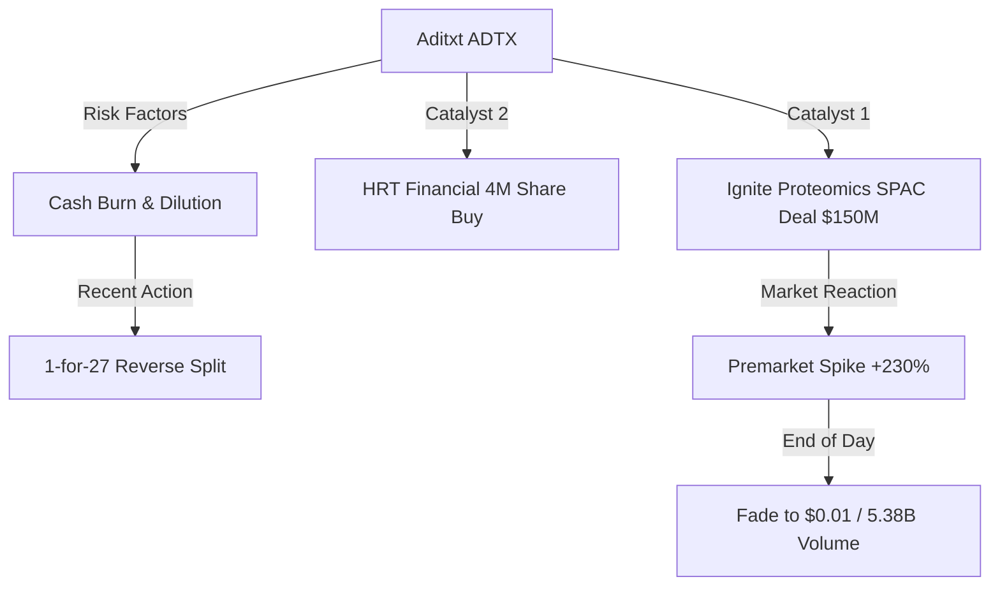
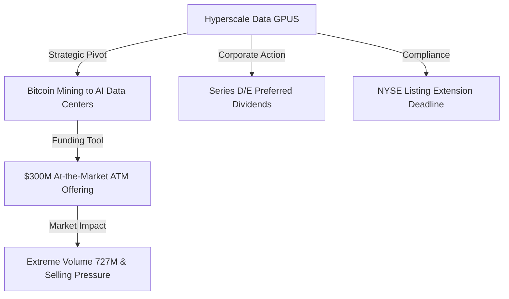
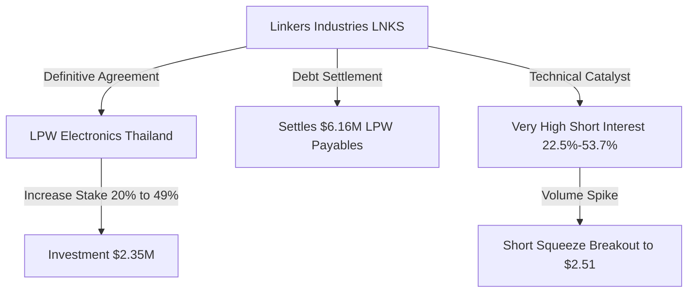
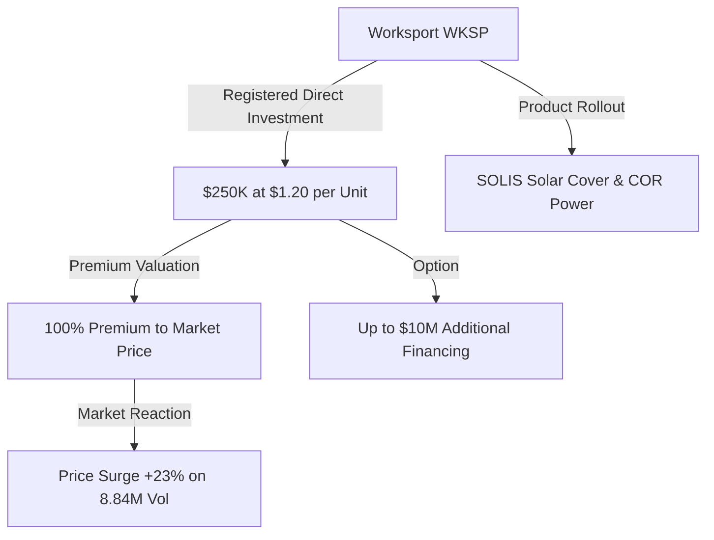
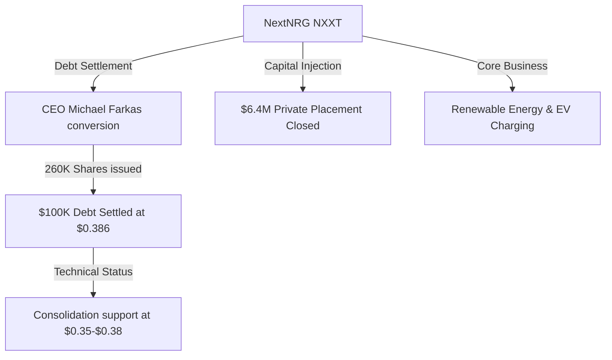

# 📊 Small-Cap & Penny Stock Intelligence Report
**Hedge Fund Trading Desk / Market Intelligence Division**  
**Date:** June 19, 2026  
**Market Stance:** Selective Catalyst-Driven Play / Extreme Dilution Alert / Holiday Consolidation (U.S. Markets Closed for Juneteenth)

---

## 📈 Executive Summary

รายงานฉบับนี้จัดทำขึ้นเพื่อวิเคราะห์เจาะลึกโครงสร้างตลาด (Market Microstructure) ของหุ้นขนาดเล็ก (Small-Cap), Micro-Cap และ Penny Stocks จำนวน 5 ตัวที่มีความเคลื่อนไหวโดดเด่นและมีปริมาณการซื้อขายหนาแน่นผิดปกติ (Volume Spike) ในรอบ 24-72 ชั่วโมงที่ผ่านมา (ข้อมูลอ้างอิง ณ วันที่ 18 มิถุนายน 2026 ซึ่งเป็นวันซื้อขายล่าสุดก่อนวันหยุดราชการ Juneteenth ในวันที่ 19 มิถุนายน 2026) โดยเน้นไปที่ข่าวสารที่เป็นตัวเร่งปฏิกิริยาสำคัญ (Catalyst Analysis) และการไหลเข้าออกของเม็ดเงิน (Smart Money Flow)

ในสัปดาห์นี้ ท่ามกลางดัชนีหลักอย่าง S&P 500 และ Nasdaq ที่เผชิญแรงกดดันและปรับตัวลดลงในวันที่ 18 มิถุนายน ผู้เล่นประเภทเก็งกำไรได้ย้ายเงินทุนเข้าสู่กลุ่มหุ้นที่มีมูลค่าตลาดต่ำและมีข่าวเฉพาะตัว โดยเฉพาะกลุ่มพลังงานหมุนเวียนและโครงสร้างพื้นฐาน AI เช่น **Hyperscale Data (GPUS)** และ **NextNRG (NXXT)** ที่อยู่ระหว่างการปรับโครงสร้างทุนรวมถึงการหาพันธมิตร ขณะที่กลุ่มสินค้าอุตสาหกรรมและยานยนต์ขนาดเล็กอย่าง **Linkers Industries (LNKS)** และ **Worksport (WKSP)** มีกระแสเงินทุนไหลเข้าอย่างมีนัยสำคัญจากข่าวมูลค่าเชิงบวกในเอเชียตะวันออกเฉียงใต้และดีลการเสนอขายหุ้นพรีเมียมตามลำดับ อย่างไรก็ตาม ความเสี่ยงด้านการเจือจางมูลค่าหุ้น (Dilution Risk) ยังคงอยู่ในระดับสูงมากสำหรับหุ้นประเภทนี้ โดยเฉพาะ **Aditxt (ADTX)** ที่เผชิญกับการหมุนเวียนโวลุ่มซื้อขายที่สูงถึงระดับ 5.38 พันล้านหุ้นในสภาวะการเก็งกำไรอย่างรุนแรง

การวิเคราะห์ในรายงานนี้มุ่งเน้นข้อมูลเชิงประจักษ์ (Data-Driven) เพื่อแยกแยะระหว่าง "หุ้นที่มีกระแสเงินสะสมที่เป็นระบบ (Systematic Accumulation)" และ "หุ้นเก็งกำไรระยะสั้นที่เป็นเพียงการสร้างสภาพคล่องเพื่อทางรอด (Exit Liquidity Play)" เพื่อเป็นแนวทางในการเฝ้าระวังความเสี่ยงและการทำ Watchlist สำหรับการเทรดในสัปดาห์ถัดไป

---

## 🔬 In-Depth Stock Analysis

### 1️⃣ Aditxt, Inc. (NASDAQ: ADTX)
*Speculative Volatility Play: SPAC Spin-off Narrative vs. Extreme Dilution Reality*

#### **1. Company Overview**
*   **Sector / Industry:** Healthcare / Biotechnology
*   **Market Cap:** ~$8,400 - $10,000 USD (Micro-Cap ขั้นรุนแรง / Shell Value)
*   **Current Price:** ~$0.01 (ปิดตลาดวันที่ 18 มิถุนายน 2026 เคลื่อนไหวในกรอบ $0.01 - $0.02)
*   **Average Volume (30D):** ~279.58 Million shares
*   **Float:** ~605,921 shares (ปรับสัดส่วนหลังกระบวนการรวมหุ้นต่อเนื่อง)
*   **Short Float %:** ~11.40%
*   **Shares Outstanding:** ~815,921 shares
*   **Institutional Ownership:** ~2.40% - 3.11% (สถาบันถือครองต่ำมาก มีเพียง 13 แห่ง)
*   **Insider Ownership:** ~25.74%

#### **2. Price Action Analysis**
*   **Movement:** ราคาพุ่งทะยานอย่างรุนแรงใน Pre-market ของวันที่ 18 มิถุนายน กว่า **+230%** ตอบรับกระแสข่าวและโครงสร้างผู้ถือหุ้นใหม่ ก่อนที่จะเจอกับแรงขายกดดันอย่างหนัก (Selling Pressure) ตลอดชั่วโมงการซื้อขายปกติ (Regular Session) จนกลับลงมาปิดตัวที่ระดับฐานประมาณ $0.01 
*   **Microstructure:** สภาพคล่องภายในสมุดคำสั่งซื้อขาย (Order Book) มีความผันผวนสูงมาก ช่องว่าง Bid-Ask มีลักษณะแห้งในจุดสำคัญ การเคลื่อนไหวของราคาเป็นรูปแบบของ **Exhaustion Move** หลังพุ่งสูงช่วงเช้า แสดงถึงการเข้าทำราคาแบบฉับพลันและเทขายทำกำไรอย่างรวดเร็ว
*   **Accumulation/Distribution:** ชี้วัดสัญญาณการกระจายหุ้นอย่างรุนแรง (Distribution) เพื่อสร้างสภาพคล่องทางออก (Exit Liquidity) ข้อมูลนี้เตือนใจว่าการไล่ราคาฝั่งบวกเป็นเพียงเกมระยะสั้นของผู้ให้บริการสภาพคล่องหรือเจ้าหนี้แปลงสภาพ

#### **3. Volume Analysis**
*   **Relative Volume (RVOL):** **>19x** เทียบกับค่าเฉลี่ยปกติ
*   **Volume Spike:** ปริมาณการซื้อขายแตะระดับสูงสุดเป็นประวัติการณ์ที่ **5.38 พันล้านหุ้น** ในวันเดียว ซึ่งสูงกว่าจำนวนหุ้นจดทะเบียน (Shares Outstanding) หลายเท่าตัว สะท้อนพฤติกรรมการหมุนเวียนหุ้นรอบจัด (Extreme Float Churn) โดยกลุ่มบอทเทรดความถี่สูง (HFT) และ Day Traders รายย่อย
*   **Smart Money Signal:** ไม่มีสัญญาณกระแสเงินทุนไหลเข้าเพื่อสะสมระยะยาว (No Whale Accumulation) เม็ดเงินเกือบทั้งหมดเป็นเงินร้อนเก็งกำไรแบบจบในวัน (Retail Hot Money)

#### **4. News & Catalyst Analysis**
*   **Catalyst (SPAC Deal & Shareholder Filing):**
    1. รายงานแบบแสดงรายการข้อมูลการถือครองหลักทรัพย์ (SEC Filing) เมื่อวันที่ 17 มิถุนายน 2026 ระบุว่า **HRT Financial LP** ผู้ถือหุ้นรายใหญ่ได้เข้าซื้อหุ้นเพิ่มจำนวนกว่า 4 ล้านหุ้นเมื่อวันที่ 12 มิถุนายน 2026
    2. ความคาดหวังในดีลควบรวมกิจการของบริษัทย่อย **Ignite Proteomics** กับบริษัท SPAC **Copley Acquisition Corp** ด้วยมูลค่าประเมินสินทรัพย์ประมาณ $150 ล้านดอลลาร์ เพื่อจดทะเบียนแยกบนกระดาน NYSE
    3. การเปลี่ยนตัวผู้บริหารช่วงต้นเดือน (แต่งตั้ง Jeffrey M. Busch เป็น CEO ชั่วคราว)
*   **Bull vs Bear Case:**
    *   *Bull Case:* บริษัทย่อยได้รับการ Spin-off สำเร็จและสามารถระดมทุนในมูลค่าที่สะท้อนจริง ช่วยหนุนงบดุลบริษัทแม่
    *   *Bear Case:* การดำเนินงานหลักขาดสภาพคล่องขั้นรุนแรง และมูลค่าการตลาดของบริษัทแม่เกือบไม่มีความหมายในเชิงพื้นฐาน

#### **5. Financial Health**
*   **Revenue Growth & Profitability:** รายได้ Q1 2026 อยู่ในระดับต่ำมากเพียง $12,200 ดอลลาร์ ในขณะที่ขาดทุนสะสมบานปลายถึง $15.9 ล้านดอลลาร์
*   **Cash Position & Cash Burn:** เงินสดในมือเหลือเพียงประมาณ $374,000 ดอลลาร์ เทียบกับหนี้สินระยะสั้นที่สูงถึง $4.23 ล้านดอลลาร์
*   **Runway & Dilution Risk:** **ระดับสูงสุด (Extreme Risk)** บริษัทพึ่งพาการออกใบสำคัญแสดงสิทธิ์และการแปลงหนี้เป็นทุนเพื่อความอยู่รอด เพิ่งทำการรวมหุ้น (Reverse Split) ในอัตรา 1-for-27 เมื่อวันที่ 18 พฤษภาคม 2026 หากราคายังเคลื่อนไหวใกล้ศูนย์ มีความเสี่ยงที่จะต้องทำ Reverse Split ซ้ำและเสี่ยงโดนเพิกถอน (Delisting Risk) จาก Nasdaq

#### **6. Market Sentiment**
*   **Retail Sentiment:** ได้รับความสนใจจากห้องสนทนาเก็งกำไรใน Reddit และ X ในเชิง "Penny Squeeze" ระดับ FOMO พุ่งแตะระดับสูงสุดในช่วงเช้าแต่ลดฮวบลงช่วงปิดตลาด สะท้อนพฤติกรรมเก็งกำไรระยะสั้นตามกระแส (Speculative Hype) มากกว่าความเชื่อมั่นในอนาคต

#### **7. Technical Analysis**
*   **Trend Structure:** แนวโน้มหลักเป็นขาลงถาวร (Chronic Downward Trend) ชัดเจน การขยับขึ้นระหว่างวันเป็นเพียง Dead Cat Bounce
*   **Indicators:** RSI รายวันจมลึกในเขต Oversold รุนแรงที่ระดับ **19.9** ซึ่งอาจดึงดูดบอทเข้าซื้อเพื่อทำกำไรทางเทคนิคสั้นๆ แต่ทิศทางหลักยังไม่เกิดสัญญาณกลับตัวใดๆ
*   **Support/Resistance:** แนวรับ: $0.009 (ระดับต่ำสุดประวัติศาสตร์) / แนวต้าน: $0.020, $0.035

#### **8. Risk Analysis & Rating**
*   **Risk Level:** **ความเสี่ยงสูงมากที่สุด (Extreme Risk)**
*   **Threats:** ความเสี่ยงสูงมากในการสูญเสียเงินต้นทั้งหมดเนื่องจากการเจือจางมูลค่า (Chronic Dilution) ความเสี่ยงในการล้มละลายหรือการถูกบังคับเพิกถอนจากตลาดหลักทรัพย์ (Delisting / Bankruptcy Risk)

---

### 2️⃣ Hyperscale Data, Inc. (NYSE American: GPUS)
*Capital Expansion Pivot: $300M ATM Equity Program vs. Data Center Narrative*

#### **1. Company Overview**
*   **Sector / Industry:** Technology / IT Services & Consulting
*   **Market Cap:** ~$166.14 Million USD (Micro-to-Small Cap)
*   **Current Price:** ~$0.36 (ปิดตลาดวันที่ 18 มิถุนายน 2026 เคลื่อนไหวในกรอบ $0.34 - $0.57 ในวันดังกล่าว)
*   **Average Volume (30D):** ~22.60 Million shares
*   **Float:** ~458.20 Million shares
*   **Short Float %:** ~9.90% - 20.20% (ข้อมูลตัวเลขชอร์ตมีความผันแปรสูง)
*   **Shares Outstanding:** ~461.50 Million shares
*   **Institutional Ownership:** ~10.80% (ถือครองโดย 33 สถาบัน)
*   **Insider Ownership:** ~0.61%

#### **2. Price Action Analysis**
*   **Movement:** ราคาเปิดดีดตัวรุนแรงในช่วงแรกขึ้นไปทดสอบแนวต้านจิตวิทยาที่ $0.57 ก่อนจะเผชิญแรงขายทำกำไรและแรงกดดันจากการประกาศหุ้นเพิ่มทุน ปรับตัวลดลงปิดที่ระดับ $0.36
*   **Microstructure:** สมุดบัญชีมีความหนาแน่นในช่วงเช้าแต่ลดทอนลงในช่วงบ่าย การเคลื่อนไหวของราคาแสดงถึงสัญญาณ **Distribution** ชัดเจนหลังขึ้นไปทำจุดสูงสุดชั่วคราว
*   **Accumulation/Distribution:** มีแรงขายกดดัน (Selling Pressure) หนาแน่นจากระบบโปรแกรมซื้อขายหลังรับทราบดีลการจัดทำ At-the-Market (ATM) Offering ซึ่งทำให้ตลาดยากที่จะสร้างแนวโน้มขาขึ้นที่มั่นคง

#### **3. Volume Analysis**
*   **Relative Volume (RVOL):** **>32x** เทียบกับค่าเฉลี่ย 30 วัน
*   **Volume Spike:** วอลุ่มเปลี่ยนมือสูงถึง **727.77 ล้านหุ้น** บ่งชี้ว่ามีการเทรดสะสมและการระบายหุ้นใหม่เข้าสู่ตลาดรองอย่างรวดเร็วเพื่อสร้างสภาพคล่องหมุนเวียน
*   **Smart Money Signal:** กระแสเงินเป็นการทำกำไรระยะสั้นและการขายหุ้นออกของบริษัทผ่านโปรแกรม ATM มากกว่าการเข้ามาเก็บหุ้นสะสมของกองทุนสถาบันใหญ่

#### **4. News & Catalyst Analysis**
*   **Catalyst (Equity Offering & Dividends):**
    1. ประกาศจัดตั้งโปรแกรม **At-the-Market (ATM) Equity Offering** มูลค่ารวมสูงถึง **$300 ล้านดอลลาร์** ในวันที่ 18 มิถุนายน 2026 หลังจากสิ้นสุดสัญญาจัดจำหน่ายหุ้นเดิมในวันที่ 8 มิถุนายน
    2. คณะกรรมการประกาศจ่ายเงินปันผลรายเดือนสำหรับหุ้นบุริมสิทธิ (Preferred Stock) ซีรีส์ D และ E มีกำหนดจ่ายในวันที่ 10 กรกฎาคม 2026
    3. เส้นตายการขอขยายเวลาจดทะเบียนในตลาดหลักทรัพย์ NYSE American ในวันที่ 18 มิถุนายน 2026
*   **Bull vs Bear Case:**
    *   *Bull Case:* วงเงิน $300 ล้านจะนำไปใช้ลงทุนในโอกาสพัฒนา AI Data Center มูลค่าโครงการประเมิน $2.5 พันล้านดอลลาร์ตามเป้าหมายของบริษัท
    *   *Bear Case:* วงเงินเพิ่มทุน $300 ล้านนี้ คิดเป็นมูลค่าที่มากกว่ามูลค่าหลักทรัพย์ตามราคาตลาดในปัจจุบันของบริษัท (Market Cap $166M) ซึ่งจะทำให้เกิดการเจือจางหุ้นอย่างรุนแรง (Heavy Dilution Overhang)

#### **5. Financial Health**
*   **Solvency & Funding:** ข้อมูลทางการเงินระบุว่าบริษัทยังคงมีผลขาดทุนจากการดำเนินงาน และการเปลี่ยนผ่านจากธุรกิจเหมืองขุดบิตคอยน์เดิมไปเป็นผู้ให้บริการศูนย์ข้อมูล AI ต้องใช้เงินทุนโครงสร้างพื้นฐาน (CapEx) มหาศาล
*   **Dilution Risk:** **สูงมาก (Very High)** เนื่องจากกลไก ATM เติมหุ้นเข้าสู่ระบบในปริมาณมาก ซึ่งจะเป็นเพดานต้านราคาระหว่างการเก็งกำไรรายวัน

#### **6. Market Sentiment**
*   **Retail Sentiment:** รายย่อยมีปฏิกิริยาแบ่งเป็นสองฝ่าย ฝั่งหนึ่งหวังดีลการเติบโตในอุตสาหกรรม AI Datacenter อีกฝั่งกังวลกับการเพิ่มทุนครั้งใหญ่นี้ ส่งผลให้ระดับความโลภ (Greed) ลดลงอย่างรวดเร็วหลังจากการเปิดเผยข่าวสารช่วงสาย

#### **7. Technical Analysis**
*   **Trend Structure:** กราฟ 1 วันแสดงลักษณะแท่งเทียนหางยาวด้านบน (Shooting Star / Exhaustion Pattern) บ่งชี้ว่าแนวต้านที่ระดับ $0.57 มีความแข็งแกร่งและยากจะฝ่าขึ้นไปได้ในระยะสั้น
*   **Indicators:** RSI รายวันเฉลี่ยอยู่ที่ 48.0 สะท้อนถึงภาวะสมดุล แต่แนวโน้มระยะสั้นยังคงมีความเสี่ยง Pullback ลงไปทดสอบแนวรับด้านล่าง
*   **Support/Resistance:** แนวรับ: $0.34 (แนวรับสำคัญ), $0.30 / แนวต้าน: $0.50, $0.57

#### **8. Risk Analysis & Rating**
*   **Risk Level:** **ความเสี่ยงสูงมาก (Very High Risk)**
*   **Threats:** ความเสี่ยงจากการเจือจางมูลค่าหุ้นอย่างรุนแรง (ATM Offering Dilution) และความไม่แน่นอนของการเปลี่ยนผ่านธุรกิจในสภาวะหนี้สูง (Execution and Restructuring Risk)

---

### 3️⃣ Linkers Industries Ltd (NASDAQ: LNKS)
*Southeast Asia Expansion: Thailand Automotive Wire Harness Deal & Short Interest Alert*

#### **1. Company Overview**
*   **Sector / Industry:** Industrials / Electrical Equipment & Parts
*   **Market Cap:** ~$4.04 Million USD (Nano-Cap)
*   **Current Price:** ~$2.51 (ปิดตัวทะยานขึ้นอย่างรุนแรงในวันที่ 18 มิถุนายน 2026 โดยทำจุดสูงสุดระหว่างวันที่ $3.55)
*   **Average Volume (30D):** ~913,000 shares
*   **Float:** ~1.50 Million shares
*   **Short Float %:** ~22.50% - 53.70% (ระดับสูงมากเป็นพิเศษ เหมาะแก่การติดตามดีล Short Squeeze)
*   **Shares Outstanding:** ~1.61 Million shares
*   **Institutional Ownership:** 0.00% (ไม่มีสถาบันหลักถือครองหุ้น)
*   **Insider Ownership:** ~50.00%

#### **2. Price Action Analysis**
*   **Movement:** หลังจากที่ราคาปิดตลาดบวกแรงใน After-hours วันก่อนหน้าจากการดีดตัวสูงกว่า 32% ราคาหุ้นในวันที่ 18 มิถุนายน ได้ขยายตัวทำจุดสูงสุดเหนือ $3.55 ก่อนจะโดนแรงขายกดกลับลงมาที่ $2.51 แต่โดยรวมยังถือเป็นการทำ Breakout Pattern ที่มีนัยสำคัญเหนือแนวต้านระดับ $1.50
*   **Microstructure:** โครงสร้าง Bid-Ask แสดงการขาดสภาพคล่องปกติทำให้เกิด Spread ที่กว้าง แต่ในจังหวะที่มี Volume Spike เข้ามากระแทก ออร์เดอร์ฝั่งขาย (Ask) สามารถถูกเคลียร์ออกได้รวดเร็วเนื่องจากจำนวนหุ้นหมุนเวียน (Float) ในตลาดมีเพียง 1.50 ล้านหุ้น
*   **Accumulation/Distribution:** มีลักษณะการสะสมทางเทคนิคและการปิดสถานะฝั่งชอร์ต (Short Covering) ของผู้เล่นที่โดนกดดัน ส่งผลให้ราคาเกิดการดีดตัวในมุมกว้างสลับกับการขายทำกำไรระยะสั้น

#### **3. Volume Analysis**
*   **Relative Volume (RVOL):** **>76x** เทียบกับฐานเดิม
*   **Volume Spike:** ปริมาณหุ้นหมุนเวียนแตะระดับ **69.88 ล้านหุ้น** ซึ่งคิดเป็นกว่า **46 เท่า** ของจำนวน Float หมุนเวียน สะท้อนถึงการเปลี่ยนมือซ้ำแล้วซ้ำเล่าของ Day Traders (High Turnover Rate)
*   **Smart Money Signal:** ดีลนี้มีกลิ่นอายของ Smart Money ในเชิงการเข้าลงทุนสินทรัพย์อุตสาหกรรมในต่างประเทศ แต่ในด้านธุรกรรมการเงินในตลาดรองยังคงเป็นการเก็งกำไรของกลุ่มทุนรายย่อยและการเคลียร์สถานะชอร์ต

#### **4. News & Catalyst Analysis**
*   **Catalyst (Thai Acquisition & Debt Settlement):**
    1. ประกาศทำสัญญาซื้อขายหุ้นอย่างเป็นทางการในวันที่ 17 มิถุนายน เพื่อเข้าซื้อหุ้นเพิ่มเติมอีก 29% ในบริษัท **LPW Electronics Co., Ltd.** (ผู้ผลิตชุดสายไฟรถยนต์และอุปกรณ์อุตสาหกรรมในประเทศไทย) มูลค่าลงทุน **$2.35 ล้านดอลลาร์**
    2. ส่งผลให้บริษัทขยับสัดส่วนการถือหุ้นขึ้นจาก 20% เป็น **49%**
    3. นอกเหนือจากค่าหุ้น บริษัทยังตกลงร่วมชำระหนี้การค้าค้างจ่ายของ LPW ในวงเงินเงินสดอีก **$6.16 ล้านดอลลาร์**
*   **Bull vs Bear Case:**
    *   *Bull Case:* การขยายฐานการผลิตในไทยช่วยให้ LNKS ได้รับประโยชน์จากการย้ายฐานอุตสาหกรรมชิ้นส่วนยานยนต์เพื่อหลีกเลี่ยงภาษีนำเข้าจากจีนและเข้าสู่ตลาดอาเซียนที่กำลังเติบโต
    *   *Bear Case:* มูลค่ารวมของดีลนี้สูงถึง **$8.51 ล้านดอลลาร์** ($2.35M + $6.16M) ซึ่งเกินความสามารถทางการเงินที่มีอยู่ ณ ปัจจุบันของบริษัท

#### **5. Financial Health**
*   **Balance Sheet:** ข้อมูลการเงินระบุว่าบริษัทมีเงินสด $4.37 ล้านดอลลาร์ และหนี้สินรวมประมาณ $1.46 ล้านดอลลาร์ ซึ่งแปลว่าบริษัทมีสถานะเงินสดสุทธิ $2.91 ล้านดอลลาร์
*   **Runway & Dilution Risk:** **สูงมาก (Very High)** เนื่องจากเงินสดในมือไม่เพียงพอต่อการปิดดีลซื้อสินทรัพย์ไทยมูลค่า $8.51 ล้านดอลลาร์ บริษัทมีความจำเป็นต้องระดมทุนผ่านการออกตราสารหนี้แปลงสภาพ หรือเสนอขายหุ้นใหม่ให้นักลงทุนเฉพาะกลุ่ม (Private Placement) ในระยะเวลาอันใกล้ ซึ่งจะสร้างแรงกดดันการเจือจางหุ้นเพิ่มเติม

#### **6. Market Sentiment**
*   **Retail Sentiment:** ชุมชนเทรดเดอร์ในสหรัฐฯ ตื่นตัวสูงเกี่ยวกับระดับ Short Interest ที่สูงถึง 22.5%-53.7% และโครงสร้างหุ้นขนาดเล็ก (Nano-cap) เกิดกระแส FOMO หนุนดีล Short Squeeze ในกลุ่มนักเก็งกำไรรายวัน

#### **7. Technical Analysis**
*   **Trend Structure:** พลิกแนวโน้มระยะสั้นเป็นขาขึ้นเต็มตัวหลังจากยืนเหนือระดับราคาเฉลี่ย EMA 50 และ EMA 200 รายวันได้อย่างแข็งแกร่ง
*   **Indicators:** RSI รายวันทดสอบจุดสูงบริเวณ 65.0 ชี้วัดกำลังโมเมนตัมที่สูงแต่เริ่มใกล้เข้าสู่เขตดึงตัวทางเทคนิค (Overbought Territory)
*   **Support/Resistance:** แนวรับ: $2.00, $1.85 / แนวต้าน: $3.55, $4.00

#### **8. Risk Analysis & Rating**
*   **Risk Level:** **ความเสี่ยงสูงมาก (Very High Risk)**
*   **Threats:** ความเสี่ยงจากการประกาศเสนอขายหุ้นเพิ่มทุนในอนาคตอันใกล้เพื่อปิดดีล LPW (Potential Funding Dilution) และความผันผวนของราคาหุ้นที่มีปริมาณ Float ต่ำมาก ซึ่งเสี่ยงต่อการเกิด Liquidity Trap หรือการโดนทุบราคา

---

### 4️⃣ Worksport Ltd. (NASDAQ: WKSP)
*Premium Valuation Catalyst: 100% Premium Direct Investment & Tech Validation*

#### **1. Company Overview**
*   **Sector / Industry:** Consumer Cyclical / Auto Parts: OEM
*   **Market Cap:** ~$7.81 Million USD (Micro-Cap)
*   **Current Price:** ~$0.64 (ปิดตลาดบวกเพิ่มขึ้น **+23%** ในวันที่ 18 มิถุนายน 2026)
*   **Average Volume (30D):** ~1.20 Million shares
*   **Float:** ~9.80M - 11.90M shares
*   **Short Float %:** ~7.90% - 10.20%
*   **Shares Outstanding:** ~12.20 Million shares
*   **Institutional Ownership:** ~9.40% (25 สถาบันถือครองรวม ~1.13 ล้านหุ้น)
*   **Insider Ownership:** ~27.00%

#### **2. Price Action Analysis**
*   **Movement:** ราคาพุ่งทะยานจากจุดฐาน $0.52 และ $0.59 ทะลุแนวรับ-แนวต้านหลายระดับในวันเดียว จนขึ้นมาปิดตลาดอย่างแข็งแกร่งเหนือ $0.64 นับเป็นสัญญาณกลับตัว (Reversal Pattern) ที่น่าจับตา
*   **Microstructure:** คุณภาพสภาพคล่องในช่อง Bid มีการตั้งรับอย่างหนาแน่นผิดปกติ บ่งบอกว่าตลาดมีแรงรับซื้อคืนจากการประกาศราคาดีลส่วนเพิ่มทุนที่สูงกว่าราคาตลาด
*   **Accumulation/Distribution:** เกิดลักษณะ **Accumulation** หรือการสะสมของกลุ่มลงทุนที่เชื่อมั่นว่าราคาตลาดยังคงต่ำกว่ามูลค่าที่นักลงทุนประเภทเจาะจงมองเห็น (Market Undervaluation)

#### **3. Volume Analysis**
*   **Relative Volume (RVOL):** **>7.3x** เทียบกับเฉลี่ย 30 วัน
*   **Volume Spike:** ปริมาณหุ้นเปลี่ยนมือขยับขึ้นมาที่ **8.84 ล้านหุ้น** ซึ่งถือเป็นระดับการสะสมตัวที่น่าสนใจ แสดงถึงความตื่นตัวของ Day Traders ที่เข้ามาดันโมเมนตัมราคาร่วมกับแรงซื้อสะสม
*   **Smart Money Signal:** การที่นักลงทุนภายนอกเข้ามาซื้อหุ้นเพิ่มทุนที่ราคา $1.20 (พรีเมียม 100%) เป็นสัญญาณที่ชัดเจนว่า Smart Money มองเห็นมูลค่าแฝงและการขยายตัวที่กำลังจะเกิดขึ้นจริง

#### **4. News & Catalyst Analysis**
*   **Catalyst (Premium Direct Investment):**
    1. ประกาศปิดดีลการเสนอขายหลักทรัพย์ประเภทจดทะเบียนโดยตรง (Registered Direct Investment) กับสถาบันการลงทุนเอกชนในนิวยอร์ก มูลค่าเริ่มต้น $250,000 ที่ราคา **$1.20 ต่อหน่วย** (ประกอบด้วย 1 หุ้นสามัญ และ 1 ใบสำคัญแสดงสิทธิ์ซื้อหุ้นที่ราคา $1.50)
    2. ราคาเสนอขายที่ **$1.20** คิดเป็น **ส่วนพรีเมียมสูงถึง 100%** เทียบกับราคาตลาดก่อนหน้าเฉลี่ยที่ $0.5983
    3. สถาบันผู้ลงทุนแสดงเจตจำนงในการเข้าประเมินโครงสร้างทางการเงินเพิ่มเติมเพื่อมอบเงินทุนสนับสนุนวงเงินสูงสุดอีก **$10 ล้านดอลลาร์**
*   **Bull vs Bear Case:**
    *   *Bull Case:* ดีลราคาพรีเมียม 100% เป็นการสะท้อนความเชื่อมั่นในสายผลิตภัณฑ์เรือธงอย่างแผงโซลาร์ครอบกระบะ *SOLIS* และระบบพลังงานพกพา *COR* รวมถึงการแสดงจุดยืนว่าผู้บริหารไม่ยินดีขายหุ้นในราคาต่ำ
    *   *Bear Case:* เงินก้อนแรก $250,000 มีขนาดที่เล็กมากเมื่อเทียบกับความต้องการใช้เงินทุนของบริษัท ดีล $10 ล้านในอนาคตจึงยังมีความไม่แน่นอนสูง

#### **5. Financial Health**
*   **Financial Performance & Solvency:** งบการเงินไตรมาสแรก Q1 2026 มียอดขาย $3.3 ล้าน (เพิ่มขึ้น +47.9% YoY) และรักษาอัตรากำไรขั้นต้นได้ที่ 26% แต่ยังประสบปัญหาขาดทุนสุทธิ $5.83 ล้านในงวดดังกล่าว
*   **Runway & Dilution Risk:** **ระดับปานกลาง (Medium Risk)** แม้จะมีข้อความเตือนความกังวลเรื่องการดำเนินธุรกิจต่อเนื่อง (Going Concern Disclosure) ในรายงาน SEC ก่อนหน้านี้ แต่โอกาสเข้าถึงวงเงินสนับสนุนทุนใหม่ถึง $10 ล้านดอลลาร์ช่วยปลดล็อกความเสี่ยงในการล้มละลายชั่วคราว ขณะที่ใบสำคัญแสดงสิทธิ์ (Warrant) ที่ราคาใช้สิทธิ์ $1.50 จะไม่สร้างแรงเจือจางจนกว่าราคาหุ้นจะวิ่งขึ้นไปอีกมาก

#### **6. Market Sentiment**
*   **Retail Sentiment:** รายย่อยมองภาพบวกอย่างท่วมท้นเนื่องจากสัญญาราคาเสนอขาย $1.20 ทำหน้าที่เป็นเหมือนการปักธงพื้นราคาทางอ้อม ดึงดูดนักเก็งกำไรฝั่งกระทิงเข้ามาสะสม และลดทอนกระแสหวาดกลัวเรื่องการเพิ่มทุนราคาถูก (Toxic Dilution)

#### **7. Technical Analysis**
*   **Trend Structure:** กราฟราคารายวันทะลุผ่านและยืนเหนือเส้นค่าเฉลี่ยระยะสั้น EMA 20 และ EMA 50 บ่งชี้ถึงการเริ่มกลับตัวจากแนวโน้มขาลงเดิม (Short-term Trend Reversal)
*   **Indicators:** RSI ขยับตัวกลับขึ้นมาที่ 52.0 จากพื้นที่ต่ำกว่า 40 สะท้อนการสะสมความแรงของฝั่งซื้อโดยไม่มีความตึงตัว (Not Overbought)
*   **Support/Resistance:** แนวรับ: $0.60, $0.55 / แนวต้าน: $0.80, $1.00

#### **8. Risk Analysis & Rating**
*   **Risk Level:** **ความเสี่ยงสูง (High Risk)**
*   **Threats:** ความเสี่ยงในการจัดการผลิตเชิงพาณิชย์และการทำยอดขายสินค้าเรือธงให้ได้ตามเป้าหมาย $35-$42 ล้านในปี 2026 (Execution Risk) และความเสี่ยงในการถูกเจือจางหุ้นเพิ่มเติมในระยะถัดไปหากจำเป็นต้องเรียกใช้วงเงินกู้ $10 ล้านเต็มพิกัด

---

### 5️⃣ NextNRG, Inc. (NASDAQ: NXXT)
*Balance Sheet Optimization: CEO Debt-to-Equity Conversion & Smart Microgrid Play*

#### **1. Company Overview**
*   **Sector / Industry:** Energy / Utilities (Renewable & EV Charging)
*   **Market Cap:** ~$60.48 Million USD (Small-Cap)
*   **Current Price:** ~$0.386 (ปิดตลาดย่ำฐานที่ $0.386 หลังขึ้นไปผันผวนระหว่างวันแถว $0.39 - $0.51 ในวันที่ 18 มิถุนายน 2026)
*   **Average Volume (30D):** ~1.90 Million shares
*   **Float:** ~157.20 Million shares
*   **Short Float %:** ~12.00%
*   **Shares Outstanding:** ~156.70 Million shares
*   **Institutional Ownership:** ~7.60% (สถาบันถือครอง 75 ราย รวมถือครองกว่า 12 ล้านหุ้น)
*   **Insider Ownership:** ~51.00% (ผู้ก่อตั้งและผู้บริหารรายใหญ่ถือครองสัดส่วนควบคุม)

#### **2. Price Action Analysis**
*   **Movement:** ราคาพุ่งดีดขึ้นไปแตะจุดสูงสุดของวันที่ $0.51 ในช่วงแรกตอบรับข่าวบวก ก่อนจะมีแรงเทขายกำไรสั้นๆ ดึงกลับมาแกว่งตัวในโซนแนวรับเดิมที่บริเวณ $0.38 - $0.40 บ่งบอกว่าผู้เล่นส่วนใหญ่ใช้ข่าวดังกล่าวเป็นกลยุทธ์ซื้อขายทำรอบระหว่างวัน
*   **Microstructure:** ปริมาณ Bid ในราคาฐานมีความเหนียวแน่น มีความสนใจเข้าซื้อตุนจากฝั่งนักลงทุนสถาบันบางกลุ่มที่ประเมินมูลค่าปรับปรุงสินทรัพย์รอบใหม่
*   **Accumulation/Distribution:** สัญญาณสะสมตัวแบบเงียบ (Quiet Accumulation) ภายใต้สภาวะตลาดย่อตัว โครงสร้างหุ้นไม่พังพินาศเนื่องจากความพยายามล้างภาระหนี้สินของผู้บริหารส่งสัญญาณการรักษาคุณค่าบริษัทในระยะยาว

#### **3. Volume Analysis**
*   **Relative Volume (RVOL):** **>3.4x** เทียบกับค่าเฉลี่ยปกติ
*   **Volume Spike:** ปริมาณการซื้อขายขยับตัวขึ้นสู่ระดับ **6.54 ล้านหุ้น** ซึ่งสะท้อนการเปลี่ยนมืออย่างกระฉับกระเฉงของผู้เล่นประเภทพลังงานสะอาดและการเข้าช้อนซื้อในโซนต่ำ
*   **Smart Money Signal:** การลดหนี้ของ CEO โดยการแลกหุ้นและดีลระดมทุนจากสถาบันก่อนหน้านี้ บ่งบอกว่า Smart Money ทยอยสร้างโครงสร้างทุนที่มั่นคงขึ้นเพื่อรับการขยายตัวในอนาคต

#### **4. News & Catalyst Analysis**
*   **Catalyst (CEO Debt Conversion & Private Placement):**
    1. ประกาศเมื่อวันที่ 18 มิถุนายน 2026 ว่าจะทำการแปลงหนี้ของบริษัทเป็นทุน โดยการออกหุ้นสามัญจำนวน 260,000 หุ้นให้แก่ซีอีโอ **Michael D. Farkas** ที่ราคา **$0.386 ต่อหุ้น** เพื่อชำระหนี้สินตั๋วสัญญาใช้เงินมูลค่าประมาณ **$100,360ดอลลาร์** (ส่งผลให้ยกเลิกตั๋วสัญญาฉบับปี 2024 ทันที)
    2. บริษัทประสบความสำเร็จในการปิดดีลระดมทุนเสนอขายหุ้นเฉพาะกลุ่ม (Private Placement) มูลค่า **$6.4 ล้านดอลลาร์** กับนักลงทุนสถาบันไปเมื่อวันที่ 5 มิถุนายน 2026
*   **Bull vs Bear Case:**
    *   *Bull Case:* การลดภาระหนี้ของซีอีโอและการนำเงินสดใหม่ $6.4 ล้านเข้าบริษัท ช่วยเสริมความคล่องตัวทางการเงินและกระตุ้นโครงการบริหารพลังงานไฟฟ้าอัจฉริยะ (AI-driven Smart Microgrid) และการส่งมอบเชื้อเพลิงเคลื่อนที่
    *   *Bear Case:* บริษัทยังคงอยู่ในสภาวะขาดทุนจากการดำเนินงาน และยังต้องการยอดขายที่เป็นรูปธรรมเพิ่มขึ้นเพื่อพิสูจน์โมเดลธุรกิจในระยะยาว

#### **5. Financial Health**
*   **Balance Sheet Optimization:** การแปลงหนี้ของซีอีโอเป็นทุนและการเพิ่มเงินสด $6.4 ล้านช่วยบรรเทาภาระอัตราหนี้สินต่อทุนอย่างมีนัยสำคัญ
*   **Runway & Dilution Risk:** **ระดับปานกลาง (Medium Risk)** มีความจำเป็นต้องออกหุ้นเพิ่มเติม แต่ธุรกรรมจัดขึ้นในราคาสมเหตุสมผลและปรับโครงสร้างล้างหนี้เพื่อลดรายจ่ายดอกเบี้ย ทำให้อัตรา Cash Burn ต่ำลงเมื่อเทียบกับคู่แข่ง

#### **6. Market Sentiment**
*   **Retail Sentiment:** ได้รับการจับตาในฐานะหุ้นพลังงานทางเลือกราคากลางต่ำกว่า 1 ดอลลาร์ ชุมชนออนไลน์ประเมินทิศทางเชิงบวกจากการบริหารจัดการทางการเงินของผู้บริหารระดับสูงที่ยอมรับหุ้นทดแทนเงินสด สะท้อนการประเมินอนาคตที่ดีร่วมกัน

#### **7. Technical Analysis**
*   **Trend Structure:** ราคายังคงอยู่ในช่วงสร้างฐานสะสมขนาดใหญ่ (Consolidation Base) โซนราคา $0.35 - $0.38 ทำหน้าที่เป็นพื้นที่รับหลักที่แข็งแรง
*   **Indicators:** RSI รายวันเคลื่อนตัวในระดับ 45.0 (Neutral) บ่งชี้ว่าไม่มีความกดดันทั้งแรงซื้อหรือแรงขายที่มากเกินไป พร้อมแกว่งตัวรับข่าวดีรอบถัดไป
*   **Support/Resistance:** แนวรับ: $0.35, $0.32 / แนวต้าน: $0.51, $0.60

#### **8. Risk Analysis & Rating**
*   **Risk Level:** **ความเสี่ยงสูง (High Risk)**
*   **Threats:** ความเสี่ยงในการบรรลุเป้าหมายเชิงพาณิชย์ของระบบจ่ายไฟฟ้า Microgrid และความเสี่ยงจากการบริหารสัดส่วนผู้ถือหุ้นที่อาจถูกจำกัดสิทธิ์ออกเสียงจากการแปลงทุนของกลุ่มผู้ถือหุ้นรายใหญ่

---

## 🧠 Strategic Key Insights & Comparison

จากการวิเคราะห์ปัจจัยพื้นฐาน ข้อมูลข่าวสาร และทิศทางจุลภาคของตลาดข้างต้น สามารถเปรียบเทียบเชิงลึกได้ดังนี้:

### **Strategic Comparison Matrix**

| Ticker | Primary Driver | Volume Quality | Dilution Risk | Key Risk Rating |
| :--- | :--- | :--- | :--- | :--- |
| **ADTX** | SPAC Spin-off / Insider Buy | Speculative HFT Churn | Extreme | Extreme Risk |
| **GPUS** | AI Infrastructure / ATM Offering | Heavy Distribution | Extreme | Very High Risk |
| **LNKS** | Thailand Acquisition | Short Cover / Day Trading | Very High | Very High Risk |
| **WKSP** | Premium Direct Investment | Accumulation | Medium | High Risk |
| **NXXT** | Debt-to-Equity / Private Placement | Base Building | Medium | High Risk |

1. **หุ้นที่มีโครงสร้างโมเมนตัมและทิศทางแข็งแกร่งที่สุด:** **Worksport Ltd. (NASDAQ: WKSP)**
   * *เหตุผล:* โครงสร้างราคาและปริมาณการซื้อขายในวันพฤหัสบดียืนยันสัญญาณการฟื้นตัวที่ชัดเจน ดีลส่วนเพิ่มทุนที่พรีเมียมถึง 100% ที่ราคา $1.20 ต่อหน่วย สร้างแนวรับเชิงจิตวิทยาและปัจจัยพื้นฐานที่แข็งแกร่งให้กับหุ้น ซึ่งแตกต่างจากการเพิ่มทุนราคาถูกทั่วไป โมเมนตัมมีแนวโน้มขยายผลต่อเนื่อง
2. **หุ้นที่มีสัญญาณ Smart Money เข้าชัดเจนที่สุด:** **NextNRG, Inc. (NASDAQ: NXXT)**
   * *เหตุผล:* การที่ซีอีโอยินยอมรับการแปลงตั๋วสัญญาใช้เงินมูลค่ากว่า $100,000 ดอลลาร์เป็นหุ้นสามัญที่ราคา $0.386 แทนการรับชำระเป็นเงินสด ประกอบกับดีล Private Placement มูลค่า $6.4 ล้านจากกลุ่มสถาบันการเงิน เป็นสัญญาณการปรับโครงสร้างทุนที่เป็นมิตรกับผู้ถือหุ้นและรักษาโครงสร้างมูลค่าระยะยาว
3. **หุ้นที่มีความผันผวนและเสี่ยงโดนทุบราคามากที่สุด:** **Aditxt, Inc. (NASDAQ: ADTX)**
   * *เหตุผล:* แม้จะสร้างระดับวอลุ่มเปลี่ยนมือในระดับบ้าคลั่ง 5.38 พันล้านหุ้นเพื่อตอบรับข่าว SPAC และการซื้อสะสมของผู้ถือหุ้นรายใหญ่ในอดีต แต่การที่ราคาปักหัวกลับลงมาปิดที่ $0.01 ตอกย้ำชัดเจนว่าตลาดใช้ข่าวดีลดังกล่าวเพื่อกระบวนการระบายหุ้นทับถมและล้างมูลค่าผู้ถือหุ้นรายย่อย (Exit Liquidity Play)
4. **หุ้นที่เหมาะสมกับนักเก็งกำไรความเสี่ยงสูง (Speculative Play):** **Linkers Industries Ltd (NASDAQ: LNKS)**
   * *เหตุผล:* ปัจจัยการเป็นหุ้นที่มีสัดส่วน Float ต่ำมากเพียง 1.50 ล้านหุ้น ควบรวมกับระดับ Short Interest ที่ตึงตัวในสัดส่วนสูงถึง 22.5% - 53.7% ทำให้หุ้นตัวนี้มีแรงขับเคลื่อนในลักษณะกลไก Short Squeeze ที่รวดเร็วและรุนแรงทุกครั้งเมื่อมีข่าวดีลเข้ามาหนุน

---

## 📌 Watchlist ประจำวัน: 22 มิถุนายน 2026 (หลังเปิดทำการวันหยุด)

เพื่อเตรียมความพร้อมในการเข้าเก็งกำไรหลังตลาดสหรัฐฯ กลับมาเปิดทำการในวันจันทร์ถัดไป ขอสรุปจัดกลุ่ม Watchlist ตามลักษณะความเคลื่อนไหวดังนี้:

*   **Top Momentum:** **WKSP** (โครงสร้างราคากลับตัวเหนือ EMA 50 ด้วยวอลุ่มสะสมหนาแน่น ได้รับการสนับสนุนจากราคาสัญญาจองซื้อพรีเมียมที่ $1.20)
*   **Top Risk:** **ADTX** (ความเสี่ยงในการล้มละลาย/เจือจางหุ้น และสภาวะเศษราคาเกือบกลายเป็นศูนย์)
*   **Top Volume:** **GPUS** (วอลุ่ม 727.77 ล้านหุ้น สะท้อนการประทะระหว่างแรงซื้อฟื้นตัวจากธีม AI และแรงขายเพิ่มทุน ATM มูลค่า $300 ล้าน)
*   **Top Catalyst:** **LNKS** (ข่าวดีลซื้อหุ้นโรงงานผลิตชุดสายไฟในประเทศไทยมูลค่ารวม $8.51 ล้าน เพื่อขยายฐานยานยนต์ในเอเชียตะวันออกเฉียงใต้)
*   **Top Speculative Play:** **NXXT** (การปรับโครงสร้างงบดุลลดหนี้ของ CEO และการล้างตั๋วสัญญาใช้เงินเพื่อยกระดับมูลค่าฐานทุน)

---

### **🏆 การจัดอันดับประจำวัน (Leaderboard)**

### 🥇 หุ้นเด่นที่สุดของวัน (Top Pick of the Day)
**Worksport Ltd. (NASDAQ: WKSP)**  
*เหตุผลสนับสนุน:* การมีพันธมิตรสถาบันยอมควักเงินสดส่วนตัวซื้อหุ้นในราคาพรีเมียมกว่าราคาตลาดถึง 100% ที่ระดับ $1.20 พร้อมออปชันสนับสนุนเพิ่มขึ้นถึง $10 ล้านดอลลาร์ เป็นตัวแปรปลดล็อกความกังวลหลักเรื่อง "เงินสดหมดมือ" (Going Concern Warning) ของบริษัท และทำให้ฐานทุนแข็งแรงขึ้นอย่างกะทันหัน ซึ่งเป็นจุดเริ่มต้นที่สำคัญของการเปลี่ยนผ่านสินค้าเทคโนโลยีสะอาดเข้าสู่เชิงพาณิชย์อย่างมั่นคง

### ⚠️ หุ้นเสี่ยงที่สุดของวัน (Riskiest of the Day)
**Aditxt, Inc. (NASDAQ: ADTX)**  
*เหตุผลสนับสนุน:* สถานะทางการเงินที่เข้าข่ายล้มละลายทางเทคนิค มีเงินสดเหลือเพียงสามแสนดอลลาร์สวนทางหนี้สินระยะสั้นสี่ล้านดอลลาร์ การเทรดด้วยโวลุ่มระดับหลายพันล้านหุ้นแต่ราคายังกลับมาปิดที่ $0.01 สะท้อนโครงสร้างการทิ้งกระจายหุ้นอย่างรุนแรง และเสี่ยงที่จะถูกเพิกถอนสิทธิ์การซื้อขายออกจากตลาดหลักทรัพย์หลัก Nasdaq ได้ตลอดเวลา

### 👀 หุ้นที่ตลาดจับตาที่สุดของวัน (Most Watched of the Day)
**Linkers Industries Ltd (NASDAQ: LNKS)**  
*เหตุผลสนับสนุน:* โดดเด่นด้วยปัจจัย Short Interest ทะลุกรอบปกติ (สูงสูดถึง 53.7% ของ Float) และปริมาณการเปลี่ยนมือกว่า 46 เท่าของจำนวนหุ้นที่มีหมุนเวียนจริง ดีลการขยายสัดส่วนในไทยเป็นปัจจัยบวกเฉพาะตัวที่ชัดเจน ดึงดูดนักเก็งกำไรจากทุกกลุ่มให้เฝ้าจับตาในฐานะเป้าหมายหลักของการทำ Short Squeeze ในสัปดาห์ถัดไป

---

***ข้อสงวนสิทธิ์การวิเคราะห์ (Disclaimer):** การวิเคราะห์ข้อมูลในรายงานฉบับนี้จัดทำขึ้นเพื่อวัตถุประสงค์ในการให้ข้อมูลและกรณีศึกษาเชิงลึกเกี่ยวกับตลาดการเงินและโครงสร้างราคาหุ้นเท่านั้น มิได้มีวัตถุประสงค์ในการชี้นำ ชักชวน หรือเสนอแนะให้เข้าซื้อขายหลักทรัพย์ตัวใดตัวหนึ่งแต่ประการใด หุ้นขนาดเล็กและหุ้นราคาต่ำกว่า 5 ดอลลาร์มีความผันผวนสูงมากและมีความเสี่ยงที่จะสูญเสียเงินลงทุนทั้งหมด นักลงทุนควรศึกษาข้อมูลและงบการเงินจาก SEC Filings อย่างรอบคอบก่อนตัดสินใจลงทุน*
