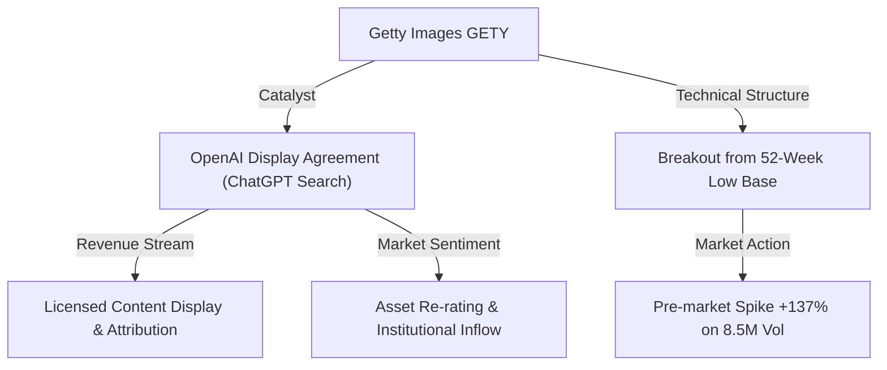
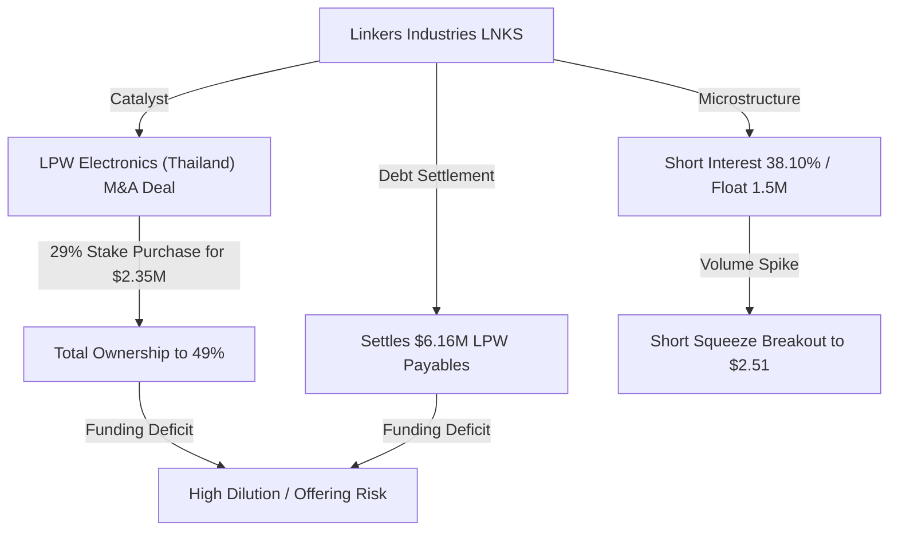
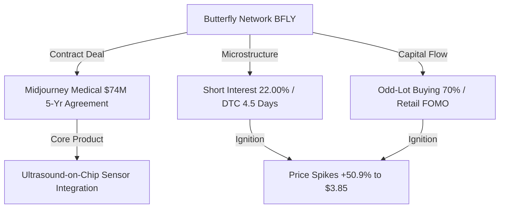
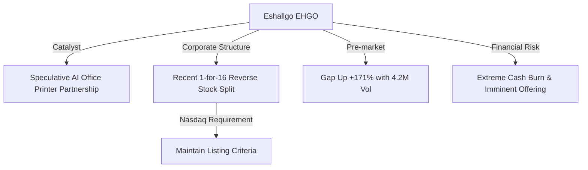
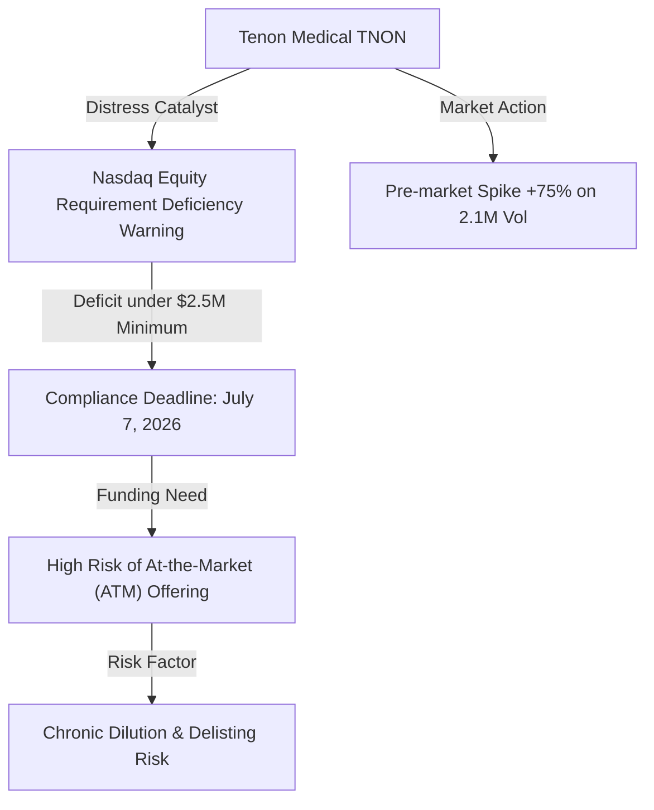

# 📊 Small-Cap & Penny Stock Intelligence Report
**Hedge Fund Trading Desk / Market Intelligence Division**  
**Date:** June 22, 2026  
**Market Stance:** Selective Catalyst-Driven Play / Index Rebalancing Dynamics / Dilution & Compliance Risk Warning

---

## 📈 Executive Summary

ภายหลังการสิ้นสุดช่วงหยุดยาวในเทศกาล Juneteenth ตลาดหุ้นสหรัฐฯ กลับมาเปิดทำการในวันจันทร์ที่ 22 มิถุนายน 2026 ท่ามกลางกระแสการหมุนเวียนกลุ่มอุตสาหกรรม (Sector Rotation) มูลค่าสูงถึง **2.45 หมื่นล้านดอลลาร์** โดยกลุ่ม Smart Money ไหลออกจากกลุ่มพลังงานและกลุ่มความมั่นคงเนื่องจากการคลี่คลายของความตึงเครียดบริเวณช่องแคบฮอร์มุซ และหมุนเข้าสู่กลุ่มโครงสร้างพื้นฐานเทคโนโลยี AI, เซมิคอนดักเตอร์ และโครงข่ายไฟฟ้าอิสระ (On-site Power) อย่างมีนัยสำคัญ 

อย่างไรก็ดี นโยบายการเงินของ Fed ภายใต้ประธานคนใหม่ **Kevin Warsh** ที่ยังคงสัญญาณสายเหยี่ยว (Hawkish Guidance) เพื่อควบคุมเงินเฟ้อ CPI ที่ 4.2% YoY ทำให้อัตราผลตอบแทนพันธบัตรรัฐบาลอายุ 10 ปี ทรงตัวในระดับสูงที่ 4.46% ซึ่งคอยจำกัดระดับมูลค่าหุ้น (Valuation Cap) ของหุ้นเติบโตสูง ในสภาวะเช่นนี้ หุ้นรายตัวที่มีข่าวดีเฉพาะตัว (Specific Catalyst) หรือมีสัดส่วน Short Interest สูง จึงกลายเป็นเป้าหมายหลักของการไล่ราคาของทั้งกองทุนและนักลงทุนรายย่อย

รายงานฉบับนี้ทำการคัดกรองและวิเคราะห์เจาะลึกโครงสร้างตลาด (Market Microstructure) ของหุ้นขนาดเล็ก (Small-Cap), Micro-Cap และ Penny Stocks จำนวน 5 ตัวที่มีความเคลื่อนไหวโดดเด่นและมีปริมาณการซื้อขายหนาแน่นผิดปกติ (Volume Spike) ในรอบ 24-72 ชั่วโมงที่ผ่านมา โดยครอบคลุมตั้งแต่ข่าวสารที่เป็นตัวเร่งปฏิกิริยาสำคัญ (Catalyst Analysis), ความแข็งแกร่งทางการเงิน (Financial Health) ไปจนถึงการเคลื่อนไหวของสถานะการขายชอร์ต (Short Squeeze Potential) เพื่อประกอบการตัดสินใจของเทรดเดอร์ในห้องค้าหลักทรัพย์อย่างมืออาชีพ

---

## 🔬 In-Depth Stock Analysis

### 1️⃣ Getty Images Holdings, Inc. (NYSE: GETY)
*Asset Re-rating Catalyst: OpenAI Partnership & Display Deal vs. Profit-Taking Risk*

#### **1. Company Overview**
*   **Sector / Industry:** Communication Services / Publishing
*   **Market Cap:** ~$1.45 Billion USD (Small-to-Mid Cap)
*   **Current Price:** ~$3.50 (ราคาปิดก่อนหน้าระเบิดขึ้นในช่วง Pre-Market แตะระดับ ~$8.30)
*   **Average Volume (30D):** ~1.05 Million shares
*   **Float:** ~130 Million shares
*   **Short Float %:** ~6.80%
*   **Shares Outstanding:** ~410.80 Million shares
*   **Institutional Ownership:** ~45.20% (กลุ่มสถาบันถือครองค่อนข้างมั่นคง)
*   **Insider Ownership:** ~50.10% (ตระกูล Getty และ Koch Industries ถือหุ้นควบคุมหลัก)

#### **2. Price Action Analysis**
*   **Movement:** ราคาหุ้นพุ่งขึ้นอย่างรุนแรงในตลาดช่วง Pre-market กว่า **+137.00%** ขึ้นมาซื้อขายในกรอบ $7.80 - $8.50 ฟื้นตัวขึ้นจากฐานราคาบริเวณต่ำสุดในรอบ 52 สัปดาห์ ($3.50) 
*   **Microstructure:** โครงสร้างสมุดคำสั่งซื้อขาย (Order Book) มีการขยับตัวอย่างรวดเร็ว ช่องว่าง Bid-Ask แคบลงเนื่องจากสภาพคล่องไหลเข้าปริมาณมหาศาล มีการกวาดซื้อ Ask Size ขนาดใหญ่ (Block Trade) ในช่วงเช้า สะท้อนลักษณะการไล่ราคาของสถาบันร่วมกับรายย่อย
*   **Accumulation/Distribution:** เกิดสัญญาณการสะสมหุ้นอย่างเป็นระบบ (Systematic Accumulation) ในช่วงก่อนหน้า และเกิดจังหวะ Breakout ที่ชัดเจน ไม่พบสัญญาณการกระจายหุ้นเพื่อหาทางออก (Exit Liquidity Play) แต่มีโอกาสเผชิญแรงขายทำกำไรระยะสั้น (Profit-Taking) หลังเปิดตลาดปกติจากความตึงตัวทางเทคนิค

#### **3. Volume Analysis**
*   **Relative Volume (RVOL):** **>25x** เทียบกับค่าเฉลี่ยปกติ
*   **Volume Spike:** ปริมาณการซื้อขายในช่วง Pre-market สะสมสูงถึง **8.5 ล้านหุ้น** ซึ่งถือเป็นระดับสูงสุดในรอบปีของบริษัท และแซงหน้าปริมาณการซื้อขายเฉลี่ยรายวันปกติไปหลายเท่าตัว
*   **Smart Money Signal:** พบการทำธุรกรรมขนาดใหญ่ระดับสถาบัน (Block Trade Flow) และปริมาณ Call Options ในรุ่นอายุใกล้ตัว (Near-term Options) พุ่งขึ้นอย่างรวดเร็ว บ่งชี้ว่า Smart Money มีการเข้าสะสมเพื่อรอรับแรงกระแทกฝั่งบวก (Upside Exposure)

#### **4. News & Catalyst Analysis**
*   **Catalyst (OpenAI Display Agreement):**
    1. Getty Images ประกาศบรรลุข้อตกลงความเป็นพันธมิตรแบบหลายปี (Multi-year Display Agreement) ร่วมกับ **OpenAI** อย่างเป็นทางการ
    2. รายละเอียดข้อตกลงระบุว่า OpenAI จะนำเข้าเนื้อหารูปภาพและสื่อลิขสิทธิ์ของ Getty Images ไปแสดงผลในประสบการณ์การค้นหาและตอบคำถามของ ChatGPT (ChatGPT search and discovery experiences) เพื่อให้ได้ข้อมูลรูปภาพที่ถูกต้องและมีการระบุแหล่งที่มา (Attribution)
    3. ดีลนี้เป็นลักษณะ "Display & Attribution License" ไม่ใช่การอนุญาตเพื่อนำภาพไปเทรนโมเดลโดยตรง ซึ่งช่วยสร้างความสบายใจให้กับนักลงทุนในประเด็นการละเมิดลิขสิทธิ์
*   **Bull vs Bear Case:**
    *   *Bull Case:* ดีลนี้สร้างมาตรฐานใหม่สำหรับการจัดการสิทธิบัตรและทรัพย์สินทางปัญญากับบริษัท Generative AI ปลดล็อกรายได้ประจำ (Licensing Royalty) รอบใหม่ที่มีมาร์จิ้นสูงเกือบ 100% ดันภาพลักษณ์ GETY จากบริษัทขายภาพถ่ายดั้งเดิมสู่การเป็น AI-enabler Data Bank
    *   *Bear Case:* หากความเร็วในการใช้งาน ChatGPT Search ไม่สามารถสร้างความนิยมได้เท่าดัชนีชี้วัดที่ตั้งไว้ รายได้ค่าลิขสิทธิ์ในอนาคตอาจไม่สูงเท่าที่ตลาดคาดหวังล่วงหน้าในวันนี้

#### **5. Financial Health**
*   **Revenue Growth & Profitability:** รายได้ปี 2025 ทรงตัวที่ระดับประมาณ $910-920 ล้านดอลลาร์ อัตรากำไรขั้นต้น (Gross Margin) แข็งแกร่งที่ระดับ 71% และบริษัทมีกำไรสุทธิ (EPS) เป็นบวกสะสมประมาณ $0.12 ต่อหุ้น
*   **Cash Position & Debt Level:** เงินสดในมือมีอยู่ประมาณ $148 ล้านดอลลาร์ แต่มีภาระหนี้สินระยะยาว (Debt) ค่อนข้างตึงตัวที่ระดับ $1.3 พันล้านดอลลาร์ อย่างไรก็ดี อัตราส่วน Net Debt to Adjusted EBITDA อยู่ที่ประมาณ 3.2x ซึ่งยังถือว่าบริหารจัดการได้
*   **Runway & Dilution Risk:** **ความเสี่ยงต่ำ (Low Dilution Risk)** เนื่องจากบริษัทมีกระแสเงินสดจากการดำเนินงาน (Operating Cash Flow) เป็นบวกอย่างต่อเนื่องประมาณ $180-200 ล้านดอลลาร์ต่อปี จึงไม่มีความจำเป็นต้องเพิ่มทุนฉุกเฉิน และไม่มีความเสี่ยงด้าน Reverse Split หรือ Delisting

#### **6. Market Sentiment**
*   **Retail Sentiment:** ได้รับความสนใจพุ่งแตะระดับสูงสุดในห้องสนทนา Reddit (r/WallStreetBets) และ X (Twitter) ชุมชนรายย่อยมองว่าเป็นกระแส "AI Re-rating" ที่มีปัจจัยพื้นฐานจริงรองรับ ต่างจากหุ้นไวรัลที่ปั่นราคาทั่วไป ส่งผลให้ระดับ FOMO พุ่งสูง

#### **7. Technical Analysis**
*   **Trend Structure:** กราฟระดับ Daily ทะลุกรอบขาลงสะสมระยะยาว (Downward Channel Breakout) และยืนเหนือเส้นค่าเฉลี่ย EMA 50 ($4.15) และ EMA 200 ($5.10) ได้ในเวลาเดียวกัน
*   **Indicators:** RSI รายวันพุ่งขึ้นจากเขต Oversold เดิมมาแตะระดับ **78.5 (Overbought)** ซึ่งมีความจำเป็นต้องระวังการเกิดจังหวะพักฐานปรับฐานทางเทคนิค (Pullback) เพื่อปิด Gap
*   **Support/Resistance:** แนวรับ: $5.10 (EMA 200 เดิม), $4.50 / แนวต้าน: $8.50, $10.00

#### **8. Risk Analysis & Rating**
*   **Risk Level: ความเสี่ยงปานกลาง (Medium Risk)**
*   **Threats:** ความผันผวนของราคาหุ้นหลังเกิดการระเบิดของราคาในวันแรก (Day 1 Volatility), โอกาสการเกิด Mean Reversion ลงมาปิดช่องว่าง (Gap Down Fill) หากนักลงทุนสถาบันบางส่วนเลือกขายเพื่อทำกำไรออกมาก่อน

---

### 2️⃣ Linkers Industries Ltd. (NASDAQ: LNKS)
*Nano-Cap Squeeze Candidate: Thailand M&A Expansion vs. Impending Funding Dilution*

#### **1. Company Overview**
*   **Sector / Industry:** Industrials / Electrical Equipment & Parts
*   **Market Cap:** ~$4.04 Million USD (Nano-Cap ขั้นรุนแรง)
*   **Current Price:** ~$2.51 (ปิดตลาดปกติหลังพุ่งขึ้นระหว่างวันสูงสุดถึง $3.55)
*   **Average Volume (30D):** ~913,000 shares
*   **Float:** ~1.50 Million shares (หุ้นหมุนเวียนต่ำพิเศษ)
*   **Short Float %:** ~38.10% (ระดับบีบตัวทางอ้อม / Short Squeeze Candidate)
*   **Shares Outstanding:** ~1.61 Million shares
*   **Institutional Ownership:** 0.00% (ไม่มีกองทุนหลักเข้าร่วมสะสม)
*   **Insider Ownership:** ~50.00%

#### **2. Price Action Analysis**
*   **Movement:** ราคาผันผวนรุนแรงโดยเกิดการ Breakout เหนือแนวต้านสำคัญบริเวณ $1.50 พุ่งไปแตะ $3.55 ระหว่างชั่วโมงซื้อขายปกติ ก่อนจะโดนแรงขายกดตัวลงมาปิดที่ $2.51 โดยรวมคิดเป็น +67.0% ในรอบ 7 วัน
*   **Microstructure:** โครงสร้างตลาดของ LNKS มีความอ่อนไหวสูงเป็นพิเศษเนื่องจากจำนวน Float ต่ำมาก (1.5M หุ้น) ช่อง Bid-Ask ห่างกว้างและไม่มีความมั่นคง (Thin Liquidity) การกวาดซื้อเพียงเล็กน้อยสามารถดันราคาพุ่งได้หลายเปอร์เซ็นต์ แต่ในทำนองเดียวกันแรงขายก็สามารถทำให้ราคาดิ่งเหวได้ง่าย
*   **Accumulation/Distribution:** การพุ่งขึ้นของราคาเป็นการบีบสถานะฝั่งชอร์ตให้ยอมแพ้ (Short Covering Rally) มากกว่าการสะสมแบบยั่งยืน ถือเป็นลักษณะการเก็งกำไรระยะสั้นจัดจ้าน (Speculative Squeeze)

#### **3. Volume Analysis**
*   **Relative Volume (RVOL):** **>76x** เทียบกับค่าเฉลี่ยปกติ
*   **Volume Spike:** ปริมาณการซื้อขายหนาแน่นถึง **69.88 ล้านหุ้น** ในวันเดียว คิดเป็นกว่า **46 เท่า** ของจำนวน Float จริง บ่งชี้สถิติอัตราการหมุนเวียนหุ้นที่สูงมาก (Extreme Float Churn) โดยกลุ่ม Day Traders และ High-Frequency Trading (HFT)
*   **Smart Money Signal:** ไม่มีสัญญาณกระแสเงินทุนระยะยาวสะสม ธุรกรรมทั้งหมดเป็นของนักเก็งกำไรรายย่อยและบอทเทรดที่ปิดสถานะแบบจบในวัน

#### **4. News & Catalyst Analysis**
*   **Catalyst (Thailand Automotive Expansion):**
    1. บริษัทบรรลุข้อตกลงขั้นสุดท้าย (Definitive Agreement) ซื้อหุ้นเพิ่มอีก 29% ในบริษัท **LPW Electronics Co., Ltd.** (ผู้ผลิตชุดสายไฟและชิ้นส่วนอิเล็กทรอนิกส์สำหรับยานยนต์ในประเทศไทย) ด้วยเงินสดมูลค่า **$2.35 ล้านดอลลาร์** ดันสัดส่วนการถือหุ้นขึ้นเป็น 49%
    2. นอกเหนือจากค่าหุ้น LNKS ตกลงเข้าเป็นผู้ชำระหนี้การค้าและหนี้ค้างจ่ายของ LPW ในวงเงินเงินสดรวม **$6.16 ล้านดอลลาร์** (มูลค่ารวมดีลทั้งสิ้น $8.51 ล้านดอลลาร์)
*   **Bull vs Bear Case:**
    *   *Bull Case:* การย้ายฐานการผลิตมายังไทยช่วยให้ LNKS ได้รับประโยชน์จากการเลี่ยงกำแพงภาษีการค้าระหว่างสหรัฐฯ-จีน และเข้าสู่อุตสาหกรรมห่วงโซ่อุปทานชิ้นส่วนยานยนต์ในอาเซียนที่กำลังเติบโต
    *   *Bear Case:* ดีลมีมูลค่ารวมสูงถึง $8.51 ล้านดอลลาร์ ซึ่งบริษัทไม่มีความสามารถทางการเงินเพียงพอในการชำระดีลนี้ด้วยตัวเอง ณ ปัจจุบัน

#### **5. Financial Health**
*   **Balance Sheet Status:** จากข้อมูลล่าสุด บริษัทมีเงินสดในมือ $4.37 ล้านดอลลาร์ และมีหนี้สินปกติประมาณ $1.46 ล้านดอลลาร์ 
*   **Runway & Dilution Risk:** **ระดับสูงมาก (Very High Dilution Risk)** เนื่องจากมูลค่าดีล LPW อยู่ที่ $8.51M ซึ่งสูงกว่าเงินสดในมือทั้งหมดของบริษัท ($4.37M) ดังนั้นบริษัทจึงเผชิญความจำเป็นเร่งด่วนในการระดมทุนผ่านการออกเสนอขายหุ้นเพิ่มทุนใหม่ราคาต่ำ (Offering) หรือการทำตราสารหนี้แปลงสภาพในอนาคตอันใกล้ ซึ่งจะเป็นปัจจัยลบกดราคาหุ้นอย่างมีนัยสำคัญ

#### **6. Market Sentiment**
*   **Retail Sentiment:** ชุมชนเทรดเดอร์ในบอร์ดเก็งกำไร (Reddit/X) ตื่นตัวกับระดับ Short Interest 38.10% และลักษณะหุ้น Float ต่ำมาก โดยพยายามทำความเข้าใจข่าว "ดีลโรงงานสายไฟในไทย" เพื่อปลุกกระแส Meme Squeeze ส่งผลให้ระดับ FOMO ในกลุ่มเทรดเดอร์รายย่อยพุ่งสูง

#### **7. Technical Analysis**
*   **Trend Structure:** พลิกเป็นแนวโน้มขาขึ้นระยะสั้นหลังจากราคาสามารถทะลุผ่านและยืนเหนือเส้น EMA 50 ($1.62) และ EMA 200 ($1.85)
*   **Indicators:** RSI รายวันเคลื่อนไหวบริเวณ 65.0 ชี้วัดว่ายังมีกำลังในขาขึ้น แต่เนื่องจากระดับความผันผวนสูง การร่วงหลุดแนวรับสำคัญจะทำให้ระบบ Technical Selling ทำงานทันที
*   **Support/Resistance:** แนวรับ: $2.00, $1.85 / แนวต้าน: $3.55, $4.00

#### **8. Risk Analysis & Rating**
*   **Risk Level: ความเสี่ยงสูงมาก (Very High Risk)**
*   **Threats:** ความเสี่ยงสูงที่จะเผชิญการประกาศขายหุ้นเพิ่มทุน (Dilution / Offering Risk) ในลักษณะฉับพลันเพื่อชำระหนี้ดีล LPW, ความเสี่ยงสภาพคล่องหายไป (Liquidity Trap) เนื่องจากเป็นหุ้นขนาดเล็กเป็นพิเศษ (Nano-Cap)

---

### 3️⃣ Butterfly Network, Inc. (NYSE: BFLY)
*AI MedTech Catalyst: Midjourney Medical licensing Deal vs. Gamma Reversal Risk*

#### **1. Company Overview**
*   **Sector / Industry:** Healthcare / Medical Devices
*   **Market Cap:** ~$808.50 Million USD (Small-Cap)
*   **Current Price:** ~$3.85 (บวกเพิ่มอีก +8.50% ในช่วง Pre-Market วันนี้เป็น ~$4.18)
*   **Average Volume (30D):** ~2.50 Million shares
*   **Float:** ~170 Million shares
*   **Short Float %:** ~22.00%
*   **Shares Outstanding:** ~210 Million shares
*   **Institutional Ownership:** ~32.40%
*   **Insider Ownership:** ~25.10%

#### **2. Price Action Analysis**
*   **Movement:** ราคาพุ่งขึ้นอย่างรุนแรงกว่า **+50.9%** ปิดตลาดวันก่อนหน้าแถวระดับ $3.85 และมีแรงซื้อต่อเนื่องในช่วง Pre-market ของเช้านี้ดันราคาขยับขึ้นทะลุแนว $4.10 ถือเป็นการเปลี่ยนโซนการซื้อขายอย่างรวดเร็ว
*   **Microstructure:** โครงสร้างคำสั่งซื้อขายมีการทำงานของระบบซื้อเพื่อประกันความเสี่ยง (Delta/Gamma Hedging) ของ Market Maker ในฝั่งตลาดอนุพันธ์ เนื่องจากมีปริมาณการทำธุรกรรม Call Options ของรายย่อยที่หนาแน่นมาก บีบให้ราคาขยับตัวขึ้นแบบสควีซกว้าง
*   **Accumulation/Distribution:** มีสัญญาณการซื้อไล่ราคาของฝั่งรายย่อย (Speculative Hype) เป็นตัวขับเคลื่อนหลัก ขณะที่ข้อมูลบล็อกเทรดนอกกระดาน (Dark Pool) ระบุว่านักลงทุนสถาบันบางส่วนกำลังทำการป้องกันความเสี่ยง (Hedging) โดยซื้อ Put Options ด้านบนเพื่อล็อกกำไร

#### **3. Volume Analysis**
*   **Relative Volume (RVOL):** **>8.5x** เทียบกับค่าเฉลี่ย
*   **Volume Spike:** ปริมาณการซื้อขายเฉลี่ยรายวันพุ่งสูงขึ้นกว่าปกติถึง **850%** โดยพบว่าสัดส่วนกว่า 70% เป็นคำสั่งซื้อขนาดเล็ก (Odd-Lot Orders) ชี้วัดความตื่นตัวของรายย่อยที่เป็นผู้นำตลาดในดีลนี้
*   **Smart Money Signal:** Smart Money ไม่ได้เป็นตัวดันราคาหลัก แต่เข้ามาเปิดสถานะฝั่งออปชันเพื่อเก็งความผันผวน (Volatility Arbitrage) และการป้องกันความเสี่ยงขาลง

#### **4. News & Catalyst Analysis**
*   **Catalyst (Midjourney Medical Deal):**
    1. รายงานข่าวการจัดตั้งบริษัทร่วมทุนย่อยใหม่ของ Midjourney (ยักษ์ใหญ่ด้าน Generative AI Image) ภายใต้ชื่อ **Midjourney Medical**
    2. Midjourney Medical ได้ทำสัญญามอบสิทธิ์ลิขสิทธิ์เทคโนโลยีและการร่วมพัฒนาระบบชิปเซ็นเซอร์ **Ultrasound-on-Chip™** ของ Butterfly Network เพื่อนำไปติดตั้งในอุปกรณ์สแกนร่างกาย 3 มิติความละเอียดสูง "Midjourney Scanner" (ใช้ชิป BFLY จำนวน 40 โมดูลต่อเครื่อง)
    3. มูลค่ารวมของสัญญาขั้นต่ำอยู่ที่ **$74 ล้านดอลลาร์ ในระยะเวลา 5 ปี** ถือเป็นการเข้าสู่ธุรกิจแบบ Embedded licensing มาร์จิ้นสูง
*   **Bull vs Bear Case:**
    *   *Bull Case:* ดีลนี้พิสูจน์มูลค่าสิทธิบัตรชิปของ BFLY ในอุตสาหกรรมอื่น นอกเหนือจากการขายตัวเครื่องอัลตราซาวด์พกพาแบรนด์ตัวเอง ช่วยเร่งทิศทางการเติบโตของรายได้ลิขสิทธิ์แบบมาร์จิ้นสูง
    *   *Bear Case:* การตั้งเป้าการผลิต 50,000 เครื่องภายในปี 2031 ของ Midjourney ยังคงเป็นแผนงานระยะยาว ตัวเครื่องสแกนเนอร์ยังต้องผ่านการทดลองทางคลินิก (Clinical Trials) และผ่านกระบวนการอนุมัติของ FDA ซึ่งมีระยะเวลาหลายปีและมีความตึงตัวด้านกฎหมายสูง

#### **5. Financial Health**
*   **Revenue Growth & Profitability:** รายได้ Q1 2026 อยู่ที่ระดับประมาณ $18.5 ล้านดอลลาร์ เติบโตขึ้นเล็กน้อย อัตรากำไรขั้นต้นคงตัวที่ระดับ 55% บริษัทยังคงมีผลการดำเนินงานขาดทุนสุทธิ (EPS: -$0.08 ต่อไตรมาส)
*   **Cash Position & Debt Level:** เงินสดในมือและหลักทรัพย์ระยะสั้นเหลืออยู่ประมาณ $95 ล้านดอลลาร์ โดยมีหนี้สินระยะยาวต่ำมากเกือบเป็นศูนย์ ($0.5 ล้านดอลลาร์)
*   **Runway & Dilution Risk:** **ความเสี่ยงปานกลาง (Moderate Dilution Risk)** ปัจจุบันบริษัทมีอัตราการเบิร์นเงินสดเฉลี่ยปีละ $40-45 ล้านดอลลาร์ ทำให้มีเงินสดหล่อเลี้ยงเพียงพออีกประมาณ 2 ปี (Runway ~24 Months) การได้รับดีลสัญญาลิขสิทธิ์มูลค่า $74M เข้ามาเสริมทำให้ความกังวลเรื่องการเพิ่มทุนฉุกเฉินลดน้อยลง

#### **6. Market Sentiment**
*   **Retail Sentiment:** กระแส "Midjourney Medical" เป็นจุดสนใจระดับไวรัลบนสื่อสังคมออนไลน์และกระดาน WallStreetBets รายย่อยมีความคาดหวังเชิงบวกอย่างมากในแง่ของ Medical AI ปลุกกระแสความตื่นตระหนกฝั่งซื้อ (FOMO Level: สูง)

#### **7. Technical Analysis**
*   **Trend Structure:** กราฟทำ Breakout ครั้งสำคัญเหนือแนวต้านของเส้น EMA 200 วัน ($2.95) ได้สำเร็จ ปรับทิศทางเป็นขาขึ้นเต็มตัว
*   **Indicators:** RSI รายวันปรับตัวสูงทะลุเขตซื้อมากเกินไปที่ระดับ **81.5 (Deep Overbought)** บ่งชี้สภาวะการตึงตัวของฝั่งซื้อ ซึ่งมีความเสี่ยงสูงที่จะเผชิญจังหวะย่อตัวปรับฐานเมื่อกระแสข่าวเริ่มลดความร้อนแรง
*   **Support/Resistance:** แนวรับ: $3.00 (จิตวิทยาและแนวรับ EMA 200), $2.80 / แนวต้าน: $4.10, $4.50

#### **8. Risk Analysis & Rating**
*   **Risk Level: ความเสี่ยงสูง (High Risk)**
*   **Threats:** ความเสี่ยงจากการเกิด Gamma Reversal (หากรายย่อยหยุดซื้อ Call Options ทำให้ Market Maker เทขายหุ้นแม่เพื่อคลายความเสี่ยงคืนสู่ตลาด), ความเสี่ยงด้านเวลาในการพัฒนาและขอรับการอนุมัติจาก FDA ที่อาจล่าช้ากว่าคาดมาก

---

### 4️⃣ Eshallgo Inc. (NASDAQ: EHGO)
*Micro-Cap Speculative Hype: Chinese AI narrative vs. Immediate Offering Risk*

#### **1. Company Overview**
*   **Sector / Industry:** Technology / IT Services & Consulting (China-based)
*   **Market Cap:** ~$24 Million USD (Micro-Cap)
*   **Current Price:** ~$1.00 (ราคาดีดขึ้นอย่างเป็นทางการในช่วง Pre-Market เช้านี้ที่ **+171.00%** ขึ้นมาแตะ ~$2.71)
*   **Average Volume (30D):** ~400,000 shares
*   **Float:** ~8 Million shares (คำนวณปรับสัดส่วนหลังรวมหุ้น)
*   **Short Float %:** ~12.50%
*   **Shares Outstanding:** ~9 Million shares
*   **Institutional Ownership:** ~2.50%
*   **Insider Ownership:** ~35.00%

#### **2. Price Action Analysis**
*   **Movement:** ราคาพุ่งขึ้นกระฉูดในช่วง Pre-market กว่า **+171%** จากแรงขับเคลื่อนเชิงจิตวิทยาทางเทคนิคและกระแส AI-related ในกลุ่มบริษัทขนาดเล็กของจีน โดยมีพฤติกรรมการแกว่งตัวกว้างระหว่าง $1.50 - $3.10
*   **Microstructure:** สภาพคล่องเบาบางเป็นพิเศษในช่วงก่อนตลาดเปิด Bid-Ask Spread กว้างมาก การซื้อขายเกิดจากการเข้าดักราคาของรายย่อยและบอทเก็งกำไรแบบไม่มีการคำนวณมูลค่า (Pure Speculation)
*   **Accumulation/Distribution:** สัญญาณการสะสมต่ำมาก แต่พบลักษณะเด่นของการดันราคาแบบกระชากขึ้นเร็ว (Pump Structure) เพื่อสร้างภาพลักษณ์สภาพคล่อง ก่อนที่จะเปิดฉากระบายหุ้นออกมา (Distribution)

#### **3. Volume Analysis**
*   **Relative Volume (RVOL):** **>15x** เทียบกับค่าเฉลี่ยปกติ
*   **Volume Spike:** ปริมาณการซื้อขายสะสมพุ่งแตะระดับ **4.2 ล้านหุ้น** ในช่วง Pre-market ซึ่งหนาแน่นผิดปกติมากเมื่อเทียบกับฐานประวัติการซื้อขายดั้งเดิม
*   **Smart Money Signal:** ไม่มีร่องรอยของนักลงทุนสถาบันฝั่งสหรัฐฯ เข้าสะสมหุ้น มีความเสี่ยงที่จะเป็นธุรกรรมหมวนเวียนราคาของผู้เล่นรายใหญ่ฝั่งเอเชีย (Offshore Speculators)

#### **4. News & Catalyst Analysis**
*   **Catalyst (Speculative AI Narrative & Split Activity):**
    1. กระแสข่าวเก็งกำไรในเชิงความพยายามร่วมมือด้านการนำโซลูชัน AI ไปประยุกต์เข้ากับเครื่องพิมพ์และการจัดการสำนักงานอัจฉริยะสำหรับกลุ่มลูกค้าองค์กร
    2. ก่อนหน้านี้บริษัทเพิ่งทำกระบวนการ **1-for-16 reverse stock split** (รวมหุ้น) เพื่อยกราคาให้เกินระดับ $1.00 ตามเกณฑ์ Nasdaq delisting
*   **Bull vs Bear Case:**
    *   *Bull Case:* หากบริษัทสามารถเปลี่ยนผ่านระบบธุรกิจเอกสารดั้งเดิมไปสู่ AI Cloud Office Solutions ในกลุ่มลูกค้าองค์กรจีนได้จริง อาจมีรายได้ขยับขึ้น
    *   *Bear Case:* พื้นฐานการดำเนินงานหลักยังคงขาดทุนสะสมบานปลาย และไม่มีหลักฐานชัดเจนว่าดีล AI ดังกล่าวจะสร้างรายได้เชิงพาณิชย์เป็นตัวเลขที่เป็นรูปธรรมในระดับที่ยั่งยืน

#### **5. Financial Health**
*   **Revenue Growth & Profitability:** รายได้ปีละประมาณ $15 ล้านดอลลาร์ แต่อัตรากำไรขั้นต้นต่ำมาก (ประมาณ 12%) และมีอัตราการขาดทุนสุทธิสะสมต่อเนื่อง
*   **Cash Position & Runway:** เงินสดในมือเหลืออยู่เพียงประมาณ **$1.2 ล้านดอลลาร์** ขณะที่มีหนี้สินระยะสั้นกว่า $3.5 ล้านดอลลาร์ 
*   **Runway & Dilution Risk:** **ระดับสูงสุด (Extreme Dilution Risk)** เงินสดของบริษัทอยู่ในภาวะวิกฤต การดันราคาขึ้นไปแรงในครั้งนี้เป็นจังหวะทองที่ผู้บริหารมักจะใช้ประกาศเสนอขายหุ้นเพิ่มทุนใหม่ราคาต่ำทันทีหลังเปิดตลาดปกติ (At-the-market Offering / Private Placement) เพื่อรักษาสภาพคล่องทางการเงินให้ธุรกิจอยู่รอด

#### **6. Market Sentiment**
*   **Retail Sentiment:** มีการชูประเด็น "Chinese AI micro-cap" บนช่องทาง Discord และกลุ่มเทรดรายย่อยเพื่อดึงแรงซื้อเข้าใส่ สภาพจิตวิทยาตลาดมีความผันผวนสะท้อนพฤติกรรมความเชื่อเรื่องอนาคตเทียม (Speculative Hype) เพื่อการเล่นเก็งกำไรจบรอบอย่างรวดเร็ว

#### **7. Technical Analysis**
*   **Trend Structure:** โครงสร้างหลักในอดีตเป็นขาลงเรื้อรัง การพุ่งขึ้นแรงในวันนี้ถือเป็นลักษณะราคาฉีกออกจากเส้นค่าเฉลี่ยแบบกระชากตัว (Exhaustion/Gap Up) ซึ่งอยู่ห่างจากระดับ EMA 50 ($1.15) มากเกินไป
*   **Indicators:** RSI ในไทม์เฟรมระยะสั้นทะลุไปกว่า **85.0 (Extreme Overbought)** บ่งชี้ความตึงตัวทางเทคนิคขั้นสูงสุด เสี่ยงต่อการเกิดจังหวะกลับตัวดิ่งลงแรงเพื่อลงไปปิด Gap ด้านล่าง
*   **Support/Resistance:** แนวรับ: $1.50, $1.15 / แนวต้าน: $3.10, $3.80

#### **8. Risk Analysis & Rating**
*   **Risk Level: ความเสี่ยงสูงมากที่สุด (Extreme Risk)**
*   **Threats:** ความเสี่ยงสูงสุดในการถูกประกาศเพิ่มทุนอย่างฉับพลัน (Immediate Offering Risk), ความเสี่ยงจากการดิ่งลงอย่างรวดเร็วหลังการดันราคาเสร็จสิ้น (Pump & Dump Risk), และข้อจำกัดทางกฎหมายด้านการถือครองหุ้นของบริษัทจีน

---

### 5️⃣ Tenon Medical, Inc. (NASDAQ: TNON)
*Compliance Distress Play: Nasdaq warning window vs. At-the-market Dilution threat*

#### **1. Company Overview**
*   **Sector / Industry:** Healthcare / Medical Devices
*   **Market Cap:** ~$8.50 Million USD (Nano-Cap)
*   **Current Price:** ~$0.55 (ดีดตัวพุ่งสูงขึ้นใน Pre-Market เช้านี้ **+75.00%** ขึ้นมาเคลื่อนไหวแถว ~$0.96)
*   **Average Volume (30D):** ~250,000 shares
*   **Float:** ~4.50 Million shares (หุ้นจดทะเบียนบาง)
*   **Short Float %:** ~15.00%
*   **Shares Outstanding:** ~10 Million shares
*   **Institutional Ownership:** ~4.10%
*   **Insider Ownership:** ~15.20%

#### **2. Price Action Analysis**
*   **Movement:** ราคาพุ่งขึ้นอย่างรุนแรงในตลาดก่อนเปิดการขายปกติ +75% โดยเป็นการรีบาวด์ตัวจากระดับแนวรับสำคัญบริเวณฐานล่างต่ำสุดของปี $0.50 
*   **Microstructure:** สมุดคำสั่งซื้อขายสะท้อนสภาพคล่องที่เบาบาง Bid-Ask Spread กว้าง การเคลื่อนไหวของราคาเกิดจากการป้อนออร์เดอร์ของกลุ่มเทรดรายวันขนาดเล็ก แต่การเหวี่ยงของราคาสูงสะท้อนถึงแรงซื้อที่พยายามดึงราคาให้ขยับข้ามจุดผ่าน $1.00 เพื่อจิตวิทยา
*   **Accumulation/Distribution:** รูปแบบการซื้อสะท้อนถึงการไล่ราคาทางเทคนิคที่ไม่มีโครงสร้างสะสมระยะยาวรองรับ ถือเป็นสัญญาณกระจายของฝั่งซื้อสั้นเพื่อหาทางออกของผู้ถือหุ้นเดิม (Speculative Rebound Play)

#### **3. Volume Analysis**
*   **Relative Volume (RVOL):** **>8x** เทียบกับฐานเดิม
*   **Volume Spike:** ปริมาณการซื้อขายพุ่งสูงถึง **2.1 ล้านหุ้น** ใน Pre-Market ซึ่งปกติบริษัทนี้จะมีปริมาณธุรกรรมเบาบางมาก ปรากฏการณ์นี้แสดงว่ากระแสสังคมนักเก็งกำไรได้เลือกตัวนี้เข้ามาเป็นเป้าหมายชั่วคราว
*   **Smart Money Signal:** ไม่มีกระแสเงินทุนของสถาบันไหลเข้า มีความต้องการซื้อของสถาบันเป็นศูนย์ (No Whale Activity)

#### **4. News & Catalyst Analysis**
*   **Catalyst (Nasdaq Noncompliance & Plan Window):**
    1. บริษัทได้รับหนังสือแจ้งเตือนจากตลาดหลักทรัพย์ Nasdaq เรื่องส่วนผู้ถือหุ้นไม่ผ่านเกณฑ์ขั้นต่ำ (Deficiency under stockholders' equity requirement of $2.5 Million)
    2. บริษัทมีหน้าต่างเวลาในการยื่นแผนแก้ไขเพื่อรักษาสถานภาพจดทะเบียนจนถึงวันที่ **7 กรกฎาคม 2026**
*   **Bull vs Bear Case:**
    *   *Bull Case:* ราคาหุ้นที่พุ่งขึ้นชั่วคราวทำให้บริษัทมีโอกาสทำยอดระดมทุนผ่านการออก At-the-market Offering (ATM) ได้เงินก้อนใหญ่ขึ้นเพื่อกู้ฐานส่วนของผู้ถือหุ้นให้พ้น $2.5M
    *   *Bear Case:* การแก้ไขด้วยการขายหุ้นเพิ่มทุนเป็นการฉีดส่วนเจือจางเข้าสู่กระดาษ ยิ่งบั่นทอนมูลค่าหุ้นดั้งเดิมในระยะยาว และหากบริษัทไม่สามารถส่งแผนงานที่ผ่านการอนุมัติได้ จะเข้าสู่การเพิกถอนชื่อออกทันที (Delisting)

#### **5. Financial Health**
*   **Revenue Growth & Profitability:** รายได้ Q1 2026 อยู่ในระดับต่ำมากประมาณ $0.80 ล้านดอลลาร์ อัตรากำไรขั้นต้น 35% ขาดทุนสุทธิต่อไตรมาสต่อเนื่องและส่วนของผู้ถือหุ้นติดลบ
*   **Cash Position & Runway:** เงินสดในมือคงเหลือประมาณ **$1.1 ล้านดอลลาร์** ซึ่งตึงตัวอย่างมากเมื่อเทียบกับค่าใช้จ่ายในการดำเนินงานหลัก
*   **Runway & Dilution Risk:** **ระดับสูงสุด (Extreme Dilution Risk)** เพื่อแก้ไขปัญหาส่วนของผู้ถือหุ้นติดลบและการขาดเงินสด มีโอกาสสูงกว่า 90% ที่บริษัทจะประกาศเปิดดีล At-the-market Offering (ATM) หรือการแปลงสัญญาวอร์แรนต์อย่างฉับพลันหลังการผลักดันราคาหุ้นในสัปดาห์นี้

#### **6. Market Sentiment**
*   **Retail Sentiment:** รายย่อยพยายามเล่นข่าว "Nasdaq compliance squeeze" โดยพยายามไล่ราคาดักฝั่งชอร์ตให้ยอมถอนตัวก่อนเส้นตายวันที่ 7 กรกฎาคม การพูดคุยบน Discord/X มุ่งเน้นในเชิงการหาหุ้นต่ำดอลลาร์ที่เหวี่ยงได้กว้าง

#### **7. Technical Analysis**
*   **Trend Structure:** แนวโน้มหลักเป็นขาลงถาวร (Chronic Downward Trend) การเด้งตัวขึ้นในวันนี้เป็นการรีบาวด์เพื่อลดเขตความล้นในจุดต่ำสุด (Oversold Reversal)
*   **Indicators:** กราฟราคายังอยู่ใต้เส้น EMA 200 วันรายวัน ($1.45) แต่ข้ามพ้น EMA 50 วันขึ้นมาทดสอบโซนแนวต้านจิตวิทยาที่ $1.00
*   **Support/Resistance:** แนวรับ: $0.50 (จุดต่ำสุดประวัติศาสตร์) / แนวต้าน: $1.00, $1.45

#### **8. Risk Analysis & Rating**
*   **Risk Level: ความเสี่ยงสูงมากที่สุด (Extreme Risk)**
*   **Threats:** ความเสี่ยงสูงต่อการถูกเพิกถอนสิทธิ์การซื้อขายออกจากตลาดหลักทรัพย์ (Nasdaq Delisting Risk) หากแผนไม่ผ่านเกณฑ์, ความเสี่ยงเจือจางอย่างรุนแรงจากการออกตราสารทุนใหม่ (ATM Offering Dilution)

---

## 🧠 Market Microstructure & Flow Insights

จากข้อมูลการวิเคราะห์พฤติกรรมตลาด ปริมาณการซื้อขาย และระดับความหนาแน่นของธุรกรรมออปชันรอบ 24-72 ชั่วโมง สามารถจำแนกความแตกต่างระหว่างกลไกเชิงระบบและกลไกเก็งกำไรได้ดังนี้:

| Ticker | Catalyst Class | Capital Source | Squeeze Potential | Primary Risk |
| :--- | :--- | :--- | :---: | :--- |
| **GETY** | OpenAI Display Deal | Institutions + Retail | Low (SI 6.8%) | Mean Reversion / Pullback |
| **LNKS** | Thailand M&A | Retail + HFT Bots | Extremely High (SI 38.1%) | Imminent Dilution / Offering |
| **BFLY** | Midjourney License | Retail FOMO vs Whale Hedging | Moderate-to-High (SI 22%) | Gamma Reversal after Overbought |
| **EHGO** | Speculative AI | Retail Speculators | Low (SI 12.5%) | Extreme Pump & Dump / Offering |
| **TNON** | Nasdaq Deficiency | Retail Speculators | Moderate (SI 15%) | Immediate ATM offering / Delisting |

### Key Insight Summaries:
*   **หุ้นที่มีความแข็งแกร่งทางปัจจัยพื้นฐานที่สุด (Best Fundamentals):** **GETY** โครงสร้างรายได้ที่ได้รับการสนับสนุนและพาร์ทเนอร์ร่วมกับ OpenAI ถือเป็นการยกระดับมูลค่าสินทรัพย์และทรัพย์สินทางปัญญาแบบแท้จริง (Asset Re-rating) ฐานการเงินเป็นบวกและไม่มีความเสี่ยงด้านการล้างพอร์ตหรือเพิ่มทุนฉุกเฉิน
*   **หุ้นที่มีโมเมนตัมแข็งแกร่งที่สุดและวอลุ่มน่าสนใจที่สุด (Top Momentum & Volume):** **LNKS** และ **BFLY** สำหรับ LNKS มีอัตรา Churn Rate ของวอลุ่มที่มากกว่า Float ถึง 46 เท่านั้นแสดงสภาวะการบีบตัวทางเทคนิคและสควีซที่ทรงพลังที่สุด ส่วน BFLY มีแรงหนุนการเก็งกำไรระยะสั้นในเชิง AI Healthcare ที่สูงเด่น
*   **หุ้นที่เป็นเพียงเก็งกำไรระยะสั้นและเสี่ยงโดนทุบ (Pure Speculative / Pump & Dump Risk):** **EHGO** และ **TNON** ทั้งคู่มีสถานะทางการเงินในระดับวิกฤต มีความเสี่ยงสูงสุดในด้านการออกหุ้นเพิ่มทุนราคาต่ำ (Offering Dilution) ทันทีที่ราคาหุ้นดีดตัวขึ้นชั่วคราวเพื่อเอาตัวรอดจากการขาดสภาพคล่องหรือการโดน Delisting
*   **หุ้นที่ควรจับตาต่อคืนนี้และเหมาะกับ Watchlist (Best Watchlist Fit):** **GETY** (จับตาแรงสู้ต่อของสถาบันหลังเปิดตลาดปกติเพื่อทดสอบการเปลี่ยนโครงสร้างแนวโน้มระยะยาว) และ **LNKS** (ตามทิศทางการบีบชอร์ต 38% เพิ่มเติมในสภาวะ Float บาง)

---

## 📌 Daily Watchlist & Ratings

### Categorized Watchlist:
*   **Top Momentum:** **GETY** (Breakout จากแนวต่ำสุดรอบปี), **BFLY** (ทะลุ EMA 200 พร้อมวอลุ่ม)
*   **Top Risk:** **EHGO** (กระชากตัวแรงแต่เงินสดวิกฤต), **TNON** (เสี่ยงเพิกถอน Nasdaq)
*   **Top Volume:** **GETY** (8.5M ใน Pre-market), **EHGO** (4.2M ใน Pre-market)
*   **Top Catalyst:** **GETY** (สัญญา OpenAI Display Partnership)
*   **Top Speculative Play:** **LNKS** (บีบชอร์ต 38.10% บนโครงสร้างหุ้นหมุนเวียน 1.5 ล้านหุ้น)

### Daily Rankings:
*   🥇 **หุ้นเด่นที่สุดประจำวัน (Top Pick):** **GETY** (Getty Images Holdings, Inc.) - ได้รับผลดีเชิงบวกอย่างเป็นรูปธรรมจากดีล OpenAI ช่วยปลดล็อกโครงสร้างรายได้และข้ามผ่านช่วงเวลาเลวร้ายทางธุรกิจ ปัจจัยพื้นฐานรองรับได้เปรียบ
*   ⚠️ **หุ้นเสี่ยงที่สุดประจำวัน (Riskiest Play):** **EHGO** (Eshallgo Inc.) - ทรงการปั่นราคารอบเช้าพุ่งสูงในลักษณะ Gap Up ที่รุนแรง แต่ฐานกระแสเงินสดในมือ $1.2M ไม่สามารถรองรับภาระหนี้สินได้ โอกาสประกาศออก Offering สูงมากที่สุด
*   👀 **หุ้นที่ตลาดจับตาที่สุดประจำวัน (Most Watched):** **LNKS** (Linkers Industries Ltd.) - ระดับการหมุนเวียนเปลี่ยนมือของวอลุ่มสูงผิดปกติ และมีสัดส่วน Short interest สูงถึง 38.10% คาดว่าจะเป็นจุดปะทะสำคัญระหว่างกลุ่ม Day Traders และขาชอร์ตในช่วงเปิดทำการตลาดปกติ

---

*คำเตือน: รายงานการวิเคราะห์หลักทรัพย์นี้จัดทำขึ้นเพื่อวัตถุประสงค์ในการวิเคราะห์เชิงลึกด้านปัจจัยตัวเร่งปฏิกิริยาของข่าวสาร โครงสร้างตลาด และปริมาณธุรกรรมเท่านั้น ไม่ใช่การแนะนำหรือชักชวนให้เข้าทำธุรกรรมซื้อขายหลักทรัพย์ นักลงทุนและผู้เก็งกำไรควรประเมินระดับความเสี่ยงของตนเองและกำหนดจุดตัดขาดทุน (Stop Loss) ทุกครั้งเพื่อป้องกันความเสียหายต่อทุนทรัพย์จากความผันผวนระดับสูงของหุ้นขนาดเล็กและ Penny Stocks*
