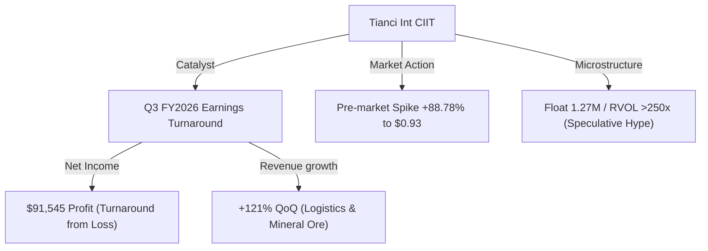
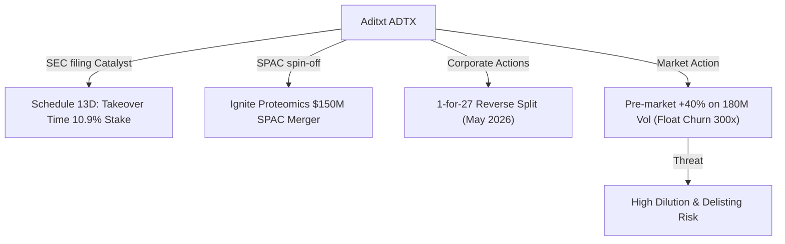
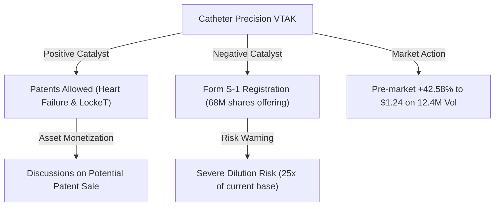
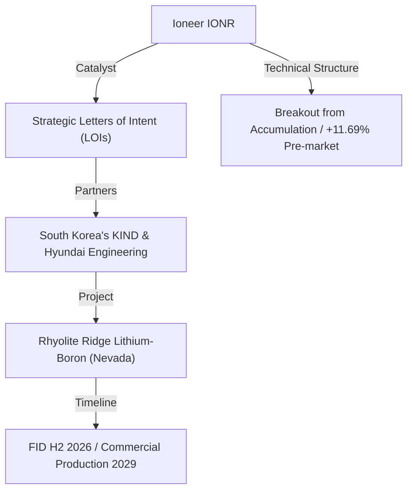
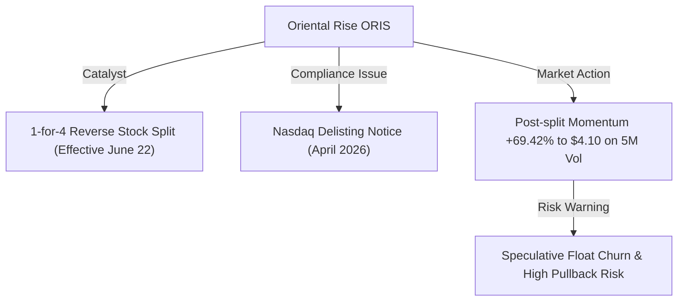

# 📊 Small-Cap & Penny Stock Intelligence Report
**Hedge Fund Trading Desk / Market Intelligence Division**  
**Date:** June 23, 2026  
**Market Stance:** Selective Catalyst Trading / High-Beta Volatility / Impending Dilution & Split Warnings

---

## 📈 Executive Summary

สภาวะตลาดการเงินสหรัฐฯ ในการซื้อขายก่อนเปิดตลาดปกติ (Pre-Market) ของวันอังคารที่ 23 มิถุนายน 2026 กำลังเผชิญกับความผันผวนอย่างรุนแรงจากการเทขายสุทธิในกลุ่มเทคโนโลยีขนาดใหญ่ (Tech Sell-off) ซึ่งส่งแรงกดดันต่อเนื่องไปยังดัชนี Nasdaq 100 ฟิวเจอร์ส ที่ปรับตัวลดลงกว่า **-2.79%** ร่วมกับการขยับตัวสูงขึ้นของอัตราผลตอบแทนพันธบัตรรัฐบาลสหรัฐฯ (U.S. Treasury Yields) ท่ามกลางมุมมองเชิงตึงตัว (Hawkish Outlook) ของธนาคารกลางสหรัฐฯ (Fed) และทิศทางเงินเฟ้อของแคนาดาที่เร่งตัวขึ้นมาที่ 3.2% ในเดือนพฤษภาคม 

อย่างไรก็ดี ในฝั่งของ **Smart Money** และกลุ่มนักเก็งกำไรรายย่อย (Retail Day Traders) ได้เกิดการหมุนเวียนกระแสเงินทุนอย่างชัดเจนออกจากหุ้นมาร์เก็ตแคปขนาดใหญ่ที่อยู่ในเขตซื้อมากเกินไป (Overbought Zone) และเข้าหาสภาพคล่องในกลุ่มหุ้นขนาดเล็ก (Small-Cap), Micro-Cap และ Penny Stocks ที่มีประเด็นข่าวตัวเร่งเฉพาะตัว (Specific Catalyst) เช่น รายงานผลประกอบการเทิร์นอะราวด์ (Earnings Turnaround), การประกาศถือหุ้นใหญ่ผ่านเอกสาร SEC Filing (Schedule 13D), การบรรลุข้อตกลงความร่วมมือเชิงยุทธศาสตร์ระดับชาติ (Strategic LOIs), รวมถึงความเคลื่อนไหวหลังการทำ Reverse Stock Split เพื่อรักษาเกณฑ์จดทะเบียน

รายงานฉบับนี้ทำการวิเคราะห์เชิงลึกตามหลักโครงสร้างตลาด (Market Microstructure), สภาพคล่องในกระดานคำสั่งซื้อขาย (Order Book Liquidity), สัญญาณ Smart Money, สุขภาพทางการเงิน (Financial Health) และความเสี่ยงจากการเสนอขายหุ้นเพิ่มทุน (Dilution Risks) ของหุ้นขนาดเล็กจำนวน 5 บริษัทที่มีปริมาณการซื้อขายหนาแน่นผิดปกติ (Volume Spike) และความผันผวนสูงในรอบ 24-72 ชั่วโมงที่ผ่านมา เพื่อใช้เป็นแนวทางวิเคราะห์อย่างเป็นทางการระดับสถาบัน

---

## 🔬 In-Depth Stock Analysis

### 1️⃣ Tianci International, Inc. (NASDAQ: CIIT)
*Earnings Turnaround Catalyst: Return to Profitability & Logistics/Mineral Inflow vs. Sustainability Risk*

#### **1. Company Overview**
*   **Sector / Industry:** Industrials / Integrated Logistics & Mineral Sales
*   **Market Cap:** ~$1.80 Million USD (Micro-Cap)
*   **Current Price:** ~$0.93 (ราคาพุ่งขึ้น +88.78% ในช่วง Pre-Market จากราคาปิดวันก่อนหน้า $0.49)
*   **Average Volume (30D):** ~80,000 shares
*   **Float:** ~1.27 Million shares
*   **Short Float %:** ~2.58% of Float
*   **Shares Outstanding:** ~3.60 Million shares
*   **Institutional Ownership:** ~0.50% (ถือครองต่ำมากเนื่องจากมาร์เก็ตแคปเล็กเกินไป)
*   **Insider Ownership:** ~65.20% (กลุ่มผู้ก่อตั้งและผู้บริหารรายใหญ่ถือหุ้นควบคุมไว้)

#### **2. Price Action Analysis**
*   **Movement:** ราคาพุ่งก้าวกระโดด (Gap Up) ในช่วง Pre-Market แตะจุดสูงสุดที่ $0.93 หรือเพิ่มขึ้นกว่า **+88.78%** ปลดล็อกกรอบสะสมเดิมบริเวณ $0.45 - $0.55 ขึ้นมาประชิดแนวต้านระดับจิตวิทยาที่ $1.00
*   **Microstructure:** สภาพคล่องฝั่ง Bid-Ask มีความเบาบางและห่างกว้าง (Thin Spread) ตามธรรมชาติของ Micro-Cap ทว่ามีคำสั่งกวาดซื้อ Ask Size ขนาดใหญ่ทำให้ราคาพุ่งขึ้นอย่างรวดเร็ว โครงสร้างราคาบ่งชี้ความตึงตัวทางเทคนิคในระยะสั้น
*   **Accumulation/Distribution:** มีสัญญาณการสะสม (Accumulation) จากกลุ่มนักเก็งกำไรระยะสั้นที่เข้ามาไล่ราคาซื้อคืนหลังจากการรายงานข่าว แต่เนื่องจากราคาปรับตัวขึ้นแบบเป็นแนวดิ่ง จึงต้องระวังการกระจายหุ้นทำกำไร (Distribution/Exit Liquidity) ของกลุ่มผู้ถือหุ้นภายในทันทีที่เปิดตลาดซื้อขายปกติ

#### **3. Volume Analysis**
*   **Relative Volume (RVOL):** **>250x** เทียบกับค่าเฉลี่ยปกติ 30 วัน
*   **Volume Spike:** ปริมาณการซื้อขายในช่วง Pre-Market สะสมหนาแน่นถึง **26.41 ล้านหุ้น** ซึ่งสูงกว่าจำนวน Float จริงของบริษัทที่มีเพียง 1.27 ล้านหุ้นไปเกือบ 20 เท่า (Float Churn Rate > 2000%) 
*   **Smart Money Signal:** ปริมาณโวลุ่มที่มหาศาลนี้เป็นสัญญาณการเข้ามาของ "นักเก็งกำไรรายย่อยและโปรแกรม HFT" ที่ไล่ล่าหุ้นกัปเปอร์ประจำวัน ไม่พบกระแสเงินสะสมระยะยาวจากกองทุนสถาบันหลัก (Institutional Inflow)

#### **4. News & Catalyst Analysis**
*   **Catalyst (Q3 FY2026 Financial Results):**
    1. CIIT รายงานผลการดำเนินงานไตรมาส 3 ประจำปีการเงิน 2026 (สิ้นสุด 30 เมษายน 2026) โดยพลิกกลับมามีกำไรสุทธิ (Net Income) จำนวน **$91,545 ดอลลาร์** เทียบกับผลขาดทุนสุทธิอย่างรุนแรงในไตรมาสเดียวกันของปีก่อนหน้า
    2. รายได้รวมเติบโตแบบก้าวกระโดดถึง **+121% QoQ** (ไตรมาสต่อไตรมาส) ซึ่งบริษัทระบุว่ามาจากการขยายตัวของรายได้จากธุรกิจโลจิสติกส์และการเปิดตลาดส่งออกแร่ธาตุ (Mineral Ore Sales)
*   **Bull vs Bear Case:**
    *   *Bull Case:* ผลการดำเนินงานที่กลับมามีกำไร (Turnaround) เป็นเครื่องยืนยันว่าการเปลี่ยนทิศทางธุรกิจเข้าสู่การค้าแร่เหล็ก/แร่ธาตุเริ่มสร้างกระแสเงินสดได้จริง และมีโอกาสหลุดพ้นจากสภาวะขาดทุนเรื้อรัง
    *   *Bear Case:* กำไรสุทธิเพียง $91,545 ดอลลาร์ ถือเป็นฐานที่ต่ำมากและไม่มีเสถียรภาพ หากราคาแร่ธาตุในตลาดโลกผันผวนหรือสายงานโลจิสติกส์ชะลอตัวในไตรมาสหน้า ผลประกอบการอาจกลับมาติดลบได้อย่างรวดเร็ว

#### **5. Financial Health**
*   **Revenue Growth & Profitability:** รายได้เติบโตจากฐานที่ต่ำ แต่อัตรากำไรสุทธิ (Net Margin) ยังคงบางเฉียบในระดับต่ำกว่า 5%
*   **Cash Position & Debt Level:** เงินสดในมือค่อนข้างตึงตัวที่ระดับต่ำกว่า $500,000 ดอลลาร์ ขณะที่หนี้สินระยะสั้นมีแนวโน้มเพิ่มขึ้นเพื่อใช้เป็นทุนหมุนเวียน (Working Capital) ในการจัดหาแร่ธาตุ
*   **Runway & Dilution Risk:** **ความเสี่ยงปานกลางถึงสูง (Moderate-to-High Dilution Risk)** แม้ว่าผลประกอบการจะพลิกเป็นบวก แต่ด้วยเงินสดในมือที่ต่ำ หากบริษัทต้องการขยายพอร์ตการขายแร่ที่มีมูลค่าดีลสูงขึ้น มีความเป็นไปได้สูงที่จะต้องระดมทุนผ่านโครงสร้างเสนอขายหุ้นใหม่ (Equity Offering) หรือการออกหุ้นกู้แปลงสภาพ (Convertible Notes)

#### **6. Market Sentiment**
*   **Retail Sentiment:** ชุมชนเทรดเดอร์ฝั่งรายย่อยใน Stocktwits และบอร์ดเก็งกำไรใน Discord มีความตื่นตัวสูงมากจากโวลุ่มเทรดที่หนาแน่นเป็นอันดับต้นๆ ของวัน โดยมองเป็นตัวเลือกการเล่นแบบ Momentum Play ระยะสั้น แต่ไม่มีความภักดีต่อพื้นฐานหุ้นระยะยาว

#### **7. Technical Analysis**
*   **Trend Structure:** กราฟระดับ Daily ทะลุกรอบ Trendline ขาลงที่ครอบงำมานานกว่าครึ่งปีได้อย่างเด็ดขาด ยืนเหนือเส้น EMA 50 ($0.58) ได้อย่างแข็งแกร่ง
*   **Indicators:** RSI รายวันปรับตัวขึ้นสู่ระดับ **82.4 (Deep Overbought)** บ่งบอกถึงภาวะตึงตัวอย่างรุนแรง และมีจุดห่างจากเส้น EMA 200 ($0.68) ค่อนข้างมาก ซึ่งเพิ่มความเสี่ยงในการเกิด Mean Reversion หรือการย่อตัวลงมาทดสอบแนวรับ
*   **Support/Resistance:** แนวรับ: $0.68 (EMA 200), $0.58 / แนวต้าน: $1.00 (แนวต้านจิตวิทยา), $1.25

#### **8. Risk Analysis & Rating**
*   **Risk Level: ความเสี่ยงสูง (High Risk)**
*   **Threats:** ความผันผวนจากการขายทำกำไรของกลุ่มผู้ถือหุ้นรายเดิมเนื่องจากปริมาณหุ้นหมุนเวียน (Float) ต่ำมาก, ความเสี่ยงในการรักษากรอบราคาสูงกว่า $1.00 เพื่อให้เป็นไปตามเกณฑ์ขั้นต่ำของ Nasdaq ในระยะยาว

---

### 2️⃣ Aditxt, Inc. (NASDAQ: ADTX)
*SPAC Spin-off Speculation vs. Extreme Dilution & Delisting Realities*

#### **1. Company Overview**
*   **Sector / Industry:** Healthcare / Biotechnology
*   **Market Cap:** ~$25,000 USD (Micro-Cap / หุ้นที่มีมูลค่าตลาดต่ำเป็นพิเศษเนื่องจากการลดจำนวนหุ้นในอดีต)
*   **Current Price:** ~$0.03 (ปรับตัวขึ้น +42.71% ในช่วง Pre-Market)
*   **Average Volume (30D):** ~1.05 Million shares
*   **Float:** ~555,421 shares
*   **Short Float %:** ~16.81% of Float
*   **Shares Outstanding:** ~815,921 shares
*   **Institutional Ownership:** ~2.10% (มีการขายออกอย่างมีนัยสำคัญจากกองทุนขนาดใหญ่ เช่น HRT Financial)
*   **Insider Ownership:** ~15.20%

#### **2. Price Action Analysis**
*   **Movement:** ราคาพุ่งขึ้นในกระดาน Pre-Market กว่า **+42.71%** จากจุดต่ำสุดประวัติการณ์เดิมบริเวณ $0.02 ขึ้นมาซื้อขายในกรอบ $0.03 - $0.035 ท่ามกลางปริมาณการเทรดที่สะสมอย่างมหาศาล
*   **Microstructure:** หน้ากระดานคำสั่งซื้อขายมีการจับคู่สัญญาอย่างรวดเร็วจากคำสั่งซื้อระดับย่อย (Odd-lot Orders) และโปรแกรมบอทเทรด มีการสะสมฝั่ง Bid แบบหน้าหนาขึ้นเพื่อรองรับแรงขายกระจายสินค้า (Distribution) ของกลุ่มทุนเดิม
*   **Accumulation/Distribution:** มีลักษณะของการบีบทำลายฝั่งชอร์ตในระยะสั้น (Short Covering) ผสมผสานกับแรงซื้อเก็งกำไรตามข่าว แต่โครงสร้างระยะยาวสะท้อนสัญญาณการกระจายหุ้นเพื่อหาทางออก (Exit Liquidity) ของนักลงทุนสถาบันที่ทยอยถอนตัว

#### **3. Volume Analysis**
*   **Relative Volume (RVOL):** **>170x** เทียบกับค่าเฉลี่ยปกติ
*   **Volume Spike:** โวลุ่มในตลาด Pre-Market สูงถึง **180.15 ล้านหุ้น** ซึ่งคิดเป็นกว่า **324 เท่า** ของจำนวน Float ทั้งหมด (555,421 หุ้น) สะท้อนภาพการหมุนเวียนเปลี่ยนมือของหุ้นอย่างบ้าคลั่งในกลุ่มเทรดเดอร์รายย่อย (Extreme Speculative Churn)
*   **Smart Money Signal:** สัญญาณจาก Schedule 13D บ่งชี้ว่ามีกลุ่มทุน **Takeover Time 2026 LLC** เข้ามาถือครองหุ้นสัดส่วน 10.9% แต่ในทางตรงกันข้าม สถาบันรายใหญ่ทั่วไปกำลังทยอยขายออกเพื่อตัดขาดทุนจากผลกระทบของการเพิ่มทุนเรื้อรัง

#### **4. News & Catalyst Analysis**
*   **Catalyst (Schedule 13D SEC Filing & Ignite Proteomics SPAC):**
    1. เอกสาร SEC Filing (Schedule 13D) ลงวันที่ 22 มิถุนายน 2026 เปิดเผยว่า Takeover Time 2026 LLC ได้ซื้อหุ้น ADTX จำนวน 3,420,439 หุ้น (คิดเป็นสัดส่วน **10.9%** ของบริษัท ณ ช่วงเวลาก่อนหน้าปรับโครงสร้างทุน) เพื่อวัตถุประสงค์ในการลงทุนระยะยาว
    2. บริษัทยังคงมีแผนงานการปั่นแยกธุรกิจ (Spin-off) ของบริษัทย่อย **Ignite Proteomics** ผ่านการควบรวมกิจการกับ SPAC มูลค่าดีลประมาณ $150 ล้านดอลลาร์ ซึ่งนักลงทุนคาดหวังว่าจะได้รับหุ้นปันผลในอนาคต
*   **Bull vs Bear Case:**
    *   *Bull Case:* การเข้ามาของกลุ่มทุนใหม่และการจัดตั้งกลุ่มควบคุมชี้ว่ายังมีนักลงทุนสถาบันบางส่วนเห็นมูลค่าแฝงในทรัพย์สินทางปัญญาด้านภูมิคุ้มกันวิทยา และการควบรวมกิจการของ Ignite Proteomics สำเร็จ อาจเป็นจุดเปลี่ยนสำคัญในการลดภาระหนี้สิน
    *   *Bear Case:* ประวัติการเจือจางหุ้นของ ADTX อยู่ในระดับเลวร้ายที่สุด โดยบริษัทเพิ่งดำเนินการควบรวมหุ้นในอัตรา **1-for-27** ในช่วงปลายเดือนพฤษภาคม 2026 เพื่อรักษาเกณฑ์จดทะเบียน และยังมีภาระผูกพันทางการเงินกับกลุ่มทุนกู้ยืมที่อาจแปลงเป็นหุ้นใหม่ได้ตลอดเวลา

#### **5. Financial Health**
*   **Revenue Growth & Profitability:** บริษัทยังไม่มีรายได้จากการขายผลิตภัณฑ์เชิงพาณิชย์หลักอย่างมีนัยสำคัญ และมีผลขาดทุนจากการดำเนินงานสะสมในระดับสูง
*   **Cash Position & Debt Level:** เงินสดในมือเหลือน้อยมาก และมีความเสี่ยงล้มละลายสูงหากไม่ได้รับการระดมทุนผ่านหนี้สินหรือเสนอขายหุ้นเพิ่มเติม
*   **Runway & Dilution Risk:** **ระดับสูงมากเป็นพิเศษ (Severe Dilution & Bankruptcy Risk)** บริษัทมีการออกตราสารทางการเงินและใบสำคัญแสดงสิทธิเลือกซื้อหุ้น (Warrants) ในราคาต่ำจำนวนมาก การพุ่งขึ้นของราคาหุ้นทุกครั้งมักถูกใช้เป็นโอกาสในการประกาศเสนอขายหุ้นเพิ่มทุน (Offering) ทันที ส่งผลกระทบเชิงลบต่อผู้ถือหุ้นรายย่อยอย่างหนัก

#### **6. Market Sentiment**
*   **Retail Sentiment:** ระดับ FOMO พุ่งสูงลิ่วบน Stocktwits ชุมชนรายย่อยพยายามปั่นกระแส "10.9% Takeover" และ "Ignite SPAC $150M" โดยละเลยประเด็นเรื่องสุขภาพทางการเงินที่อ่อนแอและการเจือจางหุ้นที่มีแนวโน้มเกิดขึ้นตลอดเวลา

#### **7. Technical Analysis**
*   **Trend Structure:** แนวโน้มหลักในภาพกว้างยังคงเป็นขาลงเต็มตัว (Long-term Bearish Downtrend) แม้ว่ากราฟระยะสั้นระดับชั่วโมงจะพยายามทำรูปแบบดีดตัวสะท้อนกลับ (Oversold Bounce) จากระดับลึกที่สุด
*   **Indicators:** RSI ในกรอบเวลาสั้นพุ่งขึ้นเกิน 75 (Overbought) สัญญานข้ามผ่าน VWAP บ่งชี้แรงซื้อที่หนาแน่นในกรอบเช้า แต่ไม่สามารถยืนยันจุดกลับตัวในระยะยาวได้หากไม่ผ่านแนวต้านสำคัญที่ $0.05
*   **Support/Resistance:** แนวรับ: $0.02 (ฐานราคาต่ำสุดประวัติศาสตร์) / แนวต้าน: $0.045, $0.06

#### **8. Risk Analysis & Rating**
*   **Risk Level: ความเสี่ยงสูงมากที่สุด (Extreme Risk)**
*   **Threats:** ความเสี่ยงสูงที่จะเผชิญการเพิ่มทุนแบบไม่แจ้งล่วงหน้า (Sudden Offering), ความเสี่ยงที่จะไม่สามารถคงสถานะจดทะเบียนในตลาด Nasdaq ได้ (Delisting Risk) แม้จะทำการรวมหุ้นแล้วก็ตาม เนื่องจากราคาปัจจุบันยังอยู่ในระดับต่ำกว่ามาตรฐาน

---

### 3️⃣ Catheter Precision, Inc. (NYSE American: VTAK)
*IP Allowance Speculation vs. S-1 Offering & 25x Dilution Threat*

#### **1. Company Overview**
*   **Sector / Industry:** Healthcare / Medical Devices
*   **Market Cap:** ~$2.30 Million USD (Micro-Cap)
*   **Current Price:** ~$1.24 (บวกเพิ่มขึ้น +42.58% ในช่วง Pre-Market จากราคาปิดวานนี้ $0.87)
*   **Average Volume (30D):** ~500,000 shares
*   **Float:** ~2.58 Million shares
*   **Short Float %:** ~1.78% of Float
*   **Shares Outstanding:** ~2.69 Million shares
*   **Institutional Ownership:** ~4.02%
*   **Insider Ownership:** ~10.15%

#### **2. Price Action Analysis**
*   **Movement:** ราคาฟื้นตัวรุนแรงในกรอบ Pre-Market ทะลุระดับเส้นค่าเฉลี่ยขึ้นมาแตะ $1.24 เพิ่มขึ้นกว่า **+42.58%** หลังจากเผชิญแรงกดดันอย่างหนักในช่วงหลายสัปดาห์ที่ผ่านมา
*   **Microstructure:** โครงสร้าง Bid-Ask มีสเปรดกว้างขึ้นในกรอบเช้า สะท้อนความผันผวนของราคาสูง ความพยายามไล่ราคาฝั่งซื้อเผชิญแรงต้านสำคัญบริเวณจิตวิทยาที่ $1.50 ซึ่งเป็นโซนที่มีผู้ติดดอยสะสมเป็นจำนวนมาก
*   **Accumulation/Distribution:** การประกาศข่าวดีเรื่องสิทธิบัตรควบคู่กับข่าวการขายทรัพย์สินกระตุ้นแรงซื้อสะสมระยะสั้น แต่อย่างไรก็ตาม การยื่นเอกสาร Form S-1 เพื่อขายหุ้นปริมาณมหาศาลเป็นการเตรียมการกระจายหุ้นจำนวนมากเข้าสู่ตลาดอย่างเป็นระบบ (Systematic Distribution Preparation)

#### **3. Volume Analysis**
*   **Relative Volume (RVOL):** **>24x** เทียบกับค่าเฉลี่ยปกติ
*   **Volume Spike:** ปริมาณการเทรด Pre-Market สูงถึง **12.46 ล้านหุ้น** (คิดเป็นกว่า 4.8 เท่าของจำนวน Float ทั้งหมดของบริษัท) สะท้อนการไหลเข้าของแรงเก็งกำไรที่เน้นความเร็ว
*   **Smart Money Signal:** ยังไม่มีธุรกรรมประเภท Block Trade ฝั่งซื้อของสถาบันที่ถือครองระยะยาว แต่พบธุรกรรมเพื่อเตรียมระบายหุ้น (Selling Shareholders) ตามสิทธิในแบบแสดงรายการ S-1

#### **4. News & Catalyst Analysis**
*   **Catalyst (IP Expansion, Asset Sale Discussion & Form S-1 Filing):**
    1. **ปัจจัยบวก:** บริษัทประกาศได้รับอนุมัติสิทธิบัตรใหม่รวม 11 รายการ ครอบคลุมเทคโนโลยีรักษาภาวะหัวใจล้มเหลว (8 รายการ) และอุปกรณ์ปิดแผลหลอดเลือด "LockeT" (3 รายการ) และเปิดเผยว่า **กำลังอยู่ในขั้นตอนการหารือเพื่อขายสายเทคโนโลยีทั้งสองประเภทนี้** เพื่อสร้างกระแสเงินสดทดแทน
    2. **ปัจจัยลบ (รุนแรง):** เมื่อวันที่ 22 มิถุนายน 2026 บริษัทได้ยื่นแบบแสดงรายการ **Form S-1** ต่อ SEC เพื่อขอลงทะเบียนขายหุ้นสามัญจำนวนรวมถึง **68,067,042 หุ้น** แทนผู้ถือหุ้นเดิมที่ได้รับสิทธิ (Selling Stockholders)
*   **Bull vs Bear Case:**
    *   *Bull Case:* หากบริษัทสามารถบรรลุดีลการขายสิทธิบัตรสายเทคโนโลยีรักษาภาวะหัวใจล้มเหลวและ LockeT ให้กับบริษัทเครื่องมือแพทย์รายใหญ่ได้จริง จะได้รับเงินก้อนโตเข้ามาฟื้นฟูงบการเงินโดยไม่ต้องใช้สิทธิขายหุ้นตามแบบ S-1
    *   *Bear Case:* จำนวนหุ้นที่เสนอขายตามแบบ S-1 สูงถึง 68 ล้านหุ้น เมื่อเทียบกับหุ้นที่จดทะเบียนอยู่เดิมเพียง 2.69 ล้านหุ้น คิดเป็น **การเจือจางหุ้น (Dilution) สูงกว่า 25 เท่า** หากผู้ถือหุ้นกลุ่มนี้เทขายหุ้นออกมาในตลาดเสรี ราคาหุ้นจะทรุดตัวลงสู่ระดับต่ำสุดเป็นประวัติการณ์ทันที

#### **5. Financial Health**
*   **Revenue Growth & Profitability:** ยอดขายของเครื่องมือระบบ VIVO และ LockeT ยังอยู่ในระดับจำกัด บริษัทยังไม่สามารถทำกำไรจากการดำเนินงานปกติได้
*   **Cash Position & Debt Level:** กระแสเงินสดจากการดำเนินงานเป็นลบอย่างต่อเนื่อง เงินสดใกล้หมดลง ซึ่งอธิบายความจำเป็นในการเตรียมระดมทุนผ่านเอกสาร S-1 จำนวน 68 ล้านหุ้นข้างต้น
*   **Runway & Dilution Risk:** **ระดับอันตรายสูงสุด (Severe Dilution & Liquidity Risk)** เงินทุนสำรองปัจจุบันรองรับการทำงานได้อีกเพียงไม่กี่เดือน ความเป็นไปได้ในการระดมทุนผ่านการออกหุ้นเพิ่มทุนเป็นทางออกทางเดียวในการดำเนินธุรกิจต่อไป

#### **6. Market Sentiment**
*   **Retail Sentiment:** กลุ่มนักลงทุนรายย่อยส่วนใหญ่เลือกมองเฉพาะข่าวเชิงบวกประเด็น "สิทธิบัตรและการเจรจาขายสินทรัพย์" โดยไม่ได้ตรวจสอบความเสี่ยงจากปริมาณหุ้นตามเอกสาร S-1 ที่ยื่นพร้อมกัน ส่งผลให้เกิดกระแสไล่ราคาด้วยความเข้าใจที่ไม่ครอบคลุม (Uninformed FOMO)

#### **7. Technical Analysis**
*   **Trend Structure:** กราฟกลับตัวขึ้นระยะสั้น แต่มีแนวต้านแข็งแกร่งของเส้น EMA 200 วันที่ระดับ $1.55 การเคลื่อนไหวในกรอบล่างยังคงเปราะบาง
*   **Indicators:** RSI รายวันพุ่งแตะระดับ 68.9 ใกล้เข้าสู่ขอบเขต Overbought ระดับราคาเคลื่อนไหวทะลุขอบบนของ Bollinger Bands ซึ่งมักจะชี้วัดโอกาสการย่อตัวลงมาปรับฐานระยะสั้น
*   **Support/Resistance:** แนวรับ: $1.00, $0.85 / แนวต้าน: $1.40, $1.55 (EMA 200)

#### **8. Risk Analysis & Rating**
*   **Risk Level: ความเสี่ยงสูงมากที่สุด (Extreme Risk)**
*   **Threats:** ความเสี่ยงการเจือจางอย่างรุนแรง (Severe Dilution) สูงถึง 25 เท่าจากหุ้นที่จะลงทะเบียนขายตาม S-1, ความเสี่ยงต่อการขาดสภาพคล่องและตกอยู่ในสภาวะติดกับดักด้านสภาพคล่อง (Liquidity Trap) ทันทีที่การประกาศข่าวเสร็จสิ้น

---

### 4️⃣ Ioneer Ltd (NASDAQ: IONR)
*Strategic Partnership De-risking Nevada Lithium Project vs. Capital Expenditure Scale*

#### **1. Company Overview**
*   **Sector / Industry:** Basic Materials / Other Industrial Metals & Mining (Lithium & Boron Developer)
*   **Market Cap:** ~$295.00 Million USD (Small-Cap)
*   **Current Price:** ~$4.30 (ปรับตัวขึ้น +11.69% ในช่วง Pre-Market จากราคาปิด $3.85)
*   **Average Volume (30D):** ~200,000 shares
*   **Float:** ~57.59 Million shares
*   **Short Float %:** ~0.54% of Float
*   **Shares Outstanding:** ~75.83 Million shares
*   **Institutional Ownership:** ~22.40% (มีสัดส่วนกลุ่มทุนสถาบันถือครองค่อนข้างหนาแน่นและมั่นคง)
*   **Insider Ownership:** ~12.10%

#### **2. Price Action Analysis**
*   **Movement:** ราคาหุ้นพุ่งขึ้นอย่างมีระเบียบในกระดาน Pre-Market ขยับตัวบวก **+11.69%** ทำลายกรอบแนวต้านบริเวณ $4.00 ซึ่งสอดคล้องกับโครงสร้างขาขึ้นรอบใหม่
*   **Microstructure:** โครงสร้างตลาด (Order Book) มีความหนาแน่นสูง สเปรด Bid-Ask แคบและมีปริมาณคำสั่งซื้อเสนอในระดับสถาบัน (Institutional Block Bid) แตกต่างจากหุ้นเก็งกำไรตัวอื่นอย่างชัดเจน
*   **Accumulation/Distribution:** พบสัญญาณการซื้อเพื่อสะสมสถานะอย่างต่อเนื่อง (Systematic Accumulation) บนฐานแนวรับหลัก สะท้อนความเชื่อมั่นของกลุ่มทุนระยะยาว (Smart Money Inflow)

#### **3. Volume Analysis**
*   **Relative Volume (RVOL):** **>10.5x** เทียบกับค่าเฉลี่ยปกติ
*   **Volume Spike:** ปริมาณการเทรดในตลาดล่วงหน้าอยู่ที่ประมาณ **206,536 หุ้น** แม้ตัวเลขดูไม่สูงเทียบกับหุ้นปั่นตัวอื่น แต่สำหรับหุ้นผู้พัฒนาเหมืองแร่นับว่าเป็นโวลุ่มสนับสนุนที่แข็งแกร่งและน่าเชื่อถือ
*   **Smart Money Signal:** พบการทำธุรกรรมนอกกระดาน (Dark Pool) สะสมในหุ้นแม่มาระยะหนึ่ง และมีปริมาณการขยับฝั่ง Bid ของสถาบันเพื่อรองรับหุ้น บ่งชี้ความสนใจของกลุ่มทุนระยะยาว

#### **4. News & Catalyst Analysis**
*   **Catalyst (Strategic LOIs with Korean Partners):**
    1. Ioneer ประกาศลงนามในหนังสือแสดงเจตจำนงที่ไม่ผูกมัดทางกฎหมาย (Non-binding LOIs) ร่วมกับรัฐวิสาหกรรมเกาหลีใต้ **KIND** (Korea Overseas Infrastructure & Urban Development Corp.) และบริษัทรับเหมาวิศวกรรมระดับโลก **Hyundai Engineering Co.**
    2. ความร่วมมือครั้งนี้จัดตั้งขึ้นเพื่อสนับสนุนทางการเงินและการก่อสร้างโครงการเหมืองแร่ลิเธียม-โบรอน **Rhyolite Ridge** ในรัฐเนวาดา สหรัฐอเมริกา ซึ่งเป็นแหล่งแร่ลิเธียม-โบรอนที่ใหญ่ที่สุดเพียงแห่งเดียวในอเมริกาเหนือ
    3. ทั้งสามฝ่ายมีแผนจะยกระดับดีลนี้เป็นข้อตกลงลงนาม MOU อย่างเป็นทางการในเดือน **กรกฎาคม 2026** เพื่อเตรียมพร้อมตัดสินใจลงทุนขั้นสุดท้าย (Final Investment Decision - FID) ในช่วงครึ่งหลังของปี 2026
*   **Bull vs Bear Case:**
    *   *Bull Case:* พันธมิตรจากเกาหลีใต้ทั้งสองรายเข้ามาขจัดความเสี่ยงที่สำคัญที่สุด (De-risking) สองเรื่อง คือ **ความสามารถทางการเงิน** และ **การก่อสร้างทางวิศวกรรม** ซึ่งช่วยปูทางให้ได้รับการอนุมัติเงินกู้จากกระทรวงพลังงานสหรัฐฯ (DOE Loan $700M+) ได้ง่ายขึ้น
    *   *Bear Case:* เป็นโครงการพัฒนาระยะยาวที่คาดว่าจะเริ่มผลิตเชิงพาณิชย์ได้ในปี 2029 ระหว่างนี้บริษัทยังต้องเจอกับขั้นตอนการวิเคราะห์ผลกระทบสิ่งแวดล้อมและประเด็นการฟ้องร้องจากกลุ่มอนุรักษ์ธรรมชาติในรัฐเนวาดา

#### **5. Financial Health**
*   **Revenue Growth & Profitability:** ปัจจุบันยังไม่มีรายได้เชิงพาณิชย์หลัก (Pre-revenue Stage) เนื่องจากเหมืองอยู่ในขั้นพัฒนาและรับทำใบอนุญาต
*   **Cash Position & Debt Level:** มีสถานะทางการเงินมั่นคงขึ้นจากการได้รับวงเงินกู้สนับสนุนจากโครงการของรัฐบาลสหรัฐฯ และการระดมทุนของพันธมิตรยุทธศาสตร์ (เช่น Sibanye-Stillwater)
*   **Runway & Dilution Risk:** **ความเสี่ยงปานกลาง (Moderate Dilution Risk)** เหมืองแร่ระดับนี้ต้องการเม็ดเงินลงทุน (CapEx) มหาศาล แต่ด้วยโครงสร้างเงินกู้กึ่งอุดหนุนจากรัฐบาลและความร่วมมือของ Hyundai Engineering ทำให้ความเสี่ยงจากการเทขายหุ้นสามัญราคาถูกลดต่ำลงอย่างมากเมื่อเทียบกับบริษัทกลุ่มสำรวจทั่วไป

#### **6. Market Sentiment**
*   **Retail & Institutional Sentiment:** ทิศทางอารมณ์ตลาดเป็นเชิงบวกอย่างยั่งยืน นักลงทุนเชื่อมั่นในแผนระยะยาวของห่วงโซ่อุปทานลิเธียมในสหรัฐฯ (US Lithium Supply Independence) มากกว่าการเก็งกำไรระยะสั้น

#### **7. Technical Analysis**
*   **Trend Structure:** โครงสร้างหลักทำรูปแบบสะสมฐานแบบกรวยหงาย (Rounded Bottom Accumulation Base) ยืนยันจังหวะ Breakout เหนือแนวต้านจิตวิทยาที่ $4.00 
*   **Indicators:** กราฟตัดผ่านเส้นค่าเฉลี่ย EMA 50 วัน ($3.65) และ EMA 200 วัน ($3.98) ขึ้นไปยืนได้เป็นสัญญานซื้อต่อเนื่อง (Golden Cross Setup) RSI แตะระดับ 65.5 ยังไม่เข้าสู่โซน Overbought ที่ตึงตัว
*   **Support/Resistance:** แนวรับ: $3.98 (EMA 200), $3.65 / แนวต้าน: $4.50, $5.10

#### **8. Risk Analysis & Rating**
*   **Risk Level: ความเสี่ยงปานกลาง (Medium Risk)**
*   **Threats:** ความเสี่ยงในการดำเนินโครงการก่อสร้างล่าช้ากว่ากำหนด (Project Execution Delays), ประเด็นกฎหมายด้านการคุ้มครองพันธุ์พืชและสิ่งแวดล้อมในพื้นที่รัฐเนวาดา, และการผันผวนของราคาแร่ลิเธียมโลก

---

### 5️⃣ Oriental Rise Holdings Limited (NASDAQ: ORIS)
*Reverse Split Momentum Spike vs. Delisting Risk & China Governance Threat*

#### **1. Company Overview**
*   **Sector / Industry:** Consumer Defensive / Beverages (Tea Producer in China)
*   **Market Cap:** ~$2.60 Million USD (Micro-Cap)
*   **Current Price:** ~$4.10 (ราคาปรับเพิ่มขึ้น +69.42% ในช่วง Pre-Market เทียบกับระดับราคาก่อนรวมหุ้น)
*   **Average Volume (30D):** ~80,000 shares
*   **Float:** ~4.09 Million shares (ปรับตัวเลขตามอัตราส่วนรวมหุ้นใหม่)
*   **Short Float %:** ~0.80% of Float
*   **Shares Outstanding:** ~5.05 Million shares
*   **Institutional Ownership:** ~0.10% (ไม่มีการถือครองจากกองทุนสถาบันหลัก)
*   **Insider Ownership:** ~50.20%

#### **2. Price Action Analysis**
*   **Movement:** ราคาหุ้นพุ่งขึ้นอย่างผิดปกติแตะระดับ $4.10 หรือบวกกว่า **+69.42%** ในกระดานล่วงหน้า ซึ่งสะท้อนแรงซื้อตามปัจจัยทางโครงสร้างเทคนิคหลังจากการควบรวมหุ้น
*   **Microstructure:** หุ้นประเภทนี้มีสภาพคล่องจำกัดเป็นพิเศษ (Illiquid Micro-cap) สเปรด Bid-Ask กว้างมาก มีลักษณะคำสั่งเทรดสไตล์ HFT หรือบอทไล่ราคาช่วงเช้าเพื่อสร้างสัญญาณสกรีนเนอร์ (Screener bait) ดึงดูดรายย่อยเข้าร่วมรับช่วงต่อ
*   **Accumulation/Distribution:** ไม่มีพฤติกรรมสะสมหุ้นอย่างเป็นระบบในระยะยาว การขยับขึ้นครั้งนี้เป็นการปั่นราคาตามปริมาณการขายที่จำกัดหลังจากการรวมหุ้น (Post-split Low Float Squeeze) มีลักษณะของการดึงราคาเพื่อหาทางออก (Pump & Exit)

#### **3. Volume Analysis**
*   **Relative Volume (RVOL):** **>55x** เทียบกับค่าเฉลี่ยปกติ
*   **Volume Spike:** โวลุ่ม Pre-Market ทะลุขึ้นมาแตะระดับ **5.02 ล้านหุ้น** ซึ่งมากกว่ายอดจำนวน Float ใหม่ทั้งหมดของบริษัท ชี้ชัดว่าเกิดการปั่นรอบซื้อขายเปลี่ยนมือรวดเร็วแบบเก็งกำไรระยะสั้นจัด (Chasing and Flipping)
*   **Smart Money Signal:** ไม่มีสัญญานกลุ่มทุนขนาดใหญ่เข้าสะสม การซื้อขายทั้งหมดขับเคลื่อนด้วยโปรแกรมกึ่งอัตโนมัติและบัญชีนักเล่นหุ้นรายย่อย

#### **4. News & Catalyst Analysis**
*   **Catalyst (1-for-4 Reverse Stock Split & Nasdaq Delisting Defense):**
    1. บริษัทดำเนินการรวมหุ้นแบบย้อนกลับ (Reverse Stock Split) ในสัดส่วน **1 หุ้นใหม่ต่อ 4 หุ้นเดิม** ซึ่งมีผลบังคับใช้อย่างเป็นทางการเมื่อวันจันทร์ที่ 22 มิถุนายน 2026
    2. การรวมหุ้นครั้งนี้มีจุดประสงค์หลักเพื่อผลักดันให้ราคาเสนอซื้อขั้นต่ำกลับไปสูงกว่า $1.00 เพื่อต่อสู้กับ **คำสั่งแจ้งเตรียมเพิกถอน (Staff Delisting Determination)** ของ Nasdaq ที่บริษัทได้รับแจ้งตั้งแต่เดือนเมษายน 2026 จากการที่ไม่สามารถรักษาราคาหุ้นขั้นต่ำได้ตามเกณฑ์
*   **Bull vs Bear Case:**
    *   *Bull Case:* ราคาหุ้นที่กลับขึ้นมาเหนือ $4.00 ช่วยลดความเสี่ยงที่บริษัทจะโดน Delisting ออกไปจากกระดานหลักเป็นการชั่วคราว ดึงดูดโปรแกรมสแกนหุ้นเทคนิคัล
    *   *Bear Case:* โครงสร้างธุรกิจผลิตชาจีนของ ORIS ขาดศักยภาพการเติบโต และการใช้กระบวนการทางกฎหมายเพื่อพยุงราคาหุ้น (Reverse Split) ไม่ได้ช่วยปรับปรุงแนวทางการสร้างกำไร ในประวัติศาสตร์หุ้นจีนขนาดเล็กที่ทำ Reverse Split มักจะโดนทุบกลับลงมาในจุดเดิมภายในเวลา 2-4 สัปดาห์

#### **5. Financial Health**
*   **Revenue Growth & Profitability:** ยอดขายและกำไรขั้นต้นแสดงทิศทางลดลงตามสภาวะอุปสงค์ในประเทศจีน
*   **Cash Position & Debt Level:** เงินสดมีจำกัด และมีข้อจำกัดในการดึงเงินสดออกนอกประเทศจีนเพื่อมาสนับสนุนการจดทะเบียนบริษัทในต่างประเทศ (Capital Flight Constraints)
*   **Runway & Dilution Risk:** **ความเสี่ยงสูงมาก (Very High Dilution Risk)** หลังจากผ่านกระบวนการรวมหุ้นเพื่อรักษา compliance แล้ว บริษัทมีประวัติหรือมีโอกาสออกแผนขายหุ้นเพิ่มทุนในราคาเสนอลดพิเศษ (Discounted Offering) ในเวลาอันรวดเร็วเพื่อเพิ่มทุนสำรอง

#### **6. Market Sentiment**
*   **Retail Sentiment:** นักลงทุนใน Reddit และกลุ่มแชทโมเมนตัมมองการขึ้นครั้งนี้เป็นเพียงจังหวะการทำเก็งกำไรระยะสั้น (Short-term Flipping) โดยมีการตระหนักถึงความเสี่ยงของการตกเป็นเหยื่อของการปั่นราคาแบบ Pump & Dump 

#### **7. Technical Analysis**
*   **Trend Structure:** กราฟระดับ Daily แสดงแท่งเทียนสีเขียวยาวแนวตั้ง แต่เป็นสัญญาณที่เกิดจากการคำนวณฐานราคาหลังจากการควบรวมหุ้นร่วมกับการปั่นราคารองรับ ความต่อเนื่องของแนวโน้มจึงต่ำมาก
*   **Indicators:** RSI ปรับขึ้นมาแตะ 74.0 อยู่ในเขต Overbought ชัดเจน โดยราคาเทรดดึงตัวออกจากเส้นแนวโน้มหลักอย่างผิดปกติ เสี่ยงต่อการเผชิญแรงขายปิดสถานะอย่างรวดเร็ว (Sharp Reversion)
*   **Support/Resistance:** แนวรับ: $3.00, $2.50 / แนวต้าน: $4.50, $5.00

#### **8. Risk Analysis & Rating**
*   **Risk Level: ความเสี่ยงสูงมากที่สุด (Extreme Risk)**
*   **Threats:** ความเสี่ยงจากการปั่นราคาและทุบหุ้น (Pump & Dump), ความเสี่ยงจากการเพิกถอนใบอนุญาตการจดทะเบียนจดเกณฑ์ในอนาคต (Delisting/Compliance Threat), ปัญหาเรื่องธรรมาภิบาลของกลุ่มทุนจีนนอกเขตอำนาจศาล (China Corporate Governance Risk)

---

## 🧠 Smart Money & Market Microstructure Insights

ภายหลังการเจาะลึกโครงสร้างตลาดและการเคลื่อนไหวผ่านหน้ากระดานคำสั่งซื้อขายช่วงก่อนตลาดปกติ (Pre-Market) ของหุ้นทั้ง 5 ตัว สามารถจัดกลุ่มแบ่งประเภทความเคลื่อนไหวเพื่อสรุปแผนดำเนินการค้าได้ดังนี้:

*   **หุ้นที่มีความแข็งแกร่งของแนวโน้มและโมเมนตัมจริงดีที่สุด:** **Ioneer Ltd (NASDAQ: IONR)**  
    *วิเคราะห์:* การตอบรับเชิงบวกต่อพันธมิตรเชิงยุทธศาสตร์ระดับชาติของเกาหลีใต้ (KIND & Hyundai) เป็นปัจจัยที่ขจัดความเสี่ยงโครงการพัฒนาระดับประเทศได้อย่างยั่งยืน ประกอบกับการเข้ามาสะสมของกลุ่มทุนระดับสถาบันจริงไม่ใช่การเก็งกำไรระยะสั้น ทำให้โมเมนตัมมีแนวโน้มดำเนินต่อไปได้ยาวนานกว่ากลุ่มอื่น
*   **หุ้นที่มีประเด็นความเคลื่อนไหวของปริมาณการซื้อขายที่น่าสนใจที่สุด:** **Tianci International (NASDAQ: CIIT)**  
    *วิเคราะห์:* การเกิดอัตราการหมุนเวียนหุ้นหมุนเวียน (Float Churn) ระดับกว่า 20 เท่าของจำนวน Float ทั้งหมดสะท้อนความบ้าคลั่งของมวลชนและระบบ HFT ในการตอบรับงบการเงินที่รายงานตัวเลขพลิกฟื้น
*   **หุ้นที่เผชิญสัญญาณความเคลื่อนไหวของกลุ่ม Smart Money โดดเด่น:** **Aditxt, Inc. (NASDAQ: ADTX)**  
    *วิเคราะห์:* การเปิดเผยสัดส่วนการถือหุ้น 10.9% ของ Takeover Time 2026 LLC ผ่านเอกสาร SEC Filing 13D ท่ามกลางกระแสการเก็งปั่นแยก Ignite Proteomics เพื่อทำ SPAC บ่งบอกว่ามีการเข้าควบคุมบริษัทโดยกลุ่มเฉพาะกิจ
*   **หุ้นที่เป็นเพียงการเก็งกำไรระยะสั้นจัดจ้านและเสี่ยงโดนทุบสูงสุด:** **Oriental Rise Holdings (NASDAQ: ORIS)** และ **Aditxt, Inc. (NASDAQ: ADTX)**  
    *วิเคราะห์:* ทั้งสองตัวขับเคลื่อนด้วยกลไกทางเทคนิคัลและการแก้สถานการณ์เรื่องเกณฑ์ราคาจดทะเบียน (Compliance splits) ไม่ได้มีพื้นฐานงบการเงินปกติค้ำจุน มีอัตราความเสี่ยงที่จะเป็นฟองสบู่ยุบตัวลงอย่างเฉียบพลันหลังเปิดตลาด
*   **หุ้นที่พื้นฐานทางการเงินแข็งแรงที่สุดในกลุ่ม:** **Ioneer Ltd (NASDAQ: IONR)**  
    *วิเคราะห์:* แม้จะอยู่ในสถานะก่อนเริ่มดำเนินการขาย (Pre-revenue) แต่ได้รับการคุ้มครองด้วยแนวโน้มหนี้สินกึ่งอุดหนุนภาครัฐสหรัฐฯ และความร่วมมือในระบบสร้างมูลค่าการประเมินราคาที่ชัดเจน
*   **หุ้นที่ควรหลีกเลี่ยงหรือจับตาความเสี่ยงเสนอขายหุ้นเพิ่มทุน (Dilution Warning):** **Catheter Precision (NYSE American: VTAK)**  
    *วิเคราะห์:* แม้จะมีข่าวเชิงบวกด้านสิทธิบัตรและการเจรจาขายสินทรัพย์คอยช่วยพยุงภาพภายนอก แต่ความจริงเรื่องการยื่นเอกสาร Form S-1 เพื่อเสนอขายหุ้นปริมาณมหาศาลสูงถึง 68 ล้านหุ้น บนฐานเดิม 2.69 ล้านหุ้น (25x Dilution) เป็นปัจจัยลบเชิงพื้นฐานที่รุนแรงที่สุดและเป็นกับดักสำหรับนักลงทุนที่ไม่ระมัดระวัง

---

## 📌 Daily Watchlist & Rankings

### **Watchlist Classifications**
*   **Top Momentum:** **IONR** (กระแสลมหนุนขาขึ้นสะสม), **CIIT** (การเทิร์นงบการเงิน)
*   **Top Risk:** **ADTX** (ล้มละลาย/เจือจางเพิ่มทุน), **ORIS** (ปั่นราคาระหว่างวันต่ำกว่าเกณฑ์)
*   **Top Volume:** **ADTX** (>180 ล้านหุ้น), **CIIT** (>26 ล้านหุ้น)
*   **Top Catalyst:** **IONR** (ความร่วมมือ KIND & Hyundai Engineering), **VTAK** (สิทธิ์สิทธิบัตรและการเจรจาขายสายผลิตภัณฑ์)
*   **Top Speculative Play:** **ORIS** (เก็งกำไรความผันผวนระดับต่ำหลังรวมหุ้น)

---

### **Daily Standings**

### 🥇 หุ้นเด่นที่สุดประจำวัน (Top Pick of the Day)
**Ioneer Ltd (NASDAQ: IONR)**  
*เหตุผล:* เป็นหุ้นที่มีตัวเร่งปฏิกิริยาเชิงยุทธศาสตร์ที่เชื่อถือได้จริง (Strategic & Infrastructure Catalyst) มีโครงสร้างแนวโน้มทางเทคนิคที่ผ่านการสะสมฐานอย่างเป็นระบบ การร่วมมือกับ Hyundai และ KIND เกาหลีใต้ ช่วยจำกัดความเสี่ยงด้านขีดความสามารถการก่อสร้าง ทำให้ทิศทางราคาปลอดภัยจากแนวโน้มการล่มสลายเชิงสภาพคล่องเมื่อเทียบกับตัวอื่นในกลุ่ม

### ⚠️ หุ้นที่มีความเสี่ยงสูงสุดประจำวัน (Most Risky of the Day)
**Catheter Precision, Inc. (NYSE American: VTAK)**  
*เหตุผล:* แม้พาดหัวข่าวจะแสดงกระแสข่าวสิทธิ์สิทธิบัตรเพื่อดึงดูดแรงซื้อ แต่การยื่นแบบเสนอขายหุ้น Form S-1 ขนาด 68 ล้านหุ้น บนฐานเดิม 2.69 ล้านหุ้น ถือเป็นความเสี่ยงต่อการเกิดหายนะของการลดทอนสัดส่วนการถือหุ้น (Severe Dilution) สถาบันและผู้เล่นรายใหญ่สามารถใช้สภาพคล่องที่เกิดขึ้นจากแรง FOMO ของรายย่อยเป็นทางออกในการระบายหุ้นออกมาอย่างรุนแรง

### 👀 หุ้นที่ตลาดเฝ้าจับตามากที่สุด (Most Watched of the Day)
**Aditxt, Inc. (NASDAQ: ADTX)**  
*เหตุผล:* ด้วยการเคลื่อนไหวปริมาณการซื้อขายที่ระดับ 180 ล้านหุ้นในช่วง Pre-market และการรายงานการเข้าถือหุ้นใหญ่ของ Takeover Time 10.9% ผนวกกับการเก็งกำไรใน SPAC Ignite Proteomics หุ้นตัวนี้จะเป็นจุดศูนย์กลางของการปะทะกันทางสภาพคล่องระหว่างระบบ HFT และกลุ่ม Day Traders ตลอดทั้งช่วงการซื้อขายปกติ

---

**⚠️ คำเตือนความเสี่ยงการลงทุน (Risk Disclosure):**  
รายงานฉบับนี้จัดทำขึ้นเพื่อการวิเคราะห์ข้อมูลตลาดทุนตามสถิติและข่าวสารที่ปรากฏต่อสาธารณะเท่านั้น มิใช่การเสนอแนะเพื่อซื้อหรือขายหลักทรัพย์ใดหลักทรัพย์หนึ่ง หุ้นขนาดเล็ก (Small-Cap), Micro-Cap และ Penny Stocks มีระดับความผันผวนของราคาสูงเป็นพิเศษ สภาพคล่องเบาบาง และมักได้รับผลกระทบจากการออกแผนเสนอขายหุ้นเพิ่มทุน (Offering) หรือการรวมหุ้น (Reverse Split) เพื่อคงเกณฑ์จดทะเบียนอย่างรุนแรง ผู้ลงทุนควรศึกษาข้อมูลจากเอกสารชี้ชวนและ SEC Filings อย่างรอบคอบก่อนตัดสินใจซื้อขายเก็งกำไรทุกครั้ง
