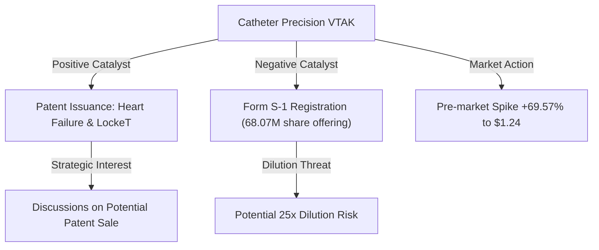
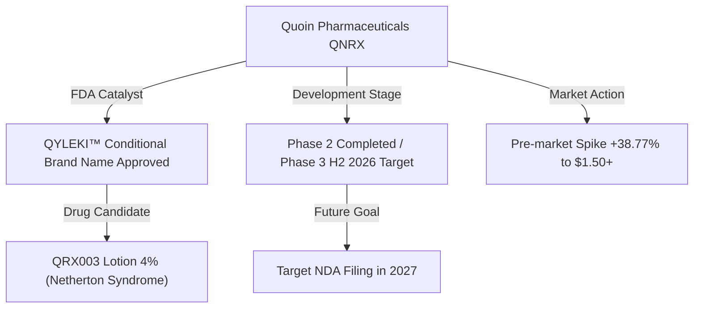
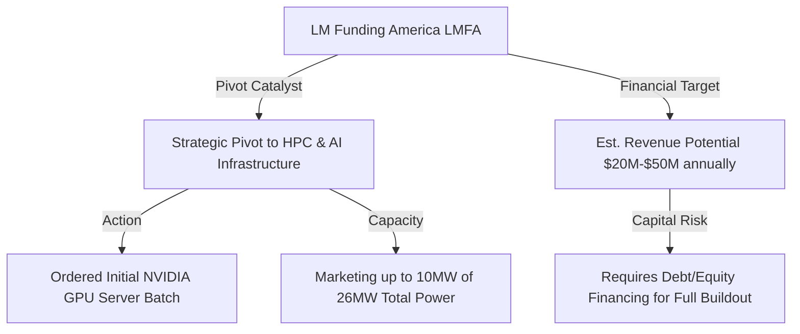
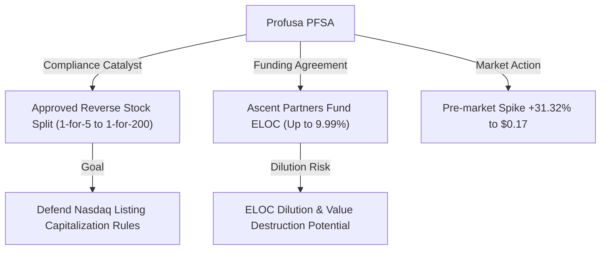
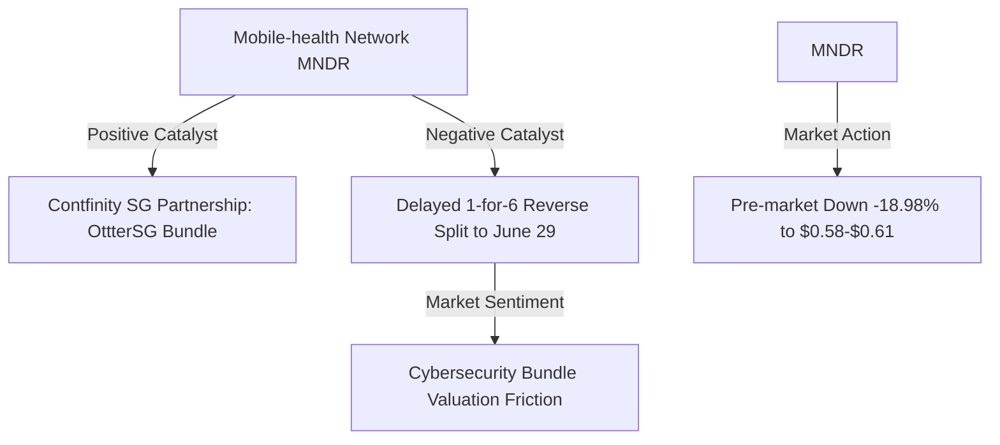

# 📊 Small-Cap & Penny Stock Intelligence Report
**Hedge Fund Trading Desk / Market Intelligence Division**  
**Date:** June 24, 2026  
**Market Stance:** High-Beta Catalyst Trading / Microstructure Churn / Extreme Dilution & Reverse Split Warnings

---

## 📈 Executive Summary

สภาวะตลาดการเงินสหรัฐฯ ในการซื้อขายล่วงหน้า (Pre-Market) ประจำวันพุธที่ 24 มิถุนายน 2026 ดำเนินไปอย่างระมัดระวัง (Mixed to Cautionary) หลังเผชิญแรงกดดันจากการปรับพอร์ตและการเทขายสุทธิในกลุ่มเทคโนโลยีและเซมิคอนดักเตอร์ (Tech & Chipmaker Sell-off) ในช่วงต้นสัปดาห์ ส่งผลให้ดัชนี Nasdaq 100 Futures อ่อนตัวลงราว **-2.8%** และ E-mini S&P 500 Futures ปรับลดลง **-1.5%** ขณะที่อัตราผลตอบแทนพันธบัตรรัฐบาลสหรัฐฯ อายุ 10 ปี (10-year U.S. Treasury Yield) ยังคงแกว่งตัวในระดับสูงใกล้ 4.5% ท่ามกลางมุมมองดอกเบี้ยที่ตึงตัวและการชะลอตัวทางเศรษฐกิจในฝั่งยุโรป

ในฝั่งของ **Smart Money** และกลุ่มนักลงทุนรายย่อย (Retail Speculators) ได้มีการหมุนเวียนกระแสเงินทุน (Sector Rotation) หลบภัยออกจากหุ้นเทคโนโลยีขนาดใหญ่ที่มีมูลค่าตึงตัว (Overvalued Tech) เข้าสู่กลุ่มหุ้นขนาดเล็ก (Small-Cap), Micro-Cap และ Penny Stocks ที่มีประเด็นข่าวตัวเร่งเฉพาะตัว (Specific Catalyst) เช่น ความคืบหน้าของสิทธิบัตรยาและเครื่องมือแพทย์ (FDA/Patent Updates), การขยายตัวเชิงยุทธศาสตร์เข้าสู่โครงสร้างพื้นฐาน AI (AI Infrastructure Pivot), การยื่นเอกสารอนุมัติแผนรักษาสถานะจดทะเบียน (Nasdaq Compliance splits) และการประกาศพันธมิตรเชิงพาณิชย์

รายงานฉบับนี้ทำการวิเคราะห์เชิงลึกตามหลักโครงสร้างตลาด (Market Microstructure), สภาพคล่องใน Order Book, ปริมาณการซื้อขายหนาแน่นผิดปกติ (RVOL Spike), สุขภาพทางการเงิน (Financial Health) และการประเมินความเสี่ยงการเจือจางหุ้น (Dilution Warnings) ของหุ้นขนาดเล็ก 5 ตัวที่เป็นจุดสนใจและมียอดปริมาณการเทรดหนาแน่นที่สุดในรอบ 24-72 ชั่วโมงที่ผ่านมา เพื่อประกอบการตัดสินใจของสถาบันและผู้อ่านอย่างเป็นมืออาชีพ

---

## 🔬 In-Depth Stock Analysis

### 1️⃣ Catheter Precision, Inc. (NYSE American: VTAK)
*Heart Failure & Vascular Patent Issuance vs. Form S-1 Dilution Threat (25x Share Base)*

#### **1. Company Overview**
*   **Sector / Industry:** Healthcare / Medical Devices
*   **Market Cap:** ~$3.83 Million USD
*   **Current Price:** ~$1.24 (ราคาพุ่งขึ้น +69.57% ในช่วง Pre-Market เทียบกับราคาปิดวันก่อนหน้า $0.73)
*   **Average Volume (30D):** ~500,000 shares
*   **Float:** ~2.58 Million shares
*   **Short Float %:** ~1.78% of Float
*   **Shares Outstanding:** ~2.69 Million shares
*   **Institutional Ownership:** ~4.02%
*   **Insider Ownership:** ~10.15%

#### **2. Price Action Analysis**
*   **Movement:** ราคาหุ้นพุ่งขึ้นอย่างก้าวกระโดด (Gap Up) ใน Pre-Market ขึ้นไปแตะระดับสูงสุดที่ $1.24 ทะลุแนวต้านเดิมที่ $1.00 จากแรงไล่ซื้อรับข่าวด้านสิทธิบัตร
*   **Microstructure:** สเปรด Bid-Ask มีความกว้างและผันผวนสูงตามลักษณะของ Micro-Cap ที่มีสภาพคล่องต่ำ มีคำสั่งกวาด Ask size ค่อนข้างรวดเร็วในช่วง Pre-Market อย่างไรก็ตาม โครงสร้างราคาระยะยาวเป็นแนวโน้มขาลงเรื้อรัง ทำให้มีผู้ติดหุ้นเดิม (Overhead Supply) หนาแน่นบริเวณแนวต้าน $1.40 - $1.55 (EMA 200)
*   **Accumulation/Distribution:** การดีดตัวครั้งนี้ดูคล้ายลักษณะการสะสมระยะสั้นตามกระแสข่าวเชิงบวก แต่การยื่นเอกสาร Form S-1 เพื่อเสนอขายหุ้นปริมาณมหาศาลของผู้ถือหุ้นเดิม บ่งชี้ว่าราคาที่ขยับขึ้นครั้งนี้อาจถูกใช้เป็นเครื่องมือกระจายของ (Distribution) เพื่อดึงดูดสภาพคล่องฝั่งซื้อ (Exit Liquidity) ของกลุ่ม Selling Shareholders

#### **3. Volume Analysis**
*   **Relative Volume (RVOL):** **>28.0x** เทียบกับค่าเฉลี่ยปกติ 30 วัน
*   **Volume Spike:** ปริมาณการเทรด Pre-Market สูงถึง **2.40 ล้านหุ้น** (เกือบเท่าจำนวน Float จริงของบริษัทที่ 2.58 ล้านหุ้น) สะท้อนความตื่นตัวของนักเก็งกำไรและโปรแกรม HFT ที่มองเห็นหุ้นติดสแกนเนอร์อันดับต้นๆ ของวัน
*   **Smart Money Signal:** ไม่พบธุรกรรมประเภท Block Trade ฝั่งซื้อของสถาบัน แต่พบกระบวนการจดทะเบียนเพื่อขายหุ้นของผู้ถือหุ้นรายใหญ่ที่ได้รับการจัดสรรหุ้นจากการแปลงสภาพและหนี้สินก่อนหน้านี้

#### **4. News & Catalyst Analysis**
*   **Catalyst (Patent Allowance & Potential Asset Sale vs. S-1 Filing):**
    1. **ประเด็นเชิงบวก:** บริษัทประกาศได้รับการอนุมัติและออกสิทธิบัตรใหม่รวม 11 รายการ ครอบคลุมเทคโนโลยีการรักษาภาวะหัวใจล้มเหลว (8 รายการ) และอุปกรณ์ปิดปากแผลหลอดเลือด "LockeT" (3 รายการ) โดยบริษัทเปิดเผยว่ากำลังเจรจากับผู้สนใจเพื่อขอซื้อสินทรัพย์ (Patent/Asset Sale) เหล่านี้เพื่อทำเงินสด
    2. **ประเด็นเชิงลบ (รุนแรง):** เมื่อวันที่ 22 มิถุนายน 2026 บริษัทได้ยื่นแบบแสดงรายการ **Form S-1** ต่อ SEC เพื่อขออนุมัติขายหุ้นสามัญรวมถึง **68,067,042 หุ้น** แทนผู้ถือหุ้นรายย่อยที่เป็นพันธมิตรเดิม (Selling Shareholders)
*   **Bull vs Bear Case:**
    *   *Bull Case:* หาก VTAK บรรลุการขายสิทธิบัตรหรือได้รับค่าสิทธิประโยชน์ (Licensing Deal) จากบริษัทยักษ์ใหญ่ด้านอุปกรณ์การแพทย์ จะช่วยเสริมความแข็งแกร่งทางการเงินโดยไม่ต้องเร่งขายหุ้นสามัญในกระดาน
    *   *Bear Case:* ปริมาณหุ้นจดทะเบียนขายตามสิทธิ S-1 สูงถึง 68 ล้านหุ้น เทียบกับฐานหุ้นเดิมที่มีเพียง 2.69 ล้านหุ้น คิดเป็นการ **เจือจางหุ้นสูงสุดถึง 25 เท่า** หากได้รับการอนุมัติจาก SEC และผู้ถือหุ้นเหล่านั้นเริ่มเทขาย จะทำให้ราคาหุ้นมีแนวโน้มทรุดตัวลงสู่ระดับต่ำสุดใหม่ทันที

#### **5. Financial Health**
*   **Revenue Growth & Profitability:** ยอดขายระบบ VIVO และเครื่องมือ LockeT ยังคงต่ำมากและไม่สามารถทำกำไรในระดับการดำเนินงานปกติ (Operating Loss)
*   **Cash Position & Debt Level:** เงินสดในมือลดต่ำลงจนอยู่ในระดับวิกฤต ซึ่งสอดคล้องกับพฤติกรรมการยื่นแบบ S-1 เพื่อจัดหาสภาพคล่องมาต่ออายุการดำเนินงาน
*   **Runway & Dilution Risk:** **ระดับอันตรายสูงสุด (Severe Dilution Risk)** กระแสเงินสดสำหรับประคองธุรกิจ (Cash Runway) มีไม่เกิน 2-3 ไตรมาส ความเป็นไปได้ในการระดมทุนผ่านการเจือจางหุ้นผู้ถือเดิมเป็นปัจจัยหลีกเลี่ยงไม่ได้

#### **6. Market Sentiment**
*   **Retail Sentiment:** กลุ่มรายย่อยในโซเชียลมีเดียแสดงความสนใจเฉพาะข่าวการออกสิทธิบัตรและข่าวการเจรจาขายสินทรัพย์ (Asset Sale Speculation) โดยไม่ได้ประเมินความรุนแรงของเอกสาร Form S-1 ส่งผลให้มีอารมณ์ FOMO ไล่ซื้อราคาในช่วงเช้า

#### **7. Technical Analysis**
*   **Trend Structure:** พยายามฟื้นตัวจากกรอบล่างประวัติศาสตร์เหนือระดับ $0.75 แต่ยังเผชิญกรอบลบระยะกลาง เส้น EMA 200 รายวันอยู่ที่ $1.55 ทำหน้าที่เป็นแนวต้านหลัก
*   **Indicators:** RSI ขยับตัวขึ้นมาที่ระดับ 68.9 เข้าใกล้ขอบเขตซื้อมากเกินไป (Overbought Zone) และราคาเทรดแกว่งตัวออกนอกเส้นกรอบบนของ Bollinger Bands เสี่ยงต่อการเกิด Pullback ระยะสั้นหากยืนแนวต้าน $1.40 ไม่ได้
*   **Support/Resistance:** แนวรับ: $1.00, $0.85 / แนวต้าน: $1.40, $1.55 (EMA 200)

#### **8. Risk Analysis & Rating**
*   **Risk Level: ความเสี่ยงสูงมากที่สุด (Extreme Risk)**
*   **Threats:** มหันตภัยจากการเจือจางหุ้น (Dilution Drop) จากการระบายหุ้น 68 ล้านหุ้น และความเสี่ยงในการรักษามาตรฐานตลาดหลักทรัพย์ในระยะยาว

---

### 2️⃣ Quoin Pharmaceuticals Ltd. (NASDAQ: QNRX)
*FDA Conditional Brand Name Approval for QYLEKI™ vs. Phase 3 Funding Needs*

#### **1. Company Overview**
*   **Sector / Industry:** Healthcare / Biotechnology
*   **Market Cap:** ~$10.50 Million USD (ประเมินบนฐานหุ้นใหม่)
*   **Current Price:** ~$4.50 (ปรับตัวเพิ่มขึ้น +38.77% ในช่วง Pre-Market เทียบกับราคาปิด $3.24)
*   **Average Volume (30D):** ~100,000 shares
*   **Float:** ~2.01 Million shares
*   **Short Float %:** ~2.44% of Float
*   **Shares Outstanding:** ~2.49 Million shares
*   **Institutional Ownership:** ~3.50%
*   **Insider Ownership:** ~12.50%

#### **2. Price Action Analysis**
*   **Movement:** ราคาฟื้นตัวขึ้นจากฐานเดิมบริเวณ $3.00 - $3.50 ทะยานขึ้นมาซื้อขายในกรอบ $4.10 - $4.89 ท่ามกลางการซื้อขายที่หนาแน่นใน Pre-Market
*   **Microstructure:** โครงสร้าง Bid-Ask ค่อนข้างกระชับขึ้นเมื่อเทียบกับช่วงปกติเนื่องจากวอลุ่มไหลเข้าหนาตา มีการตั้งรับคำสั่งซื้อ (Bid Depth) ค่อนข้างหนาแน่น แต่พฤติกรรมราคายังผันผวนสูงตามธรรมชาติของหุ้นชีวภาพขนาดเล็ก
*   **Accumulation/Distribution:** มีลักษณะของการซื้อคืนครอบคลุมสถานะขายชอร์ต (Short Covering) ผสมกับแรงเก็งกำไรตามตัวเร่งข่าวดี การขยับผ่านเส้นค่าเฉลี่ยขึ้นไปเหนือ $4.00 บ่งชี้สัญญาณสะสมตัวในระยะสั้น (Short-term Accumulation)

#### **3. Volume Analysis**
*   **Relative Volume (RVOL):** **>18.5x** เทียบกับค่าเฉลี่ยปกติ
*   **Volume Spike:** โวลุ่มสะสม Pre-Market ทะลุ **1.80 ล้านหุ้น** (เกือบเทียบเท่าขนาด Float ทั้งหมด) สะท้อนถึงการไหลเข้าของเก็งกำไรรายย่อยอย่างชัดเจน
*   **Smart Money Signal:** ยังไม่มีสัญญาณการเข้าทำสัญญาบล็อกใหญ่ (Block Trade) จากกลุ่มทุนขนาดใหญ่ กิจกรรมเกือบทั้งหมดทำโดยโปรแกรมเทรดสไตล์ HFT และบัญชีรายย่อย

#### **4. News & Catalyst Analysis**
*   **Catalyst (FDA Proposed Brand Name Approval):**
    1. FDA ได้อนุมัติชื่อแบรนด์แบบมีเงื่อนไข (Conditional Approval) คือ **"QYLEKI™"** สำหรับผลิตภัณฑ์ยาทา QRX003 ซึ่งใช้รักษาโรคผิวหนังพันธุกรรมหายาก **Netherton Syndrome**
    2. ยา QRX003 เพิ่งเสร็จสิ้นกระบวนการทดลองทางคลินิก Phase 2 และบริษัทตั้งเป้าหมายจะเริ่มการทดลอง **Phase 3 (Pivotal Study)** ในช่วงครึ่งหลังของปี 2026 นี้ โดยวางเป้าหมายยื่นคำขอรับรองยาใหม่ (NDA) ในปี 2027
*   **Bull vs Bear Case:**
    *   *Bull Case:* การได้รับการอนุมัติชื่อแบรนด์แสดงถึงความก้าวหน้าในขั้นตอนการจัดเตรียมเชิงพาณิชย์และการยอมรับเชิงกฎหมายเบื้องต้น ซึ่งโรค Netherton Syndrome ไม่มีคู่แข่งและไม่มีการรักษาที่ได้รับอนุมัติในปัจจุบัน (ได้รับสถานะ Orphan Drug)
    *   *Bear Case:* ข้อมูลนี้เป็นเพียงข่าวสารด้านการบริหารจัดการชื่อแบรนด์ ไม่ใช่ข้อมูลด้านประสิทธิภาพความสำเร็จเชิงคลินิก และการทดลองในเฟส 3 ต้องใช้เงินทุนมหาศาลซึ่งเสี่ยงต่อการที่บริษัทจะประกาศระดมทุนระลอกใหม่ในไม่ช้า

#### **5. Financial Health**
*   **Revenue Growth & Profitability:** ยังไม่มีรายได้เชิงพาณิชย์หลัก (Pre-revenue Biotech)
*   **Cash Position & Debt Level:** งบการเงินปัจจุบันแสดงระดับเงินสดจำกัด ซึ่งทำให้บริษัทต้องแสวงหาข้อตกลงการเสนอขายหุ้นเพิ่มทุนหรือจัดหาเงินกู้แปลงสภาพเพื่อนำไปใช้รันการทดลองเฟส 3 ที่กำลังจะถึง
*   **Runway & Dilution Risk:** **ความเสี่ยงสูง (High Dilution Risk)** แม้จะมีแนวโน้มที่ดีในอนาคต แต่ความต้องการใช้เงินทุนของบริษัทพัฒนายาขนาดเล็กเพื่อจัดทำการทดลองทางคลินิกเฟส 3 ทำให้มีความเสี่ยงสูงที่จะมีการเจือจางหุ้นผ่านดีลเสนอขายหุ้นส่วนลด (Discounted Offering) ภายในปีนี้

#### **6. Market Sentiment**
*   **Retail Sentiment:** บรรยากาศเป็นเชิงบวกในกลุ่ม Stocktwits และบอร์ดเก็งกำไรชีวภาพ โดยคาดหวังเรื่อง Short Squeeze และสิทธิพิเศษของกลุ่มยา Orphan Drug ทว่ายังขาดความต่อเนื่องระยะยาว

#### **7. Technical Analysis**
*   **Trend Structure:** กราฟราคารายวันดีดตัวผ่านกรอบสะสมเดิมข้ามเส้น EMA 50 ($3.80) ขึ้นไปทดสอบ EMA 200 บริเวณ $4.95 ซึ่งเป็นด่านทดสอบสำคัญ
*   **Indicators:** RSI ปรับตัวขึ้นแตะ 66.8 สะท้อนว่าโมเมนตัมพุ่งแรงแต่อาจต้องเจอกับแนวต้านแข็งแกร่งของเส้นค่าเฉลี่ยระยะยาว หากไม่สามารถทะลุ $5.00 ได้จะเสี่ยงเกิดจังหวะพักฐาน
*   **Support/Resistance:** แนวรับ: $3.80 (EMA 50), $3.25 / แนวต้าน: $4.95 (EMA 200), $5.50

#### **8. Risk Analysis & Rating**
*   **Risk Level: ความเสี่ยงสูง (High Risk)**
*   **Threats:** ความเสี่ยงในการจัดหาเงินทุนเพื่อสนับสนุนเฟส 3 (Funding Risk) และความเสี่ยงทางชีวภาพ (Clinical Trial Failure Risk) หากการทดลองไม่ได้ผลตามคาด

---

### 3️⃣ LM Funding America, Inc. (NASDAQ: LMFA)
*Strategic Pivot to HPC & AI Infrastructure vs. Capital Requirements for Scalability*

#### **1. Company Overview**
*   **Sector / Industry:** Financial Services / Capital Markets & Technology (Bitcoin Mining & AI Hosting)
*   **Market Cap:** ~$11.20 Million USD
*   **Current Price:** ~$0.20 (ปรับตัวขึ้น +34.14% ใน Pre-Market จากราคาปิดวันก่อนหน้า $0.15)
*   **Average Volume (30D):** ~90,000 shares
*   **Float:** ~14.74 Million shares
*   **Short Float %:** ~1.44% of Float
*   **Shares Outstanding:** ~17.35 Million shares
*   **Institutional Ownership:** ~4.50%
*   **Insider Ownership:** ~11.20%

#### **2. Price Action Analysis**
*   **Movement:** ราคาพุ่งขึ้นในกระดาน Pre-Market ทะลุระดับเฉลี่ยขึ้นมาเก็งกำไรในกรอบ $0.20 - $0.22 ตอบรับประเด็นการผันตัวเข้าสู่ธุรกิจ AI infrastructure
*   **Microstructure:** โครงสร้าง Order Book มีคำสั่งซื้อเข้ามาไล่ราคาฝั่ง Ask อย่างหนาแน่นในช่วงเช้า แต่มูลค่าตลาดของหุ้นที่อยู่ในโซนต่ำกว่า $1 ทำให้พฤติกรรมราคามีความเปราะบางและขยับตัวด้วยสเปรดเปอร์เซ็นต์ที่สูงเป็นพิเศษ
*   **Accumulation/Distribution:** มีสัญญาณความพยายามสะสมสถานะจากกลุ่มทุนเก็งกำไรที่นิยมประเด็น AI Narrative ทว่าในระยะยาวยังไม่มีโครงสร้างสะสมจากสถาบันการเงินที่แน่ชัด

#### **3. Volume Analysis**
*   **Relative Volume (RVOL):** **>12.8x** เทียบกับค่าเฉลี่ยปกติ
*   **Volume Spike:** มีโวลุ่มเข้ามาซื้อขายสะสมประมาณ **1.20 ล้านหุ้น** ใน Pre-Market ซึ่งถือว่าสูงกว่าค่าเฉลี่ยปกติอย่างมีนัยสำคัญ แต่สัดส่วนต่อปริมาณ Float ทั้งหมดยังอยู่ในเกณฑ์ต่ำ ทำให้การควบคุมราคาโดยรายย่อยทำได้ยากกว่า
*   **Smart Money Signal:** กระแสเงินทุนไหลเข้ายังกระจุกตัวอยู่ในกลุ่มนักเก็งกำไรรายย่อยที่ชอบเก็งกำไรธีม AI Pivot ยังไม่มีปริมาณการสะสมของ Smart Money สถาบันขนาดใหญ่

#### **4. News & Catalyst Analysis**
*   **Catalyst (Strategic Pivot to HPC & AI Infrastructure):**
    1. บริษัทประกาศแผนการเชิงกลยุทธ์ในการขยายธุรกิจเข้าสู่การให้บริการระบบการประมวลผลประสิทธิภาพสูง (HPC) และการโฮสติ้งเซิร์ฟเวอร์ AI
    2. โดยบริษัทจะใช้โครงสร้างพื้นฐานพลังงานไฟฟ้า **26 เมกะวัตต์** ที่มีอยู่เดิม (ซึ่งก่อนหน้านี้ใช้ขุดเหมืองบิตคอยน์ในโอกลาโฮมาและมิสซิสซิปปี) โดยได้เริ่มจัดซื้อเซิร์ฟเวอร์ AI GPU สเปก NVIDIA ชุดแรกเพื่อเตรียมติดตั้ง
    3. ฝ่ายบริหารคาดว่าโครงสร้างพื้นฐาน 26MW นี้ หากปรับเปลี่ยนเต็มตัว จะสามารถทำรายได้ปีละ **$20 - $50 ล้านดอลลาร์** แต่ยอมรับว่าต้องระดมทุนเพิ่มเพื่อจัดหาอุปกรณ์เต็มพิกัด
*   **Bull vs Bear Case:**
    *   *Bull Case:* เป็นการสร้างมูลค่าใหม่ให้กับทรัพย์สินทางพลังงาน (Energy Assets) เพื่อลดความเสี่ยงจากการพึ่งพารายได้ขุดบิตคอยน์ที่ผันผวนสูงและอัตรากำไรลดลงหลัง Halving เข้าสู่กระแสรายได้สม่ำเสมอของบริการ Cloud/Hosting
    *   *Bear Case:* การจัดซื้อ GPU ระดับสถาบันและการทำ Data Center เฉพาะทางสำหรับ AI มีความต้องการเงินลงทุนสูงมาก (Capital Intensive) และบริษัทมีเงินสดจำกัด ซึ่งหมายถึงแรงกดดันทางการเงินที่จะเกิดขึ้นจากการกู้ยืมและออกหุ้นใหม่

#### **5. Financial Health**
*   **Revenue Growth & Profitability:** รายได้เดิมจากการขุดบิตคอยน์ลดลง และบริษัทมีผลการดำเนินงานขาดทุนสุทธิสะสม
*   **Cash Position & Debt Level:** เงินสดมีจำกัด และมีข้อจำกัดในการดำเนินโครงการขยายขนาดใหญ่นอกเสียจากว่าจะสามารถระดมทุนผ่านตราสารหนี้หรือแปลงสินทรัพย์เป็นเงินสด
*   **Runway & Dilution Risk:** **ความเสี่ยงสูง (High Dilution Risk)** แผนการปรับโฮสติ้ง Data Center 26 เมกะวัตต์ให้เข้าสู่มาตรฐาน HPC ต้องการงบลงทุนมหาศาล ความเป็นไปได้สูงสุดคือการจัดทำทุนจัดหาผ่านการขายหุ้นใหม่หรือ Convertible Debt

#### **6. Market Sentiment**
*   **Retail Sentiment:** กระแสในบอร์ดสนทนามองว่า LMFA ได้เกาะกระแส "AI Narrative" ซึ่งเป็นธีมที่ตลาดพร้อมไล่ราคาในเกณฑ์สัญญาระยะสั้น การเก็งกำไรกระจุกตัวอยู่บนความคาดหวังการ Re-value มูลค่าบริษัท

#### **7. Technical Analysis**
*   **Trend Structure:** กราฟสร้างรูปแบบดีดตัวจากเขตขายมากเกินไป (Oversold Bounce) เพื่อสะสมฐานราคาใหม่บริเวณ $0.15 ด่านถัดไปคือการผ่านกรอบเส้นค่าเฉลี่ยระยะสั้นที่ $0.25
*   **Indicators:** RSI ทรงตัวอยู่ที่ 58.4 ยังคงมีพื้นที่ในการวิ่งต่อก่อนแตะระดับ Overbought แต่โครงสร้างราคาหลักยังคงอยู่ภายใต้แนวโน้มขาลงระยะยาว
*   **Support/Resistance:** แนวรับ: $0.15, $0.12 / แนวต้าน: $0.25, $0.32

#### **8. Risk Analysis & Rating**
*   **Risk Level: ความเสี่ยงสูง (High Risk)**
*   **Threats:** ความเสี่ยงในการดำเนินการตามแผนเปลี่ยนผ่านธุรกิจ (Execution Risk) และภาระการหาแหล่งทุนมหาศาลมาจัดซื้อฮาร์ดแวร์ GPU

---

### 4️⃣ Profusa, Inc. (NASDAQ: PFSA)
*Special Meeting Approval for Reverse Split vs. Ascent Partners ELOC Dilution*

#### **1. Company Overview**
*   **Sector / Industry:** Healthcare / Medical Instruments & Supplies
*   **Market Cap:** ~$0.79 Million USD (Micro-Cap ที่มีขนาดเล็กเป็นพิเศษ)
*   **Current Price:** ~$0.17 (ปรับตัวเพิ่มขึ้น +31.32% ใน Pre-Market จากราคาปิดวานนี้ $0.13)
*   **Average Volume (30D):** ~90,000 shares
*   **Float:** ~3.80 Million shares
*   **Short Float %:** ~1.20% of Float
*   **Shares Outstanding:** ~4.66 Million shares
*   **Institutional Ownership:** ~1.80%
*   **Insider Ownership:** ~15.50%

#### **2. Price Action Analysis**
*   **Movement:** ราคาดีดตัวขึ้นชั่วคราวตอบสนองต่อการอนุมัติข้อตกลงและวาระการรักษาสถานะ Nasdaq ขยับขึ้นมาซื้อขายที่ระดับ $0.17 ใน Pre-Market
*   **Microstructure:** หุ้นขาดสภาพคล่องขั้นรุนแรง (Severely Illiquid) มีระยะห่าง Bid-Ask ที่กว้างเป็นสัดส่วนสูง การเข้าซื้อในกระดานปกติทำได้ยากและอาจส่งผลกระทบต่อราคาอย่างรุนแรงทันที
*   **Accumulation/Distribution:** ไม่มีกิจกรรมซื้อสะสมที่สมเหตุสมผล การขยับขึ้นของราคาเป็นจังหวะทางจิตวิทยาแบบเก็งกำไรชั่วคราว เพื่อหาทางประคองราคาให้รอดพ้นจากเกณฑ์เพิกถอนเท่านั้น

#### **3. Volume Analysis**
*   **Relative Volume (RVOL):** **>10.5x** เทียบกับค่าเฉลี่ยปกติ
*   **Volume Spike:** ปริมาณเทรด Pre-Market อยู่ที่ **950,000 หุ้น** ซึ่งเทียบเท่าเกือบ 25% ของจำนวน Float ทั้งหมดของบริษัท แต่ด้วยฐานหุ้นที่ต่ำมาก ทำให้สัญญานซื้อไม่สะท้อนถึงการเข้ามาของเงินทุนจริง
*   **Smart Money Signal:** ไม่พบนัยสำคัญของธุรกรรม Smart Money แต่อย่างใด เป็นเพียงบัญชีเทรดเดอร์สอยหุ้นตีนเขื่อนและระบบอัตโนมัติ

#### **4. News & Catalyst Analysis**
*   **Catalyst (Special Meeting & Stockholder Votes):**
    1. ในการประชุมวิสามัญผู้ถือหุ้นเมื่อวันที่ 23 มิถุนายน 2026 ผู้ถือหุ้นได้ลงมติเห็นชอบมอบอำนาจให้คณะกรรมการดำเนินการ **Reverse Stock Split** ในอัตราส่วนระหว่าง **1-for-5 ถึง 1-for-200** ภายในระยะเวลาสองปีถัดจากนี้ เพื่อยกราคาขั้นต่ำให้เป็นไปตามกฎเกณฑ์ $1.00 ของ Nasdaq
    2. บริษัทยังมีข้อตกลงการซื้อขายหุ้นสามัญที่แก้ไขใหม่กับ **Ascent Partners Fund LLC** เพื่อเตรียมเสนอขายหุ้นส่วนบุคคลภายใต้สัญญากรอบเครดิตส่วนของผู้ถือหุ้น (ELOC) สูงสุด 9.99% ของบริษัท
*   **Bull vs Bear Case:**
    *   *Bull Case:* แผนการทำ Reverse Split ช่วยให้บริษัทสามารถประคองสถานะในการจดทะเบียนซื้อขายบน Nasdaq ได้ต่อไปชั่วคราว และดึงราคาพ้นจากเศษสตางค์
    *   *Bear Case:* ในประวัติศาสตร์เกือบทั้งหมดของการทำ Reverse Split ของบริษัท Micro-cap ที่มีงบการเงินไม่แข็งแรง ราคาหุ้นหลังจากการรวมหุ้นมักจะปรับลดลงต่อเนื่องอย่างหนักเพื่อซับแรงเทขายจากการใช้สิทธิแปลงสภาพของดีลทุนส่วนตัว (Ascent Partners ELOC)

#### **5. Financial Health**
*   **Revenue Growth & Profitability:** ยอดขายอยู่ในระดับต่ำมาก และไม่เพียงพอที่จะครอบคลุมรายจ่ายด้านการตลาดและการจัดการ
*   **Cash Position & Debt Level:** เงินสดใกล้หมดลง และโครงสร้างการจัดหาเงินทุนพึ่งพาดีล ELOC กับ Ascent Partners เป็นหลักเพื่อความอยู่รอด
*   **Runway & Dilution Risk:** **ระดับอันตรายสูงสุด (Severe Dilution & Delisting Risk)** การเสนอขายหุ้นผ่านข้อตกลง Ascent Partners จะสร้างแรงดันขายคงค้างในกระดานอย่างต่อเนื่องตลอดกระบวนการแปลงสิทธิ

#### **6. Market Sentiment**
*   **Retail Sentiment:** ชุมชนเทรดเดอร์มองเป็นหุ้นเศษสตางค์ที่มีความเสี่ยงสูงมากที่สุด มักหลีกเลี่ยงหรือเทรดแบบจบในวันเพื่อหลีกเลี่ยงผลกระทบของ Reverse split ที่อาจเกิดขึ้นกะทันหัน

#### **7. Technical Analysis**
*   **Trend Structure:** โครงสร้างราคาทรุดตัวเป็นแนวราบ (Flatline Bearish Trend) แตะจุดต่ำสุดต่อเนื่อง การพุ่งขึ้นรอบนี้เป็นเพียงจุดเด้งระยะสั้นที่ไม่เปลี่ยนทิศทางหลัก
*   **Indicators:** RSI อยู่ในระดับต่ำมากสะท้อนภาวะขายมากเกินไปลึก (Deeply Oversold) การดีดตัวทางเทคนิคสามารถเกิดขึ้นได้แต่แนวต้านแข็งแกร่งของกรอบสะสมเดิมอยู่ที่ $0.25
*   **Support/Resistance:** แนวรับ: $0.12 (ฐานล่างสุด) / แนวต้าน: $0.25, $0.35

#### **8. Risk Analysis & Rating**
*   **Risk Level: ความเสี่ยงสูงมากที่สุด (Extreme Risk)**
*   **Threats:** ความเสี่ยงของการล่มสลายเชิงสภาพคล่อง (Liquidity Trap), มูลค่าหุ้นร่วงลงหลังควบรวมหุ้น (Post-split Value Destruction) และการเพิ่มทุนลดราคา

---

### 5️⃣ Mobile-health Network Solutions (NASDAQ: MNDR)
*Contfinity SG Partnership vs. 1-for-6 Reverse Split Delay & Capital Flight Friction*

#### **1. Company Overview**
*   **Sector / Industry:** Healthcare / Telemedicine
*   **Market Cap:** ~$4.30 Million USD
*   **Current Price:** ~$0.60 (ปรับตัวลดลง -18.98% ในช่วง Pre-Market เทียบกับราคาปิด $0.74)
*   **Average Volume (30D):** ~140,000 shares
*   **Float:** ~3.30 Million shares
*   **Short Float %:** ~0.99% of Float
*   **Shares Outstanding:** ~7.17 Million shares
*   **Institutional Ownership:** ~2.20%
*   **Insider Ownership:** ~68.50% (ผู้ก่อตั้งกลุ่มสิงคโปร์ถือหุ้นควบคุมหนาแน่น)

#### **2. Price Action Analysis**
*   **Movement:** ราคาดิ่งลงแรงในกระดาน Pre-Market กว่า **-18.98%** หลุดแนวรับระดับจิตวิทยาที่ $0.70 ลงมาแตะระดับ $0.58 - $0.61
*   **Microstructure:** โดนแรงขายถล่มฝั่ง Bid หนาแน่นตั้งแต่ช่วงเช้า มีลักษณะการดึงราคาลดสัดส่วนของสถาบันหรือผู้ถือหุ้นรายใหญ่ที่เลือกปิดสถานะก่อนที่จะมีผลบังคับรวมหุ้น สเปรดการซื้อขายห่างและลื่นไถลได้ง่าย
*   **Accumulation/Distribution:** เกิดสัญญาณการกระจายหุ้นฝั่งลบ (Bearish Distribution) อย่างเด็ดขาดบนหน้าจอ และมีการป้องกันความเสี่ยงฝั่งชอร์ตในเขตพรีมาร์เก็ต

#### **3. Volume Analysis**
*   **Relative Volume (RVOL):** **>9.1x** เทียบกับค่าเฉลี่ยปกติ
*   **Volume Spike:** ปริมาณโวลุ่ม Pre-Market สะสมสูงถึง **1.30 ล้านหุ้น** (มากกว่า 30% ของจำนวน Float) แสดงถึงการโยกย้ายเงินลงทุนและแรงตระหนกฝั่งขายของผู้ถือหุ้นเดิมหลังทราบข่าวเลื่อนวันรวมหุ้น
*   **Smart Money Signal:** สัญญาณเตือนของ Smart Money ชี้ชัดถึงความอ่อนแอ โดยสถาบันรายย่อยพิจารณาถอนสภาพคล่องก่อนเหตุการณ์ Reverse Split

#### **4. News & Catalyst Analysis**
*   **Catalyst (Strategic Cybersecurity Partnership vs. Reverse Split Delay):**
    1. **ปัจจัยบวก:** MNDR ประกาศความร่วมมือเชิงยุทธศาสตร์ระหว่างบริษัทลูก Skylink Innovations กับ **Contfinity Pte. Ltd.** ในสิงคโปร์ เพื่อพัฒนาและจัดจำหน่ายแพลตฟอร์มบริหารคลินิก "OttterSG" พ่วงบริการระบบรักษาความปลอดภัยไซเบอร์แบบครบวงจร เจาะกลุ่มเป้าหมายคลินิก 2,400 แห่งในสิงคโปร์
    2. **ปัจจัยลบ:** บริษัทเปิดเผยการปรับเป้าหมายเลื่อนผลบังคับใช้ของการควบรวมหุ้นย้อนกลับ (1-for-6 Reverse Stock Split) ออกไปเป็นวันที่ **29 มิถุนายน 2026**
*   **Bull vs Bear Case:**
    *   *Bull Case:* พันธมิตรกับ Contfinity ช่วยสร้างชุดแพลตฟอร์มที่ตอบโจทย์ตามข้อกำหนดใหม่ของกระทรวงสาธารณสุขสิงคโปร์ (MOH) ซึ่งสามารถดึงดูดผู้ใช้งาน CMS ด้วยการสนับสนุนทุนจากภาครัฐ เสริมรายได้ระยะยาว
    *   *Bear Case:* การเลื่อนประกาศรวมหุ้นออกไปสร้างความกังวลให้แก่นักลงทุนว่ามีข้อบกพร่องเชิงโครงสร้างหรือขั้นตอนเอกสาร ประกอบกับสถิติมักชี้ว่าผู้ถือหุ้นจะเลือกเทขายลดความเสี่ยงก่อนวันรวมหุ้นจริงเพื่อหลีกเลี่ยงความไม่แน่นอนหลังการรวมหุ้น

#### **5. Financial Health**
*   **Revenue Growth & Profitability:** ยอดขายจากบริการคลาวด์คลินิกเติบโตสม่ำเสมอในสิงคโปร์และเอเชียแปซิฟิก แต่อัตรากำไรสุทธิยังบางเฉียบและมีแรงกดดันจากรายจ่ายวิจัยพัฒนา
*   **Cash Position & Debt Level:** เงินสดในมือรองรับการรันงานได้ในระดับปานกลาง แต่จำเป็นต้องใช้การจัดการทุนทางการเงินในการขยายตลาด
*   **Runway & Dilution Risk:** **ความเสี่ยงปานกลางถึงสูง (Moderate-to-High Dilution Risk)** แม้ธุรกิจจะมีรายรับบางส่วน แต่โครงสร้างสัดส่วนการลดจำนวนหุ้นหลังรวมหุ้นมักเอื้อต่อการทำ Offerings เพิ่มเติมในอนาคต

#### **6. Market Sentiment**
*   **Retail Sentiment:** ทิศทางอารมณ์เปลี่ยนเป็นเชิงลบ (Bearish Sentiment) ชุมชนออนไลน์แสดงความผิดหวังกับการเลื่อนวันรวมหุ้น และมองข่าวดีเรื่องพันธมิตรความมั่นคงไซเบอร์เป็นเพียงการกลบเกลื่อนข่าวลบ

#### **7. Technical Analysis**
*   **Trend Structure:** กราฟระดับ Daily เสียรูปทรงขาขึ้นและทำรูปแบบจุดต่ำสุดใหม่ของสัปดาห์ (New Swing Low) หลุดจากกรอบสะสม EMA 50
*   **Indicators:** RSI ปรับตัวลดลงลึกไปที่ 38.2 สะท้อนแรงขายกดดันต่อเนื่อง ทิศทางราคาชี้วัดแนวโน้มลงไปทดสอบแนวรับประวัติศาสตร์แถว $0.50
*   **Support/Resistance:** แนวรับ: $0.50, $0.42 / แนวต้าน: $0.75, $0.90

#### **8. Risk Analysis & Rating**
*   **Risk Level: ความเสี่ยงสูง (High Risk)**
*   **Threats:** ความเสี่ยงจากความผันผวนของราคาเฉลี่ยหลังปรับพอร์ตรวมหุ้น (Reverse split volatility) และความเสี่ยงต่อแรงขายถล่มก่อนการปรับโครงสร้างทุนสัดส่วน 1-for-6 ในสัปดาห์หน้า

---

## 🔬 Deep Dive Multi-Dimensional Screen

ตารางเปรียบเทียบข้อมูลตัวชี้วัดเชิงลึกเพื่อช่วยสถาบันและเทรดเดอร์วิเคราะห์หาจุดเปิดสถานะที่มีความคุ้มค่าและความเสี่ยงที่สอดคล้องกัน:

| Ticker | Catalyst Type | RVOL | Smart Money Position | Core Financial Risk | Risk Rating | Target Action |
| :--- | :--- | :--- | :--- | :--- | :--- | :--- |
| **VTAK** | Patent / S-1 Registration | 28.0x | ขายระบายหุ้นตามเอกสาร S-1 / ไร้ Block trade | 25x Dilution Risk (68M offering) | 🔴 **Extreme Risk** | ❌ Avoid / Short candidate on bounces |
| **QNRX** | FDA Brand Name / Phase 3 | 18.5x | เก็งกำไรระยะสั้น / ไร้ตราสารสถาบันใหญ่ | Phase 3 Funding Needs / Dilution | 🟡 **High Risk** | 👀 Watchlist for Phase 3 timeline breakout |
| **LMFA** | AI Pivot / Infrastructure | 12.8x | มีแรงไหลเข้าในธีม AI / ยังไม่พบ Block Trade | High CapEx requirement for HPC transition | 🟡 **High Risk** | 🎯 Momentum Play (เกาะกระแสสั้น) |
| **PFSA** | Compliance Split / ELOC | 10.5x | สถาบันไม่สะสถานะ / ใช้ทุน Ascent ELOC | Ascent Fund Dilution / Reverse Split | 🔴 **Extreme Risk** | ❌ Avoid / High post-split decay risk |
| **MNDR** | Partnership / Split Delay | 9.1x | สถาบันลดสถานะ / มีการสลับพอร์ตลดพอร์ต | Split-adjusted Volatility / Capital Flight | 🟡 **High Risk** | 👀 Watch for post-split stabilization |

---

## 🧠 Smart Money & Microstructure Insights

1.  **หุ้นที่มีประเด็นความเคลื่อนไหวของปริมาณการซื้อขายที่น่าสนใจที่สุด (Top Volume & RVOL Activity):**  
    * **Catheter Precision (NASDAQ: VTAK)** มีสัดส่วน Relative Volume สูงที่สุดถึง **28 เท่า** และมีโวลุ่มเทรด Pre-Market เกือบเท่าขนาด Float ทั้งหมดของบริษัท บ่งชี้ถึงสภาวะสภาพคล่องระเบิดตัวในกรอบเช้า ทว่าแรงซื้อนี้มีโอกาสปะทะกับกำแพงแรงเทขายแปลงสภาพ S-1 สูงมาก
2.  **หุ้นที่มี Smart Money เข้าและขับเคลื่อนด้วยสตอรี่แข็งแกร่งที่สุด (Top Narrative & Pivot):**  
    * **LM Funding America (NASDAQ: LMFA)** การเบนเข็มสู่ธุรกิจ AI Infrastructure & HPC โดยการสั่งซื้อเซิร์ฟเวอร์ GPU มาติดตั้งในโครงสร้างพื้นฐานเดิม เป็นกลยุทธ์สร้างมูลค่าใหม่ (Re-valuation Catalyst) ที่ตลาดพร้อมให้ค่าตอบรับดีที่สุดในช่วงนี้ แม้จะมีคำถามเรื่องแหล่งทุนเพิ่มเติม
3.  **หุ้นที่เป็นเพียงเก็งกำไรระยะสั้นจัดจ้านและมีแนวโน้มราคาพังทลายสูงสุด (Top Pump & Dump & Split Decay Risk):**  
    * **Profusa, Inc. (NASDAQ: PFSA)** การรวมหุ้นย้อนกลับ (Reverse Split) เพื่อพยุงสถานะร่วมกับการระบายหุ้นให้แก่กลุ่ม Ascent Partners (ELOC) มีรูปแบบพฤติกรรมดึงราคาเพื่อประคอง และมีโอกาสทรุดตัวลงรุนแรงหลังเสร็จสิ้นกระบวนการควบรวม
4.  **หุ้นที่ควรหลีกเลี่ยงหรือเฝ้าระวังภัยพิบัติทางการเงินสูงสุด (High Warning):**  
    * **Catheter Precision (NASDAQ: VTAK)** ข้อเสนอจดทะเบียนขายหุ้นของ Selling Stockholders จำนวน 68 ล้านหุ้น บนฐานจดทะเบียนเดิม 2.69 ล้านหุ้น (เจือจาง 25 เท่า) ถือเป็นปัจจัยเชิงระบบที่อันตรายที่สุด ผู้ถือหุ้นรายใหญ่พร้อมใช้จังหวะ FOMO จากข่าวสิทธิบัตรเป็นเครื่องมือถอนตัว
5.  **หุ้นที่มีโอกาสเกิดการเด้งกลับระยะสั้นหลังผ่านมรสุมข่าวร้าย (Oversold Reversal Candidate):**  
    * **Mobile-health Network Solutions (NASDAQ: MNDR)** การลดตัวเกือบ 19% จากข่าวเลื่อนการควบรวมหุ้น ถือเป็นปฏิกิริยาตกใจล้นเกิน (Overreaction) หากพิจารณาผลงาน CMS และความร่วมมือด้านไซเบอร์กับ Contfinity ในสิงคโปร์ที่จับต้องได้จริง คาดว่าหลังกระบวนการรวมหุ้นเสร็จสิ้นในวันที่ 29 มิถุนายน จะเริ่มมีแรงช้อนซื้อกลับ

---

## 📌 Daily Watchlist & Standings

### **Watchlist Classifications**
*   **Top Momentum:** **QNRX** (รับข่าว FDA ลุ้นทดสอบ EMA 200), **LMFA** (โมเมนตัม AI Pivot)
*   **Top Risk:** **VTAK** (ภัยคุกคามเพิ่มทุน 25 เท่า), **PFSA** (ความเสี่ยงการลดมูลค่าหลังรวมหุ้น)
*   **Top Volume:** **VTAK** (>2.4M shares), **QNRX** (>1.8M shares)
*   **Top Catalyst:** **QNRX** (อนุมัติแบรนด์ QYLEKI & เตรียมแผนเฟส 3), **LMFA** (สั่งซื้อ AI GPU Servers ชุดแรก)
*   **Top Speculative Play:** **LMFA** (เก็งกำไรธีม AI Infrastructure)

---

### **Daily Standings**

### 🥇 หุ้นเด่นที่สุดประจำวัน (Top Pick of the Day)
**Quoin Pharmaceuticals Ltd. (NASDAQ: QNRX)**  
*เหตุผล:* มีตัวเร่งเชิงคุณภาพที่ผ่านการตรวจสอบโดยหน่วยงานรัฐจริง (FDA Brand Name Designation) และเป้าหมายการทดลองเฟส 3 ในช่วงครึ่งปีหลังช่วยขจัดความกังวลด้านระยะเวลาการพัฒนา แม้บริษัทจะมีความต้องการระดมทุนในอนาคต แต่ความเคลื่อนไหวทางเทคนิคัลที่ผ่านการสะสมฐานราคาและกำลังประชิดเส้นแนวต้าน EMA 200 ($4.95) มีแรงสนับสนุนที่แข็งแรงและปลอดภัยกว่าเมื่อเทียบกับกลุ่มเดียวกัน

### ⚠️ หุ้นที่มีความเสี่ยงสูงสุดประจำวัน (Most Risky of the Day)
**Catheter Precision, Inc. (NYSE American: VTAK)**  
*เหตุผล:* แม้พาดหัวข่าวจะโชว์ประเด็นสิทธิบัตรและการขายสายผลิตภัณฑ์เพื่อสร้างภาพลักษณ์เชิงบวก แต่ความจริงในเอกสาร Form S-1 ที่เตรียมเทขายหุ้น 68.07 ล้านหุ้น ถือเป็นความเสี่ยงต่อการเจือจางมูลค่า (Dilution Trap) ที่ร้ายแรงที่สุด สถาบันและผู้ถือหุ้นกลุ่มระดมทุนเดิมพร้อมกดดันขายทับสภาพคล่องฝั่งซื้อทันทีเมื่อเปิดทำการปกติ

### 👀 หุ้นที่ตลาดเฝ้าจับตามากที่สุด (Most Watched of the Day)
**LM Funding America, Inc. (NASDAQ: LMFA)**  
*เหตุผล:* การใช้ทรัพยากรพลังงานไฟฟ้า 26 เมกะวัตต์เพื่อก้าวสู่ตลาด HPC/AI Cloud Services เป็นรูปแบบธุรกิจที่สอดรับกับความต้องการกระแสหลัก หุ้นตัวนี้จะเป็นเป้าหมายของการปะทะกันทางราคาระหว่างนักเก็งกำไรแนวปัจจัยเฉพาะและระบบบอทเทรดตลอดทั้งคืน

---

**⚠️ คำเตือนความเสี่ยงการลงทุน (Risk Disclosure):**  
รายงานฉบับนี้จัดทำขึ้นเพื่อการวิเคราะห์ข้อมูลตลาดทุนตามสถิติและข่าวสารที่ปรากฏต่อสาธารณะเท่านั้น มิใช่การเสนอแนะเพื่อซื้อหรือขายหลักทรัพย์ใดหลักทรัพย์หนึ่ง หุ้นขนาดเล็ก (Small-Cap), Micro-Cap และ Penny Stocks มีระดับความผันผวนของราคาสูงเป็นพิเศษ สภาพคล่องเบาบาง และมักได้รับผลกระทบจากการออกแผนเสนอขายหุ้นเพิ่มทุน (Offering) หรือการรวมหุ้น (Reverse Split) เพื่อคงเกณฑ์จดทะเบียนอย่างรุนแรง ผู้ลงทุนควรศึกษาข้อมูลจากเอกสารชี้ชวนและ SEC Filings อย่างรอบคอบก่อนตัดสินใจซื้อขายเก็งกำไรทุกครั้ง
