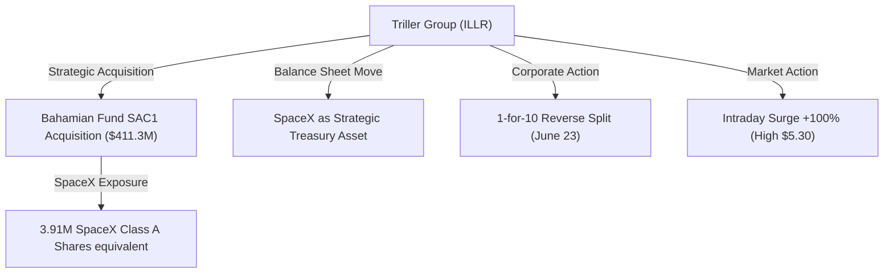
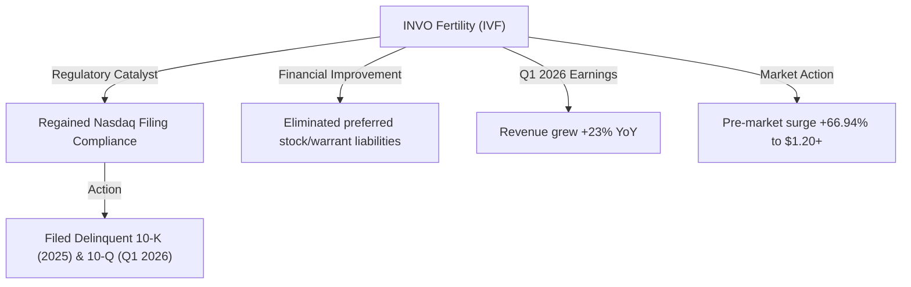
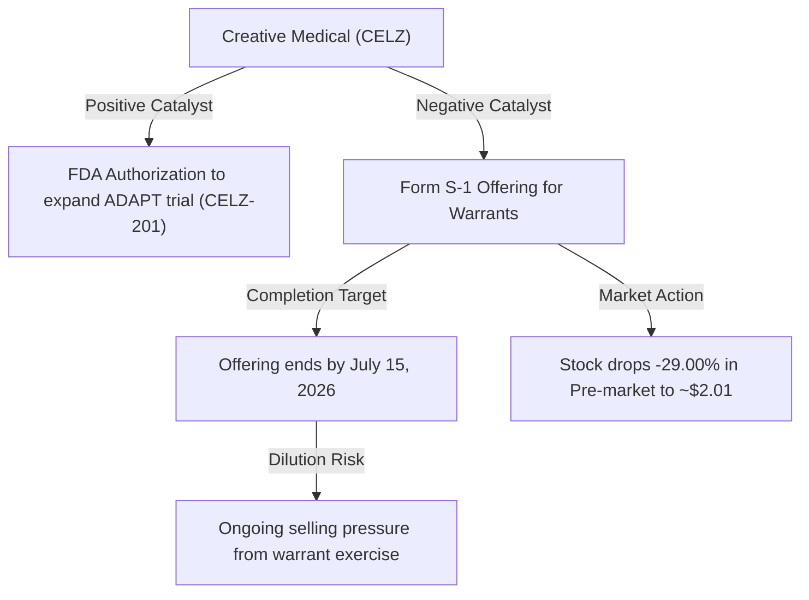
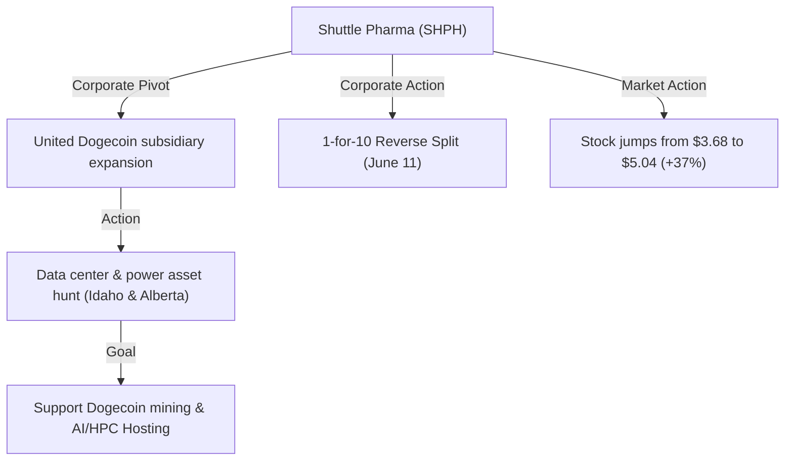
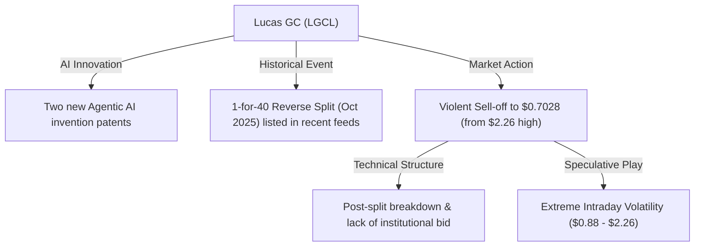

# 📊 Small-Cap & Penny Stock Intelligence Report
**Hedge Fund Trading Desk / Market Intelligence Division**  
**Date:** June 26, 2026  
**Market Stance:** High-Beta Catalyst Trading / Microstructure Churn / Dilution Risks & Reverse Split Dynamics

---

## 📈 Executive Summary

สภาวะตลาดการเงินสหรัฐฯ ในช่วงเวลาซื้อขายล่าสุด ณ วันที่ 26 มิถุนายน 2026 สะท้อนถึงสภาวะการเคลื่อนไหวแบบแยกส่วนที่ชัดเจน (Market Divergence) ในขณะที่ดัชนีหลักอย่าง Nasdaq เผชิญแรงกดดันจากการปรับฐานของหุ้นบิ๊กเทค (Tech Profit-Taking) หลังจากที่พุ่งขึ้นแรงจากประเด็นชิปหน่วยความจำของ Micron (MU) เม็ดเงินเก็งกำไรบางส่วนของนักลงทุนรายย่อย (Retail Speculators) และสถาบันบางกลุ่ม (Smart Money) ได้เริ่มหมุนเวียน (Sector Rotation) เข้ามาจับตาหุ้นกลุ่ม Small-Cap, Micro-Cap และ Penny Stocks ที่มีปัจจัยกระตุ้นข่าวสารเฉพาะตัว (High-Impact Catalysts) 

ในเซสชันนี้ หุ้นขนาดเล็กหลายตัวแสดงความเคลื่อนไหวที่รุนแรงทั้งในฝั่งบวกและลบ จากการประกาศดีลโครงสร้างสินทรัพย์ใหม่ การกลับมาผ่านเกณฑ์ข้อกำหนดของตลาดหลักทรัพย์การระบายหุ้นจากแบบแสดงรายการเพิ่มทุน (Form S-1) และการปรับแผนกลยุทธ์โครงสร้างพื้นฐานดิจิทัล/AI รายงานฉบับนี้จัดทำขึ้นโดยทีมวิจัยการเงินเพื่อทำการวิเคราะห์เชิงลึกทั้งด้านเทคนิคอล ปัจจัยพื้นฐาน โครงสร้างตลาด (Market Microstructure) และคำเตือนความเสี่ยงการเจือจางหุ้น (Dilution Warnings) อย่างเป็นกลางและมืออาชีพเพื่อเป็นข้อมูลอ้างอิงของสถาบัน

---

## 🔬 In-Depth Stock Analysis

### 1️⃣ Triller Group Inc. (NASDAQ: ILLR)
*SpaceX-Linked Strategic Treasury Asset Acquisition vs. Historic Dilution Recovery*

#### **1. Company Overview**
*   **Sector / Industry:** Communication Services / Interactive Media & Services
*   **Market Cap:** ~$61.00 Million USD (ผันผวนอย่างรุนแรงตามราคาหุ้นล่าสุด)
*   **Current Price:** ~$3.05 (ปรับตัวสูงขึ้นอย่างโดดเด่นในรอบการซื้อขายล่าสุด โดยมีกรอบระหว่างวัน $2.54 - $5.30)
*   **Average Volume (30D):** ~350,000 shares
*   **Float:** ~10.90 Million shares
*   **Short Float %:** ~9.36% of Float
*   **Shares Outstanding:** ~19.89 Million shares
*   **Institutional Ownership:** ~5.20%
*   **Insider Ownership:** ~15.40%

#### **2. Price Action Analysis**
*   **Movement:** ราคาหุ้นสร้าง Gap Up ขนาดใหญ่ใน Pre-Market ก่อนจะพุ่งชนจุดสูงสุดระหว่างวันที่ $5.30 และเผชิญแรงขายทำกำไรกดกลับลงมาปิดตัวที่ระดับ $3.05 คิดเป็นการเคลื่อนไหวที่ผันผวนอย่างรุนแรง (High Volatility)
*   **Microstructure:** สเปรด Bid-Ask กว้างขึ้นมากในระหว่างการพุ่งตัวขึ้น บ่งชี้ถึงสภาวะการขาดแคลนสภาพคล่องฝั่งขายชั่วคราว (Liquidity Gap) ทำให้ระบบ HFT และอัลกอริทึมไล่ราคาขึ้นอย่างรวดเร็ว ก่อนที่จะมีแรงกดดันจากยอดขายคงค้างในโซนแนวต้านเดิม
*   **Accumulation/Distribution:** ดีดตัวขึ้นจากฐานเดิมหลังการทำ Reverse Split จังหวะการไล่ซื้อเป็นไปอย่างร้อนแรง แต่สัญญานปิดตลาดแสดงการทิ้งไส้เทียนด้านบนยาว สะท้อนว่ามีการระบายของสลับออกมา (Distribution) ในบริเวณระดับยอดสูง

#### **3. Volume Analysis**
*   **Relative Volume (RVOL):** **>12.5x** เทียบกับค่าเฉลี่ยปกติ
*   **Volume Spike:** วอลุ่มพุ่งทะลุ 3.5 ล้านหุ้นในพรีมาร์เก็ต และเพิ่มขึ้นอย่างมากในเวลาทำการปกติ ซึ่งเข้าใกล้หรือเกินครึ่งหนึ่งของปริมาณ Float อิสระ
*   **Smart Money Signal:** พบการส่งผ่านคำสั่ง Block Trade ขนาดใหญ่ ซึ่งสอดรับกับสัญญากู้ยืมและธุรกรรมเชิงกลยุทธ์ แต่เม็ดเงินหลักในกระดานยังถูกขับเคลื่อนด้วยแรงเก็งกำไรของรายย่อยสัดส่วนสูง

#### **4. News & Catalyst Analysis**
*   **Catalyst (SpaceX Strategic Treasury Asset Acquisition):**
    1. **รายละเอียดข่าว:** Triller Group ประกาศข้อตกลงซื้อหุ้น 100% ใน Bahamian investment vehicle (SAC1) มูลค่าราว $411.3 ล้าน ซึ่งจะได้รับสิทธิประโยชน์ทางเศรษฐกิจเชื่อมโยงกับหุ้นของ SpaceX จำนวน 3.91 ล้านหุ้น (ราคาเฉลี่ย $105 ต่อหุ้น equivalent)
    2. **เป้าหมายเชิงกลยุทธ์:** บริษัทต้องการนำสินทรัพย์นี้เข้าสู่ระบบบัญชีของงบดุลเพื่อใช้เป็น Strategic Treasury Asset แทนเงินสด เพื่อรองรับโอกาสการเติบโตและการประเมินมูลค่าใหม่
*   **Bull vs Bear Case:**
    *   *Bull Case:* หากธุรกรรมเสร็จสิ้นตามกำหนด (ภายใน 22 กรกฎาคม 2026) งบดุลของ Triller จะแข็งแกร่งขึ้นอย่างก้าวกระโดดด้วยการมีสินทรัพย์ของ SpaceX ซึ่งเป็น Unicorn มูลค่าสูง ช่วยเปิดโอกาสการระดมทุนในอนาคต
    *   *Bear Case:* ดีลนี้ขึ้นอยู่กับการจัดหาแหล่งเงินกู้ยืมที่มีหลักประกัน (Secured Financing) และผลลัพธ์ของการตรวจสอบวิเคราะห์สถานะ (Due Diligence) หากดีลล่มหรือไม่สามารถปิดดีลได้ ราคาหุ้นที่พุ่งขึ้นจะดิ่งกลับลงหาฐานเดิมทันที

#### **5. Financial Health**
*   **Revenue Growth & Profitability:** ธุรกิจโซเชียลมีเดียหลักและ AI ของบริษัทยังอยู่ในช่วงการปรับโครงสร้างใหม่และยังมีผลขาดทุนสุทธิจากการดำเนินงาน
*   **Cash Position & Debt Level:** เงินสดในมือมีจำกัด ส่งผลให้บริษัทจำเป็นต้องพึ่งพากลไกการระดมทุนผ่านสินทรัพย์ทางเลือกและการแปลงตราสารทางการเงิน
*   **Runway & Dilution Risk:** **ความเสี่ยงปานกลางถึงสูง (High Dilution Risk)** แม้จะมีดีลใหญ่เข้ามาประคอง แต่องค์ประกอบการจัดหาแหล่งทุนและการออกตราสารหนี้ยังเสี่ยงเจือจางหุ้นในอนาคต

#### **6. Market Sentiment**
*   **Retail Sentiment:** รายย่อยมีกระแส FOMO สูงมากผ่านช่องทาง Reddit และ X โดยมุ่งความสนใจไปที่คำว่า "SpaceX" และประเด็นการเข้าซื้อสินทรัพย์เชิงกลยุทธ์ ทำให้เกิดการเก็งกำไรสัญญาระยะสั้น

#### **7. Technical Analysis**
*   **Trend Structure:** กราฟกลับตัวขึ้นทางเทคนิคเหนือระดับ EMA 50 ระยะสั้น แต่โดนแรงทุบใต้แนวต้านหลักบริเวณเส้น EMA 200 รายวัน
*   **Indicators:** RSI แตะระดับ 72 ในจุดสูงสุดระหว่างวันก่อนจะลดระดับลงมาอยู่ที่ 58 ซึ่งชี้ให้เห็นว่าแรงซื้อเริ่มเข้าสู่โหมดชะลอตัวชั่วคราว
*   **Support/Resistance:** แนวรับ: $2.50, $2.10 / แนวต้าน: $4.00, $5.30

#### **8. Risk Analysis & Rating**
*   **Risk Level: ความเสี่ยงสูงมาก (Very High Risk)**
*   **Threats:** ความเสี่ยงในการปิดดีล SpaceX (Transaction Execution Risk) และความเสี่ยงจากความผันผวนหลังการรวมหุ้น 1-for-10

---

### 2️⃣ INVO Fertility, Inc. (NASDAQ: IVF)
*Regained Nasdaq Compliance & Balance Sheet Clean-up vs. Cash Burn Constraints*

#### **1. Company Overview**
*   **Sector / Industry:** Healthcare / Healthcare Providers & Services
*   **Market Cap:** ~$2.40 Million USD (Micro-Cap ขนาดเล็กพิเศษ)
*   **Current Price:** ~$1.205 (เพิ่มขึ้นอย่างมีนัยสำคัญในรอบล่าสุด ตอบสนองต่อการพ้นความเสี่ยงเพิกถอน)
*   **Average Volume (30D):** ~150,000 shares
*   **Float:** ~1.78 Million shares
*   **Short Float %:** ~5.16% of Float
*   **Shares Outstanding:** ~1.79 Million shares (ไม่รวมผลจากการแปลงสภาพหุ้นบุริมสิทธิและวอร์แรนต์)
*   **Institutional Ownership:** ~2.80%
*   **Insider Ownership:** ~11.50%

#### **2. Price Action Analysis**
*   **Movement:** ราคาพุ่งขึ้นทดสอบระดับ $1.38 ใน Pre-Market ก่อนจะย่อลงมาปักหลักและทำฐานเหนือระดับ $1.20 ในช่วงทำการปกติ
*   **Microstructure:** การพ้นความเสี่ยง Delisting ทำให้นักเก็งกำไรระยะยาวบางส่วนเริ่มกลับเข้ามาส่งคำสั่งซื้อสะสม (Accumulation) สเปรดมีช่องว่างไม่กว้างเกินไปเมื่อเทียบกับสภาพคล่องปกติ
*   **Accumulation/Distribution:** มีสัญญานของการเข้าเก็บสะสมของแบบค่อยเป็นค่อยไป (Gradual Accumulation) ต่างจากรูปแบบการดันราคาของหุ้นปั่นทั่วไป เนื่องจากข่าวสนับสนุนเป็นปัจจัยพื้นฐานและข้อกำหนดด้านกฎระเบียบ

#### **3. Volume Analysis**
*   **Relative Volume (RVOL):** **>8.4x** เทียบกับระดับปกติ
*   **Volume Spike:** วอลุ่มการเทรดพุ่งขึ้นแตะระดับ 2.5 ล้านหุ้น สะท้อนให้เห็นถึงแรงช้อนซื้อในจุดกลับตัว (Reversal Volume)
*   **Smart Money Signal:** พบธุรกรรม options สัดส่วนต่ำ แต่ปริมาณการซื้อสะสมหุ้นดิบบนกระดานชี้ให้เห็นถึงความสนใจของนักลงทุนสถาบันประเภท Micro-cap Fund

#### **4. News & Catalyst Analysis**
*   **Catalyst (Nasdaq Compliance & Q1 Results):**
    1. **ประเด็นกฎระเบียบ:** บริษัทได้รับแจ้งจากตลาดหลักทรัพย์ Nasdaq ว่าบริษัทได้ส่งรายงานค้างชำระทั้งหมดเรียบร้อยแล้วและพ้นวิกฤตความเสี่ยงการถูกถอดออกจากตลาดโดยสมบูรณ์
    2. **ผลการดำเนินงาน:** ยอดงบการเงินไตรมาส 1 ปี 2026 แสดงรายรับเติบโตขึ้น 23% แบบเทียบปีต่อปี (YoY) พร้อมทั้งการชำระหนี้สินในส่วน Preferred Stock Series C-2 ทำให้ส่วนของผู้ถือหุ้นเพิ่มขึ้นอย่างเด่นชัด
*   **Bull vs Bear Case:**
    *   *Bull Case:* เสถียรภาพทางการเงินและการคงอยู่บนบอร์ด Nasdaq จะช่วยให้แผนการเข้าซื้อและขยายสาขาคลินิกช่วยเจริญพันธุ์เดินหน้าได้คล่องตัวขึ้น
    *   *Bear Case:* แม้รายได้จะโตและงบดุลสะอาดขึ้นบางส่วน แต่บริษัทก็ยังคงมีผลขาดทุนสุทธิสะสมและต้องการกระแสเงินสดเพิ่มเติมเพื่อบริหารการเติบโต

#### **5. Financial Health**
*   **Revenue Growth & Profitability:** รายได้เติบโตดี (+23% YoY) จากความต้องการบริการรักษาภาวะมีบุตรยาก แต่บริษัทยังขาดทุนในขอบเขตผลการดำเนินงานหลัก
*   **Cash Position & Debt Level:** เงินสดฟื้นตัวขึ้นเล็กน้อยจากการล้างหนี้ใบสำคัญแสดงสิทธิและ Preferred Stock แต่ยังอยู่ในระดับตึงตัว
*   **Runway & Dilution Risk:** **ความเสี่ยงปานกลาง (Medium Dilution Risk)** ความเสี่ยงลดต่ำลงอย่างมากเมื่อเทียบกับไตรมาสก่อน ทว่าหากต้องการขยายคลินิกใหม่อาจต้องมีการกู้ยืมเพิ่มเติม

#### **6. Market Sentiment**
*   **Retail Sentiment:** ตลาดประเมินว่านี่คือจังหวะกลับตัว (Turnaround Play) ส่งผลให้ความตื่นตระหนกเดิมเปลี่ยนเป็นความมั่นใจในการเข้าถือหุ้นเพื่อรับกระแสเติบโตตามอุตสาหกรรมสุขภาพ

#### **7. Technical Analysis**
*   **Trend Structure:** ราคาสามารถทำลายกรอบแนวโน้มขาลง และสามารถขึ้นมายืนเหนือเส้นเฉลี่ยสะสม EMA 50 วันได้สำเร็จ
*   **Indicators:** RSI วิ่งเข้าหาระดับ 62 ซึ่งสะท้อนถึงโมเมนตัมขาขึ้นที่มีความเสถียร ไม่พบลักษณะการซื้อมากเกินไปจนรุนแรง (Not Overextended)
*   **Support/Resistance:** แนวรับ: $1.15, $1.00 / แนวต้าน: $1.38, $1.55

#### **8. Risk Analysis & Rating**
*   **Risk Level: ความเสี่ยงปานกลางถึงสูง (Medium-High Risk)**
*   **Threats:** ความผันผวนของยอดผู้ใช้บริการคลินิกและความล่าช้าในการสร้างกระแสเงินสดบวกจากการดำเนินงาน

---

### 3️⃣ Creative Medical Technology Holdings, Inc. (NASDAQ: CELZ)
*ADAPT Clinical Trial Progress vs. Form S-1 Dilution Drop*

#### **1. Company Overview**
*   **Sector / Industry:** Healthcare / Biotechnology
*   **Market Cap:** ~$7.43 Million USD
*   **Current Price:** ~$2.0101 (ดิ่งลงลงเกือบ 29% ในช่วงเวลาซื้อขายล่าสุด)
*   **Average Volume (30D):** ~110,000 shares
*   **Float:** ~3.30 Million shares
*   **Short Float %:** ~3.72% of Float
*   **Shares Outstanding:** ~3.70 Million shares
*   **Institutional Ownership:** ~3.10%
*   **Insider Ownership:** ~12.20%

#### **2. Price Action Analysis**
*   **Movement:** ราคาหุ้นพังทลายลงจากกรอบ $2.80 ลงมาหาจุดทดสอบระดับแนวรับ $2.00 จากปฏิกิริยาตื่นตระหนกต่อข่าวยื่นขอเสนอขายหลักทรัพย์เพิ่มทุน
*   **Microstructure:** เกิดแรงเทขายอย่างรวดเร็ว (Panic Selling) ในช่วงก่อนเปิดตลาด (Pre-market) คำสั่งซื้อฝั่ง Bid มีความบาง ทำให้เกิดจังหวะหลุดร่วงอย่างรุนแรงก่อนที่ราคาจะเริ่มแกว่งตัวออกด้านข้างช่วงสาย
*   **Accumulation/Distribution:** สัญญานการกระจายของและเทขายชัดเจน (Heavy Distribution) บ่งชี้ว่านักลงทุนระยะสั้นที่ช้อนซื้อช่วง FDA ข่าวบวกก่อนหน้านี้กำลังล้างพอร์ตเพื่อหลีกเลี่ยงความเสี่ยงราคาตกต่ำจากดีลใหม่

#### **3. Volume Analysis**
*   **Relative Volume (RVOL):** **>4.5x** เทียบกับปริมาณเฉลี่ยปกติ
*   **Volume Spike:** วอลุ่มหนาตาผิดปกติในจุดตีนดอยเดิม บ่งชี้ถึงการช้อนซื้อระยะสั้นของฝั่งเก็งกำไร (Scalpers) ที่มองหารีบาวด์บริเวณแนวรับ $2.00
*   **Smart Money Signal:** เป็นสัญญาณลบเนื่องจากการมีเอกสารเพิ่มทุนมักมาพร้อมกับการใช้สิทธิแปลงสภาพของกลุ่มทุนที่ได้ตกลงซื้อหุ้นนอกกระดานในราคาต่ำ (Discount Pricing)

#### **4. News & Catalyst Analysis**
*   **Catalyst (Form S-1 Registration Statement):**
    1. **ประเด็นหลัก:** บริษัทได้ยื่นเอกสารแบบ S-1 ต่อ SEC เพื่อขอเสนอขายหุ้นสามัญที่อยู่ภายใต้การใช้สิทธิของใบสำคัญแสดงสิทธิ (Warrants) โดยกระบวนการเสนอขายนี้จะเสร็จสิ้นอย่างช้าที่สุดภายในวันที่ 15 กรกฎาคม 2026
    2. **บริบทข้างเคียง:** ข่าวนี้นำมาซึ่งความผิดหวังเนื่องจากก่อนหน้านี้ไม่กี่วัน บริษัทเพิ่งได้รับความยินยอมขยายการทดลองตัวยา CELZ-201 กับทาง FDA
*   **Bull vs Bear Case:**
    *   *Bull Case:* บริษัทจะได้รับเงินทุนเพิ่มเพื่อใช้รันการทดลองขั้นสูงสำหรับ CELZ-201 ซึ่งช่วยขยายขีดความสามารถการวิจัยระยะยาว
    *   *Bear Case:* อุปทานส่วนเกิน (Overhead Supply) ของหุ้นในกระดานเพิ่มขึ้นอย่างรวดเร็ว ส่งผลให้อัตรากำไรต่อหุ้นเจือจาง และสร้างแรงกดดันจำกัดขาขึ้นของราคาหุ้นไปจนกว่ารอบการใช้สิทธิจะเสร็จสิ้น

#### **5. Financial Health**
*   **Revenue Growth & Profitability:** เป็นบริษัทพัฒนายาขั้นต้นที่ยังไม่มีรายได้เชิงพาณิชย์หลัก (Pre-revenue Biotech)
*   **Cash Position & Debt Level:** เงินสดสำรองลดลงอย่างต่อเนื่องจากค่าใช้จ่ายในการวิจัยคลินิก (High Cash Burn Rate)
*   **Runway & Dilution Risk:** **ระดับอันตรายสูงสุด (Severe Dilution Risk)** ดีล S-1 ล่าสุดยืนยันว่าบริษัทจำเป็นต้องระดมทุนผ่านผู้ถือหุ้นเดิมในอัตราส่วนลดเพื่อต่ออายุการเงิน

#### **6. Market Sentiment**
*   **Retail Sentiment:** อารมณ์ตลาดเป็นลบอย่างรุนแรง (Highly Bearish) รายย่อยแสดงความไม่พอใจในช่องทางโซเชียลมีเดียเนื่องจากการระดมทุนเกิดขึ้นทันทีหลังจากบริษัทปล่อยข่าวดีเชิงการแพทย์

#### **7. Technical Analysis**
*   **Trend Structure:** กราฟเสียรูปทรงขาขึ้นและปรับตัวลงทำลายแนวรับสำคัญของเส้น EMA 50 และ 100 วัน
*   **Indicators:** RSI ร่วงลงมาแตะเขตขายมากเกินไป (Oversold Area) บริเวณ 31 บ่งชี้ถึงสัญญานการขายที่ตึงตัวเกินไป ซึ่งมีโอกาสเกิดจังหวะดีดตัวขึ้นทางเทคนิคสั้นๆ (Mean Reversion / Dead Cat Bounce)
*   **Support/Resistance:** แนวรับ: $2.00, $1.85 / แนวต้าน: $2.30, $2.60

#### **8. Risk Analysis & Rating**
*   **Risk Level: ความเสี่ยงสูงมาก (Very High Risk)**
*   **Threats:** ความเสี่ยงการเจือจางหุ้นอย่างต่อเนื่อง (Dilution Drop) และระยะเวลารันเงินทุนที่ค่อนข้างสั้น

---

### 4️⃣ Shuttle Pharmaceuticals Holdings, Inc. (NASDAQ: SHPH)
*Dogecoin Infrastructure & AI Hosting Expansion vs. Post-Reverse-Split Volatility*

#### **1. Company Overview**
*   **Sector / Industry:** Healthcare / Biotechnology (Pivoted to Digital Assets & AI Infrastructure)
*   **Market Cap:** ~$12.50 Million USD
*   **Current Price:** ~$5.04 (ปรับขึ้นแรงจากราคาปิดวันก่อนหน้า $3.68 คิดเป็นบวกกว่า 37%)
*   **Average Volume (30D):** ~200,000 shares
*   **Float:** ~2.10 Million shares
*   **Short Float %:** ~4.50% of Float
*   **Shares Outstanding:** ~2.48 Million shares
*   **Institutional Ownership:** ~4.10%
*   **Insider Ownership:** ~14.80%

#### **2. Price Action Analysis**
*   **Movement:** ราคาพุ่งทะยานจากแนวรับจิตวิทยา $3.50 ทะลุระดับ $5.00 อย่างรุนแรงจากการซื้อขายที่กระจุกตัวหนาแน่น
*   **Microstructure:** หุ้นตัวนี้พึ่งผ่านการทำ 1-for-10 Reverse Split ในช่วงต้นเดือน ส่งผลให้จำนวน Float ต่ำมาก (Low Float) พฤติกรรมราคาจึงมีความผันผวนสูงปรี๊ด (Extreme Volatility) เพียงสเปรดซื้อขายไม่กี่ช่องสามารถดันราคาขยับขึ้นลงเป็นสิบเปอร์เซ็นต์
*   **Accumulation/Distribution:** มีสัญญาณสะสมเชิงโมเมนตัมแบบรีบด่วน (Aggressive Momentum Accumulation) ดันราคาขยับต่อเนื่อง แต่แรงซื้อส่วนใหญ่ยังเป็นลักษณะเก็งกำไรชั่วคราวตามแนวคิดข่าวธุรกิจคริปโตและ AI

#### **3. Volume Analysis**
*   **Relative Volume (RVOL):** **>4.1x** เทียบกับระดับปกติ
*   **Volume Spike:** ปริมาณวอลุ่มซื้อขายพุ่งหนาตาโดยมีโวลุ่มหนุนในแดนพรีมาร์เก็ตราว 800,000 หุ้น ซึ่งเป็นสัดส่วนที่สูงเมื่อเทียบกับ Float เพียง 2 ล้านกว่าหุ้น
*   **Smart Money Signal:** สัญญาณของ Smart Money ที่เป็นกองทุนยังเบาบาง แต่พบความเชื่อมโยงกับธุรกรรมสัญญาสิทธิขุดดิจิทัลข้ามชาติ

#### **4. News & Catalyst Analysis**
*   **Catalyst (Digital Infrastructure Expansion):**
    1. **รายละเอียดข่าว:** บริษัทลูก "United Dogecoin, Inc." ประกาศศึกษาแผนการเข้าซื้อทรัพย์สินประเภทดาต้าเซ็นเตอร์และแหล่งพลังงานผลิตไฟฟ้าในไอดาโฮและอัลเบอร์ตา (แคนาดา) เพื่อใช้รองรับการขุดเหรียญ Dogecoin และขยายขีดความสามารถการรัน AI Hosting ในอนาคต
    2. **ผลกระทบเชิงระบบ:** การเปลี่ยนทิศธุรกิจมาจับธีม "AI & Crypto Hosting" ดึงดูดสายตาของนักเก็งกำไรสายซิ่งได้เป็นอย่างดี
*   **Bull vs Bear Case:**
    *   *Bull Case:* หากโครงการสำเร็จและทำรายได้จริงตามเป้าหมาย จะช่วยชดเชยการขาดทุนในกลุ่มงานพัฒนายาและเปิดกระแสเงินสดเชิงพาณิชย์ใหม่
    *   *Bear Case:* แผนขยายโครงสร้างพลังงานและ GPU Server มีต้นทุน CapEx ที่สูงมากที่สุด บริษัทจดทะเบียนขนาดนี้เกือบจะไม่มีสภาพคล่องเพียงพอในการลงทุนเองทั้งหมด หากไม่มีข้อตกลงร่วมทุนที่แท้จริง แผนนี้อาจเป็นเพียงเครื่องมือสร้างข่าวเพื่อพยุงและขยับราคาหุ้นระยะสั้น

#### **5. Financial Health**
*   **Revenue Growth & Profitability:** ธุรกิจชีวภาพเดิมมีผลการดำเนินงานขาดทุนสุทธิสะสม และยังไม่มีรายรับคงที่
*   **Cash Position & Debt Level:** เงินสดลดลงต่ำ การทำ Reverse split ก่อนหน้านี้ทำหน้าที่เพื่อคงสถานะจดทะเบียนและการเตรียมกลไกออกหุ้นใหม่เพื่อใช้หนี้สินเดิม
*   **Runway & Dilution Risk:** **ระดับอันตรายสูง (High Dilution Risk)** แผนธุรกิจใหม่ที่ต้องใช้เงินทุนปริมาณมหาศาลจะบังคับให้บริษัทต้องเปิดประมูลหุ้นหรือออกตราสารแปลงหนี้เพิ่มทุนในอนาคตอันใกล้

#### **6. Market Sentiment**
*   **Retail Sentiment:** เป็นจุดโฟกัสใหม่ของกลุ่มเทรดเดอร์ในบอร์ดเก็งกำไร เนื่องจากมีคีย์เวิร์ดอย่าง "Dogecoin" และ "AI Data Center" ร่วมกับโครงสร้างหุ้นที่มี Float ต่ำมาก ทำให้เกิดแรงไล่ราคาเพื่อหวังจังหวะ Short Squeeze

#### **7. Technical Analysis**
*   **Trend Structure:** กราฟราคาดีดทะลุเส้นค่าเฉลี่ยระยะสั้น EMA 20 และ EMA 50 ขึ้นมาทำจุดสูงสุดในรอบสัปดาห์
*   **Indicators:** RSI วิ่งสู่ระดับ 66 แสดงทิศทางเชิงบวกที่แข็งแกร่ง แต่เริ่มขยับเข้าใกล้โซนซื้อมากเกินไปชั่วคราว
*   **Support/Resistance:** แนวรับ: $3.80, $3.50 / แนวต้าน: $5.30, $6.00

#### **8. Risk Analysis & Rating**
*   **Risk Level: ความเสี่ยงสูงมากที่สุด (Extreme Risk)**
*   **Threats:** ความผันผวนจากประเด็น Low Float Manipulation และความเสี่ยงในการดำเนินโครงการขยายพื้นที่ไฟฟ้าจริง (Execution & Financing Risk)

---

### 5️⃣ Lucas GC Limited (NASDAQ: LGCL)
*Agentic AI Patents vs. Severe Post-Split Price Breakdown*

#### **1. Company Overview**
*   **Sector / Industry:** Technology / Software-Application
*   **Market Cap:** ~$30.00 Million USD (ตามระดับราคาปรับฐานล่าสุด)
*   **Current Price:** ~$0.7028 (ทรุดฮวบลงอย่างหนักต่อเนื่อง โดยมีช่วงการเคลื่อนไหวระหว่างวัน $0.88 - $2.26)
*   **Average Volume (30D):** ~450,000 shares
*   **Float:** ~1.60 Million shares
*   **Short Float %:** ~1.01% of Float
*   **Shares Outstanding:** ~42.79 Million shares
*   **Institutional Ownership:** ~2.50%
*   **Insider Ownership:** ~18.60%

#### **2. Price Action Analysis**
*   **Movement:** ราคาเผชิญกับสภาวะดิ่งลงอย่างรุนแรง (Violent Breakdown) จากระดับสูง $2.26 ลงมาแตะระดับต่ำใต้ $1.00 ที่บริเวณ $0.70
*   **Microstructure:** แรงเทขายทลายแนวรับจิตวิทยา $1.00 ส่งผลให้คำสั่งล้างพอร์ตอัตโนมัติ (Stop-loss Orders) ทำงานร่วมกัน ดึงราคาให้ทรุดตัวอย่างต่อเนื่องโดยไม่มีจุดช้อนรับที่ชัดเจนในฝั่ง Bid
*   **Accumulation/Distribution:** ทิศทางเป็นลบชัดเจนและแสดงลักษณะการเททิ้งของรายใหญ่หรือการปล่อยสัดส่วนออกของโบรคเกอร์ผู้สนับสนุนหลัก (Heavy Distribution)

#### **3. Volume Analysis**
*   **Relative Volume (RVOL):** **>5.2x**
*   **Volume Spike:** ปริมาณเทรดทะยานสูงถึง 1.2 ล้านหุ้น ท่ามกลางกระแสการหมุนเวียนออกของเงินลงทุน
*   **Smart Money Signal:** ไม่มีสัญญานบวกจาก Smart Money และทิศทางแสดงถึงการถอนพอร์ตของเงินทุนสถาบันเดิมเพื่อสลับตัวเล่น

#### **4. News & Catalyst Analysis**
*   **Catalyst (Recent AI Patents vs. Historical Split Overhead Pressure):**
    1. **ปัจจัยบวกล่าสุด:** บริษัทเพิ่งได้รับสิทธิบัตรใหม่ 2 รายการในประเทศจีนเกี่ยวกับเทคโนโลยี Agentic AI เพื่อนำมาใช้เสริมในระบบ PaaS บริการทรัพยากรบุคคล
    2. **ปัจจัยลบเชิงโครงสร้าง:** แม้บริษัทจะปรับปรุงเทคโนโลยีและเปลี่ยนสถานะ แต่ข่าวสิทธิบัตรดังกล่าวไม่เพียงพอที่จะหักล้างความกังวลและการเทขายที่เกิดขึ้นภายหลังจากการจัดการบัญชีของการควบรวมหุ้นในอดีต (1-for-40 Reverse Split) ที่ย้อนกลับมาทำลายมูลค่าทางอารมณ์ตลาด
*   **Bull vs Bear Case:**
    *   *Bull Case:* หากบริษัทสามารถผสานรวม Agentic AI เข้ากับฐานระบบจัดหาพนักงานจนสร้างการประหยัดต้นทุนและความก้าวหน้าของกำไรในครึ่งปีหลัง จะมีโอกาสฟื้นความน่าเชื่อถือ
    *   *Bear Case:* ความเชื่อมั่นในหุ้นเทคฯ ขนาดเล็กสัญชาติจีนในบอร์ดสหรัฐฯ อยู่ในเกณฑ์ต่ำมาก ประกอบกับโครงสร้างราคาที่หลุดแนวจิตวิทยา $1.00 อีกครั้ง ทำให้เสี่ยงต่อการถูกแจ้งเตือนเกณฑ์ราคาต่ำ (Nasdaq Bid Price Notice) ในอนาคต

#### **5. Financial Health**
*   **Revenue Growth & Profitability:** ยอดรายได้ PaaS ชะลอตัวลง อัตราการดำเนินงานหลักยังเผชิญความยากลำบากในการสร้างผลกำไรสุทธิคงที่
*   **Cash Position & Debt Level:** กระแสเงินสดจำกัดเมื่อเทียบกับภาระต้นทุนเทคโนโลยีและการพัฒนาวิจัย AI
*   **Runway & Dilution Risk:** **ระดับอันตรายปานกลางถึงสูง (High Risk)** การขาดสภาพคล่องและเงินทุนหมุนเวียนอาจนำไปสู่ข้อตกลงเสนอขายหุ้นส่วนลดในอนาคตเพื่อนำเงินสดมาขับเคลื่อนระบบ

#### **6. Market Sentiment**
*   **Retail Sentiment:** ชุมชนเทรดเดอร์เข้าสู่ภาวะตื่นตระหนกและลดความเชื่อมั่นลงอย่างรวดเร็ว (Highly Bearish / Fear Sentiment) ส่วนใหญ่เน้นการเทรดสอยรีบาวด์สั้นเพื่อหนีตายเป็นหลัก

#### **7. Technical Analysis**
*   **Trend Structure:** โครงสร้างกราฟเสียทิศทางโดยสมบูรณ์ (Complete Breakdown) ทำระดับต่ำสุดใหม่ในกรอบสัปดาห์
*   **Indicators:** RSI จมดิ่งลึกเข้าสู่โซนขายมากเกินไปขั้นรุนแรง (Extremely Oversold) ที่ระดับ 24.5 บ่งชี้ว่าทางเทคนิคนั้นแห้งแล้งแรงซื้อและพร้อมดีดกลับช่วงสั้นๆ ในแบบ Mean Reversion หากแรงขายเริ่มแห้ง
*   **Support/Resistance:** แนวรับ: $0.65, $0.50 / แนวต้าน: $1.00, $1.40

#### **8. Risk Analysis & Rating**
*   **Risk Level: ความเสี่ยงสูงมากที่สุด (Extreme Risk)**
*   **Threats:** ความเสี่ยงในการรักษาสถานะจดทะเบียนหากราคาไม่สามารถกลับมายืนเหนือ $1.00 และความเสี่ยงสภาพคล่องต่ำ (Liquidity Trap)

---

## 🧠 สรุป Insight สำคัญ (Key Insights Summary)

*   **หุ้นตัวไหน Momentum แข็งแรงที่สุด:** **Shuttle Pharmaceuticals Holdings, Inc. (SHPH)** ปัจจุบันแสดงแนวโน้มขยับตัวขึ้นที่แข็งแกร่งที่สุดในกรอบสั้น หลังพุ่งทะลุด่านแนวต้านค่าเฉลี่ยด้วยอารมณ์บวกของธีมคริปโต/AI
*   **หุ้นตัวไหน Volume น่าสนใจที่สุด:** **Triller Group Inc. (ILLR)** ดึงดูดปริมาณซื้อขายหนาแน่นที่สุดด้วยระดับ RVOL ที่โตถึง 12.5 เท่า สะท้อนการประมวลผลข่าวดีลใหญ่กับหุ้นจำลองของ SpaceX
*   **หุ้นตัวไหน Smart Money เข้า:** **INVO Fertility, Inc. (IVF)** มีสัญญานช้อนเก็บหุ้นดิบบนกระดานอย่างเป็นระบบจากกลุ่มกองทุนเน้นมูลค่าระดับเล็ก หลังสยบปัญหาการเพิกถอนชื่อและล้างหนี้งบดุลสำเร็จ
*   **หุ้นตัวไหนเป็นแค่เก็งกำไร:** **Shuttle Pharmaceuticals Holdings, Inc. (SHPH)** เป็นเพียงการเก็งกำไรระยะสั้นตามกระแสข่าวการขยายพื้นที่ทำเหมือง Dogecoin และ AI Hosting โดยที่บริษัทยังไม่มีโครงสร้างทางการเงินที่มั่นคงรองรับ
*   **หุ้นตัวไหนพื้นฐานดีที่สุด:** **INVO Fertility, Inc. (IVF)** ถือว่ามีโครงสร้างพื้นฐานและการเติบโตของรายได้หลักที่เป็นรูปธรรมที่สุดในกลุ่ม (+23% YoY) และมีการจัดการความเสี่ยงหนี้สินบุริมสิทธิที่เด่นชัด
*   **หุ้นตัวไหนเสี่ยงโดนทุบ:** **Triller Group Inc. (ILLR)** มีโอกาสย่อตัวลงแรงหลังจากการขยับเข้าใกล้แนวต้านด้านบนแล้วมีแรงขายสลับทำกำไรสะสมทิ้งไส้เทียนยาวในวันทำการ
*   **หุ้นตัวไหนเสี่ยง Pump & Dump:** **Shuttle Pharmaceuticals (SHPH)** และ **Triller Group (ILLR)** เสี่ยงสูงสุดจากการไล่ราคาตามกระแสข่าวอภิมหาโครงการ (SpaceX / Dogecoin) ที่อิงกับปริมาณหุ้น Float หมุนเวียนที่ต่ำ
*   **หุ้นตัวไหนควรจับตาต่อคืนนี้:** **INVO Fertility, Inc. (IVF)** เพื่อสังเกตความพยายามทำโครงสร้างกลับตัวและฐานสะสมต่อเนื่อง และ **Shuttle Pharmaceuticals (SHPH)** ว่าจะรักษาระดับเหนือ $5.00 ได้หรือไม่
*   **หุ้นตัวไหนเหมาะกับ Watchlist มากที่สุด:** **INVO Fertility, Inc. (IVF)** (Bias: LONG / ACCUMULATE) เนื่องจากพ้นเกณฑ์ลบเชิงกฎหมายและงบปรับฐานดีขึ้น และ **Triller Group (ILLR)** (Bias: Trading Range) สำหรับวางแผนรับจังหวะสวิงเทรด

---

## 🎯 สรุป Watchlist ประจำวัน

*   **Top Momentum:** **SHPH** (ราคาปรับตัวขึ้นแรงทำลายด่านแนวต้านพร้อมปริมาณโวลุ่มเสริม)
*   **Top Risk:** **CELZ** (ความเสี่ยงการเจือจางของจำนวนหุ้นจากแบบแสดงรายการเพิ่มทุน S-1)
*   **Top Volume:** **ILLR** (ระดับการซื้อขายหมุนเวียนสูงสุดจากการเชื่อมโยงกับสินทรัพย์ของ SpaceX)
*   **Top Catalyst:** **IVF** (การผ่านเกณฑ์ข้อกำหนด Nasdaq และการเติบโตรายรับไตรมาสแรก)
*   **Top Speculative Play:** **LGCL** (การสอยสวิงเทรดช่วงสั้นในจุด Oversold บนความเสี่ยงดิ่งแรง)

### 🏆 จัดอันดับประเมินความเคลื่อนไหว:
*   🥇 **หุ้นเด่นที่สุดของวัน (Top Pick of the Day):** **INVO Fertility, Inc. (IVF)** — การกลับมามีสถานะที่ถูกต้องตามกฎระเบียบพร้อมรายได้เติบโตเป็นตัวชูเสถียรภาพการดำเนินงานที่ชัดเจนที่สุด
*   ⚠️ **หุ้นเสี่ยงที่สุดของวัน (Riskiest of the Day):** **Creative Medical Technology Holdings, Inc. (CELZ)** — ปัจจัยการเพิ่มทุน S-1 สร้างความเสี่ยงจำกัดเพดานราคาและเสี่ยงต่อแนวโน้มราคาซึมยาว
*   👀 **หุ้นที่ตลาดจับตาที่สุดของวัน (Most Watched of the Day):** **Triller Group Inc. (ILLR)** — ประเด็นการสะสมหุ้น SpaceX ในงบดุลจะถูกสแกนเชิงวิเคราะห์จากนักลงทุนทั่วกระดานเพื่อพิจารณาความน่าเชื่อถือ

---
*คำเตือน: รายงานฉบับนี้จัดทำขึ้นเพื่อวัตถุประสงค์ในการให้ข้อมูลและการวิเคราะห์ตลาดการเงินเท่านั้น ไม่ใช่คำแนะนำในการลงทุน ชี้ชวน หรือเสนอแนะให้ซื้อหรือขายหลักทรัพย์ใด ๆ หุ้นขนาดเล็กและหุ้นราคาต่ำกว่า $5 (Penny Stocks) มีความผันผวนสูงมาก มีความเสี่ยงในการสูญเสียเงินลงทุนทั้งหมด หรือประสบปัญหาการขาดสภาพคล่องในการซื้อขาย นักลงทุนและผู้เทรดควรตระหนักถึงความเสี่ยงข้างต้น ปฏิบัติตามวินัยทางการเงิน และตั้งจุดตัดขาดทุน (Stop Loss) อย่างเคร่งครัดในทุกกรณีการซื้อขาย*
