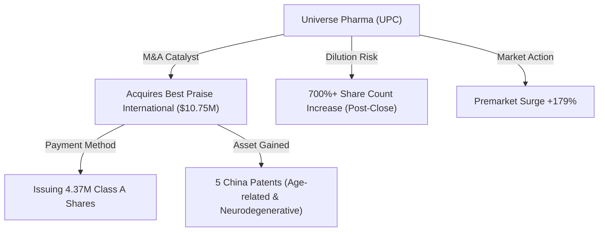
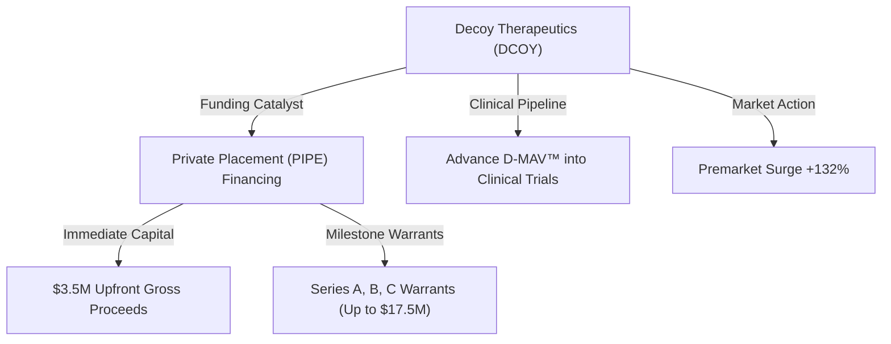
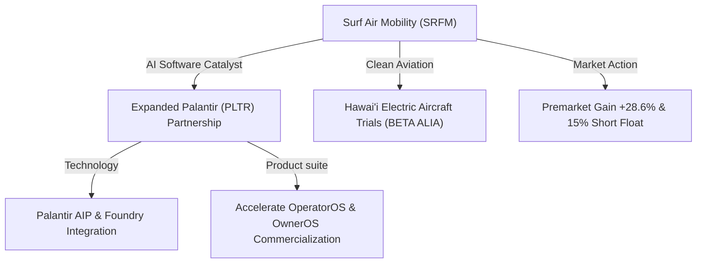
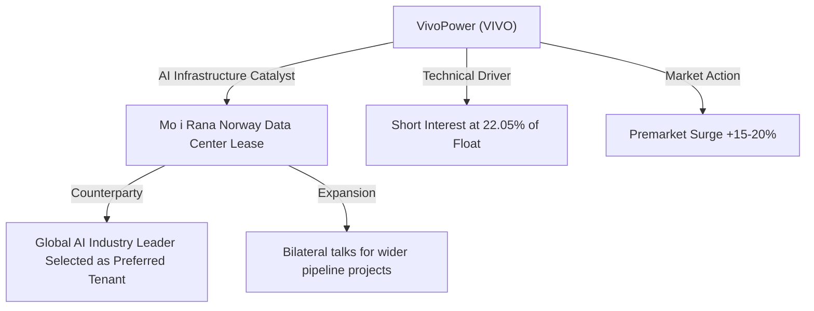
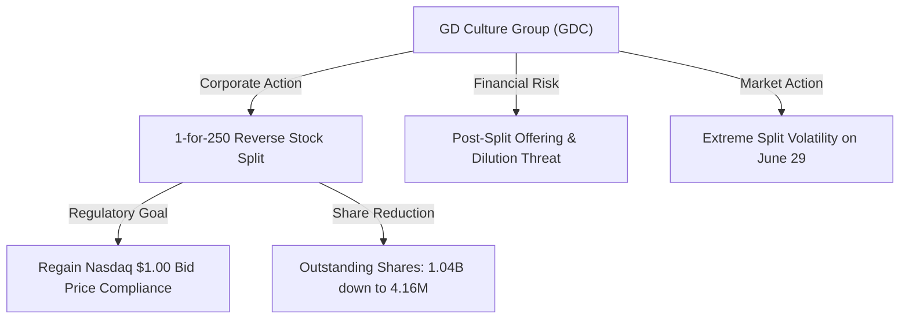

# 📊 Small-Cap & Penny Stock Intelligence Report
**Hedge Fund Trading Desk / Market Intelligence Division**  
**Date:** June 29, 2026  
**Market Stance:** Post-Russell Reconstitution Rebalancing / High-Volatility M&A and AI Narrative Pivots / Extreme Dilution Warning

---

## 📈 Executive Summary

สภาวะตลาดการเงินสหรัฐฯ ในเซสชันการซื้อขายวันที่ 29 มิถุนายน 2026 (เปิดทำการสัปดาห์ใหม่ที่เป็นสัปดาห์คาบเกี่ยววันหยุด Fourth of July และจะปิดทำการในวันศุกร์ที่ 3 กรกฎาคม) เต็มไปด้วยความเคลื่อนไหวที่น่าสนใจ โดยดัชนีหลักฟื้นตัวขึ้นในแดนบวกนำโดยดัชนี Nasdaq-100 Futures (+1.1%) และ S&P 500 Futures (+0.7%) จากความคลี่คลายของสถานการณ์ความขัดแย้งทางภูมิรัฐศาสตร์ U.S.-Iran และความหวังในการเจรจาสันติภาพ ขณะเดียวกันตลาดอยู่ภายใต้กระแสการทำงานวันแรกของการปรับสมดุลดัชนี Russell U.S. Indexes Reconstitution ซึ่งเสร็จสิ้นขั้นตอนไปเมื่อปิดตลาดวันศุกร์ที่ผ่านมา ส่งผลให้มีเม็ดเงินหมุนเวียนและสภาพคล่องระดับสูงไหลผ่านหุ้นขนาดเล็ก

ในฝั่งของกลุ่มหุ้น Small-Cap และ Penny Stocks (ราคาต่ำกว่า $5) ได้รับความสนใจจากแรงเก็งกำไรของกลุ่มทุน Smart Money และรายย่อย (Retail Sentiment) อย่างเด่นชัด ผ่านปัจจัยขับเคลื่อนกระตุ้นราคาเฉพาะตัว (High-Impact Catalysts) ทั้งในกลุ่มเทคโนโลยีที่เชื่อมโยงกับ AI Infrastructure, ดีลการควบรวมและซื้อสินทรัพย์สิทธิบัตร (M&A), ดีลการระดมทุนเฉพาะเจาะจง (PIPE Financing) ในกลุ่มชีวภาพขั้นสูง และการปรับโครงสร้างทุนทางกฎระเบียบ (Reverse Split) รายงานฉบับนี้จัดทำการวิเคราะห์เจาะลึก 5 หุ้นเด่นที่มีความเคลื่อนไหวและวอลุ่มผิดปกติ ณ วันทำการ เพื่อให้นักลงทุนสถาบันใช้ประกอบการประเมินโอกาสและความเสี่ยงอย่างเป็นกลางและเป็นมืออาชีพ

---

## 🔬 In-Depth Stock Analysis

### 1️⃣ Universe Pharmaceuticals INC. (NASDAQ: UPC)
*Strategic M&A Acquisition of Best Praise International & Patent Expansion vs. Severe Dilution Risk*

#### **1. Company Overview**
*   **Sector / Industry:** Healthcare / Drug Manufacturers - Specialty & Generic
*   **Market Cap:** ~$1.72M (Pre-surge) / ขยับขึ้นสู่ระดับ ~$4.80M (Post-premarket surge)
*   **Current Price:** ~$1.95 (ราคาปิดวันก่อนหน้า $0.70 ปรับตัวขึ้นแตะระดับสูงสุดใน Pre-Market ที่ $2.15 ก่อนลดระดับมาแกว่งตัว)
*   **Average Volume (30D):** ~120,000 shares
*   **Float:** ~480,000 shares (Micro-cap ขนาดเล็กพิเศษที่มีสัดส่วน Float ต่ำมาก)
*   **Short Float %:** ~2.10% of Float
*   **Shares Outstanding:** ~563,000 shares (Pre-acquisition)
*   **Institutional Ownership:** ~2.50%
*   **Insider Ownership:** ~18.20%

#### **2. Price Action Analysis**
*   **Movement:** ราคาพุ่งทะยานสร้าง Gap Up ขนาดใหญ่ใน Pre-market กว่า +179% สัมผัสจุดสูงสุดบริเวณ $2.15 หลังจากบริษัทรายงานข่าวดีลควบรวมสินทรัพย์สิทธิบัตร
*   **Microstructure:** เนื่องจากมีจำนวน Float หุ้นที่หมุนเวียนอยู่ในตลาดต่ำมาก (Extreme Low Float) เพียงสเปรด Bid-Ask กว้างขึ้นเล็กน้อยและมีคำสั่งซื้อหนุน ทำให้ราคาพุ่งข้ามระดับแนวต้านได้ทันที เกิด Liquidity Gap ฝั่งขายในช่วงพรีมาร์เก็ต
*   **Accumulation/Distribution:** มีสัญญาณสะสมเชิงบวกเชิงโมเมนตัมแบบเร่งรีบ (Aggressive Accumulation) ในช่วงก่อนตลาดเปิด อย่างไรก็ตาม สเปรดเริ่มแคบลงเมื่อเข้าใกล้แนวต้าน $2.00 สะท้อนแรงขายทำกำไรของรายย่อยบางส่วนสลับออกมา (Distribution)

#### **3. Volume Analysis**
*   **Relative Volume (RVOL):** **>50x** เทียบกับค่าเฉลี่ย 30 วันปกติ
*   **Volume Spike:** ปริมาณซื้อขาย Pre-market ทะยานเกิน 6 ล้านหุ้น ซึ่งคิดเป็นกว่า 12 เท่าของปริมาณ Float ปกติ บ่งชี้ว่าหุ้นมีการเปลี่ยนมืออย่างรวดเร็ว (High Churn Rate)
*   **Smart Money Signal:** วอลุ่มส่วนใหญ่ขับเคลื่อนโดยกลุ่ม Retail Traders ที่เล่นตามกระแสข่าวบวก แต่มี Block Trade ขนาดเล็กในพรีมาร์เก็ตจากกลุ่มสปอนเซอร์เดิมที่อาจเข้ามาเพื่อเตรียมการจัดการสัดส่วนก่อนการออกหุ้นใหม่

#### **4. News & Catalyst Analysis**
*   **Catalyst (Share Purchase Agreement & IP Acquisition):**
    1. **รายละเอียดข่าว:** UPC ประกาศลงนามในข้อตกลงซื้อหุ้น 100% ใน Best Praise International Limited มูลค่าดีลราว $10.75 ล้าน เพื่อเข้าถือครองสิทธิบัตรยา 5 ฉบับในจีน ครอบคลุมการรักษาโรคผู้สูงอายุ โรคระบบประสาทเสื่อมถอย โรคสมองเสื่อม โรคหลอดเลือดหัวใจ และยาต้านแบคทีเรีย
    2. **วิธีการชำระเงิน:** จ่ายด้วยการออกหุ้น Class A สามัญจำนวน 4,376,552 หุ้น ดีลคาดว่าจะปิดภายใน Q3 2026
*   **Bull vs Bear Case:**
    *   *Bull Case:* บริษัทยกระดับจากยาแผนโบราณของจีนเข้าสู่กลุ่มสิทธิบัตรการแพทย์สมัยใหม่ ช่วยเพิ่มมูลค่าทางสินทรัพย์ไม่มีตัวตนในงบดุลและขยายสายผลิตภัณฑ์ระยะยาว
    *   *Bear Case:* ดีลนี้สร้างความเจือจางของจำนวนหุ้นมหาศาล (Dilution) จำนวนหุ้น outstanding จะเพิ่มขึ้นจาก ~5.6 แสนหุ้น เป็นเกือบ 5 ล้านหุ้น (เพิ่มขึ้นกว่า 700%) ซึ่งสะท้อนว่ามูลค่าต่อหุ้นในระยะยาวอาจลดลงหลังการปิดดีล

#### **5. Financial Health**
*   **Revenue Growth & Profitability:** ธุรกิจหลักดั้งเดิมมีแนวโน้มรายได้ชะลอตัวลงและยังมีผลการดำเนินงานขาดทุนสุทธิสะสม
*   **Cash Position & Runway:** เงินสดในมืองวดล่าสุดค่อนข้างตึงตัว ส่งผลให้บริษัทจำเป็นต้องใช้ตราสารทุน (หุ้นสามัญใหม่) แทนเงินสดในการทำดีล M&A
*   **Runway & Dilution Risk:** **ระดับอันตรายสูงสุด (Severe Dilution Risk)** แม้จะไม่มีการใช้เงินสดในดีลนี้ แต่จำนวนหุ้นเพิ่มทุนที่มากถึง 4.37M หุ้น จะสร้างแรงกดดันอุปทานส่วนเกิน (Overhead Supply) ทันทีที่หุ้นใหม่ได้รับสิทธิในการซื้อขาย

#### **6. Market Sentiment**
*   **Retail Sentiment:** อารมณ์ตลาดของรายย่อยใน Discord และ X (Twitter) แสดงความตื่นเต้นกับตัวเลขดีล $10.75M และคำว่า "สิทธิบัตรโรคสมองเสื่อม" เกิดสภาวะ FOMO ในช่วงสั้นๆ
*   **Speculative Play:** นักลงทุนส่วนใหญ่เข้าเก็งกำไรระยะสั้นแบบเดย์เทรด (Scalping) มากกว่าจะเชื่อมั่นในผลกำไรระยะยาวของสิทธิบัตร ซึ่งยังต้องการระยะเวลาอีกหลายปีในการวิจัยเชิงพาณิชย์

#### **7. Technical Analysis**
*   **Trend Structure:** กราฟราคาทะลุผ่านกรอบแนวต้านเส้น EMA 50 และ 200 วันขึ้นมาอย่างรวดเร็ว ทำลายรูปทรงขาลงเดิม
*   **Indicators:** RSI ในไทม์เฟรม 15 นาที แตะโซน Overbought ที่ 82 ก่อนปรับลดระดับลงมาทดสอบแถว 65 ท่ามกลางแนวรับทางเทคนิคระยะสั้นบริเวณ $1.70 - $1.80
*   **Support/Resistance:** แนวรับ: $1.70, $1.50 / แนวต้าน: $2.15, $2.50

#### **8. Risk Analysis & Rating**
*   **Risk Level: ความเสี่ยงสูงมาก (Very High Risk)**
*   **Threats:** ความเสี่ยงการเจือจางหุ้นรุนแรง (Dilution), โครงสร้าง Micro-cap สัญชาติจีนที่มีความผันผวนด้านการไล่ราคาและสภาพคล่องต่ำในเวลาปกติ

---

### 2️⃣ Decoy Therapeutics Inc. (NASDAQ: DCOY)
*PIPE Financing & Clinical Advancement Funding vs. Warrant Dilution Pressure*

#### **1. Company Overview**
*   **Sector / Industry:** Healthcare / Biotechnology
*   **Market Cap:** ~$3.15M (Pre-surge) / ขยับขึ้นสู่ระดับ ~$7.30M (Post-premarket surge)
*   **Current Price:** ~$1.62 (ราคาปิดวันก่อนหน้า $0.70 ปรับขึ้นไปทำจุดสูงสุดใน Pre-Market ที่ $1.85)
*   **Average Volume (30D):** ~150,000 shares
*   **Float:** ~490,000 shares (ผ่านการทำ Reverse split 1-for-12 ในเดือนมีนาคม 2026 ทำให้หุ้นหมุนเวียนเหลือน้อยมาก)
*   **Short Float %:** ~3.80% of Float
*   **Shares Outstanding:** ~532,000 shares (ก่อนธุรกรรม PIPE)
*   **Institutional Ownership:** ~3.10%
*   **Insider Ownership:** ~9.80%

#### **2. Price Action Analysis**
*   **Movement:** หุ้นสร้างจุดรีบาวด์แบบ Oversold Reversal พุ่งสูงถึง +132% ใน Pre-Market ทะลุระดับแนวต้านจิตวิทยาที่ $1.50
*   **Microstructure:** โครงสร้าง Low Float หลังการควบรวมแบรนด์ใหม่ (เปลี่ยนชื่อจาก Salarius Pharmaceuticals ในมกราคม 2026) ทำให้ฝั่ง Bid ค่อนข้างบาง ส่งผลให้เมื่อมีโวลุ่มช้อนซื้อเก็งกำไร ราคาจึงวิ่งขึ้นได้อย่างรวดเร็วและรุนแรง
*   **Accumulation/Distribution:** มีกระแสการเข้าเก็งกำไรสะสมเพื่อรับจังหวะ Mean Reversion (Accumulation) ทว่าสัญญานเตือนคือบริเวณแนวต้าน $1.80+ เริ่มมีคำสั่งเสนอขายหนาแน่น บ่งชี้ว่าผู้ถือสิทธิตามสัญญา PIPE เริ่มหาทางบริหารความเสี่ยง

#### **3. Volume Analysis**
*   **Relative Volume (RVOL):** **>44x** เทียบกับวอลุ่มเฉลี่ยปกติ
*   **Volume Spike:** ปริมาณการซื้อขาย Pre-market หนุนแน่นถึง 6.6 ล้านหุ้น สะท้อนให้เห็นว่าผู้เล่นรายย่อยและอัลกอริทึมพรีมาร์เก็ตเข้าร่วมสกัดทำราคาหุ้นตัวนี้กันอย่างคึกคัก
*   **Smart Money Signal:** ข่าวการเซ็นสัญญา PIPE ชี้ให้เห็นถึงความสนใจของสถาบันเฉพาะทาง (Biotech Fund) ที่ยินยอมอัดฉีดเงิน $3.5 ล้านเพื่อช้อนเก็บสินทรัพย์ในราคาเสนอขายสัญญาสิทธิพิเศษ

#### **4. News & Catalyst Analysis**
*   **Catalyst (Private Investment in Public Equity - PIPE):**
    1. **รายละเอียดดีล:** DCOY ประกาศเข้าทำสัญญาซื้อขายหลักทรัพย์กับกลุ่มทุนระดมทุนแบบ PIPE มูลค่ารับล่วงหน้าขั้นแรก $3.5 ล้านดอลลาร์สหรัฐ คาดดีลเสร็จสิ้น 29 มิถุนายน 2026
    2. **วอร์แรนต์ตามเป้าหมาย (Milestone Warrants):** มีสิทธิ์ได้รับเงินทุนเพิ่มสูงสุดอีก $17.5 ล้าน ผ่านใบสำคัญแสดงสิทธิ Series A, B และ C หากบริษัทผ่านคุณสมบัติความคืบหน้าการศึกษาทางคลินิก (Regulatory & Clinical Milestones) ใน EEA และสหราชอาณาจักร
    3. **เป้าหมาย:** นำเงินทุนไปขับเคลื่อนยาตัวหลัก Designable Multi-Antiviral (D-MAV™) เข้าสู่กระบวนการทดลองทางคลินิก
*   **Bull vs Bear Case:**
    *   *Bull Case:* ปลดล็อกความเสี่ยงล้มละลายหรือขาดสภาพคล่องระยะสั้นด้วยกระแสเงินสด $3.5M ทันที และมีหลักประกันเงินทุนวิจัยวิถีใหม่
    *   *Bear Case:* สัญญา PIPE มักจะมาพร้อมกับการออกใบสำคัญแสดงสิทธิสิทธิ์แปลงสภาพราคาต่ำกว่ากระดาน (Discounted Warrants) ซึ่งนักลงทุนกลุ่มนี้มักชอร์ตป้องกันความเสี่ยง (Hedging) หรือระบายหุ้นออกมาทันทีที่ใช้สิทธิ์ได้ กดดันราคาหุ้นในระยะกลาง

#### **5. Financial Health**
*   **Revenue Growth & Profitability:** เป็นบริษัท Pre-clinical stage biotech ที่ยังไม่มีรายได้จากการค้าพาณิชย์
*   **Cash Position & Runway:** เงินสดก่อนหน้านี้ใกล้หมด (High Cash Burn Rate) การได้กระแสเงินสดล่วงหน้า $3.5M ช่วยขยายระยะเวลารันกระแสเงินสด (Cash Runway) ไปได้อีกประมาณ 6-9 เดือน
*   **Runway & Dilution Risk:** **ระดับอันตรายสูงสุด (Severe Dilution Risk)** โครงสร้าง Milestone Warrants $17.5M แม้จะช่วยการเงินบริษัท แต่เป็นการเปิดช่องทางเจือจางมูลค่าหุ้นแก่ผู้ถือหุ้นในกระดานอย่างกว้างขวางในระยะยาว

#### **6. Market Sentiment**
*   **Retail Sentiment:** เป็นจุดโฟกัสการเก็งกำไรในเชิง "Biotech Reversal" และ "Low Float Squeeze" นักลงทุนรายย่อยแห่ไล่ซื้อตามสัญญาณทางเทคนิคที่ผ่านจุดต่ำสุดเดิม
*   **FOMO Level:** ระดับ FOMO ปานกลางถึงสูงเนื่องจากราคาหุ้นสะท้อนการปรับลดลงยาวนานตั้งแต่ก่อนหน้าการจัดตั้งชื่อใหม่ ทำให้ความรู้สึกว่า "ราคาถูกและผ่านจุดเลวร้ายที่สุดแล้ว" ทำงานในจิตวิทยาผู้เล่น

#### **7. Technical Analysis**
*   **Trend Structure:** กราฟเบรกแนวโน้มขาลงระยะสั้นด้วยแท่งเทียนสีเขียวยาว ทะลุระดับ EMA 20 และ EMA 50 วันในกรอบเวลารายวัน
*   **Indicators:** RSI วิ่งทะลุ 70 เข้าเขต Overbought ทางเทคนิคสั้นๆ เกิดความเสี่ยงปรับฐานย้อนทางหากเปิดห่างจากระดับ VWAP วันนี้มากเกินไป
*   **Support/Resistance:** แนวรับ: $1.35, $1.10 / แนวต้าน: $1.85, $2.20

#### **8. Risk Analysis & Rating**
*   **Risk Level: ความเสี่ยงสูงมากที่สุด (Extreme Risk)**
*   **Threats:** ความเสี่ยงการเจือจางผ่าน Warrant Exercises, การทดลองทางคลินิกขั้นต้นล้มเหลว (Clinical Failure Risk) และความผันผวนสูงจากการคุมสเปรดตลาดของกลุ่มผู้เล่นเฉพาะกลุ่ม

---

### 3️⃣ Surf Air Mobility Inc. (NYSE: SRFM)
*Expanded Palantir Technologies AIP & Foundry Integration vs. Cash Burn & High Debt Constraints*

#### **1. Company Overview**
*   **Sector / Industry:** Industrials / Airlines
*   **Market Cap:** ~$91.00 Million USD
*   **Current Price:** ~$1.18 (ขยับพุ่งขึ้นจากราคาปิดงวดก่อน $0.92 คิดเป็นบวกประมาณ +28.6% ในพรีมาร์เก็ต)
*   **Average Volume (30D):** ~800,000 shares
*   **Float:** ~83.60 Million shares
*   **Short Float %:** ~15.12% (ระดับ Short Interest สูง โดดเด่นในฐานะเป้าหมายการทำ Short Squeeze)
*   **Shares Outstanding:** ~95.00 Million shares
*   **Institutional Ownership:** ~22.00% (ถือว่าสูงกว่า Penny Stocks ทั่วไปเล็กน้อย)
*   **Insider Ownership:** ~35.00% (กลุ่มผู้ก่อตั้งและฝ่ายบริหารมีส่วนได้ส่วนเสียเหนียวแน่น)

#### **2. Price Action Analysis**
*   **Movement:** ราคาพุ่งขึ้นทดสอบเป้าหมายแนวจิตวิทยาสำคัญระดับ $1.20 ในช่วงเวลา Pre-Market หลังออกข่าวสารเชื่อมโยงกับผู้นำ AI ยักษ์ใหญ่อย่าง Palantir
*   **Microstructure:** สภาพคล่องและสเปรดการซื้อขายอยู่ในเกณฑ์ดี (Good Liquidity Quality) เมื่อเทียบกับหุ้น Micro-cap ตัวอื่น เนื่องจากอยู่บนบอร์ดหลัก NYSE มีสภาพคล่องฝั่ง Bid คอยรองรับการหมุนเวียนสม่ำเสมอ
*   **Accumulation/Distribution:** พบสัญญาณการซื้อเก็บอย่างเป็นระบบโดยกลุ่ม Smart Money (Systematic Accumulation) เพื่อเก็งกำไรในประเด็นการเปลี่ยนผ่านโมเดลธุรกิจเข้าสู่สปอตซอฟต์แวร์

#### **3. Volume Analysis**
*   **Relative Volume (RVOL):** **>3.0x** เทียบกับปกติ
*   **Volume Spike:** โวลุ่มพรีมาร์เก็ตหนาตากว่า 2 ล้านหุ้น เป็นการกระตุ้นและส่งสัญญาณให้ระบบสแกนวอลุ่มสถาบันตรวจจับเจอความเคลื่อนไหวที่ผิดปกติ
*   **Smart Money Signal:** พบการทำ Block Trade และการขยับสัดส่วนใน Option (Call options) หนาแน่น สอดรับกับความเชื่อมั่นต่อพันธมิตรที่เป็นผู้นำซอฟต์แวร์ระดับโลก

#### **4. News & Catalyst Analysis**
*   **Catalyst (Palantir Technologies Partnership Expansion):**
    1. **รายละเอียดข่าว:** SRFM และ Palantir (PLTR) ประกาศลงนามขยายกรอบความร่วมมือเพื่อร่วมพัฒนาและขยายตลาดกลุ่มผลิตภัณฑ์ซอฟต์แวร์การบินเอกชน "SurfOS" ประกอบด้วย OperatorOS, OwnerOS และโซลูชันระบบองค์กรขนาดใหญ่ โดยรันบนสถาปัตยกรรม Palantir AIP (Artificial Intelligence Platform) และ Foundry
    2. **บริบทแวดล้อม:** ข่าวนี้สอดรับกับการทดลองบินเครื่องบินพลังงานไฟฟ้า ALIA CTOL ร่วมกับ BETA Technologies ในฮาวายเพื่อประหยัดต้นทุนพลังงาน
*   **Bull vs Bear Case:**
    *   *Bull Case:* การได้รับการหนุนหลังจาก Palantir ช่วยเพิ่มความเชื่อมั่นเชิงเทคโนโลยีและดึงดูดฐานลูกค้าผู้ให้บริการบินและโบรกเกอร์ (เช่น Wheels Up) สร้างสปอตการเติบโตผ่านรายได้สิทธิ์การใช้งาน (Software-as-a-Service) ที่มีมาร์จิ้นสูง
    *   *Bear Case:* แม้จะมีซอฟต์แวร์ที่ล้ำสมัย แต่ธุรกิจการบินเชิงกายภาพยังคงเผชิญปัญหาต้นทุนการดำเนินงานที่สูง การฟื้นตัวของผลการดำเนินงานจริงจากงบการบินพาณิชย์หลักยังคงต้องพึ่งพาสภาพเศรษฐกิจและกำลังการซื้อของกลุ่มผู้บริโภคระดับบน

#### **5. Financial Health**
*   **Revenue Growth & Profitability:** รายได้ Q1 2026 อยู่ที่ $25.6 ล้านดอลลาร์ ดีกว่าเป้าหมาย EBITDA แต่บริษัทยังไม่สามารถทำกำไรสุทธิที่เป็นบวกได้
*   **Cash Position & Debt Level:** มีหนี้สินคงค้างและต้นทุน CapEx จากฝูงบินที่ค่อนข้างตึงตัว อัตราการรันเงินสดต้องพึ่งพาการเพิ่มสัดส่วนกระแสเงินสดจากการจำหน่ายลิขสิทธิ์ซอฟต์แวร์
*   **Runway & Dilution Risk:** **ความเสี่ยงปานกลางถึงสูง (Medium-High Risk)** ดีลร่วมงานกับ Palantir ช่วยลดแรงกดดันระดมทุนฉุกเฉิน ทว่าหากหนี้สินยังอยู่ในระดับสูง อาจจำเป็นต้องจัดสรรแผนเพิ่มทุนระยะสั้นเสริมความแข็งแกร่ง

#### **6. Market Sentiment**
*   **Retail Sentiment:** อารมณ์บวกค่อนข้างเด่นชัด (Highly Bullish) รายย่อยเชื่อมโยงประเด็นนี้กับพันธมิตรยักษ์ใหญ่อย่าง Palantir (PLTR) ซึ่งเป็นกระแสหลักในกลุ่ม AI Narrative
*   **Short Squeeze Potential:** ด้วยอัตราส่วน Short Interest สูงถึง 15.12% การพุ่งทะลุ $1.20 อย่างรุนแรงอาจบังคับให้ฝั่ง Short Sellers ต้องปิดออเดอร์ตัดขาดทุน (Covering) เร่งแรงส่งราคาขาขึ้นให้ชันยิ่งขึ้น

#### **7. Technical Analysis**
*   **Trend Structure:** กราฟทำลายเส้นแนวโน้มขาลง และสามารถตัดทะลุแนวต้านเส้น EMA 50 และ 100 วัน เพื่อตั้งลำทำกรอบแนวโน้มขาขึ้น (Bullish Reversal Pattern)
*   **Indicators:** RSI ทะยานแตะ 64 ชี้สัญญานโมเมนตัมที่มีแรงส่งที่ดีและยังมีระยะวิ่งขึ้นได้อีกก่อนเข้าโซน Overbought
*   **Support/Resistance:** แนวรับ: $0.95, $0.87 / แนวต้าน: $1.25, $1.42

#### **8. Risk Analysis & Rating**
*   **Risk Level: ความเสี่ยงปานกลางถึงสูง (Medium-High Risk)**
*   **Threats:** ความล่าช้าในการเปิดตลาดซอฟต์แวร์พาณิชย์ และแรงกดดันจากภาระหนี้สินเดิมในโครงสร้างธุรกิจการบินทางกายภาพ

---

### 4️⃣ VivoPower International PLC (NASDAQ: VIVO)
*Norway Mo i Rana AI Data Center Tenant Selection & AI/Green Energy Narrative Pivot vs. Debt & Cash Execution Risks*

#### **1. Company Overview**
*   **Sector / Industry:** Technology / Software - Infrastructure (หรือกลุ่มจัดหาพลังงานหมุนเวียนและโครงสร้างพื้นฐาน)
*   **Market Cap:** ~$96.88 Million USD
*   **Current Price:** ~$2.60 (ปรับตัวขึ้นจากระดับ $2.20 ในวันศุกร์ โดยมีกรอบพรีมาร์เก็ตเคลื่อนไหว +15-20%)
*   **Average Volume (30D):** ~300,000 shares
*   **Float:** ~2.67 Million shares (โครงสร้าง Float หุ้นหมุนเวียนต่ำเด่นชัด)
*   **Short Float %:** ~22.05% of Float (ระดับ Short Interest สูงจัดเป็นอันดับหนึ่งของ Watchlist ประจำวัน)
*   **Shares Outstanding:** ~3.50 Million shares
*   **Institutional Ownership:** ~8.50%
*   **Insider Ownership:** ~20.10%

#### **2. Price Action Analysis**
*   **Movement:** ราคาเบรกกรอบบีบตัวทางเทคนิค ดีดตัวขึ้นแรงใน Pre-market รับข่าวการคัดเลือกผู้เช่าดาต้าเซ็นเตอร์หลักในนอร์เวย์
*   **Microstructure:** โครงสร้าง Float ที่มีเพียง 2.67 ล้านหุ้น บวกกับการที่หุ้นโดนล็อกชอร์ตไว้ในปริมาณสูง ทำให้เกิดความอ่อนไหวสูงเมื่อมีแรงซื้อสะสมเบียดเข้ามา สภาพคล่องมีช่องว่างเล็กน้อยในพรีมาร์เก็ต
*   **Accumulation/Distribution:** มีแนวโน้มของการเข้าเก็บแบบสะสมหุ้น (Accumulation) เพื่อเตรียมเข้าลุ้นจังหวะบีบชอร์ตครั้งใหญ่ (Short Squeeze)

#### **3. Volume Analysis**
*   **Relative Volume (RVOL):** **>4.0x** เทียบกับปริมาณเฉลี่ยปกติ
*   **Volume Spike:** มีแรงซื้อกระจุกตัวอย่างชัดเจนหลังปล่อยข่าวด้านพลังงานและ AI ทำให้มีปริมาณวอลุ่มซื้อขายพุ่งผ่านด่านเฉลี่ยอย่างต่อเนื่อง
*   **Smart Money Signal:** สัญญาณสถาบันแสดงการตอบรับในเชิงบวกจากธีมโครงสร้างพื้นฐาน AI (AI Data Center) ซึ่งเป็นตลาดที่ให้มูลค่าพรีเมียมในขณะนี้

#### **4. News & Catalyst Analysis**
*   **Catalyst ( Norway AI Data Center Tenant Selection):**
    1. **รายละเอียดข่าว:** VIVO ประกาศคัดเลือกกลุ่มผู้นำด้านอุตสาหกรรมปัญญาประดิษฐ์ระดับโลก (Global AI Industry Leader - ยังไม่มีการระบุชื่อโดยตรงเพื่อเงื่อนไขสัญญา) เป็นผู้เช่าหลักในระยะยาวสำหรับศูนย์จัดเก็บข้อมูล Mo i Rana AI Data Center ในนอร์เวย์ตอนเหนือ
    2. **การขยายตัวเชิงระบบ:** การทำข้อตกลงครั้งนี้มีขอบข่ายขยายไปถึงการเจรจาสัญญาโครงการอื่นๆ ในแผนกดาต้าเซ็นเตอร์ของ VivoPower ในภูมิภาคอื่นๆ ทั่วโลก
*   **Bull vs Bear Case:**
    *   *Bull Case:* การได้ผู้เช่าเทคโนโลยีขนาดใหญ่เข้ายึดพื้นที่ช่วยยืนยันความน่าเชื่อถือของโครงข่ายพลังงานและสเปกการระบายความร้อนของ VivoPower สร้างรายได้ค่าเช่าแบบประจำ (Recurring Revenue) ที่มั่นคง
    *   *Bear Case:* ดีลนี้ยังไม่ได้รับการลงนามเปิดเผยชื่ออย่างเป็นทางการ หากเกิดความล่าช้าในการเคลียร์ข้อตกลงทางกฎหมาย หรือชื่อคู่สัญญาออกมาเป็นผู้เล่นระดับเล็กกว่าที่ตลาดคาดหวัง ราคาหุ้นอาจเสียสมดุลกลับลงไปจุดเดิม

#### **5. Financial Health**
*   **Revenue Growth & Profitability:** ยอดรายได้เดิมผันผวนและยังมีงบการเงินดำเนินงานติดลบสุทธิ
*   **Cash Position & Debt Level:** ภาระหนี้สินยังอยู่ในระดับที่ต้องการบริหารอย่างระมัดระวัง แม้การเปลี่ยนชื่อและสัญญาล่าสุดในรอบปีนี้จะช่วยปลดล็อกความยืดหยุ่นทางการเงินได้บ้าง
*   **Runway & Dilution Risk:** **ความเสี่ยงปานกลาง (Medium Risk)** สัญญาการเช่าจะช่วยดึงกระแสเงินสดเข้ามาค้ำประกันความเสถียรทางการเงิน ส่งผลให้ความจำเป็นในการระดมทุนผ่านหุ้นลดลงหากมีการส่งมอบสินทรัพย์ทันกำหนด

#### **6. Market Sentiment**
*   **Retail Sentiment:** เป็นหนึ่งในหุ้นยอดนิยมของกลุ่ม Momentum Traders ใน Reddit เนื่องจากธีม "นอร์เวย์ดาต้าเซ็นเตอร์" และ "AI Space" ร่วมกับเปอร์เซ็นต์ชอร์ตที่บีบตัวได้ง่าย
*   **FOMO Level:** ปานกลาง ผู้เล่นยังคงระมัดระวังตัวเล็กน้อยจากการไม่ระบุชื่อคู่สัญญาโดยตรง แต่มีแรงไล่ช้อนพอร์ตเพื่อสู้ฝั่งชอร์ต

#### **7. Technical Analysis**
*   **Trend Structure:** กราฟเบรกกรอบแนวรับรูปสามเหลี่ยม (Symmetrical Triangle Breakout) ทะยานขึ้นเหนือเส้นเฉลี่ยสะสมระยะสั้น EMA 20 วัน
*   **Indicators:** RSI ขยับตัวสูงขึ้นสู่ระดับ 59 บ่งชี้ความแข็งแกร่งของแรงซื้อเชิงโมเมนตัมที่ค่อยๆ เพิ่มขึ้นอย่างมีเป้าหมาย
*   **Support/Resistance:** แนวรับ: $2.20, $2.00 / แนวต้าน: $2.90, $3.40

#### **8. Risk Analysis & Rating**
*   **Risk Level: ความเสี่ยงสูง (High Risk)**
*   **Threats:** ความไม่แน่นอนของการเปิดเผยสัญญาปลายทางอย่างเป็นทางการ (Contract Finalization Risk) และแรงผันผวนจากสภาพการลากราคาของกลุ่มบีบชอร์ต

---

### 5️⃣ GD Culture Group Limited (NASDAQ: GDC)
*1-for-250 Reverse Split to Regain Bid Price Compliance vs. High Post-Split Offering & Failure Risks*

#### **1. Company Overview**
*   **Sector / Industry:** Communication Services / Advertising Agencies (หรือบริการ Virtual Content Production)
*   **Market Cap:** ~$1.32 Million USD (Micro-Cap ขนาดเล็กพิเศษขั้นวิกฤต)
*   **Current Price:** ราคาเปิดตลาดคาดว่าจะถูกจัดสรรให้อยู่เหนือ $1.00 - $2.00 เพื่อรองรับผลการควบรวมทางเทคนิค หลังการควบรวมราคาจะพุ่งขึ้นทางบัญชี 250 เท่า จากเดิมที่ร่วงลงต่ำกว่า $0.01
*   **Average Volume (30D):** ~500,000 shares (Pre-split)
*   **Float:** ข้อมูลหลังการทำ Split คาดว่าจะมีจำนวน Float หมุนเวียนเหลือน้อยกว่า 1.5 ล้านหุ้น
*   **Short Float %:** ~14.85% of Float
*   **Shares Outstanding:** ลดฮวบลงจาก ~1.04 Billion shares เหลือเพียง ~4.16 Million shares
*   **Institutional Ownership:** ~1.20%
*   **Insider Ownership:** ~15.50%

#### **2. Price Action Analysis**
*   **Movement:** การปรับราคาหุ้นขึ้น 250 เท่าเป็นเพียงกระบวนการทางคณิตศาสตร์ในบัญชี (Reverse Split) แต่พฤติกรรมราคาวันแรกมักจะมีความผันผวนสูงมากและมักจะมีแรงกดดันขายออกเนื่องจากตลาดหวาดระแวงการทำลายมูลค่าหุ้น
*   **Microstructure:** การลดปริมาณหุ้นลง 250 เท่า ทำให้สภาพคล่อง (Liquidity Quality) ในตลาดต่ำลงอย่างมาก สเปรด Bid-Ask กว้างและแกว่งตัวกะทันหันได้รุนแรงเพียงแค่มีโวลุ่มขนาดเล็กเข้ากระทบ
*   **Accumulation/Distribution:** สัญญาณการกระจายของเทขายอย่างชัดเจน (Heavy Distribution) เนื่องจากผู้ถือหุ้นเดิมต้องการล้างสัดส่วนออกเพื่อหลีกเลี่ยงแนวโน้มประวัติศาสตร์ของหุ้นที่ผ่านการ Reverse Split มักจะดิ่งลงต่อหลังวันแรก

#### **3. Volume Analysis**
*   **Relative Volume (RVOL):** **>5.5x** (ปรับสมดุลตามจำนวนหุ้นใหม่)
*   **Volume Spike:** การซื้อขายผันผวนรุนแรงในช่วงเช้าจากการปรับคำสั่งเก่าในระบบ HFT และการสลัดการถือครองของนักเก็งกำไรที่ถูกลดจำนวนหุ้นในบัญชี
*   **Smart Money Signal:** ไม่มีสัญญานลงทุนจากสถาบัน มีเพียงธุรกรรมปรับสมดุลตามเกณฑ์ Nasdaq เท่านั้น

#### **4. News & Catalyst Analysis**
*   **Catalyst (1-for-250 Reverse Stock Split):**
    1. **รายละเอียดข้อกำหนด:** การทำ Reverse stock split ในสัดส่วน 1-for-250 มีผลอย่างเป็นทางการ ณ วันที่ 29 มิถุนายน 2026 เพื่อผลักดันให้ราคาหุ้นกลับขึ้นมาเกินเกณฑ์ขั้นต่ำ $1.00 ของ Nasdaq เพื่อป้องกันการถูกเพิกถอนชื่อออกจากกระดานหลัก
*   **Bull vs Bear Case:**
    *   *Bull Case:* บริษัทยังสามารถคงสถานะจดทะเบียนในตลาด Nasdaq ต่อไปได้ชั่วคราวเพื่อรอโอกาสปรับโครงสร้างธุรกิจหลัก
    *   *Bear Case:* การทำ Reverse Split ขั้นรุนแรงสะท้อนถึงการทำลายมูลค่าหุ้นในอดีตอย่างสาหัส และบ่อยครั้งบริษัทขนาดเล็กกลุ่มนี้มักจะดำเนินการเสนอขายหุ้นสามัญใหม่ (Offering) ต่อทันทีหลังรวบหุ้นเสร็จเพื่อระดมทุนด่วน ซึ่งจะทำให้ราคาหุ้นดิ่งเหวลงไปอีกครั้ง

#### **5. Financial Health**
*   **Revenue Growth & Profitability:** ยอดขายและรายได้จากเทคโนโลยีภาพเสมือนและบริการโฆษณาอยู่ในสภาวะชะลอตัวและขาดทุนหนัก
*   **Cash Position & Runway:** เงินสดในงบดุลอยู่ในเกณฑ์เสี่ยงขาดสภาพคล่องสะสม
*   **Runway & Dilution Risk:** **ระดับอันตรายสูงสุด (Severe Dilution Risk)** ความผันผวนสูงมากและมีความเสี่ยงสูงที่จะมีการใช้เครื่องมือออกตราสารเพิ่มทุนแบบ discount pricing หลังการปรับราคาบัญชี

#### **6. Market Sentiment**
*   **Retail Sentiment:** เป็นลบอย่างรุนแรง (Highly Bearish / Fear Sentiment) ชุมชนในเว็บบอร์ดแสดงความโกรธเคืองที่จำนวนหุ้นโดนทอนลงไปเหลือเพียงเสี้ยวเดียวของพอร์ตเดิม นักลงทุนมักหลีกเลี่ยงการช้อนหุ้นตัวนี้ในช่วงเปิดตลาดวันแรก

#### **7. Technical Analysis**
*   **Trend Structure:** กราฟราคาหลังปรับสมดุลจะชี้สัญญานจุดยอดทางเทคนิคหลอกตา แต่แนวโน้มเดิมเป็นขาลงแบบ Breakdown สมบูรณ์แบบ
*   **Indicators:** RSI รายวันสะท้อนภาพแห้งแล้งแรงซื้อจริง และมักเกิดการทรุดตัวลงทดสอบแนวรับจิตวิทยาแถว $1.00 อีกรอบในไม่กี่สัปดาห์ข้างหน้า
*   **Support/Resistance:** แนวรับ: $1.00, $0.80 / แนวต้าน: $2.50, $4.00

#### **8. Risk Analysis & Rating**
*   **Risk Level: ความเสี่ยงสูงมากที่สุด (Extreme Risk)**
*   **Threats:** ความเสี่ยงการถูกร่วงหล่นทดสอบด่าน $1.00 อีกรอบ, ความเสี่ยงโดนประกาศดีล Offering ในราคาลดพิเศษหลังการ Split (Post-split offering) และปัญหาการขาดสภาพคล่องในการส่งคำสั่งขายออก

---

## 🧠 Key Insights Summary (สรุปเชิงลึกทางการค้า)

*   **หุ้นตัวไหน Momentum แข็งแรงที่สุด:** **Decoy Therapeutics Inc. (DCOY)** และ **Universe Pharmaceuticals (UPC)** แสดงแรงส่งที่พุ่งสูงที่สุดในพรีมาร์เก็ตจากระดับปริมาณและเปอร์เซ็นต์การขยับขึ้น ทว่ามีความร้อนแรงเกินไปชั่วคราว
*   **หุ้นตัวไหน Volume น่าสนใจที่สุด:** **Universe Pharmaceuticals (UPC)** ด้วยวอลุ่มพุ่งทะลุ 6 ล้านหุ้น ในสภาวะหุ้น Float ต่ำมาก สะท้อนถึงการเปลี่ยนมือเก็งกำไรระยะสั้นที่เข้มข้นที่สุด
*   **หุ้นตัวไหน Smart Money เข้า:** **Surf Air Mobility Inc. (SRFM)** ได้รับความสนใจจากเม็ดเงินของกลุ่มทุนไอทีและซอฟต์แวร์ระดับกลางผ่านการขยายขอบเขตการทำงานร่วมกับ Palantir
*   **หุ้นตัวไหนเป็นแค่เก็งกำไร:** **GD Culture Group (GDC)** และ **Universe Pharmaceuticals (UPC)** ปัจจัยบวกของราคาเป็นเพียงการปรับแต่งตัวเลขบัญชีและการสร้างดีลด้วยตราสารทุนเจือจางเพื่อพยุงราคาหุ้นระยะสั้น
*   **หุ้นตัวไหนพื้นฐานดีที่สุด:** **Surf Air Mobility (SRFM)** มีรายได้เป็นตัวรองรับที่จับต้องได้จริงมากที่สุดในกลุ่ม ($25.6M ในไตรมาสแรก) และมีความร่วมมือทางเทคโนโลยีที่เป็นรูปธรรมกับบริษัทชั้นนำ
*   **หุ้นตัวไหนเสี่ยงโดนทุบ:** **Universe Pharmaceuticals (UPC)** เสี่ยงเผชิญแรงขายทำกำไรล้างพอร์ตทันทีที่ตลาดหลักเปิดเนื่องจากราคาดีดพุ่งสูงเกินความจริงเมื่อเทียบกับการเจือจางหุ้น 700%+ ในอนาคต
*   **หุ้นตัวไหนเสี่ยง Pump & Dump:** **GD Culture Group (GDC)** และ **Decoy Therapeutics (DCOY)** เสี่ยงสูงสุดจากการควบคุมการไหลเวียนราคาผ่านโครงสร้าง Float ขนาดเล็กหลังการ Reverse Split
*   **หุ้นตัวไหนควรจับตาต่อคืนนี้:** **Surf Air Mobility (SRFM)** เพื่อสังเกตสัญญานการเกิด Short Squeeze เหนือด่านแนวต้าน $1.20 และ **VivoPower (VIVO)** ว่าจะสามารถทะลุแนวต้านกรอบสามเหลี่ยมได้มั่นคงหรือไม่
*   **หุ้นตัวไหนเหมาะกับ Watchlist มากที่สุด:** **Surf Air Mobility (SRFM)** (Bias: LONG / SQUEEZE PLAY) เนื่องจากมีตัวเร่งปฏิกิริยา AI จาก Palantir ร่วมกับปริมาณชอร์ตที่ค้ำยันอยู่ และ **VivoPower (VIVO)** (Bias: Trading Breakout) สำหรับมองหาจังหวะการเปิดเผยคู่สัญญาเช่ารายใหญ่

---

## 🎯 สรุป Watchlist ประจำวัน (Daily Watchlist)

*   **Top Momentum:** **DCOY** (ดีดตัวจากเขต Oversold รุนแรงพร้อมปริมาณกระแสเงินสด PIPE เติมงบดุล)
*   **Top Risk:** **GDC** (ความเสี่ยงรอบการร่วงลงตามปกติหลังประวัติศาสตร์ Reverse Split และความกังวลการเพิ่มทุนฉุกเฉิน)
*   **Top Volume:** **UPC** (โวลุ่มการซื้อขาย Pre-market สูงสุดเป็นประวัติการณ์เทียบกับ Float)
*   **Top Catalyst:** **SRFM** (ความร่วมมือขยายขีดความสามารถซอฟต์แวร์โดยมี Palantir AIP เป็นโครงสร้างหลัก)
*   **Top Speculative Play:** **VIVO** (การเทรดแบบสวิงลุ้นข่าวดีและสถิติบีบชอร์ตสูง 22.05%)

### 🏆 จัดอันดับประเมินความเคลื่อนไหว:
*   🥇 **หุ้นเด่นที่สุดของวัน (Top Pick of the Day):** **Surf Air Mobility (SRFM)** — ปัจจัยสนับสนุนด้าน AI Software กับ Palantir ผนวกกับพิกัด Technical Breakout และแรงกดดันฝั่ง Short Squeeze มีความสมเหตุสมผลของโอกาสเติบโตเชิงพื้นฐานที่สุด
*   ⚠️ **หุ้นเสี่ยงที่สุดของวัน (Riskiest of the Day):** **GD Culture Group Limited (GDC)** — รูปแบบการควบหุ้น 1-for-250 เพื่อพยุงชีพบนกระดาน Nasdaq มักตามมาด้วยแรงขายหนีตายและความเปราะบางของสภาพคล่องที่ตึงตัว
*   👀 **หุ้นที่ตลาดจับตาที่สุดของวัน (Most Watched of the Day):** **Universe Pharmaceuticals (UPC)** — ปริมาณการโอนย้ายหุ้นที่มหาศาลและการวิเคราะห์ดีลสิทธิบัตรโรคสมองเสื่อมจะเป็นจุดถกเถียงหลักในกระดานรายย่อยคืนนี้

---
*คำเตือน: รายงานฉบับนี้จัดทำขึ้นเพื่อวัตถุประสงค์ในการให้ข้อมูลและการวิเคราะห์ตลาดการเงินเท่านั้น ไม่ใช่คำแนะนำในการลงทุน ชี้ชวน หรือเสนอแนะให้ซื้อหรือขายหลักทรัพย์ใด ๆ หุ้นขนาดเล็กและหุ้นราคาต่ำกว่า $5 (Penny Stocks) มีความผันผวนสูงมาก มีความเสี่ยงในการสูญเสียเงินลงทุนทั้งหมด หรือประสบปัญหาการขาดสภาพคล่องในการซื้อขาย นักลงทุนและผู้เทรดควรตระหนักถึงความเสี่ยงข้างต้น ปฏิบัติตามวินัยทางการเงิน และตั้งจุดตัดขาดทุน (Stop Loss) อย่างเคร่งครัดในทุกกรณีการซื้อขาย*
