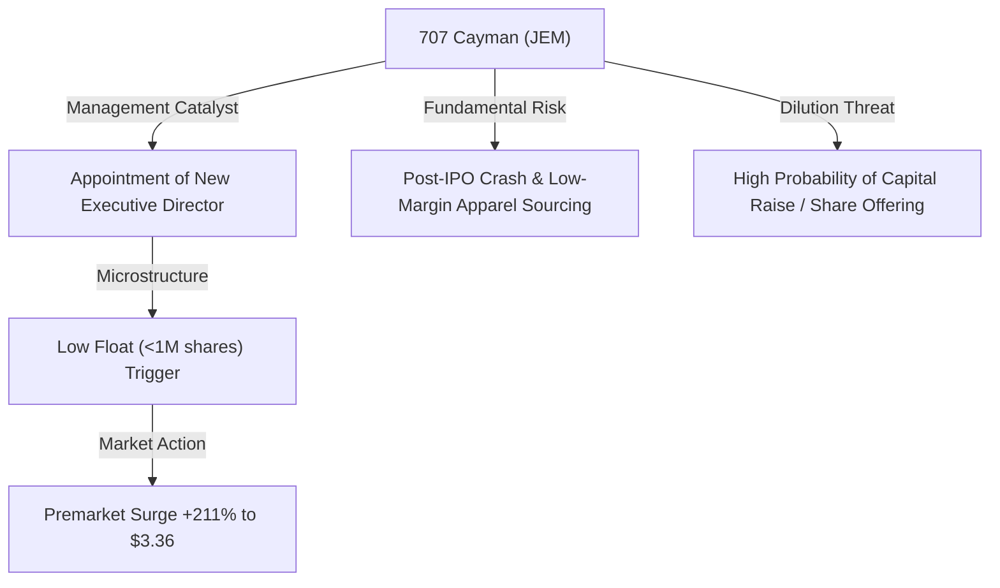
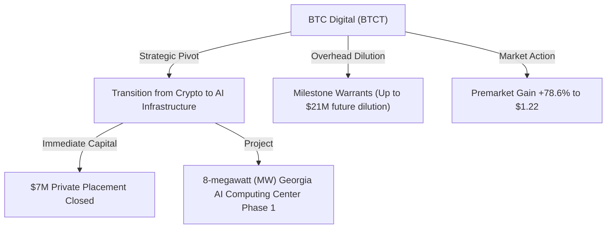
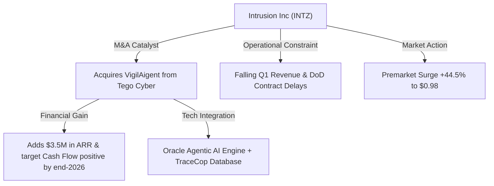
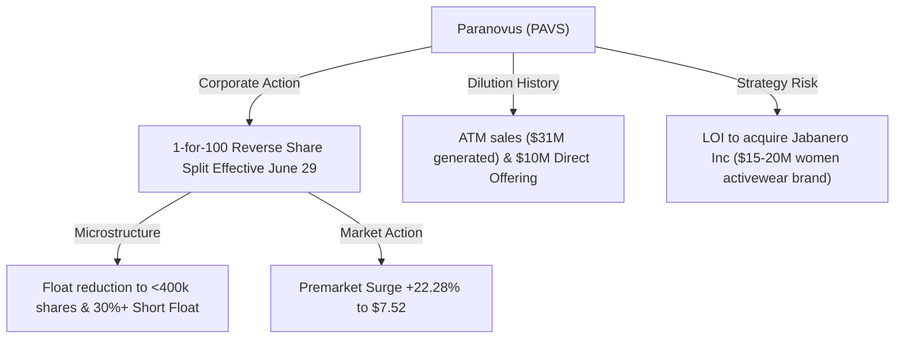
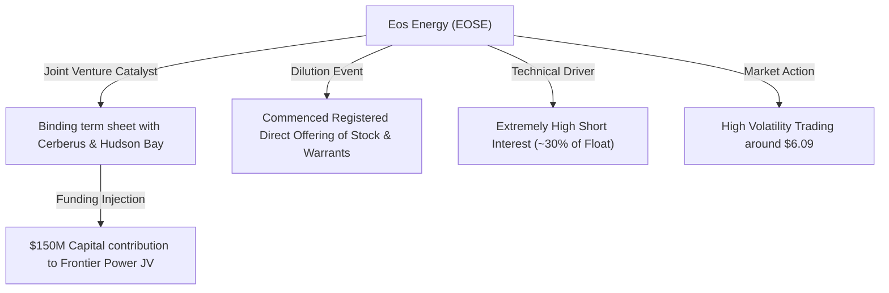

# 📊 Small-Cap & Penny Stock Intelligence Report
**Hedge Fund Trading Desk / Market Intelligence Division**  
**Date:** June 30, 2026  
**Market Stance:** End-of-Quarter Rebalancing / AI Narrative Pivots / Extreme Volatility & Dilution Warnings

---

## 📈 Executive Summary

สภาวะตลาดการเงินสหรัฐฯ ในเซสชันการซื้อขายวันที่ 30 มิถุนายน 2026 ซึ่งเป็นวันทำการสุดท้ายของไตรมาสที่ 2 เผชิญกับความผันผวนจากการจัดพอร์ต (Window Dressing) ของนักลงทุนสถาบัน ท่ามกลางดัชนีหลักที่เคลื่อนไหวในกรอบแคบและมีลักษณะทรงตัว อย่างไรก็ตาม ในฝั่งของกลุ่มหุ้น Small-Cap และ Penny Stocks (ราคาต่ำกว่า $5 หรือหุ้นขนาดเล็กที่มีโมเมนตัมเด่นชัด) กลับมีกิจกรรมการซื้อขายที่คึกคักอย่างมีนัยสำคัญ แรงขับเคลื่อนหลักในวันนี้กระจุกตัวอยู่ในหุ้นกลุ่มเทคโนโลยีที่มีการเปลี่ยนผ่านเชิงกลยุทธ์ไปสู่โครงสร้างพื้นฐาน AI (AI Infrastructure), การเข้าซื้อกิจการเพื่อควบรวมเทคโนโลยีการวิเคราะห์ระบบความปลอดภัยเชิงปัญญาประดิษฐ์ (Agentic AI Cybersecurity), และธุรกรรมการปรับโครงสร้างทุนขั้นรุนแรง (Reverse Split) เพื่อรักษาเกณฑ์จดทะเบียน ควบคู่ไปกับดีลการร่วมทุน (Joint Venture) ของสถาบันการเงินยักษ์ใหญ่เพื่อสนับสนุนอุตสาหกรรมพลังงานสะอาด

รายงานฉบับนี้จัดทำการวิเคราะห์เจาะลึก 5 หุ้นเด่นที่มีความเคลื่อนไหวทางราคาและปริมาณการซื้อขายที่ผิดปกติ ณ วันทำการ เพื่อให้นักลงทุนสถาบันและผู้ค้าเก็งกำไรความเร็วสูง (High-Frequency & Momentum Traders) ใช้ประกอบการประเมินโอกาสในฝั่ง Bullish และความเสี่ยงเชิงโครงสร้างในฝั่ง Bearish อย่างเป็นระบบและเป็นมืออาชีพ

---

## 🔬 In-Depth Stock Analysis

### 1️⃣ 707 Cayman Holdings Limited (NASDAQ: JEM)
*Micro-Cap Low-Float Speculative Surge on Executive Change vs. Structural Valuation Breakdown*

#### **1. Company Overview**
*   **Sector / Industry:** Consumer Cyclical / Wholesale – Apparel & Supply Chain Management
*   **Market Cap:** ~$3.50 Million USD (Micro-Cap ขนาดเล็กพิเศษ)
*   **Current Price:** ~$3.36 (ราคาปิดวันก่อนหน้า $1.08 ปรับตัวพุ่งแตะระดับ $3.36 ในช่วง Pre-Market)
*   **Average Volume (30D):** ~150,000 shares
*   **Float:** ~800,000 shares (สัดส่วนหุ้นหมุนเวียนในตลาดต่ำมากเป็นพิเศษหลังหักสัดส่วนผู้ถือหุ้นใหญ่)
*   **Short Float %:** ~1.85% of Float
*   **Shares Outstanding:** ~1.80 Million shares
*   **Institutional Ownership:** <1.00%
*   **Insider Ownership:** >55.00% (ถือครองหนาแน่นโดยกลุ่มผู้ก่อตั้งในฮ่องกง)

#### **2. Price Action Analysis**
*   **Movement:** ราคาหุ้นทะยานเปิด Gap Up ขนาดใหญ่ใน Pre-market กว่า +211.11% สัมผัสจุดสูงสุดที่ $3.36 บ่งชี้ความร้อนแรงของโมเมนตัมแบบฉับพลัน
*   **Microstructure:** ด้วยโครงสร้าง Free Float ที่ต่ำมาก (Extreme Low Float) ทำให้เมื่อมีแรงซื้อเก็งกำไรขนาดกลางไหลเข้ากระทบ ราคาหุ้นจึงวิ่งผ่านระดับแนวต้านเดิมอย่างง่ายดายเนื่องจากเกิดภาวะ Liquidity Void (ไม่มีแรงเสนอขายในกระดานฝั่งขวา)
*   **Accumulation/Distribution:** มีลักษณะการไล่ซื้อราคาอย่างรุนแรง (Aggressive Chasing) ในช่วง Premarket อย่างไรก็ตาม เมื่อขยับเข้าใกล้แนวจิตวิทยา $3.50 เริ่มเกิดแรงขายทำกำไรกดดันสลับออกมาอย่างต่อเนื่อง (Intraday Distribution) บ่งชี้ความเปราะบางของฐานราคา

#### **3. Volume Analysis**
*   **Relative Volume (RVOL):** **>40x** เทียบกับค่าเฉลี่ย 30 วันปกติ
*   **Volume Spike:** ปริมาณซื้อขาย Pre-market ทะลุกว่า 8.3ล้านหุ้น ซึ่งคิดเป็นเกือบ 10 เท่าของปริมาณ Float ทั้งหมด สะท้อน Churn Rate ที่สูงจัด (หุ้นหมุนเวียนเปลี่ยนมือรวดเร็ว)
*   **Smart Money Signal:** ไม่มีร่องรอยการสะสมของสถาบันระยะยาว ปริมาณซื้อขายทั้งหมดขับเคลื่อนโดย Retail Traders และระบบ High-Frequency Trading (HFT) ที่ดักจับเปอร์เซ็นต์ gainer ต้นชั่วโมง

#### **4. News & Catalyst Analysis**
*   **Catalyst (Management Appointment):**
    1. **รายละเอียดข่าว:** วันที่ 30 มิถุนายน 2026 บริษัทประกาศแต่งตั้งผู้อำนวยการฝ่ายบริหารคนใหม่ (Executive Director) เพื่อเข้ามาปรับปรุงห่วงโซ่อุปทานและดูแลดีลการจัดจำหน่ายในฝั่งอเมริกาเหนือ
*   **Bull vs Bear Case:**
    *   *Bull Case:* การเปลี่ยนผู้บริหารอาจเปิดโอกาสสู่ตลาดการจัดจำหน่ายเครื่องแต่งกายระดับไฮเอนด์และการหาคู่ค้ารายใหม่ในสหรัฐฯ
    *   *Bear Case:* การประกาศแต่งตั้งบอร์ดบริหารไม่ได้มีนัยสำคัญต่อกระแสเงินสดในทันที พฤติกรรมการวิ่งของราคาเป็นการฉวยโอกาสไล่ราคาหุ้นเบา (Low-Float Pump) ซึ่งมักจบลงด้วยการคืนรูปสู่ราคาฐานอย่างรวดเร็ว

#### **5. Financial Health**
*   **Revenue Growth & Profitability:** ธุรกิจหลักคือบริการออกแบบและจัดหาสินค้าแฟชั่นแบบครบวงจร (Supply Chain Sourcing) มีอัตรากำไรขั้นต้น (Gross Margin) ค่อนข้างต่ำและเผชิญสภาวะขาดทุนจากการดำเนินงานในรอบปีล่าสุด
*   **Cash Position & Runway:** งบดุลตึงตัวอย่างรุนแรง เงินสดในมือมีจำกัด
*   **Runway & Dilution Risk:** **ระดับอันตรายสูงสุด (Severe Dilution Risk)** ราคาที่พุ่งขึ้นมาเกิน $3.00 เป็นจังหวะที่บริษัทมักฉวยโอกาสออกแผนเพิ่มทุนผ่านตราสารทุน (Registered Direct Offering/ATM) เพื่อเติมกระแสเงินสดที่ร่อยหรอ

#### **6. Market Sentiment**
*   **Retail Sentiment:** เป็นจุดศูนย์รวมกระแสของ Retail Traders ใน X และ Discord เนื่องจากเป็นอันดับหนึ่งบนกระดาน Premarket Gainers เกิดภาวะ FOMO สั้นๆ
*   **Speculative Play:** ผู้เล่นเกือบทั้งหมดเป็นกลุ่มเก็งกำไรวันเดียว (Scalping/Day Trading) ไม่มีจุดประสงค์ถือครองข้ามคืน

#### **7. Technical Analysis**
*   **Trend Structure:** กราฟเบรกเส้นแนวโน้มขาลงระยะยาวที่ระดับ $1.10 ขึ้นมาอย่างฉับพลัน แต่เป็นการขึ้นแบบไร้ฐานรองรับ
*   **Indicators:** RSI ในไทม์เฟรมระยะสั้นแตะโซน Overbought ที่ 88 เกิดสัญญาณ Bearish Divergence ในกราฟ 5 นาทีเมื่อราคาสัมผัส $3.36
*   **Support/Resistance:** แนวรับ: $2.10, $1.50 / แนวต้าน: $3.36, $3.80

#### **8. Risk Analysis & Rating**
*   **Risk Level: ความเสี่ยงสูงมากที่สุด (Extreme Risk)**
*   **Threats:** ความเสี่ยงจากการถูกทุบทำกำไรอย่างรวดเร็ว (Pump & Dump Risk), ความผันผวนของหุ้นสภาพคล่องต่ำ (Low Liquidity Trap), และความเสี่ยงการประกาศเพิ่มทุนฉุกเฉิน

---

### 2️⃣ BTC Digital Ltd. (NASDAQ: BTCT)
*Pivot to AI Computing Infrastructure via $7M Private Placement vs. Medium-Term Warrant Dilution Pressure*

#### **1. Company Overview**
*   **Sector / Industry:** Technology / Software – Infrastructure (Computer Hardware & Data Processing)
*   **Market Cap:** ~$7.04 Million USD (Micro-Cap)
*   **Current Price:** ~$1.22 (ขยับบวกพุ่งแรงหลังมีรายงานความคืบหน้าการปิดดีลระดมทุนใหญ่)
*   **Average Volume (30D):** ~250,000 shares
*   **Float:** ~9.08 Million shares
*   **Short Float %:** ~3.92% of Float
*   **Shares Outstanding:** ~9.52 Million shares
*   **Institutional Ownership:** ~1.50%
*   **Insider Ownership:** ~12.20%

#### **2. Price Action Analysis**
*   **Movement:** ราคาพุ่งขึ้นบวกสูงสุด +78.68% ทำราคาสูงสุดของพรีมาร์เก็ตแถว $1.22 ฟื้นตัวขึ้นจากแรงกดดันขายอย่างหนักในสัปดาห์ก่อนหน้า (-47%)
*   **Microstructure:** มีแรงซื้อฝั่ง Bid หนาแน่นขึ้นอย่างชัดเจนจากการตอบสนองของ HFT และอัลกอริทึมที่สแกนคำว่า "AI Computing Center" ทะลวงแนวต้านแรกที่ $1.00 ได้อย่างทรงพลัง
*   **Accumulation/Distribution:** พบพฤติกรรมการทยอยเก็บสะสมหนาแน่นแถวเส้นฐาน (Accumulation) หลังจากการเทขายอย่างหนักหน่วงก่อนหน้านี้ บ่งชี้ว่าผู้เล่นเริ่มมองหาจุดตั้งฐานใหม่ภายใต้โมเดลธุรกิจที่มีรายได้แน่นอนกว่าเดิม

#### **3. Volume Analysis**
*   **Relative Volume (RVOL):** **>30x** เทียบกับวอลุ่มเฉลี่ยปกติ
*   **Volume Spike:** โวลุ่มพรีมาร์เก็ตทะยานแตะ 8.78 ล้านหุ้น แสดงว่านักเก็งกำไรในตลาดหลักทรัพย์ตอบรับธีม "Crypto to AI Pivot" ในระดับที่สูง
*   **Smart Money Signal:** การปิดดีล Private Placement มูลค่า $7M สะท้อนว่ากลุ่มสถาบันการเงินที่เชี่ยวชาญเฉพาะทาง (Specialty Funds) เริ่มเห็นคุณค่าของที่ดินและโครงข่ายไฟฟ้าเดิมที่สามารถแปลงเป็นเหมือง AI ได้

#### **4. News & Catalyst Analysis**
*   **Catalyst (Private Placement Closure & AI Pivot):**
    1. **รายละเอียดข่าว:** เมื่อวันที่ 29 มิถุนายน 2026 BTCT ประกาศปิดสัญญาเสนอขายหุ้นแบบเฉพาะเจาะจงแก่ผู้ลงทุนสถาบัน (Private Placement) ได้รับเงินสดเบื้องต้น $7.0 ล้านดอลลาร์สหรัฐ เพื่อนำไปใช้ก่อสร้างศูนย์ประมวลผลข้อมูล AI ขนาด 8 เมกะวัตต์ (8MW AI Computing Center) เฟสแรกในรัฐจอร์เจีย ซึ่งจะประกอบด้วยระบบระบายความร้อนด้วยของเหลว (Liquid-Cooling)
    2. **วอร์แรนต์แปลงสภาพ:** มีสัญญาพ่วงใบสำคัญแสดงสิทธิสัดส่วนเพิ่มทุนอีกสูงสุด $21 ล้าน หากมีการใช้สิทธิของ Common Warrants ครบถ้วน
*   **Bull vs Bear Case:**
    *   *Bull Case:* ปลดล็อกกระแสเงินสดทันที $7M เพื่อเปลี่ยนผ่านจากการขุดบิตคอยน์ที่อัตรากำไรผันผวน ไปเป็นผู้จัดหาเช่าระบบคำนวณ AI (AI Hosting Services) ซึ่งมีความต้องการสูงและมีอัตรากำไรมั่นคงกว่า
    *   *Bear Case:* สัญญาระดมทุนครั้งนี้มาพร้อมการออกหุ้นแปลงสภาพจำนวนมหาศาล (กว่า 6.14 ล้านหน่วย) ซึ่งจะสร้างแรงกดดันอุปทานส่วนเกิน (Overhead Supply) และเกิด Dilution ต่อผู้ถือหุ้นเดิมในระยะกลางทันทีที่มีการใช้สิทธิวอร์แรนต์

#### **5. Financial Health**
*   **Revenue Growth & Profitability:** รายได้เดิมจากการขุดเหรียญดิจิทัลมีอัตราการเติบโตติดลบและขาดทุนต่อเนื่องจากการเพิ่มขึ้นของอัตราความยากในการขุด (Difficulty)
*   **Cash Position & Runway:** การได้กระแสเงินสดล่วงหน้า $7M ช่วยยืดอายุ Cash Runway ไปได้อีกราว 9-12 เดือน รองรับแผนงานก่อสร้างเฟสแรกใน 6 เดือนข้างหน้า
*   **Runway & Dilution Risk:** **ระดับความเสี่ยงสูง (High Dilution Risk)** แม้ธุรกิจมีแนวโน้มก้าวหน้า แต่โครงสร้างทุนจะเจือจางลงอย่างมากหากผู้ซื้อดีล Private Placement ใช้สิทธิแปลงวอร์แรนต์ในราคาเสนอส่วนลด

#### **6. Market Sentiment**
*   **Retail Sentiment:** เป็นบวกอย่างเห็นได้ชัด (Bullish Sentiment) รายย่อยสนใจธีมพลังงานไฟฟ้าดาต้าเซ็นเตอร์ AI ร่วมกับกระแสพลิกฟื้น (Turnaround Play)
*   **Fear vs Greed:** ความโลภระยะสั้นกลับเข้ามาหนุนส่งหลังความตื่นตระหนกจากการร่วงหล่นของราคาในสัปดาห์ก่อนหน้า

#### **7. Technical Analysis**
*   **Trend Structure:** กราฟราคาระดับวันฟื้นตัวเป็นแท่ง Bullish Engulfing เบรกแนวต้านระดับ EMA 20 และ EMA 50 วันขึ้นมาหลังเคลื่อนไหวในกรอบล่างมาระยะหนึ่ง
*   **Indicators:** RSI รายวันดีดจากเขต Oversold (28) กลับขึ้นมาแตะระดับ 52 บ่งชี้โมเมนตัมฝั่งซื้อเริ่มได้เปรียบ
*   **Support/Resistance:** แนวรับ: $0.90, $0.68 / แนวต้าน: $1.35, $1.70

#### **8. Risk Analysis & Rating**
*   **Risk Level: ความเสี่ยงสูงมาก (Very High Risk)**
*   **Threats:** ความเสี่ยงด้านการดำเนินงานก่อสร้างล่าช้า (Execution Risk), ความเจือจางของราคาหุ้นจากวอร์แรนต์แปลงสภาพ, และความผันผวนร่วมกับทิศทางราคาคริปโทเคอร์เรนซีเดิม

---

### 3️⃣ Intrusion Inc. (NASDAQ: INTZ)
*Strategic M&A Acquisition of VigilAigent & Agentic AI Cybersecurity Integration vs. Delayed Contract Risks*

#### **1. Company Overview**
*   **Sector / Industry:** Technology / Software – Infrastructure (Cybersecurity & Threat Intelligence)
*   **Market Cap:** ~$13.42 Million USD
*   **Current Price:** ~$0.98 (พุ่งเข้าหาแนวจิตวิทยา $1.00 จากราคาปิด $0.68)
*   **Average Volume (30D):** ~180,000 shares
*   **Float:** ~18.10 Million shares
*   **Short Float %:** ~1.58% of Float
*   **Shares Outstanding:** ~20.37 Million shares
*   **Institutional Ownership:** ~2.10%
*   **Insider Ownership:** ~10.50%

#### **2. Price Action Analysis**
*   **Movement:** ราคาพุ่งขึ้นใน Premarket +44.47% มาเกลี่ยความผันผวนอยู่แถวระดับ $0.98 พยายามที่จะยึดและปิดเหนือด่านจิตวิทยาสำคัญที่ $1.00 ให้สำเร็จในเวลาตลาดเปิดทำการหลัก
*   **Microstructure:** สภาพคล่องฝั่งเสนอขายในกรอบ $0.85 - $0.95 โดนรวบหมดอย่างรวดเร็ว สะท้อนโมเมนตัมการสะสมเชิงลึก (Accumulation) หลังจากการปรับฐานมาอย่างยาวนาน
*   **Overhead Supply:** มีแรงขายสกัดบางส่วนบริเวณระดับราคา $1.00 - $1.05 ซึ่งเป็นโซนที่ผู้ติดหุ้นเดิมตั้งแต่ช่วงต้นปีก่อนเริ่มทยอยลดความเสี่ยงพอร์ต

#### **3. Volume Analysis**
*   **Relative Volume (RVOL):** **>45x** เทียบกับเฉลี่ยปกติ
*   **Volume Spike:** มีโวลุ่มสะสมใน Premarket หนาแน่นถึง 9.19 ล้านหุ้น บ่งชี้ว่านักลงทุนกลุ่มเทรดเดอร์สแกนพบความเคลื่อนไหวจากข่าวเข้าซื้อกิจการเป็นอันดับแรกๆ
*   **Smart Money Signal:** มีคำสั่งซื้อขนาดใหญ่ (Block Trade) ในช่วงพรีมาร์เก็ต คาดว่าเป็นกลุ่มนักลงทุนสถาบันรายย่อยหรือสปอนเซอร์ของบริษัทที่เข้ามาช้อนรับเพื่อรองรับการปรับปรุงโครงสร้างงบดุลผ่านรายได้ ARR ใหม่

#### **4. News & Catalyst Analysis**
*   **Catalyst (Strategic M&A and AI Engine Integration):**
    1. **รายละเอียดดีล:** INTZ ประกาศเสร็จสิ้นการเข้าซื้อกิจการ VigilAigent ผู้ให้บริการระบบความปลอดภัยเครือข่ายอัจฉริยะ (MSSP) จาก Tego Cyber Inc.
    2. **ผลประโยชน์ทางการเงิน:** ดีลนี้คาดว่าจะช่วยสร้างรายได้ประจำปี (Annual Recurring Revenue - ARR) เพิ่มขึ้นทันทีราว **$3.5 ล้านดอลลาร์** ซึ่งถือเป็นนัยสำคัญอย่างมากเมื่อเทียบกับ Market Cap ของบริษัทในปัจจุบัน และช่วยสนับสนุนเป้าหมายกระแสเงินสดเป็นบวก (Cash Flow Positive) ภายในปี 2026
    3. **ความร่วมมือทางเทคโนโลยี:** จะทำการผสานเครื่องมือปัญญาประดิษฐ์เชิงเอเจนต์ (Agentic AI Engine) ชื่อ "The Oracle" ของ VigilAigent เข้ากับฐานข้อมูล TraceCop ของ Intrusion ที่เก็บประวัติภัยคุกคามทาง IP กว่า 8.5 พันล้านรายการ
*   **Bull vs Bear Case:**
    *   *Bull Case:* เทคโนโลยีความปลอดภัยเชิงรุกและระดับฐานรายได้ ARR ที่เข้ามาทันทีช่วยยกระดับฐานะทางการเงินและเสริมจุดขายเชิงเทคโนโลยีปัญญาประดิษฐ์เชิงเอเจนต์ (Agentic AI) ที่เป็นเมกะเทรนด์ปัจจุบัน
    *   *Bear Case:* ผลการดำเนินงาน Q1 2026 ที่ผ่านมารายงานรายได้ทรุดลงอย่างมีนัยเนื่องจากความล่าช้าในการอนุมัติสัญญาจัดหาของกระทรวงกลาโหม (DoD) หากการบูรณาการระบบใหม่ใช้เวลานานและดีลรัฐบาลยังคงดีเลย์ บริษัทยังคงมีภาวะการเผาเงินสดล่วงหน้า

#### **5. Financial Health**
*   **Revenue Growth & Profitability:** รายได้เดิมมีทิศทางชะลอตัวลง แต่การได้ $3.5M ARR จาก VigilAigent เข้ามาหนุนจะช่วยเสริมสภาพคล่องเชิงรับได้อย่างเร่งด่วน
*   **Cash Position & Runway:** เงินสดก่อนหน้านี้อยู่ในระดับจำกัด ต่ำกว่า $1.5M ส่งผลให้กระแสเงินสดจากการจัดหากิจกรรมใหม่มีความจำเป็น
*   **Runway & Dilution Risk:** **ระดับความเสี่ยงปานกลางถึงสูง (Medium-High Risk)** แม้จะตั้งเป้ากระแสเงินสดเป็นบวกปลายปีนี้ แต่ความตึงตัวของงบดุลอาจบีบให้บริษัทต้องออกหุ้นเพิ่มทุนระดับย่อยเพื่อปรับโครงสร้างพอร์ตหนี้สิน

#### **6. Market Sentiment**
*   **Retail Sentiment:** ชุมชนเทรดเดอร์ตอบรับเชิงบวกเป็นพิเศษด้วยการเชื่อมโยงคำว่า "Agentic AI Integration" และการสัมมนาเว็บคาสต์พิเศษของนักลงทุนในช่วงเช้า 10:00 น. ET
*   **Speculative vs Belief:** นักลงทุนส่วนหนึ่งหันกลับมา "เชื่อมั่นในอนาคต" จากการย้ายเข้าสู่หมวดหมู่ซอฟต์แวร์ AI Security ที่มี ARR รองรับ ต่างจากหุ้นเก็งกำไรเปล่าประโยชน์ทั่วไป

#### **7. Technical Analysis**
*   **Trend Structure:** เป็นสัญญานของการทำกรอบ Bullish Reversal ที่ชัดเจนหลังทำจุดต่ำสุดคู่ (Double Bottom) บริเวณ $0.65 การยืนเหนือระดับ EMA 50 วันได้ในวันนี้จะช่วยยืนยันการเปลี่ยนแนวโน้มระยะกลาง
*   **Indicators:** MACD ตัดขึ้นเหนือเส้น Signal Line เป็นวันที่สองติดต่อกัน RSI รายวันขยับสู่ระดับ 61 สะท้อนความแข็งแกร่งของแรงส่ง
*   **Support/Resistance:** แนวรับ: $0.80, $0.65 / แนวต้าน: $1.05, $1.30

#### **8. Risk Analysis & Rating**
*   **Risk Level: ความเสี่ยงสูง (High Risk)**
*   **Threats:** ความเสี่ยงจากการไม่สามารถบรรลุเป้าหมายการรับรู้รายได้ ARR ตามที่คาดหวัง, ปัญหาการขยายสัญญาของรัฐบาล (DoD Contract Volatility), และความเสี่ยงราคาหุ้นหลุดเกณฑ์ $1.00 ของ Nasdaq หากแรงซื้อเริ่มแห้งลง

---

### 4️⃣ Paranovus Entertainment Technology Ltd. (NASDAQ: PAVS)
*1-for-100 Reverse Split Execution & 30%+ Short Float vs. Severe Historic Dilution & Strategy Shift*

#### **1. Company Overview**
*   **Sector / Industry:** Technology / Software & IT Services (AI-powered entertainment, gaming, and digital platform)
*   **Market Cap:** ~$3.78 Million USD (คำนวณตามจำนวนหุ้นหลังกระบวนการรวบหุ้น)
*   **Current Price:** ~$7.52 (ราคาหลังการทำ Reverse split 100 เท่า โดยในช่วง Premarket ขยับบวกไปแตะ $7.52 จากจุดเฉลี่ยหลังทำดีล)
*   **Average Volume (30D):** ~6,000,000 shares (Pre-split)
*   **Float:** ~350,000 shares (Post-split) - สภาพคล่องหุ้นในตลาดบางเฉียบเป็นประวัติการณ์
*   **Short Float %:** ~30.00% - 32.00% of Float (ปริมาณ short interest สัดส่วนสูงมากหลังการหักลดจำนวนหุ้น)
*   **Shares Outstanding:** ~502,850 shares (Post-split)
*   **Institutional Ownership:** ~1.20%
*   **Insider Ownership:** ~15.10%

#### **2. Price Action Analysis**
*   **Movement:** ราคาพุ่งดีดขึ้น in Premarket +22.28% อยู่ที่ระดับ $7.52 หลังจากผ่านวันซื้อขายแรกของการปรับ Reverse split อัตรา 1-for-100 เมื่อวันที่ 29 มิถุนายน
*   **Microstructure:** โครงสร้างหุ้นหมุนเวียนหลัก (Float) ที่ลดลงเหลือไม่ถึง 4 แสนหุ้น ส่งผลให้เกิดความผันผวนขีดสุด (Extreme Volatility) ช่องว่างราคา (Bid-Ask Spread) กว้างมาก ทำให้สามารถแกว่งตัวขึ้นลงระดับ 10-20% ได้ภายในเวลาไม่กี่นาที
*   **Speculative Action:** มีสัญญาณการบีบซื้อของฝั่งชอร์ต (Short Squeeze Play) ปรากฏขึ้นในระบบการจัดส่งออเดอร์ เนื่องจากฝั่งขายชอร์ตเดิมหาหุ้นมาคืนในตลาดยากลำบากหลังกระบวนการรวบหุ้น

#### **3. Volume Analysis**
*   **Relative Volume (RVOL):** **>5.0x** (เทียบปริมาณหุ้นหมุนเวียนสัดส่วนใหม่)
*   **Volume Spike:** วอลุ่มพรีมาร์เก็ตอยู่ที่ 279,000 หุ้น ซึ่งเทียบเท่ากับปริมาณซื้อขายถึง 27.9 ล้านหุ้นในช่วงก่อนการทำ Reverse split สะท้อนพฤติกรรมความร้อนแรงในการโอนย้ายหุ้นของรายย่อยและระบบจับจังหวะ
*   **Smart Money Signal:** ไม่พบการเข้าสะสมของสปอนเซอร์ระยะยาว คาดว่าดีลเลอร์และ Market Makers ทำงานอย่างหนักในการบริหารความเสี่ยงจากการลดสัดส่วนของ ATM program

#### **4. News & Catalyst Analysis**
*   **Catalyst (Reverse Split & Activewear LOI):**
    1. **รายละเอียดการรวบหุ้น:** ประกาศทำ Reverse split สัดส่วน 1-for-100 มีผลอย่างเป็นทางการเมื่อ 29 มิถุนายน 2026 เพื่อดันราคาหุ้นให้สูงกว่าเกณฑ์ Nasdaq และเพิ่มโอกาสให้เข้าตาผู้เล่นรายใหญ่
    2. **ธุรกรรมก่อนหน้า:** วันที่ 15 มิถุนายน ปิดดีลระดมทุน ATM ได้เงินสดสะสม $31 ล้านดอลลาร์ และจัดตั้งแผนเสนอขายหุ้นเฉพาะกลุ่มสถาบันแบบ $10 ล้านดอลลาร์ ที่ราคา $0.20 (ราคา Pre-split)
    3. **ความร่วมมือ/เข้าซื้อนอกสายงานหลัก:** ลงนามในหนังสือแสดงเจตจำนงที่ไม่ผูกมัด (non-binding LOI) เพื่อเข้าซื้อกิจการแบรนด์เสื้อผ้าและสปอร์ตแวร์ผู้หญิง "Jabanero Inc." มูลค่าราว $15M - $20M
*   **Bull vs Bear Case:**
    *   *Bull Case:* โครงสร้างราคาหลังทำ Reverse Split และปริมาณเงินสดสะสมกว่า $40 ล้านดอลลาร์ในมือ ช่วยลดความเสี่ยงทางการเงินระยะสั้นได้อย่างเด็ดขาด และเปิดโอกาสให้ลุ้นจังหวะ Short Squeeze รุนแรง
    *   *Bear Case:* การย้ายสายงานหลักจากเทคโนโลยีเอ็นเตอร์เทนเมนต์ไปซื้อกิจการสตรีทแวร์/เสื้อผ้ากีฬาผู้หญิง สะท้อนความไม่ชัดเจนในทิศทางกลยุทธ์ธุรกิจ (Lack of Core Focus) และประวัติศาสตร์การเจือจางหุ้นที่ผ่านมาสร้างความเสียหายแก่ผู้ถือหุ้นในบอร์ดอย่างหนักหนา

#### **5. Financial Health**
*   **Revenue Growth & Profitability:** มีรายได้ต่ำและขาดทุนสุทธิอย่างต่อเนื่องจากโมเดลธุรกิจเดิม
*   **Cash Position & Runway:** ปัจจุบันมีสถานะเงินสดในมือที่ค่อนข้างดีชั่วคราวจากการเทขายหุ้นผ่านตั๋ว ATM ในรอบเดือนที่ผ่านมา
*   **Runway & Dilution Risk:** **ระดับอันตรายสูงสุด (Severe Dilution Risk)** แม้ปัจจุบันมีเงินสดเสริม แต่โครงสร้างการเซ็นสัญญากับคู่ค้าสถาบันที่ราคาต่ำพ่วงสิทธิแปลงวอร์แรนต์ มักเป็นสัญญาณเตือนว่าราคาหุ้นในกระดานจะโดนเจือจางต่อเนื่องในระยะยาว

#### **6. Market Sentiment**
*   **Retail Sentiment:** อารมณ์ตลาดของรายย่อยคุกรุ่นเต็มไปด้วยความกลัวและความคาดหวังในการเก็งกำไรในสัดส่วน 50/50 ชุมชนเทรดเดอร์ Reddit ติดตามประเด็นปริมาณการชอร์ตที่สูงจัดร่วมกับโครงสร้าง Low-float เป็นกรณีพิเศษ
*   **Fear vs Greed:** ระดับความโลภเก็งกำไร (Speculative Greed) พุ่งสูงในลักษณะ FOMO ในจังหวะราคากระชากบีบชอร์ต

#### **7. Technical Analysis**
*   **Trend Structure:** โครงสร้างกึ่งผิดปกติเนื่องจากการทำ Reverse split อย่างไรก็ตาม ทรงกราฟในกรอบรายชั่วโมงยังคงพยายามรักษาการยกตัว (Higher Lows) บริเวณ $7.00
*   **Indicators:** RSI แตะระดับ 65 ในไทม์เฟรม 15 นาที มีลักษณะการแกว่งตัวกว้างในกรอบ Bollinger Bands ที่ถ่างตัวออกสะท้อนระดับ Volatility ขั้นขีดสุด
*   **Support/Resistance:** แนวรับ: $7.00, $6.20 / แนวต้าน: $8.50, $10.00

#### **8. Risk Analysis & Rating**
*   **Risk Level: ความเสี่ยงสูงมากที่สุด (Extreme Risk)**
*   **Threats:** ความเสี่ยงการถูกลากทุบด้วยปริมาณหุ้นที่น้อยมาก (Manipulation Risk), ความผันผวนระดับสูงที่อาจส่งผลให้หมดมูลค่าได้อย่างรวดเร็ว, และความไม่สอดคล้องของพอร์ตโฟลิโอธุรกิจใหม่

---

### 5️⃣ Eos Energy Enterprises, Inc. (NASDAQ: EOSE)
*Cerberus & Hudson Bay $150M JV Lifeline vs. Registered Direct Offering Dilution Pressure*

#### **1. Company Overview**
*   **Sector / Industry:** Industrials / Electrical Equipment & Battery Storage (Energy storage solutions)
*   **Market Cap:** ~$2.07 Billion USD
*   **Current Price:** ~$6.09 (ผันผวนรุนแรงจากผลกระทบเชิงบวกด้านข่าวร่วมทุนข้ามชาติและแรงกดดันลบจากดีลเพิ่มทุน)
*   **Average Volume (30D):** ~7,500,000 shares
*   **Float:** ~305 Million shares
*   **Short Float %:** ~30.50% of Float (ระดับ short interest สูงเป็นประวัติการณ์เมื่อเทียบกับขนาดมาร์เก็ตแคป)
*   **Shares Outstanding:** ~339.51 Million shares
*   **Institutional Ownership:** ~48.00% (สถาบันถือครองสูง สะท้อนระดับความสนใจเชิงโครงสร้างพื้นฐาน)
*   **Insider Ownership:** ~3.80%

#### **2. Price Action Analysis**
*   **Movement:** ราคาแกว่งตัวผันผวนขอบกว้างรอบระดับ $6.09 มีปริมาณการเทรดปะทะกันอย่างดุเดือดระหว่างฝั่งกระทิงที่ตอบรับข่าวทุนหนุน $150 ล้านดอลลาร์ และฝั่งหมีที่กดดันด้วยสัญญาหุ้นเพิ่มทุนใหม่
*   **Microstructure:** สภาพคล่องหนาแน่นระดับพรีเมียม (Excellent Liquidity Quality) มีคำสั่ง Bid-Ask จับคู่แบบต่อเนื่องและรวดเร็วเนื่องจากจดทะเบียนในกระดานหลักและมี Institutional Flow ไหลเข้าทำธุรกรรมป้องกันความเสี่ยงสม่ำเสมอ
*   **Squeeze Signal:** การต่อสู้บริเวณแนวต้าน $6.50 มีความสำคัญสูงสุด เนื่องจากปริมาณชอร์ตที่ถือสถานะไว้สูงถึง 30% ของ Float จะถูกบังคับคัฟเวอร์ชอร์ตหากราคาสามารถยืนหยัดเหนือแนวดังกล่าวได้

#### **3. Volume Analysis**
*   **Relative Volume (RVOL):** **>5.5x** เทียบกับเฉลี่ยปกติ
*   **Volume Spike:** ปริมาณวอลุ่มหมุนเวียนในเซสชันล่าสุดพุ่งสูงทะยานขึ้น บ่งชี้การปรับสัดส่วนพอร์ตครั้งสำคัญของกองทุนบริหารความเสี่ยง (Hedge Funds) และกลุ่ม Smart Money
*   **Smart Money Signal:** การเข้ามาของกลุ่มทุนทางเลือกยักษ์ใหญ่อย่าง Cerberus Capital Management บ่งบอกชัดเจนว่าบริษัทก้าวผ่านจากการเก็งกำไรเทคโนโลยีดิสรัปทีฟไปสู่พิกัดการยอมรับของกลุ่มสถาบันการเงินทางเลือกหลัก

#### **4. News & Catalyst Analysis**
*   **Catalyst (Cerberus & Hudson Bay Joint Venture & Stock Offering):**
    1. **ข้อตกลงร่วมทุน (JV):** วันที่ 30 มิถุนายน 2026 Eos ประกาศลงนามในข้อตกลงแก้ไขเพิ่มเติมในข้อตกลงฉบับผูกพันเพื่อร่วมจัดตั้งบริษัทร่วมทุน "Frontier Power USA Parent, LLC" โดย affiliates ของ **Cerberus Capital Management** และ **Hudson Bay Capital Management** จะอัดฉีดเงินทุนรวม $150 ล้านดอลลาร์เข้าสู่บริษัทร่วมทุน
    2. **ธุรกรรมการเสนอขายหุ้นเพิ่มทุน:** ในวันเดียวกัน Eos ประกาศเริ่มทำดีลเสนอขายหุ้นสามัญและใบสำคัญแสดงสิทธิสิทธิ์ในการซื้อหุ้นแบบระบุกลุ่ม (Registered Direct Offering) เพื่อนำเงินที่ได้ไปชำระสัดส่วนการลงทุนตามแผนงานจัดตั้ง Frontier Power
*   **Bull vs Bear Case:**
    *   *Bull Case:* การได้สถาบันระดับแนวหน้าอย่าง Cerberus และ Hudson Bay มาร่วมหนุนทุนสะท้อนว่าสเปกของแบตเตอรี่สังกะสี (Zinc-based Energy Storage) ผ่านการตรวจสอบคุณสมบัติอย่างละเอียด (Due Diligence) และได้เงินสดมาเดินหน้าก่อสร้างโครงข่ายจัดเก็บพลังงานขนาดใหญ่โดยไม่ต้องกังวลเรื่องการขาดสภาพคล่องระยะยาว
    *   *Bear Case:* ดีดีลระดมทุนผ่านหุ้นเสนอขายตรงจะกดดันราคาหุ้นในกระดานทันทีในแง่ของ Technical Dilution และจำกัดกรอบการเติบโตของ EPS ในระยะสั้น

#### **5. Financial Health**
*   **Revenue Growth & Profitability:** รายได้เติบโตในทิศทางขาขึ้นตามคำสั่งซื้อสะสม (Backlog) แต่บริษัทยังคงมีผลขาดทุนสุทธิเนื่องจากต้นทุนการขยายสายการผลิตโรงงานขนาดใหญ่ (High CapEx Stage)
*   **Cash Position & Runway:** การอัดฉีดเงิน $150M ผ่านโครงสร้าง JV ช่วยลดภาระการเผาเงินสด (Cash Burn) ในงบดุลหลักได้เป็นอย่างดี ขยายเวลาดำเนินงานได้อย่างมีประสิทธิภาพ
*   **Runway & Dilution Risk:** **ระดับความเสี่ยงปานกลาง (Medium Risk)** มีความเจือจางราคาในปัจจุบันจริง แต่ถูกทดแทนด้วยมูลค่าสินทรัพย์โครงสร้างร่วมทุนระยะยาวที่มีประสิทธิภาพสูงกว่าเดิมมาก

#### **6. Market Sentiment**
*   **Retail Sentiment:** ตอบรับคละเคล้ากัน ทั้งมีความกังวลเรื่องการเพิ่มทุน แต่ส่วนใหญ่ให้ความสำคัญกับคำว่า "Cerberus $150M JV"
*   **Short Squeeze Potential:** ศักยภาพสูงสุดใน Watchlist ประจำวันเนื่องจากระดับ Short Float อยู่ในอัตรา 30.50% หากฝั่งสถาบันช้อนซื้อต่อเนื่องเพื่อถือครองสิทธิ์ตาม JV อาจเกิดปฏิกิริยาลูกโซ่บีบกลุ่มชอร์ตตกหน้าต่างได้ง่าย

#### **7. Technical Analysis**
*   **Trend Structure:** กราฟเคลื่อนไหวแบบสร้างแนวรับยืดหยุ่นบริเวณระดับ EMA 200 วันที่สำคัญแถว $5.80 พยายามรักษาโครงสร้างขาขึ้นใหญ่ (Long-term Bullish Structure)
*   **Indicators:** RSI แกว่งแถว 49 บ่งชี้โซนเป็นกลางสะสมพลัง พร้อมเข้าสู่เขตสะสมเพิ่มเพื่อเตรียมทดสอบด่านเป้าหมายกรอบบน
*   **Support/Resistance:** แนวรับ: $5.80, $5.40 / แนวต้าน: $6.60, $7.50

#### **8. Risk Analysis & Rating**
*   **Risk Level: ความเสี่ยงสูง (High Risk)**
*   **Threats:** ความเจือจางจากหุ้นใหม่และวอร์แรนต์, ความท้าทายในการพัฒนาสายการผลิตเชิงอุตสาหกรรมร่วมกับพันธมิตร (Operational Scaling Risks), และความผันผวนจากการบีบชอร์ต

---

## 🧠 Key Insights Summary

*   **หุ้นตัวไหน Momentum แข็งแรงที่สุด:** **707 Cayman Holdings Limited (JEM)** และ **BTC Digital Ltd. (BTCT)** สะท้อนแรงส่งที่เร่งตัวสูงที่สุดชั่วคราวในฝั่ง Premarket ทว่า JEM มีระดับการเก็งกำไรที่เปราะบางกว่ามาก
*   **หุ้นตัวไหน Volume น่าสนใจที่สุด:** **Intrusion Inc. (INTZ)** เนื่องจากโวลุ่มแตะระดับ 9.19 ล้านหุ้น บ่งชี้การเปลี่ยนถ่ายสัญญากลุ่มทุนและการสะสมเพื่อรับการเติบโตของเทคโนโลยี AI Security ประจวบเหมาะกับฐานราคาที่ยังต่ำกว่า $1.00
*   **หุ้นตัวไหน Smart Money เข้า:** **Eos Energy Enterprises, Inc. (EOSE)** เด่นชัดที่สุดจากการลงนามเป็นพันธมิตรร่วมทุนกับ Cerberus และ Hudson Bay ซึ่งเป็นสถาบันการเงินทางเลือกชั้นนำระดับโลก นำเงินทุนกว่า $150M เข้าสนับสนุนโครงสร้างพื้นฐานพลังงาน
*   **หุ้นตัวไหนเป็นแค่เก็งกำไร:** **707 Cayman Holdings Limited (JEM)** ปัจจัยบวกของราคาขับเคลื่อนด้วยการแต่งตั้งคณะกรรมการบริหารชุดใหม่ ซึ่งไม่ส่งผลต่อกำไรขาดทุนของบริษัทในทันที และทำงานบนโครงสร้าง Low Float หมุนเวียนต่ำเพื่อเอื้อการไล่ราคา
*   **หุ้นตัวไหนพื้นฐานดีที่สุด:** **Eos Energy Enterprises, Inc. (EOSE)** มีโรงงานและสายการผลิตแบตเตอรี่จัดเก็บพลังงานที่ได้รับการอนุมัติโครงการร่วมทุนขนาดใหญ่ชัดเจน พร้อมกับการถือครองโดยสถาบันเกือบครึ่งหนึ่งของบริษัท
*   **หุ้นตัวไหนเสี่ยงโดนทุบ:** **707 Cayman Holdings Limited (JEM)** เสี่ยงสูงสุดจากการเผชิญแรงเทขายรวดเร็ว (Mean Reversion) ทันทีที่ตลาดหลักเปิดทำธุรกรรม เนื่องจากอัตราการวิ่ง Premarket ขึ้นมาสูงเกินปัจจัยกระตุ้นจริง
*   **หุ้นตัวไหนเสี่ยง Pump & Dump:** **Paranovus Entertainment (PAVS)** และ **707 Cayman Holdings (JEM)** มีความอ่อนไหวสูงมากจากการควบคุมปริมาณหุ้นหมุนเวียนที่เบาบาง (Float < 1M หุ้น)
*   **หุ้นตัวไหนควรจับตาต่อคืนนี้:** **Eos Energy Enterprises (EOSE)** สังเกตจังหวะปะทะของแรงชอร์ตและโอกาสในการบีบชอร์ต (Short Squeeze) และ **Intrusion Inc (INTZ)** ว่าจะสามารถทะลุและยืนหยัดเหนือแนวจิตวิทยา $1.00 ได้หรือไม่
*   **หุ้นตัวไหนเหมาะกับ Watchlist มากที่สุด:** **Eos Energy Enterprises (EOSE)** (Bias: Long / Squeeze Speculation) และ **Intrusion Inc. (INTZ)** (Bias: Strategic Accumulation) จากการปรับปรุงฐานรายได้ประจำ ARR อย่างมีนัยสำคัญ

---

## 🎯 สรุป Watchlist ประจำวัน (Daily Watchlist)

*   **Top Momentum:** **JEM** (การไล่ราคาระดับความเร็วสูงในกระดานพรีมาร์เก็ต)
*   **Top Risk:** **PAVS** (ความผันผวนจากการรวบหุ้น Reverse Split 1-for-100 สภาพคล่องบาง และการย้ายแนวการลงทุนไปนอกธุรกิจหลัก)
*   **Top Volume:** **INTZ** (โวลุ่มการทำดีลเทรดปรับพอร์ตสูงสุดเทียบสัดส่วนและข่าวควบรวม VigilAigent)
*   **Top Catalyst:** **EOSE** (ความตกลงร่วมทุนมูลค่า $150M กับ Cerberus & Hudson Bay)
*   **Top Speculative Play:** **BTCT** (ดีดตัวจากโซนต่ำช้อนรับข่าวดีลผันผวนเปลี่ยนผ่านสู่เหมืองคำนวณ AI)

### 🏆 จัดอันดับประเมินความเคลื่อนไหว:
*   🥇 **หุ้นเด่นที่สุดของวัน (Top Pick of the Day):** **Eos Energy Enterprises, Inc. (EOSE)** — ได้รับการยอมรับจากสถาบันการเงินทางเลือกยักษ์ใหญ่ร่วมทุน $150M ช่วยยกระดับความเชื่อมั่นเชิงปัจจัยพื้นฐาน พร้อมปัจจัยสนับสนุนฝั่งเทคนิคัลจากปริมาณชอร์ตที่ตึงตัว 30% ของ Float เป็นโอกาสที่น่าจับตามองในระยะยาว
*   ⚠️ **หุ้นเสี่ยงที่สุดของวัน (Riskiest of the Day):** **Paranovus Entertainment (PAVS)** — การทำ Reverse split อัตรา 100 เท่า ดึงให้ Free Float ลดฮวบลงเหลือระดับไมโคร ส่งผลให้เกิดความผันผวนสูงสุดขีดพ่วงประวัติศาสตร์การเจือจางพอร์ตของนักลงทุนรายย่อยอย่างต่อเนื่อง
*   👀 **หุ้นที่ตลาดจับตาที่สุดของวัน (Most Watched of the Day):** **Intrusion Inc. (INTZ)** — การผสานโมเดลปัญญาประดิษฐ์เชิงเอเจนต์ (Agentic AI) เข้ามาสร้างมูลค่าเพิ่มและสามารถดึงรายได้ประจำ ARR เพิ่มขึ้นทันที $3.5M จะสร้างความตื่นตัวในกลุ่มผู้ค้าหุ้นกลุ่มความปลอดภัยเครือข่าย

---
*คำเตือน: รายงานฉบับนี้จัดทำขึ้นเพื่อวัตถุประสงค์ในการให้ข้อมูลและการวิเคราะห์ตลาดการเงินเท่านั้น ไม่ใช่คำแนะนำในการลงทุน ชี้ชวน หรือเสนอแนะให้ซื้อหรือขายหลักทรัพย์ใด ๆ หุ้นขนาดเล็กและหุ้นราคาต่ำกว่า $5 (Penny Stocks) มีความผันผวนสูงมาก มีความเสี่ยงในการสูญเสียเงินลงทุนทั้งหมด หรือประสบปัญหาการขาดสภาพคล่องในการซื้อขาย นักลงทุนและผู้เทรดควรตระหนักถึงความเสี่ยงข้างต้น ปฏิบัติตามวินัยทางการเงิน และตั้งจุดตัดขาดทุน (Stop Loss) อย่างเคร่งครัดในทุกกรณีการซื้อขาย*
