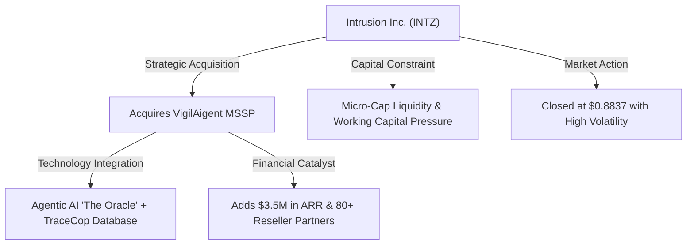
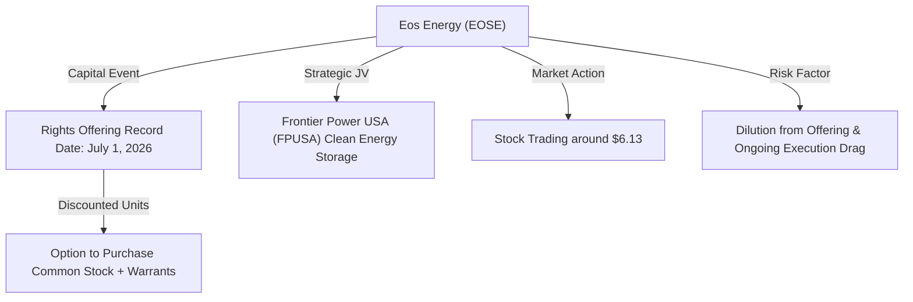
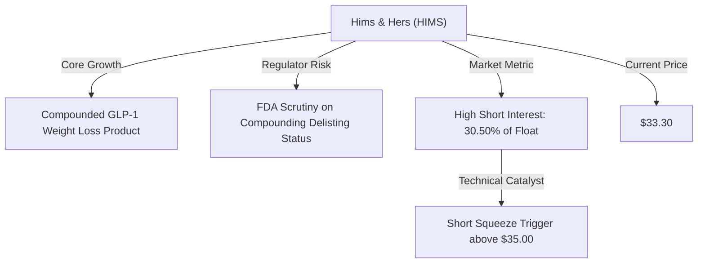
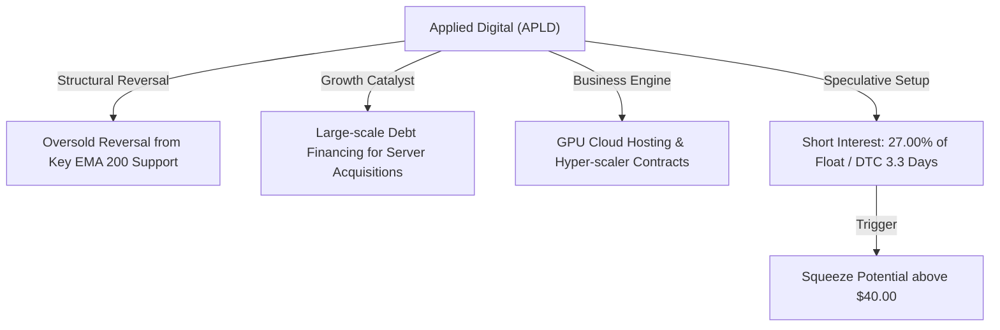
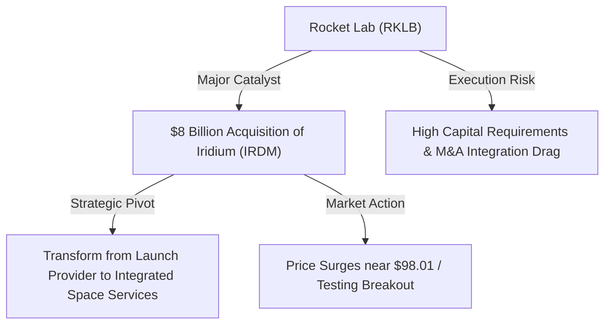

# 📊 Small-Cap & Penny Stock Intelligence Report
**Hedge Fund Trading Desk / Market Intelligence Division**  
**Date:** July 1, 2026  
**Market Stance:** Tech/AI Recovery / Index Rebalancing Follow-through / Space & Cybersecurity M&A Catalysts

---

## 📈 Executive Summary

สภาวะตลาดการเงินสหรัฐฯ ในรอบ 24 ชั่วโมงที่ผ่านมา (1 กรกฎาคม 2026) เริ่มมีเสถียรภาพมากขึ้นหลังผ่านพ้นช่วงการปรับพอร์ตครั้งใหญ่ช่วงสิ้นไตรมาสที่ 2 (Quarter-End Portfolio Rebalancing) ดัชนีหลักอย่าง S&P 500 ปิดที่ 7,499.36 จุด และ Nasdaq Composite ทะยานขึ้น 1.5% สู่ระดับ 26,213.72 จุด สะท้อนแรงช้อนซื้อเก็งกำไรในกลุ่มเทคโนโลยีและเซมิคอนดักเตอร์ที่ฟื้นตัวอย่างแข็งแกร่ง (AI Rebound) ท่ามกลางความตึงเครียดด้านพลังงานในตะวันออกกลางที่ผ่อนคลายลงชั่วคราวจากการเจรจาในกาตาร์

ในฝั่งของกลุ่มหุ้น **Small-Cap** และ **Penny Stocks** พบการหมุนเวียนของกระแสเงินทุน (Sector Rotation) ที่น่าสนใจเป็นพิเศษ โดยเฉพาะในกลุ่มบริษัทขนาดเล็กที่มีการขยายตัวผ่านธุรกรรมการควบรวมกิจการ (M&A) และการทำข้อตกลงเชิงกลยุทธ์เพื่อเข้าสู่เทคโนโลยี AI-Native (เช่น Cybersecurity และ AI Computing Infrastructure) รวมถึงกลุ่มพลังงานสะอาดและเทคโนโลยีอวกาศที่มีความเคลื่อนไหวเชิงโครงสร้างเด่นชัด แม้กลุ่มนี้จะมีระดับราคาซื้อขายที่ดึงดูดใจ แต่ก็มักเผชิญกับความเสี่ยงเชิงโครงสร้างทุน เช่น การเพิ่มทุน (Rights Offering) และความผันผวนจากการเก็งกำไรของกลุ่มผู้ถือสถานะขายชอร์ต (Short Squeeze)

รายงานฉบับนี้ทำการวิเคราะห์เชิงลึก 5 หุ้นเด่นที่มีความเคลื่อนไหวทางราคา ปริมาณการซื้อขาย และประเด็นตัวเร่ง (Catalysts) ที่ผิดปกติ ณ ปัจจุบัน เพื่อให้เทรดเดอร์สไตล์แอคทีฟและนักลงทุนสถาบันใช้ประกอบการวางกลยุทธ์การเทรดอย่างรอบคอบและเป็นระบบ

---

## 🔬 In-Depth Stock Analysis

### 1️⃣ Intrusion Inc. (NASDAQ: INTZ)
*AI-Native Cybersecurity Pivot via VigilAigent Acquisition vs. High Dilution Risk & Micro-cap Liquidity Constraints*

#### **1. Company Overview**
*   **Sector / Industry:** Technology / Software – Cybersecurity
*   **Market Cap:** ~$5.8 Million USD (Micro-Cap ขนาดเล็กพิเศษ)
*   **Current Price:** $0.8837
*   **Average Volume (30D):** ~450,000 shares
*   **Float:** ~6.20 Million shares
*   **Short Float %:** ~4.50%
*   **Shares Outstanding:** ~6.60 Million shares
*   **Institutional Ownership:** ~2.10%

#### **2. Price Action Analysis**
*   **Movement:** ราคาหุ้นเคลื่อนไหวหวือหวาและแกว่งตัวรุนแรงรอบบริเวณ $0.85 - $0.95 ภายหลังการรายงานการปิดดีลซื้อกิจการครั้งสำคัญเพื่อเปลี่ยนโครงสร้างธุรกิจ ราคาปิดล่าสุดยืนอยู่ที่ $0.8837
*   **Microstructure:** เนื่องจากเป็นหุ้นราคาต่ำกว่า $1.00 (Penny Stock) และมี Free Float ที่ค่อนข้างจำกัด การตอบรับต่อประเด็นข่าวส่งผลให้เกิดความผันผวนของราคาเฉลี่ยต่อนาทีสูง (High Intraday Beta) เผชิญแรงขายสลัดกลุ่มเก็งกำไรระยะสั้นบริเวณแนวต้านจิตวิทยา $1.00

#### **3. Volume Analysis**
*   **Relative Volume (RVOL):** **>5.2x** เทียบกับค่าเฉลี่ย 30 วันปกติ
*   **Volume Spike:** ปริมาณการซื้อขายทะลักเข้ามาหนาแน่นหลังการแถลงแผนงานและจัดประชุมนักลงทุนพิเศษ (Investor Call) เมื่อวันที่ 30 มิถุนายน 2026 บ่งชี้ว่าเริ่มได้รับความสนใจจากกลุ่มนักลงทุนรายย่อยและบัญชีเก็งกำไรประเภท Momentum
*   **Smart Money Signal:** ยังไม่มีสัญญาณการเข้าเก็บของกองทุนสถาบันระยะยาวขนาดใหญ่ มีเพียงกลุ่ม Micro-cap Funds บางแห่งที่เข้ามาเก็งกำไรตามตัวเลข ARR ที่เพิ่มขึ้น

#### **4. News & Catalyst Analysis**
*   **VigilAigent Acquisition (Completed June 29, 2026):**
    1. **รายละเอียดดีล:** INTZ ประกาศเสร็จสิ้นการเข้าซื้อกิจการ VigilAigent ซึ่งเป็นผู้ให้บริการความปลอดภัยไซเบอร์ประเภท Managed Security Service Provider (MSSP) จากบริษัท Tego Cyber Inc.
    2. **ผลกระทบเชิงกลยุทธ์:** การนำกลไก Agentic AI ที่ชื่อว่า **"The Oracle"** ของ VigilAigent มารวมกับฐานข้อมูลความขู่คุกคามดั้งเดิม **TraceCop** ของ INTZ เพื่อสร้างแพลตฟอร์มป้องกันภัยคุกคามด้วยระบบ AI-Native
    3. **ผลกระทบเชิงงบการเงิน:** คาดว่าจะเพิ่มรายได้ประจำปี (Annual Recurring Revenue หรือ ARR) ทันทีประมาณ **$3.5 Million USD** จากสัญญาลูกค้าระยะเวลาหลายปี พร้อมทั้งเพิ่มพันธมิตรผู้ค้าช่วง (Reseller Partners) อีกกว่า 80 ราย และฐานลูกค้าระดับองค์กร 1,000 ราย

#### **5. Financial Health**
*   **Revenue & Profitability:** แม้จะมีรายได้ ARR เพิ่มขึ้นจากการควบรวมกิจการ แต่ผลการดำเนินงานหลักของ INTZ ยังคงขาดทุนสุทธิอย่างต่อเนื่อง และมีกระแสเงินสดจากการดำเนินงานที่ติดลบ
*   **Cash Position & Dilution Risk:** **ระดับความเสี่ยงสูงมาก (High Dilution Risk)** บริษัทยังคงต้องการเงินทุนหมุนเวียนในการรวมระบบไอทีและชดเชยส่วนขาดทุน การออกตราสารสิทธิ์แปลงสภาพหรือการเสนอขายหุ้นใหม่ (Equity Offering) เพื่อเสริมสภาพคล่องมีโอกาสเกิดขึ้นได้ตลอดเวลาในไตรมาสถัดไป

#### **6. Market Sentiment**
*   **Retail Sentiment:** ได้รับความสนใจสูงขึ้นบนแพลตฟอร์มโซเชียลมีเดีย เช่น Stocktwits และ X จากการเชื่อมโยงกับธีม "Agentic AI" และราคาหุ้นที่ต่ำกว่า $1.00 ทำให้เข้าถึงง่าย
*   **Speculative Play:** ส่วนใหญ่เป็นการเก็งกำไรสั้นเพื่อรอการทะลุผ่านแนวต้าน $1.00 หุ้นยังคงมีความเสี่ยงด้านสภาพคล่องต่ำ in case of sudden panic selling.

#### **7. Technical Analysis**
*   **Trend Structure:** กราฟราคาระยะสั้นพยายามสร้างฐานสะสมเหนือกอบแนวรับหลัก $0.80 การเบรกเอาท์ผ่าน $1.00 จะเปิดโอกาสปิด Gap ด้านบนแถว $1.20
*   **Indicators:** RSI รายวันปรับตัวขึ้นพ้นโซน Oversold และชี้หัวขึ้นระดับ 52 บ่งชี้แรงซื้อระยะสั้นกำลังสะสมกำลัง
*   **Support/Resistance:** แนวรับ: $0.80, $0.72 / แนวต้าน: $1.00, $1.25

#### **8. Risk Analysis & Rating**
*   **Risk Level: ความเสี่ยงระดับสูงมาก (Speculative / High Risk)**
*   **Threats:** ความเสี่ยงในการรักษาระดับราคาปิดเกิน $1.00 เพื่อให้สอดคล้องกับข้อกำหนดของ Nasdaq (Minimum Bid Price Rule), ความเสี่ยงจากการไดลูทงบดุล (Dilution), และการรวมระบบงานควบรวมกิจการ (Integration Risk)

---

### 2️⃣ Eos Energy Enterprises, Inc. (NASDAQ: EOSE)
*Clean Energy Storage Expansion & Rights Offering Catalyst vs. Dilution Pressures & High Capex Commitments*

#### **1. Company Overview**
*   **Sector / Industry:** Technology / Industrial – Electrical Equipment & Clean Energy Storage
*   **Market Cap:** ~$350 Million USD (Small-Cap)
*   **Current Price:** $6.13
*   **Average Volume (30D):** ~1.8 Million shares
*   **Float:** ~58 Million shares
*   **Short Float %:** ~18.50% (สัดส่วนการชอร์ตอยู่ในระดับค่อนข้างสูง)

#### **2. Price Action Analysis**
*   **Movement:** ราคาหุ้นเคลื่อนไหวแกว่งตัวค่อนข้างหนักในสัปดาห์ล่าสุดรอบแนวราคา $5.80 - $6.30 โดยราคาปิด ณ วันที่ 30 มิถุนายน ยืนอยู่ที่ระดับ $6.13
*   **Microstructure:** การประกาศสิทธิ Rights Offering ดึงดูดแรงซื้อเก็งกำไรในฝั่งที่ต้องการได้รับสิทธิ์ชื้อหน่วยลงทุนลดราคา อย่างไรก็ตาม ในฝั่งตรงข้ามก็เกิดแรงขายทางเทคนิคของนักลงทุนเดิมเพื่อป้องกันความเสี่ยงจากการปรับลดสัดส่วนถือครอง (Dilution Adjustments)

#### **3. Volume Analysis**
*   **Relative Volume (RVOL):** **2.8x** ของระดับปกติ
*   **Volume Spike:** ปริมาณการซื้อขายทะยานขึ้นอย่างแข็งแกร่ง บ่งชี้ความตึงเครียดของราคาระหว่างฝั่ง Arbitrage (ซื้อรับสิทธิ์) และฝั่งผู้ถือหุ้นเดิมที่เทขายลดความเสี่ยง
*   **Smart Money Signal:** มีการเคลื่อนไหวของกลุ่มกองทุนเน้นความยั่งยืน (ESG Funds) และกองทุน Small-cap Momentum ที่เข้ามารับแรงผันผวนนี้

#### **4. News & Catalyst Analysis**
*   **Rights Offering (Record Date: July 1, 2026):**
    1. **รายละเอียด:** EOSE กำหนดให้วันที่ 1 กรกฎาคม 2026 เป็นวันบันทึกสิทธิผู้ถือหุ้นสามัญและใบสำคัญแสดงสิทธิเดิมในการรับสิทธิเสนอซื้อหน่วยลงทุน (Subscription Rights) ซึ่งประกอบด้วยหุ้นสามัญลดราคาและสิทธิ์วอแรนท์
    2. **วัตถุประสงค์:** ระดมทุนหมุนเวียนเพื่อขับเคลื่อนแผนงานการร่วมทุนในโครงการ **Frontier Power USA (FPUSA)** ซึ่งเป็นความร่วมมือเชิงกลยุทธ์มูลค่ากว่า $150 Million เพื่อขยายขีดความสามารถการจัดส่งระบบแบตเตอรี่ซิงค์ (Zinc-based Battery) สำหรับโครงข่ายระบบไฟฟ้าสหรัฐฯ
*   **Dilution Trade-off:** ในระยะสั้นตลาดตอบรับความเสี่ยงเรื่องปริมาณหุ้นใหม่ที่จะเข้าสู่ตลาด (Overhang Risk) แต่ในระยะยาว ถือเป็นความก้าวหน้าในการเพิ่มกำลังการผลิตระบบกักเก็บพลังงานสะอาด

#### **5. Financial Health**
*   **Revenue & Capital Expenditures:** งบการเงินปัจจุบันของ EOSE ยังคงขาดทุนเนื่องจากอยู่ในช่วงขยายโรงงานและการทำ R&D แบตเตอรี่ชนิดไม่ใช่ลิเทียม มีอัตราส่วนการใช้เงินสด (Cash Burn) ค่อนข้างรวดเร็ว
*   **Cash Position & Runway:** การดำเนินดีล Rights Offering ครั้งนี้จะช่วยยืดระยะเวลาอยู่รอดของเงินทุนหมุนเวียน (Cash Runway) ออกไปได้อีก 12-18 เดือน แต่แลกมาด้วยความเสี่ยงในการลดทอนกำไรต่อหุ้นในระยะปานกลาง

#### **6. Market Sentiment**
*   **Retail Sentiment:** มีความเห็นแบ่งแยกในฝั่งรายย่อยอย่างชัดเจน ฝั่งหนึ่งมองเป็นดีลขยายตัวที่ยอดเยี่ยมเนื่องจากแบตเตอรี่ประเภทสังกะสีมีความเสถียรและปลอดภัยสูง อีกฝั่งกลัวสัดส่วนหุ้นที่เพิ่มขึ้น
*   **Short Squeeze Potential:** สัดส่วนการชอร์ตสะสมสูงเกือบ 18.5% หากมีตัวเลขการจองสิทธิ์ล้นหลามและราคาผ่านจุดสูงสุดเดิม อาจบีบให้สถาบันการเงินที่เปิดชอร์ตต้องยอมซื้อกลับปิดความเสี่ยง

#### **7. Technical Analysis**
*   **Trend Structure:** กราฟสปริงตัวเหนือกราฟเส้นค่าเฉลี่ยสะสมระยะกลางได้อย่างเหนียวแน่น แต่มีแนวต้านแข็งแกร่งบริเวณ $6.50
*   **Indicators:** สัญญาณ MACD ตัดขึ้นเหนือเส้น Signal line บ่งบอกแนวโน้มฟื้นตัวในกรอบขาขึ้นระยะสั้น แต่มีสัญญาณแรงขายชะลอตัวบริเวณเหนือ $6.20
*   **Support/Resistance:** แนวรับ: $5.60, $5.10 / แนวต้าน: $6.50, $7.20

#### **8. Risk Analysis & Rating**
*   **Risk Level: ความเสี่ยงระดับสูง (High Risk / Medium Opportunity)**
*   **Threats:** ความเสี่ยงจากการชะลอตัวของโครงการ FPUSA, ราคาหุ้นไดลูทหลังสิ้นสุดสิทธิ์เสนอขาย, และการขาดแคลนทรัพยากรวัสดุในการผลิตขนาดใหญ่

---

### 3️⃣ Hims & Hers Health Inc. (NYSE: HIMS)
*GLP-1 Compounding Momentum & Regulatory Scrutiny vs. High Short Float Squeeze Potential*

#### **1. Company Overview**
*   **Sector / Industry:** Healthcare / Diagnostics & Research – Telehealth & Wellness
*   **Market Cap:** ~$7.2 Billion USD (Mid/Small-Cap Growth)
*   **Current Price:** $33.30
*   **Average Volume (30D):** ~4.2 Million shares
*   **Float:** ~185 Million shares
*   **Short Float %:** **30.50%** (ระดับการชอร์ตสูงผิดปกติมากเป็นพิเศษ)
*   **Days to Cover (DTC):** **3.5 Days**

#### **2. Price Action Analysis**
*   **Movement:** ราคาหุ้นเคลื่อนไหวหวือหวาตามทิศทางกระแสข่าวยา GLP-1 โดยล่าสุดปรับตัวมาทรงตัวที่ $33.30 ท่ามกลางการดวลจุดขายระหว่างฝั่งซื้อและฝั่งขายชอร์ต
*   **Microstructure:** โครงสร้างตลาดยังคงมีความเปราะบางเนื่องจากมีความขัดแย้งของจิตวิทยาลงทุนในระดับสูง ราคาหุ้นสามารถแกว่งขึ้นลงระดับ 5-8% ได้ภายในวันเดียวตามคำแถลงของสมาคมแพทย์และ FDA

#### **3. Volume Analysis**
*   **Relative Volume (RVOL):** **1.5x** ของระดับปกติ แต่ถือว่าหนาแน่นมากเนื่องจากปริมาณซื้อขายเฉลี่ยต่อวันสูงอยู่แล้ว
*   **Smart Money Signal:** ข้อมูลจาก SEC Filings แสดงให้เห็นว่ากองทุนประเภท Growth & Healthcare Funds หลายแห่งยังคงรักษาฐานการถือครอง ขณะเดียวกันกลุ่มกองทุนประเภท Hedge Funds ก็ขยายสัญญาสถานะ Short อย่างหนาแน่นเพื่อวางเดิมพันการแทรกแซงทางกฎหมาย

#### **4. News & Catalyst Analysis**
*   **Compounded GLP-1 Weight Loss Momentum & Regulatory Status:**
    1. **ประเด็นเชิงบวก:** บริษัทยังคงได้รับความนิยมอย่างถล่มทลายและเติบโตอย่างก้าวกระโดดจากผลิตภัณฑ์ยาลดน้ำหนักสูตรผสมปรุงพิเศษ (Compounded GLP-1) ซึ่งวางจำหน่ายในราคาประหยัดกว่ายาชื่อการค้าหลัก
    2. **ประเด็นเชิงลบ/ความกังวล:** ฝั่งชอร์ตเซลเลอร์เข้าเก็งกำไรเนื่องจากคาดการณ์ว่าสำนักงานคณะกรรมการอาหารและยาแห่งสหรัฐฯ (FDA) อาจประกาศยกเลิกสถานะ "ขาดแคลนยาหลัก" (Drug Shortage Status) ของยาลดน้ำหนักของ Eli Lilly และ Novo Nordisk ซึ่งจะทำให้ร้านยาปรุงผสมและแพลตฟอร์มอย่าง HIMS ไม่ได้รับสิทธิ์ทางกฎหมายในการผลิตสูตรผสมปรุงแต่งเลียนแบบอีกต่อไป
*   **Short Squeeze Dynamics:** หาก FDA มีถ้อยแถลงที่เป็นกลาง ปลดล็อกการปรุงผสมต่อเนื่อง หรือขยายระยะเวลาประเมินออกไป จะจุดชนวนการบีบซื้อคืน (Short Squeeze) ของสถานะชอร์ตที่สูงถึง 30.50% ทันที บีบให้ฝั่งผู้ถือสถานะขายชอร์ตต้องกว้านซื้อหุ้นคืนเพื่อคุมความเสี่ยง

#### **5. Financial Health**
*   **Profitability & Free Cash Flow:** ธุรกิจมีอัตรากำไรขั้นต้น (Gross Margin) สูงถึง 80%+ และรายงานกระแสเงินสดอิสระ (FCF) ที่เติบโตอย่างมั่นคง ปัจจุบันบริษัทมีสถานะการเงินที่แข็งแกร่ง งบดุลสะอาด ไม่มีหนี้สินระยะยาวที่มีภาระดอกเบี้ย (Zero Debt)
*   **Cash Runway:** อัตราการแปลงรายได้เป็นเงินสดสูงมาก ยอดการเติบโตของสมาชิกหนุนความแข็งแกร่ง ไม่มีความเสี่ยงจากการไดลูทแบบหุ้นขนาดเล็กตัวอื่น

#### **6. Market Sentiment**
*   **Retail Sentiment:** เป็นหนึ่งในหุ้นที่มีการพูดถึงมากที่สุดบนแพลตฟอร์ม Reddit และ X ในกลุ่มนักเก็งกำไรแนว Short Squeeze และสไตล์เก็งกำไรการเติบโตเชิงพาณิชย์
*   **Institutional Sentiment:** สถาบันการเงินตอบรับแบบระมัดระวัง (Cautious Optimism) หลายแห่งตั้งราคาเป้าหมายเฉลี่ยค่อนข้างกว้างตั้งแต่ $28 ไปจนถึง $42 เพื่อรอความชัดเจนจาก FDA

#### **7. Technical Analysis**
*   **Trend Structure:** ราคาย่อตัวพักฐานมาสะสมบริเวณแนวรับจิตวิทยาแถว $30.00 - $32.00 หากราคาเบรกพ้นระดับ $35.00 จะเป็นการยืนยันสัญญาณเบรกเอาท์และกระตุ้นการทำ Short Covering ของหมี
*   **Indicators:** RSI ยืนทรงตัวที่ระดับ 50 บ่งบอกว่าความร้อนแรงเริ่มเย็นตัวลงและมีแรงรับของฝั่งสะสมอย่างมีนัยสำคัญ
*   **Support/Resistance:** แนวรับ: $30.00, $27.50 / แนวต้าน: $35.00, $38.00

#### **8. Risk Analysis & Rating**
*   **Risk Level: ความเสี่ยงระดับสูง (High Risk / High Reward)**
*   **Threats:** ความเสี่ยงทางกฎหมายและการตัดสินใจของ FDA (Regulatory Risk), สงครามราคาจากผู้เล่นรายใหม่ในตลาดเทเลเฮลธ์, และความผันผวนของกระแสข่าวรายวัน

---

### 4️⃣ Applied Digital Corp. (NASDAQ: APLD)
*AI Data Center Infrastructure & Debt Financing Progress vs. Heavy Capex Demands & Option Arbitrage Squeeze*

#### **1. Company Overview**
*   **Sector / Industry:** Technology / Software – Infrastructure (Data Center & Cloud Services)
*   **Market Cap:** ~$550 Million USD (Small-Cap)
*   **Current Price:** $37.89
*   **Average Volume (30D):** ~2.5 Million shares
*   **Float:** ~14.8 Million shares
*   **Short Float %:** **27.00%** (ระดับการถูกชอร์ตสูงมาก)
*   **Days to Cover (DTC):** **3.3 Days**

#### **2. Price Action Analysis**
*   **Movement:** ราคาหุ้นพยายามตั้งหลักหลังจากการพักตัวที่รุนแรงก่อนหน้า โดยปัจจุบันเคลื่อนไหวใกล้แนวรับสำคัญและขยับขึ้นมาปิดที่ $37.89 มีแรงช้อนซื้อกลับอย่างเป็นระบบบริเวณแนวรับประวัติศาสตร์
*   **Microstructure:** โครงสร้างตลาดเกิดการต่อสู้ราคาที่ระดับแนวรับจิตวิทยา $35.00 แรงซื้อจากฝั่งสถาบันสะสมเพื่อดักรับข่าวบวกเชิงโครงสร้างเริ่มกดดันกลุ่มชอร์ตเซลเลอร์ที่เข้าเทรดช่วงขาลงก่อนหน้า

#### **3. Volume Analysis**
*   **Relative Volume (RVOL):** **2.4x**
*   **Volume Spike:** ปริมาณซื้อขายสะสมเพิ่มขึ้นอย่างต่อเนื่อง บ่งชี้กิจกรรมสะสมของกลุ่ม Smart Money (Institutional Accumulation) ในย่านราคาต่ำเพื่อรองรับแผนการลงทุนข้ามปี
*   **Smart Money Signal:** มีสัญญาณของการทำ Block Trades และการเพิ่มสัดส่วนการถือครองของกลุ่มกองทุนเทคโนโลยีขนาดกลาง

#### **4. News & Catalyst Analysis**
*   **AI Data Center Funding & Infrastructure Scaling:**
    1. **ตัวเร่งปฏิกิริยาหลัก:** ตลาดกำลังรอผลการเจรจาแผนการระดมทุนในรูปแบบวงเงินสินเชื่อโครงการขนาดใหญ่ (Project Debt Financing) เพื่อใช้ชำระเงินมัดจำอุปกรณ์และซื้อเครื่องเซิร์ฟเวอร์ GPU ระดับสูงเพิ่มเติม
    2. **พันธมิตรเชิงพาณิชย์:** สัญญาสัมปทานและสัญญาระยะยาวในการให้บริการเช่าพื้นที่จัดวางเครื่องเซิร์ฟเวอร์และพาวเวอร์ไอทีสำหรับบริษัทระบบคลาวด์และหน่วยงานประมวลผลเอไอระดับ Tier-1 (Hyper-scalers)
*   **Short Squeeze Potential:** ด้วยอัตราส่วนการชอร์ต 27% และ DTC 3.3 วัน ความสำเร็จของดีลเงินกู้จะปัดความกังวลเรื่องการขาดสภาพคล่องและการไดลูทผ่านสัญญาสิทธิแปลงราคาถูก บังคับให้เกิดภาวะหนีบชอร์ตขึ้นอย่างรวดเร็ว

#### **5. Financial Health**
*   **Revenue Growth & Leverage:** รายได้ขยายตัวตามลำดับโครงการศูนย์ข้อมูลในรัฐนอร์ทดาโคตา แต่อัตราส่วนหนี้สิน (Debt Leverage) และภาระงบประมาณการลงทุนในสินทรัพย์ถาวร (CapEx) อยู่ในระดับตึงตัวมาก
*   **Cash Position & Dilution Risk:** **ความเสี่ยงปานกลาง-สูง** หากการปิดดีลวงเงินสินเชื่อโครงการล้มเหลวหรือเลื่อนออกไป บริษัทจะถูกสถานการณ์บังคับให้ออกหุ้นเพิ่มทุนเพื่อรักษาฐานดำเนินงาน ซึ่งจะส่งผลเชิงลบต่อราคาหุ้นในกระดาน

#### **6. Market Sentiment**
*   **Retail Sentiment:** เป็นเป้าหมายหลักของกลุ่มเก็งกำไรในฝั่งขาขึ้นที่เชื่อมั่นในธีม AI Data Center โครงสร้างพื้นฐานพลังงานไฟฟ้าระดับสูง
*   **Institutional Stance:** นักวิเคราะห์ใน Wall Street มองเป็นหุ้นประเภทประสิทธิภาพสูงแต่ความเสี่ยงงบการเงินตึงตัว เหมาะเป็นเครื่องมือเก็งกำไรตามตัวเร่งการจัดหาทุน

#### **7. Technical Analysis**
*   **Trend Structure:** กราฟทดสอบและยืนยันฐานแถวเส้นแนวโน้มและ EMA 200 วันที่ระดับ $35.00 สัญญาณเริ่มแกว่งตัวกลับข้ามพ้นแนวกดลงในระยะสั้น
*   **Indicators:** สัญญาณ RSI เริ่มฟื้นตัวขึ้นจากเขต Oversold อยู่ในโซนเป็นกลางที่ระดับ 48 พร้อมลักษณะเชิงบวกของกราฟ
*   **Support/Resistance:** แนวรับ: $35.00, $32.00 / แนวต้าน: $40.00, $45.00

#### **8. Risk Analysis & Rating**
*   **Risk Level: ความเสี่ยงระดับสูง (High Risk / Speculative)**
*   **Threats:** ความเสี่ยงในการเจรจาเงินกู้ไม่บรรลุข้อตกลง, ปัญหาคอขวดของการจ่ายไฟฟ้าเข้าระบบดาต้าเซ็นเตอร์, และการชะลอตัวในการจัดส่งชิ้นส่วนโครงสร้างพื้นฐาน

---

### 5️⃣ Rocket Lab USA, Inc. (NASDAQ: RKLB)
*Surging Momentum on $8B Iridium Acquisition Announcement vs. Post-deal Financial Dilution & Execution Challenges*

#### **1. Company Overview**
*   **Sector / Industry:** Industrials / Aerospace & Defense – Space Exploration & Satellite Services
*   **Market Cap:** ~$4.5 Billion USD (Mid/Small-Cap Space Leader)
*   **Current Price:** $98.01
*   **Average Volume (30D):** ~3.5 Million shares
*   **Float:** ~42 Million shares
*   **Short Float %:** ~11.20%

#### **2. Price Action Analysis**
*   **Movement:** ราคาหุ้นพุ่งทะยานอย่างรุนแรงมากกว่า 15% ตอบรับข่าวดิ่งลึกชะตาธุรกิจ ล่าสุดยืนเด่นอยู่ที่ $98.01 กำลังทดสอบแนวต้านจิตวิทยาที่สำคัญรอบ $100
*   **Microstructure:** เกิดแรงซื้อเก็งกำไรประเภทดักรับหน้าและแรงช้อนซื้อสะสมหนาแน่นของสถาบัน (Aggressive Institutional Buying) ส่งผลให้ราคาปิดยืนในเขตระดับสูงสุดประจำวัน มีลักษณะของแรงส่งที่แข็งแกร่ง (Momentum Expansion)

#### **3. Volume Analysis**
*   **Relative Volume (RVOL):** **>4.5x**
*   **Volume Spike:** ปริมาณการซื้อขายเพิ่มขึ้นอย่างมหาศาล สะท้อนการไหลเข้าของกระแสเงินทุนหลักสถาบันและการเก็บสะสมน้ำหนักพอร์ตในช่วงต้นไตรมาส
*   **Smart Money Signal:** เป็นสัญญาณของเงินทุนระยะยาวที่จัดสรรน้ำหนัก (Institutional Sizing) เข้ามาสะสมสินทรัพย์ประเภทเทคโนโลยีอวกาศบริสุทธิ์ตัวแรกๆ ในตลาดหลัก

#### **4. News & Catalyst Analysis**
*   **Iridium Communications Acquisition ($8B Deal):**
    1. **รายละเอียดดีล:** Rocket Lab ประกาศความร่วมมือเพื่อเตรียมการเข้าควบรวมและซื้อกิจการ Iridium Communications มูลค่าดีลสูงถึง 8 พันล้านดอลลาร์สหรัฐ
    2. **ผลกระทบเชิงกลยุทธ์:** เปลี่ยนผ่านบทบาทของบริษัทจากผู้ให้บริการยิงจรวดขนส่งขนาดเล็ก (Launch Service Provider) สู่ยักษ์ใหญ่ผู้ผูกขาดการให้บริการโครงสร้างพื้นฐานอวกาศ เครือข่ายดาวเทียมสื่อสาร วงโคจรต่ำแบบครบวงจร ท้าทายสิทธิ์และเข้าใกล้เคียงโมเดลธุรกิจของ SpaceX
    3. **กำหนดการถัดไป:** การส่งเอกสารไฟลิ่ง (SEC Filings) เพื่อชี้แจงไทม์ไลน์และโครงสร้างการชำระเงิน และการรอรับการทดสอบทดลองส่งตัวจรวดขนาดกลางรุ่นใหม่ Neutron ในช่วงไตรมาสถัดไป

#### **5. Financial Health**
*   **Balance Sheet & Capex Commitments:** ดีลนี้ต้องการการสนับสนุนทางการเงินระดับมหาศาล Rocket Lab จะต้องเผชิญกับระดับหนี้สินที่เพิ่มขึ้นและการใช้ระบบออกตราสารเพื่อดึงทุน
*   **Cash Runway & Dilution Risk:** **ความเสี่ยงระดับปานกลาง-สูง (Medium-High Dilution Risk)** ตลาดกำลังจับตามองว่าโครงสร้างการเงินจะใช้เงินสดหรือกระบวนการแลกหุ้น หากสัดส่วนการชำระดีลใช้สิทธิ์ออกหุ้นใหม่มากเกินไป จะเกิดแรงกดดันไดลูทต่อราคาหุ้นสะสมในอนาคต

#### **6. Market Sentiment**
*   **Retail Sentiment:** ได้รับความร้อนแรงและเกิดสภาวะ FOMO อย่างชัดเจนในแพลตฟอร์มรายย่อย เนื่องจากเป็นการยกระดับบริษัทอย่างรวดเร็วจนขึ้นเป็นเบอร์หนึ่งของหุ้นอวกาศ
*   **Institutional Sentiment:** สถาบันตอบรับเชิงบวกต่อวิสัยทัศน์ แต่ก็มีการจำกัดความเสี่ยงในส่วนของการจัดการดีลและการบริหารประสิทธิภาพหนี้

#### **7. Technical Analysis**
*   **Trend Structure:** กราฟอยู่ในแนวโน้มขาขึ้นที่แข็งแกร่ง (Super Trend) ยืนเหนือเส้นค่าเฉลี่ยทุกเส้นอย่างชัดเจน การผ่านระดับต้าน $100 จะดึงดูดเม็ดเงินซื้อสะสมระลอกสองมุ่งเป้าสู่ $115-$120
*   **Indicators:** RSI แตะระดับ 72 อยู่ในเขต Overbought เล็กน้อย แต่ทิศทางโมเมนตัมยังมีแรงส่งที่ชัดเจนและไม่มีสัญญาณการกระจายของแรงขาย
*   **Support/Resistance:** แนวรับ: $90.00, $82.00 / แนวต้าน: $105.00, $115.00

#### **8. Risk Analysis & Rating**
*   **Risk Level: ความเสี่ยงระดับสูง (High Risk / Extreme Beta)**
*   **Threats:** ความเสี่ยงในการควบรวมระบบการทำงานของ Iridium, ปัญหาระดับเพดานต้นทุนหนี้ในการทำดีล, และการทดสอบจรวด Neutron ที่หากล่าช้ากว่ากำหนดเดิมจะกดดันความมั่นใจของนักลงทุน

---

## 🎯 สรุปผลและคำแนะนำการลงทุน (Tactical Conclusion)

### 📊 ตารางเปรียบเทียบกลยุทธ์ 5 หุ้นเด่น (July 1, 2026)

| Ticker | ราคาปัจจุบัน | หมวดหมู่หลัก | ระดับความเสี่ยง | ตัวเร่งปฏิกิริยา (Key Catalyst) | กรณี Bullish (เป้าหมายระยะสั้น) | กรณี Bearish (จุดคัทลอส/รับลึก) |
| :---: | :---: | :--- | :---: | :--- | :--- | :--- |
| **INTZ** | $0.8837 | Penny Stock / AI Cybersecurity | **Extreme Risk** | ปิดดีลซื้อ VigilAigent เสริม ARR $3.5M และระบบ AI "The Oracle" | ราคาผ่าน $1.00 ยืนฐานเพื่อทะยานทดสอบ $1.20 | หลุดแนวรับสำคัญ $0.80 จะไหลลงหาแนว $0.72 |
| **EOSE** | $6.13 | Small-Cap / Clean Energy | **High Risk** | Rights Offering (July 1) เพื่อหนุนโครงการร่วมทุน FPUSA | เบรกเอาท์พ้นแนวต้าน $6.50 เพื่อขยับเป้าสู่ $7.20 | หลุดระดับราคา $5.60 คาดการปรับฐานยืดเยื้อหา $5.10 |
| **HIMS** | $33.30 | Healthcare / Short Squeeze | **High Risk** | ยอดจำหน่าย GLP-1 เติบโต และ Short Float % สูงถึง 30.50% | สปริงตัวผ่านต้าน $35.00 บีบหมีคัทลอสสู่แนว $38.00 | FDA สั่งแบนการผสมยาสูตรควบคุม ดึงหลุดแนว $30.00 |
| **APLD** | $37.89 | Technology / Oversold Reversal | **High Risk** | ความคืบหน้าเงินกู้ศูนย์ AI Data Center และ Short Interest 27% | ยืนฐานเบรกแนวต้าน $40.00 มุ่งหน้าขยับหา $45.00 | โครงสร้างจัดหาเงินกู้ล่าช้า ดึงหลุดระดับแนวรับ $35.00 |
| **RKLB** | $98.01 | Space Tech / Growth Momentum | **High Risk** | การประกาศดีลเข้าซื้อ Iridium Communications มูลค่า $8B | ราคาเบรกทะลุแนวต้าน $100 เพื่อตั้งเป้าหมายถัดไปที่ $115 | ความกังวลต้นทุนหนี้สินดีลควบรวมกดราคาหลุด $90.00 |

---

### 💡 คำแนะนำทางเทคนิคสำหรับการวางแผนเทรด (Trading Guidelines)
1. **การเก็งกำไรในหุ้นต่ำกว่า $1.00 (INTZ):** ควรแบ่งสัดส่วนการลงทุนให้เหมาะสม (Position Sizing) หลีกเลี่ยงการทุ่มเงินทุนในไม้เดียว เนื่องจากมีความผันผวนสูงตามลักษณะของ Penny Stock และการจัดฐานราคาต่ำกว่าระดับจิตวิทยา $1.00 สามารถชะงักสภาพคล่องได้ง่าย
2. **การเทรดหุ้นที่มีสัดส่วนชอร์ตเซลสูง (HIMS, APLD):** เทรดเดอร์ควรจับตามองพฤติกรรมระดับปริมาณวอลุ่มช่วง Premarket และ 30 นาทีแรกหลังเปิดตลาด หากราคายกตัวผ่าน Breakout Level พร้อมปริมาณวอลุ่มหนาแน่นผิดปกติ จะเป็นจังหวะที่ดีในการเข้าเก็งกำไรฝั่งซื้อตามแนวโมเมนตัมของระบบบีบซื้อคืน (Short Squeeze)
3. **การประเมินความเสี่ยงเรื่องการเพิ่มทุนและการควบรวม (EOSE, RKLB):** หุ้นสองตัวนี้ขยับตัวด้วยประเด็นการจัดหาเงินสดและการเปลี่ยนผ่านโครงสร้างธุรกิจระยะยาว จึงมักเผชิญแรงขายสะท้อนการปรับสมดุลราคาในระยะสั้น การรอจังหวะการย่อตัวทางเทคนิค (Buy on Dip) ในส่วนแนวรับสำคัญแทนการเข้าซื้อแบบไล่ราคาปิดจะช่วยเพิ่มแต้มต่อในการรักษาขอบเขตความเสี่ยงได้คุ้มค่ากว่า

---
*คำเตือน: รายงานฉบับนี้จัดทำขึ้นโดยฝ่ายวิเคราะห์กลยุทธ์เพื่อจุดประสงค์ในการให้ข้อมูลประกอบการประเมินทิศทางเก็งกำไรระยะสั้น-กลางเท่านั้น การลงทุนในตราสารทุนและหุ้นสหรัฐฯ มีความเสี่ยงสูง ผู้ลงทุนและผู้เทรดเดอร์ควรจัดสรรสัดส่วนเงินทุน บริหารขนาดสถานะ (Position Sizing) และกำหนดจุดตัดขาดทุน (Stop Loss) อย่างเข้มงวดในทุกแผนการเปิดคำสั่งเทรด*
