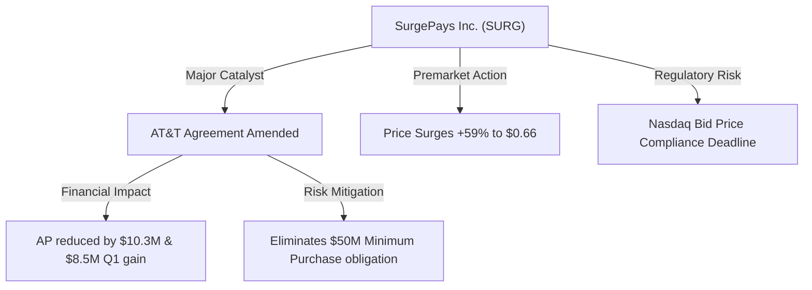
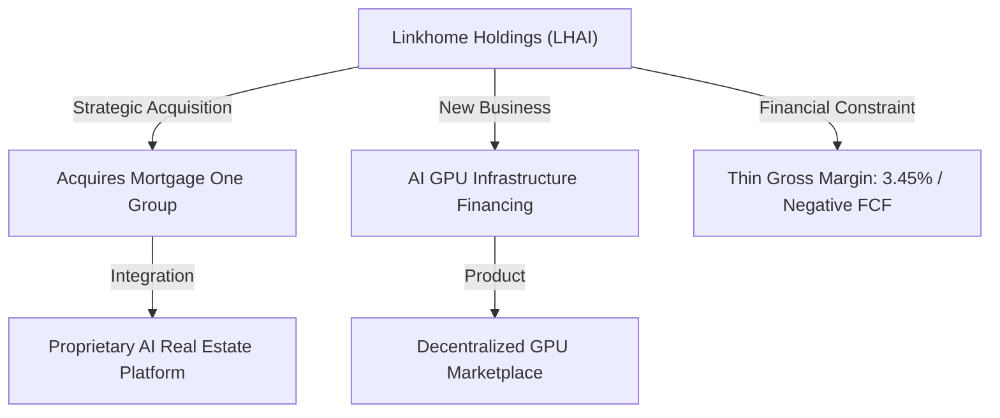
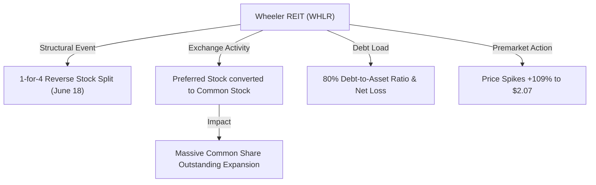
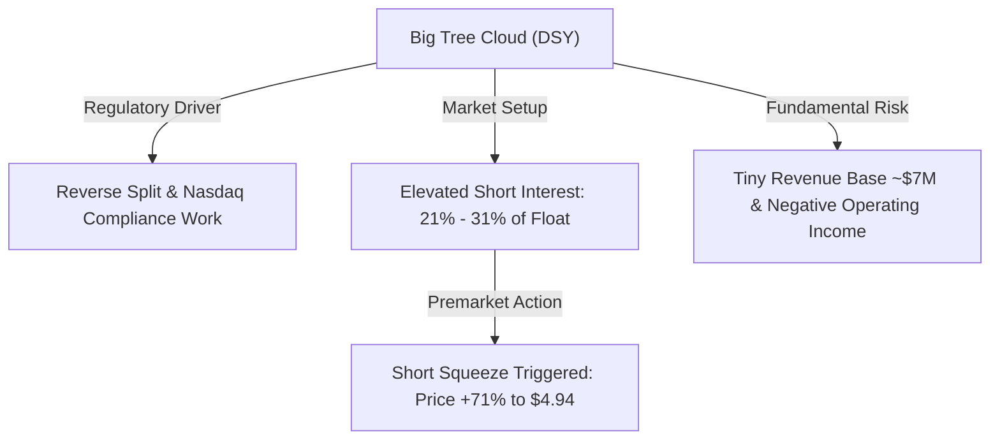
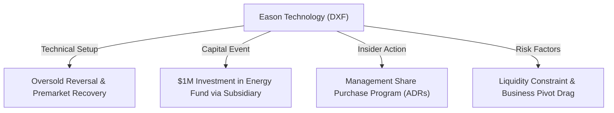

# 📊 Small-Cap & Penny Stock Intelligence Report
**Hedge Fund Trading Desk / Market Intelligence Division**  
**Date:** July 2, 2026  
**Market Stance:** High Volatility Speculation / Small-Cap Capital Restructuring / AI Financing & Wireless Catalyst

---

## 📈 Executive Summary

สภาวะตลาดกลุ่ม Small-Cap และ Micro-Cap/Penny Stocks ในช่วง Pre-Market ของวันที่ 2 กรกฎาคม 2026 มีความเคลื่อนไหวที่ตื่นตัวและผันผวนอย่างรุนแรง ท่ามกลางภาพรวมของตลาดสหรัฐฯ ที่กำลังรอคอยรายงานตัวเลขเงินเฟ้อและแรงสนับสนุนการจ้างงาน กลุ่ม Russell 2000 มีการหมุนเวียนกลุ่มเงินทุน (Sector Rotation) ที่น่าจับตา โดยเฉพาะในประเด็นการควบรวมและเข้าซื้อกิจการ (M&A) การปรับปรุงพันธมิตรเพื่อล้างหนี้สิน รวมถึงแรงซื้อเก็งกำไรในตลาดที่มีสภาพคล่องจำกัด (Low Float Setup) และสัดส่วนการชอร์ตสูง (Short Squeeze Candidates)

รายงานฉบับนี้ทำการวิเคราะห์เชิงลึก 5 หุ้นเด่นที่มีความเคลื่อนไหวทางราคา ปริมาณการซื้อขาย และประเด็นตัวเร่ง (Catalysts) ที่ผิดปกติ ณ ปัจจุบัน เพื่อมอบข้อมูลประกอบการประเมินทิศทางเก็งกำไรระยะสั้น-กลาง อย่างมืออาชีพและระมัดระวังสูงสุด

---

## 🔬 In-Depth Stock Analysis

### 1️⃣ SurgePays, Inc. (NASDAQ: SURG)
*Debt Restructuring & Wholesale Wireless Amendment Catalyst vs. Nasdaq Compliance Risks & Negative FCF*

#### **1. Company Overview**
*   **Sector / Industry:** Technology / Software – Infrastructure (Fintech & Telecom Solutions)
*   **Market Cap:** ~$13.1 Million USD (Micro-Cap)
*   **Current Price:** $0.66 (ราคา Pre-market วันที่ 2 กรกฎาคม 2026, ปรับตัวขึ้น ~59% จากราคาปิดก่อนหน้า)
*   **Average Volume (30D):** ~1.2 Million shares
*   **Float:** ~17.5 Million shares
*   **Short Float %:** ~4.20%
*   **Shares Outstanding:** ~19.84 Million shares
*   **Institutional Ownership:** ~7.50%
*   **Insider Ownership:** ~15.20%

#### **2. Price Action Analysis**
*   **Movement:** ราคาพุ่งดีดขึ้นรุนแรงในช่วงเช้า (Gap Up) ทะยานไปทดสอบแถว $0.66 บ่งบอกถึงการฟื้นตัวอย่างแข็งแกร่งหลังจากปรับฐานลงอย่างต่อเนื่องก่อนหน้านี้
*   **Microstructure:** หุ้นกำลังถูกไล่ราคาจากกลุ่มนักลงทุนเก็งกำไรระยะสั้นรอบแนวต้านจิตวิทยา $0.70 อย่างไรก็ตาม การขึ้นรอบนี้มีลักษณะการสะสมพลังระยะสั้น (Accumulation) เพื่อขจัดสภาวะ Oversold บนกราฟรายวัน
*   **Liquidity:** สภาพคล่องในช่วง Pre-market หนาแน่นขึ้นอย่างชัดเจน แต่อาจมีแรงขายกดราคาระหว่างวันจากผู้ถือหุ้นเดิมที่ต้องการตัดขาดทุนแถว $0.80

#### **3. Volume Analysis**
*   **Relative Volume (RVOL):** คาดการณ์พุ่งเกิน **10.x** เท่าของระดับการซื้อขายปกติ
*   **Volume Spike:** ปริมาณการซื้อขายใน Pre-market โดดเด่นอย่างชัดเจน เป็นปริมาณที่ไหลเข้ามาอย่างรวดเร็วหลังจากการเปิดเผยข่าวดีลสัญญา AT&T
*   **Smart Money Signal:** เป็นสัญญาณบวกจากผู้มีส่วนได้ส่วนเสียภายใน (Insiders) และนักลงทุนที่มองเห็นโอกาสการปลดล็อกหนี้สินของบริษัท สัญญาณหลักมาจากการเก็งกำไรตาม Catalyst ของกลุ่มสถาบันและรายย่อยควบคู่กัน

#### **4. News & Catalyst Analysis**
*   **AT&T Mobility Agreement Restructuring (July 1, 2026):**
    1.  **รายละเอียดปลดหนี้:** SURG บรรลุข้อตกลงแก้ไขสัญญากับ AT&T Mobility ในฐานะผู้ให้บริการโครงข่ายค้าส่งสัญญาณไร้สาย โดยทาง AT&T ตกลง**ยกเลิกภาระผูกพันซื้อขั้นต่ำมูลค่าสะสม $50 Million USD** ตลอดระยะเวลา 3 ปี ซึ่งเป็นตัวปลดล็อกความกังวลล้มละลายที่เคยปกคลุมงบการเงิน
    2.  **ผลกระทบทางบัญชี:** การแก้ไขนี้ช่วยปรับลดบัญชีเจ้าหนี้การค้า (Accounts Payable) ของ SURG ลงทันทีประมาณ **$10.3 Million USD** และจะบันทึกผลกำไรพิเศษย้อนหลังประมาณ **$8.5 Million USD** สำหรับไตรมาสสิ้นสุด 31 มีนาคม 2026
    3.  **การปรับตัวของโครงสร้างกำไร:** ข้อตกลงใหม่ลดต้นทุนการได้มาซึ่งสมาชิก และส่งเสริมเป้าหมายการเพิ่มอัตรากำไรจากการดำเนินงานในระยะปานกลาง

#### **5. Financial Health**
*   **Revenue Growth & Cash Burn:** ยอดขายเดิมชะลอตัวลงมากจากการยุติโครงการ ACP ของรัฐบาล และงบการเงิน Q1 2026 มีผลลัพธ์ย่ำแย่ (EPS -$0.51) อย่างไรก็ตาม ดีลล้างหนี้รอบนี้ช่วยเสริมความแข็งแกร่งให้งบดุลอย่างรวดเร็ว
*   **Dilution Risk:** **ระดับความเสี่ยงปานกลาง** จากการแก้ไขสัญญาลดเจ้าหนี้ช่วยบรรเทาความจำเป็นในการออกหุ้นเพิ่มทุน (Secondary Offering) เพื่อหาเงินสดฉุกเฉินได้ในระยะเวลา 6-12 เดือนข้างหน้า

#### **6. Market Sentiment**
*   **Retail Sentiment:** บอร์ดเทรดโซเชียลมีเดีย เช่น Stocktwits และ X มีกระแสพูดถึง SURG สูงขึ้นอย่างรวดเร็วในหมวด "Turnaround / Recovery Play"
*   **Speculative Level:** นักลงทุนส่วนใหญ่กำลัง "เชื่อเรื่องอนาคต" ว่านี่คือการจุดเริ่มต้นของการฟื้นฟูกิจการ แต่ยังมีแรงเก็งกำไรระยะสั้นเพื่อทำกำไรส่วนต่างรอบ $0.70-$0.80 สะสมอยู่

#### **7. Technical Analysis**
*   **Trend Structure:** โครงสร้างหลักยังคงเป็นแนวโน้มขาลง แต่การดีดตัวใน Pre-market ถือเป็นสัญญาณกลับตัวระยะสั้นเพื่อทวงคืนระดับเส้น EMA 50 วัน
*   **Indicators:** RSI ในกราฟรายวันดีดขึ้นจากแดน Oversold สู่ระดับ 48-50 ชี้ให้เห็นถึงโมเมนตัมขาขึ้นที่แข็งแกร่งชั่วคราว
*   **Support/Resistance:** แนวรับ: $0.41, $0.35 / แนวต้าน: $0.70, $0.85

#### **8. Risk Analysis & Rating**
*   **Risk Level: ความเสี่ยงระดับสูง (High Risk / High Opportunity)**
*   **Threats:** ความเสี่ยงด้านการรักษาระดับราคาปิดเหนือ $1.00 เพื่อรักษาสภาพจดทะเบียนใน Nasdaq (Nasdaq Bid Price Requirement) หากราคาลดลงต่ำกว่า $0.50 อีกครั้ง โอกาสเกิดการควบรวมหุ้นย้อนหลัง (Reverse Split) จะเพิ่มขึ้นอย่างเลี่ยงไม่ได้

---

### 2️⃣ Linkhome Holdings Inc. (NASDAQ: LHAI)
*AI Infrastructure GPU Financing & Mortgage Acquisition Execution vs. Low Free Cash Flow & Dilution Risk*

#### **1. Company Overview**
*   **Sector / Industry:** Real Estate / Real Estate Operations (AI-enabled Real Estate Operations & Tech Platform)
*   **Market Cap:** ~$28.7 Million USD (Micro-Cap)
*   **Current Price:** $1.77 (ราคา Pre-market วันที่ 2 กรกฎาคม 2026, หลังจากเคลื่อนไหวในกรอบสูงสุด $3.24 เมื่อวานและปิดตัวที่ $1.45)
*   **Average Volume (30D):** ~800,000 shares (แต่ในวันที่ 1 กรกฎาคม ปริมาณวอลุ่มพุ่งขึ้นสูงถึง 198 ล้านหุ้น)
*   **Float:** ~13.65 Million shares
*   **Short Float %:** ~0.50%
*   **Shares Outstanding:** ~16.23 Million shares
*   **Institutional Ownership:** ~0.80%
*   **Insider Ownership:** ~35.50%

#### **2. Price Action Analysis**
*   **Movement:** เมื่อวานนี้หุ้นสร้างการ Gap Up และวิ่งพุ่งไปกว่า 150% ขึ้นแตะ $3.24 ก่อนมีแรงขายกำไรและปิดกระดานที่ $1.45 ในช่วงเช้านี้เกิด Momentum Continuation ดันราคากลับขึ้นมาแถว $1.77 ใน Pre-market
*   **Microstructure:** หุ้นกำลังเผชิญแรงต่อสู้ในระดับจุลภาค (Intraday Battle) โครงสร้างราคาไม่มีความเสถียรเนื่องจาก Free Float ค่อนข้างเบาบางเมื่อเทียบกับความต้องการปริมาณซื้อขายที่ไหลเข้ามารวดเร็ว
*   **Signals:** พบสัญญาณการกระจายตัวของราคา (Distribution) ในโซนเหนือกว่า $2.50 แต่เริ่มมีแรงสะสมกลับ (Accumulation) ในเขตแนวรับสำคัญที่ $1.50

#### **3. Volume Analysis**
*   **Relative Volume (RVOL):** อัตราส่วนปริมาณการซื้อขายสูงกว่า **240x** เท่าของระดับปกติเมื่อวานนี้ และคาดว่าจะมีปริมาณซื้อขายสะสมเป็นอันดับต้นๆ ของวัน
*   **Volume Spike:** ยอดปริมาณซื้อขาย 198 ล้านหุ้นเมื่อวานนี้เป็นการหมุนรอบหุ้นที่สูงมาก บ่งชี้กิจกรรมเดย์เทรดดิ้งจากกลุ่มรายย่อย (Retail Momentum) อย่างรุนแรง
*   **Smart Money Signal:** เป็นการหมุนเงินเก็งกำไรระยะสั้น (Hot Money) ยังไม่มีสัญญาณการเข้าถือยาวจากสถาบันการเงินหลัก

#### **4. News & Catalyst Analysis**
*   **Mortgage One Group Acquisition & AI GPU Financing Launch (July 1, 2026):**
    1.  **ปิดดีลควบรวม:** LHAI ประกาศเสร็จสิ้นการเข้าซื้อกิจการ Mortgage One Group แบบ 100% เพื่อนำเทคโนโลยี AI ของตนเองมารวมกับฐานการปล่อยสินเชื่อที่อยู่อาศัยแบบดั้งเดิม
    2.  **เปิดตัวธุรกิจเอไอ:** การประกาศตัวก้าวเข้าสู่ธุรกิจ "AI Infrastructure Financing" เพื่อขยายสู่การปล่อยเงินกู้ให้แก่โครงการจัดหาเซิร์ฟเวอร์ GPU และจัดตั้งตลาดประมวลผล GPU แบบกระจายศูนย์ (Decentralized GPU Marketplace) เพื่อให้ผู้มีทรัพยากร GPU สามารถแบ่งปันแรงประมวลผลที่เหลืออยู่
    3.  **การเล่นตามกระแส:** ตลาดตอบรับเชิงบวกต่อการเชื่อมโยงกับธีม AI Infrastructure แต่ในระยะยาวยังคงต้องรอพิสูจน์ผลการดำเนินงานจริง

#### **5. Financial Health**
*   **Revenue Growth & Profitability:** ยอดรายได้หลักมีความอ่อนแอ อัตรากำไรขั้นต้น (Gross Margin) ต่ำมากเพียง **3.45%** และงบดุลขาดทุนอย่างต่อเนื่อง
*   **Cash Position & Runway:** **ระดับความเสี่ยงสูงมาก (High Dilution Risk)** บริษัทมีเงินสดคงเหลือเพียงประมาณ $3.5 Million USD ขณะที่มีกระแสเงินสดอิสระจากการดำเนินงานติดลบเฉลี่ย ~$3.3 Million USD ต่อไตรมาส ทำให้มีความเสี่ยงในการเสนอขายหุ้นเพิ่มทุน (Secondary Offering) ภายในระยะเวลาไม่กี่เดือนข้างหน้าสูงมากหากการจัดหาทุน GPU ล่าช้า

#### **6. Market Sentiment**
*   **Retail Sentiment:** ความต้องการซื้อของรายย่อยสูงมาก (High FOMO Level) จากกระแสในโซเชียลมีเดีย เช่น X และ Reddit
*   **Speculative Level:** การเก็งกำไรระยะสั้นเป็นประเด็นหลัก โดยนักลงทุนสนใจในธีมโครงสร้างพื้นฐาน AI มากกว่าความสมบูรณ์ทางการเงินระยะยาวของอสังหาริมทรัพย์ดั้งเดิม

#### **7. Technical Analysis**
*   **Trend Structure:** การทะลุผ่านแนวกดดันระยะยาวสะท้อนการเปลี่ยนโครงสร้างเทรนระยะสั้น หากสามารถรักษาระดับการย่อตัวเหนือ $1.50 จะเป็นการยืนยันความแข็งแกร่งของการกลับตัว
*   **Indicators:** RSI แตะระดับ 81 (Extreme Overbought) ก่อนจะเริ่มปรับฐานลงมา บ่งชี้ความจำเป็นในการพักตัวทางเทคนิค
*   **Support/Resistance:** แนวรับ: $1.50, $1.20 / แนวต้าน: $2.10, $2.60

#### **8. Risk Analysis & Rating**
*   **Risk Level: ความเสี่ยงระดับสูงมาก (Speculative / Financial Constraint)**
*   **Threats:** ความเสี่ยงในการใช้จ่ายเงินสดเกินกว่ากำหนด, ความไม่แน่นอนในการสร้างรายได้จากธุรกิจ GPU และความเสี่ยงในการออกตราสารทางการเงินมาไดลูทราคาหุ้นเพื่อหาเงินทุนรันโปรเจกต์ใหม่

---

### 3️⃣ Wheeler Real Estate Investment Trust, Inc. (NASDAQ: WHLR)
*Preferred-to-Common Dilution Restructuring & Post-Reverse Split Volatility vs. Stretched Debt Load & Liquidity Constraints*

#### **1. Company Overview**
*   **Sector / Industry:** Real Estate / REIT – Retail (Grocery-anchored retail properties)
*   **Market Cap:** ~$1.1 Million USD (Nano-Cap)
*   **Current Price:** $2.07 (ราคา Pre-market วันที่ 2 กรกฎาคม 2026, เพิ่มขึ้น 109.1% จากวันก่อนหน้า)
*   **Average Volume (30D):** ~350,000 shares
*   **Float:** ~260,000 shares (Low Float มาก)
*   **Short Float %:** ~5.12% - 42.93% (ผันผวนสูงจากการแปลงหุ้นชั่วคราว)
*   **Shares Outstanding:** ~549,000 shares
*   **Institutional Ownership:** ~2.50%
*   **Insider Ownership:** ~18.80%

#### **2. Price Action Analysis**
*   **Movement:** ราคาพุ่งดีดขึ้นรุนแรงใน Pre-market วันนี้กว่า 109% ทะลุระดับ $2.07 จากความเคลื่อนไหวทางกฎหมาย
*   **Microstructure:** ด้วยความที่เป็นหุ้นที่มี Float ต่ำมากในระดับหลักแสนหุ้น (Low Float) แรงซื้อเพียงเล็กน้อยสามารถสร้างการดีดตัวของราคาแบบรวดเร็วและทิ้งตัวลงรุนแรงได้ในเวลาเดียวกัน (High Volatility Level)
*   **Signals:** มีสัญญาณเก็งกำไรไร้ทิศทางและเสี่ยงต่อการเกิด Liquidity Trap หรือการขาดสภาพคล่องเฉียบพลันหลังตลาดเปิดปกติ

#### **3. Volume Analysis**
*   **Relative Volume (RVOL):** คาดการณ์พุ่งเกิน **8.x** เท่าในรอบเช้า
*   **Volume Spike:** เกิดการพุ่งตัวของปริมาณหุ้นหมุนเวียนในเซสชัน Pre-market จากความต้องการเก็งกำไรของบัญชีรายย่อยประเภท Momentum และการทำ Short Cover ชั่วคราว
*   **Smart Money Signal:** ไม่มีสัญญาณการเข้าถือครองของกองทุนประเภทสถาบันระยะยาว เนื่องจากสถานะทางการเงินไม่เป็นไปตามเกณฑ์ลงทุนขั้นต่ำ

#### **4. News & Catalyst Analysis**
*   **Preferred Stock Exchange SEC Filings (Form 424B3 & 8-K):**
    1.  **การลดสัดส่วนสิทธิ์ด้วยการแลกเปลี่ยน:** WHEELER มีการรายงานไฟลิ่งและข้อตกลงต่อเนื่องในการดึงให้ผู้ถือหุ้นบุริมสิทธิ (Preferred Stock) แลกเปลี่ยนใบหุ้นเป็นหุ้นสามัญ (Common Stock) เพื่อขจัดภาระดอกเบี้ยจ่ายและสะสมปันผลที่ค้างคา
    2.  **ผลกระทบเชิงราคา:** ในมุมบวกคือการเพิ่มขีดความสามารถการรอดพ้นปัญหาล้มละลายชั่วคราว แต่มุมลบคือการที่ปริมาณหุ้นสามัญในตลาดยังคงทยอยเพิ่มขึ้นและสร้างแรงกดดันการไดลูทต่อเนื่อง (Dilution Overhang)
    3.  **Reverse Split Follow-through:** การทำ 1-for-4 Reverse Stock Split เมื่อวันที่ 18 มิถุนายน 2026 ช่วยยกระดับราคาเหนือกณฑ์ขั้นต่ำ $1.00 ของ Nasdaq แต่ทำให้ระบบการคำนวณสัดส่วนชอร์ตและจำนวนหุ้นหมุนเวียนจริงของตลาดยังไม่นิ่ง

#### **5. Financial Health**
*   **Revenue & Capital Commitments:** ผลการดำเนินงานรายไตรมาสอยู่ในระดับขาดทุนต่อเนื่อง ธุรกิจค้าปลีกอสังหาริมทรัพย์มีปัญหาการสร้างรายได้สุทธิ
*   **Debt Level & Runway:** **ระดับความเสี่ยงสูงมากที่สุด (Extreme Risk)** อัตราส่วนหนี้สินต่อสินทรัพย์รวม (Debt-to-Total-Assets Ratio) สูงกว่า **80%** บริษัทยังคงต้องใช้แผนงานขายทรัพย์สินบางชิ้นและเจรจากลุ่มเจ้าหนี้เพื่อประคองลมหายใจ

#### **6. Market Sentiment**
*   **Retail Sentiment:** นักลงทุนรายย่อยมองตัวเลขเปอร์เซ็นต์บวกใน Pre-market และพยายามใช้จุดเด่นเรื่อง Low Float ในการสร้างประเด็นเก็งกำไรระยะสั้น
*   **Speculative Level:** การเก็งกำไรล้วนๆ (Pure Speculation) บนเงื่อนไขเทคนิคคอลและจำนวนหุ้นหมุนเวียนน้อย ไม่มีความเกี่ยวข้องกับแนวโน้มธุรกิจระยะยาว

#### **7. Technical Analysis**
*   **Trend Structure:** กราฟราคาหลัง Reverse Split ดิ่งลงไปสะสมพลังบริเวณจุดต่ำสุด การพุ่งขึ้นรอบนี้เผชิญแนวต้านสำคัญที่เส้น EMA 100 วันบริเวณ $2.20
*   **Indicators:** RSI ทะยานพ้นเขต Oversold ชี้ทิศทางกลับตัวระยะสั้นทางเทคนิค แต่มีความเสี่ยงสูงที่จะเผชิญแรงขายทำกำไรฉับพลัน (Mean Reversion Risk)
*   **Support/Resistance:** แนวรับ: $1.20, $0.90 / แนวต้าน: $2.20, $2.80

#### **8. Risk Analysis & Rating**
*   **Risk Level: ความเสี่ยงระดับสูงมากที่สุด (Extreme Risk / Potential Liquidity Trap)**
*   **Threats:** ความเสี่ยงในการเจอกลไกการไดลูทจากหุ้นสามัญใหม่ที่ถูกแปลงสภาพจากหุ้นบุริมสิทธิ, หนี้สินระดับสูงที่คุกคามการล้มละลาย หรือการถูกบังคับเจรจาปรับลดทุน

---

### 4️⃣ Big Tree Cloud Holdings Limited (NASDAQ: DSY)
*Nasdaq Compliance Adjustments & Elevated Short Float Squeeze Potential vs. Stretched Valuations & Cumulative Deficit*

#### **1. Company Overview**
*   **Sector / Industry:** Consumer Staples / Household & Personal Products (AI-enabled Personal Care Platform)
*   **Market Cap:** ~$23.5 Million USD (Micro-Cap)
*   **Current Price:** $4.94 (ราคา Pre-market วันที่ 2 กรกฎาคม 2026, เพิ่มขึ้น 71.3% จากวันก่อนหน้า)
*   **Average Volume (30D):** ~500,000 shares
*   **Float:** ~1.2 Million shares (หลังการควบรวมหุ้น)
*   **Short Float %:** **21.05% - 31.05%** (สัดส่วนการชอร์ตสูงมากเมื่อเทียบกับจำนวนหุ้นที่ซื้อขายได้จริง)
*   **Shares Outstanding:** ~4.75 Million shares
*   **Institutional Ownership:** ~1.20%
*   **Insider Ownership:** ~60% (ถือครองหนาแน่นโดยกลุ่มผู้บริหารและผู้ก่อตั้ง)

#### **2. Price Action Analysis**
*   **Movement:** ราคาหุ้นพุ่งขึ้น 71.3% ดีดขึ้นไปจ่อแนวต้านจิตวิทยาที่ $4.94 ใน Pre-market ของวันนี้จากแรงบีบซื้อคืน (Short Covering) ของกลุ่มที่ถือสถานะชอร์ต
*   **Microstructure:** โครงสร้างตลาดเกิดการต่อสู้ราคาที่ระดับแนวรับจิตวิทยา $3.00 แรงซื้อจากฝั่งรายย่อยสะสมเพื่อดักรับข่าวบวกเชิงโครงสร้างเริ่มกดดันกลุ่มชอร์ตเซลเลอร์ที่เข้าเทรดช่วงขาลงก่อนหน้า
*   **Signals:** เป็นการเก็งกำไรในสภาวะที่มีการชอร์ตหนาแน่น (Short Squeeze Action)

#### **3. Volume Analysis**
*   **Relative Volume (RVOL):** คาดการณ์พุ่งขึ้นสู่ระดับ **6.x** เท่าของระดับการซื้อขายเฉลี่ยปกติ
*   **Volume Spike:** มีแรงซื้อขายสะสมเพิ่มขึ้นอย่างต่อเนื่อง บ่งชี้กิจกรรมสะสมของกลุ่มเทรดเดอร์รายย่อยในย่านราคาต่ำเพื่อรองรับสภาวะบีบราคา
*   **Smart Money Signal:** ไม่มีสัญญาณการเข้าเก็บของกองทุนสถาบันระยะยาวขนาดใหญ่ มีเพียงกลุ่มเก็งกำไรความผันผวนสูงที่ผลัดกันเปลี่ยนสัญญาสถานะเทรด

#### **4. News & Catalyst Analysis**
*   **Nasdaq Compliance & Reverse Split Setup:**
    1.  **การรวมหุ้นเพื่อรักษาสถานะ (1-for-20 Share Consolidation):** บริษัทจำเป็นต้องผ่านกระบวนการรวมหุ้นเพื่อดึงราคาให้พ้นเกณฑ์ $1.00 ตามเงื่อนไขของ Nasdaq Capital Market
    2.  **ตัวเร่งปฏิกิริยาฝั่งลบ:** กลุ่มหมีชอร์ตเซลเลอร์เข้าเทรดอย่างหนักเนื่องจากฐานะการเงินของบริษัทมีตัวเลขสะสมขาดทุนสะสมค่อนข้างสูง (Accumulated Deficit) และรายได้หลักมีระดับต่ำ
    3.  **กลไกบีบซื้อคืน (Short Squeeze):** ปริมาณหุ้นที่สามารถหมุนเวียนขายได้ค่อนข้างจำกัดหลังจากการรวมหุ้น ประกอบกับสัดส่วนชอร์ตที่สูงถึง 21%-31% จึงทำให้เกิดภาวะ Short Squeeze เมื่อมีกระแสซื้อขายไล่ราคากลับขึ้นมา

#### **5. Financial Health**
*   **Revenue Growth & Capital Commitments:** ยอดขายรายปีอยู่ในระดับต่ำเพียงประมาณ **$7 Million USD** และผลประกอบการหลักเป็นขาดทุนจากการดำเนินงาน (Operating Loss)
*   **Cash Runway & Dilution Risk:** **ระดับความเสี่ยงสูง** ฐานะกระแสเงินสดในมือจำกัด หากการดำเนินงานใหม่ไม่เติบโตทันที การออกตราสารแปลงสิทธิ์เพิ่มทุน (Preferred Equity or Warrant Offering) เพื่อพยุงสภาพคล่องจะมีโอกาสเกิดขึ้นได้ตลอดเวลา

#### **6. Market Sentiment**
*   **Retail Sentiment:** ได้รับความร้อนแรงและเกิดสภาวะ FOMO อย่างชัดเจนในแพลตฟอร์มรายย่อย เนื่องจากหวังผลในสไตล์ Short Squeeze ดวลหมี
*   **Speculative Level:** เป็นการเก็งกำไรโครงสร้างราคาเทคนิคคอลและโมเมนตัมล้วนๆ (Pure Short Squeeze speculation)

#### **7. Technical Analysis**
*   **Trend Structure:** กราฟพยายามขยับผ่านเส้น EMA 50 วันขึ้นไปที่ระดับ $5.00 หากราคาปิดสามารถยืนฐานเหนือ $5.00 ได้ จะเปิดทางวิ่งต่อไปสู่ $5.80
*   **Indicators:** RSI ปรับขึ้นมาที่ 65 สะท้อนความตื่นตัวของแรงซื้อ แต่การทดสอบแนวต้าน $5.00 มีความเสี่ยงในการเผชิญ Pullback หากแรงซื้อรอบแรกหมดลง
*   **Support/Resistance:** แนวรับ: $3.00, $2.50 / แนวต้าน: $5.00, $5.80

#### **8. Risk Analysis & Rating**
*   **Risk Level: ความเสี่ยงระดับสูง (High Risk / Speculative)**
*   **Threats:** ความเสี่ยงในการเจอปริมาณหุ้นเพิ่มทุนล็อตใหม่เข้ามาแทรกแซง, ความผันผวนจากการเทขายกำไรของสถาบันที่กุมหุ้นราคาต่ำ และเสถียรภาพทางการเงินต่ำของธุรกิจ personal care

---

### 5️⃣ Eason Technology Limited (NASDAQ: DXF)
*Oversold Reversal & Technical Rebound Watch vs. Substantial Capital Constraints & China Real Estate Headwinds*

#### **1. Company Overview**
*   **Sector / Industry:** Financials / Credit Services (Pivoting to Digital Security & Energy Technology)
*   **Market Cap:** ~$1.85 Million USD (Nano-Cap)
*   **Current Price:** $0.6320 (ราคา Pre-market วันที่ 2 กรกฎาคม 2026, ดีดตัวกลับขึ้นจากยอดติดลบในเซสชันก่อนหน้า)
*   **Average Volume (30D):** ~200,000 shares
*   **Float:** ~3.05 Million shares
*   **Short Float %:** ~2.00%
*   **Shares Outstanding:** ~3.24 Million shares
*   **Institutional Ownership:** ~0.50%
*   **Insider Ownership:** ~45.00%

#### **2. Price Action Analysis**
*   **Movement:** ราคาใน Pre-market วันนี้มีลักษณะการฟื้นตัวทางเทคนิค (Technical Rebound) ขยับขึ้นมาที่ $0.6320 จากการสร้างฐานแถวแนวรับ $0.50
*   **Microstructure:** เนื่องจากหุ้นอยู่ในย่านราคาต่ำกว่า $1.00 และมีปริมาณซื้อขายเบาบาง การเคลื่อนไหวจึงสะท้อนแรงดักสะสมทางจิตวิทยา (Asset Play) มากกว่าแรงผลักดันเชิงโครงสร้างระยะยาว
*   **Signals:** พบสัญญาณการซื้อเพื่อทดสอบระดับฐาน (Accumulation Watch) ป้องกันการหลุดพ้นพื้นที่แนวรับสำคัญที่ $0.50

#### **3. Volume Analysis**
*   **Relative Volume (RVOL):** **1.8x**
*   **Volume Spike:** ปริมาณการซื้อขายในเซสชันนี้เพิ่มขึ้นปานกลาง สะท้อนว่ากระแสเงินลงทุนส่วนใหญ่ยังอยู่ในหุ้นยอดนิยมตัวอื่น แต่ก็เริ่มเห็นการดักรับจากฝั่งนักลงทุนสาย Reversal
*   **Smart Money Signal:** สัญญาณหลักมาจากการเคลื่อนไหวของอินไซเดอร์ (Insider Activity) ที่แสดงตัวตนเข้าพยุงราคาหุ้นของบริษัท

#### **4. News & Catalyst Analysis**
*   **Energy Fund Pivot & Insider Share Purchase Program:**
    1.  **การลุยตลาดพลังงาน:** ช่วงต้นเดือนมิถุนายน 2026 บริษัทจัดตั้งบริษัทย่อยชื่อ Four Ele Industrial Intelligent Tech และลงทุน **$1 Million USD** ในกองทุนพลังงานสะอาด เพื่อขยายขอบเขตการทำงานเข้าสู่พลังงานทดแทนและเทคโนโลยีอัจฉริยะ
    2.  **การสร้างความมั่นใจของอินไซเดอร์:** ไฟลิ่ง Form 3 เผยแผนการซื้อหุ้นของกรรมการและคณะผู้บริหารรวมจำนวน **32,800 ADRs** ในช่วงเดือนมิถุนายน บ่งบอกสัญญาณเชิงบวกว่าผู้นำองค์กรประเมินราคาหุ้นในระดับปัจจุบันเป็นราคาที่ต่ำเกินความเป็นจริง (Undervalued)

#### **5. Financial Health**
*   **Revenue Growth & Cash Burn:** งบการเงินโดยรวมมีความตึงตัวสูงเนื่องจากธุรกิจปล่อยสินเชื่อเดิมเผชิญผลกระทบเชิงลบจากภาคอสังหาริมทรัพย์จีน กระแสเงินสดมีฐานแคบและต้องพึ่งพาเงินทุนภายนอกเพื่อหล่อเลี้ยงการเปลี่ยนโครงสร้างธุรกิจใหม่
*   **Dilution Risk:** **ระดับความเสี่ยงสูง** การทำโครงการใหม่ยังต้องการงบ CapEx เพิ่มเติม ความเสี่ยงในการระดมทุนเสนอขายหุ้นล็อตใหม่ (Equity Financing) ยังคงสูงในรอบปีปฏิทินนี้

#### **6. Market Sentiment**
*   **Retail Sentiment:** ระดับความสนใจบนโซเชียลมีเดียต่ำ (Low Social Buzz) การเก็งกำไรขึ้นอยู่กับกลยุทธ์ส่วนบุคคลของกลุ่มเก็งกำไรมูลค่าต่ำสินทรัพย์
*   **Speculative Level:** นักลงทุนส่วนใหญ่เข้าเก็บเพื่อคาดหวังแรงสะท้อนกลับทางเทคนิค (Technical Rebound) มากกว่าจะเชื่อมั่นการเติบโตระยะยาวในอนาคตอันใกล้

#### **7. Technical Analysis**
*   **Trend Structure:** กราฟระดับวันพยายามปิดช่องว่างเพื่อประคองทิศทางเหนือแนวรับสำคัญที่ $0.50 การพุ่งทะลุเส้นแนวต้านย่อยที่ $0.65 จะปลดล็อกเป้าหมายไปสู่ $0.80
*   **Indicators:** RSI ขยับพ้นระดับต่ำสุดและชี้หัวขึ้นมาแถว 42 แสดงถึงการบรรเทาแรงขายเชิงระบบ
*   **Support/Resistance:** แนวรับ: $0.50, $0.42 / แนวต้าน: $0.65, $0.80

#### **8. Risk Analysis & Rating**
*   **Risk Level: ความเสี่ยงระดับสูงมาก (Speculative / Financial Instability)**
*   **Threats:** ความเสี่ยงในการติดกับดักสภาพคล่อง (Liquidity Trap), ความเสี่ยงจากการล่าช้าในการรับผลประโยชน์ของบริษัทย่อยใหม่ และระดับความมั่นคงทางการเงินต่ำของบริษัทโฮลดิ้งจีน

---

## 🎯 สรุปผลและคำแนะนำการลงทุน (Tactical Conclusion)

### 📊 ตารางเปรียบเทียบกลยุทธ์ 5 หุ้นเด่น (July 2, 2026)

| Ticker | ราคาปัจจุบัน | หมวดหมู่หลัก | ระดับความเสี่ยง | ตัวเร่งปฏิกิริยา (Key Catalyst) | กรณี Bullish (เป้าหมายระยะสั้น) | กรณี Bearish (จุดคัทลอส/รับลึก) |
| :---: | :---: | :--- | :---: | :--- | :--- | :--- |
| **SURG** | $0.66 | Turnaround / Telecom | **High Risk** | แก้ไขสัญญา AT&T ล้างหนี้ $50M และกำไรพิเศษ $8.5M | ดันผ่าน $0.70 เพื่อกลับขึ้นไปทวงคืนระดับ $0.85 | หลุดแนวรับสำคัญ $0.41 จะไหลลงหาแนว $0.35 |
| **LHAI** | $1.77 | AI Infrastructure / M&A | **Extreme Risk** | ดีลซื้อ Mortgage One และขยายสินเชื่อ GPU Financing | ราคายืนเหนือ $1.80 เพื่อขึ้นทดสอบเป้าหมาย $2.10 | หลุดระดับราคา $1.45 คาดการปรับฐานลงหาแนว $1.20 |
| **WHLR** | $2.07 | Low Float / Debt Exchange | **Extreme Risk** | ธุรกรรมแปลงหุ้นPreferred และผล Reverse Stock Split | ดันทะลุต้าน $2.20 มุ่งเป้าทดสอบระดับ $2.80 | หลุดแนวรับหลัก $1.20 มีโอกาสปรับตัวลดลงหา $0.90 |
| **DSY** | $4.94 | Short Squeeze / Wellness | **High Risk** | สัดส่วนการชอร์ตสูงถึง 21%-31% หลังการรวบหุ้น | ยืนเหนือแนวต้าน $5.00 เพื่อกระตุ้น Squeeze สู่ $5.80 | ปฏิเสธต้าน $5.00 แล้วหลุด $3.00 ลงไปหาแนว $2.50 |
| **DXF** | $0.6320 | Oversold Reversal / Insiders | **Extreme Risk** | การลงทุนกองทุนพลังงาน $1M และอินไซเดอร์เก็บหุ้น | ราคาผ่านด่านทดสอบ $0.65 เพื่อเป้าหมายถัดไป $0.80 | แรงขายกดดันหลุดฐานแนวรับสำคัญ $0.50 หา $0.42 |

---

### 💡 คำแนะนำทางเทคนิคสำหรับการวางแผนเทรด (Trading Guidelines)

1.  **การเทรดหุ้นที่มีธีมล้างหนี้ (SURG):** ถือเป็นกรณีฟื้นตัวที่ดีที่สุดในการเทรดวันนี้ เนื่องจากข่าวล้างเจ้าหนี้เป็นเรื่องของข้อเท็จจริงทางการเงินในงบดุล เทรดเดอร์ควรระมัดระวังแรงขายทำกำไรฉับพลันที่แนวต้าน $0.70 หากราคาสามารถยืนฐานมั่นคงในช่วงเปิดตลาดเซสชันปกติ จะเป็นสัญญาณเปิดรับสถานะช้อนซื้อสะสมเพื่อลุ้นราคาผ่านเป้าหมายแรก
2.  **การระวังกับดักสภาพคล่องและไดลูทในธีมร้อน (LHAI, WHLR):** ถึงแม้ LHAI จะควบรวมกิจการ Mortgage One และมีเรื่อง GPU Infrastructure เข้ามาเร่งความร้อนแรง แต่ด้วยอัตราการใช้เงินสดที่สูง ทำให้มีความเสี่ยงที่จะออกโครงการเพิ่มทุนมาทุบราคาระหว่างวัน ส่วน WHLR ปริมาณหุ้นจดทะเบียนมีน้อยมากทำให้ราคาเคลื่อนไหวบ้าคลั่งในกรอบกว้าง ห้ามตั้งคำสั่งซื้อแบบไล่ราคาปิด (Market Order chasing) เป็นอันขาด เนื่องจากสเปรดราคากว้างและอาจเสี่ยงติดสภาพคล่องทางเทคนิค
3.  **การเทรดสายบีบซื้อคืน (DSY):** จับตาระดับราคาเปิดหากผ่านระดับ $5.00 จะเป็นการกระตุ้นฝั่ง Short Cover ให้ออกมาซื้อคืน หุ้นประเภทนี้เน้นการตั้งจุดจำกัดขาดทุน (Stop Loss) อย่างเข้มงวดและห้ามถือครองข้ามสัปดาห์หากโมเมนตัมเริ่มหมดแรงส่ง

---

## 📣 สรุป Watchlist ประจำวัน

*   **Top Momentum:** **DSY** (มีโอกาสเกิดภาวะ Short Squeeze สูงสุดจากสัดส่วนชอร์ต % ที่สะสมค้างไว้)
*   **Top Risk:** **WHLR** (มีความเสี่ยงในการไดลูทจากการแปลงสภาพหุ้น Preferred และการแกว่งตัวจากสภาพคล่องต่ำพิเศษ)
*   **Top Volume:** **LHAI** (ปริมาณซื้อขายสะสมเมื่อวานนี้เกือบ 200 ล้านหุ้น และยังเป็นเป้าหมายเดย์เทรดดิ้งหลักวันนี้)
*   **Top Catalyst:** **SURG** (การปลดล็อคภาระหนี้ผูกพัน $50 ล้านดอลลาร์ และลดบัญชีเจ้าหนี้ลง $10.3 ล้านดอลลาร์)
*   **Top Speculative Play:** **DXF** (การดักสะสมหุ้นสาย Reversal จากแรงซื้อของผู้บริหารองค์กร)

### 🏆 จัดอันดับประจำเซสชันการเทรด
*   🥇 **หุ้นเด่นที่สุดของวัน:** **SURG** (ได้ประโยชน์สูงสุดจากปัจจัยพื้นฐานปลดแอกสัญญาหนี้สิน)
*   ⚠️ **หุ้นเสี่ยงที่สุดของวัน:** **WHLR** (ความผันผวนของ Low Float ในระดับหลักแสนหุ้นอาจทำให้พอร์ตเสียหายรวดเร็วหากเทรดผิดทิศทาง)
*   👀 **หุ้นที่ตลาดจับตาที่สุดของวัน:** **LHAI** (การขยายตัวเข้าสู่ GPU Financing ของอสังหาฯ และมีแรงซื้อหนุนปริมาณวอลุ่มมหาศาล)

---

## 🌐 แหล่งข้อมูลอ้างอิง (Sources)

*   **SurgePays, Inc. (SURG):**
    *   [SEC Form 8-K - Wholesale Wireless Agreement Amendment (AT&T Mobility)](https://www.sec.gov/edgar/searchedgar/companysearch)
    *   [SurgePays Investor Relations Press Release - Restructuring Agreement](https://surgepays.com/investors/)
*   **Linkhome Holdings Inc. (LHAI):**
    *   [SEC Form 8-K - Mortgage One Group Acquisition Completion](https://www.sec.gov/edgar/searchedgar/companysearch)
    *   [Linkhome Holdings Press Release - Launch of GPU Infrastructure Financing](http://www.linkhome.co/investors)
*   **Wheeler Real Estate Investment Trust, Inc. (WHLR):**
    *   [SEC Form 424B3 - Share Registration & Exchange Agreement Details](https://www.sec.gov/edgar/searchedgar/companysearch)
    *   [Wheeler REIT Press Release - Capital Restructuring Transactions](https://www.whlr.us/)
*   **Big Tree Cloud Holdings Limited (DSY):**
    *   [Nasdaq Compliance Directory - Market Value and Bid Price Regs](https://listingcenter.nasdaq.com/)
    *   [Big Tree Cloud Investor Relations Portal](http://www.bigtreecloud.com)
*   **Eason Technology Limited (DXF):**
    *   [SEC Form 6-K - Energy Fund Investment & Subsidiary Establishment](https://www.sec.gov/edgar/searchedgar/companysearch)
    *   [SEC Form 3 / Insider Transaction reports (June purchases)](https://www.sec.gov/edgar/searchedgar/companysearch)

---
*คำเตือน: รายงานฉบับนี้จัดทำขึ้นเพื่อวัตถุประสงค์ในการให้ข้อมูลเชิงวิเคราะห์ประกอบการประเมินทิศทางเก็งกำไรเท่านั้น การลงทุนในตราสารทุนและหุ้นสหรัฐฯ ขนาดเล็ก (Small-Cap / Penny Stocks) มีความเสี่ยงสูงมาก ผู้ลงทุนควรจัดสรรสัดส่วนเงินทุน บริหารขนาดสถานะ (Position Sizing) และกำหนดจุดตัดขาดทุน (Stop Loss) อย่างเข้มงวดในทุกแผนการลงทุน*
