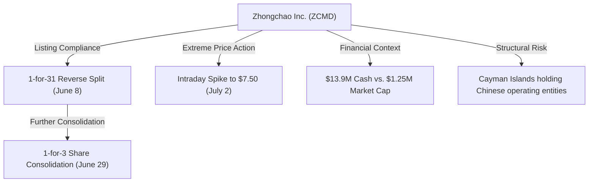
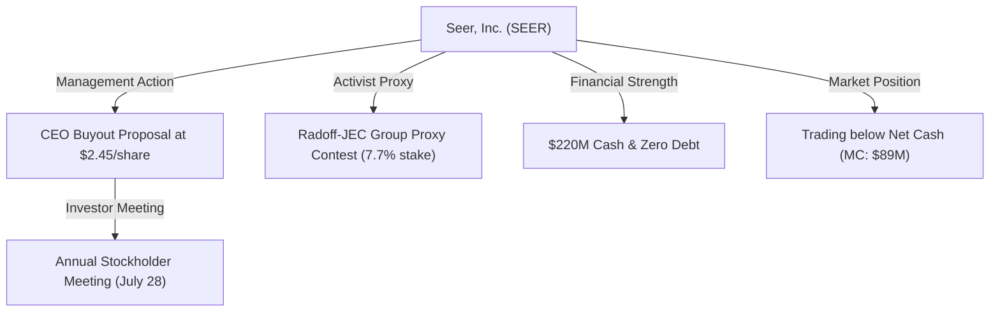
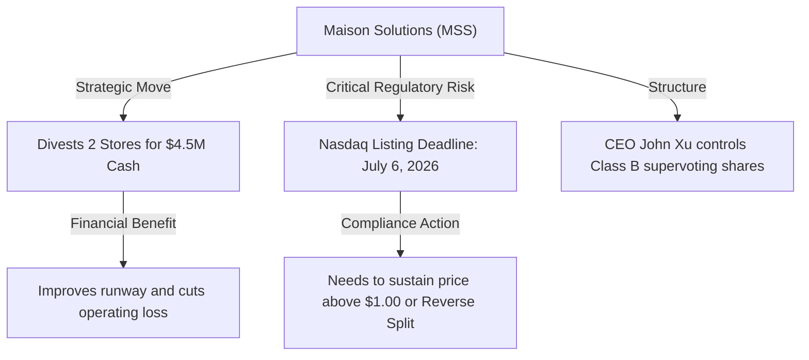
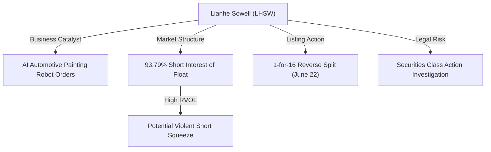
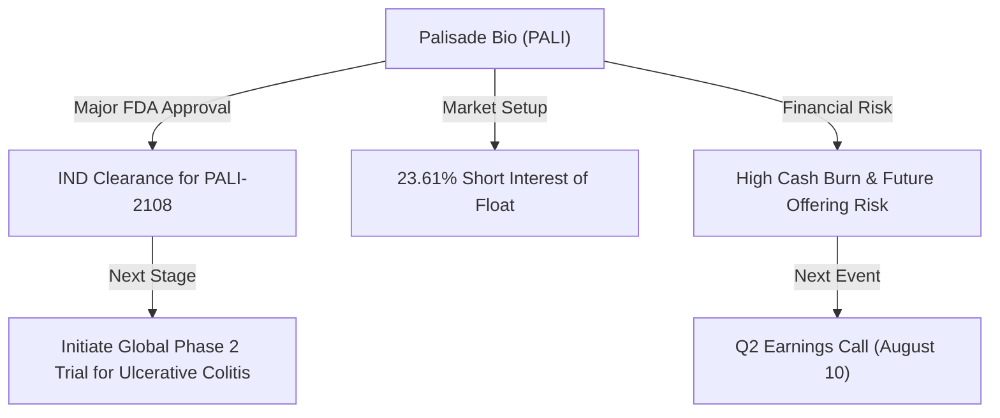

# 📊 Small-Cap & Penny Stock Intelligence Report
**Hedge Fund Trading Desk / Market Intelligence Division**  
**Date:** July 6, 2026  
**Market Stance:** High Volatility Speculation / Small-Cap Listing Compliance / Short Squeeze Coiling & Biotech Phase 2 Catalyst

---

## 📈 Executive Summary

สภาวะตลาดกลุ่ม Small-Cap และ Micro-Cap/Penny Stocks ในช่วง Pre-Market ของวันที่ 6 กรกฎาคม 2026 มีความเคลื่อนไหวที่น่าจับตามองอย่างยิ่ง ภายหลังการรายงานตัวเลขการจ้างงานนอกภาคเกษตร (Nonfarm Payrolls) ของสหรัฐฯ สำหรับเดือนมิถุนายนที่เพิ่มขึ้นเพียง 57,000 ตำแหน่ง ซึ่งต่ำกว่าที่ตลาดคาดการณ์ไว้ที่ 117,000 ตำแหน่งอย่างมาก การระบายความร้อนของตลาดแรงงานนี้ส่งผลให้ผลตอบแทนพันธบัตรรัฐบาลสหรัฐฯ อ่อนตัวลง และกระตุ้นความหวังของนักลงทุนว่าธนาคารกลางสหรัฐฯ (Fed) อาจพิจารณาปรับลดอัตราดอกเบี้ยได้เร็วกว่าคาด

ในตลาดหุ้นขนาดเล็ก (Russell 2000) เกิดกระแสการหมุนเวียนเงินทุน (Sector Rotation) เข้าหาหุ้นที่มีศักยภาพเฉพาะตัว (Alpha Catalysts) โดยเฉพาะหุ้นกลุ่มที่มีราคาต่ำกว่า $5 ที่กำลังเร่งดำเนินการเพื่อรักษาสถานะการจดทะเบียนใน Nasdaq (Listing Compliance), ดีลเสนอซื้อกิจการโดยผู้บริหาร (Management Buyout), การขายสินทรัพย์เพื่อสร้างสภาพคล่อง (Asset Divestitures), และหุ้นกลุ่มเทคโนโลยีและชีวเภสัชภัณฑ์ (Biotech) ที่มีสัดส่วนการชอร์ตสูง (Short Squeeze & Gamma Squeeze Candidates)

รายงานฉบับนี้วิเคราะห์เจาะลึก 5 หุ้นเด่นที่มีความเคลื่อนไหวทางราคา ปริมาณการซื้อขาย และปัจจัยตัวเร่งที่ผิดปกติ ณ วันนี้ เพื่อเป็นข้อมูลประกอบการวางแผนการลงทุนอย่างระมัดระวังสูงสุด

---

## 🔬 In-Depth Stock Analysis

### 1️⃣ Zhongchao Inc. (NASDAQ: ZCMD)
*Reverse Split Compliance & Extreme Volatility Breakout vs. Offshore Cayman Shell Structure & Chronic Net Loss*

#### **1. Company Overview**
*   **Sector / Industry:** Healthcare / Health Information Services
*   **Market Cap:** ~$1.25 Million USD (Micro-Cap)
*   **Current Price:** $3.46 (ปิดตลาดล่าสุด ณ วันที่ 2 กรกฎาคม 2026)
*   **Average Volume (30D):** ~5.66 Million shares
*   **Float:** ~1.20 Million shares
*   **Short Float %:** ~0.54% of Outstanding Shares
*   **Shares Outstanding:** ~3.60 Million shares
*   **Institutional Ownership:** ~2.0%
*   **Insider Ownership:** ~35.0%

#### **2. Price Action Analysis**
*   **Movement:** ราคามีความผันผวนระดับสุดขั้ว (Extreme Volatility) โดยในการซื้อขายล่าสุดราคาพุ่งขึ้นไปแตะจุดสูงสุดที่ $7.50 ก่อนจะถูกเทขายทำกำไรลดลงมาปิดที่ $3.46 ในปัจจุบัน
*   **Microstructure:** หุ้นกำลังเผชิญหน้ากับการเก็งกำไรอย่างหนักหลังพ้นกระบวนการควบรวมหุ้น การปรับลดสัดส่วนของจํานวนหุ้นหมุนเวียนทำให้ราคาเคลื่อนไหวได้รวดเร็ว มีลักษณะการสะสมพลังระยะสั้นแบบสะบัดแรง (Volatility Breakout)
*   **Liquidity:** สภาพคล่องเบาบางและแกว่งตัวกว้าง (Wide Bid-Ask Spread) เสี่ยงต่อการเกิด Liquidity Trap หากเข้าซื้อในจังหวะไล่ราคา

#### **3. Volume Analysis**
*   **Relative Volume (RVOL):** อยู่ที่ประมาณ **4.2x** เท่าของวอลุ่มเฉลี่ยปกติ โดยปริมาณการซื้อขายพุ่งสูงถึง **23.98 ล้านหุ้น** ในวันที่มีการดีดตัว
*   **Volume Spike:** การเพิ่มขึ้นของวอลุ่มเกิดขึ้นอย่างกะทันหันหลังจบการทำดีลรวมหุ้นเพื่อรักษามาตรฐานการเป็นบริษัทจดทะเบียน
*   **Smart Money Signal:** สัญญาณส่วนใหญ่เป็นของกลุ่มนักเก็งกำไรรายย่อย (Retail Day Traders) ร่วมกับกลุ่มทำราคาอัลกอริทึม (High-Frequency Trading) ไม่พบสัญญาณการเก็บหุ้นระยะยาวของสถาบัน

#### **4. News & Catalyst Analysis**
*   **Nasdaq Listing Compliance Execution:**
    1.  **การปรับโครงสร้างหุ้นสะสม:** บริษัทต้องทำ 1-for-31 Reverse Stock Split เมื่อวันที่ 8 มิถุนายน 2026 และตามด้วย 1-for-3 Share Consolidation ในวันที่ 29 มิถุนายน 2026 เพื่อผลักดันให้ราคาหุ้นยืนเหนือเกณฑ์ขั้นต่ำ $1.00 ของ Nasdaq
    2.  **ผลกระทบของสัญญาสิทธิ:** ปริมาณหุ้นจดทะเบียนลดลงอย่างมีนัยสำคัญ ส่งผลให้แรงซื้อเพียงเล็กน้อยสามารถดันราคาให้พุ่งขึ้นได้ในระยะสั้น (Low-Float Spike Effect)

#### **5. Financial Health**
*   **Revenue Growth & Cash position:** ZCMD รายงานว่ามีเงินสดและเงินลงทุนระยะสั้นรวมประมาณ **$13.9 Million USD** ซึ่งสูงกว่ามูลค่าบริษัท (Market Cap) ที่ $1.25 Million ในปัจจุบันอย่างมาก อย่างไรก็ตาม บริษัทยังมีผลการดำเนินงานขาดทุนเรื้อรัง (TTM EPS -0.02)
*   **Dilution Risk:** **ระดับความเสี่ยงปานกลางถึงสูง** แม้ว่าจะมีเงินสดในมือเพียงพอที่จะประคองตัว แต่เนื่องจากการขาดทุนและการดำเนินงานผ่านโครงสร้าง VIE (Variable Interest Entity) ในประเทศจีน ทำให้นักลงทุนทั่วไปเข้าถึงสินทรัพย์ที่แท้จริงได้ยาก

#### **6. Market Sentiment**
*   **Retail Sentiment:** มีกระแสพูดถึงและสแกนเจอในหมวด "Low Float Gainers" บน Reddit และ Stocktwits
*   **Speculative Level:** การเก็งกำไรระยะสั้น 100% นักลงทุนไม่ได้คาดหวังเรื่องผลประกอบการ แต่เล่นตามโมเมนตัมและทิศทางราคาทางเทคนิคเพื่อหวังส่วนต่างราคาข้ามคืน

#### **7. Technical Analysis**
*   **Trend Structure:** กราฟหลักยังคงเป็นขาลงยาวนาน แต่เกิดสัญญาณฟื้นตัวฉับพลัน (Mean Reversion Spike)
*   **Indicators:** RSI รายวันพุ่งแตะระดับ 65 ชี้ถึงภาวะแรงซื้อเกินชั่วคราว ราคาเคลื่อนไหวอยู่เหนือระดับ VWAP แต่มีแรงต้านจิตวิทยาที่ $4.50 และ $7.50
*   **Support/Resistance:** แนวรับ: $2.50, $1.80 / แนวต้าน: $4.50, $7.50

#### **8. Risk Analysis & Rating**
*   **Risk Level: ความเสี่ยงสูงมาก (Extremely High Risk)**
*   **Threats:** ความเสี่ยงจากการถูกเทขายอย่างรุนแรงแบบ Pump & Dump เนื่องจากโครงสร้างพื้นฐานยังไม่ฟื้นตัว และมีความเสี่ยงเฉพาะของหุ้นจีน (China Regulatory & Delisting Overhang)

---

### 2️⃣ Seer, Inc. (NASDAQ: SEER)
*Management Unsolicited Buyout Proposal @ $2.45 & Activist Proxy Battle vs. Long-term Unprofitability*

#### **1. Company Overview**
*   **Sector / Industry:** Healthcare / Biotechnology (Life Sciences Tools & Diagnostics)
*   **Market Cap:** ~$89.07 Million USD
*   **Current Price:** $2.08 (ราคาอ้างอิง ณ ปัจจุบัน)
*   **Average Volume (30D):** ~1.50 Million shares
*   **Float:** ~38.0 Million shares
*   **Short Float %:** ~0.39%
*   **Shares Outstanding:** ~55.0 Million shares
*   **Institutional Ownership:** ~43.0%
*   **Insider Ownership:** ~25.0%

#### **2. Price Action Analysis**
*   **Movement:** ราคาหุ้นพุ่งขึ้นกว่า 30% ในช่วงต้นเดือนกรกฎาคม จากแรงหนุนของข่าวเสนอซื้อกิจการ ปัจจุบันทรงตัวอยู่ที่บริเวณ $2.08 
*   **Microstructure:** เกิดการสร้างฐานราคาใหม่ที่ยกตัวขึ้นอย่างแข็งแกร่ง (Accumulation Zone) มีกรอบแนวรับสำคัญบริเวณ $1.80 และกำลังทดสอบเพดานเสนอซื้อที่ $2.45
*   **Liquidity:** สภาพคล่องการซื้อขายหนาแน่นขึ้นอย่างชัดเจนจากการที่นักลงทุนสถาบันและกองทุนอาบิทราจ (Arbitrageurs) เข้ามาซื้อเก็บเพื่อทำกำไรส่วนต่าง

#### **3. Volume Analysis**
*   **Relative Volume (RVOL):** สูงกว่าค่าเฉลี่ยประมาณ **3.5x** เท่า
*   **Volume Spike:** วอลุ่มเริ่มไหลเข้ามาหนาแน่นหลังจากการเปิดเผยเอกสาร SEC Filing เกี่ยวกับการเสนอซื้อนอกตกลง (Unsolicited Buyout Proposal)
*   **Smart Money Signal:** พบสัญญาณการสะสมหุ้นอย่างชัดเจนจากกลุ่มสถาบันการเงินที่ถือหุ้นเดิม โดยมีสัดส่วนการถือครองสถาบันรวมถึง 43% เช่น Softbank Group และ Vanguard

#### **4. News & Catalyst Analysis**
*   **CEO Buyout Proposal & Activist Proxy Contest:**
    1.  **ข้อเสนอซื้อกิจการ:** เมื่อวันที่ 2 กรกฎาคม 2026 ประธานและประธานเจ้าหน้าที่บริหาร (CEO) Omid Farokhzad เสนอซื้อหุ้น Class A ที่เหลือทั้งหมดในราคา **$2.45 ต่อหุ้น** เป็นเงินสด พร้อมรับสิทธิ์รับผลประโยชน์ตามเกณฑ์สัญญาทีหลัง (Contingent Value Rights)
    2.  **การเคลื่อนไหวของกลุ่มผู้ถือหุ้นใหญ่:** Radoff-JEC Group ซึ่งถือหุ้นประมาณ 7.7% กำลังดำเนินการทำศึกชิงคะแนนโหวต (Proxy Contest) เพื่อผลักดันตัวแทนเข้าสู่นั่งเก้าอี้กรรมการในการประชุมผู้ถือหุ้นประจำปีวันที่ 28 กรกฎาคม 2026 เพื่อกดดันให้เปิดเผยข้อมูลมูลค่าที่แท้จริง

#### **5. Financial Health**
*   **Revenue Growth & Cash position:** งบดุลมีความแข็งแกร่งระดับดีเลิศ มี**เงินสดสำรองสูงถึง $220 Million USD และไม่มีหนี้สินระยะยาว** เมื่อเทียบกับมูลค่าบริษัทปัจจุบันที่ $89 Million เท่ากับบริษัทกำลังซื้อขายต่ำกว่ามูลค่าเงินสดสุทธิ (Trading Below Cash Value)
*   **Dilution Risk:** **ความเสี่ยงต่ำมาก** ในช่วง 12-24 เดือนข้างหน้า เนื่องจากบริษัทยังมีวงเงินเหลือในโครงการซื้อหุ้นคืน (Share Repurchase) อีกกว่า $25.5 Million และมีอัตราการเผาเงิน (Cash Burn) ที่ลดลงกว่า 36% ตั้งแต่ปี 2022

#### **6. Market Sentiment**
*   **Retail Sentiment:** นักลงทุนรายย่อยแสดงความเห็นเชิงบวกอย่างมาก (Bullish Bias) เนื่องจากมองว่าราคาเสนอซื้อที่ $2.45 เป็นฐานล่าง (Floor Price) ที่จำกัดการปรับตัวลดลง (Downside) ของราคาหุ้น
*   **Speculative Level:** การเก็งกำไรเปลี่ยนผ่านไปสู่การเก็งกำไรเชิงกลยุทธ์ควบรวมกิจการ (M&A Arbitrage Play) นักลงทุนกำลังจับตามองว่าอาจมีการปรับเพิ่มราคาเสนอซื้อเพื่อให้สอดคล้องกับมูลค่าเงินสดสุทธิของบริษัท

#### **7. Technical Analysis**
*   **Trend Structure:** พลิกตัวกลับมาเป็นแนวโน้มขาขึ้นระยะสั้น (Short-term Bullish Trend) ราคาเบรกเอาท์ผ่านเส้นค่าเฉลี่ย EMA 50 และทดสอบแนวต้านสำคัญ
*   **Indicators:** RSI พุ่งขึ้นแตะระดับ 58 ชี้ว่ามีโมเมนตัมประคองขึ้นอย่างต่อเนื่อง โดยมีแนวรับแข็งแกร่งบริเวณเส้นจิตวิทยา $1.80
*   **Support/Resistance:** แนวรับ: $1.80, $1.65 / แนวต้าน: $2.45, $2.75

#### **8. Risk Analysis & Rating**
*   **Risk Level: ความเสี่ยงระดับปานกลาง (Medium Risk)**
*   **Threats:** ความเสี่ยงเดียวที่สำคัญคือ หากคณะกรรมการอิสระ (Special Committee) ปฏิเสธข้อเสนอซื้อกิจการ และ CEO ถอนข้อเสนอออกไปโดยไม่มีข้อเสนอจากกลุ่มอื่นเข้ามาทดแทน ราคาหุ้นอาจถอยกลับไปสู่จุดต่ำสุดเดิมรอบ $1.50

---

### 3️⃣ Maison Solutions Inc. (NASDAQ: MSS)
*Asset Divestiture for Cash vs. Nasdaq Minimum Bid Price Delisting Deadline (July 6, 2026)*

#### **1. Company Overview**
*   **Sector / Industry:** Consumer Defensive / Grocery Stores (Food Retail)
*   **Market Cap:** ~$3.08 Million USD
*   **Current Price:** $0.73 (ราคาเฉลี่ยปัจจุบัน)
*   **Average Volume (30D):** ~300,000 shares
*   **Float:** ~2.23 Million shares
*   **Short Float %:** ~9.42% of Float
*   **Shares Outstanding:** ~4.15 Million shares
*   **Institutional Ownership:** ~38.0%
*   **Insider Ownership:** ~40.0% (CEO John Xu ควบคุมคะแนนเสียงเบ็ดเสร็จผ่านหุ้น Class B)

#### **2. Price Action Analysis**
*   **Movement:** ราคาหุ้นแกว่งตัว in the range of $0.70 - $0.75 หลังการประกาศข่าวดีลขายร้านค้า ปรับเพิ่มขึ้น ~16% ในช่วงนอกเวลาทำการ
*   **Microstructure:** หุ้นกำลังถูกบีบด้วยเวลาในเรื่องกฎเกณฑ์ตลาด มีแรงเก็งกำไรระยะสั้นเข้ามาเก็บในกรอบรับ $0.65 อย่างไรก็ตาม มีแรงเทขายกดดันจากกลุ่มที่กังวลเรื่องการหลุดจากตลาด (Delisting Risk)
*   **Liquidity:** สภาพคล่องค่อนข้างต่ำมาก หุ้นเคลื่อนไหวเป็นช่วงกว้าง เหมาะสำหรับนักลงทุนที่มีเป้าหมายในการเล่นระยะสั้นแบบด่วนเท่านั้น

#### **3. Volume Analysis**
*   **Relative Volume (RVOL):** มีการปรับเพิ่มขึ้นพุ่งแตะระดับ **3.8x** เท่าในรอบสัปดาห์
*   **Volume Spike:** วอลุ่มดีดขึ้นมาหลังจากการแจ้งความคืบหน้าเรื่องการขายร้านค้าเพื่อแลกเงินสดเพื่อเข้ากระเป๋าบริษัท
*   **Smart Money Signal:** สัญญาณส่วนใหญ่เป็นของกลุ่มนักเก็งกำไรในสโมสรย่อย (Micro-Cap Trading Group) ไม่มีสัญญาณสะสมจากสถาบันการเงินขนาดใหญ่

#### **4. News & Catalyst Analysis**
*   **Asset Sale & Nasdaq Compliance Deadline:**
    1.  **การปรับสมดุลร้านค้า:** เมื่อวันที่ 3 กรกฎาคม 2026 MSS แจ้งข้อตกลงขายสินทรัพย์และสัญญาดำเนินงานของร้านค้าสาขา San Gabriel และ Monrovia เพื่อรับเงินสดจำนวน **$4.5 Million USD** คาดว่าจะปิดดีลภายในสิ้นปีนี้ ซึ่งจะช่วยตัดภาระขาดทุนจากการดำเนินงานร้านที่ไม่มีกำไร
    2.  **เส้นตายจาก Nasdaq:** วันที่ **6 กรกฎาคม 2026** (วันนี้) คือวันสิ้นสุดระยะเวลาผ่อนผัน 180 วันในการทำราคาปิดให้สูงกว่า $1.00 ของ Nasdaq ทำให้บริษัทจำเป็นต้องพิจารณาแผนควบรวมหุ้นย้อนหลัง (Reverse Split) หรือยื่นขอผ่อนผันเพิ่มในวันนี้ทันที

#### **5. Financial Health**
*   **Revenue Growth & Cash Burn:** บริษัทประสบปัญหาขาดทุนสุทธิอย่างหนัก โดยมีอัตราส่วนกำไรสุทธิติดลบสะสมและ EPS (TTM) อยู่ที่ -$5.09 การได้รับเงินสด $4.5 ล้านจากการขายร้านค้าช่วยเพิ่มศักยภาพกระแสเงินสดระยะสั้น (Runway) ได้อย่างสำคัญ
*   **Dilution Risk:** **ระดับความเสี่ยงสูง** แม้จะมีเงินสดจากการขายร้านเข้ามาประคอง แต่ความจำเป็นในการหาแหล่งเงินทุนเสริมเพื่อดำเนินธุรกิจหลักและขยายแพลตฟอร์มเทคโนโลยียังมีอยู่สูง

#### **6. Market Sentiment**
*   **Retail Sentiment:** นักลงทุนรายย่อยแสดงความตื่นตระหนกปนเก็งกำไร (Anxiety Speculation) เนื่องจากประเด็นเรื่องการถูกถอดถอนออกจากตลาด (Delisting)
*   **Speculative Level:** การเก็งกำไรระยะสั้นระดับสูงมาก (Highly Speculative) เนื่องจากเป็นการเล่นเดิมพันกับผลการประกาศแนวทางการแก้ปัญหาราคาหุ้นของ Nasdaq ในระยะเวลาอันใกล้

#### **7. Technical Analysis**
*   **Trend Structure:** แนวโน้มหลักเป็นขาลงยาวนานและเทรดอยู่ใต้เส้นค่าเฉลี่ย EMA 50 และ EMA 200 รายวันอย่างชัดเจน
*   **Indicators:** RSI รายวันอยู่ในระดับต่ำที่ 42 บ่งชี้ถึงภาวะอ่อนแอเชิงโครงสร้างจนกว่าราคาจะสามารถเบรกทะลุและยืนเหนือ $1.00 ได้อย่างมั่นคง
*   **Support/Resistance:** แนวรับ: $0.65, $0.50 / แนวต้าน: $0.90, $1.05

#### **8. Risk Analysis & Rating**
*   **Risk Level: ความเสี่ยงสูงมาก (Extremely High Risk)**
*   **Threats:** ความเสี่ยงสูงมากจากการถูกลงโทษหลุดจากตลาด Nasdaq (Delisting) หรือการประกาศทำ Reverse Split ที่อาจเกิดขึ้นได้ทันทีเพื่อหนีเกณฑ์ $1.00

---

### 4️⃣ Lianhe Sowell International Group Ltd. (NASDAQ: LHSW)
*AI Robot Sales Orders & Extreme Short Float (93.79%) vs. Dual-Class Vote Control & Class Action Litigation*

#### **1. Company Overview**
*   **Sector / Industry:** Technology / Software - Infrastructure (Machine Vision & AI Solutions)
*   **Market Cap:** ~$6.0 Million USD
*   **Current Price:** $1.80 (ราคาเฉลี่ยปัจจุบัน)
*   **Average Volume (30D):** ~1.20 Million shares
*   **Float:** ~361,000 shares
*   **Short Float %:** **93.79%** of Float (ระดับวิกฤตชอร์ต)
*   **Shares Outstanding:** ~3.25 Million Class A shares
*   **Institutional Ownership:** ~5.0%
*   **Insider Ownership:** ~50.0% (โครงสร้างสิทธิ์สองชั้น Class A/B)

#### **2. Price Action Analysis**
*   **Movement:** ราคาดีดตัวขึ้นแรงหลังกระบวนการทำ 1-for-16 Reverse Split เมื่อปลายเดือนมิถุนายน โดยมีการแกว่งตัวกว้างในกรอบ $1.69 - $1.83 ในช่วงวันเปิดตลาดล่าสุด
*   **Microstructure:** หุ้นเข้าข่าย **"สปริงแรงบีบสูง" (High Squeeze Coiling)** เนื่องจากจำนวนหุ้นหมุนเวียน (Float) ในตลาดมีปริมาณที่เล็กมากเพียง 3.6 แสนหุ้น ส่งผลให้ปริมาณความต้องการซื้อเพียงนิดเดียวสามารถจุดชนวนการพุ่งขึ้นของราคาได้รวดเร็ว
*   **Liquidity:** ความหนาแน่นของสภาพคล่องอยู่ในเกณฑ์ระดับปานกลางเนื่องจากมีทั้งผู้เล่นชอร์ตที่ต้องการปิดความเสี่ยง และรายย่อยที่ไล่ราคาแบบ FOMO

#### **3. Volume Analysis**
*   **Relative Volume (RVOL):** คาดการณ์พุ่งเกิน **15.x** เท่าจากค่าเฉลี่ย
*   **Volume Spike:** การเพิ่มขึ้นของวอลุ่มเด่นชัดมากหลังจากมีรายงานการได้รับคำสั่งซื้อหุ่นยนต์สเปรย์สีระบบ AI ในต่างประเทศ
*   **Smart Money Signal:** เป็นการวิ่งของราคาที่มีตัวเร่งทางธุรกิจหนุน แต่ถูกเร่งความเร็วด้วยฝั่ง Short Covering (การปิดสถานะของผู้ถือชอร์ต) ทำให้อาจไม่ใช่การสะสมระยะยาวแบบดั้งเดิมของสถาบัน

#### **4. News & Catalyst Analysis**
*   **AI Robotic Robot Orders & Listing Compliance Split:**
    1.  **คำสั่งซื้อระดับโลก:** LHSW ประกาศได้รับคำสั่งซื้อหุ่นยนต์ทาสีรถยนต์ระบบ AI (AI-powered automotive painting robots) สำหรับกลุ่มลูกค้าอุตสาหกรรมในทวีปแอฟริกาตะวันตกและแอฟริกาใต้ ช่วยเสริมตัวเลขรายได้จริงในไตรมาสถัดไป
    2.  **การปรับขนาดหุ้น:** การควบรวมหุ้น 1-for-16 ในวันที่ 22 มิถุนายน 2026 ช่วยหนุนราคาพ้นเกณฑ์ Nasdaq แต่สร้างผลข้างเคียงคือทำให้ Short Interest พุ่งทะยานแตะระดับประวัติศาสตร์ที่ 93.79% ของ Float

#### **5. Financial Health**
*   **Revenue Growth & Cash Burn:** ยอดขายรวมรอบ 12 เดือนล่าสุดรายงานอยู่ที่ราว $36.5 Million - $46.16 Million ถือว่ามีโครงสร้างรายได้ที่เติบโตต่อเนื่อง มีระดับหนี้สินต่อทุนที่ค่อนข้างต่ำ (Debt/Equity ~0.20x) อัตราส่วน P/E ต่ำเพียง ~4.6x
*   **Dilution Risk:** **ระดับความเสี่ยงต่ำในระยะสั้น** เนื่องจากยังมีผลกำไรและรายได้จากการดำเนินงานเข้ามาช่วยหล่อเลี้ยง ไม่เหมือนหุ้นชีวเภสัชภัณฑ์ที่ไม่มีรายได้

#### **6. Market Sentiment**
*   **Retail Sentiment:** บอร์ดซื้อขายออนไลน์ยกให้เป็นหนึ่งในเป้าหมายอันดับหนึ่งในการเกิด Short Squeeze ในสัปดาห์นี้
*   **Speculative Level:** การเก็งกำไรในสัดส่วนสูงมาก โดยเป็นการเล่นเก็งกำไรการเกิดปรากฏการณ์ Squeeze บีบให้ฝั่งชอร์ตขาดทุนและต้องซื้อคืนแบบหนีตาย

#### **7. Technical Analysis**
*   **Trend Structure:** กราฟกลับตัวมาทวงคืนกรอบสะสมเดิม ราคาเริ่มตัดเส้นค่าเฉลี่ยระยะสั้นเหนือ VWAP
*   **Indicators:** RSI รายวันยืนระดับ 68 จวนเจียนเข้าเขต Overbought โมเมนตัมฝั่งซื้อเป็นผู้ควบคุมตลาดอย่างชัดเจน
*   **Support/Resistance:** แนวรับ: $1.50, $1.20 / แนวต้าน: $2.20, $2.80

#### **8. Risk Analysis & Rating**
*   **Risk Level: ความเสี่ยงสูงมาก (Extremely High Risk)**
*   **Threats:** ความเสี่ยงจากการฟ้องร้องคดีความหลักทรัพย์สถาบัน (Securities Class Action Investigation) ที่มีค้างอยู่ รวมถึงการควบรวมหุ้นย้อนหลังที่เพิ่งเกิดขึ้นทำให้โครงสร้างราคาหลังจากนี้มีความผันผวนสูงมากและอาจถูกทุบทำกำไรในวันเดียว

---

### 5️⃣ Palisade Bio, Inc. (NASDAQ: PALI)
*FDA Lead Program PALI-2108 IND Clearance vs. Constant Clinical Cash Burn & Dilution Risks*

#### **1. Company Overview**
*   **Sector / Industry:** Healthcare / Biotechnology
*   **Market Cap:** ~$340 Million - $365 Million USD
*   **Current Price:** $2.03 (ราคาปิดตลาดล่าสุด)
*   **Average Volume (30D):** ~4.5 Million shares
*   **Float:** ~133 Million shares
*   **Short Float %:** ~23.61%
*   **Shares Outstanding:** ~174 Million shares
*   **Institutional Ownership:** ~35.0%
*   **Insider Ownership:** ~10.0%

#### **2. Price Action Analysis**
*   **Movement:** ราคาเคลื่อนไหวสร้างฐานในโซน $1.96 - $2.11 โดยมีความแข็งแกร่งประคองตัวเหนือแนวรับสำคัญ $1.90
*   **Microstructure:** หุ้นกำลังเข้าสู่โหมดการทำฐานรอบใหม่ (Consolidation to Breakout) มีการสะสมหุ้นอย่างต่อเนื่องหลังข่าวดีผ่านการพิจารณาจาก FDA
*   **Liquidity:** สภาพคล่องดีและต่อเนื่อง มีวอลุ่มการเสนอซื้อและขายในระดับล้านหุ้นต่อวัน ทำให้เข้าออกได้ง่ายตามสไตล์สถาบัน

#### **3. Volume Analysis**
*   **Relative Volume (RVOL):** อยู่ที่ประมาณ **2.8x** เท่าของวอลุ่มเฉลี่ยปกติ
*   **Volume Spike:** ปริมาณซื้อขายดีดตัวสูงขึ้นอย่างสม่ำเสมอ เป็นสัญญาณของการหมุนเปลี่ยนมือของผู้ถือหุ้นจากกลุ่มเน้นเก็งกำไรระยะสั้น ไปเป็นกลุ่มถือครองระยะกลางที่เชื่อมั่นในผลการทดลองทางคลินิก
*   **Smart Money Signal:** มีวอลุ่มบล็อกเทรดขนาดเล็ก (Block Trades) สะสมอยู่บริเวณ $2.00 ชี้ให้เห็นถึงความสนใจของสถาบันที่ทยอยสะสมหุ้นตาม Catalyst ทางคลินิก

#### **4. News & Catalyst Analysis**
*   **FDA IND Clearance for PALI-2108:**
    1.  **การอนุมัติการทดสอบทางคลินิก:** Palisade Bio ได้รับการอนุมัติจาก FDA สำหรับคำขอประเมินทางคลินิกสำหรับยาตัวเก่ง **PALI-2108** ซึ่งเป็นยาเม็ดสำหรับรักษาผู้ป่วยโรคลำไส้อักเสบเรื้อรัง (Ulcerative Colitis - UC)
    2.  **ก้าวต่อไปของ R&D:** ข่าวดังกล่าวส่งผลให้บริษัทสามารถเริ่มต้นการทดสอบทางคลินิกในระยะที่ 2 (Phase 2 Clinical Trial) ทั่วโลก ซึ่งเป็นความคืบหน้าที่สำคัญที่สุดของโครงการทดสอบยา
    3.  **การแถลงข่าวถัดไป:** บริษัทมีกำหนดรายงานงบไตรมาส 2 ในวันที่ 10 สิงหาคม 2026 ซึ่งนักลงทุนจะจับตาดูตัวเลขเงินสดคงเหลือเพื่อคำนวณระยะการเผาเงินสด

#### **5. Financial Health**
*   **Revenue Growth & Cash Burn:** ในฐานะบริษัทพัฒนาชีวเภสัชภัณฑ์ขั้นคลินิก บริษัทยังไม่มีรายได้เชิงพาณิชย์และขาดทุนต่อเนื่อง การดำเนินงานทดสอบระยะที่ 2 มีค่าใช้จ่ายค่อนข้างสูง ส่งผลให้อัตราการเผาเงินสด (Cash Burn) เพิ่มขึ้น
*   **Dilution Risk:** **ระดับความเสี่ยงสูง** มีความเป็นไปได้สูงมากที่บริษัทจะใช้จังหวะที่ราคาหุ้นตอบสนองเชิงบวกต่อข่าวนี้ในการออกหุ้นเพิ่มทุนรอบใหม่ (Secondary Public Offering) เพื่อระดมทุนเงินสดเข้ามาเติมเต็มการทำวิจัย

#### **6. Market Sentiment**
*   **Retail Sentiment:** นักลงทุนรายย่อยมองว่า PALI มีโอกาสเป็นดาวรุ่ง (Under-the-radar Play) และมีโอกาสเกิดการบีบซื้อชอร์ต (Short Squeeze) ร่วมด้วย เนื่องจากมีสัดส่วนชอร์ตฝั่งหมีสูงถึง 23.61%
*   **Speculative Level:** การเก็งกำไรบนพื้นฐานวิทยาศาสตร์การแพทย์ (Science-Driven Speculation) นักลงทุนกำลัง "เชื่อเรื่องอนาคต" ของยา PALI-2108 ว่าจะสามารถเอาชนะผลทดสอบในเฟส 2 ได้

#### **7. Technical Analysis**
*   **Trend Structure:** กราฟเปลี่ยนทิศทางเป็นขาขึ้นชัดเจนหลังทำรูปแบบกลับตัว Double Bottom บริเวณแนวรับ $1.90
*   **Indicators:** RSI รายวันอยู่ที่ 56 สะท้อนว่ายังมีพื้นที่ว่างให้ปรับขึ้นได้อีกพอสมควรโดยไม่ติดภาวะ Overbought ทรงพลังเหนือเส้น EMA 50
*   **Support/Resistance:** แนวรับ: $1.90, $1.75 / แนวต้าน: $2.30, $2.80

#### **8. Risk Analysis & Rating**
*   **Risk Level: ความเสี่ยงระดับสูง (High Risk)**
*   **Threats:** ความเสี่ยงตามธรรมชาติของกลุ่ม Biotech เรื่องความไม่แน่นอนของผลการทดลองทางคลินิก และความเสี่ยงในการออกหุ้นเพิ่มทุนมาเจือจางราคาหุ้น (Dilution Risk) ในอีก 3-6 เดือนข้างหน้า

---

## 🧠 Executive Synthesis (สรุป Insight สำคัญ)

*   **หุ้นที่มี Momentum แข็งแรงที่สุด:** **LHSW** ด้วยโครงสร้างราคาที่เบรกเอาท์และได้แรงบวกจากการควบรวมหุ้นร่วมกับการได้ใบสั่งซื้อใหม่ในแอฟริกา
*   **หุ้นที่มี Volume น่าสนใจที่สุด:** **ZCMD** ปริมาณการเทรดวันละหลายสิบล้านหุ้นสะท้อนความตื่นตัวของเดย์เทรดเดอร์ในระยะสั้น
*   **หุ้นที่ Smart Money สนใจเข้าสะสมมากที่สุด:** **SEER** มีความเคลื่อนไหวทางธุรกรรมชัดเจนและซื้อขายในราคาที่ต่ำกว่าเงินสดคงเหลือกว่าครึ่งหนึ่ง รวมถึงมีดีล M&A จาก CEO ค้ำอยู่
*   **หุ้นที่เป็นเพียงการเก็งกำไรล้วน ๆ:** **ZCMD** และ **MSS** เนื่องจากมีปัญหาระดับพื้นฐานการดำเนินงานและเสี่ยงเรื่องเกณฑ์ Nasdaq
*   **หุ้นที่มีพื้นฐานแกร่งที่สุดในกลุ่ม:** **SEER** (มีเงินสดปลอดหนี้ $220M ค้ำอยู่) และตามด้วย **LHSW** ที่รายงานว่ามีตัวเลขรายได้จริงเข้ามาอย่างชัดเจน
*   **หุ้นที่เสี่ยงโดนทุบทำกำไร (Exhaustion Risk):** **ZCMD** หลังจากการดีดตัวสูงมากจนทะลุ $7.50 แล้วลดลงมาอย่างรวดเร็ว
*   **หุ้นที่มีโอกาสเกิด Short Squeeze สูงที่สุด:** **LHSW** (Short float 93.79%) และ **PALI** (Short float 23.61%) ตามลำดับ
*   **หุ้นที่ควรจับตาต่อคืนนี้:** **SEER** และ **LHSW** เพื่อดูการเปิดฐานของฝั่งซื้อและสถิติการปิดชอร์ตคืนนี้

---

## 📌 Daily Watchlist & Classification (6 กรกฎาคม 2026)

*   **Top Momentum:** **LHSW** (ดีดแรงหลังจัดระเบียบหุ้นและประกาศรับออเดอร์ใหม่)
*   **Top Risk:** **MSS** (เส้นตายกฎ Nasdaq เกณฑ์ราคาขั้นต่ำ $1.00 สิ้นสุดวันนี้)
*   **Top Volume:** **ZCMD** (การซื้อขายหมุนเวียนหนาแน่นทะลุระดับ 20 ล้านหุ้นต่อวัน)
*   **Top Catalyst:** **PALI** (ได้รับการอนุมัติการทดสอบระดับคลินิกเฟส 2 จาก FDA)
*   **Top Speculative Play:** **ZCMD** (การวิ่งดีดตัวของราคาต่ำกว่า $5 ตามโมเมนตัมเปล่า)

### **🏆 อันดับประจำวัน**
*   🥇 **หุ้นเด่นที่สุดของวัน (Top Pick):** **SEER** (โอกาสอัพไซด์สู่เพดานดีลเสนอซื้อ $2.45 และมีเงินสด $220 ล้านค้ำหลัง มีความเสี่ยงต่ำกว่าตัวอื่นอย่างชัดเจน)
*   ⚠️ **หุ้นเสี่ยงที่สุดของวัน (Highest Risk):** **MSS** (ประเด็นข่าวเส้นตาย Nasdaq วันนี้เป็นจุดสำคัญที่จะชี้ขาดว่าจะไปต่อหรือหลุดออกจากระบบ)
*   👀 **หุ้นที่ตลาดจับตาที่สุดของวัน (Most Watched):** **LHSW** (โอกาสระเบิดราคาจากตัวเลขสัดส่วนชอร์ตเซลสูงถึง 93.79% ซึ่งเบียดเสียดมากสำหรับหุ้นขนาดเล็ก)

---

## 🌐 แหล่งข้อมูลอ้างอิง (Sources)

- [Seer, Inc. SEC Filing and Investor Presentation details](https://investors.seer.bio/)
- [Maison Solutions Announces Store Asset Divestiture agreement](https://www.sec.gov/edgar/searchedgar/companysearch.html)
- [Lianhe Sowell Announces AI Robotics Sales Orders in Africa](https://www.stocktitan.net/news/LHSW/lianhe-sowell-announces-new-sales-orders.html)
- [Palisade Bio Receives FDA IND Clearance for PALI-2108 UC Trial](https://www.palisadebio.com/investors/)
- [Zhongchao Inc. Nasdaq Compliance and Share Consolidation Notices](https://www.nasdaq.com/market-activity/stocks/zcmd)
- [U.S. Premarket Movers and Stock Gainers Data](https://www.investing.com/equities/pre-market)
