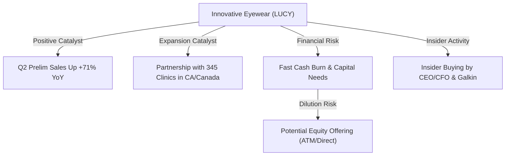
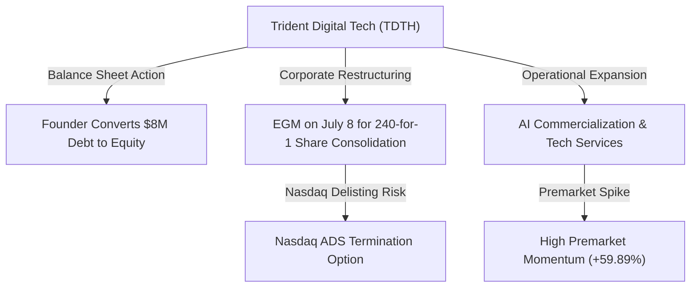
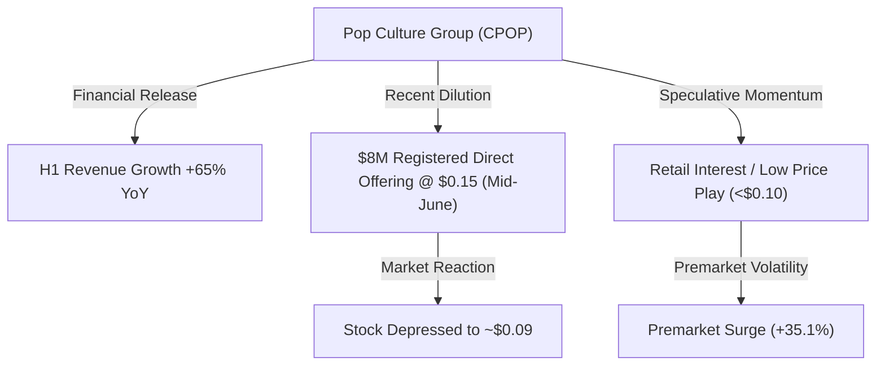
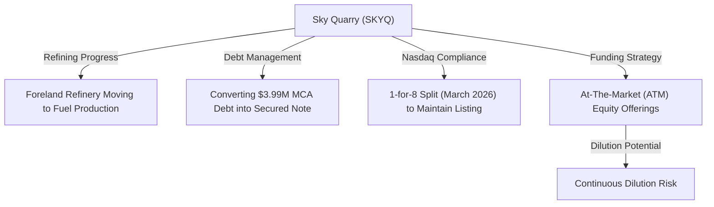
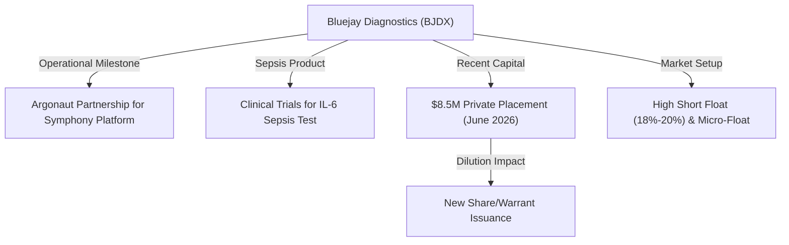

# 📊 Small-Cap & Penny Stock Intelligence Report
**Hedge Fund Trading Desk / Market Intelligence Division**  
**Date:** July 7, 2026  
**Market Stance:** Extreme Premarket Momentum / Capital Restructuring / Low-Float Squeeze & Clinical Trials Catalysts

---

## 📈 Executive Summary

สภาวะตลาดกลุ่ม Small-Cap และ Micro-Cap/Penny Stocks ในการซื้อขายก่อนเปิดตลาด (Premarket) ของวันที่ 7 กรกฎาคม 2026 เผชิญกับความผันผวนระดับสูงและแรงซื้อเก็งกำไรที่เร่งตัวขึ้นอย่างรุนแรง ท่ามกลางกระแสการตอบรับข่าวสารเฉพาะตัวของบริษัท (Alpha Catalysts) และความคืบหน้าของการปฏิรูปบัญชีฝั่งผู้ประกอบการขนาดเล็ก

ภายหลังตลาดหุ้นสหรัฐฯ ปิดทำการในแดนบวกอย่างแข็งแกร่งเมื่อวานนี้ (6 กรกฎาคม) นำโดยการพุ่งขึ้นทำสถิติสูงสุดใหม่ของดัชนีหลัก ดึงดูดให้เม็ดเงินไหลเข้าเก็งกำไรในตลาดหุ้นขนาดเล็ก (Russell 2000) มากยิ่งขึ้น โดยเฉพาะกลุ่มหุ้นที่มีมูลค่าหลักทรัพย์ตามราคาตลาดต่ำกว่า $15 ล้านดอลลาร์ และราคาซื้อขายต่ำกว่า $5 ดอลลาร์ ซึ่งหลายบริษัทมีประเด็นสำคัญที่นักลงทุนต้องพิจารณาอย่างเคร่งครัด เช่น การแปลงหนี้สินเป็นทุนเพื่อลดอัตราดอกเบี้ยจ่าย, การขอมติถอนสิทธิ์การซื้อขายเพื่อลดภาระค่าใช้จ่าย, การขยายสาขาค้าปลีกเชิงพาณิชย์ร่วมกับการฟื้นตัวของยอดขาย, ตลอดจนปัญหาการเพิ่มทุนและการใช้สิทธิ์ Warrants ที่ส่งผลต่อความคุ้มค่าของการลงทุน (Dilution Overhang)

รายงานวิจัยฉบับนี้ทำการวิเคราะห์เชิงลึกหุ้น 5 ตัวที่มีความเคลื่อนไหวทางราคาและปริมาณการซื้อขายที่ผิดปกติอย่างมีนัยสำคัญ ได้แก่ **LUCY**, **TDTH**, **CPOP**, **SKYQ** และ **BJDX** เพื่อสนับสนุนการตัดสินใจลงทุนและการวิเคราะห์ความเสี่ยงรอบด้าน

---

## 🔬 In-Depth Stock Analysis

### 1️⃣ Innovative Eyewear, Inc. (NASDAQ: LUCY)
*Smart Eyewear Retail Expansion & Net Sales Growth vs. High Cash Burn & Structural Offering Dilution*

#### **1. Company Overview**
*   **Sector / Industry:** Consumer Cyclical / Personal Products (Smart Eyewear)
*   **Market Cap:** ~$7.95 Million USD (Micro-Cap)
*   **Current Price:** $1.32 (ราคาปิดตลาด ณ วันที่ 6 กรกฎาคม 2026, เพิ่มขึ้น +73.68% จากวันก่อนหน้า)
*   **Average Volume (30D):** ~7.54 Million shares
*   **Float:** ~5.92 Million shares
*   **Short Float %:** ~0.50% of Float
*   **Shares Outstanding:** ~6.40 Million shares
*   **Institutional Ownership:** ~9.0%
*   **Insider Ownership:** ~33.5%

#### **2. Price Action Analysis**
*   **Movement:** ราคาหุ้น LUCY ระเบิดตัวเพิ่มขึ้นอย่างรุนแรงถึง +73.68% ในรอบปกติของวันจันทร์ที่ผ่านมา โดยขยับจาก $0.76 ขึ้นมาปิดตลาดที่ระดับ $1.32 และสร้างความผันผวนต่อในระดับสูงในช่วงก่อนเปิดตลาดวันนี้
*   **Microstructure:** การพุ่งขึ้นของราคาแสดงลักษณะความตึงตัวทางอุปสงค์แบบฉับพลัน (Demand Shock) เนื่องจากจำนวนหุ้นหมุนเวียนในตลาดจริง (Float) ค่อนข้างจำกัดเพียง 5.92 ล้านหุ้น แรงซื้อที่ไหลเข้ามากะทันหันบีบให้ราคาขยับขึ้นอย่างรวดเร็วผ่านแนวต้านสำคัญ
*   **Liquidity:** สภาพคล่องการซื้อขายหนาแน่นขึ้นสูงสุดในรอบหลายสัปดาห์ แต่ช่องว่างราคา Bid-Ask มีความผันผวนสูง แนะนำหลีกเลี่ยงการเคาะซื้อไล่ราคาในช่วงตลาดเปิดปกติ

#### **3. Volume Analysis**
*   **Relative Volume (RVOL):** ทะยานพุ่งเกิน **19.38x** เท่าจากค่าเฉลี่ยปกติ โดยมีปริมาณการซื้อขายรวมในรอบปกติถึง 146.2 ล้านหุ้น
*   **Volume Spike:** การเพิ่มขึ้นของปริมาณการซื้อขายได้รับแรงขับเคลื่อนโดยตรงจากข่าวการขยายสาขาจัดจำหน่ายแว่นตาอัจฉริยะและการรายงานยอดขายเบื้องต้น
*   **Smart Money Signal:** พบการทำธุรกรรมฝั่งซื้อสะสมของกลุ่มผู้บริหาร (Insider Buying) ในช่วงสัปดาห์ที่ผ่านมาก่อนการประกาศข่าว ช่วยสร้างความมั่นใจแก่ผู้ถือหุ้นภายนอก อย่างไรก็ตาม วอลุ่มเทรดส่วนใหญ่ในวันดีดตัวเป็นกลุ่ม HFT และรายย่อย

#### **4. News & Catalyst Analysis**
*   **Smart Eyewear Expansion & Q2 Preliminary Net Sales Growth:**
    1.  **ความสำเร็จในการขยายช่องทางการขาย:** บริษัทประกาศความร่วมมือกับคลินิกจักษุแพทย์และร้านแว่นตากว่า 345 แห่งทั้งในประเทศแคนาดาและรัฐแคลิฟอร์เนีย ซึ่งจะเริ่มดำเนินการจัดส่งแว่นตาอัจฉริยะแบรนด์ Lucyd ในช่วงไตรมาส 3/2026 นี้
    2.  **ยอดขายเบื้องต้นโตแกร่ง:** รายงานงบการเงินเบื้องต้น (Preliminary) ประจำไตรมาส 2/2026 มียอดขายสุทธิเติบโตกว่า 71% YoY แตะระดับ $3.37 Million USD ชี้ชัดว่าแว่นตาที่มีระบบการเชื่อมต่อเสียงและ AI ได้รับการยอมรับในตลาดผู้บริโภคมากขึ้น

#### **5. Financial Health**
*   **Revenue Growth & Cash Burn:** แม้รายได้จะมีการขยายตัวอย่างชัดเจนถึง 71% แต่บริษัทยังคงมีผลประกอบการขาดทุนจากการดำเนินงานและมีระดับการเผาเงินสด (Cash Burn) ที่ค่อนข้างเร็วเพื่อใช้ในการวิจัยพัฒนาและทำตลาด
*   **Dilution Risk:** **ระดับความเสี่ยงสูงมาก (High Dilution Risk)** เนื่องจากข้อจำกัดด้านสภาพคล่อง ทำให้บริษัทมักพึ่งพาการเพิ่มทุนผ่านเครื่องมือ At-The-Market (ATM) Offering ในช่วงเวลาที่ราคาหุ้นปรับตัวพุ่งสูงขึ้นเพื่อนำกระแสเงินสดเข้ามาหมุนเวียนในบริษัท

#### **6. Market Sentiment**
*   **Retail Sentiment:** บรรยากาศการเก็งกำไรในฝั่งรายย่อยปรับตัวเป็นบวกสุดขีด (Extremely Bullish) โดยถูกโหวตเป็นอันดับต้นๆ บนเว็บบอร์ดการเงิน Stocktwits และ Reddit ในกลุ่มสินค้าแฟชั่นอัจฉริยะ
*   **Speculative Level:** การเก็งกำไรในสัดส่วนสูงมาก โดยเป็นการเก็งกำไรบนพื้นฐานข่าวการเติบโตเชิงพาณิชย์ แต่มีความเสี่ยงสูงที่จะเผชิญแรงขายทำกำไรเชิงเทคนิค (Profit Taking)

#### **7. Technical Analysis**
*   **Trend Structure:** โครงสร้างกราฟราคารายวันทะลุกรอบแนวต้านเดิมและเส้นค่าเฉลี่ยสะสมระยะสั้นยืนเหนือ VWAP ได้อย่างแข็งแกร่ง
*   **Indicators:** ดัชนี RSI รายวันดีดขึ้นแตะระดับ 74 ซึ่งเข้าสู่เขตซื้อมากเกินไป (Overbought Zone) ชี้วัดว่าอาจเกิดการย่อตัวสร้างฐานในระยะสั้น
*   **Support/Resistance:** แนวรับ: $1.00, $0.90 / แนวต้าน: $1.50, $1.80

#### **8. Risk Analysis & Rating**
*   **Risk Level: ความเสี่ยงระดับสูงสุด (Extremely High Risk)**
*   **Threats:** ความเสี่ยงด้านการออกหุ้นเพิ่มทุน ATM เจือจางมูลค่า (Dilution Threat) เพื่อดึงกระแสเงินสดในช่วงราคาพุ่งสูง และความเสี่ยงจากการย่อตัวทางเทคนิคเมื่อแรงซื้อจากรายย่อยเริ่มอ่อนแรง

---

### 2️⃣ Trident Digital Tech Holdings Ltd. (NASDAQ: TDTH)
*Founder Debt-to-Equity Conversion vs. EGM Listing Restructuring & NASDAQ Delisting Decision*

#### **1. Company Overview**
*   **Sector / Industry:** Technology / IT Services
*   **Market Cap:** ~$7.36 Million USD
*   **Current Price:** $3.28 (ราคาปิดตลาด ณ วันที่ 6 กรกฎาคม 2026, ดีดขึ้นอย่างรุนแรงในพรีมาร์เก็ตวันที่ 7 กรกฎาคม แตะ ~$5.24 หรือ +59.89%)
*   **Average Volume (30D):** ~1.05 Million shares
*   **Float:** ~4.50 Million shares (รูปแบบ ADS)
*   **Short Float %:** ต่ำมาก (<1.0%)
*   **Shares Outstanding:** ~55.0 Million shares (แยกตามโครงสร้างหุ้นคลาส A และ B)
*   **Institutional Ownership:** น้อยกว่า 1.0%
*   **Insider Ownership:** สูงมาก (ผู้ก่อตั้ง Soon Huat Lim ควบคุมสิทธิ์โหวตรวม 92.4%)

#### **2. Price Action Analysis**
*   **Movement:** ราคาปิดตลาดปกติอยู่ที่ $3.28 แต่ในการซื้อขายก่อนเปิดตลาดของเช้าวันที่ 7 กรกฎาคม ราคาดีดตัวขึ้นอย่างไร้ทิศทางถึง +59.89% แตะระดับ $5.24 จากการเร่งซื้อเก็งกำไรในสัดส่วนที่แคบ
*   **Microstructure:** สัดส่วนหุ้นลอย (Float) ในรูปแบบตราสาร ADS ค่อนข้างต่ำมาก ประกอบกับการควบคุมสิทธิ์โหวตเกือบเบ็ดเสร็จโดยผู้ก่อตั้ง ทำให้ระบบจดทะเบียนตลาดเกิดความเปราะบางทางราคาเมื่อมีคำสั่งซื้อหนาแน่น
*   **Liquidity:** เบาบางและผันผวนสูง มีสเปรด Bid-Ask ที่กว้าง เสี่ยงต่อความลื่นไหลของราคาหากส่งคำสั่งซื้อแบบ Market Order

#### **3. Volume Analysis**
*   **Relative Volume (RVOL):** คาดการณ์ว่าปริมาณการซื้อขายในวันจะพุ่งสูงกว่าปกติเกิน **12.0x** เท่าตัว
*   **Volume Spike:** วอลุ่มการซื้อขายในพรีมาร์เก็ตหนาแน่นผิดปกติจากการตอบรับข่าวการล้างหนี้และเอกสารนัดประชุมวิสามัญ
*   **Smart Money Signal:** การแปลงหนี้ของผู้ก่อตั้งมาเป็นทุน บ่งชี้ว่าเจ้าหนี้ภายในต้องการลดภาระดอกเบี้ยของบริษัทและปรับงบดุลให้สวยงามขึ้นเพื่อรองรับก้าวต่อไป แต่ไม่มีการสะสมของสถาบันภายนอก

#### **4. News & Catalyst Analysis**
*   **$8M Founder Debt Conversion & EGM Share Consolidation Proposal:**
    1.  **การปรับปรุงงบการเงินครั้งสำคัญ:** เมื่อวันที่ 6 กรกฎาคม บริษัทรายงานการบรรลุข้อตกลงกับผู้ก่อตั้งและ CEO (Soon Huat Lim) ในการแปลงหนี้ค้างจ่าย (Founder Debt) มูลค่ารวม $8.0 Million USD ให้กลายเป็นหุ้นสามัญของบริษัท ซึ่งจะช่วยให้งบการเงินปลอดหนี้สินก้อนใหญ่ภายนอกทันที
    2.  **การประชุมผู้ถือหุ้น EGM ปรับโครงสร้าง:** บริษัทเตรียมจัดการประชุมวิสามัญผู้ถือหุ้น (EGM) ในวันที่ 8 กรกฎาคม 2026 โดยมีประเด็นสำคัญที่จะขอมติผู้ถือหุ้นในการทำ 240-for-1 Share Consolidation สำหรับหุ้นคลาส A และคลาส B เพื่อปรับเกณฑ์ราคาขั้นต่ำ และประเด็นที่สร้างความกังวลสูงสุดคือการขอสิทธิ์ในการยกเลิกโครงการซื้อขายหลักทรัพย์ผ่าน ADS (Nasdaq ADS Termination) เพื่อถอนหุ้นออกจากการจดทะเบียนและลดค่าใช้จ่ายทางบัญชี

#### **5. Financial Health**
*   **Revenue Growth & Cash Burn:** บริษัทยังมีระดับผลการดำเนินงานขาดทุนสะสมและต้องการทรัพยากรเงินสดเพิ่ม อย่างไรก็ตาม การปรับโครงสร้างบัญชีด้วยการลดหนี้ $8 ล้านเหรียญจะช่วยเพิ่มส่วนของผู้ถือหุ้นและรักษาสัดส่วนทุนที่มั่นคงขึ้น
*   **Dilution Risk:** **ระดับความเสี่ยงปานกลาง** แม้การแปลงหนี้เป็นทุนจะสร้างหุ้นเพิ่มใหม่เจือจางผลตอบแทนเดิม แต่มีประโยชน์ในการรักษาโครงสร้างเงินทุนจากสภาวะล้มละลาย

#### **6. Market Sentiment**
*   **Retail Sentiment:** เกิดความขัดแย้งในมุมมองของรายย่อย (Mixed Sentiment) ด้านหนึ่งตื่นเต้นกับตัวเลขหนี้ที่ลดลงและการพุ่งของราคาในพรีมาร์เก็ต แต่อีกด้านหนึ่งแสดงความกังวลเกี่ยวกับการทำ Delisting ออกจาก Nasdaq หลังการโหวตวันที่ 8 กรกฎาคม
*   **Speculative Level:** ระดับการเก็งกำไรสูงสุด ผันผวนตามความคาดหวังเรื่องมติโหวตของสิทธิควบคุมบริษัท

#### **7. Technical Analysis**
*   **Trend Structure:** ทรงกราฟแสดงการดีดตัวกลับอย่างรุนแรง (V-Shape Recovery) ข้ามผ่านเส้น EMA 50
*   **Indicators:** เครื่องมือทางเทคนิคสะท้อนภาพการพุ่งตัวเกินมูลค่าแนวรับปกติ (Extremely Overextended)
*   **Support/Resistance:** แนวรับ: $3.00, $3.28 / แนวต้าน: $5.24, $6.00

#### **8. Risk Analysis & Rating**
*   **Risk Level: ความเสี่ยงระดับวิกฤต (Extremely High / Event Risk)**
*   **Threats:** ความเสี่ยงสูงสุดของการลงทุนในหุ้น TDTH ตอนนี้คือผลลัพธ์ของการประชุมวิสามัญผู้ถือหุ้นในวันที่ 8 กรกฎาคม หากมีการขอมติให้เพิกถอนหลักทรัพย์ ADS ออกจาก Nasdaq จริง หุ้นจะสูญเสียสภาพคล่องบนกระดานซื้อขายหลักและอาจทำให้มูลค่าหุ้นที่ถือครองในมือผู้ลงทุนรายย่อยดิ่งลงอย่างหนักในทันที

---

### 3️⃣ Pop Culture Group Co., Ltd. (NASDAQ: CPOP)
*Half-Year Unaudited Financial Recovery & Revenue Surge vs. Heavy Dilution from Offering*

#### **1. Company Overview**
*   **Sector / Industry:** Communication Services / Entertainment
*   **Market Cap:** ~$9.70 Million USD (Micro-Cap)
*   **Current Price:** $0.0923 (ราคาปิดตลาด ณ วันที่ 6 กรกฎาคม 2026, ดีดขึ้นในพรีมาร์เก็ตวันที่ 7 กรกฎาคม แตะ ~$0.12 หรือ +35.1%)
*   **Average Volume (30D):** ~4.20 Million shares
*   **Float:** ~82.0 Million shares
*   **Short Float %:** ~1.20% of Float
*   **Shares Outstanding:** ~105.39 Million shares
*   **Institutional Ownership:** ~0.74%
*   **Insider Ownership:** สูงมาก (กลุ่มผู้ก่อตั้ง)

#### **2. Price Action Analysis**
*   **Movement:** ราคาหุ้น CPOP ได้ลดระดับลงไปทดสอบฐานสำคัญใต้ระดับ $0.10 จากการโดนแรงเทขายหลังจากดีลเพิ่มทุนใหญ่ แต่ราคาในพรีมาร์เก็ตวันนี้ดีดตัวขึ้นทดสอบแนวต้าน $0.12 หรือเติบโตขึ้นประมาณ +35.1%
*   **Microstructure:** ด้วยความที่เป็นหุ้น Penny Stock ราคาต่ำกว่าสิบเซนต์ การขยับขึ้นลงของจุดทศนิยมเพียงไม่กี่ตำแหน่งสามารถคิดเป็นเปอร์เซ็นต์ที่สูงมาก ดึงดูดความสนใจจากเดย์เทรดเดอร์ที่เน้นหาหุ้นเก็งกำไรจังหวะฟื้นตัวระยะสั้น
*   **Liquidity:** สภาพคล่องการหมุนเวียนค่อนข้างดีเนื่องจากปริมาณเสนอซื้อขายในกรอบราคาหลักสิบเซนต์ดึงดูดรายย่อยเข้ามาจำนวนมาก

#### **3. Volume Analysis**
*   **Relative Volume (RVOL):** ขยับตัวสูงขึ้นอยู่ที่ราว **3.5x** เท่าของระดับการซื้อขายทั่วไป
*   **Volume Spike:** วอลุ่มซื้อเริ่มหนาแน่นขึ้นหลังจากบริษัทเผยแพร่ตัวเลขผลดำเนินงานครึ่งปีแรกที่ยังไม่ผ่านการตรวจสอบทางบัญชี
*   **Smart Money Signal:** ข้อมูลการถือครองจากสถาบันยังคงทรงตัวและเบาบางมาก สภาพคล่องส่วนใหญ่มาจากการสร้างโมเมนตัมและทำรอบของบัญชีรายย่อย

#### **4. News & Catalyst Analysis**
*   **H1 Unaudited Financial Results vs. Mid-June Registered Direct Offering:**
    1.  **ผลงานครึ่งปีแรกฟื้นตัวแกร่ง:** ข้อมูลทางการเงินครึ่งปีแรกที่ยังไม่ได้รับการตรวจสอบ (สิ้นสุดวันที่ 31 ธันวาคม 2025) รายงานตัวเลขรายได้รวมที่ $68.9 Million USD เติบโตขึ้น 65% YoY และมีกำไรจากการดำเนินงานสุทธิ $6.58 Million USD สะท้อนการฟื้นตัวของธุรกิจจัดกิจกรรมและบันเทิงในต่างประเทศ
    2.  **ผลกระทบการระดมทุนด่วน:** ข่าวดีดังกล่าวเพิ่งถูกประกาศออกมาเพื่อพยุงทิศทางหลังจากช่วงกลางเดือนมิถุนายน 2026 บริษัทเพิ่งปิดดีล Registered Direct Offering เพื่อขายหุ้นและ Warrants มูลค่า $8.0 Million USD ในราคาหุ้นละประมาณ $0.15 ซึ่งสร้างผลกระทบเจือจาง (Dilution) สูงมากและเป็นสาเหตุให้ราคาหุ้นทรุดตัวลงมาก่อนหน้านี้

#### **5. Financial Health**
*   **Revenue Growth & Cash Burn:** ยอดขายมีอัตราการเติบโตที่ดีจากกลุ่มอีเวนต์และการทำเนื้อหาบันเทิง แต่อัตรากำไรสุทธิหลังหักภาษียังค่อนข้างต่ำและมีความเสี่ยงของกระแสเงินสดข้ามแดน
*   **Dilution Risk:** **ระดับความเสี่ยงสูงมาก** หุ้นเพิ่มทุนและสิทธิการแปลงสภาพของ Series A/B Warrants จากดีลระดมทุนมูลค่า $8 ล้านเหรียญในราคากลางที่ $0.15 จะคอยสร้างแรงกดดันเหนือระดับราคาทุกครั้งที่ราคาพยายามดีดขึ้น

#### **6. Market Sentiment**
*   **Retail Sentiment:** รายย่อยมีปฏิกิริยาเชิงลบต่อการเพิ่มทุนที่เพิ่งผ่านมา แต่กลับมาเก็งกำไรในเชิงโมเมนตัมเทคนิคอลระยะสั้นเนื่องจากราคาเฉลี่ยต่อหุ้นต่ำมาก
*   **Speculative Level:** การเก็งกำไรระดับสูงสุดบนโครงสร้างราคาต่ำกว่า $0.20

#### **7. Technical Analysis**
*   **Trend Structure:** อยู่ในกรอบขาลงหลัก (Major Downtrend) แต่เกิดสัญญาณเทคนิคอลรีบาวด์ระยะสั้น (Mean Reversion) จากภาวะขายมากเกินไปก่อนหน้า
*   **Indicators:** RSI รายวันปรับระดับดีดขึ้นจากเขต Oversold เดิมมาสะสมกำลังแถวระดับ 48
*   **Support/Resistance:** แนวรับ: $0.08, $0.09 / แนวต้าน: $0.15, $0.20

#### **8. Risk Analysis & Rating**
*   **Risk Level: ความเสี่ยงสูงสุด (Extremely High Risk)**
*   **Threats:** ความเสี่ยงสูงสุดคือการเผชิญหน้ากับเกณฑ์รักษาสถานะจดทะเบียนของ Nasdaq ในการรักษาราคาเสนอซื้อขั้นต่ำที่ $1.00 (Minimum Bid Price Requirement) ซึ่งหากบริษัทไม่สามารถผลักดันราคาขึ้นมาได้ในอนาคตอันใกล้ อาจต้องทำ Reverse Split เพิ่มเติมในอัตราส่วนที่สูงมากเพื่อประคองสถานะ

---

### 4️⃣ Sky Quarry Inc. (NASDAQ: SKYQ)
*Foreland Refinery Production Phase & Debt Restructuring vs. Ongoing ATM Offerings*

#### **1. Company Overview**
*   **Sector / Industry:** Energy / Oil & Gas Refining & Marketing
*   **Market Cap:** ~$10.10 Million USD
*   **Current Price:** $2.11 (ราคาปิดตลาด ณ วันที่ 6 กรกฎาคม 2026, ปรับตัวสูงขึ้นในพรีมาร์เก็ตวันที่ 7 กรกฎาคม แตะ ~$2.54 หรือ +20.52%)
*   **Average Volume (30D):** ~0.98 Million shares
*   **Float:** ~4.45 Million shares
*   **Short Float %:** **10.5% - 11.3%** of Float (มีปริมาณชอร์ตเซลสะสมปานกลาง)
*   **Shares Outstanding:** ~4.79 Million shares (หลังผ่านการทำ 1-for-8 Reverse Split ในช่วง มี.ค. 2026)
*   **Institutional Ownership:** ต่ำมาก (<0.5%)
*   **Insider Ownership:** ~7.20%

#### **2. Price Action Analysis**
*   **Movement:** ราคาหุ้น SKYQ สร้างฐานมั่นคงบริเวณแนวรับจิตวิทยา $2.00 ก่อนขยับปิดที่ $2.11 และมีการปรับตัวพุ่งขึ้นต่อในช่วงพรีมาร์เก็ตมาทดสอบแนวต้าน $2.54 (+20.52%)
*   **Microstructure:** หลังจากผ่านการปรับสัดส่วนการควบหุ้น จำนวนหุ้น Float ในระบบลดลงมาอยู่ที่เพียง 4.45 ล้านหุ้น และด้วยการที่มีสัดส่วนผู้ถือชอร์ตเซลสะสมประมาณ 10% ของ Float ทำให้ราคาตอบสนองไวต่อแรงซื้อที่เข้ามาและมีโอกาสเกิด Short Squeeze ในสเกลขนาดเล็กได้ง่าย
*   **Liquidity:** ระดับสภาพคล่องเบาบางในวันปกติ แต่จะหนาแน่นเฉพาะช่วงที่มีการซื้อขายตอบรับข่าวสารพลังงาน

#### **3. Volume Analysis**
*   **Relative Volume (RVOL):** อยู่ที่ระดับประมาณ **2.80x** เท่าจากระดับเฉลี่ยรายวัน
*   **Volume Spike:** วอลุ่มดีดตัวสูงขึ้นจากรายงานความก้าวหน้าการกลับมากลั่นน้ำมันและขยายสัญญากับเจ้าหนี้
*   **Smart Money Signal:** ข้อมูลการยื่นแปลงหนี้กับสถาบันการเงินภายนอกสะท้อนว่าบริษัทสามารถชะลอการจ่ายคืนเงินสดฉุกเฉินได้สำเร็จ ซึ่งลดโอกาสการเทขายหุ้นเพื่อล้างหนี้ในกระดานหลัก

#### **4. News & Catalyst Analysis**
*   **Foreland Refinery Commercialization & MCA Debt Secured Note Conversion:**
    1.  **ขยายกำลังการผลิตจริง:** บริษัทประกาศว่าโรงกลั่น Foreland ในรัฐเนวาดาได้เปลี่ยนผ่านการทำงานจากขั้นตอนทดลองสู่การเดินเครื่องผลิตเชื้อเพลิงในเชิงพาณิชย์เป็นที่เรียบร้อย ซึ่งจะเริ่มรับรู้กระแสรายได้จริงจากความต้องการพลังงานทดแทนในพื้นที่
    2.  **ปรับลดแรงกดดันสภาพคล่อง:** รายงาน SEC ล่าสุดเมื่อต้นเดือนกรกฎาคม ระบุว่าบริษัทได้เจรจาแปลงหนี้สิน MCA (Merchant Cash Advance) มูลค่ารวม $3.99 Million USD ไปเป็น Secured Note (ตั๋วสัญญาใช้เงินค้ำประกัน) ซึ่งช่วยเพิ่มระยะเวลาการชำระคืนและลดความตึงเครียดของส่วนทุนในงบดุลปัจจุบัน

#### **5. Financial Health**
*   **Revenue Growth & Cash Burn:** บริษัทมีประวัติการขาดทุนจากการเริ่มสร้างโรงกลั่น และยังมีภาระหนี้ระยะสั้นที่ค่อนข้างตึงตัว แม้การแปลงหนี้ MCA จะช่วยยืดระยะเวลาออกไป แต่กระแสเงินสดสุทธิยังคงเปราะบาง
*   **Dilution Risk:** **ระดับความเสี่ยงสูง** บริษัทเพิ่งยื่นเอกสารการปรับโครงสร้างทุนและใช้สัญญาระดมทุนผ่าน ATM Offering เพื่อหาเงินหมุนเวียนในการเดินเครื่องโรงกลั่น ซึ่งจะทำให้เกิดการเจือจางของราคาหุ้นอย่างต่อเนื่องในระยะยาว

#### **6. Market Sentiment**
*   **Retail Sentiment:** ได้รับความสนใจปานกลางจากกลุ่มนักเก็งกำไรสายพลังงานทางเลือกและวัสดุก่อสร้างทางถนน/รีไซเคิลน้ำมัน
*   **Speculative Level:** การเก็งกำไรระดับสูงตามราคาพลังงานและโครงการปรับปรุงงบการเงิน

#### **7. Technical Analysis**
*   **Trend Structure:** ราคากำลังสร้างโครงสร้างรากฐานแบบ Double Bottom ในกราฟรายวันและขยับตัวขึ้นประคองเหนือเส้นแนวรับ $2.00
*   **Indicators:** RSI รายวันปรับขึ้นมายืนทรงตัวที่ระดับ 52 สะท้อนทิศทางแกว่งตัวฝั่งบวก (Mildly Bullish)
*   **Support/Resistance:** แนวรับ: $2.11, $2.00 / แนวต้าน: $2.64, $3.20

#### **8. Risk Analysis & Rating**
*   **Risk Level: ความเสี่ยงระดับสูง (High Risk)**
*   **Threats:** ความล่าช้าของการสร้างกำไรในเชิงพาณิชย์ของโรงกลั่น และความเสี่ยงในการออกขายหุ้นใหม่เจือจางผ่านช่องทาง ATM เพื่อนำเงินสดไปชำระ Secured Note ที่ครบกำหนดในอนาคต

---

### 5️⃣ Bluejay Diagnostics, Inc. (NASDAQ: BJDX)
*Symphony IL-6 Sepsis Trial Momentum vs. Warrant Conversion Overhang & Micro-Float Short Squeeze Setup*

#### **1. Company Overview**
*   **Sector / Industry:** Healthcare / Diagnostics & Research
*   **Market Cap:** ~$1.27 Million USD (Micro-Cap)
*   **Current Price:** $1.23 (ราคาปิดตลาด ณ วันที่ 6 กรกฎาคม 2026, ดีดขึ้นอย่างรุนแรงในพรีมาร์เก็ตวันที่ 7 กรกฎาคม แตะ ~$1.70 หรือ +37.93%)
*   **Average Volume (30D):** ~1.10 Million shares
*   **Float:** ~0.95 Million shares (หุ้นลอยต่ำมากในระดับ Micro-Float)
*   **Short Float %:** **18.2% - 20.1%** of Float (ระดับความตึงตัวฝั่งชอร์ตเซลสูง)
*   **Shares Outstanding:** ~1.03 Million shares (หลังผ่านกระบวนการทำ 1-for-4 Reverse Split ในเดือนมกราคม 2026)
*   **Institutional Ownership:** น้อยมาก (มีสถาบันจดทะเบียนถือรวมประมาณ 58,829 หุ้น)
*   **Insider Ownership:** สูงมาก (Director Douglas Clark Wurth รายงานการถือครอง 578.46k หุ้น ณ วันที่ 1 กรกฎาคม 2026)

#### **2. Price Action Analysis**
*   **Movement:** ราคาปิดตลาดปกติสะสมที่ $1.23 แต่ในช่วงพรีมาร์เก็ตของวันที่ 7 กรกฎาคม ราคาดีดตัวทำ Gap Up ขึ้นไปทดสอบระดับ $1.70 (+37.93%)
*   **Microstructure:** ด้วยความที่เป็นหุ้นที่มี Float ต่ำกว่า 1 ล้านหุ้น และมีปริมาณ Short Interest ถึงเกือบ 20% ของหุ้นหมุนเวียน ทำให้ BJDX เป็นเป้าหมายที่เกิดภาวะ Short Squeeze ได้รวดเร็วและรุนแรงที่สุดในกลุ่ม หากมีแรงซื้อขนาดใหญ่ไหลเข้ามากดดันฝั่งหมีให้ต้องปิดสถานะหนีตาย
*   **Liquidity:** ต่ำมากในสถานการณ์ปกติ ส่งผลให้ราคาสามารถเคลื่อนไหวแบบไร้ทิศทางและทำ Gap ราคาได้อย่างรวดเร็ว

#### **3. Volume Analysis**
*   **Relative Volume (RVOL):** ปรับเพิ่มขึ้นอย่างรวดเร็วขยับเกินระดับ **5.40x** เท่าในรอบวัน
*   **Volume Spike:** การเพิ่มขึ้นของวอลุ่มได้รับอิทธิพลเชิงบวกจากข่าวการเซ็นสัญญาพันธมิตรผู้ผลิตและขั้นตอนการขออนุมัติ FDA
*   **Smart Money Signal:** แรงสะสมของกลุ่มบริหารที่ถือครองส่วนใหญ่ชี้ให้เห็นว่าโครงสร้างภายยังมีการถือครองที่มั่นคง ไม่มีการทิ้งหุ้นของกลุ่มควบคุมหลักในระดับราคานี้

#### **4. News & Catalyst Analysis**
*   **Symphony platform FDA trials progress & Argonaut Manufacturing Contract:**
    1.  **โครงการทดสอบทางคลินิกที่สำคัญ:** โครงการยื่นประเมินขออนุมัติจาก FDA สำหรับระบบตรวจวิเคราะห์เชื้อ Sepsis (ภาวะติดเชื้อในกระแสเลือด) Symphony IL-6 ของบริษัท กำลังอยู่ระหว่างดำเนินขั้นตอนทดสอบทางคลินิกขั้นสุดท้าย ซึ่งผลการศึกษาจะถูกรายงานในช่วงไตรมาสถัดไปและถือเป็นเป้าหมายสำคัญของบริษัท
    2.  **เซ็นสัญญาสายการผลิตเชิงพาณิชย์:** ในช่วงปลายเดือนมิถุนายน บริษัทได้บรรลุข้อตกลงและลงนามสัญญาการผลิตกับ Argonaut Manufacturing Services เพื่อเตรียมความพร้อมของโรงงานในกรณีที่ได้รับการรับรองจาก FDA ซึ่งช่วยลดความกังวลของนักลงทุนเรื่องขีดความสามารถการขาย
    3.  **เงินทุนหมุนเวียนก้อนใหม่:** ช่วงกลางเดือนมิถุนายน บริษัทปิดข้อตกลงระดมทุนแบบ Private Placement ได้เงินสดเข้ามาเบื้องต้น $8.5 Million USD (และมีเป้าหมายสูงสุดถึง $23.6M) ส่งผลให้บริษัทมีเสถียรภาพทางการเงินและมีระยะเวลาดำเนินงาน (Cash Runway) เพียงพอไปถึงไตรมาส 1 ปี 2027

#### **5. Financial Health**
*   **Revenue Growth & Cash Burn:** บริษัทยังไม่มีรายได้ในเชิงพาณิชย์เนื่องจากผลิตภัณฑ์หลักอยู่ในขั้นตอนการขออนุมัติ รายงานผลขาดทุนสุทธิไตรมาส 1/2026 อยู่ที่ $1.92 Million USD แต่เงินสดหนุนจากข้อตกลงระดมทุนล่าสุดเข้ามาลบความเสี่ยงสภาพคล่องระยะสั้นออกไป
*   **Dilution Risk:** **ระดับความเสี่ยงสูง** ข้อตกลง Private Placement มาพร้อมกับการออกขายหุ้นและใบสำคัญแสดงสิทธิ Series G และ Series H Warrants จำนวนมาก ซึ่งอาจจะจำกัดกรอบการฟื้นตัวระยะกลางของราคาหุ้นเมื่อเกิดการใช้สิทธิ์

#### **6. Market Sentiment**
*   **Retail Sentiment:** เป็นหนึ่งในหุ้นยอดนิยมของกลุ่มสแกนดักจับ "Low Float / Squeeze Potential" บนแพลตฟอร์ม Twitter (X) และ Discord ของเดย์เทรดเดอร์
*   **Speculative Level:** การเก็งกำไรในสัดส่วนสูงมากตามลักษณะหุ้นชีวเวชศาสตร์ระยะแรก (Early Stage Biotech Speculation)

#### **7. Technical Analysis**
*   **Trend Structure:** กราฟราคารายวันแสดงสัญญาณการกลับตัวระยะสั้น โดยเริ่มทำราคาปิดเหนือระดับเส้นค่าเฉลี่ยสั้นและข้ามผ่านช่วงฐาน $1.15
*   **Indicators:** RSI รายวันปรับขึ้นแตะระดับ 60 สะท้อนการฟื้นตัวของแนวโน้มขาขึ้นแต่ยังมีพื้นที่ในการเติบโตต่อ
*   **Support/Resistance:** แนวรับ: $1.15, $1.00 / แนวต้าน: $1.70, $2.00

#### **8. Risk Analysis & Rating**
*   **Risk Level: ความเสี่ยงระดับสูงสุด (Extremely High Risk)**
*   **Threats:** ความเสี่ยงหลักมาจากการทดลองทางคลินิกที่อาจไม่ผ่านเกณฑ์การอนุมัติของ FDA และความผันผวนจากการใช้สิทธิ์แปลงสภาพของ Warrants รุ่นใหม่ที่จะเข้ามาฉุดรั้งกำไรต่อหุ้นในระยะยาว

---

## 🧠 Executive Synthesis (สรุป Insight สำคัญ)

จากการรวบรวมและวิเคราะห์ข้อมูลปัจจัยพื้นฐาน ข้อมูลทางบัญชี ราคา และโครงสร้างผู้ถือหุ้นของทั้ง 5 บริษัทหลัก สามารถสรุปมิติมุมมองสำคัญเพื่อใช้วางแผนกลยุทธ์การเทรดได้ดังนี้:

*   **หุ้นที่มีความแข็งแกร่งของโมเมนตัมราคาสูงสุด (Strongest Momentum):** **LUCY** ด้วยการฟื้นตัวแรงถึง +73.68% ในรอบปกติ และตอบรับงบการเงินเบื้องต้นที่ดีต่อเนื่อง มีทิศทางที่ได้รับแรงหนุนสูงสุด
*   **หุ้นที่มีความพร้อมในการเกิดปรากฏการณ์ Short Squeeze สูงสุด (High Squeeze Candidate):** **BJDX** เนื่องจากมีสัดส่วน Short Float สูงถึง 18.2% - 20.1% ขณะที่มีจำนวนหุ้น Float ต่ำกว่า 1 ล้านหุ้น ชี้ว่าหากมีวอลุ่มซื้อต่อยอดเพียงเล็กน้อยจะเกิดการไล่ซื้อปิดชอร์ตทำราคาดีดตัวอย่างรวดเร็ว
*   **หุ้นที่มีการปรับปรุงโครงสร้างบัญชีเด่นชัดที่สุด (Balance Sheet Overhaul):** **TDTH** การที่ผู้ก่อตั้งแปลงหนี้สิน $8.0 Million USD เป็นทุน ช่วยลดหนี้สินอย่างมีนัยสำคัญและเคลียร์งบดุล แต่ผู้ลงทุนต้องรับความเสี่ยงเรื่องมติ EGM
*   **หุ้นที่มีโครงสร้างราคาต่ำสุดเชิงเก็งกำไร (Micro Penny Play):** **CPOP** ซึ่งซื้อขายต่ำกว่าระดับ $0.15 ดอลลาร์ มีความผันผวนสูงมากเป็นสัดส่วนเปอร์เซ็นต์ แต่มีปัจจัยกดดันด้านการเพิ่มทุนรอบล่าสุดค้ำอยู่
*   **หุ้นที่มีสัดส่วนหนี้สินและสภาพคล่องระยะสั้นได้รับการผ่อนปรนมากที่สุด (Debt Restructuring Play):** **SKYQ** จากการแปลงหนี้ MCA ไปเป็น Secured Note ยืดอายุชำระคืน ประจวบกับการเริ่มกำลังการผลิตเชิงพาณิชย์
*   **หุ้นที่มีระดับความเสี่ยงของ Event Risk สูงสุด (Highest Catalyst Risk):** **TDTH** (การประชุมวิสามัญผู้ถือหุ้นวันที่ 8 กรกฎาคม เพื่อเสนอถอนหลักทรัพย์ ADS ออกจาก Nasdaq) และ **BJDX** (การรอคอยผลสรุปการทดสอบ IL-6 Symphony เพื่อเสนอ FDA)

---

## 📌 Daily Watchlist & Classification (7 กรกฎาคม 2026)

*   **Top Momentum:** **LUCY** (การปรับตัวขึ้นแรงจากการขยายสาขา 345 แห่งในแคนาดา/แคลิฟอร์เนีย และงบไตรมาส 2 แกร่ง)
*   **Top Risk:** **TDTH** (ความเสี่ยงในการประชุม EGM เพื่อพิจารณาถอนหลักทรัพย์ ADS ออกจากตลาด Nasdaq วันพรุ่งนี้)
*   **Top Volume:** **LUCY** (ปริมาณการซื้อขายหนาแน่นทำสถิติกว่า 146 ล้านหุ้นในรอบปกติ)
*   **Top Catalyst:** **BJDX** (ความก้าวหน้าโครงการทดลองหาเชื้อ Sepsis Symphony IL-6 เพื่อขออนุมัติจาก FDA)
*   **Top Speculative Play:** **CPOP** (การรีบาวด์ของหุ้นราคาหลักสิบเซนต์ที่มีความผันผวนทางอารมณ์ตลาดสูง)

### **🏆 การจัดอันดับประจำวัน**
*   🥇 **หุ้นเด่นที่สุดของวัน (Top Pick):** **LUCY** (แม้ว่าจะมีระดับความผันผวนและเสี่ยงเรื่องการเพิ่มทุนสะสมในระยะยาว แต่การเติบโตของยอดขายจริง 71% YoY และการขยายจุดบริการ optical clinics รวม 345 แห่งเป็นรากฐานสนับสนุนที่ชัดเจนที่สุดในกลุ่ม)
*   ⚠️ **หุ้นเสี่ยงที่สุดของวัน (Highest Risk):** **TDTH** (การประชุม EGM วันพรุ่งนี้ที่จะขอมติยกเลิกหลักทรัพย์จดทะเบียน ADS บนตลาด Nasdaq เพื่อไปเทรดในรูปแบบอื่น เป็นปัจจัยลบเชิงโครงสร้างที่รุนแรงต่อผู้ถือหุ้นรายย่อยทั่วไป)
*   👀 **หุ้นที่ตลาดจับตาที่สุดของวัน (Most Watched):** **BJDX** (ด้วยสัดส่วนผู้ถือครองชอร์ตเซลที่สะสมสูงถึงเกือบ 20% บนจำนวนหุ้น Float ที่บางเบาไม่ถึงล้านหุ้น ถือเป็นเป้าหมายที่มีความเสี่ยงเกิดการวิ่งแบบ Short Squeeze รุนแรงข้ามคืน)

---

## 🌐 แหล่งข้อมูลอ้างอิง (Sources)

- [Innovative Eyewear, Inc. Investor Relations - Q2 Preliminary Net Sales and Lucyd Retail Expansion Updates](https://lucyd.co/)
- [Trident Digital Tech Holdings Ltd. SEC Form 6-K - Founder Debt Conversion and Extraordinary General Meeting Notice](https://www.sec.gov/)
- [Pop Culture Group Co., Ltd. Unaudited Half-Year Financial Results and Mid-June Registered Direct Offering Filings](https://www.sec.gov/)
- [Sky Quarry Inc. SEC Filings - Foreland Refinery Production Status & MCA Debt Secured Note Refinancing Details](https://www.sec.gov/)
- [Bluejay Diagnostics, Inc. SEC Form 8-K - Private Placement Funding & Symphony Platform Partnership with Argonaut Manufacturing](https://www.bluejaydx.com/)
- [Nasdaq Listing Center - Minimum Bid Price Compliance Rules and Corporate Restructuring Guidelines](https://listingcenter.nasdaq.com/)
