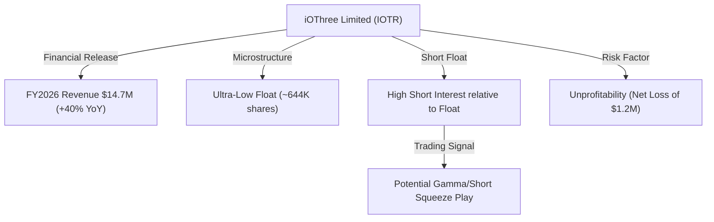
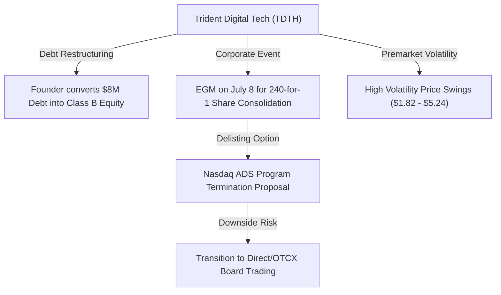
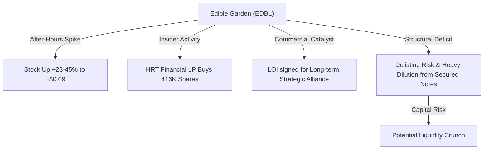
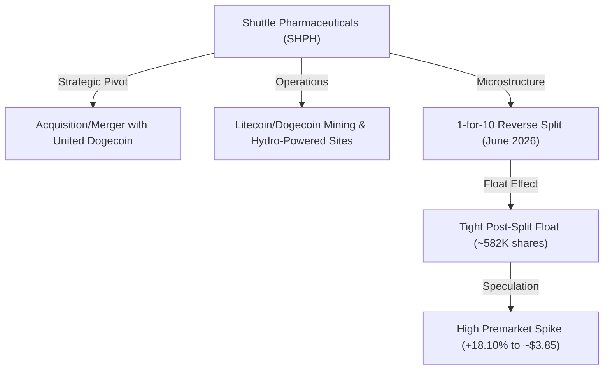
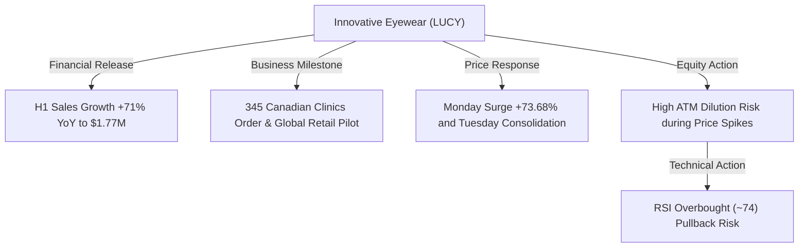

# 📊 Small-Cap & Penny Stock Intelligence Report
**Hedge Fund Trading Desk / Market Intelligence Division**  
**Date:** July 8, 2026  
**Market Stance:** Premarket Demand Shock / Restructuring Catalysts / High Speculative Volatility

---

## 📈 Executive Summary

สภาวะการซื้อขายหลักทรัพย์กลุ่ม Small-Cap, Micro-Cap และ Penny Stocks ของตลาดหุ้นสหรัฐฯ ในช่วงก่อนเปิดตลาด (Premarket) ประจำวันที่ 8 กรกฎาคม 2026 เผชิญกับความผันผวนและความคึกคักอย่างเด่นชัด นำโดยหุ้นขนาดเล็กหลายตัวที่มีประเด็นการปรับโครงสร้างทุน การรายงานผลการดำเนินงานที่เติบโตอย่างก้าวกระโดด ตลอดจนการควบรวมกิจการและการเปลี่ยนทิศทางธุรกิจแบบกะทันหัน (Pivot Catalysts)

ในเช้าวันนี้ ดัชนีล่วงหน้าสหรัฐฯ เผชิญแรงกดดันหลังมีความตึงเครียดทางภูมิรัฐศาสตร์รอบใหม่ในตะวันออกกลางและราคาน้ำมันดิบที่พุ่งสูงขึ้น ส่งผลให้ดัชนี Nasdaq Futures ร่วงลงสู่ระดับต่ำสุดในรอบ 4 สัปดาห์ อย่างไรก็ตาม สภาพคล่องเก็งกำไรบางส่วนได้ไหลเข้าสู่หุ้นขนาดเล็กและ Penny Stocks ที่มีสัดส่วนหุ้นหมุนเวียนในตลาดจำกัด (Low Float) และมีประเด็นเฉพาะตัวที่ส่งผลต่อโครงสร้างธุรกิจ (Micro-structure Catalyst) 

รายงานฉบับนี้เจาะลึกหุ้นขนาดเล็ก 5 ตัวที่มีความเคลื่อนไหวทางราคาและปริมาณการซื้อขายหนาแน่นผิดปกติ ได้แก่ **IOTR**, **TDTH**, **EDBL**, **SHPH** และ **LUCY** เพื่อสนับสนุนการวิเคราะห์ความเสี่ยงและข้อมูลสำหรับประกอบการตัดสินใจของนักลงทุนสถาบันและผู้ค้าหลักทรัพย์รายย่อย

---

## 🔬 In-Depth Stock Analysis

### 1️⃣ iOThree Limited (NASDAQ: IOTR)
*Maritime Digital Solutions Revenue Surge & Tight Float Squeeze Candidate*

#### **1. Company Overview**
*   **Sector / Industry:** Communication Services / Telecom Services
*   **Market Cap:** ~$6.46 Million USD
*   **Current Price:** $2.52 (ราคาปิดตลาดปกติ ณ วันที่ 7 กรกฎาคม 2026, ดีดขึ้นในพรีมาร์เก็ตวันที่ 8 กรกฎาคม แตะระดับ ~$4.24 หรือ +68.25%)
*   **Average Volume (30D):** ~776,079 shares (สถิติ 10 วันล่าสุดขยับตัวแถว ~455,900 shares และพุ่งทะลุ 5 ล้านหุ้นจากข่าวล่าสุด)
*   **Float:** ~644,046 shares (ต่ำมาก)
*   **Short Float %:** ~2.72% ของจำนวนหุ้น outstanding ทั้งหมด แต่คิดเป็นสัดส่วนสูงเมื่อเทียบกับ Float จริง
*   **Shares Outstanding:** 733,326 shares
*   **Institutional Ownership:** ~1.61%
*   **Insider Ownership:** ~2.62%

#### **2. Price Action Analysis**
*   **Movement:** ราคาปิดตลาดของ IOTR อยู่ที่ $2.52 โดยแกว่งตัวในกรอบแคบก่อนที่งบการเงินปี 2026 จะออก และในพรีมาร์เก็ตวันนี้ ราคาหุ้นทะยานตัวขึ้นถึง +68.25% ขึ้นมาทดสอบแนวต้านจิตวิทยาที่ $4.24
*   **Microstructure:** สภาพคล่องหุ้นหมุนเวียน (Float) ต่ำมากเพียงประมาณ 6.4 แสนหุ้น ทำให้เกิด Demand Shock ได้ง่าย เมื่อมีปริมาณเสนอซื้อ (Bid Order) ไหลเข้ามาอย่างฉับพลัน ขยับบีบให้ราคาในพรีมาร์เก็ตพุ่งสูงขึ้นอย่างรวดเร็ว
*   **Liquidity Quality:** สเปรด Bid-Ask กว้างมากในช่วง Premarket นักลงทุนควรระมัดระวังเป็นพิเศษในการส่งคำสั่งซื้อแบบ Market Order เพื่อหลีกเลี่ยงการจับคู่ราคาในจุดที่เสียเปรียบ (Slippage Risk)

#### **3. Volume Analysis**
*   **Relative Volume (RVOL):** พุ่งทะลุเกิน **8.5x** ของระดับปกติ มีวอลุ่มหมุนเวียนหนาแน่นผิดปกติในช่วงเช้า
*   **Volume Spike:** การพุ่งของปริมาณซื้อขายได้รับปัจจัยกระตุ้นจากการรายงานผลประกอบการประจำปี 2026
*   **Smart Money Signal:** ยังไม่มีสัญญาณการเข้าสะสมของกองทุนสถาบันขนาดใหญ่อย่างเด่นชัด สภาพคล่องหลักขับเคลื่อนโดย Day Traders และระบบ HFT บอทเทรดดิ้งที่ตรวจพบสัญญาณปริมาณซื้อขายเพิ่มขึ้นกะทันหัน

#### **4. News & Catalyst Analysis**
*   **Fiscal 2026 Financial Results:**
    *   **รายได้เติบโตแข็งแกร่ง:** บริษัทสัญชาติสิงคโปร์แห่งนี้รายงานรายได้รวมปีงบการเงิน 2026 ที่ $14.7 Million USD เติบโตขึ้นกว่า **40% YoY** จากความต้องการโซลูชันระบบโทรคมนาคม Jarviss และ AI Camera Surveillance (V.SIGHT) ในกลุ่มอุตสาหกรรมเดินเรือและท่าเรือ
    *   **ผลขาดทุนลดลง:** บริษัทรายงานขาดทุนสุทธิที่ $1.2 Million USD ซึ่งเป็นการส่งสัญญาณฟื้นตัวและลดสัดส่วนการขาดทุนจากปีก่อนหน้า สะท้อนประสิทธิภาพการบริหารต้นทุนที่ดีขึ้น

#### **5. Financial Health**
*   **Revenue Growth & Cash Position:** มีการเติบโตเชิงรายได้ที่ยอดเยี่ยม แต่ด้วยสภาวะที่ยังขาดทุน $1.2 ล้านเหรียญ ทำให้กระแสเงินสดภายในยังตึงตัว มีความเสี่ยงที่จะต้องใช้วิธีระดมทุนเสนอขายหุ้นสามัญใหม่ (Equity Offering) เพื่อนำเงินสดมาขับเคลื่อนสภาพคล่องในอีก 6-12 เดือนข้างหน้า
*   **Dilution Risk:** **ระดับความเสี่ยงปานกลางถึงสูง** เนื่องจากราคาหุ้นที่ปรับขึ้นมาสูงเป็นจังหวะที่เหมาะสมสำหรับฝ่ายบริหารในการจัดหาเงินทุนเพิ่ม

#### **6. Market Sentiment**
*   **Retail Sentiment:** บรรยากาศการเก็งกำไรเป็นไปอย่างร้อนแรง (Extremely Bullish) บนแพลตฟอร์มโซเชียลมีเดียเนื่องจากราคาเสนอขายเฉลี่ยไม่สูงและมีประเด็นข่าวรองรับที่น่าเชื่อถือ
*   **Speculative Level:** เก็งกำไรระยะสั้นระดับสูง โดยส่วนใหญ่คาดหวังให้ราคาเกิดการ Breakout ผ่านจุดสูงสุดเดิมช่วงพรีมาร์เก็ต

#### **7. Technical Analysis**
*   **Trend Structure:** กราฟราคาทะลุแนวต้านกรอบพักตัวเดิม และตัดตัวขึ้นเหนือเส้นค่าเฉลี่ย EMA 50, EMA 200 ในกราฟรายชั่วโมง
*   **Indicators:** RSI ในกรอบ 15 นาที และ 1 ชั่วโมง เข้าสู่ระดับซื้อมากเกินไป (Overbought > 80) ชี้วัดถึงความเสี่ยงของการย่อตัวเพื่อทดสอบฐาน (Pullback Risk)
*   **Support/Resistance:** แนวรับ: $3.50, $3.20 / แนวต้าน: $4.50, $5.00

#### **8. Risk Analysis & Rating**
*   **Risk Level: ความเสี่ยงระดับสูง (High Risk)**
*   **Threats:** ความผันผวนของราคาที่รวดเร็วจากการขาดสภาพคล่องสะสม และความเสี่ยงในการออกเครื่องมือระดมทุนในอนาคตอันใกล้

---

### 2️⃣ Trident Digital Tech Holdings Ltd. (NASDAQ: TDTH)
*Founder Debt Conversion vs. Special EGM Restructuring & Delisting Option Vote*

#### **1. Company Overview**
*   **Sector / Industry:** Technology / Information Technology Services
*   **Market Cap:** ~$12.08 Million USD
*   **Current Price:** $2.56 (ราคาปิด ณ วันที่ 7 กรกฎาคม 2026, ราคาเหวี่ยงรุนแรงตั้งแต่ $1.82 ไปถึง $5.24 ในกรอบสัปดาห์นี้)
*   **Average Volume (30D):** ~1.15 Million shares (โดยเฉลี่ย 10 วันล่าสุดพุ่งสูงถึง ~6.40 Million shares จากความตื่นตัวของแผนประชุมวิสามัญ)
*   **Float:** ~3.04 Million shares
*   **Short Float %:** ~0.81%
*   **Shares Outstanding:** 4,510,524 shares
*   **Institutional Ownership:** ~0.52%
*   **Insider Ownership:** น้อยกว่า 1.0% (ในรูปแบบหุ้นสามัญหมุนเวียนทั่วไป แต่ผู้ก่อตั้งควบคุมสิทธิ์ผ่านหุ้น Class B)

#### **2. Price Action Analysis**
*   **Movement:** ราคาปิดตลาดที่ $2.56 หลังจากการปรับฐานลดลงจากระดับยอดสูงที่ถูกดันขึ้นไประดับ $5.24 ท่ามกลางการรอคอยผลโหวต EGM ในวันที่ 8 กรกฎาคม
*   **Microstructure:** ราคาแสดงอาการระมัดระวัง (Anxious Consolidation) ก่อนการประชุม เนื่องจากผลของการโหวตจะชี้ชะตาทิศทางของโครงสร้างหลักทรัพย์อย่างสิ้นเชิง
*   **Liquidity:** สภาพคล่องอยู่ในเกณฑ์ระดับปานกลางจากการเก็งกำไรข่าวล้างหนี้ แต่ความหนาแน่นของคำสั่งซื้อขายฝั่งซื้อมีความเปราะบางสูง

#### **3. Volume Analysis**
*   **Relative Volume (RVOL):** ชะลอตัวลงมาอยู่ในระดับ **3.2x** จากระดับพีก 10 วันเฉลี่ย เพื่อรอการประกาศมติ EGM
*   **Volume Spike:** การพุ่งสูงขึ้นของปริมาณการซื้อขายในรอบ 3 วันก่อนเกิดจากการเข้ามารับซื้อเก็งกำไรในฝั่งสมาคมผู้ค้าหลักทรัพย์ขนาดเล็กเพื่อคาดหวังงบดุลที่สะอาดขึ้น
*   **Smart Money Signal:** สัญญาณการแปลงหนี้สินเป็นทุนของผู้ก่อตั้ง มูลค่า $8.0 ล้านเหรียญ ถือเป็น Smart Money Move ภายในบริษัทเพื่อลดภาระดอกเบี้ยจ่ายและเสริมความแข็งแกร่งของส่วนทุน

#### **4. News & Catalyst Analysis**
*   **Debt-to-Equity & Share Consolidation EGM (July 8, 2026):**
    *   **การแปลงหนี้สิน $8 ล้านดอลลาร์:** ผู้ก่อตั้งตกลงที่จะลดภาระหนี้ของบริษัทด้วยการแปลงหนี้ค้างชำระมูลค่า $8M เป็นหุ้น Class B ซึ่งทำให้โครงสร้างงบดุลปลอดหนี้สินก้อนใหญ่
    *   **240-for-1 Share Consolidation:** การควบรวมหุ้นในอัตราส่วนมหาศาลเพื่อยกราคาขึ้นสู่ระดับกฎเกณฑ์ขั้นต่ำของตลาด
    *   **Nasdaq ADS Program Termination:** ประเด็นที่สร้างความเสี่ยงสูงสุดคือการเสนอขอมติยกเลิกหลักทรัพย์ ADS บน Nasdaq เพื่อปรับโครงสร้างลดค่าใช้จ่ายทางบัญชี และเปลี่ยนไปเทรดในรูปแบบจดทะเบียนตรง ซึ่งอาจส่งผลต่อการเปลี่ยนสถานะกระดานหลัก

#### **5. Financial Health**
*   **Revenue Growth & Profitability:** ผลประกอบการหลักยังคงขาดทุนจากการดำเนินงาน และจำเป็นต้องพึ่งพาทรัพยากรภายใน แต่อัตราส่วนหนี้สินต่อทุน (D/E Ratio) จะปรับตัวดีขึ้นอย่างรวดเร็วหลังจากการแปลงหนี้เสร็จสิ้น
*   **Dilution Risk:** **ระดับปานกลาง** แม้จำนวนหุ้นจะเพิ่มขึ้นจากการแปลงหนี้ แต่การควบรวมหุ้น 240:1 จะทำให้จำนวนหุ้นลอยในระบบลดลงอย่างมาก

#### **6. Market Sentiment**
*   **Retail Sentiment:** เต็มไปด้วยความกังวลและความเข้าใจที่คลาดเคลื่อน (Mixed/Fear Sentiment) ในกลุ่มฟอรัมรายย่อย เนื่องจากประเด็นการยกเลิก ADS อาจทำให้หุ้นถูกเพิกถอนสิทธิ์ออกจากกระดานหลัก
*   **Speculative Level:** การเก็งกำไรบนเหตุการณ์พิเศษ (Event-driven speculation) ที่มีความผันผวนสูงมาก

#### **7. Technical Analysis**
*   **Trend Structure:** กราฟราคาเกิดการรีบาวด์แบบ V-Shape ข้ามผ่านเส้น EMA 50 ขึ้นมาทำฐานแถว $2.56 กำลังพยายามสะสมกำลังเพื่อทดสอบโซนแนวต้านบน
*   **Indicators:** RSI วิ่งอยู่ในกรอบค่าเฉลี่ยกลางแถว 52 สะท้อนว่าตลาดยังไม่เลือกทิศทางจนกว่าสัญญามติประชุมจะออกมาอย่างเป็นทางการ
*   **Support/Resistance:** แนวรับ: $2.20, $1.82 / แนวต้าน: $3.20, $5.24

#### **8. Risk Analysis & Rating**
*   **Risk Level: ความเสี่ยงระดับวิกฤต (Extremely High / Event Risk)**
*   **Threats:** ความเสี่ยงสูงสุดคือประเด็นการยกเลิกโครงการ ADS ของ Nasdaq หากผลโหวตอนุมัติและส่งผลต่อสภาพคล่อง ราคาหุ้นมีโอกาสดิ่งร่วงรุนแรงหรือขาดสภาพคล่องในการขายออกบนกระดานหลัก

---

### 3️⃣ Edible Garden AG Incorporated (NASDAQ: EDBL)
*After-Hours Momentum Spike & LOI Strategic Alliance vs. Cash Runway Risks*

#### **1. Company Overview**
*   **Sector / Industry:** Consumer Defensive / Farm Products
*   **Market Cap:** ~$1.80 Million USD
*   **Current Price:** $0.088 (ราคาปิดตลาดปกติ ณ วันที่ 7 กรกฎาคม 2026, ดีดขึ้นอย่างรุนแรงใน After-Hours แตะระดับ $0.108 ถึง $0.13 หรือ +23% ถึง +45%)
*   **Average Volume (30D):** ~10.93 Million shares (ปริมาณเทรด 10 วันเฉลี่ยสูงมากที่ ~37.67 Million shares)
*   **Float:** ~5.42 Million shares (ตัวเลขแปรผันตามการแปลงสิทธิ์ตราสาร)
*   **Short Float %:** ~2.07% ของจำนวนหุ้น
*   **Shares Outstanding:** 20,589,458 shares
*   **Institutional Ownership:** ~0.40%
*   **Insider Ownership:** ~0.80% (อย่างไรก็ตาม HRT Financial LP ถือครองเป็นกลุ่มผู้ถือหุ้นรายใหญ่ที่รายงานสิทธิ์)

#### **2. Price Action Analysis**
*   **Movement:** ราคาหุ้นในเซสชันปกติปรับลดลงทดสอบกรอบต่ำสุดที่ $0.088 ก่อนที่จะระเบิดตัวสูงขึ้นอย่างโดดเด่นในช่วงหลังปิดตลาด (After-Hours) พุ่งขึ้นสู่ $0.108 ทะลุกรอบแนวต้านระยะสั้น
*   **Microstructure:** เกิดปฏิกิริยาตอบรับเชิงจิตวิทยาจากข้อมูลผู้ถือหุ้นใหญ่รายใหม่และความร่วมมือเชิงกลยุทธ์ ส่งผลให้มีปริมาณคำสั่งซื้อเก็งกำไรระยะสั้นเข้ามาหนาแน่นชั่วคราว
*   **Liquidity:** สภาพคล่องในการซื้อขายปกติหนาแน่นเป็นพิเศษเนื่องจากราคาหุ้นเฉลี่ยต่ำกว่า $0.10 ทำให้จำนวนปริมาณหุ้นต่อสัญญาสูง

#### **3. Volume Analysis**
*   **Relative Volume (RVOL):** ทรงตัวในระดับสูงต่อเนื่อง คาดการณ์ RVOL สำหรับเปิดตลาดวันนี้จะสูงกว่า **4.5x** เท่า
*   **Volume Spike:** การดีดตัวครั้งนี้ได้แรงหนุนจากการซื้อสะสมทางบัญชีของสถาบันเฉพาะกลุ่มและการทำราคาในส่วน After-Hours
*   **Smart Money Signal:** รายงานข้อมูล SEC Form 4 ยืนยันว่า **HRT Financial LP** เข้าช้อนซื้อหุ้นสะสมเพิ่มเป็นจำนวน 416,812 หุ้น ในช่วงวันที่ 1-6 กรกฎาคม ถือเป็นกระแสเงินทุนของสถาบันที่เข้ามาเก็บเพื่อหวังผลกำไรจากการปรับตัวขึ้นของราคา

#### **4. News & Catalyst Analysis**
*   **LOI Strategic Alliance & Insider Buying Catalyst:**
    *   **Strategic Alliance LOI:** ประกาศลงนามหนังสือแสดงเจตจำนงที่ไม่ผูกมัด (Non-binding Letter of Intent) ร่วมกับพันธมิตรรายใหญ่ในตลาดอาหารยั่งยืนเพื่อพัฒนาช่องทางการจำหน่ายและการผลิตร่วมกัน
    *   **HRT Financial Accumulation:** การที่สถาบันผู้ถือสิทธิ์เข้าสะสมหุ้นอย่างมีนัยสำคัญช่วยสร้างแรงพยุงทางราคาและความเชื่อมั่นระยะสั้นให้แก่รายย่อย

#### **5. Financial Health**
*   **Revenue Growth & Cash Burn:** ยอดขายเติบโตในสัดส่วนเฉลี่ย แต่ประสบปัญหาขาดทุนหนักและกระแสเงินสดตึงตัวจนต้องพึ่งพาการออก $12 Million Secured Note และการสลับโครงสร้างแปลง Preferred Stock เป็น Common Stock
*   **Dilution Risk:** **ระดับสูงสุด (Extremely High Dilution Risk)** จำนวนหุ้นมีโอกาสเพิ่มขึ้นอย่างรวดเร็วจากการแปลงสภาพสิทธิ์ของเจ้าหนี้และ Warrants ซึ่งจะกดดันราคาหุ้นในทุกๆ ขาขึ้น

#### **6. Market Sentiment**
*   **Retail Sentiment:** เปลี่ยนทิศทางกลับเป็นบวกระยะสั้น (Short-term Bullish) นักลงทุนในกลุ่มโซเชียลมีเดียหันมาจับตาจังหวะการรีบาวด์จากจุดต่ำสุดเดิมเพื่อเก็งกำไรตามน้ำ (Momentum Chasing)
*   **Speculative Level:** การเก็งกำไรระดับสูงสุด เนื่องจากตัวหุ้นมีความเปราะบางด้านการเป็นอยู่ของกิจการ

#### **7. Technical Analysis**
*   **Trend Structure:** โครงสร้างหลักยังอยู่ในแนวโน้มขาลงที่รุนแรง (Severe Downtrend) แต่ในระยะสั้นมีสัญญาณกลับตัวช่วงพรีมาร์เก็ต (Oversold Bounce) เพื่อทำลายกรอบต่ำสุดเดิม
*   **Indicators:** RSI ฟื้นตัวจากโซนขายมากเกินไป (Oversold 28) ขึ้นมาสู่ระดับ 42 บ่งชี้ความพยายามสร้างฐานสะสมใหม่
*   **Support/Resistance:** แนวรับ: $0.08, $0.088 / แนวต้าน: $0.12, $0.15

#### **8. Risk Analysis & Rating**
*   **Risk Level: ความเสี่ยงระดับสูงสุด (Extremely High Risk)**
*   **Threats:** เสี่ยงต่อการถูกเพิกถอนหลักทรัพย์จดทะเบียน (Delisting Threat) เนื่องจากระดับราคาซื้อขายอยู่ต่ำกว่าเกณฑ์ $1.00 เป็นระยะเวลานาน รวมถึงภัยคุกคามจากการเจือจางหุ้นของกลุ่มผู้ถือหุ้นกู้แปลงสภาพ

---

### 4️⃣ Shuttle Pharmaceuticals Holdings, Inc. (NASDAQ: SHPH)
*United Dogecoin Merger Integration & Low-Float Crypto Pivot Trading*

#### **1. Company Overview**
*   **Sector / Industry:** Healthcare / Drug Manufacturers - Specialty & Generic (หมายเหตุ: ปัจจุบันย้ายแกนหลักมาสู่เทคโนโลยีขุดและถือครองสินทรัพย์ดิจิทัลหลังการควบรวมกิจการ)
*   **Market Cap:** ~$1.91 Million USD
*   **Current Price:** $3.26 (ราคาปิด ณ วันที่ 7 กรกฎาคม 2026, เคลื่อนไหวในช่วงพรีมาร์เก็ตขึ้นแตะระดับ $3.85 หรือ +18.10%)
*   **Average Volume (30D):** ~851,811 shares (สถิติ 10 วันล่าสุดขยับพุ่งสูงถึง ~4.33 Million shares ต่อวัน)
*   **Float:** ~582,385 shares (หลังเสร็จสิ้นกระบวนการ Reverse Split หุ้นหมุนเวียนจริงในระบบลดลงอย่างมาก)
*   **Short Float %:** ~5.78% ของ Float
*   **Shares Outstanding:** 585,129 shares
*   **Institutional Ownership:** ~9.11%
*   **Insider Ownership:** ~6.30%

#### **2. Price Action Analysis**
*   **Movement:** หลังจากราคาร่วงปรับฐานลงมาต่อเนื่องหลังการประกาศควบรวมกิจการ ราคาหุ้นเริ่มพบฐานบริเวณ $3.00 และเด้งตัวขึ้นทดสอบแนวต้าน $3.85 ในเช้าวันพุธนี้
*   **Microstructure:** โครงสร้างการแกว่งตัวของราคาค่อนข้างเบาบางและว่องไว เนื่องจากปริมาณหุ้นหมุนเวียนหลักร้อยหุ้นก็สามารถส่งผลต่อการเคลื่อนไหวของราคาได้หลายเปอร์เซ็นต์
*   **Liquidity Quality:** สภาพคล่องในการซื้อขายค่อนข้างเปราะบาง เสี่ยงต่อการถูกชะงักของแรงซื้อ (Liquidity Vacuum) หากกระแสความนิยมในฝั่งรายย่อยเริ่มลดความสนใจ

#### **3. Volume Analysis**
*   **Relative Volume (RVOL):** พุ่งสูงขึ้นราว **4.8x** เท่าตัวจากค่าเฉลี่ยปกติ
*   **Volume Spike:** ปริมาณเทรดพุ่งขึ้นแรงจากกลุ่มผู้เทรดสายคริปโทฯ ที่มองหาหุ้นธีมขุดเหมืองขนาดเล็กที่มีมูลค่าต่ำกว่า $5 ดอลลาร์
*   **Smart Money Signal:** การระดมทุนผ่านดีล PIPE มูลค่า $11.0 ล้านเหรียญ ถือเป็นทุนก้อนใหญ่ในการขับเคลื่อนเครื่องขุด ElphaPex แต่สำหรับกระดานซื้อขายยังไม่มีลักษณะการเข้าเก็บของกองทุนในประเทศ

#### **4. News & Catalyst Analysis**
*   **United Dogecoin Pivot & Infrastructure Scaling:**
    *   **การควบรวมกิจการที่เสร็จสมบูรณ์:** บริษัทได้ควบรวมกิจการกับ United Dogecoin Inc. เป็นบริษัทย่อย เพื่อปรับจุดยืนจากการวิจัยยาเดิมเข้าสู่การประกอบธุรกิจเหมืองขุดสะสม Dogecoin (DOGE) และ Litecoin (LTC)
    *   **การสั่งซื้อเครื่องขุดและการใช้พลังงานสะอาด:** บริษัทประกาศความคืบหน้าการส่งมอบเหมืองและเครื่องขุดในรัฐไอดาโฮ โดยระบุเป้าหมายการประหยัดค่าพลังงานที่ $0.064 ต่อกิโลวัตต์ชั่วโมง ซึ่งถือเป็นต้นทุนขุดที่ต่ำและสามารถรองรับกระบวนการขุดเหมืองระยะยาว

#### **5. Financial Health**
*   **Capital Runway & Capex Commitments:** ธุรกิจเหมืองขุดมีความต้องการใช้กระแสเงินสดเชิงพาณิชย์สูงมากเพื่ออัปเกรดเครื่องขุด แม้จะมีกระแสเงินสดจาก PIPE เข้ามาพยุง แต่การเปลี่ยนทิศทางแบบสุดขั้วนี้ส่งผลให้อัตราความเสี่ยงของการใช้เงินสดหมุนเวียนยังสูง
*   **Dilution Risk:** **ระดับความเสี่ยงสูง** มีโอกาสที่บริษัทจะต้องทำการเสนอขายหุ้นเพิ่มเติมเพื่อขยายจำนวนเครื่องขุดในแผนเฟสถัดไป

#### **6. Market Sentiment**
*   **Retail Sentiment:** กระแสในหมู่นักลงทุนรายย่อยดีดตัวเป็นบวก (Speculative High Hype) จากกระแสข่าวเกี่ยวกับเหรียญ Dogecoin ทำให้เกิดการแชร์ข้อมูลบน Reddit และแพลตฟอร์ม X ในกลุ่มเก็งกำไรหุ้นธีมคริปโทฯ
*   **Speculative Level:** ระดับการเก็งกำไรสูงสุด เป็น Hype-driven play อย่างสมบูรณ์แบบ

#### **7. Technical Analysis**
*   **Trend Structure:** กราฟระดับราคาสร้างฐานในลักษณะ Double Bottom บริเวณแนวรับ $3.00 และเริ่มปรับทิศทางขยับข้ามเส้นค่าเฉลี่ยสั้น EMA 20
*   **Indicators:** RSI ดีดขึ้นสู่ระดับ 58 บ่งชี้โมเมนตัมฝั่งซื้อเริ่มได้เปรียบ แต่ MACD ยังคงอยู่ในแดนลบต่ำกว่าศูนย์เล็กน้อย
*   **Support/Resistance:** แนวรับ: $3.00, $2.80 / แนวต้าน: $3.85, $4.50

#### **8. Risk Analysis & Rating**
*   **Risk Level: ความเสี่ยงระดับสูงสุด (Extremely High Risk)**
*   **Threats:** ความผันผวนของราคาสินทรัพย์คริปโทเคอร์เรนซี (DOGE/LTC) ที่ขุดได้เป็นปัจจัยกำหนดหลักทรัพย์โดยตรง พร้อมความเสี่ยงด้านประสิทธิภาพของเครื่องขุดและการเพิ่มทุนในอนาคต

---

### 5️⃣ Innovative Eyewear, Inc. (NASDAQ: LUCY)
*H1 Sales Surge & Global Retail Pilot vs. ATM Dilution Threat*

#### **1. Company Overview**
*   **Sector / Industry:** Healthcare / Medical Instruments & Supplies (หรืออ้างอิงเป็นกลุ่มสินค้าเทคโนโลยีสวมใส่ผู้บริโภค)
*   **Market Cap:** ~$8.13 Million USD
*   **Current Price:** $1.27 (ราคาปิดตลาดปกติ ณ วันที่ 7 กรกฎาคม 2026, หลังการปรับฐานลบเล็กน้อยจากราคาดีดวันจันทร์ที่ปิด $1.32)
*   **Average Volume (30D):** ~3.34 Million shares (อย่างไรก็ดี วอลุ่มสถิติ 10 วันล่าสุดพุ่งสูงถึง ~20.32 Million shares จากความตื่นตัวของยอดพรีออเดอร์)
*   **Float:** ~5.75 Million shares
*   **Short Float %:** ~0.29%
*   **Shares Outstanding:** 6,403,728 shares
*   **Institutional Ownership:** ~9.03%
*   **Insider Ownership:** ~7.60%

#### **2. Price Action Analysis**
*   **Movement:** ราคาพุ่งดีดขึ้นรุนแรงถึง +73.68% ในเซสชันวันจันทร์ที่ผ่านมา จาก $0.76 ขึ้นมาปิดที่ $1.32 และมีการปรับฐานย่อตัวอย่างระมัดระวังในวันอังคารลงมาปิดที่ $1.27 (-3.79%) เพื่อลดความตึงตัวของราคา
*   **Microstructure:** การพุ่งขึ้นเกิดขึ้นจากการแห่ซื้อไล่ราคาของกลุ่มผู้เล่นรายวัน (Day Trading) ทำให้เกิดการบีบกรอบราคาขึ้นอย่างรวดเร็ว ก่อนที่จะพบลักษณะแรงขายสลับทำกำไรบางส่วนบริเวณช่วงท้ายวัน
*   **Liquidity:** สภาพคล่องพุ่งขึ้นสู่ระดับดีมากเมื่อเทียบกับประวัติการซื้อขายในช่วงก่อนหน้า ทำให้การเข้าทำสถานะซื้อขายมีความคล่องตัวสูง

#### **3. Volume Analysis**
*   **Relative Volume (RVOL):** ลดระดับลงมาอยู่ที่ **2.8x** จากระดับพีกเกิน 15x ในสัปดาห์ก่อนหน้า สะท้อนการกระจายตัวของคำสั่งซื้อที่เริ่มเข้าสู่สภาวะพักฐานสะสมกำลัง
*   **Volume Spike:** ยอดซื้อขายทะลุร้อยล้านหุ้นในวันที่ราคาพุ่งสะท้อนว่ามีแรงขับเคลื่อนทั้งจากรายย่อยและระบบ HFT
*   **Smart Money Signal:** ข้อมูลจากเอกสาร Form 4 มีรายงานคำสั่งซื้อของผู้บริหาร (Insider Buying) นำโดย CEO Harrison Galkin ในช่วงก่อนหน้า สะท้อนความเชื่อมั่นจากฝั่งผู้ควบคุมระบบธุรกิจ

#### **4. News & Catalyst Analysis**
*   **H1 Preliminary Net Sales & Canada Optical Expansion:**
    *   **ยอดขายเติบโตแกร่ง:** ตัวเลขรายได้สุทธิ H1 เพิ่มขึ้นถึง 71% YoY แตะระดับ $1.77 Million USD จากการตอบรับที่ดีในกลุ่มสินค้าแว่นตาอัจฉริยะแบรนด์ Lucyd
    *   **การขยายสาขาจัดจำหน่าย:** ประกาศรับคำสั่งซื้อเบื้องต้นจากเครือข่ายคลินิกจักษุแพทย์ 345 แห่งในแคนาดา พร้อมสิทธิ์โครงการนำร่อง Pilot Program ในร้านค้าปลีกระดับโลกอีก 50 สาขา

#### **5. Financial Health**
*   **Cash Runway & Capital Inflow:** แม้รายได้จะโตโดดเด่นแต่บริษัทยังคงมีกระแสเงินสดติดลบจากการวิจัยและค่าใช้จ่ายขาย ส่งผลให้ต้องพึ่งพาเงินทุนสำรอง
*   **Dilution Risk:** **ระดับความเสี่ยงสูงมาก (High Dilution Risk)** เนื่องจากบริษัทมักใช้โอกาสที่ราคาหุ้นดีดตัวพุ่งสูงในการใช้สิทธิ์ขายหุ้นผ่านระบบ At-The-Market (ATM) Offering เพื่อเติมกระแสเงินสด ซึ่งจะเป็นตัวกดดันราคาสูงสุดทางเทคนิค

#### **6. Market Sentiment**
*   **Retail Sentiment:** เป็นหนึ่งในหุ้นยอดนิยมบนกระดาน Stocktwits และบอร์ดเก็งกำไรรายย่อย นักลงทุนรายย่อยยังมองว่าเรื่องราวการขยายสาขาและการพัฒนาแว่นตา AI เป็นโอกาสเติบโตในระยะยาว
*   **Speculative Level:** ระดับการเก็งกำไรสูงมาก มีลักษณะไล่ราคาตามกระแสข่าวสำคัญ

#### **7. Technical Analysis**
*   **Trend Structure:** โครงสร้างกราฟเปลี่ยนรูปทรงเป็นขาขึ้นในระยะสั้น สามารถประคองตัวเหนือเส้น VWAP และยืนยันแนวรับจิตวิทยาที่ $1.00 ได้
*   **Indicators:** RSI ในกราฟรายวันอยู่ในเขต Overbought (ประมาณ 74) บ่งบอกถึงภาวะซื้อมากเกินไปและมีโอกาสเกิด Pullback เพื่อสร้างฐานแนวรับใหม่ก่อนจะเดินทางต่อ
*   **Support/Resistance:** แนวรับ: $1.15, $1.00 / แนวต้าน: $1.32, $1.50

#### **8. Risk Analysis & Rating**
*   **Risk Level: ความเสี่ยงระดับสูง (High Risk)**
*   **Threats:** ความเสี่ยงสูงสุดมาจากเครื่องมือการเพิ่มทุน ATM ที่คอยจำกัดระดับราคา และความผันผวนจากการที่รายย่อยเข้ามาเก็งกำไรรอบสั้น

---

## 🧠 สรุป Insight สำคัญ (Key Intelligence Summary)

*   **หุ้นที่มี Momentum แข็งแรงที่สุด:** **LUCY** แสดงโครงสร้างการพยายามสร้างฐานสะสมใหม่ได้แข็งแกร่งที่สุดในภาพรวมระยะสั้น ภายหลังจากการสปริงตัวของราคาเกือบเท่าตัวและไม่ดิ่งกลับลงไปทำจุดต่ำสุดเดิมในวันถัดมา
*   **หุ้นที่มี Volume น่าสนใจที่สุด:** **IOTR** ด้วยปริมาณการซื้อขายที่หนาแน่นขึ้นอย่างกะทันหันตอบรับงบการเงิน และมีจำนวนหุ้นหมุนเวียนลอย (Float) ที่ค่อนข้างน้อยมาก
*   **หุ้นที่มี Smart Money เข้าจริง:** **EDBL** และ **LUCY** มีรายงานความเคลื่อนไหวจาก SEC Filings ยืนยันการสะสมหุ้นของผู้บริหารภายใน (Insider Buying) และสถาบันสิทธิพิเศษ (HRT Financial LP)
*   **หุ้นที่เป็นเพียงกระแสเก็งกำไรชั่วคราว:** **SHPH** เป็นการเก็งกำไรบนกระแสธีมคริปโทฯ/Dogecoin (Hype-driven play) จากการควบรวมกิจการ โครงสร้างความยั่งยืนของรายได้ยังมีความไม่แน่นอนสูง
*   **หุ้นที่มีความเสี่ยงเชิงโครงสร้างสูงสุด (Event Risk):** **TDTH** เผชิญความเสี่ยงทางผลการประชุมวิสามัญผู้ถือหุ้น (EGM) ในวันที่ 8 กรกฎาคม หากมีการขอมติเพิกถอนหลักทรัพย์ ADS ออกจาก Nasdaq จะมีผลทำลายล้างมูลค่าสิทธิ์ของรายย่อยทันที

---

## 🎯 สรุป Watchlist ประจำวัน (Daily Watchlist & Priority Ratings)

| Ticker | Priority Strategy | Target Action | Risk Level | Primary Catalyst |
| :---: | :--- | :--- | :---: | :--- |
| **IOTR** | **Momentum Breakout Play** | รอซื้อเมื่อราคายืนเหนือ $3.80 | **High** | รายงานรายได้เติบโต 40% และงบดุลที่ดีขึ้น |
| **LUCY** | **Support Pullback Play** | รอสะสมโซนแนวรับ $1.00 - $1.15 | **High** | ยอดขายพุ่ง 71% และการปิดดีลจัดจำหน่าย 345 สาขา |
| **EDBL** | **Oversold Bounce Play** | ซื้อเก็งกำไรระยะสั้นจุดกลับตัวเหนือ $0.09 | **Extremely High** | พันธมิตรทางยุทธศาสตร์และการเก็บสะสมของ HRT Financial |
| **SHPH** | **High Volatility Low-Float Play** | ซื้อขายแบบ Scalping ปิดในวัน | **Extremely High** | การเปลี่ยนทิศทางธุรกิจเข้าสู่เหมืองขุด Dogecoin |
| **TDTH** | **Wait and See (หลีกเลี่ยงระยะสั้น)** | งดส่งคำสั่งซื้อจนกว่าผลมติ EGM จะเผยแพร่ | **Event Risk** | ผลมติประชุมผู้ถือหุ้น EGM และความเสี่ยงในการ Delist |

### **การจัดอันดับประจำวัน (Daily Leaderboard Rankings)**
*   🥇 **หุ้นเด่นที่สุดของวัน (Top Pick of the Day):** **LUCY** เนื่องจากมี Catalyst เชิงพาณิชย์และผลการดำเนินงานจริงมารองรับ ชนะเกณฑ์การเป็นเพียงแค่ข่าวลือ รวมถึงมี Insider Accumulation ช่วยเสริมฐานความมั่นใจ
*   ⚠️ **หุ้นเสี่ยงที่สุดของวัน (Riskiest of the Day):** **TDTH** ประเด็นมติการยกเลิก ADS เป็นความเสี่ยงระดับสูงที่ยากจะควบคุมเชิงเทคนิคและอาจทำให้สภาพคล่องสูญหายกะทันหัน
*   👀 **หุ้นที่ตลาดจับตาที่สุดของวัน (Most Watched of the Day):** **IOTR** ด้วยระดับการสปริงตัวของราคาที่โดดเด่นในพรีมาร์เก็ต และปริมาณหุ้นหมุนเวียน Float ที่ตึงตัว เปิดโอกาสให้เกิดการ Short Squeeze รวดเร็ว

---

## 🌐 แหล่งข้อมูลอ้างอิง (Sources)

1. **iOThree Limited FY2026 Earnings Release:** Official report filed under SEC Form 6-K and corporate press releases (July 7, 2026).
2. **Trident Digital Tech Holdings Ltd Special EGM Materials:** SEC Schedule 14A proxy statement and Form 6-K reporting strategic debt conversion (July 6, 2026).
3. **Edible Garden AG Inc. SEC Filings & LOI:** SEC Form 4 (HRT Financial LP ownership updates) and corporate statement on strategic food alliance (June 30 - July 6, 2026).
4. **Shuttle Pharmaceuticals Holdings, Inc. Crypto Mining Pivot:** United Dogecoin Inc. merger integration prospectus and ElphaPex miner purchase agreements (May - June 2026).
5. **Innovative Eyewear Inc. H1 Net Sales & Pilot Orders:** Press release on preliminary Q2 results and official retail deployment statistics (July 6, 2026).
6. **Market Data & Technical Indicators:** Historical and real-time quotes verified via Yahoo Finance API & NASDAQ active tickers database (July 7-8, 2026).

---

*คำเตือน: รายงานวิจัยและวิเคราะห์ฉบับนี้จัดทำขึ้นเพื่อวัตถุประสงค์ในการให้ข้อมูลเชิงวิชาการและการเงินเท่านั้น ไม่ถือเป็นคำแนะนำในการลงทุน ชี้ชวน หรือเสนอแนะให้ซื้อหรือขายหลักทรัพย์ใด ๆ หุ้นขนาดเล็กและ Penny Stock มีความเสี่ยงในการสูญเสียเงินลงทุนทั้งหมด นักลงทุนโปรดใช้วิจารณญาณและระมัดระวังความผันผวนของราคาอย่างสูงสุดก่อนเริ่มตัดสินใจลงทุน*
