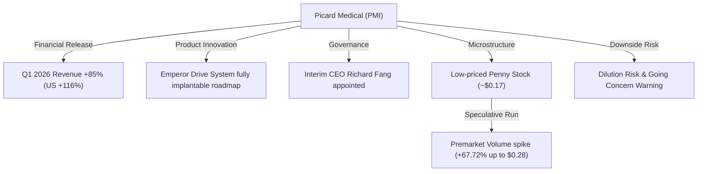
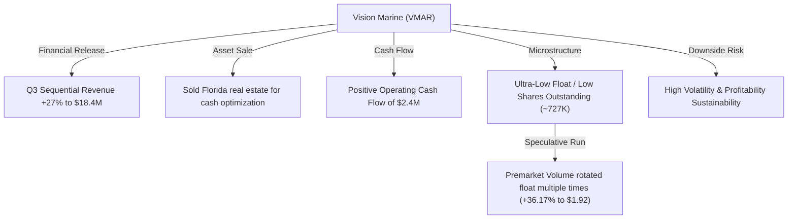
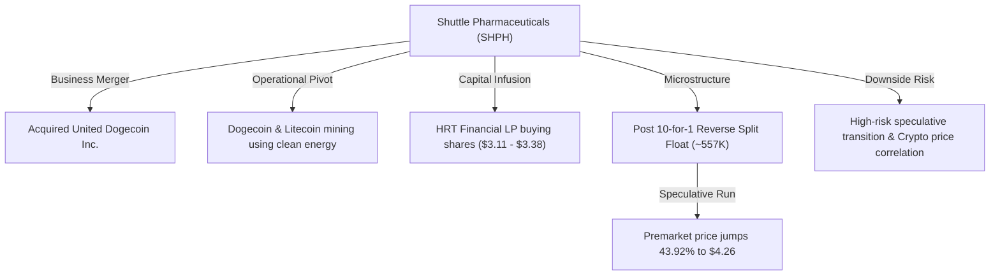
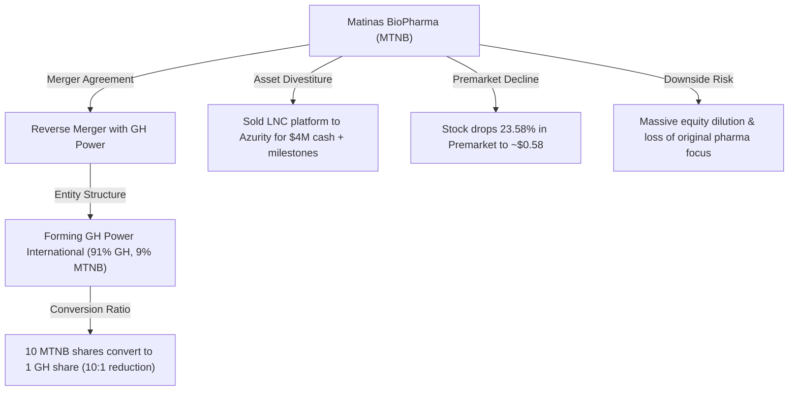
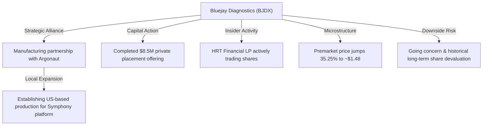

# 📊 Small-Cap & Penny Stock Intelligence Report
**Hedge Fund Trading Desk / Market Intelligence Division**  
**Date:** July 14, 2026  
**Market Stance:** High Premarket Volatility / Restructuring Mergers / Sector Rotations  

---

## 📈 Executive Summary

สภาวะการซื้อขายหลักทรัพย์กลุ่ม Small-Cap, Micro-Cap และ Penny Stocks ในตลาดสหรัฐฯ ก่อนเปิดตลาด (Premarket) ประจำวันที่ 14 กรกฎาคม 2026 เผชิญกับความผันผวนและความคึกคักอย่างโดดเด่น ท่ามกลางกระแสความตื่นตัวของแผนการควบรวมกิจการข้ามสายธุรกิจ (Reverse Mergers), ผลประกอบการไตรมาสล่าสุดที่รายงานตัวเลขเติบโตแข็งแกร่ง และการปรับเปลี่ยนโครงสร้างธุรกิจเชิงลึกของบริษัทจดทะเบียนขนาดเล็กหลายราย

ในวันนี้ ภาพรวมดัชนีหลักเผชิญความผันผวนจากประเด็นความตึงเครียดทางเศรษฐกิจและการหมุนเวียนกลุ่มอุตสาหกรรม (Sector Rotation) ส่งผลให้นักลงทุนเก็งกำไรระยะสั้นและ Day Traders เลือกที่จะย้ายสภาพคล่องเข้าสู่ตลาดหุ้นขนาดเล็กที่มีระดับราคาสูงไม่เกิน $5 ดอลลาร์ และมีจำนวนหุ้นหมุนเวียนในระบบต่ำ (Low Float) ซึ่งส่งผลให้เกิดการดีดตัวของโมเมนตัมราคาอย่างรุนแรง

รายงานวิจัยฉบับนี้ทำการวิเคราะห์เชิงลึกหุ้นขนาดเล็ก 5 ตัวที่มีความเคลื่อนไหวทางราคาและปริมาณการซื้อขายหนาแน่นผิดปกติ ได้แก่ **PMI**, **VMAR**, **SHPH**, **MTNB** และ **BJDX** เพื่อจัดสรรข้อมูลประกอบการตัดสินใจแก่นักลงทุนในแง่มุมของการวิเคราะห์ความเสี่ยงและโครงสร้างโครงสร้างจุลภาคของตลาด (Market Microstructure)

---

## 🔬 In-Depth Stock Analysis

### 1️⃣ Picard Medical, Inc. (NYSE American: PMI)
*SynCardia Artificial Heart Roadmap & Q1 Revenue Growth Surge*

#### **1. Company Overview**
*   **Sector / Industry:** Healthcare / Medical Devices (SynCardia Systems LLC)
*   **Market Cap:** ~$15.10 Million USD
*   **Current Price:** $0.17 (ราคาปิดตลาดปกติ ณ วันที่ 13 กรกฎาคม 2026, ราคาดีดตัวในพรีมาร์เก็ตวันที่ 14 กรกฎาคม ขึ้นแตะระดับ ~$0.28 หรือ +67.72%)
*   **Average Volume (30D):** ~1.50 Million shares (โดยวอลุ่มสะสมในพรีมาร์เก็ตเช้านี้เร่งตัวขึ้นกว่า 8.20 ล้านหุ้น)
*   **Float:** ~39.51 Million shares
*   **Short Float %:** ~7.67% ของ Float
*   **Shares Outstanding:** ~92.35 Million shares
*   **Institutional Ownership:** ~10%
*   **Insider Ownership:** ~25%

#### **2. Price Action Analysis**
*   **Movement:** ราคาหุ้นปิดเซสชันวันที่ 13 กรกฎาคม ที่ระดับ $0.17 เพิ่มขึ้น +20.36% ก่อนที่จะเผชิญแรงซื้อหนาแน่นดันราคาขึ้นทดสอบแนวต้านจิตวิทยาที่ $0.28 ในพรีมาร์เก็ตเช้าวันนี้ สะท้อนปฏิกิริยาเชิงบวกต่อแผนพัฒนาผลิตภัณฑ์หลัก
*   **Microstructure:** ในฐานะหุ้น Penny Stock ที่ระดับราคาต่ำกว่า $0.50 ทำให้มีการกระโดดของสเปรดซื้อขายที่รวดเร็ว (Spread Expansion) และการเคลื่อนไหวได้รับแรงหนุนได้ง่ายเมื่อมีกระแสความตื่นตัวของรายย่อยเข้ามาปะทะหน้าพอร์ต
*   **Liquidity Quality:** สเปรด Bid-Ask กว้างขึ้นในช่วงพรีมาร์เก็ต ส่งผลให้เกิดความผันผวนของราคาจับคู่ นักเทรดควรใช้ Limit Order แทน Market Order เพื่อลดผลกระทบจาก Slippage

#### **3. Volume Analysis**
*   **Relative Volume (RVOL):** พุ่งขึ้นทดสอบระดับ **12.5x** ของระดับปกติ
*   **Volume Spike:** ปริมาณซื้อขายหนาแน่นกว่า 8.2 ล้านหุ้นก่อนตลาดเปิด ชี้ว่ามีการกระจุกตัวของความสนใจอย่างมีนัยสำคัญจากนักลงทุนรายย่อยและระบบ HFT
*   **Smart Money Signal:** ยังไม่พบข้อมูลการทำรายการบล็อกเทรดขนาดใหญ่จากกองทุนสถาบันรายปี ทิศทางราคายังถูกขับเคลื่อนด้วยแรงเก็งกำไรระยะสั้นตามกระแสข่าวอัปเดต (Momentum Chasing)

#### **4. News & Catalyst Analysis**
*   **2026 Annual Meeting Investor Presentation (July 17, 2026):** บริษัทเผยแพร่ข้อมูลที่จะเสนอต่อที่ประชุมสามัญผู้ถือหุ้นประจำปีในวันที่ 17 กรกฎาคมนี้ โดยข้อมูลสำคัญได้แก่:
    *   **รายได้เติบโตแข็งแกร่ง:** รายได้ของ SynCardia Systems (บริษัทย่อย) ประจำ Q1 2026 เติบโตขึ้น 85% YoY โดยยอดขายในประเทศสหรัฐฯ เติบโตแบบก้าวกระโดดถึง 116% YoY
    *   **Emperor Drive System:** การเปิดเผยทิศทาง Roadmap ของโครงการหัวใจเทียมที่สามารถฝังในตัวคนไข้ได้สมบูรณ์แบบ (Fully Implantable Artificial Heart)
    *   **Interim CEO Appointment:** การแต่งตั้ง Richard Fang ขึ้นมาทำหน้าที่ Interim CEO เพื่อเร่งการพัฒนาและอนุมัติทางการแพทย์สำหรับอุปกรณ์รุ่นใหม่

#### **5. Financial Health**
*   **Revenue Growth & Cash Burn:** แม้อัตราการเติบโตของรายได้จะอยู่ในระดับสูง แต่บริษัทยังคงมีผลประกอบการขาดทุนสะสมและยังไม่ถึงจุดคุ้มทุน (Unprofitable) ส่งผลให้มีความเปรียบด้านสภาพคล่อง และอาจต้องดำเนินการระดมทุนเสนอขายหุ้นเพิ่มเติม (Equity Offering/Dilution) เพื่อจัดหาทุนหมุนเวียนในการวิจัยและผลิตหัวใจเทียม
*   **Dilution Risk:** **ระดับสูงมาก (Extremely High Dilution Risk)** เนื่องจากโครงสร้างทางการเงินที่ตึงตัวและจำเป็นต้องพึ่งพาสภาพคล่องภายนอกอย่างต่อเนื่อง

#### **6. Market Sentiment**
*   **Retail Sentiment:** บรรยากาศเป็นไปในเชิงบวกอย่างร้อนแรง (Extremely Bullish) บนแพลตฟอร์ม Reddit และ Stocktwits เนื่องจากเป็นข่าวความก้าวหน้าทางวิศวกรรมทางการแพทย์ที่ได้รับความสนใจสูง
*   **Speculative Level:** การเก็งกำไรระดับสูง นักลงทุนคาดหวังแรงส่งจากการตอบรับแผนงาน Emperor Drive System ในวันประชุมผู้ถือหุ้น

#### **7. Technical Analysis**
*   **Trend Structure:** กราฟราคาทะลุกรอบสะสมตัวเดิม และยืนเหนือเส้น EMA 50/200 ในกราฟรายชั่วโมง โดยมีเป้าหมายทดสอบระดับราคาสูงสุดที่ $0.28
*   **Indicators:** RSI ในกราฟ 15 นาที ขึ้นสู่ระดับ 82 (Overbought) ชี้ถึงภาวะซื้อมากเกินไปชั่วคราวและอาจเกิดจังหวะ Pullback กลับมาสร้างฐานบริเวณแนวรับ $0.20
*   **Support/Resistance:** แนวรับ: $0.20, $0.17 / แนวต้าน: $0.28, $0.35

#### **8. Risk Analysis & Rating**
*   **Risk Level: ความเสี่ยงระดับสูงสุด (Extremely High Risk)**
*   **Threats:** ความผันผวนจากการเคลื่อนย้ายเงินทุนของรายย่อยในหุ้นราคาต่ำ และความเสี่ยงในการออกตราสารเพิ่มทุนเพื่อดึงกระแสเงินสดเข้ามาช่วยพยุงฐานะการเงิน

---

### 2️⃣ Vision Marine Technologies Inc. (NASDAQ: VMAR)
*Seq Revenue Growth Q3 & Florida Asset Liquidation Cash Injection*

#### **1. Company Overview**
*   **Sector / Industry:** Industrials / Marine Ship & Boat Building (Electric propulsion)
*   **Market Cap:** ~$1.00 Million USD
*   **Current Price:** $1.41 (ราคาปิดตลาดปกติ ณ วันที่ 13 กรกฎาคม 2026, ราคาดีดตัวในพรีมาร์เก็ตวันที่ 14 กรกฎาคม แตะระดับ ~$1.92 หรือ +36.17%)
*   **Average Volume (30D):** ~250,000 shares (ปริมาณการซื้อขายในพรีมาร์เก็ตพุ่งกระฉูดถึง 13.23 ล้านหุ้น ซึ่งมากกว่าจำนวนหุ้นทั้งหมดของบริษัทหลายเท่าตัว)
*   **Float:** ~650,000 shares (สัดส่วนหุ้นลอยต่ำมาก)
*   **Short Float %:** ~81.75% ของ Float (สะท้อนแรงบีบซื้อคืนจากผู้เล่นฝั่งขายชอร์ตที่สูงเป็นประวัติการณ์)
*   **Shares Outstanding:** ~727,000 shares
*   **Institutional Ownership:** ~12%
*   **Insider Ownership:** ~15%

#### **2. Price Action Analysis**
*   **Movement:** ราคาปิดตลาดวานนี้อยู่ที่ $1.41 โดยมีการปรับตัวสูงขึ้นอย่างโดดเด่นสู่ระดับ $1.92 หรือบวกขึ้นกว่า +36.17% ในพรีมาร์เก็ตเช้านี้ หลังรายงานผลประกอบการแสดงการฟื้นตัวที่แข็งแกร่ง
*   **Microstructure:** ด้วยความที่บริษัทเป็นหุ้น Micro-cap ที่มี Float เบาบางมากเพียง 6.5 แสนหุ้น การมีแรงสั่งซื้อหนาแน่นผิดปกติกว่า 13 ล้านหุ้นทำให้เกิดการหมุนรอบ Free Float ในพรีมาร์เก็ตมากกว่า 18 ครั้ง ส่งผลให้ราคาเกิดการบีบตัวทำ Short Squeeze อย่างฉับพลัน
*   **Liquidity Quality:** แม้มีวอลุ่มหนาแน่นมากในช่วง Premarket แต่ด้วยกลไก Short Squeeze ทำให้การเหวี่ยงของราคา Bid-Ask มีช่วงที่กว้างมากและเสี่ยงต่อการดิ่งตัวลงอย่างรวดเร็ว (Flash Drop Risk) หากแรงซื้อชะลอลง

#### **3. Volume Analysis**
*   **Relative Volume (RVOL):** พุ่งขึ้นทะลุขีดจำกัดกว่า **50.0x** ของระดับปกติ
*   **Volume Spike:** การเพิ่มขึ้นของวอลุ่มเทรดใน Premarket วันนี้สะท้อนลักษณะ Panic Buying จากรายย่อยและระบบบอทเทรดดิ้งที่ตรวจจับทริกเกอร์ของ Short Squeeze
*   **Smart Money Signal:** สัญญาณที่ดีคือบริษัทพลิกกลับมามีกระแสเงินสดบวกจากการดำเนินงาน และปิดการขายทรัพย์สินอาคารในฟลอริดา ซึ่งได้รับการตอบรับเชิงบวกจากนักวิเคราะห์สถาบัน

#### **4. News & Catalyst Analysis**
*   **Q3 Fiscal 2026 Financial Results (July 13, 2026):**
    *   **รายได้เติบโตแข็งแกร่ง:** รายงานรายได้ Q3 สิ้นสุดเดือนพฤษภาคม 2026 ที่ $18.4 Million USD เติบโตขึ้น 27% แบบ sequential เมื่อเทียบกับ $14.5 Million ใน Q2
    *   **รายได้เก้าเดือนแรก:** สะสมสูงถึง $48.6 Million พร้อมอัตรากำไรขั้นต้น (Gross Profit) ที่ $11.8 Million (Margin 24.3%)
    *   **กระแสเงินสดกลับมาเป็นบวก:** รายงานกระแสเงินสดจากการดำเนินงาน (Operating Cash Flow) พพลิกกลับมาเป็นบวกได้ที่ $2.4 Million จากการจัดการสินค้าคงคลังที่ดีขึ้นและค่าใช้จ่าย Floorplan Financing ที่ลดลง
    *   **การขายทรัพย์สิน:** ลงนามในสัญญาขายที่ดินอาคารใน Fort Lauderdale เพื่อดึงกระแสเงินสดกลับเข้ามาใช้ในการขยายธุรกิจหลัก

#### **5. Financial Health**
*   **Revenue Growth & Cash Position:** ตัวเลขทางการเงินของ VMAR ดีขึ้นอย่างเห็นได้ชัด การมีกระแสเงินสดจากการดำเนินงานที่เป็นบวกช่วยปลดล็อกความกังวลระยะสั้นได้ดี แต่ยังจำเป็นต้องประเมินอัตรากำไรสุทธิขั้นสุดท้าย (Net Profitability) ว่าจะสามารถรักษาความต่อเนื่องได้หรือไม่
*   **Dilution Risk:** **ระดับปานกลาง** จากการได้เงินสดจากการขายที่ดินช่วยพยุงสภาพคล่อง ส่งผลลดความตึงตัวในการออกเครื่องมือระดมทุนเสนอขายหุ้นใหม่ระยะสั้น

#### **6. Market Sentiment**
*   **Retail Sentiment:** บรรยากาศการเก็งกำไรมีความคึกคักอย่างยิ่ง (Extremely Bullish) มีการแชร์ข้อมูลตัวเลขงบการเงินและสถิติ Short Squeeze บนบอร์ด Stocktwits และ X กันอย่างคึกคัก
*   **Speculative Level:** การเก็งกำไรระดับสูงสุด เนื่องจากตัวหุ้นมีขนาดเล็กมากและตกอยู่ในภาวะราคาขึ้นแรงแบบมีแรงบีบชอร์ตเซลล์ (Short Squeeze Play)

#### **7. Technical Analysis**
*   **Trend Structure:** กราฟราคาทะลุผ่านแนวต้านสำคัญที่ $1.50 และ EMA 200 ในกราฟรายชั่วโมง โดยกำลังพยายามทดสอบระดับต้านจิตวิทยาที่ $2.00
*   **Indicators:** RSI ในกราฟ 15 นาที ขยับเข้าสู่เขตซื้อมากเกินไปที่ 85 แนะนำระวังแรงขายทำกำไรดึงราคากลับมาทดสอบฐานแนวรับที่ $1.70 และ $1.65
*   **Support/Resistance:** แนวรับ: $1.65, $1.50 / แนวต้าน: $2.00, $2.20

#### **8. Risk Analysis & Rating**
*   **Risk Level: ความเสี่ยงระดับสูง (High Risk)**
*   **Threats:** ความเสี่ยงในการปรับฐานราคาหลังเปิดตลาดเนื่องจากแรงเทขายทำกำไรของนักลงทุนกลุ่มก่อนหน้า และผลประกอบการระยะยาวยังคงต้องรอการพิสูจน์ความยั่งยืน

---

### 3️⃣ Shuttle Pharmaceuticals Holdings, Inc. (NASDAQ: SHPH)
*United Dogecoin Merger Transition & Green-Energy Crypto Mining Scale*

#### **1. Company Overview**
*   **Sector / Industry:** Technology / Cryptocurrency Mining (เดิมดำเนินธุรกิจ Healthcare / Drug Manufacturers)
*   **Market Cap:** ~$1.90 Million USD
*   **Current Price:** $2.96 (ราคาปิด ณ วันที่ 13 กรกฎาคม 2026, ราคาเคลื่อนไหวพุ่งตัวในพรีมาร์เก็ตวันที่ 14 กรกฎาคม แตะระดับ ~$4.26 หรือ +43.92%)
*   **Average Volume (30D):** ~950,000 shares (ปริมาณซื้อขายในพรีมาร์เก็ตเช้านี้ดีดตัวขึ้นทดสอบ 3.5 ล้านหุ้น)
*   **Float:** ~557,000 shares (ภายหลังจากเสร็จสิ้นกระบวนการทำ Reverse Split เพื่อรักษาคุณสมบัติการจดทะเบียนในตลาด Nasdaq)
*   **Short Float %:** ~26.5% ของ Float
*   **Shares Outstanding:** ~637,000 shares
*   **Institutional Ownership:** ~8%
*   **Insider Ownership:** ~18% (โดยมี HRT Financial LP รายงานฐานะถือครองเกิน 10%)

#### **2. Price Action Analysis**
*   **Movement:** ราคาปิดปกติอยู่ที่ $2.96 โดยราคาปรับตัวขึ้นแรงใน Premarket แตะระดับ $4.26 (+43.92%) จากกระแสข่าวที่เก็งกำไรในฝั่งผู้ขุดสินทรัพย์ดิจิทัล
*   **Microstructure:** ด้วยสัดส่วนหุ้นหมุนเวียน Free Float ที่จำกัดหลังการควบรวมและการบีบอัดหุ้น (Reverse split 10:1) ทำให้จำนวนวอลุ่มซื้อที่ไม่สูงมากนักก็สามารถเปลี่ยนตำแหน่งราคาได้อย่างรวดเร็ว
*   **Liquidity Quality:** สภาพคล่องยังคงอยู่ในเกณฑ์เบาบางในระดับราคานี้ ค่า Bid-Ask Spread กว้าง การทำรายการขนาดใหญ่มีโอกาสเกิด Slippage สูง

#### **3. Volume Analysis**
*   **Relative Volume (RVOL):** ขยายตัวอย่างเห็นได้ชัดแตะระดับ **6.2x**
*   **Volume Spike:** ปริมาณซื้อขายพุ่งสูงสอดรับพฤติกรรมการเข้าถือครองของสถาบันที่รายงานธุรกรรมในพรีมาร์เก็ต
*   **Smart Money Signal:** รายงานแบบฟอร์ม SEC Form 4 ล่าสุดระบุว่า **HRT Financial LP** เข้าช้อนซื้อสะสมต่อเนื่องในช่วงวันที่ 9-10 กรกฎาคม ที่ราคาระหว่าง $3.11 ถึง $3.38 รวมกว่า 8,997 หุ้น สะท้อนถึงการเข้ามาสะสมหุ้นจากสถาบันการเงินเพื่อผลประโยชน์ระยะสั้น

#### **4. News & Catalyst Analysis**
*   **United Dogecoin Merger & Renewable Energy Crypto Mining:**
    *   **การควบรวมกิจการเสร็จสมบูรณ์:** บริษัทปิดดีลการควบรวมกิจการกับ United Dogecoin Inc. เป็นที่เรียบร้อย ส่งผลให้บริษัทเปลี่ยนทิศทางธุรกิจจากการวิจัยยากลุ่มโรคมะเร็งแบบดั้งเดิมไปสู่ธุรกิจเหมืองขุดสินทรัพย์ดิจิทัล Dogecoin (DOGE) และ Litecoin (LTC)
    *   **โครงการขุดพลังงานสะอาด:** บริษัทประกาศแผนการดำเนินฟาร์มขุดโดยใช้พลังงานหมุนเวียนจากเขื่อนน้ำในรัฐไอดาโฮ ซึ่งระบุถึงอัตราต้นทุนพลังงานที่ค่อนข้างต่ำประมาณ $0.064 ต่อกิโลวัตต์ชั่วโมง ซึ่งถือเป็นจุดแข็งในการบริหารต้นทุนระยะยาว

#### **5. Financial Health**
*   **Capital Runway & Capex:** ธุรกิจเหมืองขุดเป็นธุรกิจที่ต้องการเม็ดเงินลงทุนก้อนใหญ่ในการจัดซื้ออุปกรณ์ขุดและปรับโครงสร้างระบบไฟฟ้า ถึงแม้จะมีทุนเข้ามาช่วยบางส่วน แต่บริษัทยังคงมีหนี้สินค้างจ่ายและผลการขาดทุนสะสมจากการดำเนินธุรกิจยากลุ่มเดิม
*   **Dilution Risk:** **ระดับสูง (High Dilution Risk)** คาดว่าบริษัทจะมีการใช้เครื่องมือ At-The-Market (ATM) เสนอขายหุ้นสามัญเพิ่มอีกในระยะถัดไปเพื่อนำเงินทุนมาซื้อเครื่องขุดขยายฟาร์ม

#### **6. Market Sentiment**
*   **Retail Sentiment:** บรรยากาศเป็นลักษณะเก็งกำไรตื่นตัวสูง (Highly Bullish / Meme Speculation) เนื่องจากรายย่อยและนักเทรดบน Reddit มักตอบสนองต่อประเด็น "Dogecoin Mining" ได้รวดเร็ว
*   **Speculative Level:** การเก็งกำไรในระดับสูงสุด (Extreme Speculation) จากกระแสปรับปรุงทิศทางธุรกิจแบบกะทันหัน

#### **7. Technical Analysis**
*   **Trend Structure:** กราฟระดับราคาสามารถยืนยันฐานเหนือกฎเกณฑ์ $1.00 ได้อย่างสมบูรณ์แบบหลังทำ Reverse split และในวันนี้ดีดตัวพ้นเส้น VWAP ขึ้นไปตั้งฐานบริเวณ $4.00
*   **Indicators:** RSI ในกรอบรายชั่วโมงพุ่งเข้าสู่เขตซื้อมากเกินไปที่ 78 บ่งชี้ว่าราคาอยู่ในโซนตึงตัว และมีโอกาสปรับฐานลงมาทดสอบระดับแนวรับ $3.50
*   **Support/Resistance:** แนวรับ: $3.50, $3.00 / แนวต้าน: $4.50, $5.00

#### **8. Risk Analysis & Rating**
*   **Risk Level: ความเสี่ยงระดับสูงสุด (Extremely High Risk)**
*   **Threats:** ความผันผวนสูงลิ่วจากการผูกติดกับราคาเหรียญ Dogecoin/Litecoin และความเสี่ยงในการเปลี่ยนทิศทางโมเดลธุรกิจแบบกะทันหันซึ่งต้องการเงินทุน Capex มหาศาล

---

### 4️⃣ Matinas BioPharma Holdings, Inc. (NYSE American: MTNB)
*Business Combination with GH Power & Drug Platform Divestiture*

#### **1. Company Overview**
*   **Sector / Industry:** Healthcare / Biotechnology (อยู่ระหว่างเปลี่ยนทิศทางไปสู่อุตสาหกรรมพลังงานสะอาด)
*   **Market Cap:** ~$4.90 Million USD
*   **Current Price:** $0.7553 (ราคาปิด ณ วันที่ 13 กรกฎาคม 2026, ราคาดิ่งลงในพรีมาร์เก็ตวันที่ 14 กรกฎาคม สู่ระดับ ~$0.58 หรือ -23.58%)
*   **Average Volume (30D):** ~2.30 Million shares (โดยวอลุ่มเทรดในช่วงพรีมาร์เก็ตเช้านี้เพิ่มขึ้นอย่างมีนัยสำคัญจากแรงขายตกใจ)
*   **Float:** ~5.20 Million shares
*   **Short Float %:** ~0.39% ของ Float
*   **Shares Outstanding:** ~6.41 Million shares
*   **Institutional Ownership:** ~15%
*   **Insider Ownership:** ~5%

#### **2. Price Action Analysis**
*   **Movement:** หลังจากที่ราคาหุ้นปรับตัวบวกขึ้นมากว่า 20.46% ไปปิดที่ $0.7553 ในช่วงปลายสัปดาห์ก่อนหน้านี้จากการเก็งข้อตกลง ในเช้าวันนี้ราคาหุ้นเกิดการร่วงลงอย่างรวดเร็วถึง -23.58% สู่ระดับ $0.58 ใน Premarket ทันทีที่นักลงทุนคำนวณอัตราแลกหุ้นและสัดส่วนความเป็นเจ้าของ
*   **Microstructure:** เกิดแรงเทขายหนาแน่นเนื่องจากกลไก "Sell on Fact" และการปรับพอร์ตของกองทุนด้านชีวภาพที่ไม่มีนโยบายถือหุ้นกลุ่มพลังงานสะอาด
*   **Liquidity Quality:** สภาพคล่องในการรับซื้อ (Bid liquidity) เบาบางลงอย่างรวดเร็ว ทำให้ออเดอร์ขายขนาดใหญ่สามารถผลักดันราคาให้ร่วงลงไปได้ลึก

#### **3. Volume Analysis**
*   **Relative Volume (RVOL):** พุ่งสูงกว่า **8.5x** ของระดับปกติ
*   **Volume Spike:** การร่วงลงของราคาหุ้นมาพร้อมกับปริมาณการซื้อขายที่สูง บ่งชี้ว่าเป็นแรงเทขายจริงจากผู้ถือครองเดิม (Distribution Volume)
*   **Smart Money Signal:** การปิดดีลเสนอขายหุ้นบุริมสิทธิ Series D และใบสำคัญแสดงสิทธิ (Warrants) ร่วมกับการตกลงขายสินทรัพย์ LNC สะท้อนการดึงเม็ดเงินสดเข้ามาพยุงการควบรวมกิจการ

#### **4. News & Catalyst Analysis**
*   **Merger with GH Power & Azurity Asset Sale (July 10-13, 2026):**
    *   **ดีลควบรวมกิจการย้อนศร (Reverse Merger):** ลงนามข้อตกลงควบรวมกับ **GH Power** (บริษัทพัฒนาเตาปฏิกรณ์ไฮโดรเจนจากแคนาดา) จัดตั้งบริษัทใหม่ชื่อ **GH Power International** จดทะเบียนบน NYSE American
    *   **ผลกระทบสัดส่วนหุ้น:** ผู้ถือหุ้น GH Power จะถือหุ้น 91% ในขณะที่ผู้ถือหุ้น Matinas เดิมจะเหลือสัดส่วนเพียง **9%** เท่านั้น
    *   **อัตราส่วนการแปลงหุ้น:** หุ้น MTNB ทุกๆ 10 หุ้น จะถูกแปลงเป็นหุ้นของบริษัทใหม่เพียง 1 หุ้น (เสมือนการบีบอัด 10:1 หรือ 0.1 Conversion Ratio)
    *   **การขายสินทรัพย์ยา:** บริษัทขายบริษัทย่อย Matinas BioPharma Nanotechnologies (รวมถึงแพลตฟอร์ม LNC และยา MAT2203) ให้แก่ **Azurity Pharmaceuticals** แลกกับเงินสดล่วงหน้า $4.0 Million USD และสิทธิ์รับเงินปันผล/ความสำเร็จทางยาเพิ่มอีกไม่เกิน $17.5 Million

#### **5. Financial Health**
*   **Capital Runway & Financial Restructuring:** การขายสินทรัพย์หลักช่วยเพิ่มเงินสดเข้ามา $4 ล้านเหรียญ แต่การเข้าควบรวมกับ GH Power กำหนดเงื่อนไขว่า GH Power ต้องสามารถจัดหาทุนใหม่ได้ไม่ต่ำกว่า $15 Million ซึ่งงบการเงินในอนาคตจะเปลี่ยนทิศทางไปสู่อุตสาหกรรมพลังงานอย่างสิ้นเชิง
*   **Dilution Risk:** **ระดับสูงสุด (Extremely High Dilution Risk)** ผู้ถือหุ้นเดิมถูกเจือจางสิทธิ์ลงเหลือเพียง 9% ในบริษัทใหม่

#### **6. Market Sentiment**
*   **Retail Sentiment:** บรรยากาศเป็นลบอย่างชัดเจน (Extremely Bearish / Disappointed) เนื่องจากรายย่อยและนักลงทุนสายชีวภาพรู้สึกผิดหวังกับการเจือจางหุ้นและความตกลงที่เปลี่ยนแกนธุรกิจไปเป็นกลุ่มพลังงานสีเขียว
*   **Speculative Level:** การเก็งกำไรในทิศทางลง (Shorting / Hedging Activity)

#### **7. Technical Analysis**
*   **Trend Structure:** กราฟราคาทะลุแนวรับสำคัญที่ $0.70 และกำลังหลุดลงต่ำกว่าเส้นค่าเฉลี่ยสั้นและยาวลงไปทดสอบระดับรับจิตวิทยาที่ $0.55
*   **Indicators:** RSI ปักหัวลงอย่างรวดเร็วสู่ระดับ 35 ชี้วัดแรงขายที่เป็นผู้ควบคุมทิศทางตลาด
*   **Support/Resistance:** แนวรับ: $0.55, $0.50 / แนวต้าน: $0.70, $0.75

#### **8. Risk Analysis & Rating**
*   **Risk Level: ความเสี่ยงระดับสูงสุด (Extremely High / Merger Risk)**
*   **Threats:** ความเสี่ยงในการดำเนินธุรกรรมการควบรวมกิจการไม่สำเร็จ และความเสี่ยงในการเจือจางมูลค่าสิทธิ์ของผู้ถือหุ้นเดิมถึง 91%

---

### 5️⃣ Bluejay Diagnostics, Inc. (NASDAQ: BJDX)
*Argonaut Manufacturing Agreement & Point-of-Care Diagnostics Rollout*

#### **1. Company Overview**
*   **Sector / Industry:** Healthcare / Diagnostics & Research
*   **Market Cap:** ~$3.50 Million USD
*   **Current Price:** $1.10 (ราคาปิด ณ วันที่ 13 กรกฎาคม 2026, ราคาพุ่งขึ้นใน Premarket วันที่ 14 กรกฎาคม แตะระดับ ~$1.48 หรือ +35.25%)
*   **Average Volume (30D):** ~450,000 shares (วอลุ่ม Premarket วันนี้เพิ่มขึ้นทดสอบระดับ 2.1 ล้านหุ้น)
*   **Float:** ~972,000 shares (Low Float)
*   **Short Float %:** ~20.14% ของ Float
*   **Shares Outstanding:** ~1.03 Million shares
*   **Institutional Ownership:** ~5%
*   **Insider Ownership:** ~10% (HRT Financial LP รายงานสถานะถือครองเกิน 10% และมีการทำธุรกรรมบ่อยครั้ง)

#### **2. Price Action Analysis**
*   **Movement:** ราคาปิดปกติอยู่ที่ $1.10 และในตลาดพรีมาร์เก็ตเช้านี้ขยับพุ่งแรงขึ้นสู่ $1.48 (+35.25%) เพื่อพยายามฟื้นตัวจากทิศทางขาลงยาวนาน
*   **Microstructure:** สัดส่วนหุ้นหมุนเวียน Free Float ที่ต่ำมากต่ำกว่า 1 ล้านหุ้น ทำให้เมื่อมีคำสั่งซื้อปะทะเข้ามา ส่งผลให้ราคาเกิดการปรับตัวขึ้นอย่างรวดเร็ว และไปกระตุ้นกลุ่มบัญชีชอร์ตที่ถือครองสถานะไว้ก่อนหน้าให้ต้องจำใจตัดขาดทุน
*   **Liquidity Quality:** สภาพคล่องยังคงเปราะบางตามรูปแบบ Micro-cap หุ้นที่มีลักษณะนี้มักมีแรงซื้อกระจุกตัวเฉพาะช่วงสั้นๆ และขาดความต่อเนื่องในการประคองราคา

#### **3. Volume Analysis**
*   **Relative Volume (RVOL):** ขยับขึ้นมาที่ **5.8x**
*   **Volume Spike:** การเข้าเก็งกำไรในเช้าวันนี้ได้รับการกระตุ้นจากความหวังในการเติบโตของการตั้งสายผลิตในสหรัฐฯ
*   **Smart Money Signal:** รายงานเอกสาร Form 4 ยืนยันการทำธุรกรรมของ **HRT Financial LP** ที่มีการเข้าซื้อ 64,047 หุ้นในวันที่ 9 กรกฎาคม และขายสลับทำรอบ 34,938 หุ้นในวันที่ 10 กรกฎาคม สะท้อนพฤติกรรมทำรอบเก็งกำไรระยะสั้นในหุ้น Low Float ของกองทุนขนาดกลาง

#### **4. News & Catalyst Analysis**
*   **Argonaut Manufacturing Agreement & Capitalization:**
    *   **ข้อตกลงการผลิตกับ Argonaut:** การลงนามร่วมเป็นพันธมิตรกับ Argonaut Manufacturing Services เพื่อสร้างฐานการผลิตผลิตภัณฑ์ Symphony System ในสหรัฐฯ ซึ่งช่วยสนับสนุนห่วงโซ่อุปทานและเร่งกระบวนการจัดจำหน่ายในระดับท้องถิ่น
    *   **การเพิ่มความเชื่อมั่นทางการเงิน:** ความสำเร็จของดีลระดมทุนเสนอขายหุ้นเฉพาะกลุ่ม (Private Placement) มูลค่า $8.5 Million ในช่วงก่อนหน้านี้ ช่วยบรรเทาความกังวลด้านเงินสดสั้นๆ
    *   **Reverse Split Background:** การทำ 1-for-4 Reverse split ในเดือนมกราคม 2026 ช่วยล้างราคาและพยุงราคากลับขึ้นพ้นข้อกำหนด Nasdaq

#### **5. Financial Health**
*   **Revenue Growth & Cash Burn:** แม้จะได้กระแสเงินสด $8.5 ล้านเหรียญเข้ามาช่วยต่ออายุ แต่ผลขาดทุนสุทธิของบริษัทยังคงอยู่ในระดับที่น่ากังวล ความสามารถในการเปลี่ยนยอดขายของระบบ Symphony ให้เป็นกระแสเงินสดบวกยังคงเป็นโจทย์ท้าทายหลัก
*   **Dilution Risk:** **ระดับสูง (High Dilution Risk)** เนื่องจากยังมีตราสารแปลงสภาพและใบสำคัญแสดงสิทธิที่รอการแปลงสภาพอีกหลายรายการ

#### **6. Market Sentiment**
*   **Retail Sentiment:** บรรยากาศเป็นบวกในระยะสั้น (Short-term Bullish) บนเว็บบอร์ดรายย่อย เนื่องจากความสนใจในประเด็นการชอร์ตเซลล์ที่สูงถึง 20% และการขยับตัวของกองทุน HRT Financial LP
*   **Speculative Level:** เก็งกำไรระยะสั้นระดับสูงจากประเด็นการบีบซื้อคืนของผู้เล่นฝั่งขายชอร์ต (Short Squeeze Candidate)

#### **7. Technical Analysis**
*   **Trend Structure:** กราฟพยายามทำฐาน Double Bottom และฟื้นตัวขึ้นจากกรอบล่างของราคาใน Premarket โดยข้ามผ่านเส้นค่าเฉลี่ยสั้น EMA 20 ไปยังระดับ $1.48
*   **Indicators:** RSI ขยับตัวสูงขึ้นแตะ 65 ชี้โมเมนตัมเชิงบวกระยะสั้น แนวรับทางจิตวิทยาขยับขึ้นมาตั้งฐานแถว $1.20
*   **Support/Resistance:** แนวรับ: $1.20, $1.10 / แนวต้าน: $1.50, $1.75

#### **8. Risk Analysis & Rating**
*   **Risk Level: ความเสี่ยงระดับสูง (High Risk)**
*   **Threats:** ความเสี่ยงในการรักษาสถานะจดทะเบียนในตลาดหลักทรัพย์ Nasdaq หากราคาปรับฐานลดลง และผลการดำเนินงานหลักที่ยังไม่สามารถสร้างจุดคุ้มทุนได้ในระยะเวลาอันสั้น

---

## 🧠 สรุป Insight สำคัญ (Key Intelligence Summary)

*   **หุ้นที่มีปัจจัยพื้นฐานฟื้นตัวชัดเจนที่สุด:** **VMAR** (Vision Marine) รายงานตัวเลขการฟื้นตัวของงบดุลที่ดีที่สุดในวันนี้ ด้วยการเติบโตแบบ sequential 27% และการพลิกกลับมามีกระแสเงินสดจากการดำเนินงานที่เป็นบวก $2.4 ล้านดอลลาร์ ร่วมกับการได้รับกระแสเงินสดเพิ่มเติมจากการขายทรัพย์สิน
*   **หุ้นที่มีความเสี่ยงจากการถูกเจือจางมูลค่าสิทธิ์สูงสุด:** **MTNB** (Matinas BioPharma) เผชิญกับสภาวะเจือจางมูลค่าผู้ถือหุ้นเดิมถึง 91% ในโครงสร้างบริษัทใหม่ผ่านการ Reverse Merger กับ GH Power ร่วมกับการต้องแปลงหุ้น 10:1 (ลดสิทธิความเป็นเจ้าของอย่างรุนแรง)
*   **หุ้นที่เป็นกระแสมีมคริปโทฯ เก็งกำไรแบบหวือหวา:** **SHPH** (Shuttle Pharmaceuticals) จากการควบรวมกับ United Dogecoin การเปลี่ยนแกนธุรกิจไปเป็นขุดเหรียญมีมส่งผลให้ทิศทางราคาผูกติดกับราคาเหรียญ Dogecoin/Litecoin โดยตรง
*   **หุ้นที่มีความเคลื่อนไหวจาก Smart Money จริง:** **SHPH** และ **BJDX** มีรายงานการเคลื่อนไหวผ่าน SEC Form 4 จากกองทุน **HRT Financial LP** เข้าทำรายการทั้งซื้อสะสมและซื้อขายทำรอบเก็งกำไรระยะสั้นในตลาด
*   **หุ้น Penny Stock ต่ำสุดที่มี Catalyst รอคอย:** **PMI** (Picard Medical) มีการเปิดเผยสไลด์แผนงานการเติบโตของรายได้ Q1 2026 และโครงการหัวใจเทียมเต็มรูปแบบ เพื่อรอการนำเสนอจริงในการประชุมประจำปีวันที่ 17 กรกฎาคมนี้

---

## 🌐 แหล่งข้อมูลอ้างอิง (Sources)

1. **Picard Medical, Inc. (PMI):** SEC Form 8-K filings (dated July 13, 2026) regarding Investor Presentation, SynCardia Systems Q1 Financial Updates, and Executive Appointments on [sec.gov](https://www.sec.gov).
2. **Vision Marine Technologies (VMAR):** Fiscal Q3 2026 Financial Results and Fort Lauderdale real estate sale contract disclosures via [benzinga.com](https://www.benzinga.com) and [prnewswire.com](https://www.prnewswire.com) (July 13-14, 2026).
3. **Shuttle Pharmaceuticals Holdings, Inc. (SHPH):** SEC Form 4 filings regarding insider transaction by HRT Financial LP, 10-for-1 Reverse stock split notifications, and merger completion details with United Dogecoin Inc. via [sec.gov](https://www.sec.gov) and [investing.com](https://www.investing.com).
4. **Matinas BioPharma Holdings, Inc. (MTNB):** Definitive agreement of merger with GH Power and asset purchase agreement of LNC platform with Azurity Pharmaceuticals via [matinasbiopharma.com](https://www.matinasbiopharma.com) and [sec.gov](https://www.sec.gov) (July 10-13, 2026).
5. **Bluejay Diagnostics, Inc. (BJDX):** Manufacturing agreement with Argonaut Manufacturing Services, private placement completion details, and Form 4 insider filings by HRT Financial LP via [bluejaydx.com](https://www.bluejaydx.com) and [investing.com](https://www.investing.com).
6. **Real-time Premarket Prices and Market Statistics:** Live stock data as of July 14, 2026, obtained from NYSE American / Nasdaq real-time data feeds via [stockanalysis.com](https://www.stockanalysis.com) and [finviz.com](https://www.finviz.com).
