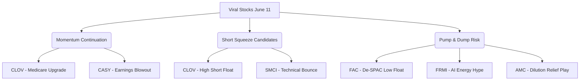

# 📊 US VIRAL STOCK INTELLIGENCE REPORT
*วิเคราะห์เจาะลึกข่าวสาร Sentiment, Capital Flow และกลยุทธ์การเทรดหุ้นสหรัฐที่กำลังเป็นกระแสในรอบ 24 ชั่วโมง*
**วันที่รายงาน:** 11 มิถุนายน 2026

---

## 🔥 1. TOP HOT STOCKS (หุ้นกระแสแรงในรอบ 24 ชั่วโมง)

ตลาดหุ้นสหรัฐฯ ในรอบ 24 ชั่วโมงที่ผ่านมาเผชิญความผันผวนสูงจากปัจจัยทางภูมิรัฐศาสตร์ (ความตึงเครียดสหรัฐฯ-อิหร่าน และราคาน้ำมันดิบ Brent ที่พุ่งสูงกว่า $94/บาร์เรล) ประกอบกับความกังวลเรื่องเงินเฟ้อ U.S. CPI และแรงขายทำกำไรในกลุ่มเทคโนโลยี/AI ส่งผลให้มีหุ้นรายตัวหลายตัวเคลื่อนไหวรุนแรงพร้อมวอลุ่มที่เพิ่มขึ้นผิดปกติ ดังนี้:

### 1. Super Micro Computer, Inc. (Ticker: SMCI)
*   **% การเปลี่ยนแปลงราคา:** ร่วงหนัก -27.98% (ปิดที่ $29.27 ในวันที่ 10 มิ.ย. หลังแตกหุ้น) ก่อนที่จะเริ่มมีแรงรีบาวด์และสร้างฐานในกรอบ $27.81 - $30.73 ในวันที่ 11 มิ.ย.
*   **Volume:** สูงถึง **191.35 ล้านหุ้น** (สูงกว่าค่าเฉลี่ย 3 เดือนถึง **316%**)
*   **สาเหตุหลัก:** บริษัทประกาศแผนจัดหาเงินทุน (Financing Plan) มูลค่า **7 พันล้านดอลลาร์** ผ่านการออกหุ้นใหม่ (Equity Offering) และตราสารหนี้แปลงสภาพ (Convertible Debt) เพื่อนำเงินไปรองรับยอดสั่งซื้อ AI Server ที่สูงเป็นประวัติการณ์
*   **👉 วิเคราะห์เชิงลึก:**
    *   *Hype หรือ Reasoned?:* **Reasoned** การปรับฐานเกือบ 28% สะท้อนความกังวลเรื่องการเจือจางหุ้น (Dilution Overhang) ที่สมเหตุสมผล เนื่องจากมูลค่าระดมทุนคิดเป็นสัดส่วนที่สูงมากเมื่อเทียบกับ Market Cap ปัจจุบัน อย่างไรก็ตาม ยอดสั่งซื้อที่หนาแน่นแสดงว่าความต้องการจริงยังมีอยู่มาก
    *   *โอกาสไปต่อ:* การรีบาวด์ในวันที่ 11 มิ.ย. เกิดจาก "Bargain Hunters" และแรงซื้อตามแนวรับทางเทคนิค การฟื้นตัวจะเป็นแบบค่อยเป็นค่อยไป แรงกดดันจากการไดลูทจะจำกัด Upside ในระยะสั้น

### 2. Oracle Corporation (Ticker: ORCL)
*   **% การเปลี่ยนแปลงราคา:** ดิ่งลงประมาณ -8% ถึง -12% ในช่วงข้ามคืน (เทรดในกรอบ $178 - $185 จากปิดเดิม $201.26)
*   **Volume:** สูงถึง **46.11 ล้านหุ้น** (สูงกว่าค่าเฉลี่ยปกติอย่างมาก)
*   **สาเหตุหลัก:** รายงานงบ Q4 FY2026 แม้กำไรและรายได้จะชนะคาดการณ์ (Beat) แต่ตลาดตื่นตระหนกกับตัวเลข **Capital Expenditure (CapEx) ประจำปี FY2027 ที่บริษัทตั้งเป้าสูงถึง 7 หมื่นล้านดอลลาร์** เพื่อขยายโครงสร้างพื้นฐาน Data Center สำหรับ AI
*   **👉 วิเคราะห์เชิงลึก:**
    *   *Hype หรือ Reasoned?:* **Reasoned** ตลาดกังวลเรื่องกระแสเงินสดอิสระ (Free Cash Flow) ที่อาจลดลงและภาระหนี้ที่เพิ่มขึ้นจากการใช้จ่ายทุนมหาศาล
    *   *โอกาสไปต่อ:* ระยะสั้นหุ้นมีแนวโน้มพักตัวเพื่อปรับฐานมูลค่า (Valuation Reset) แต่ในระยะยาว CapEx ที่สูงนี้จะเป็นบวกต่อซัพพลายเออร์ชิปและเซิร์ฟเวอร์ (เช่น NVDA, SMCI)

### 3. Clover Health Investments Corp. (Ticker: CLOV)
*   **% การเปลี่ยนแปลงราคา:** พุ่งแรง +13.99% (ปิดที่ $4.89 หลังขึ้นไปทดสอบจุดสูงสุดที่ $5.14)
*   **Volume:** **24.10 ล้านหุ้น** (สูงกว่าค่าเฉลี่ยปกติอย่างมีนัยสำคัญ)
*   **สาเหตุหลัก:** ชนะคดีฟ้องร้องกับกระทรวงสาธารณสุข (HHS) ส่งผลให้หน่วยงาน CMS ประกาศปรับเพิ่มคะแนน **Medicare Star Rating** ของแผน PPO (Contract H5141) ขึ้นเป็น **4.5 ดาว** (จากเดิม 3.5 ดาว)
*   **👉 วิเคราะห์เชิงลึก:**
    *   *Hype หรือ Reasoned?:* **Highly Reasoned** คะแนน 4.5 ดาวจะทำให้บริษัทมีสิทธิ์ได้รับเงินโบนัสคุณภาพสูง (Quality Bonus Payments) จากรัฐบาลในปี 2027 ซึ่งครอบคลุมสมาชิกกว่า 97% ของบริษัท นี่คือจุดเปลี่ยนด้านปัจจัยพื้นฐานที่จะทำให้งบการเงินพลิกกลับมามีกำไรแข็งแกร่ง
    *   *โอกาสไปต่อ:* **มีโอกาสไปต่อสูงมาก** เนื่องจากนี่ไม่ใช่การเก็งกำไรเปล่า ๆ แต่เป็นข่าวดีระดับปลดล็อกศักยภาพทางการเงินของบริษัท

### 4. Casey's General Stores, Inc. (Ticker: CASY)
*   **% การเปลี่ยนแปลงราคา:** พุ่งทะยาน **+20.29%** ปิดที่ระดับสูงเป็นประวัติการณ์ที่ $915.60 - $917.47
*   **Volume:** หนาแน่นเป็นพิเศษเมื่อเทียบกับหุ้นกลุ่มค้าปลีกทั่วไป
*   **สาเหตุหลัก:** ประกาศงบ Q4 FY2026 ดีกว่าที่ตลาดคาดไว้อย่างมหาศาล โดยมี EPS อยู่ที่ $4.37 (คาดไว้ $3.31-$3.36) และรายได้แตะ $4.57 พันล้านดอลลาร์ (คาดไว้ $4.33 พันล้าน)
*   **👉 วิเคราะห์เชิงลึก:**
    *   *Hype หรือ Reasoned?:* **Reasoned** ผลประกอบการสะท้อนถึงความสามารถในการทำกำไรจากสินค้าภายในร้าน (Inside Sales เช่น อาหารปรุงสด เครื่องดื่ม) และการรักษา Margin ค่าน้ำมันได้ดี แม้ในภาวะเงินเฟ้อสูง
    *   *โอกาสไปต่อ:* ด้วยความแข็งแกร่งของปัจจัยพื้นฐาน หุ้นมีโอกาสสร้างฐานในระดับสูงต่อ แต่อาจมีแรงทำกำไรสั้น ๆ เนื่องจากราคาชนแนวต้านเชิงจิตวิทยาใกล้ $920-$930

### 5. Factorial Energy Inc. (Ticker: FAC)
*   **% การเปลี่ยนแปลงราคา:** พุ่งแรง **+37.13%** ปิดที่ $21.94
*   **Volume:** สูงมากเนื่องจากเพิ่งเข้าจดทะเบียนใหม่
*   **สาเหตุหลัก:** เริ่มซื้อขายวันแรก ๆ หลังการทำควบรวมกิจการ De-SPAC กับ Cartesian Growth Corporation III เสร็จสิ้นเมื่อวันที่ 8 มิถุนายน 2026 เพื่อผลักดันเทคโนโลยี Solid-State Battery
*   **👉 วิเคราะห์เชิงลึก:**
    *   *Hype หรือ Reasoned?:* **Hype** หุ้น De-SPAC มักมีปริมาณหุ้นหมุนเวียน (Float) ต่ำในช่วงแรก ทำให้ราคาถูกปั่นได้ง่าย การค้าเชิงพาณิชย์ของแบตเตอรี่แบบ Solid-State ยังห่างไกลความจริงหลายปี
    *   *โอกาสไปต่อ:* **ความเสี่ยงสูงมาก** มีโอกาสโดนทุบแรง (Dump) ได้ทุกเมื่อหลังจากหมดกระแส IPO/SPAC แรกเริ่ม

### 6. Fermi Inc. (Ticker: FRMI)
*   **% การเปลี่ยนแปลงราคา:** พุ่งขึ้น **+22.60%** ปิดที่ $6.89
*   **Volume:** เพิ่มขึ้นอย่างรวดเร็ว
*   **สาเหตุหลัก:** กระแสเก็งกำไรในหุ้นกลุ่มพลังงานสะอาด/พลังงานทางเลือกเพื่อป้อนพลังงานให้ Data Center ของ AI (Project Matador ในรัฐเท็กซัส)
*   **👉 วิเคราะห์เชิงลึก:**
    *   *Hype หรือ Reasoned?:* **Mixed** ในด้านหนึ่งความต้องการพลังงานไฟฟ้าสำหรับ Data Center เป็นของจริง แต่ในอีกด้าน บริษัทเพิ่งเผชิญความไม่แน่นอนจากการลาออกของทั้ง CEO และ CFO ในช่วงเดือนเมษายนที่ผ่านมา ทำให้ยังมีความเสี่ยงด้านการบริหารจัดการ
    *   *โอกาสไปต่อ:* เล่นตามน้ำได้สั้น ๆ แต่ต้องระวังแรงเทขายหากขาดความต่อเนื่องของโครงการ

### 7. AMC Entertainment Holdings (Ticker: AMC)
*   **% การเปลี่ยนแปลงราคา:** ผันผวนหนักเคลื่อนไหวแถว $2.08 วอลุ่มหนาแน่น
*   **Volume:** สูงในกลุ่ม Meme Stock
*   **สาเหตุหลัก:** ประกาศความสำเร็จในการขายหุ้นเพิ่มทุนแบบ ATM (At-The-Market) มูลค่า **150 ล้านดอลลาร์** (ขายไปราว 105.3 ล้านหุ้น) เสร็จสิ้นแล้ว
*   **👉 วิเคราะห์เชิงลึก:**
    *   *Hype หรือ Reasoned?:* **Hype** แม้การที่เพิ่มทุนเสร็จจะช่วยปลดล็อกความกังวลเรื่องแรงขายทับถมระยะสั้น (Overhang Release) แต่ในระยะยาว มูลค่าหุ้นถูกลดทอนลงไปมาก (Dilution)
    *   *โอกาสไปต่อ:* อาจมีการเด้งสั้น ๆ จากแรงสปริง (Short Squeeze/Relief Bounce) แต่พื้นฐานโดยรวมยังอ่อนแอและทิศทางเป็นขาลง

---

## 🚀 2. VIRAL MOMENTUM ANALYSIS

จากการประเมินความแข็งแกร่งของราคาและวอลุ่ม เราสามารถจัดกลุ่มหุ้นเพื่อกำหนดกลยุทธ์การเทรดได้ดังนี้:

*   **Momentum Continuation (ของจริง ไปต่อได้):**
    *   **CLOV:** ปัจจัยพื้นฐานเปลี่ยนระยะยาว การอัปเกรดดาวจาก CMS ทำให้โบรกเกอร์ต้องปรับเป้าหมายรายได้และกำไรใหม่
    *   **CASY:** หุ้นค้าปลีกแนวตั้งที่ได้ประโยชน์จากเศรษฐกิจที่ผู้บริโภคประหยัดแต่ยังจำเป็นต้องกินต้องใช้ งบเติบโตโดดเด่นมีแรงสะสมจากสถาบัน
*   **Short Squeeze Candidate (พร้อมดีดเมื่อโดนบีบ):**
    *   **CLOV:** หุ้นตัวนี้เคยมีประวัติ Short Interest สูง การพลิกฟื้นของพื้นฐานจะบีบให้ฝั่ง Short ต้องปิดสถานะทำกำไร/ตัดขาดทุน
    *   **SMCI:** แม้มี Dilution แต่การร่วงลงรวดเดียวเกือบ 30% ทำให้เกิดภาวะ Oversold อย่างรุนแรง หากมีข่าวดีเล็กน้อยหนุนอาจเกิดเทคนิคอลรีบาวด์ที่รวดเร็ว
*   **Pump & Dump Risk (เก็งกำไรชั่วคราว ควรเลี่ยงหรือเล่นไว):**
    *   **FAC:** หุ้นควบรวม SPAC เพิ่งผ่านพ้นมา ปริมาณหุ้นหมุนเวียนน้อย ราคาไหลตามอารมณ์ตลาด
    *   **FRMI:** หุ้นพลังงานธีม AI ที่ยังไม่มีรายได้เป็นชิ้นเป็นอัน และมีการเปลี่ยนทีมบริหารกะทันหันก่อนหน้านี้

---

## 💬 3. SOCIAL SENTIMENT

ในชุมชนนักลงทุนออนไลน์อย่าง **r/WallStreetBets** และ **X (Twitter)** มีการสนทนาที่สะท้อนอารมณ์ตลาดอย่างชัดเจน:

> [!NOTE]
> **Sentiment โดยรวมของรายย่อย:** **Bearish to Mixed**
> นักลงทุนรายย่อยเริ่มแสดงอาการ "ล้า" จากการเก็งกำไรกลุ่มชิปและ AI ฮาร์ดแวร์ หลังพบว่าบริษัทยักษ์ใหญ่ต้องกู้เงินหรือขายหุ้นเพิ่มทุนมหาศาลเพื่อไล่ตามกระแส CapEx

### Narrative หลักในโซเชียลมีเดีย:
1.  **AI CapEx Fatigue (ความกลัวค่าใช้จ่าย AI):** รายย่อยเริ่มคุยกันว่า "ใครจะเป็นคนจ่ายเงินให้การลงทุน 7 หมื่นล้านดอลลาร์ของ Oracle?" หรือ "SMCI ไดลูทหุ้นเกือบครึ่งหนึ่งเพื่อผลิตเซิร์ฟเวอร์" ส่งผลให้ความคลั่งไคล้ใน AI เริ่มเปลี่ยนเป็นความระมัดระวัง
2.  **CLOV Nostalgia (การกลับมาของอดีต Meme Stock):** ห้องบอร์ด Reddit กลับมาคึกคักกับ CLOV อีกครั้งหลังจากเงียบหายไปนาน หลายคนมองว่านี่คือ "การล้างแค้นของฝั่ง Long" ที่ทนถือมาตั้งแต่ปี 2021
3.  **Nuclear & Grid Play (หาของถูกในธีมพลังงาน):** ชุมชนให้ความสนใจหุ้นพลังงานขนาดเล็กที่อ้างตัวว่าจะป้อนไฟให้ศูนย์ข้อมูล เช่น FRMI โดยมีความหวังว่าจะเดินตามรอยหุ้นพลังงานนิวเคลียร์ขนาดใหญ่ที่พุ่งไปก่อนหน้า

---

## 🧠 4. SMART MONEY vs RETAIL

วิเคราะห์ความแตกต่างของ Capital Flow ระหว่างนักลงทุนสถาบัน (Smart Money) และนักลงทุนรายย่อย (Retail):

*   **สถาบันเก็บเงียบ / รายย่อยไม่ได้ตาม:** **CASY** เป็นตัวอย่างที่ชัดเจนของเงินสถาบันไหลเข้า การไล่ราคาหุ้นระดับ $900 ด้วยวอลุ่มที่หนาแน่นแสดงถึงการทำ Block Trade ของกองทุนที่ปรับพอร์ตรับงบการเงินที่แข็งแกร่ง
*   **สถาบันปรับพอร์ต / รายย่อยรับแรงกระแทก:** **SMCI** เงินสถาบันส่วนหนึ่งไหลออกทันทีหลังทราบข่าวการออกหุ้นใหม่มูลค่า $7B เนื่องจากกองทุนไม่ต้องการเผชิญความเสี่ยง Dilution ขณะที่รายย่อยเข้าไปรับซื้อ (Dip-buying) เพราะติดภาพจำว่าราคาเคยพุ่งไปไกล
*   **จุดร่วมสถาบันและรายย่อย:** **CLOV** ข่าวการอัปเกรดเกรดดาวเป็น 4.5 ดาวเป็นเหตุผลเชิงตัวเลขที่สถาบันต้องปรับแบบจำลองทางการเงิน (Financial Model) ส่งผลให้มีเม็ดเงินสถาบันเข้าซื้อเพื่อสะสมระยะยาว ควบคู่ไปกับแรง FOMO ของรายย่อย

---

## 🎯 5. TRADE INSIGHT (กลยุทธ์การเทรด 3 หุ้นเด่น)

เพื่อให้สามารถนำข้อมูลไปปฏิบัติจริง นี่คือแผนการเทรดสำหรับ 3 หุ้นที่มีนัยสำคัญที่สุดในขณะนี้:

| Ticker | Bias | กลยุทธ์การเทรด (Tactical Strategy) | ความเสี่ยงหลัก (Key Risks) |
| :--- | :--- | :--- | :--- |
| **CLOV** | **LONG** | **รอจังหวะ Pullback:** หลีกเลี่ยงการไล่ราคาที่ยอด (FOMO) แนะนำให้รอราคาอ่อนตัวลงมาทดสอบแนวรับสำคัญในกรอบ $4.20 - $4.40 เพื่อสะสมระยะกลาง เนื่องจากคาดว่าโบรกเกอร์จะทยอยออกบทวิเคราะห์ปรับเป้าหมายขึ้นในอีก 1-2 สัปดาห์ข้างหน้า | ความผันผวนจากสถานะ Short Cover ที่อาจจบลงชั่วคราวและการขายทำกำไรของรายย่อยที่ติดดอยเดิม |
| **SMCI** | **WAIT** | **จับตาการสร้างฐาน (Range Bound):** ราคาในกรอบ $28.00 - $30.00 ถือเป็นโซนแนวรับสำคัญทางเทคนิค ควรรอให้ราคาหยุดสร้างจุดต่ำสุดใหม่และเริ่มจำกัดความผันผวน (Volatility Contraction) การซื้อตรงนี้เหมาะสำหรับการเก็งกำไรระยะสั้นเล่นรอบเด้งไปที่ $34 - $36 ไม่แนะนำให้ถือยาวจนกว่าแผนเพิ่มทุนจะชัดเจน | แรงเทขายของฝั่งแปลงสภาพตราสารหนี้ (Convertible Arbitrage) ซึ่งมักชอร์ตหุ้นอ้างอิงเพื่อป้องกันความเสี่ยง |
| **CASY** | **LONG** | **เล่น Breakout / Buy the Dip:** หุ้นทำ All-Time High พร้อมงบแข็งแกร่ง หากราคายืนเหนือ $900 ได้อย่างมั่นคง สามารถเข้าเก็งกำไรตามน้ำ (Follow Buy) หรือตั้งรับเมื่อมีย่อตัวสั้น ๆ ไม่เกิน $890 ป้ายถัดไปมองที่ $950 - $970 | สภาพคล่องการซื้อขาย (Liquidity) ที่ต่ำกว่าหุ้นเทคโนโลยีขนาดใหญ่เนื่องจากราคาต่อหุ้นสูง ทำให้ส่วนต่าง Bid-Ask กว้าง |

---
*คำเตือน: บทวิเคราะห์นี้จัดทำขึ้นเพื่อเป็นข้อมูลประกอบการตัดสินใจเทรดเท่านั้น ไม่ใช่การแนะนำการลงทุนอย่างเป็นทางการ ผู้ลงทุนควรศึกษาข้อมูลและควบคุมความเสี่ยงของตนเองอย่างเคร่งครัด*
