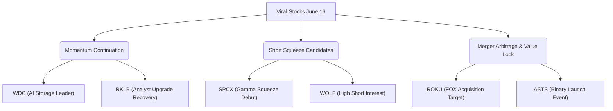

# 📊 US VIRAL STOCK INTELLIGENCE REPORT
*วิเคราะห์เจาะลึกข่าวสาร Sentiment, Capital Flow และกลยุทธ์การเทรดหุ้นสหรัฐที่กำลังเป็นกระแสในรอบ 24 ชั่วโมง*
**วันที่รายงาน:** 16 มิถุนายน 2026

---

## 🔥 1. TOP HOT STOCKS (หุ้นกระแสแรงในรอบ 24 ชั่วโมง)

ตลาดหุ้นสหรัฐฯ ในรอบ 24 ชั่วโมงที่ผ่านมา (15–16 มิถุนายน 2026) ปรับตัวขึ้นอย่างรุนแรงในลักษณะ Broad "Risk-On" Rally นำโดยกลุ่มเทคโนโลยีและเซมิคอนดักเตอร์ จากข่าวภูมิรัฐศาสตร์เชิงบวกคือ **การบรรลุกรอบข้อตกลงสันติภาพเบื้องต้นระหว่างสหรัฐฯ-อิหร่าน** เพื่อยุติความขัดแย้งและเตรียมเปิดช่องแคบฮอร์มุซ (Strait of Hormuz) อีกครั้ง ส่งผลให้ราคาน้ำมันดิบ Brent ร่วงลงเกือบ 5% และอัตราผลตอบแทนพันธบัตรรัฐบาลอายุ 10 ปี (10-year Treasury Yield) ลดลงเหลือ 4.41% ช่วยคลายความกังวลด้านเงินเฟ้อ

ภายใต้บรรยากาศที่คึกคักนี้ มีหุ้นรายตัวหลายตัวที่เป็นจุดสนใจของตลาดและมีกระแสตอบรับอย่างรุนแรง:

### 1. SpaceX (Ticker: SPCX)
*   **% การเปลี่ยนแปลงราคา:** หลังจากการทำ IPO ประวัติศาสตร์เมื่อวันที่ 12 มิ.ย. ที่ราคา $135 และปิดที่ $160.95 ในวันแรก ล่าสุดในวันที่ 15 มิ.ย. ยืนแข็งแกร่งในช่วง $172 - $173 และในวันที่ 16 มิ.ย. (ช่วงเช้าของการซื้อขาย) **พุ่งทะยานอีกกว่า +11% แตะระดับสูงสุดที่ $213**
*   **Volume:** มหาศาลอย่างต่อเนื่อง (เป็นหุ้นที่มีมูลค่าการซื้อขายอันดับต้น ๆ ของตลาด แย่งส่วนแบ่งสภาพคล่องจากบิ๊กเทคตัวอื่น)
*   **สาเหตุหลัก:** IPO FOMO ต่อเนื่อง ประกอบกับการ**เปิดตัวการซื้อขายออปชัน (Options Trading)** เป็นวันแรกในวันที่ 16 มิ.ย. รวมถึงบทวิเคราะห์เชิงบวกและคำกล่าวของ Elon Musk ที่คาดการณ์ว่า SpaceX อาจสร้างรายได้แตะ **1 ล้านล้านดอลลาร์ภายในปี 2030** ควบคู่กับการผนวกเทคโนโลยี xAI
*   **👉 วิเคราะห์เชิงลึก:**
    *   *Hype หรือ Reasoned?:* **Mixed (Hype นำพื้นฐานระยะสั้น)** การประเมินมูลค่า (Valuation) ปัจจุบันขยับขึ้นไปแตะ 2.8 ล้านล้านดอลลาร์ (แซงหน้า Amazon) คิดเป็น Price-to-Sales (P/S) ที่สูงเกิน 100 เท่า ซึ่งเป็นระดับที่สูงมาก อย่างไรก็ตาม ศักยภาพด้านอินเทอร์เน็ตดาวเทียม (Starlink) และการขนส่งอวกาศเป็นสิ่งที่หาคู่แข่งเปรียบเทียบยาก
    *   *โอกาสไปต่อ:* การเปิดเทรด Options ในวันแรกช่วยดึงดูดทั้งแรงซื้อจากรายย่อยและกลยุทธ์ Hedging ของสถาบัน มีโอกาสเกิด **Gamma Squeeze** ดันราคาไปต่อในระยะสั้นมาก แต่ระยะกลางความเสี่ยงที่จะมีแรงเทขาย (Profit Taking) เพื่อลดความร้อนแรงนั้นสูงมาก

### 2. Western Digital Corp. (Ticker: WDC)
*   **% การเปลี่ยนแปลงราคา:** พุ่งทะยานแรง **+14.42%** ปิดที่ $653.53 ในวันที่ 15 มิ.ย. ทำจุดสูงสุดใหม่ในรอบ 52 สัปดาห์
*   **Volume:** สูงกว่าค่าเฉลี่ย 90 วันถึง **320%**
*   **สาเหตุหลัก:** สถาบันการเงินยักษ์ใหญ่ (Morgan Stanley, JPMorgan, Citi, Mizuho) พาเหรด**ปรับเพิ่มราคาเป้าหมายอย่างดุดัน** (MS/JPM ปรับขึ้นเป็น $650, Citi/Mizuho ปรับขึ้นเป็น $685) โดยเน้นย้ำถึงภาวะ "ขาดแคลน Hard Disk Drive (HDD)" จากความต้องการเก็บข้อมูล AI ที่พุ่งแรง 40%-50% ต่อปี ประกอบกับผลการลดหนี้ผ่าน Convertible Note Exchange มูลค่า $858.4 ล้านสำเร็จ
*   **👉 วิเคราะห์เชิงลึก:**
    *   *Hype หรือ Reasoned?:* **Highly Reasoned** เป็นวัฏจักรขาขึ้นของแท้ (Stronger-for-Longer Cycle) เนื่องจากซัพพลายการผลิต HDD โตไม่ทันดีมานด์โครงสร้างพื้นฐาน AI ข้อมูลขนาดใหญ่ต้องการพื้นที่เก็บราคาประหยัดซึ่ง SSD ยังทดแทน HDD ทั้งหมดไม่ได้ในแง่ต้นทุน
    *   *โอกาสไปต่อ:* การที่ราคาปิดเหนือเส้นราคาเป้าหมายของบางค่ายสะท้อนว่ามีแรงซื้อสถาบันหนาแน่น (Block Trades) ระยะยาวมีโอกาสไปต่อตามเป้า $685 แต่อาจมีการพักตัวสั้น ๆ เพื่อย่อยแรงซื้อที่หนาแน่น

### 3. Wolfspeed, Inc. (Ticker: WOLF)
*   **% การเปลี่ยนแปลงราคา:** พุ่งแรง **+13.79%** ปิดที่ $49.09 ในวันที่ 15 มิ.ย.
*   **Volume:** สูงกว่าค่าเฉลี่ยปกติ 2.5 เท่า
*   **สาเหตุหลัก:** การประกาศแต่งตั้ง Daniel Whalen เป็น VP of Investor Relations คนใหม่เพื่อกู้ความเชื่อมั่นตลาด + กระแสต่อเนื่องจากการเปิดตัวชิป Gen 5 Silicon Carbide (SiC) MOSFETs ที่มีประสิทธิภาพสูงขึ้น 27% และการร่วมมือกับ GE Aerospace ในการพัฒนาชิปแรงดันไฟฟ้าสูง
*   **👉 วิเคราะห์เชิงลึก:**
    *   *Hype หรือ Reasoned?:* **Reasoned to Mixed** ชิป SiC สำหรับยานยนต์ไฟฟ้า (EV) และโครงข่ายไฟฟ้าพลังงานสะอาดเป็นแนวโน้มระยะยาวที่ดี แต่ Wolfspeed ยังประสบปัญหาต้นทุนการผลิตในโรงงานใหม่และงบการเงินที่ยังขาดทุนสะสม นอกจากนี้เพิ่งยื่นขอจดทะเบียนขายหุ้นเพิ่มทุน 24 ล้านหุ้นโดยผู้ถือหุ้นเดิมเมื่อสัปดาห์ก่อน
    *   *โอกาสไปต่อ:* การขึ้นรอบนี้ส่วนหนึ่งเป็นการฟื้นตัวทางเทคนิคและแรงบีบจากสถานะ Short (Short Squeeze) เนื่องจากหุ้นถูกขายชอร์ตหนักมาก่อนหน้านี้ มีโอกาสรีบาวด์ได้ต่อจำกัดตามแนวต้านสำคัญแถว $52 - $55

### 4. Roku, Inc. (Ticker: ROKU)
*   **% การเปลี่ยนแปลงราคา:** หลังจากพุ่งล่วงหน้ากว่า +20% เมื่อวันศุกร์ (12 มิ.ย.) จากข่าวลือ ล่าสุดวันที่ 15 มิ.ย. ขยับลงเล็กน้อย **-1.20%** มาอยู่ที่ประมาณ $142.30 และในวันที่ 16 มิ.ย. เคลื่อนไหวแถว **$140.90 (-1.92%)**
*   **Volume:** หนาแน่นเป็นพิเศษจากกลุ่ม Merger Arbitrage
*   **สาเหตุหลัก:** ประกาศอย่างเป็นทางการว่า **Fox Corporation (FOX) ได้เข้าทำข้อตกลงซื้อกิจการ Roku** ด้วยมูลค่า $22,000 ล้าน (เสนอราคาซื้อที่ $160 ต่อหุ้น แบ่งเป็นเงินสด $96 และหุ้น Class A ของ Fox 0.97 หุ้น)
*   **👉 วิเคราะห์เชิงลึก:**
    *   *Hype หรือ Reasoned?:* **Reasoned** ราคาปัจจุบันที่ ~$141 ต่ำกว่าราคาเสนอซื้อที่ $160 อยู่ประมาณ 13.5% ซึ่งถือเป็นส่วนต่างความเสี่ยงจากการควบรวม (Merger Arbitrage Spread) สะท้อนความกังวลว่าดีลจะผ่านด่านกำกับดูแล (Regulatory Approvals) หรือไม่ เนื่องจากคาดว่าจะเสร็จสิ้นในครึ่งแรกของปี 2027
    *   *โอกาสไปต่อ:* ราคาจะแกว่งตัวจำกัด (Range-bound) ในกรอบ $140 - $150 ตามความคืบหน้าของดีล โอกาสพุ่งทะลุ $160 มีน้อยมาก ยกเว้นมีผู้เสนอซื้อรายอื่นเข้ามาแข่ง (Bidding War)

### 5. Rocket Lab USA (Ticker: RKLB)
*   **% การเปลี่ยนแปลงราคา:** ดีดกลับแรง **+7.00%** ปิดที่ระดับประมาณ $110 ในวันที่ 15 มิ.ย.
*   **Volume:** สูงกว่าค่าเฉลี่ย
*   **สาเหตุหลัก:** ได้รับการอัปเกรดจาก KeyBanc Capital Markets จาก "Neutral" เป็น "Overweight" พร้อมตั้งราคาเป้าหมายสูงถึง **$135** โดยระบุว่าแรงเทขายในกลุ่มหุ้นอวกาศก่อนหน้านี้เนื่องจากกระแส IPO ของ SpaceX เป็นการตื่นตระหนกที่เกินกว่าเหตุ (Unwarranted Selloff)
*   **👉 วิเคราะห์เชิงลึก:**
    *   *Hype หรือ Reasoned?:* **Highly Reasoned** ราคาที่ดิ่งลงกว่า 15% ในช่วงสัปดาห์ก่อนไม่ใช่เพราะพื้นฐาน RKLB แย่ลง แต่เกิดจากสถาบันสลับพอร์ต (Portfolio Rebalancing) เพื่อไปซื้อ SPCX ในวัน IPO เมื่อสถาบันปรับสัดส่วนเสร็จสิ้น แรงซื้อคืนจึงกลับมาสู่ผู้เล่นเบอร์สองที่มีสัญญายิงจรวดและผลิตดาวเทียมในมือแน่นหนา
    *   *โอกาสไปต่อ:* แข็งแกร่ง มีโอกาสกลับไปทดสอบจุดสูงสุดเดิมก่อน IPO ของ SpaceX และมุ่งหน้าสู่เป้าหมาย $135 ของนักวิเคราะห์

### 6. AST SpaceMobile (Ticker: ASTS)
*   **% การเปลี่ยนแปลงราคา:** ผันผวนหนัก ร่วงลง -15.5% ในช่วงวันศุกร์ (จากกระแสแย่งสภาพคล่องของ SPCX) ก่อนจะเริ่มทรงตัวได้ในวันที่ 15 และมีแรงซื้อเก็งกำไรในวันที่ 16 มิ.ย.
*   **Volume:** หนาแน่นผิดปกติ
*   **สาเหตุหลัก:** การเตรียมการขั้นสุดท้ายสำหรับการส่งดาวเทียม **BlueBird 8, 9, 10 ขึ้นสู่อวกาศในวันที่ 17 มิถุนายน 2026** โดยใช้บริการจรวด Falcon 9 ของ SpaceX
*   **👉 วิเคราะห์เชิงลึก:**
    *   *Hype หรือ Reasoned?:* **Mixed (Speculative Catalysts)** การปล่อยดาวเทียมเป็นก้าวสำคัญที่จะทำให้บริษัทเปิดให้บริการเชิงพาณิชย์ร่วมกับเครือข่ายโทรศัพท์ยักษ์ใหญ่ได้ ข้อมูลเชิงบวกนี้สมเหตุสมผล แต่ความผันผวนของราคาหุ้นสะท้อนอารมณ์เก็งกำไรของรายย่อยอย่างชัดเจน
    *   *โอกาสไปต่อ:* เป็นเหตุการณ์แบบ Binary Event (ปล่อยผ่าน = หุ้นพุ่งแรง / ปล่อยล้มเหลวหรือเลื่อน = หุ้นร่วงหนัก) หากปล่อยสำเร็จในวันที่ 17 มิ.ย. หุ้นจะกลับมามี Momentum ขาขึ้นที่แข็งแกร่ง

---

## 🚀 2. VIRAL MOMENTUM ANALYSIS

กระแสการหมุนเวียนของเงินทุน (Sector Rotation) และพฤติกรรมราคา สามารถจัดกลุ่มแนวโน้มกระแสดังนี้:

*   **Momentum Continuation (ของจริง มีแนวโน้มเติบโตต่อเนื่อง):**
    *   **WDC:** ราคาตอบรับกับปัจจัยเชิงโครงสร้าง (Structural Change) จากดีมานด์ AI พื้นฐานแน่นและสถาบันหนุนหลัง
    *   **RKLB:** ได้อานิสงส์จากการเคลียร์ความตระหนกเรื่อง SpaceX IPO และการหนุนจากนักวิเคราะห์ระดับท็อป
*   **Short Squeeze / Gamma Squeeze Candidates (ความผันผวนสูง เล่นตามรอบ):**
    *   **SPCX:** การเปิดตัว Options วันแรกสร้างการเทรดแบบ Leverage มหาศาล มีสิทธิ์บีบให้ Market Maker ต้องซื้อหุ้นอ้างอิงเพื่อครอบคลุมความเสี่ยง (Delta/Gamma Hedging)
    *   **WOLF:** หุ้นฝั่ง Semiconductor ที่ถูกเก็งกำไรฝั่งสั้นมานาน การมีข่าวดีเรื่องเทคโนโลยีและผู้บริหารกระตุ้นการ Cover Short
*   **Merger Arbitrage & Event-Driven (จำกัด Upside/ความเสี่ยงเฉพาะตัว):**
    *   **ROKU:** ถูกล็อคเป้าด้วยมูลค่าเสนอซื้อ $160 เหมาะสำหรับนักลงทุนประเภทกินส่วนต่างดอกเบี้ย (Arbitrageurs) มากกว่าเทรดเดอร์ทั่วไป
    *   **ASTS:** รอผลลัพธ์การยิงดาวเทียมวันที่ 17 มิ.ย. ความเสี่ยงสูงมากแต่ผลตอบแทนสูงเช่นกัน

---

## 💬 3. SOCIAL SENTIMENT

จากการตรวจสอบแพลตฟอร์ม **r/WallStreetBets (Reddit)** และ **X (Twitter)** ในรอบ 24 ชั่วโมงที่ผ่านมา:

> [!NOTE]
> **Sentiment โดยรวมของรายย่อย:** **Highly Bullish & FOMO (หลังจากตลาดบวกแรงจากข่าว U.S.-Iran)**
> นักลงทุนรายย่อยส่วนใหญ่หันกลับมาโฟกัสธีม "Space & Space Tech" อย่างที่ไม่เคยเป็นมาก่อน

### Narrative หลักในโลกโซเชียล:
1.  **"SPCX to the Moon" (ความคลั่งไคล้ใน SpaceX):** บอร์ด WSB คึกคักมากเกี่ยวกับการซื้อ Call Options ราคา $250 - $300 ของ SPCX รายย่อยมองว่านี่คือ "Tesla 2.0" ที่มี Elon Musk คอยหนุน หลายคนมองข้ามเรื่อง Valuation ไปอย่างสิ้นเชิง
2.  **"Space Battle" (การปะทะกันระหว่างผู้ถือหุ้น RKLB / ASTS / SPCX):** มีการดีเบตกันอย่างดุเดือดระหว่างผู้ถือหุ้น RKLB ที่เคลมว่าราคาหุ้นตนเองถูกเกินไปเมื่อเทียบกับ SPCX ที่มูลค่า 2.8 ล้านล้านดอลลาร์ และฝั่ง ASTS ที่เน้นว่าเหตุการณ์ปล่อยดาวเทียมในวันที่ 17 มิ.ย. จะส่งผลกระทบต่อพื้นฐานอย่างก้าวกระโดด
3.  **"AI Memory Storage is the new GPU" (กระแสความจำคือขุมทรัพย์ใหม่):** รายย่อยเริ่มกระจายเงินจาก NVIDIA (NVDA) ไปยังผู้ให้บริการหน่วยความจำและการจัดเก็บข้อมูลอย่าง WDC และ MU โดยเชื่อว่ากลุ่มนี้ยังมีอัปไซด์ที่กว้างกว่าชิปประมวลผลที่ขึ้นไปมากแล้ว

---

## 🧠 4. SMART MONEY vs RETAIL

การวิเคราะห์แยกแยะทิศทางไหลของเงินทุนระหว่างกองทุนขนาดใหญ่ (Smart Money) และนักลงทุนรายย่อย (Retail):

*   **เงินใหญ่เข้าสะสมถาวร (Institutional Accumulation):**
    *   **WDC:** ปรากฏวอลุ่มการทำรายการขนาดใหญ่ (Block Trades) ในช่วงแนวรับสำคัญ และแรงซื้อตามหลังบทวิเคราะห์ของ MS/JPM สะท้อนว่าสถาบันกำลังเพิ่มน้ำหนักการลงทุนระยะยาวในกลุ่ม Storage Infrastructure
    *   **RKLB:** หลังจากการขายตื่นตระหนกช่วงสิ้นสัปดาห์ก่อน สถาบันขนาดใหญ่พบว่าระดับราคาเดิมต่ำกว่ามูลค่าที่เหมาะสมจึงรีบเก็บของกลับคืน
*   **รายย่อยไล่ราคาเก็งกำไรสุดตัว (Retail Speculative Drive):**
    *   **SPCX:** สัญญากรรมสิทธิ์ออปชันส่วนใหญ่ที่ซื้อในฝั่ง Call Options ราคาห่างไกลความเป็นจริง (Out-of-the-Money) มาจากบัญชีรายย่อย ซึ่งสะท้อนพฤติกรรม "ลอตเตอรี่เบล็ต" (Meme-like bidding)
    *   **ASTS:** มีปริมาณการพูดถึงพุ่งกระฉูดในโซเชียลมีเดียก่อนหน้าวันปล่อยดาวเทียม สะท้อนความพยายามในการเก็งกำไรระยะสั้นของรายย่อยเพื่อดักรอผลลัพธ์ข่าวเด่น

---

## 🎯 5. TRADE INSIGHT (กลยุทธ์การเทรด 3 หุ้นเด่น)

เพื่อให้สามารถนำข้อมูลไปวางแผนลงทุนจริง นี่คือคำแนะนำสำหรับ 3 หุ้นที่มีปัจจัยเร่งสูงสุดในขณะนี้:

| Ticker | Bias | กลยุทธ์การเทรด (Tactical Strategy) | ความเสี่ยงหลัก (Key Risks) |
| :--- | :--- | :--- | :--- |
| **SPCX** | **WAIT** | **จับตากลไก Options Expiry / รอ Pullback:** การไล่ราคาที่ $213 มีความเสี่ยงที่จะติดดอยสูงเนื่องจากความร้อนแรงของออปชัน ควรรอให้แรงเหวี่ยงช่วงสัปดาห์แรกของการทำ IPO และการเปิดเทรด Options สงบลง หากราคาย่อตัวลงมาสะสมแถวกรอบแนวรับ $175 - $185 และสร้างฐานได้มั่นคง ค่อยพิจารณาแบ่งไม้สะสม | ความเสี่ยงจากการเทขายของกลุ่มผู้ถือหุ้นก่อน IPO (Pre-IPO Holders) และการเกิด Gamma Rollback หากแรงซื้อคอลออปชันชะลอตัว |
| **WDC** | **LONG** | **เล่นจังหวะย่อตัว (Buy the Dip):** ด้วยปัจจัยพื้นฐานที่แข็งแกร่งและเป้าเป้าหมายเฉลี่ยที่ได้รับการปรับขึ้นเป็น $680+ แนะนำรอราคา Pullback ลงมาทดสอบแนวรับสำคัญทางจิตวิทยาแถว $630 - $640 เพื่อเข้าซื้อสะสมเพื่อเป้าหมายระยะกลางที่ $680 และ $700 | ความเสี่ยงจากการชะลอการลงทุน CapEx ของ Data Center รายใหญ่ หรือสภาวะตลาดโดยรวมที่อาจมีแรงเทขายสลับพอร์ต |
| **RKLB** | **LONG** | **เล่น Breakout / Follow Buy:** หุ้นฟื้นตัวแข็งแกร่งพร้อมสัญญาณบวกจากการอัปเกรด คาดว่าแนวต้านแถว $115 เป็นด่านสำคัญ หากราคาทะลุผ่านและปิดเหนือด่านนี้ได้พร้อมวอลุ่มหนาแน่น สามารถ Follow Buy ตามน้ำเพื่อเป้าหมายระยะสั้นที่ $130 - $135 | สภาพคล่องอุตสาหกรรมอวกาศยังผันผวนสูงตามความสำเร็จของการปล่อยจรวด และการแข่งขันด้านราคาที่อาจรุนแรงขึ้น |

---
*คำเตือน: บทวิเคราะห์นี้มีวัตถุประสงค์เพื่อให้ข้อมูลและมุมมองทางวิชาการเกี่ยวกับการเคลื่อนไหวของตลาดหุ้นสหรัฐฯ เท่านั้น ไม่ใช่การชี้ชวน การให้คำปรึกษา หรือการแนะนำการซื้อขายหลักทรัพย์ ผู้เทรดควรประเมินความเสี่ยงและกำหนดจุดตัดขาดทุน (Stop Loss) ทุกครั้งก่อนตัดสินใจลงมือปฏิบัติการเทรด*
