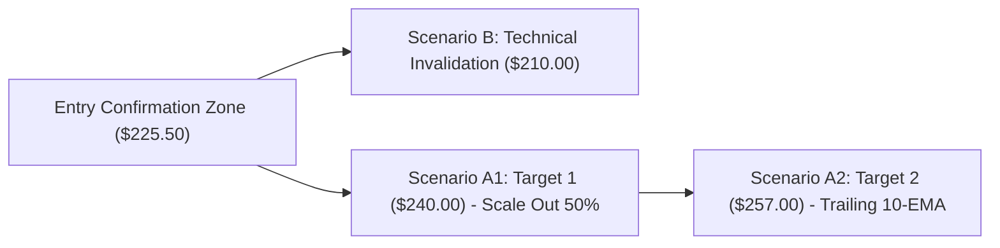
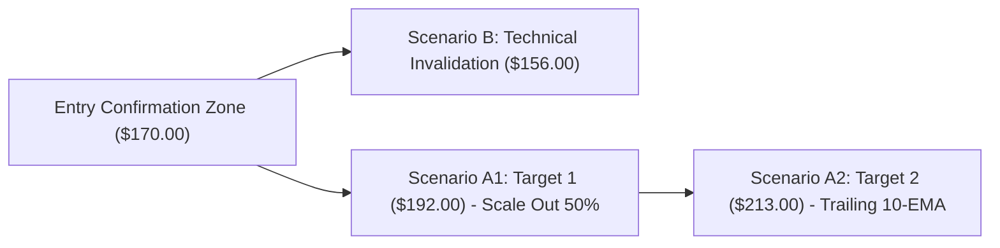

# 🚀 VP TOP OPPORTUNITY RADAR: High-Conviction Setups & Scenario Briefing ประจำวันที่ 15 สิงหาคม 2026

เรดาร์สแกนโอกาสการวิเคราะห์ราคาเชิงสถิติ (Quantitative Scenario Briefing) สรุป 3 หุ้นเด่นความน่าจะเป็นสูงสำหรับสมาชิกระดับ VP & VIP พร้อมสคริปต์คลิปวิดีโอ 3 นาทีสำหรับเข้าถึงข้อมูลก่อนใคร (Early Access)

---

## 👑 1. ตารางคะแนนความเชื่อมั่นและการวางฉากทัศน์ราคา (Top 3 Scenario Radar)

*สัญลักษณ์ความเชื่อมั่น: 🟢 สูง (High Conviction - คะแนน >= 80) | 🟡 ปานกลาง (Moderate Conviction - คะแนน 70-79)*

| Ticker | หุ้น | ราคาปิด ($) | คะแนนความเชื่อมั่น (Conviction Score) | R/R Ratio (คำนวณถ้วน) | จุดยืนยันสัญญาณ (Entry Confirmation Zone) | จุดยกเลิกแผน (Technical Invalidation Level) | ฉากทัศน์เป้าหมายหลัก (Scenario Target A2) | ปัจจัยเติบโตหลัก (Key Growth Catalyst) |
| :--- | :--- | :--- | :--- | :--- | :--- | :--- | :--- | :--- |
| **NVDA** | NVIDIA Corp | **$225.16** | 🟢 **85 / 100** | **1:2.1** | ปิดแท่ง 15 นาทีเหนือ **$225.50** | **$210.00** (เสี่ยง $15.16) | **$257.00** (ได้ $31.84) | ออเดอร์ชิป Blackwell เร่งตัวขึ้นสูงก่อนรายงานงบ |
| **AMZN** | Amazon.com Inc | **$262.65** | 🟢 **85 / 100** | **1:2.0** | ปิดแท่ง 15 นาทีเหนือ **$263.00** | **$245.00** (เสี่ยง $17.65) | **$298.00** (ได้ $35.35) | รายได้ AWS และ Free Cash Flow เติบโตแข็งแกร่ง |
| **PLTR** | Palantir Tech | **$174.04** | 🟡 **72 / 100** | **1:2.8** | ย่อตัวสะสมยืนเหนือ **$170.00** | **$156.00** (เสี่ยง $14.04) | **$213.00** (ได้ $38.96) | การขยายตัวของแพลตฟอร์ม AIP ในกลุ่มสถาบัน |

> [!NOTE]
> **เกณฑ์การประเมินคะแนนความเชื่อมั่น (Conviction Score Methodology - 100 คะแนนเต็ม):**
> คะแนนความเชื่อมั่นประเมินเชิงคุณภาพร่วมกับข้อมูลสถิติโดยทีมวิเคราะห์ แบ่งเป็น 4 มิติหลัก (มิติละ 25 คะแนน):
> 1. **Fundamental Growth (25 คะแนน):** อัตราการเติบโตของรายได้/กำไรและคำสั่งซื้อ
> 2. **Institutional Accumulation (25 คะแนน):** การสะสมตัวของเงินทุนสถาบันและ Dark Pool Block Trades
> 3. **Technical Trend & Structure (25 คะแนน):** ความแข็งแกร่งของแพตเทิร์นกราฟและ Relative Strength vs SPY/QQQ
> 4. **Catalysts Imminence (25 คะแนน):** ความกระชั้นชิดของตัวเร่งปฏิกิริยาข่าวใน 1-4 สัปดาห์ข้างหน้า

---

## 📊 2. ผังการเดินทางของฉากทัศน์ราคา (Visual Scenario Flowcharts)

### 📌 NVDA Scenario Flowchart:

### 📌 AMZN Scenario Flowchart:

### 📌 PLTR Scenario Flowchart:

---

## 🎬 3. สคริปต์คลิปวิดีโอสรุป 3 นาทีสำหรับสมาชิก (3-Min Executive Briefing Video Script)

**[เวลา 0:00 - 0:30] ทักทายสมาชิก & อัปเดตภาพรวม:**
"สวัสดีครับสมาชิกระดับ VP และ VIP ทุกท่าน ขอต้อนรับสู่รายการ 'เสพข่าวก่อนเทรด หุ้นอเมริกา' ช่วง **Top Opportunity Radar** ประจำวันที่ 15 สิงหาคม 2026 วันนี้เราคัด 3 หุ้นเด่นพร้อมกรอบการวางฉากทัศน์ราคาเชิงสถิติ (Scenario Planning) มาอัปเดตให้ฟังสำหรับสุดสัปดาห์นี้ครับ"

**[เวลา 0:30 - 2:00] สรุปการวางฉากทัศน์ราคา 3 หุ้นเด่น:**
"ตัวแรก **NVDA** ราคาปิด $225.16 จุดยืนยันสัญญาณอยู่เหนือ $225.50 เป้าหมายฉากทัศน์ A ที่ $257.00 และมีจุดยกเลิกแผน B ที่ $210.00 คุ้มค่าด้วย R/R 1:2.1 ครับ! 
ตัวที่สอง **AMZN** ราคา $262.65 จุดยืนยันสัญญาณ $263.00 เป้าหมาย A ที่ $298.00 จุดยกเลิกแผน B ที่ $245.00 
และตัวที่สาม **PLTR** ราคา $174.04 จุดยืนยันสัญญาณย่อสะสมที่ $170.00 เป้าหมาย A ที่ $213.00 จุดยกเลิกแผน B ที่ $156.00 โดดเด่นด้วย Risk/Reward สถิติสูงถึง 1:2.8 ครับ!"

**[เวลา 2:00 - 3:00] วินัยการคุมความเสี่ยง & ปิดท้าย:**
"ย้ำเตือนสมาชิกบริหารความเสี่ยงด้วย Position Sizing ไม่เกิน 1.5% ของพอร์ตเมื่อราคาหลุดจุดยกเลิกแผนครับ ขอบคุณสมาชิกร่วมทางทุกท่านครับ!"

---

## 🌐 แหล่งข้อมูลอ้างอิง (Sources)
- [TradingView Technical Radar](https://www.tradingview.com/)
- [Yahoo Finance Quantitative Screener](https://finance.yahoo.com/)
- [SEC EDGAR Database](https://www.sec.gov/edgar)

---

> [!WARNING]
> **คำเตือนความเสี่ยง (Financial Disclaimer):** รายงานฉบับนี้จัดทำขึ้นเพื่อวัตถุประสงค์ในการให้ข้อมูลและการศึกษาวิเคราะห์ทางสถิติเท่านั้น ไม่ถือเป็นคำแนะนำทางการเงิน การลงทุน หรือคำชี้ชวนในการซื้อขายหลักทรัพย์ การลงทุนมีความเสี่ยง ผู้ลงทุนควรศึกษาข้อมูลก่อนตัดสินใจลงทุน
