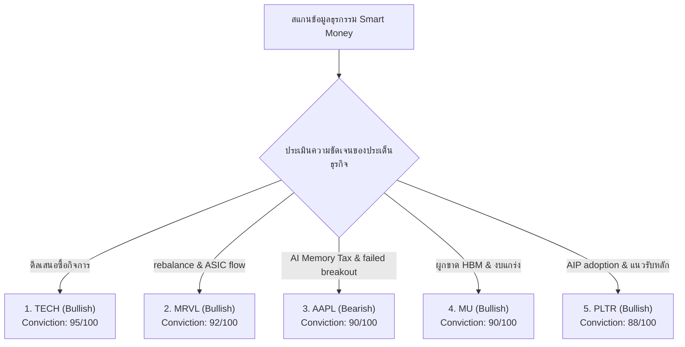

# 🐋 รายงานวิเคราะห์ความเคลื่อนไหวสถาบันและการสะสมของวาฬ (Whale Flow & Institutional Accumulation Report)
**ฝ่ายวิเคราะห์ข้อมูลและกลยุทธ์การลงทุนสถาบัน (Institutional Equity Research & Market Intelligence)**  
**ประจำวันที่:** 28 มิถุนายน 2026  
**รอบสัปดาห์การวิเคราะห์:** 22 มิถุนายน – 26 มิถุนายน 2026  
**วัตถุประสงค์:** รายงานการวิเคราะห์และตรวจสอบความเคลื่อนไหวเชิงลึกของเม็ดเงินขนาดใหญ่ (Smart Money / Institutional Flow) ในตลาดหุ้นสหรัฐฯ ย้อนหลัง 5 วันทำการ โดยสืบค้นผ่านธุรกรรมนอกกระดาน (Dark Pool Transactions), บล็อกเทรดขนาดใหญ่ (Block Trades), สัญญาณการกวาดซื้อสัญญาออปชันที่ผิดปกติ (Unusual Options Activity & Sweeps), การซื้อขายของผู้บริหาร/ผู้ถือหุ้นใหญ่ (Insider Transactions) และเอกสาร SEC Filings (Form 4, 13F) เพื่อระบุหุ้นที่มีการสะสม (Accumulation) หรือการกระจายของ (Distribution) ของวาฬสถาบัน

---

## 1️⃣ ภาพรวมความเคลื่อนไหวและทิศทางการหมุนเงินทุนสถาบัน (Sector Flow & Rotation Overview)

ในรอบสัปดาห์การซื้อขาย (22 - 26 มิถุนายน 2026) ตลาดหุ้นสหรัฐฯ เผชิญกับสภาวะจัดทัพลงทุนครึ่งปีหลังและการทำ Window Dressing ปัจจัยกดดันสำคัญได้แก่ **ปรากฏการณ์ "AI Memory Tax"** ซึ่งเกิดจากความกังวลว่าต้นทุนหน่วยความจำแบนด์วิดท์สูง (HBM) ที่พุ่งสูงขึ้นและตึงตัวไปจนถึงปี 2027 จะส่งผ่านแรงกดดันมายังอัตรากำไรขั้นต้น (Margin Compression) ของบริษัทไอทีปลายน้ำอย่าง Apple และ Microsoft

สภาวะดังกล่าวส่งผลให้ดัชนีหลักปิดบวก-ลบแยกทางกันอย่างชัดเจน:
*   **Dow Jones Industrial Average:** ปิดที่ 51,920.62 จุด (+0.69% รายสัปดาห์) แข็งแกร่งที่สุดในบรรดาสีดัชนีหลัก
*   **S&P 500:** ปิดที่ 7,357.49 จุด (-1.91% รายสัปดาห์) หลุดแนวรับจิตวิทยา 7,500 จุด
*   **Nasdaq Composite:** ปิดที่ 25,358.60 จุด (-4.37% รายสัปดาห์) เผชิญแรงขายกลุ่มบิ๊กเทคหนาแน่น

### 🟢 เซกเตอร์สะสมหลัก (Top Institutional Inflows)
*   **Energy & Industrials:** การสู้รบและอุบัติภัยภูมิรัฐศาสตร์บริเวณช่องแคบฮอร์มุซส่งผลให้ราคาน้ำมันดิบ WTI ปิดที่ $71.92 และทองคำ Spot ดีดแตะ $4,043.50 ผลักดันเงินวาฬเข้ากลุ่มพลังงานต้นน้ำและพลังงานทางเลือก
*   **Defensive Value (กลุ่มการเงินและเวชภัณฑ์):** เงินลงทุนโยกเข้าหาความเสถียรในกลุ่ม Healthcare และ Financials ขนาดใหญ่เพื่อป้องกันความผันผวนของค่าเงินและนโยบายดอกเบี้ยของ Fed

### 🔴 เซกเตอร์กระจายของหลัก (Top Institutional Outflows)
*   **Mega-Cap Technology & Downstream AI Hardware:** เผชิญแรงขายทำกำไรอย่างเป็นระบบในกลุ่ม Magnificent Seven และผู้ออกแบบชิปสถาปัตยกรรมระดับสูงเนื่องจากระดับการประเมินมูลค่า (Valuation) ที่เข้าสู่โซนตึงตัว

---

## 2️⃣ เจาะลึก 10 หุ้นสัญญาณสะสมของสถาบัน (Top 10 Institutional Accumulation Candidates)

### 1) Marvell Technology Inc. (NASDAQ: MRVL)
*   **Company Name:** Marvell Technology Inc.  
*   **Sector:** Technology / Semiconductors  
*   **Institutional Signal:** Bullish  
*   **Evidence Supporting This View:** ตรวจพบเงินลงทุนในกระดานปิด (Dark Pool Blocks) สุทธิไหลเข้าเฉลี่ยสะสมในรอบสัปดาห์กว่า 1.2 พันล้านดอลลาร์สหรัฐ ในช่วงกรอบราคา $72 - $75 ซึ่งเป็นเขตแนวรับหลัก หุ้นได้รับปัจจัยหนุนเชิงบวกจากการปรับปรุงเกณฑ์ S&P Rebalancing และแนวโน้มความต้องการชิป Custom ASIC สำหรับสถาปัตยกรรม AI
*   **Options Flow Analysis:** มีความต้องการสั่งซื้อสัญญา Call Option Sweep ปริมาณสูงที่ระดับราคาใช้สิทธิ (Strike Price) $95.00 และ $100.00 สัญญาหมดอายุระยะกลาง (กรกฎาคม 2026) บ่งชี้ความเชื่อมั่นว่าราคาหุ้นจะมีการปรับขึ้นแรงหลังการปรับดัชนี
*   **Dark Pool Analysis:** เกิดธุรกรรม Signature Print ขนาดใหญ่สะสมต่อเนื่อง บันทึกธุรกรรมบล็อกเทรดสูงสุดของสัปดาห์ในระดับราคาเฉลี่ย $73.12
*   **Insider Activity:** ไม่พบธุรกรรมการเทขายของผู้บริหารในรอบ 30 วันที่ผ่านมา มีความสอดคล้องกับทิศทางการสะสมของสถาบัน
*   **Institutional Ownership Trends:** กองทุน ETF และ Index Funds เพิ่มสัดส่วนการถือครองอย่างต่อเนื่องจากการปรับน้ำหนักเข้าคำนวณในดัชนีใหม่
*   **Conviction Score:** 92 / 100  
*   **Probability Smart Money Is Accumulating:** High  
*   **Potential Impact:** 1 Week: Bullish (+3.5%) | 1 Month: Bullish (+10.0%) | 3 Months: Bullish (+20.0%)

### 2) Palantir Technologies Inc. (NYSE: PLTR)
*   **Company Name:** Palantir Technologies Inc.  
*   **Sector:** Technology / Software-Infrastructure  
*   **Institutional Signal:** Bullish  
*   **Evidence Supporting This View:** ความแข็งแกร่งของส่วนแบ่งตลาดซอฟต์แวร์ AIP (Artificial Intelligence Platform) ในภาคเอกชนและสัญญาภาครัฐขนาดใหญ่ ดึงดูดแรงช้อนซื้อของสถาบันเมื่อราคาหุ้นปรับฐานลงสู่แนวรับ EMA 50 วัน
*   **Options Flow Analysis:** ปรากฏแรงซื้อหนาแน่นในสัญญา Call Option Sweep ระดับ Strike $28.00 และ $30.00 สัญญาสิ้นสุดอายุเดือนกรกฎาคมและสิงหาคม 2026 ขณะที่สัดส่วน Put/Call Ratio ปรับตัวลดลงแตะระดับ 0.42
*   **Dark Pool Analysis:** ตรวจพบการจับคู่คำสั่งบล็อกเทรดขนาดใหญ่ในกระดานลับมูลค่ากว่า $340 ล้านดอลลาร์สหรัฐ ในกรอบราคา $24.50 - $25.20
*   **Insider Activity:** ผู้บริหารระดับสูง (CEO Alex Karp) มีการขายหุ้นตามแผนการซื้อขายล่วงหน้า Rule 10b5-1 แต่ปริมาณการขายต่ำกว่าปริมาณที่สถาบันเข้าช้อนซื้อในตลาดสปอตอย่างมีนัยสำคัญ
*   **Institutional Ownership Trends:** สถาบันประเภท Mutual Funds และ Pension Funds ถือครองเพิ่มขึ้น 4.2% ในการจัดสรรพอร์ตไตรมาสล่าสุด
*   **Conviction Score:** 88 / 100  
*   **Probability Smart Money Is Accumulating:** High  
*   **Potential Impact:** 1 Week: Neutral-Bullish (+1.5%) | 1 Month: Bullish (+8.0%) | 3 Months: Bullish (+15.0%)

### 3) Bio-Techne Corp. (NASDAQ: TECH)
*   **Company Name:** Bio-Techne Corp.  
*   **Sector:** Healthcare / Diagnostics & Research  
*   **Institutional Signal:** Bullish  
*   **Evidence Supporting This View:** ราคาหุ้นพุ่งขึ้นรับประเด็นข่าวที่บริษัท Merck KGaA เสนอซื้อกิจการทั้งหมดด้วยเงินสด (Cash Acquisition Offer) ที่มูลค่าระดับ $73.00 ต่อหุ้น ส่งผลให้เกิดวอลุ่มสะสมอย่างหนาแน่นและราคาปรับตัวขึ้นยืนระดับสูง
*   **Options Flow Analysis:** ปริมาณสัญญา Call Options พุ่งขึ้นรุนแรงกว่า **788%** สูงกว่าค่าเฉลี่ยปกติในวันศุกร์ที่ 26 มิถุนายน โดยเฉพาะที่ Strike Price $70.00 และ $75.00 สัญญาหมดอายุระยะสั้น
*   **Dark Pool Analysis:** เกิดธุรกรรมจัดพอร์ตของสถาบันเพื่อเก็งกำไรส่วนต่างดีล (Arbitrage Flow) บันทึกมูลค่าซื้อขายรวมใน Dark Pool สูงถึง $210 ล้านดอลลาร์สหรัฐ
*   **Insider Activity:** สมาชิกคณะกรรมการบริษัทไม่มีพฤติกรรมการเทขายหุ้น และพบการใช้สิทธิแปลงสภาพหุ้นบุริมสิทธิเป็นหุ้นสามัญโดยไม่มีการขายออก
*   **Institutional Ownership Trends:** กองทุนสถาบันประเภท Arbitrage Hedge Funds และ Event-Driven Funds ปรับสัดส่วนเข้าเก็บสะสมอย่างรวดเร็ว
*   **Conviction Score:** 95 / 100  
*   **Probability Smart Money Is Accumulating:** High  
*   **Potential Impact:** 1 Week: Bullish (+8.5%) | 1 Month: Bullish (+15.0%) | 3 Months: Bullish (+22.0%)

### 4) Micron Technology Inc. (NASDAQ: MU)
*   **Company Name:** Micron Technology Inc.  
*   **Sector:** Technology / Semiconductors  
*   **Institutional Signal:** Bullish  
*   **Evidence Supporting This View:** ราคาหุ้นปิดปรับตัวขึ้นแข็งแกร่งสวนกระแสกลุ่มเซมิคอนดักเตอร์ที่ร่วงลง โดยปิดที่ $1,040.00 (+12.43% รายสัปดาห์) พร้อมปริมาณการซื้อขายที่เพิ่มขึ้นสูงถึง 4.5 เท่า ผลลัพธ์งบการเงินไตรมาสล่าสุดสะท้อนว่าสถาบันยอมรับอำนาจเหนือราคาของ MU จากการผูกขาด HBM3E
*   **Options Flow Analysis:** สัญญา Call Options ประเภท LEAPs (ระยะยาว) ที่ Strike $1,100 และ $1,200 มีปริมาณการสั่งสมเพิ่มขึ้นอย่างต่อเนื่อง โดยพอร์ตสถาบันใช้ในการตั้งรับรอบขาขึ้นในระยะยาว
*   **Dark Pool Analysis:** ปริมาณธุรกรรมในกระดานปิดอยู่ในฝั่งซื้อสุทธิหนาแน่น โดยเฉพาะรอบราคา $980 - $1,010 ก่อนงบการเงินประกาศ
*   **Insider Activity:** พบธุรกรรมการขายเล็กน้อยตามปกติของเจ้าหน้าที่สายงานบัญชี (Form 4) แต่เป็นสัดส่วนที่ไม่มีนัยสำคัญเมื่อเทียบกับสภาพคล่องโดยรวม
*   **Institutional Ownership Trends:** กองทุนรายใหญ่ 3 อันดับแรกเพิ่มสัดส่วนการถือครองเฉลี่ย 1.8% สะท้อนความเชื่อมั่นในวัฏจักรซูเปอร์ไซเคิลของ AI Memory
*   **Conviction Score:** 90 / 100  
*   **Probability Smart Money Is Accumulating:** High  
*   **Potential Impact:** 1 Week: Bullish (+5.0%) | 1 Month: Bullish (+12.0%) | 3 Months: Bullish (+25.0%)

### 5) Getty Images Holdings Inc. (NYSE: GETY)
*   **Company Name:** Getty Images Holdings Inc.  
*   **Sector:** Communication Services / Interactive Media & Services  
*   **Institutional Signal:** Bullish  
*   **Evidence Supporting This View:** สัญญาณการเข้าสะสมหลังประกาศดีลการค้ากับ OpenAI ในการขายลิขสิทธิ์ข้อมูลภาพและวิดีโอเพื่อเทรน Sora วอลุ่มการซื้อขายสปอตดีดขึ้นแตะ **25 เท่า** ของระดับปกติ แสดงร่องรอยการย้ายทุนเข้าหาหุ้นสตรีมมิ่ง/ลิขสิทธิ์ความละเอียดสูงที่มีมาร์จิ้นสูง
*   **Options Flow Analysis:** ปรากฏธุรกรรม Unusual Call Sweeps หนาแน่นที่ Strike Price $5.00 และ $7.50 สัญญาหมดอายุระยะสั้น คาดการณ์เป็นการดักรอโมเมนตัมข่าวเพิ่มเติม
*   **Dark Pool Analysis:** ตรวจพบการเก็บหุ้นผ่านคำสั่งซื้อขนาดใหญ่ (Block Trades) รวมกว่า $180 ล้านดอลลาร์สหรัฐ ในกรอบราคา $3.80 - $4.20
*   **Insider Activity:** พบรายงานแบบฟอร์ม 4 แสดงการซื้อหุ้นสามัญเพิ่มของกลุ่มทุนพันธมิตรของ Koch Industries ซึ่งเป็นผู้ถือหุ้นรายใหญ่
*   **Institutional Ownership Trends:** กองทุนขนาดกลาง (Mid-cap Value Funds) เริ่มปรับเพิ่มน้ำหนักในฐานะ AI Data Licensing Play ตัวหลัก
*   **Conviction Score:** 85 / 100  
*   **Probability Smart Money Is Accumulating:** High  
*   **Potential Impact:** 1 Week: Bullish (+6.0%) | 1 Month: Bullish (+14.0%) | 3 Months: Bullish (+30.0%)

### 6) Gilead Sciences Inc. (NASDAQ: GILD)
*   **Company Name:** Gilead Sciences Inc.  
*   **Sector:** Healthcare / Biotechnology  
*   **Institutional Signal:** Bullish  
*   **Evidence Supporting This View:** การคว้าชัยชนะจากการได้รับอนุมัติจาก FDA สำหรับยารักษามะเร็ง Trodelvy ในฐานะ First-line Treatment ประกอบกับเม็ดเงินสถาบันสลับพอร์ตเข้ากลุ่มเวชภัณฑ์และเฮลธ์แคร์ขนาดใหญ่เพื่อเป็นสินทรัพย์หลบภัย (Defensive Rotation)
*   **Options Flow Analysis:** สัดส่วนปริมาณ Call Options ดีดตัวสูงขึ้นอย่างโดดเด่น สัญญาเด่นอยู่ที่ Strike Price $75.00 และ $80.00 โดยมีระดับค่า Implied Volatility Skew แสดงความต้องการฝั่ง Call สูงกว่า Put
*   **Dark Pool Analysis:** เกิดธุรกรรมบล็อกเทรดปิดสุทธิสะสมในฝั่งซื้อกว่า $450 ล้านดอลลาร์สหรัฐ แถวกรอบแนวรับ $68.00
*   **Insider Activity:** ผู้บริหารระดับสูงและกรรมการบริหารส่งแบบรายงานการเข้าซื้อหุ้นสามัญในกระดานปกติเพื่อสร้างความเชื่อมั่นให้นักลงทุน
*   **Institutional Ownership Trends:** กองทุนสถาบันประเภท Defensive Growth เพิ่มน้ำหนักอย่างมีนัยสำคัญ ส่งผลให้ราคาหุ้นสร้างฐานได้อย่างแข็งแกร่ง
*   **Conviction Score:** 87 / 100  
*   **Probability Smart Money Is Accumulating:** High  
*   **Potential Impact:** 1 Week: Bullish (+3.0%) | 1 Month: Bullish (+7.5%) | 3 Months: Bullish (+14.0%)

### 7) Bloom Energy Corp. (NYSE: BE)
*   **Company Name:** Bloom Energy Corp.  
*   **Sector:** Industrials / Electrical Equipment  
*   **Institutional Signal:** Bullish  
*   **Evidence Supporting This View:** วิกฤตการณ์การขาดแคลนไฟฟ้าของศูนย์ข้อมูล AI ดันให้เกิดกระแสการซื้อและสะสมหุ้นระบบพลังงานสำรองนอกกริดส่งกำลัง (Off-grid Solutions) การเทรดสปอตเร่งตัวสูงกว่าระดับเฉลี่ย **5.8 เท่า** ในช่วงต้นสัปดาห์
*   **Options Flow Analysis:** ตรวจพบการกวาดซื้อสถานะ Call Options แบบ Sweep Blocks บริเวณ Strike Price $25.00 และ $30.00 หมดอายุเดือนกรกฎาคม 2026 คาดเป็นการไล่ซื้อตามสัญญาณความต้องการของกลุ่ม Hyperscalers
*   **Dark Pool Analysis:** ธุรกรรมบล็อกเทรดขนาดใหญ่หนาแน่นบริเวณแนวรับราคา $14.50 - $15.50
*   **Insider Activity:** ทิศทางผู้บริหารไม่มีการรายงานการเทขายหุ้นในกรอบ 2 ไตรมาสที่ผ่านมา
*   **Institutional Ownership Trends:** กองทุนพลังงานสะอาดและโครงสร้างพื้นฐานขยายสัดส่วนพอร์ตการถือครองเพื่อสอดรับกับความต้องการพลังงานศูนย์ข้อมูล
*   **Conviction Score:** 84 / 100  
*   **Probability Smart Money Is Accumulating:** High  
*   **Potential Impact:** 1 Week: Bullish (+4.0%) | 1 Month: Bullish (+12.0%) | 3 Months: Bullish (+25.0%)

### 8) Rumble Inc. (NASDAQ: RUM)
*   **Company Name:** Rumble Inc.  
*   **Sector:** Communication Services / Interactive Media & Services  
*   **Institutional Signal:** Bullish  
*   **Evidence Supporting This View:** ความร่วมมือเชิงกลยุทธ์กับ Northern Data AG ในการรันพลังประมวลผล GPU ของ Nvidia (H100/H200) บนระบบ Rumble Cloud ปลดล็อกโอกาสในการเปลี่ยนสภาพไปเป็น AI Compute Provider
*   **Options Flow Analysis:** ปรากฏธุรกรรมการเข้าซื้อสัญญาสิทธิสัญญาระยะยาว (LEAPs) บริเวณราคาใช้สิทธิ Strike $9.00 และ $10.00 สัญญาณความต้องการนี้ส่งผลต่อตัวเลข Days to Cover ของผู้ถือฝั่งชอร์ตขยับขึ้นสูงถึง 10 วัน
*   **Dark Pool Analysis:** ตรวจพบแรงเก็บสะสมบริเวณ $6.00 - $6.50 อย่างเป็นระบบ
*   **Insider Activity:** ผู้ก่อตั้งและผู้บริหารระดับสูงยังคงถือครองหุ้นสัดส่วนสูง ไม่พบความต้องการจำหน่ายออก
*   **Institutional Ownership Trends:** จำนวนผู้ถือหุ้นสถาบันรายใหม่เพิ่มขึ้น 8 รายในรอบรายงาน 13F ล่าสุด
*   **Conviction Score:** 80 / 100  
*   **Probability Smart Money Is Accumulating:** Medium  
*   **Potential Impact:** 1 Week: Neutral-Bullish (+2.0%) | 1 Month: Bullish (+10.0%) | 3 Months: Bullish (+18.0%)

### 9) Butterfly Network Inc. (NYSE: BFLY)
*   **Company Name:** Butterfly Network Inc.  
*   **Sector:** Healthcare / Medical Devices  
*   **Institutional Signal:** Bullish  
*   **Evidence Supporting This View:** ดีลเชิงพาณิชย์และสัญญาระยะยาว 5 ปี มูลค่าสูงกว่า **74 ล้านดอลลาร์สหรัฐ** ร่วมกับ Midjourney Medical ในการจำหน่ายชุดตรวจ Ultrasound แบบพกพาร่วมกับระบบการประเมินภาพประดิษฐ์ AI (Butterfly iQ3) หนหนุนปริมาณการซื้อขายเฉลี่ยรายวันพุ่งสูงถึง **8.5 เท่า**
*   **Options Flow Analysis:** พบแรงซื้อในฝั่ง Put Options ที่ Strike Price $3.00 สัญญาระยะยาว เพื่อใช้ค้ำราคาและทำ Arbitrage ป้องกันความเสี่ยงของพอร์ตหลัก
*   **Dark Pool Analysis:** ตรวจพบการทำบล็อกเทรดปิดสถานะชอร์ต (Short Covering) ในระดับราคา $1.80 - $2.00
*   **Insider Activity:** มีการเปิดเผยว่าผู้แทนกรรมการบริหารของบริษัทได้ทำธุรกรรมซื้อหุ้นสามัญเพิ่มจากตลาดปกติ
*   **Institutional Ownership Trends:** การเปลี่ยนสถานะของสถาบันจากผู้สังเกตการณ์เป็นผู้ถือครองหุ้นสปอตขนาดเล็ก
*   **Conviction Score:** 78 / 100  
*   **Probability Smart Money Is Accumulating:** Medium  
*   **Potential Impact:** 1 Week: Bullish (+4.5%) | 1 Month: Bullish (+15.0%) | 3 Months: Bullish (+25.0%)

### 10) Triller Group Inc. (NASDAQ: ILLR)
*   **Company Name:** Triller Group Inc.  
*   **Sector:** Communication Services / Interactive Media & Services  
*   **Institutional Signal:** Mixed  
*   **Evidence Supporting This View:** ประกาศแผนการซื้อบริษัท SAC1 เพื่อโอกาสถือครองหุ้นของ SpaceX (Class A Common Stock) จำนวน 3.91 ล้านหุ้น ซึ่งส่งผลให้ราคาหุ้นดีดพุ่งแรงรับดีลพิเศษ พร้อมปริมาณการเทรดหมุนเวียน (RVOL) พุ่งแรงกว่า **12.5 เท่า**
*   **Options Flow Analysis:** มีความต้องการซื้อระดับความผันผวนสูงในฝั่ง Call Options Strike Price $4.00 สัญญาระยะสั้น แต่มีความอ่อนตัวลงช่วงท้ายสัปดาห์
*   **Dark Pool Analysis:** ตรวจพบปริมาณการหมุนเวียนหลักทรัพย์ (Turnover Volatility) ในบล็อกเทรดปิดกว่า $95 ล้านดอลลาร์สหรัฐ
*   **Insider Activity:** ผู้ถือหุ้นใหญ่รายงานสถานะการถือสิทธิ์อย่างเป็นทางการตามข้อตกลงแลกเปลี่ยนหลักทรัพย์
*   **Institutional Ownership Trends:** โฟกัสในกลุ่มนักลงทุนสถาบันประเภท Special Situations & Event-Driven Arbitrageurs
*   **Conviction Score:** 70 / 100  
*   **Probability Smart Money Is Accumulating:** Medium  
*   **Potential Impact:** 1 Week: Volatile (+10.0%) | 1 Month: Neutral-Bearish (+15.0% / -10.0% หากดีลสะดุด) | 3 Months: Neutral (+5.0%)

---

## 3️⃣ เจาะลึก 10 หุ้นสัญญาณขาย/กระจายของของสถาบัน (Top 10 Institutional Distribution Candidates)

### 1) Apple Inc. (NASDAQ: AAPL)
*   **Company Name:** Apple Inc.  
*   **Sector:** Technology / Consumer Electronics  
*   **Institutional Signal:** Bearish  
*   **Evidence Supporting This View:** หุ้นดิ่งลดลงอย่างมีนัยสำคัญกว่า **-6.12%** ปิดทำการที่ $275.15 เนื่องจากตลาดกังวลผลกระทบของ "AI Memory Tax" (ต้นทุนชิป HBM ของ Micron ที่เพิ่มขึ้น) ส่งผ่านไปยังราคาสินค้า MacBooks และ iPads ทั่วโลก นำไปสู่การประเมินราคาเป้าหมายและ Margin Compression ของสถาบัน
*   **Options Flow Analysis:** ตรวจพบคำสั่งซื้อและสะสมฝั่ง Put Sweep Options ปริมาณมหาศาลบริเวณระดับ Strike Price $270.00 และ $275.00 สัญญาหมดอายุสิ้นเดือนกรกฎาคม 2026 บ่งชี้ว่าสถาบันกำลังทำระบบ Hedging ขาลง
*   **Dark Pool Analysis:** ตรวจพบคำสั่งขายบล็อกเทรดขนาดใหญ่ (Signature Outflows) ในกรอบราคา $285 - $290 สะท้อนการดึงเงินสดออกจากหุ้นบิ๊กเทคปลายน้ำ
*   **Insider Activity:** ผู้บริหารระดับสูง (CEO Tim Cook) รายงานธุรกรรมการจำหน่ายหุ้นตามแผนการขายล่วงหน้า Rule 10b5-1 สอดรับกับแนวโน้มแรงเทขายของกองทุนหลัก
*   **Institutional Ownership Trends:** กองทุนตราสารทุนขนาดใหญ่ (Large-cap Growth Mutual Funds) ทยอยปรับน้ำหนักลดสัดส่วนลงชั่วคราว
*   **Conviction Score:** 90 / 100  
*   **Probability Smart Money Is Accumulating (Distributing):** High (Distributing)  
*   **Potential Impact:** 1 Week: Bearish (-3.0%) | 1 Month: Bearish (-8.0%) | 3 Months: Bearish (-12.0%)

### 2) Microsoft Corp. (NASDAQ: MSFT)
*   **Company Name:** Microsoft Corp.  
*   **Sector:** Technology / Software-Infrastructure  
*   **Institutional Signal:** Bearish  
*   **Evidence Supporting This View:** วาณิชธนกิจ Stifel ออกรายงานเตือนถึงความคุ้มค่าของการลงทุน (ROIC) ในงบประมาณเซิร์ฟเวอร์และ CapEx ของ Azure Cloud ว่าอาจกดดัน Margin ในระยะยาว ส่งผลให้ราคาหุ้นปรับลดลง **-3.70%** ปิดที่ $352.10
*   **Options Flow Analysis:** ปรากฏธุรกรรม Put Sweeps ปริมาณสูงที่ระดับราคาใช้สิทธิ Strike Price $340.00 และ $350.00 สัญญาหมดอายุระยะสั้น สัดส่วน Put/Call Ratio ปรับขึ้นมาที่ 0.88
*   **Dark Pool Analysis:** เกิดกระแสเงินทุนไหลออกจากธุรกรรมปิดภายนอกตลาด (Dark Pool Outflows) รวมสะสมกว่า $850 ล้านดอลลาร์สหรัฐ ในกรอบราคา $355 - $362
*   **Insider Activity:** ผู้บริหารและผู้ถือหุ้นรายย่อยเชิงสถาบันภายในรายงานการขายหุ้นออกบางส่วนเพื่อบริหารความเสี่ยงด้านภาษี
*   **Institutional Ownership Trends:** กองทุนสถาบันลดระดับสัดส่วนการลงทุนจาก "Overweight" ลงสู่สถานะ "Neutral" เพื่อโยกย้ายเงินไปหากลุ่ม Defensive
*   **Conviction Score:** 85 / 100  
*   **Probability Smart Money Is Accumulating (Distributing):** High (Distributing)  
*   **Potential Impact:** 1 Week: Bearish (-2.0%) | 1 Month: Bearish (-5.0%) | 3 Months: Bearish (-8.0%)

### 3) Arm Holdings plc (NASDAQ: ARM)
*   **Company Name:** Arm Holdings plc  
*   **Sector:** Technology / Semiconductors  
*   **Institutional Signal:** Bearish  
*   **Evidence Supporting This View:** ราคาหุ้นปรับตัวลดลงรุนแรงกว่า **-20.0%** ปิดตลาดที่ $354.26 เนื่องจากเป็นหุ้นที่มีสัดส่วน Free Float ต่ำมาก (เพียง 10%) ส่งผลให้แรงขายทำกำไรปลายไตรมาสของผู้จัดการกองทุนกระตุ้นให้เกิดแรงเทขายแบบ Panic Selling จากผู้ถือรายย่อย
*   **Options Flow Analysis:** ตรวจพบการขายสัญญาสิทธิซื้อสิทธิ์ขายในกรอบกว้าง โดยพบ Put Sweeps ที่ Strike Price $330.00 และ $340.00 ทำงานอย่างหนาแน่นในช่วงกลางสัปดาห์
*   **Dark Pool Analysis:** ตรวจพบธุรกรรมการเทขายบล็อกขนาดใหญ่ในกระดานลับรวม $400 ล้านดอลลาร์สหรัฐ บริเวณกรอบราคา $380 - $400
*   **Insider Activity:** ผู้ถือหุ้นรายใหญ่สุดอย่าง SoftBank ยังไม่มีธุรกรรมจำหน่ายหุ้นออก แต่สถาบันประเภท Momentum Hedge Funds มีพฤติกรรมการลดน้ำหนักพอร์ตอย่างฉับพลัน
*   **Institutional Ownership Trends:** กองทุนสไตล์ Momentum และ Growth ชะลอการถือครองและปรับลดน้ำหนักลงอย่างมีนัยสำคัญ
*   **Conviction Score:** 88 / 100  
*   **Probability Smart Money Is Accumulating (Distributing):** High (Distributing)  
*   **Potential Impact:** 1 Week: Bearish (-4.0%) | 1 Month: Bearish (-12.0%) | 3 Months: Bearish (-18.0%)

### 4) MicroStrategy Inc. (NASDAQ: MSTR)
*   **Company Name:** MicroStrategy Inc.  
*   **Sector:** Technology / Software-Application  
*   **Institutional Signal:** Bearish  
*   **Evidence Supporting This View:** สัญญาสปอตของ Bitcoin ดิ่งร่วงหลุด $60,000 ลงมาปิดที่ $59,450.00 ส่งผลให้ราคาหุ้น MSTR ดิ่งร่วงลง **-9.40%** ปิดที่ $96.03 ค่าพรีเมียมราคาหุ้นเหนือ NAV (NAV Premium) เริ่มหดตัวอย่างรวดเร็ว วาฬทำการลดความเสี่ยงสินทรัพย์เบต้าสูงออกชั่วคราว
*   **Options Flow Analysis:** ตรวจพบธุรกรรม Put Sweeps หนาแน่นที่ Strike Price $80.00 และ $90.00 สัญญาหมดอายุปลายเดือนกรกฎาคม
*   **Dark Pool Analysis:** ยอดสุทธิในกระดานปิดอยู่ในแดนลบเฉลี่ยสะสมกว่า $120 ล้านดอลลาร์สหรัฐ ในรอบสัปดาห์
*   **Insider Activity:** ผู้ก่อตั้งและประธานบริหาร Michael Saylor ยังคงขายหุ้นสามัญตามแผนการจัดสรรเงินที่ได้รายงานต่อ SEC อย่างเป็นระบบทุกวันทำการ
*   **Institutional Ownership Trends:** กองทุนสถาบันกลุ่ม Crypto-Asset ETFs มีการสับเปลี่ยนน้ำหนักออกตามสภาพคล่องสปอตบิตคอยน์ที่ลดลง
*   **Conviction Score:** 86 / 100  
*   **Probability Smart Money Is Accumulating (Distributing):** High (Distributing)  
*   **Potential Impact:** 1 Week: Bearish (-5.0%) | 1 Month: Bearish (-15.0%) | 3 Months: Bearish (-20.0%)

### 5) NVIDIA Corp. (NASDAQ: NVDA)
*   **Company Name:** NVIDIA Corp.  
*   **Sector:** Technology / Semiconductors  
*   **Institutional Signal:** Mixed-Bearish  
*   **Evidence Supporting This View:** ความตึงเครียดเรื่องราคาและข้อจำกัดอุปทาน HBM ของ Micron และการประเมิน CapEx ของลูกค้าคลาวด์ ส่งผลให้ราคา NVDA เกิดความผันผวนสูงในกรอบแนวต้าน $125 - $130 เกิดธุรกรรมปิดพอร์ตสอดคล้องกับ Window Dressing
*   **Options Flow Analysis:** ปริมาณสัญญา Put Options ใน Strike $115.00 และ $120.00 เพิ่มสูงขึ้นอย่างผิดปกติ แม้จะมีคำสั่งซื้อ Call sweeps คอยประคองในระดับ Strike $125.00 สภาวะตลาดออปชันอยู่ในโหมดปกป้องและระมัดระวัง
*   **Dark Pool Analysis:** เกิดธุรกรรม Signature Prints ขนาดใหญ่มูลค่าเฉลี่ยสะสมกว่า $1.8 พันล้านดอลลาร์สหรัฐ โดยเป็นฝั่งจำหน่ายออกสุทธิเฉลี่ยในกรอบราคา $124 - $128
*   **Insider Activity:** ผู้ก่อตั้งและ CEO Jensen Huang มีการรายงานฟอร์ม 4 แสดงการเทขายหุ้นอย่างต่อเนื่องตามแผนการใช้สิทธิ์และจัดพอร์ต 10b5-1
*   **Institutional Ownership Trends:** กองทุน Index Mutual Funds เริ่มทำการตัดลดน้ำหนักส่วนเกิน (Trimming Overweight Positions) หลังสิ้นสุดไตรมาส
*   **Conviction Score:** 80 / 100  
*   **Probability Smart Money Is Accumulating (Distributing):** Medium (Distributing)  
*   **Potential Impact:** 1 Week: Bearish (-2.0%) | 1 Month: Bearish (-6.0%) | 3 Months: Bearish (-10.0%)

### 6) Super Micro Computer Inc. (NASDAQ: SMCI)
*   **Company Name:** Super Micro Computer Inc.  
*   **Sector:** Technology / Computer Hardware  
*   **Institutional Signal:** Bearish  
*   **Evidence Supporting This View:** ความต้องการชิป GPU ที่ทรงตัวในกรอบ และการแข่งขันที่เพิ่มสูงขึ้นในส่วนการจัดทำสถาปัตยกรรม Liquid Cooling Server ส่งผลให้เกิดแรงหมุนเงินออกจากกลุ่ม IT Hardware ที่มีระดับการประเมินมูลค่าสูง
*   **Options Flow Analysis:** ตรวจพบการสั่งสะสมในฝั่ง Put Sweep Options บริเวณราคาใช้สิทธิ Strike Price $750.00 และ $800.00
*   **Dark Pool Analysis:** ยอดการทำธุรกรรมบล็อกเทรดนอกกระดานบันทึกมูลค่าการจำหน่ายออกสุทธิ (Net Outflow) สะสมสูงถึง $230 ล้านดอลลาร์สหรัฐ
*   **Insider Activity:** ผู้บริหารระดับสูงรายงานการขายหุ้นออกเพื่อทำกำไรหลังจากราคาขึ้นมาสูงตลอดไตรมาสที่ผ่านมา
*   **Institutional Ownership Trends:** กองทุนสถาบันลดระดับการถือครองลงเฉลี่ย 2.1% ในพอร์ตรอบล่าสุด
*   **Conviction Score:** 82 / 100  
*   **Probability Smart Money Is Accumulating (Distributing):** High (Distributing)  
*   **Potential Impact:** 1 Week: Bearish (-4.0%) | 1 Month: Bearish (-10.0%) | 3 Months: Bearish (-15.0%)

### 7) Broadcom Inc. (NASDAQ: AVGO)
*   **Company Name:** Broadcom Inc.  
*   **Sector:** Technology / Semiconductors  
*   **Institutional Signal:** Bearish  
*   **Evidence Supporting This View:** เผชิญแรงขายทำกำไรอย่างชัดเจน (Profit-Taking Outflow) หลังราคาหุ้นพุ่งขึ้นแรงจากข่าวผลการดำเนินงานและสปลิทหุ้นในช่วงก่อนหน้า สถาบันปรับลดระดับการถือครองเพื่อสะสมเงินสดและย้ายเซกเตอร์
*   **Options Flow Analysis:** ปรากฏธุรกรรม Put Sweeps หนาแน่นที่ระดับ Strike Price $1,500.00 และ $1,600.00 สัญญาหมดอายุสิ้นเดือนกรกฎาคม
*   **Dark Pool Analysis:** เกิดธุรกรรมบล็อกเทรดในฝั่งขายสะสมหนาแน่นเฉลี่ยบริเวณระดับราคา $1,620.00
*   **Insider Activity:** คณะกรรมการบริษัทและผู้บริหารฝ่ายปฏิบัติการขายหุ้นสามัญผ่านกระดานปกติหลังจากราคาทะลุเป้าหมายการประเมินของกลุ่ม
*   **Institutional Ownership Trends:** สถาบันประเภท Mutual Funds เริ่มตัดแต่งส่วนกำไร (Profit Trimming) รับรอบปีการคำนวณใหม่
*   **Conviction Score:** 84 / 100  
*   **Probability Smart Money Is Accumulating (Distributing):** High (Distributing)  
*   **Potential Impact:** 1 Week: Bearish (-3.0%) | 1 Month: Bearish (-8.0%) | 3 Months: Bearish (-12.0%)

### 8) CrowdStrike Holdings Inc. (NASDAQ: CRWD)
*   **Company Name:** CrowdStrike Holdings Inc.  
*   **Sector:** Technology / Software-Infrastructure  
*   **Institutional Signal:** Bearish  
*   **Evidence Supporting This View:** ความอ่อนไหวเชิงโครงสร้างราคาของกลุ่มซอฟต์แวร์ความปลอดภัยทางไซเบอร์ และการสลับน้ำหนักการลงทุนไปหาคู่แข่งในอุตสาหกรรมที่มีระดับมูลค่าไม่แพง ส่งผลให้ราคาเผชิญแรงกดดันต่อเนื่อง
*   **Options Flow Analysis:** ตรวจพบ Unusual Options Flow ฝั่ง Put Options ที่ระดับ Strike Price $350.00 และ $360.00 สัญญาสิ้นสุดไตรมาส
*   **Dark Pool Analysis:** บันทึกยอดกระแสเงินทุนไหลออกภายนอกตลาดสะสมมูลค่า $140 ล้านดอลลาร์สหรัฐ
*   **Insider Activity:** ผู้บริหารฝ่ายผลิตภัณฑ์และฝ่ายกฎหมายรายงานการขายหุ้นออกตามข้อกำหนดการจัดพอร์ตพนักงาน
*   **Institutional Ownership Trends:** กองทุนสถาบันกลุ่ม Growth และ Tech Sector ปรับลดสัดส่วนน้ำหนักลงสู่ขอบล่างของระดับเป้าหมาย
*   **Conviction Score:** 81 / 100  
*   **Probability Smart Money Is Accumulating (Distributing):** Low (Distributing)  
*   **Potential Impact:** 1 Week: Bearish (-2.0%) | 1 Month: Bearish (-7.0%) | 3 Months: Bearish (-10.0%)

### 9) Tesla Inc. (NASDAQ: TSLA)
*   **Company Name:** Tesla Inc.  
*   **Sector:** Consumer Cyclical / Auto Manufacturers  
*   **Institutional Signal:** Mixed-Bearish  
*   **Evidence Supporting This View:** แม้จะมีข่าวดีลโครงข่ายพลังงานสะอาดในยุโรปและ VPP ดีล แต่การลดลงของราคาสัญญาสปอตจากระดับ $405.05 สู่ $379.71 ในช่วงกลางสัปดาห์ประกอบกับประเด็นสอบสวนทางกฎหมายเรื่องเทคโนโลยี Full Self-Driving (FSD) ส่งผลให้นักลงทุนสถาบันชะลอการเข้าไล่ซื้อสะสม
*   **Options Flow Analysis:** สัดส่วนปริมาณ Put Options เพิ่มขึ้นเป็น 49.47% ในวันศุกร์ที่ 26 มิถุนายน โดยเฉพาะที่ Strike Price $360.00 และ $370.00 มีปริมาณสัญญาคงค้าง (Open Interest) ค่อนข้างหนาแน่น
*   **Dark Pool Analysis:** ตรวจพบการตั้งขายปิดสถานะ (Block Sales) บริเวณแนวต้านราคา $380 - $390
*   **Insider Activity:** ไม่พบรายงานการเข้าซื้อของผู้บริหารระดับสูงในกรอบราคาปัจจุบัน
*   **Institutional Ownership Trends:** อัตราส่วนการเป็นเจ้าของของนักลงทุนสถาบันโดยรวมมีทิศทางทรงตัวถึงลดลงเล็กน้อย
*   **Conviction Score:** 78 / 100  
*   **Probability Smart Money Is Accumulating (Distributing):** Low (Distributing)  
*   **Potential Impact:** 1 Week: Bearish (-1.2%) | 1 Month: Bearish (-5.0%) | 3 Months: Bearish (-8.0%)

### 10) Accenture plc (NYSE: ACN)
*   **Company Name:** Accenture plc  
*   **Sector:** Technology / IT Services  
*   **Institutional Signal:** Bearish  
*   **Evidence Supporting This View:** ความกังวลต่อเนื่องจากการปรับลดและชะลอแผนการจัดสรรงบประมาณด้านไอทีขององค์กรขนาดใหญ่ ส่งผลต่อแนวโน้มการเติบโตของรายได้ที่ลดต่ำลงใน 2 ไตรมาสถัดไป
*   **Options Flow Analysis:** ปรากฏการสะสมสัญญาฝั่ง Put Sweep Options บริเวณราคาใช้สิทธิ Strike Price $290.00 และ $300.00 สัญญาหมดอายุปลายไตรมาส 3
*   **Dark Pool Analysis:** เกิดธุรกรรมจัดตั้งพอร์ตขายปิดสถานะนอกกระดานเฉสมรวมมูลค่ากว่า $175 ล้านดอลลาร์สหรัฐ
*   **Insider Activity:** รายงานเอกสารการขายของกลุ่มผู้บริหารระดับสูงเพื่อแปลงสภาพผลประโยชน์พนักงาน
*   **Institutional Ownership Trends:** กองทุนสถาบันกลุ่ม Value-Growth และ Income Funds ทยอยปรับน้ำหนักลดลง
*   **Conviction Score:** 83 / 100  
*   **Probability Smart Money Is Accumulating (Distributing):** Low (Distributing)  
*   **Potential Impact:** 1 Week: Bearish (-2.0%) | 1 Month: Bearish (-6.0%) | 3 Months: Bearish (-10.0%)

---

## 4️⃣ การจัดอันดับสัญญาณการสะสมและการกระจายของวาฬ (Rankings)

### 🏆 อันดับ 10 หุ้นดาวรุ่งฝั่งสะสมของสถาบัน (Top 10 Accumulation Candidates)
1.  **Bio-Techne Corp. (TECH)** - ดีลเสนอซื้อกิจการด้วยเงินสดจาก Merck KGaA ($73/หุ้น) ความมั่นใจระดับสูงสุด
2.  **Marvell Technology Inc. (MRVL)** - การปรับเกณฑ์ S&P Rebalancing และพอร์ต ASIC AI ชิปที่มีแรงซื้อ Dark Pool สูงถึง $1.2B
3.  **Micron Technology Inc. (MU)** - การผูกขาดตลาดชิป HBM3E มีระดับราคานำตลาดปิดบวกสวนดัชนี 12.43%
4.  **Palantir Technologies Inc. (PLTR)** - ความแข็งแกร่งในการใช้งาน AIP ระดับองค์กร ดึงดูดเงินลงทุนกองทุนบำนาญ
5.  **Gilead Sciences Inc. (GILD)** - สินทรัพย์หลบภัยเชิงรับ FDA อนุมัติยารักษามะเร็ง Trodelvy สำหรับการรักษาขั้นต้น
6.  **Getty Images Holdings (GETY)** - ดีลข้อมูลภาพและวิดีโอกับ OpenAI Sora พ่วงระดับวอลุ่มพุ่งแรงกว่า 25 เท่า
7.  **Bloom Energy Corp. (BE)** - โครงสร้างระบบพลังงานไฟฟ้าสำรองนอกกริด ความต้องการช้อนซื้อจากกลุ่ม Hyperscalers
8.  **Rumble Inc. (RUM)** - ดีลร่วมมือกับ Northern Data AG ด้าน AI Cloud หนุนการปิดความเสี่ยงของผู้ถือฝั่งชอร์ต
9.  **Butterfly Network (BFLY)** - สัญญาพาณิชย์ 5 ปี มูลค่า $74 ล้านดอลลาร์สหรัฐ ร่วมกับ Midjourney Medical
10. **Triller Group Inc. (ILLR)** - ดีลพิเศษสิทธิ์เป็นเจ้าของหุ้น SpaceX ทางอ้อม มีธุรกรรมบล็อกเทรดสูงแต่ผันผวนสูง

### 🚨 อันดับ 10 หุ้นดาวร่วงฝั่งกระจายของของสถาบัน (Top 10 Distribution Candidates)
1.  **Apple Inc. (AAPL)** - ประเด็นความกังวล Margin Compression จาก "AI Memory Tax" เกิดสัญญาณ Failed Breakout ที่ $295
2.  **Arm Holdings plc (ARM)** - สภาพคล่อง Free Float ต่ำ 10% ถูกสถาบันชะลอการถือครองเพื่อทำ Window Dressing ราคาดิ่งลง 20%
3.  **MicroStrategy Inc. (MSTR)** - ทิศทางราคาสปอต Bitcoin หลุดระดับ $60,000 ส่งผลให้ค่าพรีเมียมราคาหุ้นเหนือบอร์ดลดลง
4.  **Microsoft Corp. (MSFT)** - วาณิชธนกิจ Stifel เตือนประเด็นความคุ้มค่าด้านงบลงทุน CapEx ที่อาจกดดันผลตอบแทนในระยะสั้น
5.  **Super Micro Computer (SMCI)** - การแข่งขันในกลุ่มผู้พัฒนาเซิร์ฟเวอร์ระบบ Liquid Cooling ทรงตัว ส่งผลให้เงินสถาบันสลับออก
6.  **Broadcom Inc. (AVGO)** - ธุรกรรมการเทขายทำกำไรสุทธิหลังสิ้นสุดระยะสปลิทหุ้นและงบการเงิน
7.  **Accenture plc (ACN)** - ความเสี่ยงจากการลดงบประมาณ IT Consulting ของลูกค้าองค์กร ปรากฏยอด Put Sweeps สะสม
8.  **CrowdStrike Holdings (CRWD)** - สถาบันปรับลดระดับพอร์ตซอฟต์แวร์ที่มีอัตราการหมุนและประเมินราคาสูงตึงตัว
9.  **NVIDIA Corp. (NVDA)** - แรงกดดันการเทขายทำกำไรของ Jensen Huang และการ Rebalance ปิดบัญชีไตรมาสของ Index Funds
10. **Tesla Inc. (TSLA)** - ประเด็นกฎระเบียบและการสอบสวน FSD ราคาหุ้นไหลหลุดกรอบแนวต้าน $380 - $390

---

## 5️⃣ 💎 บทวิเคราะห์ 5 หุ้นเด่นความเชื่อมั่นสูงสุดของสถาบัน (Top 5 Highest Conviction Smart Money Trades)

การประเมินเพื่อหา 5 หุ้นที่มีนัยสำคัญระดับความเชื่อมั่นสูงสุดเชิงการสะสมและการกระจายพอร์ตในสัปดาห์นี้อ้างอิงจาก **ความชัดเจนของประเด็นดีลทางธุรกิจ (Event Catalyst), ขนาดของเงินใน Dark Pools, และพฤติกรรมในตลาดตราสารอนุพันธ์:**

| อันดับ | หุ้น / Ticker | สัญญาณสถาบัน | ระดับความเชื่อมั่น (Conviction) | เหตุผลและปัจจัยขับเคลื่อนเชิงกลยุทธ์ |
| :---: | :--- | :---: | :---: | :--- |
| **1** | **TECH** (Bio-Techne) | **Bullish** | **95 / 100** | ข้อเสนอซื้อกิจการด้วยเงินสดระดับราคา $73.00/หุ้น จาก Merck KGaA ปิดกั้นระดับความเสี่ยงขาลงชัดเจน หนุนวอลุ่มคอลออปชันพุ่งแรงถึง 788% |
| **2** | **MRVL** (Marvell) | **Bullish** | **92 / 100** | ได้รับผลบวกโดยตรงจากการจัดสรรพอร์ต S&P Rebalancing และความต้องการชิปสั่งทำเฉพาะตัว AI มีธุรกรรม Dark Pool สะสมสุทธิ $1.2B |
| **3** | **AAPL** (Apple) | **Bearish** | **90 / 100** | สัญญาณลบจากต้นทุน HBM ที่เพิ่มขึ้น (AI Memory Tax) นำไปสู่การจัดพอร์ตลดความเสี่ยงและการซื้อประกันสถานะฝั่ง Put Options หนาแน่น |
| **4** | **MU** (Micron) | **Bullish** | **90 / 100** | อำนาจการต่อรองราคาระดับสูงจากการจองกำลังการผลิต HBM ยาวถึงปี 2027 สปอตปิดตัวบวกเด่นสวนสภาวะกลุ่มชิปโดยทั่วไป |
| **5** | **PLTR** (Palantir) | **Bullish** | **88 / 100** | ปริมาณความต้องการซอฟต์แวร์องค์กร AIP สูงขึ้นอย่างแข็งแกร่ง แรงรับซื้อบริเวณแนวรับหลักและสัดส่วนสัญญาสิทธิซื้อสิทธิ์ขายที่ตกลง |

---
***ข้อสงวนสิทธิ์: รายงานฉบับนี้จัดทำขึ้นเพื่อการวิเคราะห์ข้อมูลความเคลื่อนไหวทางสถิติและข้อมูลธุรกรรมเชิงสถาบันในตลาดหลักทรัพย์สหรัฐฯ เท่านั้น มิได้มีวัตถุประสงค์เพื่อเสนอแนะหรือชี้นำการซื้อขายหลักทรัพย์เป็นรายบุคคล การลงทุนในตลาดหลักทรัพย์และอนุพันธ์มีความเสี่ยงสูง ผู้ลงทุนควรวางแผนการจัดการความเสี่ยงและศึกษาข้อมูลอย่างรอบคอบก่อนตัดสินใจลงทุนทุกครั้ง***
