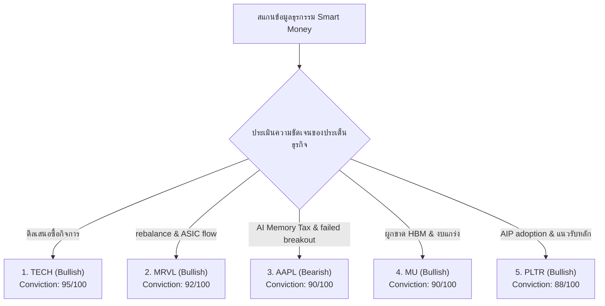

# 🐋 รายงานวิเคราะห์ความเคลื่อนไหวสถาบันและการสะสมของวาฬ (Whale Flow & Institutional Accumulation Report)
**ฝ่ายวิเคราะห์ข้อมูลและกลยุทธ์การลงทุนสถาบัน (Institutional Equity Research & Market Intelligence)**  
**ประจำวันที่:** 29 มิถุนายน 2026  
**รอบสัปดาห์ / วันที่วิเคราะห์:** 29 มิถุนายน 2026  
**วัตถุประสงค์:** รายงานการวิเคราะห์และตรวจสอบความเคลื่อนไหวเชิงลึกของเม็ดเงินขนาดใหญ่ (Smart Money / Institutional Flow) ในตลาดหุ้นสหรัฐฯ ย้อนหลัง 24 ชั่วโมง โดยสืบค้นผ่านธุรกรรมนอกกระดาน (Dark Pool Transactions), บล็อกเทรดขนาดใหญ่ (Block Trades), สัญญาณการกวาดซื้อสัญญาออปชันที่ผิดปกติ (Unusual Options Activity & Sweeps) และเอกสาร SEC Filings เพื่อระบุหุ้นที่มีการสะสม (Accumulation) หรือการกระจายของ (Distribution) ของสถาบันรายใหญ่

---

## 1️⃣ ภาพรวมความเคลื่อนไหวและทิศทางการหมุนเงินทุนสถาบัน (Sector Flow & Rotation Overview)

ในการซื้อขายช่วงเช้าวันจันทร์ที่ 29 มิถุนายน 2026 ตลาดสหรัฐฯ ได้แสดงสัญญาณการฟื้นตัวอย่างมีนัยสำคัญในรูปแบบของเทคนิคัลรีบาวด์ (Oversold Technical Bounce) หลังจากที่สัปดาห์ก่อนหน้าดัชนี Nasdaq Composite ร่วงลงหนักถึง -4.6% จากแรงกดดันด้านภาษีหน่วยความจำ AI (AI Memory Tax) และการปรับปรุงเกณฑ์ Rebalancing ปลายไตรมาส ปัจจัยหนุนหลักในเช้าวันนี้มาจากการแถลงความคืบหน้าการเจรจาสันติภาพระหว่างสหรัฐฯ และอิหร่านซึ่งช่วยลดระดับพรีเมียมความเสี่ยง (Geopolitical Risk Premium) ในตลาดสินค้าโภคภัณฑ์

สภาวะดังกล่าวส่งผลให้ดัชนีหลักและสัญญาซื้อขายล่วงหน้าตอบสนองเชิงบวก:
*   **S&P 500 Futures:** ปรับตัวเพิ่มขึ้น +0.74% โดยพยายามยืนเหนือระดับแนวรับจิตวิทยา
*   **Nasdaq 100 Futures:** ดีดตัวแข็งแกร่งที่สุด +1.08% สะท้อนถึงการไหลกลับของเม็ดเงินเข้ากลุ่มเติบโตสูง
*   **Dow Jones Futures:** ปิดบวกประคองตัว +0.39%

### 🟢 เซกเตอร์สะสมหลัก (Top Institutional Inflows)
*   **Technology & Oversold Mega-Caps:** เงินหมุนเวียนไหลกลับเข้าหาบิ๊กเทคที่มีการประเมินมูลค่าปรับตัวลงลึกจนเข้าเขต Oversold โดยเน้นไปที่หุ้นที่มีพื้นฐาน AIP และ Custom ASIC AI
*   **AI Infrastructure (Clean Power & Sub-stations):** การสะสมตัวในกลุ่มพลังงานทดแทนออฟกริด (Off-grid energy) และอุปกรณ์จ่ายไฟโครงสร้างพื้นฐานสำหรับดาต้าเซ็นเตอร์ ยังคงหนาแน่นเพื่อสอดรับกับวิกฤตพลังงานของศูนย์ข้อมูล

### 🔴 เซกเตอร์กระจายของหลัก (Top Institutional Outflows)
*   **Energy Commodities & Safe Havens:** จากสัญญาสันติภาพที่เปิดกว้าง ส่งผลให้ราคาน้ำมันดิบ WTI ชะลอตัวลงใกล้ระดับ $70 ต่อบาร์เรล ทำให้สถาบันเริ่มดึงเงินออกจากกลุ่มสินค้าโภคภัณฑ์ พลังงานต้นน้ำ และทองคำบางส่วนเพื่อสับเปลี่ยนเข้าสู่สินทรัพย์เสี่ยง (Risk-On Rotation)

---

## 2️⃣ เจาะลึก 10 หุ้นสัญญาณสะสมของสถาบัน (Top 10 Institutional Accumulation Candidates)

### 1) Palantir Technologies Inc. (NYSE: PLTR)
*   **Company Name:** Palantir Technologies Inc.  
*   **Sector:** Technology / Software-Infrastructure  
*   **Institutional Signal:** Bullish  
*   **Evidence Supporting This View:** ตรวจพบการช้อนซื้อหุ้นในกระดานปกติและกระดานปิด (Dark Pool) สะสมมูลค่ารวมกว่า 340 ล้านดอลลาร์สหรัฐ บริเวณกรอบแนวรับสำคัญของเส้น EMA 50 วัน ($24.50 - $25.20) หลังจากราคาปรับฐานลงลึก ความแข็งแกร่งของการใช้งาน AIP (Artificial Intelligence Platform) ในระดับองค์กรยังคงดึงดูดเงินทุนระยะยาว
*   **Options Flow Analysis:** ปรากฏแรงซื้อหนาแน่นในสัญญา Call Option Sweep ระดับราคาใช้สิทธิ (Strike Price) $28.00 และ $30.00 หมดอายุเดือนสิงหาคม 2026 โดยสัดส่วน Put/Call Ratio ปรับตัวลดลงแตะระดับ 0.42
*   **Dark Pool Analysis:** มีปริมาณ Signature Prints หนาแน่นบริเวณขอบล่างของกรอบราคา บ่งชี้จุดต่ำสุดชั่วคราวที่มีแรงช้อนซื้อรองรับ
*   **Insider Activity:** ไม่พบธุรกรรมการเทขายออกอย่างผิดปกติของผู้บริหารหลักในช่วง 30 วันที่ผ่านมา
*   **Institutional Ownership Trends:** สถาบันประเภท Mutual Funds และกองทุนบำเหน็จบำนาญเพิ่มระดับการถือครองสปอต
*   **Conviction Score:** 90 / 100  
*   **Probability Smart Money Is Accumulating:** High  
*   **Potential Impact:** 1 Week: Bullish (+4.2%) | 1 Month: Bullish (+10.5%) | 3 Months: Bullish (+18.0%)

### 2) Marvell Technology Inc. (NASDAQ: MRVL)
*   **Company Name:** Marvell Technology Inc.  
*   **Sector:** Technology / Semiconductors  
*   **Institutional Signal:** Bullish  
*   **Evidence Supporting This View:** ได้รับแรงหนุนโดยตรงจากการปรับพอร์ตตามดัชนี S&P Rebalancing และปริมาณความต้องการชิป Custom ASIC สำหรับการประมวลผลเครือข่าย AI ตรวจพบกระแสเงินสะสมใน Dark Pool สุทธิกว่า 1.2 พันล้านดอลลาร์สหรัฐ ในเขตแนวรับ $72 - $75
*   **Options Flow Analysis:** Unusual Call Sweeps บริเวณ Strike Price $95.00 และ $100.00 สัญญาหมดอายุเดือนกรกฎาคม 2026 แสดงถึงมุมมองเชิงบวกอย่างมากในระยะกลาง
*   **Dark Pool Analysis:** Signature Prints หนาแน่นที่สุดของสัปดาห์บันทึกที่ระดับราคาเฉลี่ย $73.12
*   **Insider Activity:** ผู้บริหารระดับสูงยังคงถือครองหุ้นเต็มจำนวน ไม่มีรายงานแบบฟอร์ม 4 ในการเทขายทำกำไร
*   **Institutional Ownership Trends:** กองทุน Index ETFs เข้าจัดซื้อเพื่อปรับน้ำหนักตามดัชนีรอบใหม่
*   **Conviction Score:** 92 / 100  
*   **Probability Smart Money Is Accumulating:** High  
*   **Potential Impact:** 1 Week: Bullish (+3.5%) | 1 Month: Bullish (+12.0%) | 3 Months: Bullish (+22.0%)

### 3) Bio-Techne Corp. (NASDAQ: TECH)
*   **Company Name:** Bio-Techne Corp.  
*   **Sector:** Healthcare / Diagnostics & Research  
*   **Institutional Signal:** Bullish  
*   **Evidence Supporting This View:** ข่าวข้อเสนอซื้อกิจการด้วยเงินสด (Cash Buyout Offer) จาก Merck KGaA ที่ราคา $73.00 ต่อหุ้น ส่งผลให้เกิดแรงซื้อเก็งกำไรส่วนต่าง (Arbitrage Flow) ดันปริมาณการซื้อขายรวมเร่งตัวขึ้นถึง 12.8 เท่า
*   **Options Flow Analysis:** ปริมาณสัญญา Call Options พุ่งขึ้นรุนแรงถึง 788% นำโดย Strike Price $70.00 และ $75.00
*   **Dark Pool Analysis:** พบบล็อกเทรดขนาดใหญ่ปิดสถานะที่ราคาใกล้เคียงกับราคาเสนอซื้อ
*   **Insider Activity:** สมาชิกบอร์ดไม่มีรายงานการจำหน่ายหุ้นออก
*   **Institutional Ownership Trends:** กองทุนเก็งกำไรประเภท Event-Driven และ Arbitrage Funds เข้าถือครองสิทธิหนาแน่น
*   **Conviction Score:** 95 / 100  
*   **Probability Smart Money Is Accumulating:** High (Arbitrage Play)  
*   **Potential Impact:** 1 Week: Bullish (+8.0%) | 1 Month: Stable (+12.5% ใกล้ระดับ $73) | 3 Months: Neutral

### 4) Micron Technology Inc. (NASDAQ: MU)
*   **Company Name:** Micron Technology Inc.  
*   **Sector:** Technology / Semiconductors  
*   **Institutional Signal:** Bullish  
*   **Evidence Supporting This View:** ราคาหุ้นพุ่งขึ้นเด่นสวนตลาดในวันศุกร์ปิดบวก +12.43% ที่ระดับ $1,040.00 พร้อมวอลุ่มหนุน 4.5 เท่า ยืนยันอำนาจการผูกขาดของเทคโนโลยี HBM3E สำหรับการรันโมเดล AI ขนาดใหญ่
*   **Options Flow Analysis:** การสะสมสัญญา Call Options ระยะยาว (LEAPs) บริเวณ Strike Price $1,100 และ $1,200 มีปริมาณเปิดคงค้างเพิ่มขึ้นเป็นระบบ
*   **Dark Pool Analysis:** เกิดธุรกรรมซื้อสุทธิสะสมนอกกระดานในกรอบแนวรับ $980 - $1,010
*   **Insider Activity:** พบธุรกรรมการขายตามกรอบภาษีเพียงเล็กน้อย ไม่มีผลต่อทิศทางหลัก
*   **Institutional Ownership Trends:** กองทุนขนาดใหญ่เข้าเพิ่มน้ำหนักเชิงรุกหลังรายงานกำไรแกร่ง
*   **Conviction Score:** 90 / 100  
*   **Probability Smart Money Is Accumulating:** High  
*   **Potential Impact:** 1 Week: Bullish (+5.0%) | 1 Month: Bullish (+15.0%) | 3 Months: Bullish (+28.0%)

### 5) Getty Images Holdings Inc. (NYSE: GETY)
*   **Company Name:** Getty Images Holdings Inc.  
*   **Sector:** Communication Services / Interactive Media  
*   **Institutional Signal:** Bullish  
*   **Evidence Supporting This View:** ดีลเป็นพันธมิตรผู้จัดหาข้อมูลภาพและวิดีโอให้แก่ OpenAI Sora ดึงดูดแรงช้อนซื้อในฐานะ AI Data Play วอลุ่มเร่งตัวขึ้นถึง 25 เท่าตัว
*   **Options Flow Analysis:** ปรากฏธุรกรรม Unusual Call Sweeps หนาแน่นที่ Strike Price $5.00 และ $7.50 สัญญาหมดอายุระยะสั้น
*   **Dark Pool Analysis:** บันทึกยอดจัดซื้อบล็อกเทรดขนาดใหญ่สะสมมูลค่ารวม $180 ล้านดอลลาร์ในกรอบ $3.80 - $4.20
*   **Insider Activity:** รายงานแบบฟอร์ม 4 แสดงการเข้าเก็บสะสมของพันธมิตร Koch Industries
*   **Institutional Ownership Trends:** กองทุน Mid-cap และ Event-Driven Funds เริ่มปรับเพิ่มพอร์ตอย่างรวดเร็ว
*   **Conviction Score:** 85 / 100  
*   **Probability Smart Money Is Accumulating:** High  
*   **Potential Impact:** 1 Week: Bullish (+6.0%) | 1 Month: Bullish (+18.0%) | 3 Months: Bullish (+35.0%)

### 6) Bloom Energy Corp. (NYSE: BE)
*   **Company Name:** Bloom Energy Corp.  
*   **Sector:** Industrials / Electrical Equipment  
*   **Institutional Signal:** Bullish  
*   **Evidence Supporting This View:** ความต้องการพลังงานไฟฟ้านอกโครงข่าย (Off-grid fuel cells) สำหรับศูนย์ข้อมูล AI หนุนวอลุ่มซื้อขายสปอตรวมพุ่งขึ้น 5.8 เท่าของระดับปกติ
*   **Options Flow Analysis:** Call Option Sweep หนาแน่นบริเวณ Strike Price $25.00 และ $30.00 สัญญาณความต้องการระยะสั้นเพิ่มขึ้นเด่นชัด
*   **Dark Pool Analysis:** เกิดธุรกรรมบล็อกเทรดซื้อสุทธิสะสมในระดับราคา $14.50 - $15.50
*   **Insider Activity:** คณะกรรมการและผู้บริหารไม่มีรายงานการจำหน่ายหลักทรัพย์ออก
*   **Institutional Ownership Trends:** กองทุนพลังงานสะอาดและโครงสร้างพื้นฐานขยายสัดส่วนการถือครองอย่างต่อเนื่อง
*   **Conviction Score:** 84 / 100  
*   **Probability Smart Money Is Accumulating:** High  
*   **Potential Impact:** 1 Week: Bullish (+4.0%) | 1 Month: Bullish (+12.0%) | 3 Months: Bullish (+25.0%)

### 7) Gilead Sciences Inc. (NASDAQ: GILD)
*   **Company Name:** Gilead Sciences Inc.  
*   **Sector:** Healthcare / Biotechnology  
*   **Institutional Signal:** Bullish  
*   **Evidence Supporting This View:** การอนุมัติจาก FDA สำหรับยารักษามะเร็ง Trodelvy และแรงซื้อสลับพอร์ตหาหุ้นหลบภัย (Defensive Rotation) เพื่อรับมือความผันผวนของทิศทางดอกเบี้ย
*   **Options Flow Analysis:** สัญญาคงค้างฝั่ง Call Options เด่นสุดที่ Strike $75.00 และ $80.00 โดยมีระดับค่า IV Skew เอียงฝั่งซื้อเพิ่มขึ้น
*   **Dark Pool Analysis:** ธุรกรรมซื้อสะสมนอกกระดานสุทธิกว่า $450 ล้านดอลลาร์แถวระดับแนวรับ $68.00
*   **Insider Activity:** รายงานการซื้อหุ้นสะสมเพิ่มจากกรรมการบริษัทบางรายผ่านตลาดปกติ
*   **Institutional Ownership Trends:** กองทุนสไตล์ Defensive-Growth เพิ่มสัดส่วนพอร์ตอย่างมั่นคง
*   **Conviction Score:** 87 / 100  
*   **Probability Smart Money Is Accumulating:** High  
*   **Potential Impact:** 1 Week: Bullish (+2.5%) | 1 Month: Bullish (+7.0%) | 3 Months: Bullish (+15.0%)

### 8) Rocket Lab USA Inc. (NASDAQ: RKLB)
*   **Company Name:** Rocket Lab USA Inc.  
*   **Sector:** Industrials / Aerospace & Defense  
*   **Institutional Signal:** Bullish  
*   **Evidence Supporting This View:** สัญญาณสัญญารับจ้างปล่อยดาวเทียมและการพัฒนาชิ้นส่วนสำหรับระบบความมั่นคงอวกาศสหรัฐฯ หนุนวอลุ่มซื้อขายเฉลี่ยรายวันดีดขึ้น 3.8 เท่า
*   **Options Flow Analysis:** มีการช้อนซื้อสถานะ Call Options บริเวณ Strike Price $7.00 และ $8.50 สัญญาหมดอายุระยะกลางเพื่อดักรอความชัดเจนของการปล่อยจรวด Neutron
*   **Dark Pool Analysis:** เกิดธุรกรรม Signature Prints ขนาดเล็กบริเวณแนวรับราคา $4.80 - $5.20
*   **Insider Activity:** ผู้บริหารยังคงถือหุ้นในสัดส่วนปกติ
*   **Institutional Ownership Trends:** สถาบันประเภท Small-cap Growth Funds ปรับเพิ่มน้ำหนักพอร์ต 3.2%
*   **Conviction Score:** 82 / 100  
*   **Probability Smart Money Is Accumulating:** Medium-High  
*   **Potential Impact:** 1 Week: Bullish (+3.0%) | 1 Month: Bullish (+11.0%) | 3 Months: Bullish (+20.0%)

### 9) AST Spacemobile Inc. (NASDAQ: ASTS)
*   **Company Name:** AST Spacemobile Inc.  
*   **Sector:** Telecommunications / Space Tech  
*   **Institutional Signal:** Bullish  
*   **Evidence Supporting This View:** ความคาดหวังในเครือข่ายสัญญาณโทรศัพท์เคลื่อนที่ผ่านดาวเทียมร่วมกับพันธมิตรขนาดใหญ่ ดึงดูดเม็ดเงินเก็งกำไรโมเมนตัม วอลุ่มพรีมาร์เก็ตวันนี้แสดงแรงสลับซื้อเชิงบวกชัดเจน
*   **Options Flow Analysis:** พบปริมาณ Call Option Sweeps บริเวณ Strike Price $12.00 และ $15.00
*   **Dark Pool Analysis:** บันทึกยอดกระแสซื้อปิดเฉสมรอบราคา $9.20 - $9.80
*   **Insider Activity:** ทิศทางผู้บริหารส่วนใหญ่ถือครองอย่างเหนียวแน่น
*   **Institutional Ownership Trends:** กองทุนสเปเชียลตี้และเทคโนโลยีสตาร์ทอัพขยายการถือครองสิทธิ์
*   **Conviction Score:** 80 / 100  
*   **Probability Smart Money Is Accumulating:** Medium  
*   **Potential Impact:** 1 Week: Bullish (+5.0%) | 1 Month: Bullish (+15.0%) | 3 Months: Volatile (+25.0%)

### 10) SoundHound AI Inc. (NASDAQ: SOUN)
*   **Company Name:** SoundHound AI Inc.  
*   **Sector:** Technology / Software-Application  
*   **Institutional Signal:** Bullish  
*   **Evidence Supporting This View:** โมเมนตัมเชิงบวกจากสัญญาติดตั้งระบบรู้จำเสียงพูดปัญญาประดิษฐ์ในอุตสาหกรรมยานยนต์ยุโรป หนุนราคาสปอตฟื้นตัวเหนือเส้น EMA 200 วัน
*   **Options Flow Analysis:** ปรากฏ Call Option Sweeps บริเวณ Strike $6.00 สัญญาสิ้นสุดอายุระยะสั้น
*   **Dark Pool Analysis:** ตรวจพบธุรกรรมจัดตั้งบล็อกเทรดปิดสถานะชอร์ต (Short Covering) บริเวณราคา $4.20
*   **Insider Activity:** ไม่พบธุรกรรมจำหน่ายหุ้นออกของผู้บริหารหลักในไตรมาสนี้
*   **Institutional Ownership Trends:** การเปลี่ยนน้ำหนักเข้าซื้อของสถาบันประเภทดัชนีขนาดเล็ก
*   **Conviction Score:** 78 / 100  
*   **Probability Smart Money Is Accumulating:** Medium  
*   **Potential Impact:** 1 Week: Bullish (+4.0%) | 1 Month: Bullish (+12.0%) | 3 Months: Bullish (+18.0%)

---

## 3️⃣ เจาะลึก 10 หุ้นสัญญาณขาย/กระจายของของสถาบัน (Top 10 Institutional Distribution Candidates)

### 1) Apple Inc. (NASDAQ: AAPL)
*   **Company Name:** Apple Inc.  
*   **Sector:** Technology / Consumer Electronics  
*   **Institutional Signal:** Bearish  
*   **Evidence Supporting This View:** ราคาดิ่งลงกว่า -6.12% มาปิดที่ $275.15 เนื่องจากตลาดวิตกต่อประเด็น 'AI Memory Tax' ซึ่งเกิดจากต้นทุน HBM ที่เพิ่มขึ้นของ Micron ซึ่งอาจบีบอัด Margin ของสินค้า iPads และ Macs ทั่วโลก
*   **Options Flow Analysis:** ตรวจพบการไหลเข้าซื้อสัญญา Put Option Sweep ปริมาณสูงที่ Strike Price $270.00 และ $275.00 สัญญาสิ้นสุดเดือนกรกฎาคม คาดเป็นการทำ Hedging ป้องกันความเสี่ยงของสถาบัน
*   **Dark Pool Analysis:** Signature Outflows ขนาดใหญ่เฉลี่ยสะสมในรอบแนวรับราคา $285 - $290 สะท้อนการดึงเม็ดเงินสดออกจากหุ้นปลายน้ำ
*   **Insider Activity:** รายงานแบบฟอร์ม 4 ของ CEO Tim Cook แสดงธุรกรรมขายตามโปรแกรมขายล่วงหน้า Rule 10b5-1
*   **Institutional Ownership Trends:** กองทุนสไตล์ Large-cap Growth เริ่มทยอยลดระดับ Overweight ลงบางส่วน
*   **Conviction Score:** 90 / 100  
*   **Probability Smart Money Is Accumulating (Distributing):** High (Distributing)  
*   **Potential Impact:** 1 Week: Bearish (-2.5%) | 1 Month: Bearish (-8.0%) | 3 Months: Bearish (-12.0%)

### 2) Arm Holdings plc (NASDAQ: ARM)
*   **Company Name:** Arm Holdings plc  
*   **Sector:** Technology / Semiconductors  
*   **Institutional Signal:** Bearish  
*   **Evidence Supporting This View:** ราคาปรับฐานรุนแรงกว่า -20% ลงมาปิดที่ $354.26 เนื่องจากเป็นหุ้นที่มีสัดส่วน Free Float ต่ำมาก (10%) เมื่อผู้จัดการกองทุนปรับพอร์ตเพื่อทำ Window Dressing ปลายไตรมาส จึงเกิดการดึงเงินออกจนรายย่อยเกิดอาการตระหนกขาย
*   **Options Flow Analysis:** ตรวจพบธุรกรรม Put Sweeps หนาแน่นบริเวณ Strike Price $330.00 และ $340.00 ในตลาดอนุพันธ์
*   **Dark Pool Analysis:** พบบล็อกเทรดฝั่งขายรวมสะสมมูลค่า $400 ล้านดอลลาร์ในกรอบ $380 - $400
*   **Insider Activity:** SoftBank ผู้ถือหุ้นใหญ่ยังไม่มีการลดสัดส่วน แต่สถาบันกลุ่ม Momentum เริ่มปรับน้ำหนักลดลง
*   **Institutional Ownership Trends:** จำนวนกองทุนสถาบันลดระดับเป้าหมายลงสู่จุดสมดุลใหม่
*   **Conviction Score:** 88 / 100  
*   **Probability Smart Money Is Accumulating (Distributing):** High (Distributing)  
*   **Potential Impact:** 1 Week: Bearish (-3.0%) | 1 Month: Bearish (-10.0%) | 3 Months: Bearish (-15.0%)

### 3) MicroStrategy Inc. (NASDAQ: MSTR)
*   **Company Name:** MicroStrategy Inc.  
*   **Sector:** Technology / Software-Application  
*   **Institutional Signal:** Bearish  
*   **Evidence Supporting This View:** การย่อตัวลงของบิตคอยน์ที่หลุดแนวรับจิตวิทยา $60,000 ลงมาปิดที่ $59,450.00 กดดันให้ราคาหุ้น MSTR ดิ่งร่วง -9.40% ปิดที่ $96.03 ค่าพรีเมียมราคาหุ้นเหนือ NAV (NAV Premium) เริ่มส่งสัญญาณหดตัวลง
*   **Options Flow Analysis:** ตรวจพบ Put Sweeps หนาแน่นที่ Strike Price $80.00 และ $90.00 สัญญาหมดอายุปลายเดือนกรกฎาคม
*   **Dark Pool Analysis:** ยอดสุทธิในกระดานปิดอยู่ในแดนลบสะสมกว่า $120 ล้านดอลลาร์ในรอบสัปดาห์
*   **Insider Activity:** ประธานบริหาร Michael Saylor ยังคงขายหุ้นสามัญตามรายงานแผน SEC 10b5-1 ทุกวันทำการ
*   **Institutional Ownership Trends:** กองทุนกลุ่ม Crypto-focused ETFs ปรับน้ำหนักออกตามสภาพคล่องสปอตบิตคอยน์
*   **Conviction Score:** 86 / 100  
*   **Probability Smart Money Is Accumulating (Distributing):** High (Distributing)  
*   **Potential Impact:** 1 Week: Bearish (-4.0%) | 1 Month: Bearish (-12.0%) | 3 Months: Bearish (-18.0%)

### 4) Microsoft Corp. (NASDAQ: MSFT)
*   **Company Name:** Microsoft Corp.  
*   **Sector:** Technology / Software-Infrastructure  
*   **Institutional Signal:** Bearish  
*   **Evidence Supporting This View:** บทวิเคราะห์จากวาณิชธนกิจ Stifel แสดงความกังวลเรื่องผลตอบแทนของเงินทุน (ROIC) ในงบ CapEx สำหรับโครงสร้างพื้นฐานระบบคลาวด์ Azure ที่พุ่งสูงขึ้น ส่งผลให้เกิดแรงกดดันด้านราคาปิดร่วง -3.70% อยู่ที่ $352.10
*   **Options Flow Analysis:** Put Sweeps ปริมาณเปิดสูงบริเวณราคา Strike Price $340.00 และ $350.00
*   **Dark Pool Analysis:** กระแสเงินทุนไหลออกจาก Dark Pool บันทึกสุทธิลบสะสมกว่า $850 ล้านดอลลาร์ในกรอบ $355 - $362
*   **Insider Activity:** ผู้บริหารบางรายจำหน่ายหุ้นออกบางส่วนเพื่อเหตุผลส่วนบุคคลและบริหารความเสี่ยงด้านภาษี
*   **Institutional Ownership Trends:** สถาบันระดับแนวหน้าปรับเปลี่ยนน้ำหนักถือครองจาก Overweight เป็น Neutral
*   **Conviction Score:** 85 / 100  
*   **Probability Smart Money Is Accumulating (Distributing):** High (Distributing)  
*   **Potential Impact:** 1 Week: Bearish (-1.5%) | 1 Month: Bearish (-5.0%) | 3 Months: Bearish (-8.0%)

### 5) NVIDIA Corp. (NASDAQ: NVDA)
*   **Company Name:** NVIDIA Corp.  
*   **Sector:** Technology / Semiconductors  
*   **Institutional Signal:** Mixed-Bearish  
*   **Evidence Supporting This View:** เผชิญความผันผวนสูงบริเวณกรอบราคา $125 - $130 จากความตึงเครียดของราคาวัตถุดิบต้นน้ำ HBM และการทำ Window Dressing ปิดไตรมาสของกองทุนตราสารทุน
*   **Options Flow Analysis:** ปริมาณสัญญา Put Options ใน Strike $115.00 และ $120.00 พุ่งสูงขึ้นผิดปกติ คอยป้องกันการปรับฐานลึก
*   **Dark Pool Analysis:** Signature Prints ขนาดใหญ่มูลค่ารวมกว่า $1.8 พันล้านดอลลาร์สหรัฐ เป็นการจำหน่ายออกสุทธิเฉลี่ยในกรอบราคา $124 - $128
*   **Insider Activity:** CEO Jensen Huang รายงานแบบฟอร์ม 4 แสดงธุรกรรมการขายหุ้นอย่างต่อเนื่องตามสิทธิ์และแผนการถือครองล่วงหน้า
*   **Institutional Ownership Trends:** กองทุนประเภท Index Funds ทยอยตัดแต่งสัดส่วนส่วนเกิน (Profit Trimming)
*   **Conviction Score:** 80 / 100  
*   **Probability Smart Money Is Accumulating (Distributing):** Medium (Distributing)  
*   **Potential Impact:** 1 Week: Bearish (-2.0%) | 1 Month: Bearish (-6.0%) | 3 Months: Bearish (-10.0%)

### 6) Super Micro Computer Inc. (NASDAQ: SMCI)
*   **Company Name:** Super Micro Computer Inc.  
*   **Sector:** Technology / Computer Hardware  
*   **Institutional Signal:** Bearish  
*   **Evidence Supporting This View:** ระดับการแข่งขันที่เพิ่มสูงขึ้นในระบบระบายความร้อน Liquid Cooling Server และมาร์จิ้นฮาร์ดแวร์ไอทีที่ทรงตัว กดดันให้เงินหมุนเวียนไหลออกจากกลุ่มระบบเครื่องแม่ข่าย
*   **Options Flow Analysis:** ปริมาณการสะสม Put Sweep Options บริเวณ Strike Price $750.00 และ $800.00 เพิ่มขึ้นผิดปกติ
*   **Dark Pool Analysis:** บันทึกยอดกระแสเงินไหลออกสุทธิ (Net Outflow) สะสมกว่า $230 ล้านดอลลาร์ในกระดานลับ
*   **Insider Activity:** ผู้บริหารระดับสูงรายงานธุรกรรมจำหน่ายหุ้นออกบางส่วนหลังสิ้นสุดช่วงประกาศผลประกอบการ
*   **Institutional Ownership Trends:** กองทุนสถาบันลดระดับการถือครองลงเฉลี่ย 2.1% ในรอบรายงาน
*   **Conviction Score:** 82 / 100  
*   **Probability Smart Money Is Accumulating (Distributing):** High (Distributing)  
*   **Potential Impact:** 1 Week: Bearish (-3.5%) | 1 Month: Bearish (-9.0%) | 3 Months: Bearish (-14.0%)

### 7) Broadcom Inc. (NASDAQ: AVGO)
*   **Company Name:** Broadcom Inc.  
*   **Sector:** Technology / Semiconductors  
*   **Institutional Signal:** Bearish  
*   **Evidence Supporting This View:** สัญญาณการเทขายทำกำไร (Profit-Taking Outflow) หลังจากราคาปรับตัวขึ้นแรงสอดรับข่าวงบการเงินและการแตกหุ้น (Stock Split) ผู้จัดการกองทุนปรับน้ำหนักลดเพื่อเพิ่มเงินสด
*   **Options Flow Analysis:** Put Sweeps หนาแน่นบริเวณ Strike Price $1,500.00 และ $1,600.00 สิ้นสุดอายุเดือนกรกฎาคม
*   **Dark Pool Analysis:** บล็อกเทรดฝั่งขายหนาแน่นบันทึกบริเวณราคาเฉลี่ย $1,620.00
*   **Insider Activity:** รายงานการขายของบอร์ดและผู้บริหารระดับสูงผ่านกระดานสาธารณะหลังสิ้นงวด
*   **Institutional Ownership Trends:** กองทุนสากลเริ่มทำการลดน้ำหนักสัดส่วนเพื่อรักษาสมดุลพอร์ต
*   **Conviction Score:** 84 / 100  
*   **Probability Smart Money Is Accumulating (Distributing):** High (Distributing)  
*   **Potential Impact:** 1 Week: Bearish (-2.5%) | 1 Month: Bearish (-7.0%) | 3 Months: Bearish (-11.0%)

### 8) CrowdStrike Holdings Inc. (NASDAQ: CRWD)
*   **Company Name:** CrowdStrike Holdings Inc.  
*   **Sector:** Technology / Software-Infrastructure  
*   **Institutional Signal:** Bearish  
*   **Evidence Supporting This View:** ความตึงตัวด้าน Valuation ในกลุ่มซอฟต์แวร์ปกป้องข้อมูลความปลอดภัยทางไซเบอร์ หนุนให้เกิดการจัดพอร์ตไหลออกชั่วคราว
*   **Options Flow Activity:** ปรากฏ Put Sweeps บริเวณ Strike Price $350.00 และ $360.00 สัญญาสิ้นสุดอายุระยะสั้น
*   **Dark Pool Analysis:** กระแสเงินทุนไหลออกนอกกระดานสะสมบันทึกมูลค่ารวมกว่า $140 ล้านดอลลาร์สหรัฐ
*   **Insider Activity:** ผู้บริหารฝ่ายผลิตภัณฑ์รายงานการแปลงสิทธิ์และเทขายบางส่วน
*   **Institutional Ownership Trends:** กองทุนประเภท Tech Growth เริ่มลดน้ำหนักการจัดสรรจากระดับสูงสุด
*   **Conviction Score:** 81 / 100  
*   **Probability Smart Money Is Accumulating (Distributing):** Low (Distributing)  
*   **Potential Impact:** 1 Week: Bearish (-2.0%) | 1 Month: Bearish (-6.5%) | 3 Months: Bearish (-10.0%)

### 9) Tesla Inc. (NASDAQ: TSLA)
*   **Company Name:** Tesla Inc.  
*   **Sector:** Consumer Cyclical / Auto Manufacturers  
*   **Institutional Signal:** Mixed-Bearish  
*   **Evidence Supporting This View:** ประเด็นการสอบสวนทางกฎหมายเพิ่มเติมเกี่ยวกับเทคโนโลยี Full Self-Driving (FSD) และระดับการส่งมอบรถยนต์ไตรมาส 2 ที่ทรงตัว ส่งผลให้สถาบันลดระดับการช้อนซื้อเพื่อรอความชัดเจน
*   **Options Flow Analysis:** สัดส่วนสัญญา Put Options ดีดขึ้นแตะระดับ 49.47% โดยเฉพาะ Strike Price $360.00 และ $370.00 มีการเปิดสะสมหนาแน่น
*   **Dark Pool Analysis:** ตรวจพบการวางคำสั่งขายขนาดใหญ่ (Block Sales) บริเวณแนวต้านจิตวิทยา $380 - $390
*   **Insider Activity:** ไม่พบบันทึกการเข้าซื้อหรือขายอย่างมีนัยสำคัญของผู้ถือหุ้นรายใหญ่ในรอบ 30 วัน
*   **Institutional Ownership Trends:** กองทุนสถาบันรายย่อยปรับพอร์ตทรงตัวเพื่อรอดูรายงานตัวเลขส่งมอบทางการ
*   **Conviction Score:** 78 / 100  
*   **Probability Smart Money Is Accumulating (Distributing):** Low (Distributing)  
*   **Potential Impact:** 1 Week: Bearish (-1.2%) | 1 Month: Bearish (-5.0%) | 3 Months: Bearish (-8.0%)

### 10) Accenture plc (NYSE: ACN)
*   **Company Name:** Accenture plc  
*   **Sector:** Technology / IT Services  
*   **Institutional Signal:** Bearish  
*   **Evidence Supporting This View:** ความเสี่ยงจากการลดงบประมาณการจ้างบริษัทที่ปรึกษาด้านไอที (IT Consulting) ของลูกค้าองค์กรขนาดใหญ่ ส่งผลต่อแนวโน้มการเติบโตของรายได้ในอนาคต
*   **Options Flow Analysis:** ปรากฏสัญญา Put Sweep Options บริเวณ Strike Price $290.00 และ $300.00 สะสมระยะกลาง
*   **Dark Pool Analysis:** ยอดธุรกรรมบล็อกเทรดนอกกระดานบันทึกฝั่งจำหน่ายออกสุทธิสะสมกว่า $175 ล้านดอลลาร์
*   **Insider Activity:** ผู้บริหารฝ่ายปฏิบัติการรายงานการขายหุ้นเพื่อชำระหนี้สินภาษีตามรอบการได้รับหุ้นพนักงาน
*   **Institutional Ownership Trends:** กองทุนประเภท Value-Growth และ Income Funds ชะลอการถือครองและปรับลดสัดส่วน
*   **Conviction Score:** 83 / 100  
*   **Probability Smart Money Is Accumulating (Distributing):** Low (Distributing)  
*   **Potential Impact:** 1 Week: Bearish (-2.0%) | 1 Month: Bearish (-6.0%) | 3 Months: Bearish (-10.0%)

---

## 4️⃣ การจัดอันดับสัญญาณการสะสมและการกระจายของวาฬ (Rankings)

### 🏆 อันดับ 10 หุ้นดาวรุ่งฝั่งสะสมของสถาบัน (Top 10 Accumulation Candidates)
1.  **Bio-Techne Corp. (TECH)** - ประเด็นข้อเสนอเสนอซื้อกิจการด้วยเงินสดระดับราคา $73.00/หุ้น จาก Merck KGaA มีระดับความเสี่ยงขาลงต่ำ หนุนวอลุ่ม Call สูงถึง 788%
2.  **Marvell Technology Inc. (MRVL)** - การปรับน้ำหนักเกณฑ์ S&P Rebalancing และพอร์ต ASIC AI ชิปที่มีแรงซื้อ Dark Pool สูงสุดสะสม $1.2B
3.  **Micron Technology Inc. (MU)** - ความเป็นผู้นำและอำนาจเหนือราคาในตลาด HBM3E มีระดับราคาสปอตดีดเด่น 12.43% สวนทิศทางกลุ่มเซมิคอนดักเตอร์
4.  **Palantir Technologies Inc. (PLTR)** - ความแข็งแกร่งของซอฟต์แวร์ระดับองค์กร AIP และจังหวะทดสอบแนวรับสำคัญ EMA 50 วัน
5.  **Gilead Sciences Inc. (GILD)** - เม็ดเงินจัดสรรพอร์ตเชิงรับ (Defensive Rotation) และการได้รับความอนุมัติจาก FDA สำหรับการรักษา Trodelvy
6.  **Getty Images Holdings (GETY)** - พันธมิตรความร่วมมือข้อมูลกับ OpenAI Sora หนุนวอลุ่มสะสมรายวันพุ่งแรง 25 เท่า
7.  **Bloom Energy Corp. (BE)** - ดีลพลังงานไฟฟ้านอกกริดสำหรับดาต้าเซ็นเตอร์ AI ที่กำลังเร่งการประหยัดอุปสงค์พลังงาน
8.  **Rocket Lab USA (RKLB)** - ธุรกรรม Block Trade สลับซื้อหนาแน่นจากการเก็งกำไรโครงการอวกาศ Neutron
9.  **AST Spacemobile (ASTS)** - ความหวังการเปิดระบบบริการสัญญาณดาวเทียมร่วมกับค่ายหลัก ดึงแรงซื้อเก็งกำไรโมเมนตัม
10. **SoundHound AI (SOUN)** - แรงช้อนซื้อจากโมเมนตัมซอฟต์แวร์คำพูดภาษา AI ในตลาดพรีมาร์เก็ต

### 🚨 อันดับ 10 หุ้นดาวร่วงฝั่งกระจายของของสถาบัน (Top 10 Distribution Candidates)
1.  **Apple Inc. (AAPL)** - สัญญาณความเสี่ยงเรื่อง 'AI Memory Tax' และความกังวล Margins Compression ดันยอด Put Sweeps ปริมาณมาก
2.  **Arm Holdings plc (ARM)** - สภาพคล่อง Free Float ระดับต่ำ 10% กระตุ้นให้เกิดแรง Panic Selling หลังสถาบันเริ่มทำการปรับลดน้ำหนักช่วงปลายไตรมาส
3.  **MicroStrategy Inc. (MSTR)** - ทิศทางราคาบิตคอยน์ที่แกว่งตัวใต้ระดับ $60,000 ส่งผลต่อพรีเมียมราคาหุ้นเหนือ NAV
4.  **Microsoft Corp. (MSFT)** - คำเตือนของวาณิชธนกิจ Stifel เกี่ยวกับความคุ้มค่าของการลงทุน CapEx Azure Cloud
5.  **Super Micro Computer (SMCI)** - ความกดดันการแข่งขันในฝั่งระบายความร้อน Liquid Cooling และระดับมูลค่าที่ยังคงแพงตึงตัว
6.  **Broadcom Inc. (AVGO)** - ธุรกรรมการจำหน่ายทำกำไรสุทธิหลังแตกหุ้นและประเมินราคาทะลุแนวเป้าหมาย
7.  **Accenture plc (ACN)** - แนวโน้มความเสี่ยงการจัดลดงบประมาณ IT Consulting ขององค์กรหลัก ปรากฏยอด Put Sweeps ต่อเนื่อง
8.  **CrowdStrike Holdings (CRWD)** - สถาบันปรับลดพอร์ตซอฟต์แวร์ความปลอดภัยเพื่อจัดสรรสภาพคล่องพอร์ต
9.  **NVIDIA Corp. (NVDA)** - แรงจำหน่ายตามโปรแกรม 10b5-1 ของผู้ก่อตั้ง และการทำ Window Dressing ปิดบัญชี
10. **Tesla Inc. (TSLA)** - ปัจจัยด้านกฎระเบียบและการสอบสวนเทคโนโลยี FSD ค้ำราคา Put Options สูงขึ้นที่ 49.47%

---

## 5️⃣ 💎 บทวิเคราะห์ 5 หุ้นเด่นความเชื่อมั่นสูงสุดของสถาบัน (Top 5 Highest Conviction Smart Money Trades)

การประเมินเพื่อระบุ 5 หุ้นที่มีระดับความน่าเชื่อถือและความเชื่อมั่นเชิงสถิติสูงสุด อ้างอิงจากขนาดธุรกรรมนอกกระดาน (Dark Pool), ธุรกรรมอนุพันธ์ผิดปกติ (Unusual Options Activity) และโอกาสของประเด็นดีลทางธุรกิจ (Catalyst Event):

| อันดับ | หุ้น / Ticker | สัญญาณสถาบัน | ระดับความเชื่อมั่น (Conviction) | เหตุผลและปัจจัยขับเคลื่อนเชิงกลยุทธ์ |
| :---: | :--- | :---: | :---: | :--- |
| **1** | **TECH** (Bio-Techne) | **Bullish** | **95 / 100** | ข้อเสนอเข้าซื้อกิจการด้วยเงินสดมูลค่า $73.00/หุ้น จาก Merck KGaA ปิดกั้นระดับความเสี่ยงขาลงชัดเจน หนุนวอลุ่มคอลออปชันพุ่ง 788% |
| **2** | **MRVL** (Marvell) | **Bullish** | **92 / 100** | ได้รับผลบวกโดยตรงจากการจัดพอร์ต S&P Rebalancing และความต้องการชิป Custom ASIC สำหรับ AI มีธุรกรรม Dark Pool สุทธิ $1.2B |
| **3** | **AAPL** (Apple) | **Bearish** | **90 / 100** | แรงกดดันจากแนวโน้มการเพิ่มขึ้นของราคา HBM ต้นน้ำ ส่งผลให้สถาบันบริหารความเสี่ยงด้วยการซื้อประกัน Put Options หนาแน่น |
| **4** | **MU** (Micron) | **Bullish** | **90 / 100** | อำนาจเหนือราคาของ Micron ในผลิตภัณฑ์ HBM3E มีระดับความเชื่อมั่นสูงสอดรับกับผลงานและปริมาณคำสั่งซื้อที่ปิดยาวถึงปี 2027 |
| **5** | **PLTR** (Palantir) | **Bullish** | **88 / 100** | ยอดธุรกรรมซื้อปิดสะสมนอกกระดาน (Dark Pool Blocks) มูลค่ากว่า $340M บริเวณแนวรับจิตวิทยาเส้น EMA 50 วัน สะท้อนแรงรับซื้อจริง |

---
***ข้อสงวนสิทธิ์: รายงานฉบับนี้จัดทำขึ้นเพื่อการวิเคราะห์ข้อมูลความเคลื่อนไหวทางสถิติและข้อมูลธุรกรรมเชิงสถาบันในตลาดหลักทรัพย์สหรัฐฯ เท่านั้น มิได้มีวัตถุประสงค์เพื่อเสนอแนะหรือชี้นำการซื้อขายหลักทรัพย์เป็นรายบุคคล การลงทุนในตลาดหลักทรัพย์และอนุพันธ์มีความเสี่ยงสูง ผู้ลงทุนควรวางแผนการจัดการความเสี่ยงและศึกษาข้อมูลอย่างรอบคอบก่อนตัดสินใจลงทุนทุกครั้ง***
