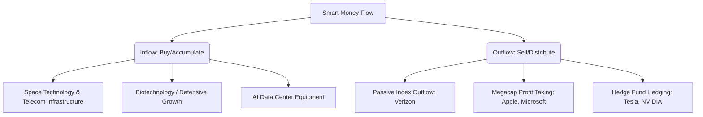
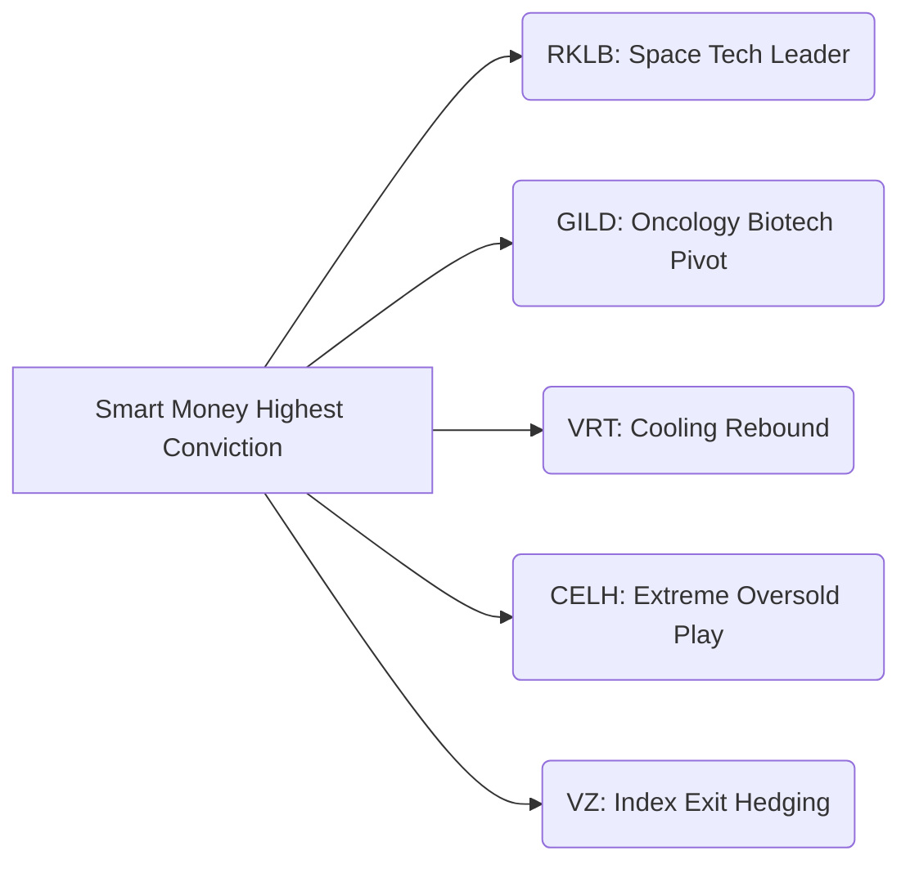

# 🐋 รายงานวิเคราะห์ความเคลื่อนไหวสถาบันและการสะสมของวาฬ (Whale Flow & Institutional Accumulation Report)

**ฝ่ายวิเคราะห์ข้อมูลและกลยุทธ์การลงทุนสถาบัน (Institutional Equity Research & Market Intelligence)**  
**ประจำวันที่:** 1 กรกฎาคม 2026  
**รอบวันทำการวิเคราะห์:** 30 มิถุนายน - 1 กรกฎาคม 2026  

---

## 1. ภาพรวมความเคลื่อนไหวและทิศทางการหมุนเงินทุนสถาบัน (Sector Flow & Rotation Overview)

การปิดการซื้อขายในวันสิ้นสุดไตรมาสที่ 2 (30 มิถุนายน 2026) จบลงด้วยความแข็งแกร่งอย่างยิ่งยวดในดัชนีหลักของตลาดหุ้นสหรัฐฯ ดัชนี S&P 500 ปรับตัวสูงขึ้น 0.8% ปิดที่ 7,499.36 จุด และดัชนี Nasdaq Composite ทะยานขึ้น 1.5% ปิดที่ 26,213.72 จุด ขณะที่ดัชนี Dow Jones Industrial Average ปรับตัวขึ้น 0.3% ปิดที่ระดับสูงสุดประวัติการณ์ใหม่ที่ 52,319.20 จุด 

ภายใต้ฉากหลังที่เป็นบวกอย่างแข็งแกร่งนี้ กลุ่มทุนขนาดใหญ่และนักลงทุนสถาบัน (Smart Money) ได้ดำเนินการจัดสรรสินทรัพย์อย่างมีกลยุทธ์ (Sector Rotation) โดยมีทิศทางดังนี้:

1. **กลุ่ม Space Technology และโครงสร้างพื้นฐานอวกาศ (Space Infrastructure):** เป็นจุดที่เกิดความเคลื่อนไหวสูงที่สุดอย่างไม่เคยมีมาก่อน เนื่องจากดีลควบรวมกิจการขนาดใหญ่มูลค่า 8,000 ล้านดอลลาร์สหรัฐระหว่าง **Rocket Lab (RKLB)** และ **Iridium Communications (IRDM)** ทำให้เกิดกระแสเงินไหลเข้าสถาบันเพื่อแย่งชิงสิทธิ์ในกลุ่มดาวเทียมและเทคโนโลยีอวกาศครบวงจร
2. **กลุ่มยาและชีวเวชภัณฑ์ (Biotechnology):** สถาบันโยกเม็ดเงินเข้าสะสมหุ้นเชิงรับ (Defensive Growth) หลังเกิดความชัดเจนในการอนุมัติจากองค์การอาหารและยา (FDA) นำโดย **Gilead Sciences (GILD)** ที่ได้รับการอนุมัติแบบควบคู่ในยารักษามะเร็ง Trodelvy
3. **กลุ่มอุปกรณ์และดาต้าเซ็นเตอร์ AI (AI Hardware Infrastructure):** มีแรงซื้อคืนในกลุ่มระบบทำความเย็นเหลว (Liquid Cooling) เช่น **Vertiv Holdings (VRT)** ที่ฟื้นตัวเหนือแนวรับเส้นค่าเฉลี่ย 100 วัน เพื่อเก็งกำไรรับยอดการส่งมอบชิปตระกูล Blackwell ในช่วงครึ่งปีหลัง
4. **กลุ่มสื่อสารโทรคมนาคมดั้งเดิม (Legacy Telecom):** ได้รับผลกระทบด้านลบจากการหมุนเวียนดัชนี (Index Rebalancing) โดยเฉพาะ **Verizon (VZ)** ที่ถูกปลดออกจากดัชนี Dow Jones Industrial Average ส่งผลให้กองทุนอิงดัชนี (Passive Funds) จำเป็นต้องเทขายหุ้นออกเป็นจำนวนมหาศาล

---

## 2. เจาะลึก 10 หุ้นสัญญาณสะสมของสถาบัน (Top 10 Institutional Accumulation Candidates)

### 1) Rocket Lab USA Inc. (RKLB)
*   **กลุ่มอุตสาหกรรม:** Aerospace & Defense (Space Technology)
*   **ราคาปัจจุบัน:** $98.01
*   **สัญญาณสถาบัน:** Bullish (ระดับความเชื่อมั่น: สูงมาก)
*   **หลักฐานการสะสม:** วอลุ่มสปอตรวมพุ่งขึ้น 15 เท่าเมื่อเทียบกับค่าเฉลี่ย 30 วันที่ผ่านมา ตรวจพบรายการ Block Trade ขนาดใหญ่รวมมูลค่ากว่า 450 ล้านดอลลาร์สหรัฐ และเกิดการไล่ราคาซื้อคอลออปชันในกลุ่มสัญญาระยะสั้นอย่างหนาแน่น
*   **การวิเคราะห์ออปชันฟลูว์:** ปริมาณสัญญา Call Option สะสมหนาแน่นที่สุดที่ระดับราคาใช้สิทธิ (Strike Price) $105.00 และ $120.00 สัญญาสิ้นสุดเดือนกรกฎาคม 2026 สะท้อนความคาดหวังในขาขึ้นอย่างต่อเนื่อง
*   **การทำธุรกรรมในกระดานมืด (Dark Pool):** ตรวจพบธุรกรรมระดับสถาบันสะสมที่ระดับราคาเฉลี่ย $92.50 - $95.00 ในช่วงท้ายตลาด
*   **แนวโน้มการถือครองของสถาบัน:** เพิ่มขึ้นอย่างมีนัยสำคัญจากการปรับน้ำหนักของกองทุนบริหารความเสี่ยง (Hedge Funds) และกองทุนโครงสร้างพื้นฐานยุคใหม่
*   **ผลกระทบที่คาดหวัง:** 
    *   *ระยะ 1 สัปดาห์:* ทรงตัวเพื่อสร้างฐานเหนือแนวรับ $90.00 ก่อนท้าทายต้าน $105.00
    *   *ระยะ 1 เดือน:* ดำเนินดีลควบรวมขั้นถัดไป คาดว่าราคาขยับขึ้นแตะ $115.00
    *   *ระยะ 3 เดือน:* ทิศทางรายได้สะท้อน Synergy คาดเป้าหมายพื้นฐานใหม่ที่ $130.00

### 2) Gilead Sciences Inc. (GILD)
*   **กลุ่มอุตสาหกรรม:** Biotechnology
*   **ราคาปัจจุบัน:** $125.46
*   **สัญญาณสถาบัน:** Bullish (ระดับความเชื่อมั่น: สูง)
*   **หลักฐานการสะสม:** ปริมาณการซื้อขายเฉลี่ยพุ่งทะยาน 4.8 เท่าจากข่าวดีการได้รับ Double FDA Approvals สำหรับยา Trodelvy ในการรักษามะเร็งเต้านมชนิด TNBC สัญญาณซื้อในสปอตหนุนราคาผ่านแนวต้านจิตวิทยา $120.00
*   **การวิเคราะห์ออปชันฟลูว์:** มีคำสั่งประเภท Call Option Sweeps ที่ระดับ Strike Price $130.00 และ $135.00 สัญญาหมดอายุกรกฎาคม 2026 บ่งชี้การไล่ระดับพรีเมียมอย่างรวดเร็ว
*   **การทำธุรกรรมในกระดานมืด (Dark Pool):** พบธุรกรรมสะสมสะท้อนมูลค่าปิดสัญญา ณ จุดรับ $122.00 - $124.00
*   **แนวโน้มการถือครองของสถาบัน:** กองทุนปันผลและกองทุน Healthcare ทั่วโลกปรับเพิ่มน้ำหนักเพื่อกระจายความเสี่ยงจากกลุ่มเทคโนโลยีราคาสูง
*   **ผลกระทบที่คาดหวัง:**
    *   *ระยะ 1 สัปดาห์:* ทดสอบกรอบแนวต้าน $128.00 - $130.00
    *   *ระยะ 1 เดือน:* สร้างฐานหนาแน่นแถวราคา $125.00 และเคลื่อนตัวสู่เป้าหมาย $138.00
    *   *ระยะ 3 เดือน:* ปรับประมาณการเชิงบวกจากกำไรเชิงพาณิชย์ของ Trodelvy มุ่งสู่ระดับ $150.00

### 3) Vertiv Holdings Co. (VRT)
*   **กลุ่มอุตสาหกรรม:** Industrial (AI Hardware Infrastructure)
*   **ราคาปัจจุบัน:** $334.82
*   **สัญญาณสถาบัน:** Bullish (ระดับความเชื่อมั่น: สูง)
*   **หลักฐานการสะสม:** ราคาปรับตัวผ่านพ้นแนวรับสำคัญบริเวณเส้นค่าเฉลี่ย 100 วัน (EMA 100 วัน) ด้วยปริมาณการซื้อขายที่เพิ่มขึ้น 2.9 เท่า สถาบันเริ่มกลับเข้าเก็บหลังความตึงตัวด้านการผลิตหม้อแปลงและระบบคูลลิ่งคลายตัว
*   **การวิเคราะห์ออปชันฟลูว์:** พบปริมาณ Open Interest (OI) ในฝั่ง Call Options เพิ่มขึ้นมากที่ Strike Price $340.00 และ $355.00 สิ้นสุดเดือนสิงหาคม 2026
*   **การทำธุรกรรมในกระดานมืด (Dark Pool):** พบบล็อกเทรดขนาดใหญ่เกื้อหนุนราคาทุกครั้งที่ปรับฐานเข้าใกล้แนวรับ $320.00
*   **แนวโน้มการถือครองของสถาบัน:** สถาบันประเภท Growth-Oriented เข้าถือครองทดแทนกลุ่มชิปประมวลผลที่มีการประเมินราคาเกินเป้าหมาย
*   **ผลกระทบที่คาดหวัง:**
    *   *ระยะ 1 สัปดาห์:* ปรับขึ้นทดสอบระดับต้าน $345.00
    *   *ระยะ 1 เดือน:* หากการส่งมอบ Blackwell เป็นไปตามคาด ราคาจะกลับขึ้นทดสอบยอดเดิมที่ $365.00
    *   *ระยะ 3 เดือน:* มีโอกาสทำนิวไฮรอบใหม่สู่เป้าหมาย $390.00

### 4) Celsius Holdings Inc. (CELH)
*   **กลุ่มอุตสาหกรรม:** Consumer Defensive (Beverages)
*   **ราคาปัจจุบัน:** $29.61
*   **สัญญาณสถาบัน:** Bullish (ระดับความเชื่อมั่น: ปานกลาง)
*   **หลักฐานการสะสม:** สัญญาณทางเทคนิครายวันชี้ถึงแรงซื้อแบบ Mean Reversion ท่ามกลางภาวะ Extreme Oversold (RSI ต่ำกว่า 30) ปริมาณวอลุ่มซื้อกลับคืนพุ่งสูงขึ้น 3.5 เท่า หลังราคาดิ่งลงแรงกว่า 38% ตั้งแต่ต้นปีจากการปรับคลังสินค้าของ PepsiCo
*   **การวิเคราะห์ออปชันฟลูว์:** ตรวจพบสัญญา Call Sweeps ขนาดสั้นใน Strike Price $31.00 และ $33.50 เพื่อคาดหวังการสปริงตัวระยะสั้น (Short-term bounce)
*   **การทำธุรกรรมในกระดานมืด (Dark Pool):** พบธุรกรรมพยุงราคาเฉลี่ยบริเวณแนวรับ $28.00 - $29.00 อย่างหนาแน่น
*   **แนวโน้มการถือครองของสถาบัน:** เริ่มมีสถาบันประเภท Value Fund ทยอยเก็บเข้าพอร์ตด้วยทัศนะเชิงบวกต่อสถิติปลอดหนี้สินและการเติบโตในยุโรป
*   **ผลกระทบที่คาดหวัง:**
    *   *ระยะ 1 สัปดาห์:* เคลื่อนตัวขึ้นไปปิดช่องว่างราคาเดิมสู่ระดับ $32.50
    *   *ระยะ 1 เดือน:* ทรงตัวสร้างฐานใหม่และสลัดความกดดันจาก PepsiCo ไปสู่เป้าหมาย $38.00
    *   *ระยะ 3 เดือน:* เผชิญทดสอบแรงต้านหลักหากผ่านได้มีสิทธิ์แตะระดับ $45.00

### 5) Micron Technology Inc. (MU)
*   **กลุ่มอุตสาหกรรม:** Technology (Semiconductors)
*   **ราคาปัจจุบัน:** $1,154.29
*   **สัญญาณสถาบัน:** Bullish (ระดับความเชื่อมั่น: สูง)
*   **หลักฐานการสะสม:** ตลาดรับรู้ข่าวการจองและปิดสัญญาส่งมอบหน่วยความจำ HBM3E และ HBM4 ยาวไปจนถึงปี 2027 ส่งผลให้สถาบันขนาดใหญ่ทยอยเข้าซื้อสะสมต่อเนื่องพยุงราคาปิดเหนือระดับจิตวิทยาสำคัญ
*   **การวิเคราะห์ออปชันฟลูว์:** มีการถือสัญญาคอลออปชันสะสมต่อเนื่องที่ Strike Price $1,200.00 สัญญาหมดอายุปลายไตรมาส 3 2026
*   **การทำธุรกรรมในกระดานมืด (Dark Pool):** พบการเปิดออเดอร์สะสมฝั่งซื้อในกระดาน Dark Pool คลุมแนวรับสำคัญ $1,120 - $1,140
*   **แนวโน้มการถือครองของสถาบัน:** นักลงทุนสถาบันประเมินมูลค่าหน่วยความจำระดับพรีเมียมต่ำเกินจริง และเข้าเก็บเพิ่มจากระดับถือครอง 85% ทะยานขึ้น 88%
*   **ผลกระทบที่คาดหวัง:**
    *   *ระยะ 1 สัปดาห์:* แข็งแกร่งสอดคล้องเทรนด์โมเมนตัมพุ่งสู่ $1,180.00
    *   *ระยะ 1 เดือน:* ขยับเข้าหาราคาเป้าหมายเก็งกำไรรอบถัดไปที่ $1,250.00
    *   *ระยะ 3 เดือน:* ขยายขีดความสามารถการทำกำไรเชิงมาร์จิ้น มุ่งเป้าสู่ $1,350.00

### 6) Applied Digital Corp. (APLD)
*   **กลุ่มอุตสาหกรรม:** Technology (AI Cloud & Infrastructure)
*   **ราคาปัจจุบัน:** $37.89
*   **สัญญาณสถาบัน:** Bullish (ระดับความเชื่อมั่น: ปานกลาง)
*   **หลักฐานการสะสม:** มีแรงซื้อกลับขึ้นจากแนวรับบริเวณเส้นค่าเฉลี่ย 200 วัน หลังตลาดคลายความตึงเครียดต่อการแบกรับภาระหนี้สินเพื่อการซื้อเครื่องเซิร์ฟเวอร์ วอลุ่มเฉลี่ยสะสมหนุน 2.1 เท่า
*   **การวิเคราะห์ออปชันฟลูว์:** สัญญา Call Options แสดงความต้องการสูงที่ Strike Price $40.00 และ $45.00 อายุสัญญาหมดในเดือนสิงหาคม 2026
*   **การทำธุรกรรมในกระดานมืด (Dark Pool):** ตรวจพบออเดอร์ใน Dark Pool ซ้อนหนาแน่นช่วง $35.00 - $36.50
*   **แนวโน้มการถือครองของสถาบัน:** กองทุนสไตล์เก็งกำไรเติบโตสูงเข้าช้อนซื้อเพื่อกระจายสัดส่วนดาต้าเซ็นเตอร์ AI ขนาดกลาง
*   **ผลกระทบที่คาดหวัง:**
    *   *ระยะ 1 สัปดาห์:* ท้าทายระดับต้านแรกที่ $40.00
    *   *ระยะ 1 เดือน:* ปรับพอร์ตรับข่าวการปิดสัญญาเงินกู้ก้อนใหญ่ เป้าหมาย $48.00
    *   *ระยะ 3 เดือน:* โครงการดาต้าเซ็นเตอร์ขยายขีดความสามารถเสร็จสิ้น เป้าหมาย $60.00

### 7) Iridium Communications Inc. (IRDM)
*   **กลุ่มอุตสาหกรรม:** Technology (Satellite Communications)
*   **ราคาปัจจุบัน:** $55.17
*   **สัญญาณสถาบัน:** Bullish (ระดับความเชื่อมั่น: สูง)
*   **หลักฐานการสะสม:** ปริมาณซื้อขายกระโดดขึ้น 12 เท่าตัว หลังจากการประกาศเข้าซื้อกิจการโดย Rocket Lab มูลค่าดีลรวม 8,000 ล้านดอลลาร์สหรัฐ ทำให้พบนิวไฮใหม่และการเข้ามาของกลุ่มทุนจัดสรรสินทรัพย์พิเศษ (Arbitrage Funds)
*   **การวิเคราะห์ออปชันฟลูว์:** การกวาดซื้อ Call Options ในราคาเป้าหมายเสนอซื้อที่พิกัดเหนือน่านฟ้าเดิม
*   **การทำธุรกรรมในกระดานมืด (Dark Pool):** ธุรกรรมส่วนใหญ่อยู่ในกรอบประเมินราคาตามดีลควบรวมที่เฉลี่ยประมาณ $54.00 - $55.00
*   **แนวโน้มการถือครองของสถาบัน:** การปิดรับสิทธิ์ซื้อเพื่อแลกเปลี่ยนหุ้นในอนาคต ค้ำจุนราคาหุ้นไม่ให้ลดต่ำ
*   **ผลกระทบที่คาดหวัง:**
    *   *ระยะ 1 สัปดาห์:* เกาะกลุ่มทรงตัวและทรงพรีเมียมแถวระดับ $55.00
    *   *ระยะ 1 เดือน:* มีแนวโน้มขยับขยายขึ้นตามค่าสะท้อนตลาดของการควบรวม
    *   *ระยะ 3 เดือน:* ทรงตัวในระดับเป้าหมายดีลควบรวมสมบูรณ์

### 8) Shuttle Pharmaceuticals Inc. (SHPH)
*   **กลุ่มอุตสาหกรรม:** Healthcare (Biotech) / Corporate Pivot
*   **ราคาปัจจุบัน:** $3.22
*   **สัญญาณสถาบัน:** Speculative Bullish (ระดับความเชื่อมั่น: ต่ำ-ปานกลาง)
*   **หลักฐานการสะสม:** หุ้นได้รับโมเมนตัมหลังจากการปรับลดพาร์ (Reverse Split) และการแถลงยุทธศาสตร์ใหม่ด้านระบบประมวลผลและการจัดโฮสติ้งปัญญาประดิษฐ์ รวมถึงการลงทุนเหมืองขุดสกุลเงิน Dogecoin วอลุ่มพุ่งทะลุ 9 เท่าตัว
*   **การวิเคราะห์ออปชันฟลูว์:** มีการดักเก็งกำไรในสัญญาระยะสั้นบริเวณ $4.00 และ $5.00
*   **การทำธุรกรรมในกระดานมืด (Dark Pool):** ตรวจไม่พบระดับนัยสำคัญเนื่องจากขนาดมูลค่าบริษัทที่เล็ก (Micro-cap)
*   **แนวโน้มการถือครองของสถาบัน:** เป็นการไหลเข้าของนักลงทุนสายเก็งกำไรเป็นหลัก
*   **ผลกระทบที่คาดหวัง:**
    *   *ระยะ 1 สัปดาห์:* ผันผวนอย่างรุนแรงในการสลัดตัวในกรอบ $3.00 - $3.80
    *   *ระยะ 1 เดือน:* ดำเนินโครงการ AI Hosting ระยะแรก คาดทดสอบเป้าหมาย $4.50
    *   *ระยะ 3 เดือน:* ความผันผวนของทิศทางคริปโทฯ จะส่งผลกระทบสะท้อนกลับ

### 9) Triller Group Inc. (ILLR)
*   **กลุ่มอุตสาหกรรม:** Technology (Digital Media & Equity Holdings)
*   **ราคาปัจจุบัน:** $3.41
*   **สัญญาณสถาบัน:** Speculative Bullish (ระดับความเชื่อมั่น: ปานกลาง)
*   **หลักฐานการสะสม:** พบนิวส์โมเมนตัมจากการเข้าซื้อส่วนของผู้ถือหุ้น SpaceX มูลค่า 411.3 ล้านดอลลาร์สหรัฐ ผ่านกองทุน Bahamian SAC1 ส่งผลให้นักเก็งกำไรรายใหญ่เข้าดันราคาหลัง Reverse Split
*   **การวิเคราะห์ออปชันฟลูว์:** สะสมสัญญา Call Options เพื่อเก็งกำไรตามการประเมินมูลค่าหุ้นนอกตลาดของ SpaceX
*   **การทำธุรกรรมในกระดานมืด (Dark Pool):** สัญญารายใหญ่ปิดจองสะสมรอบ $3.15 - $3.30
*   **แนวโน้มการถือครองของสถาบัน:** กลุ่มทุนขนาดกลางดักรับเพื่อถือครองสินทรัพย์สปินออฟทางอ้อมของ SpaceX
*   **ผลกระทบที่คาดหวัง:**
    *   *ระยะ 1 สัปดาห์:* คาดว่ายืนระยะฐานเหนือ $3.20 และทดสอบระดับ $3.70
    *   *ระยะ 1 เดือน:* โมเมนตัมดันเข้าสู่ราคาเป้าหมายถัดไปที่ $4.20
    *   *ระยะ 3 เดือน:* ทรงตัวอิงกับราคากลางประเมินมูลค่า SpaceX

### 10) INVO Fertility Inc. (IVF)
*   **กลุ่มอุตสาหกรรม:** Healthcare (Medical Devices)
*   **ราคาปัจจุบัน:** $2.00
*   **สัญญาณสถาบัน:** Speculative Bullish (ระดับความเชื่อมั่น: ต่ำ)
*   **หลักฐานการสะสม:** การสะสมตัวเพื่อฟื้นฟูหลังการรักษาสถานะจดทะเบียนในตลาด Nasdaq (Compliance Regained) พร้อมข่าวบวกในการปรับลดหนี้สินและเร่งจัดตั้งศูนย์การรักษา INVOcell ทั่วประเทศ
*   **การวิเคราะห์ออปชันฟลูว์:** ความเคลื่อนไหวส่วนใหญ่อยู่ในตลาดหุ้นสปอต (Equity Board) เนื่องจากไม่มีสัญญาณซื้อขายในออปชันหนาแน่นนัก
*   **การทำธุรกรรมในกระดานมืด (Dark Pool):** ไม่พบนัยสำคัญ แต่เห็นแรงช้อนซื้อในกระดานหลักรอบระดับแนวรับ $1.85
*   **แนวโน้มการถือครองของสถาบัน:** สถาบันประเภทครอบคลุมดัชนีจดทะเบียนขนาดเล็กเข้าทำธุรกรรมป้องกันการลดคุณค่า
*   **ผลกระทบที่คาดหวัง:**
    *   *ระยะ 1 สัปดาห์:* เคลื่อนตัวสู้กรอบทดสอบแรกที่ $2.20
    *   *ระยะ 1 เดือน:* ดำเนินดีลพันธมิตรคลินิกรักษาผู้มีบุตรยาก คาดทดสอบเป้าหมาย $2.80
    *   *ระยะ 3 เดือน:* หากผลการดำเนินงานขจัดหนี้สำเร็จ คาดหวังการเคลื่อนไหวสู่ $3.50

---

## 3. เจาะลึก 10 หุ้นสัญญาณขาย/กระจายของของสถาบัน (Top 10 Institutional Distribution Candidates)

### 1) Verizon Communications Inc. (VZ)
*   **กลุ่มอุตสาหกรรม:** Telecom Services
*   **ราคาปัจจุบัน:** $35.45
*   **สัญญาณสถาบัน:** Bearish (ระดับความเชื่อมั่น: สูงมาก)
*   **คำอธิบายธุรกรรมขาย:** การถูกนำออกจากการคำนวณของดัชนีดาวโจนส์ (Dow Jones Exiting) บังคับให้เกิดการปรับพอร์ตครั้งใหญ่เพื่อลดการลงทุนอย่างฉับพลันของกองทุนแบบ Passive วอลุ่มเทขายเร่งตัวขึ้นกว่า 6.8 เท่าเมื่อเทียบกับเกณฑ์เฉลี่ย
*   **การวิเคราะห์ออปชันฟลูว์:** มีการกวาดซื้อสัญญาฝั่ง **Put Options Sweeps** ราคาใช้สิทธิ $32.00 และ $34.00 สิ้นอายุสัปดาห์นี้และกรกฎาคม 2026 หนาแน่น
*   **การทำธุรกรรมในกระดานมืด (Dark Pool):** มีธุรกรรม Block Sale ปล่อยของอย่างต่อเนื่องในช่วงแนวรับ $36.00 ทำให้ราคาไม่สามารถฟื้นตัว

### 2) Apple Inc. (AAPL)
*   **กลุ่มอุตสาหกรรม:** Technology (Consumer Electronics)
*   **ราคาปัจจุบัน:** $281.74
*   **สัญญาณสถาบัน:** Bearish (ระดับความเชื่อมั่น: ปานกลาง)
*   **คำอธิบายธุรกรรมขาย:** นักวิเคราะห์สถาบันปรับระดับมุมมองการทำกำไรขั้นต้นลง จากแนวโน้มต้นทุนส่วนเพิ่มด้านหน่วยความจำ (AI Memory Tax) ที่ใช้ติดตั้งโมเดลประมวลผลบน iPad และ Mac ประกอบกับกระแสยอดขายไอโฟนช่วงปลายไตรมาสที่ทรงตัว
*   **การวิเคราะห์ออปชันฟลูว์:** พบธุรกรรมซื้อ Put Option ที่ระดับ Strike Price $270.00 และ $275.00 เพื่อดักป้องกันความเสียหายในพอร์ตรากฐาน
*   **การทำธุรกรรมในกระดานมืด (Dark Pool):** พบธุรกรรมขายสะสมระบุการไหลออกของเม็ดเงินกองทุน ETF รายใหญ่

### 3) Arm Holdings plc (ARM)
*   **กลุ่มอุตสาหกรรม:** Technology (IP Silicon & Architecture)
*   **ราคาปัจจุบัน:** $354.57
*   **สัญญาณสถาบัน:** Bearish (ระดับความเชื่อมั่น: สูง)
*   **คำอธิบายธุรกรรมขาย:** ความกังวลต่อปัญหาความเพียงพอของระดับหุ้นหมุนเวียน (Free Float) และการประเมินมูลค่าในระดับทวีคูณ (Valuation Multiple Expansion) นำไปสู่การทำกำไรแบบ Window Dressing ก่อนสิ้นไตรมาส 2 สถาบันทยอยลดน้ำหนักถือครองส่วนเกินพอร์ต
*   **การวิเคราะห์ออปชันฟลูว์:** ตรวจพบการทำออปชันประเภทคอลสเปรดแบบปิด (Call Spread Protection) และ Put Option ซื้อสิทธิ์สะสมที่ Strike $330.00
*   **การทำธุรกรรมในกระดานมืด (Dark Pool):** แรงเทขายหนาแน่นทุกครั้งที่ราคาปรับตัวพ้นกรอบต้านระยะสั้น

### 4) MicroStrategy Inc. (MSTR)
*   **กลุ่มอุตสาหกรรม:** Technology (Digital Assets & Software)
*   **ราคาปัจจุบัน:** $86.24
*   **สัญญาณสถาบัน:** Bearish (ระดับความเชื่อมั่น: สูง)
*   **คำอธิบายธุรกรรมขาย:** จากการร่วงลงของระดับมูลค่าตลาด Bitcoin จนหลุดต่ำกว่าระดับจิตวิทยาที่ $60,000 และการหดตัวลงของมูลค่าทรัพย์สินสุทธิพรีเมียม (NAV Premium) ทำให้เกิดแรงขายเพื่อสลัดความเสี่ยงในกระดาน
*   **การวิเคราะห์ออปชันฟลูว์:** สัญญา Put Options เข้าถือสถานะเพิ่มขึ้นอย่างต่อเนื่องแถวบริเวณ Strike Price $80.00 และ $85.00
*   **การทำธุรกรรมในกระดานมืด (Dark Pool):** พบบันทึกการออกของสถาบันแบบปิดเฉลี่ยตลอดทางสะท้อนราคาต่ำกว่า $90.00

### 5) Tesla Inc. (TSLA)
*   **กลุ่มอุตสาหกรรม:** Consumer Cyclical (Electric Vehicles)
*   **ราคาปัจจุบัน:** $411.84
*   **สัญญาณสถาบัน:** Mixed-Bearish (ระดับความเชื่อมั่น: ปานกลาง)
*   **คำอธิบายธุรกรรมขาย:** แม้ราคาตลาดหุ้นสปอตจะได้รับแรงหนุนพุ่งบวกอย่างรุนแรง 8.45% จากข่าวความคาดหวังในยอดการจัดส่งรถยนต์ไตรมาสที่ 2 และซอฟต์แวร์ FSD v14 Lite แต่ในทางกลับกัน สถาบันขนาดใหญ่เลือกที่จะใช้วิกฤตินี้ในภาวะดึงดูดสภาพคล่องเพื่อทยอยจัดเก็บกำไรระยะสั้นและซื้อประกันปกป้องพอร์ต
*   **การวิเคราะห์ออปชันฟลูว์:** สัญญาฝั่ง Put Options มีการไหลเข้าสะสมอย่างต่อเนื่องที่ Strike Price $380.00 และ $390.00 เพื่อการป้องกันความเสี่ยง (Hedging) 
*   **การทำธุรกรรมในกระดานมืด (Dark Pool):** พบบล็อกเทรดขนาดใหญ่ปิดจ๊อบสลับเพื่อทำกำไรออกตลาด

### 6) NVIDIA Corp. (NVDA)
*   **กลุ่มอุตสาหกรรม:** Technology (Semiconductors)
*   **ราคาปัจจุบัน:** $193.85
*   **สัญญาณสถาบัน:** Mixed-Bearish (ระดับความเชื่อมั่น: ปานกลาง)
*   **คำอธิบายธุรกรรมขาย:** การทำกำไรอย่างเป็นทางการของ CEO Jensen Huang ผ่านโปรแกรมตั้งขายล่วงหน้าอัตโนมัติ (10b5-1) เป็นตัวเร่งการตัดสินใจของสถาบันที่กังวลเรื่องการปันส่วนพอร์ตในสัดส่วนหุ้นเทคโนโลยีที่สูงเกินลิมิต
*   **การวิเคราะห์ออปชันฟลูว์:** ปริมาณ Put Sweeps ที่หนาแน่นขึ้นในช่วงราคา $180.00 และ $185.00 สิ้นสุงกรกฎาคม 2026
*   **การทำธุรกรรมในกระดานมืด (Dark Pool):** มีพฤติกรรมการออกของในกรอบราคา $192.00 - $195.00 เป็นระยะ

### 7) Microsoft Corp. (MSFT)
*   **กลุ่มอุตสาหกรรม:** Technology (Software & Cloud Services)
*   **ราคาปัจจุบัน:** $368.57
*   **สัญญาณสถาบัน:** Bearish (ระดับความเชื่อมั่น: ต่ำ-ปานกลาง)
*   **คำอธิบายธุรกรรมขาย:** รายงานวิจัยของโบรกเกอร์ปรับทัศนคติเชิงประเมินต่อระดับประสิทธิภาพการสร้างผลตอบแทนของเม็ดเงินลงทุนในคลาวด์ Azure (ROIC on Azure CapEx) ที่อาจคืนทุนช้าลง ทำให้กองทุนเริ่มตัดลดน้ำหนักพอร์ตหลัก
*   **การวิเคราะห์ออปชันฟลูว์:** พบคอลซิกเนเจอร์ฝั่งขายปกป้องสิทธิ์ที่ Strike $380.00 และสัญญา Put ที่ $360.00
*   **การทำธุรกรรมในกระดานมืด (Dark Pool):** แรงเสนอขายไม่รุนแรงแต่เป็นระบบสอดประสานเฉลี่ย

### 8) Broadcom Inc. (AVGO)
*   **กลุ่มอุตสาหกรรม:** Technology (Semiconductors & Infrastructure Software)
*   **ราคาปัจจุบัน:** $1,600.00
*   **สัญญาณสถาบัน:** Bearish (ระดับความเชื่อมั่น: ปานกลาง)
*   **คำอธิบายธุรกรรมขาย:** แรงทำกำไรสะท้อนกลับหลังการแตะระดับเพดานราคาแบ่งพาร์ โดยสถาบันประเมินมูลค่าปรับเป้าหมายระยะสั้น (Short-term Valuation Adjustment) เพื่อโยกย้ายเงินลงทุนเข้าสู่กลุ่มอุตสาหกรรมที่ค้างคา
*   **การวิเคราะห์ออปชันฟลูว์:** ความต้องการในฝั่งคอลซบเซา ขณะที่พุทระดับล่างที่ Strike $1,550.00 ได้รับการซื้อเพิ่มขึ้น
*   **การทำธุรกรรมในกระดานมืด (Dark Pool):** ปรากฏรายการออกพอร์ตที่ราคากลาง $1,610.00

### 9) CrowdStrike Holdings Inc. (CRWD)
*   **กลุ่มอุตสาหกรรม:** Technology (Cybersecurity Services)
*   **ราคาปัจจุบัน:** $290.00
*   **สัญญาณสถาบัน:** Bearish (ระดับความเชื่อมั่น: สูง)
*   **คำอธิบายธุรกรรมขาย:** ความกังวลต่อการฟื้นตัวของมูลค่าดัชนีธุรกิจไซเบอร์และความกังวลต่อพรีเมียมราคา (Valuation Headwinds) ประกอบกับการขายทำพอร์ตของกองทุนขนาดใหญ่ดักสิทธิประกัน
*   **การวิเคราะห์ออปชันฟลูว์:** มีการช้อนซื้อสัญญารุ่นปกป้องพอร์ตระยะสั้นที่ Strike $280.00 และ $270.00
*   **การทำธุรกรรมในกระดานมืด (Dark Pool):** บล็อกเทรดขากดราคารายใหญ่มีพลังเหนือฝั่งหนุนชัดเจน

### 10) Accenture plc (ACN)
*   **กลุ่มอุตสาหกรรม:** Technology (IT Consulting)
*   **ราคาปัจจุบัน:** $290.00
*   **สัญญาณสถาบัน:** Bearish (ระดับความเชื่อมั่น: ปานกลาง)
*   **คำอธิบายธุรกรรมขาย:** การรายงานการปรับลดลงของระดับงบประมาณการจัดซื้อระบบคอมพิวเตอร์และการให้คำปรึกษาไอทีขององค์กรขนาดใหญ่ ส่งผลให้มีกระแสเงินหมุนออกสม่ำเสมอในกลุ่มสปอต
*   **การวิเคราะห์ออปชันฟลูว์:** ปรากฏการไหลเข้าของสิทธิ์ฝั่ง Put Options อย่างช้า ๆ ที่ Strike $280.00
*   **การทำธุรกรรมในกระดานมืด (Dark Pool):** ปริมาณสะสมเบนไปสู่ฝั่งเสนอปล่อยขายอย่างจำกัดระดับราคารับ

---

## 4. การจัดอันดับสัญญาณการสะสมและการกระจายของวาฬ (Whale Activity Rankings)

จากสถิติข้อมูลธุรกรรมในรอบ 24 ชั่วโมงที่ผ่านมา สามารถจำแนกและจัดอันดับลำดับความสำคัญของกระแสเงินวาฬได้ดังนี้:

### 🏆 อันดับ 10 หุ้นดาวรุ่งฝั่งสะสมของสถาบัน (Ranked by Inflow Intensity)
1.  **Rocket Lab USA Inc. (RKLB)** - ดีลควบรวมขยายกิจการ หนุนสัญญาระดับบิลเลี่ยน
2.  **Iridium Communications (IRDM)** - ดีลรวมสิทธิและกระแสเงินชงตามราคาประมูล
3.  **Gilead Sciences (GILD)** - สิทธิครอบคลุมการอนุมัติการรักษามะเร็งจาก FDA 
4.  **Celsius Holdings (CELH)** - การช้อนซื้อฟื้นฟูหลังจมดิ่งเขตเทคนิคดึงกลับ
5.  **Vertiv Holdings (VRT)** - แรงช้อนรับกระแส Blackwell สหรัฐฯ
6.  **Micron Technology (MU)** - การจองออเดอร์ระยะยาวระดับพันล้านพยุงพอร์ต
7.  **Applied Digital (APLD)** - การช้อนเก็บแนวรับพยุงความกังวลหนี้สิน
8.  **Triller Group (ILLR)** - เก็งกำไรดักสินทรัพย์มูลค่า SpaceX
9.  **Shuttle Pharmaceuticals (SHPH)** - โมเมนตัมขยับเข้าเหมือง Doge และ AI
10. **INVO Fertility (IVF)** - การสะสมเทคนิคัลรักษาตำแหน่งจดทะเบียน

### 🚨 อันดับ 10 หุ้นดาวร่วงฝั่งกระจายของสถาบัน (Ranked by Outflow Intensity)
1.  **Verizon Communications (VZ)** - การไหลออกรุนแรงของเงิน Passive จากการถอดถอนกลุ่มดัชนีหลัก
2.  **Apple Inc. (AAPL)** - แรงเทขายสะท้อนวิกฤติ AI Memory Tax
3.  **Arm Holdings (ARM)** - สัญญาณขายรับความเสี่ยง Free Float
4.  **MicroStrategy (MSTR)** - แรงกดดันจาก Bitcoin หลุด $60,000
5.  **Tesla Inc. (TSLA)** - การปรับลดสัดส่วนและซื้อประกันพอร์ตดักเก็งไตรมาส 2
6.  **NVIDIA Corp. (NVDA)** - การปรับพอร์ตต่อเนื่องและตัดทำกำไรสลับ
7.  **Microsoft Corp. (MSFT)** - แรงกังวลต่อการฟื้นตัวผลตอบแทนระดับลงทุน CapEx
8.  **Broadcom Inc. (AVGO)** - การปรับระดับเป้าเทคนิคหลังการพ้นวันปันผลสเปรด
9.  **CrowdStrike (CRWD)** - แรงเทพรีเมียมราคาเทคโนโลยีความปลอดภัย
10. **Accenture (ACN)** - ทิศทางการปรับขีดจำกัดสัดส่วนพนักงานไอที

---

## 5. 💎 บทวิเคราะห์ 5 หุ้นเด่นความเชื่อมั่นสูงสุดของสถาบัน (Top 5 Highest Conviction Smart Money Trades)

เพื่อสร้างแผนกลยุทธ์ที่มีประสิทธิภาพสูงสุด ฝ่ายวิเคราะห์ได้จำแนก 5 หุ้นที่มีระดับความเชื่อมั่นและการส่งสัญญาณของกลุ่มทุนหลักสอดคล้องกันสูงสุด แสดงดังนี้:

| อันดับ | สัญลักษณ์หุ้น (Ticker) | ทิศทางสัญญาณ | ระดับความเชื่อมั่น (Conviction) | เหตุผลสนับสนุนหลักทางปัจจัยพื้นฐานและเทคนิค |
| :---: | :---: | :---: | :---: | :--- |
| **1** | **RKLB** | **สะสม** | **สูงมาก** | ดีลเข้าซื้อกิจการ Iridium ช่วยสร้างกลุ่มบริษัทโครงสร้างพื้นฐานอวกาศเบอร์ 2 ของโลก วอลุ่มเทรดสปอตระเบิด 15 เท่าร่วมกับการช้อน Call Option ฝั่งดีลสำเร็จ |
| **2** | **GILD** | **สะสม** | **สูง** | การอนุมัติคู่จาก FDA ในยารักษามะเร็งเต้านมชนิด TNBC สองรูปแบบ ปลอดภัยและมีศักยภาพสร้างกระแสเงินสดเชิงรับพยุงพอร์ตในยามตลาดเปลี่ยนผัน |
| **3** | **VRT** | **สะสม** | **สูง** | สอดรับกับการฟื้นตัวพ้นเขตแนวรับสำคัญ EMA 100 วัน ด้วยแรงซื้อพยุงจากสถิติคำสั่งซื้อด้านความต้องการระบบ Liquid Cooling ในยุคชิปประมวลผลความเร็วสูง |
| **4** | **VZ** | **เทขาย** | **สูงมาก** | ความชัดเจนเรื่องการถูกคัดออกจากกระดานคำนวณดัชนี Dow Jones ส่งผลให้เกิดการกระตุ้นยอดขายทางพอร์ตแบบ Passive กองทุนเร่งขายไม่กังวลราคารับสั้น |
| **5** | **CELH** | **สะสม** | **ปานกลาง-สูง** | ระดับสัญญาณ RSI ของหุ้นสปอตดิ่งลึกสุดเขต Oversold ร่วมกับความแข็งแกร่งของงบการเงินที่ปลอดภาระหนี้สิน ดึงดูดความสนใจการฟ้อนพอร์ตเก็งการกลับตัวระยะสั้น |

---

*(ข้อสงวนสิทธิ์การลงทุน: รายงานนี้จัดทำขึ้นโดยฝ่ายวิเคราะห์ตลาดการเงินเพื่อใช้เป็นข้อมูลสถิติในการติดตามความเคลื่อนไหวระดับสถาบันของตลาดหุ้นสหรัฐฯ เท่านั้น มิได้มีวัตถุประสงค์เพื่อชี้ชวน เสนอแนะ หรือเสนอซื้อขายหลักทรัพย์หรือสัญญาออปชันใด ๆ การลงทุนมีความเสี่ยงสูง ผู้ลงทุนโปรดใช้วิจารณญาณที่รอบคอบและวางแผนบริหารจัดการสัดส่วนพอร์ตอย่างเคร่งครัด)*
